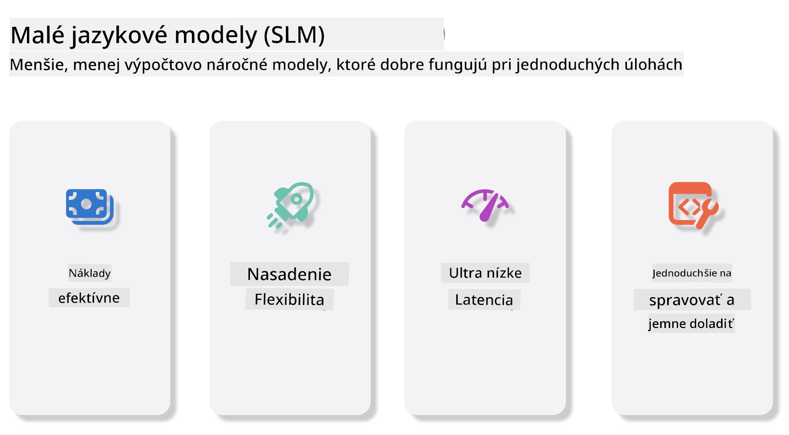
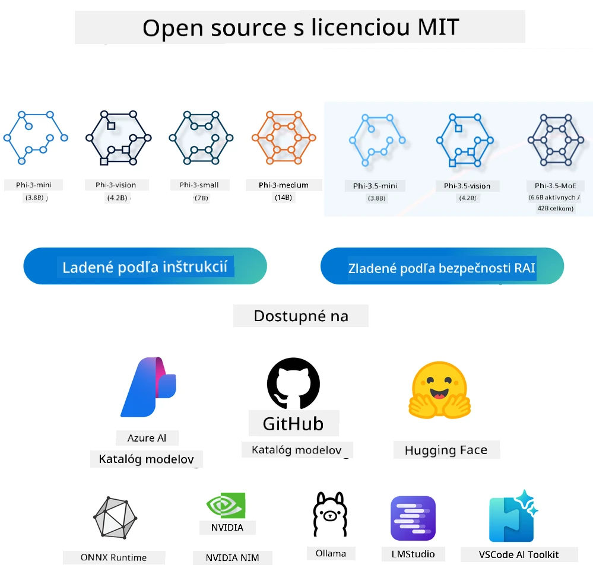
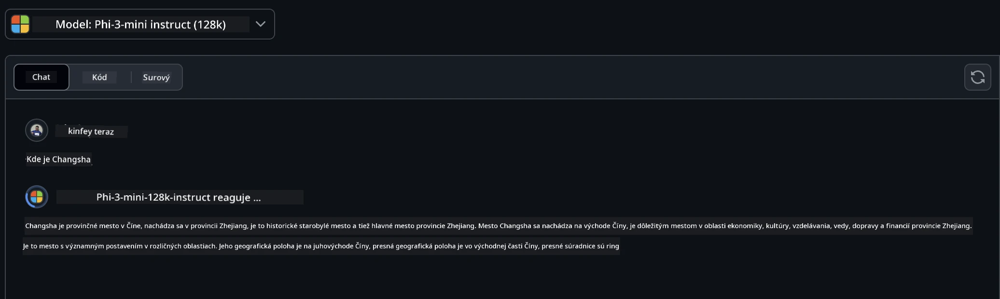
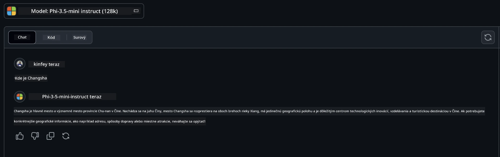

# Úvod do malých jazykových modelov pre generatívnu AI pre začiatočníkov
Generatívna AI je fascinujúca oblasť umelej inteligencie, ktorá sa zameriava na tvorbu systémov schopných generovať nový obsah. Tento obsah môže byť od textu a obrázkov až po hudbu a dokonca celé virtuálne prostredia. Jednou z najzaujímavejších aplikácií generatívnej AI je oblasť jazykových modelov.

## Čo sú malé jazykové modely?

Malý jazykový model (SLM) predstavuje zmenšenú verziu veľkého jazykového modelu (LLM), ktorá využíva mnohé architektonické princípy a techniky LLM, pričom má výrazne nižšie výpočtové nároky.

SLM sú podmnožinou jazykových modelov navrhnutých na generovanie textu podobného ľudskému. Na rozdiel od ich väčších náprotivkov, ako je GPT-4, sú SLM kompaktnejšie a efektívnejšie, čo ich robí ideálnymi pre aplikácie, kde sú obmedzené výpočtové zdroje. Napriek svojej menšej veľkosti môžu stále plniť rôzne úlohy. Zvyčajne sa SLM budujú kompresiou alebo destiláciou LLM, s cieľom zachovať značnú časť pôvodnej funkčnosti a jazykových schopností modelu. Tento znížený rozmer modelu znižuje celkovú zložitosť, čo robí SLM efektívnejšími z hľadiska používania pamäte aj výpočtových požiadaviek. Napriek týmto optimalizáciám môžu SLM vykonávať široké spektrum úloh spracovania prirodzeného jazyka (NLP):

- Generovanie textu: Tvorba koherentných a kontextovo relevantných viet alebo odstavcov.
- Dokončenie textu: Predpovedanie a dopĺňanie viet na základe daného podnetu.
- Preklad: Konverzia textu z jedného jazyka do druhého.
- Zhrnutie: Skracovanie dlhých textov do kratších, ľahšie stráviteľných súhrnov.

Aj keď s určitými kompromismi vo výkonnosti alebo hĺbke porozumenia v porovnaní s väčšími modelmi.

## Ako malé jazykové modely fungujú?
SLM sú trénované na obrovských množstvách textových dát. Počas tréningu sa učia vzory a štruktúry jazyka, čo im umožňuje generovať text, ktorý je gramaticky správny a kontextovo vhodný. Tréningový proces zahŕňa:

- Zber dát: Zhromažďovanie veľkých datasetov textu z rôznych zdrojov.
- Predspracovanie: Čistenie a organizácia dát tak, aby boli vhodné na tréning.
- Tréning: Použitie algoritmov strojového učenia na naučenie modelu rozumieť a generovať text.
- Doladenie: Úprava modelu pre zlepšenie výkonu na špecifických úlohách.

Vývoj SLM je v súlade so zvyšujúcou sa potrebou modelov, ktoré je možné nasadiť v prostrediach s obmedzenými zdrojmi, ako sú mobilné zariadenia alebo edge computing platformy, kde sú plnohodnotné LLM nepraktické kvôli ich veľkým nárokom na zdroje. Zameraním sa na efektivitu SLM vyvažujú výkon s dostupnosťou, čo umožňuje širšie využitie v rôznych oblastiach.



## Vzdelávacie ciele

V tejto lekcii sa snažíme predstaviť vedomosti o SLM a spojiť ich s Microsoft Phi-3, aby sme sa naučili rôzne scenáre v texte, vízii a MoE.

Na konci tejto lekcie by ste mali vedieť odpovedať na tieto otázky:

- Čo je SLM?
- Aký je rozdiel medzi SLM a LLM?
- Čo je rodina Microsoft Phi-3/3.5?
- Ako spustiť inferenciu s rodinou Microsoft Phi-3/3.5?

Pripravení? Poďme na to.

## Rozdiely medzi veľkými jazykovými modelmi (LLM) a malými jazykovými modelmi (SLM)

Oba, LLM a SLM, sú postavené na základných princípoch pravdepodobnostného strojového učenia s podobnými prístupmi v konštrukcii architektúry, metodikách tréningu, procesoch generovania dát a technikách hodnotenia modelov. Existuje však niekoľko kľúčových faktorov, ktoré tieto dva typy modelov odlišujú.

## Aplikácie malých jazykových modelov

SLM majú široké spektrum využitia, vrátane:

- Chatboty: Poskytovanie zákazníckej podpory a angažovanie sa s používateľmi v konverzačnej forme.
- Tvorba obsahu: Pomáhanie spisovateľom generovaním nápadov alebo dokonca tvorbou celých článkov.
- Vzdelávanie: Pomoc študentom pri písomných úlohách alebo učení nových jazykov.
- Prístupnosť: Vytváranie nástrojov pre osoby so zdravotným postihnutím, ako sú systémy prevodu textu na reč.

**Veľkosť**

Hlavný rozdiel medzi LLM a SLM spočíva v škále modelov. LLM, ako ChatGPT (GPT-4), môže obsahovať približne 1,76 bilióna parametrov, zatiaľ čo open-source SLM, napríklad Mistral 7B, sú navrhnuté s výrazne menším počtom parametrov – približne 7 miliárd. Tento rozdiel je spôsobený hlavne rozdielmi v architektúre a tréningových procesoch modelov. Napríklad ChatGPT používa mechanizmus self-attention v rámci rámca encoder-decoder, kým Mistral 7B využíva sliding window attention, čo umožňuje efektívnejšie trénovanie v modeli iba s dekóderom. Táto architektonická odlišnosť má hlboké dopady na zložitosť a výkon týchto modelov.

**Pochopenie**

SLM sú typicky optimalizované na výkon v konkrétnych doménach, čo ich robí vysoko špecializovanými, ale potenciálne obmedzenými v schopnosti poskytovať široké kontextuálne porozumenie naprieč viacerými oblasťami poznania. Naopak, LLM sa snažia simulovať ľudskú inteligenciu na komplexnejšej úrovni. Trénované na rozsiahlych, rôznorodých datasestoch, sú LLM navrhnuté tak, aby dobre fungovali v rôznych oblastiach, čo im zabezpečuje väčšiu všestrannosť a prispôsobivosť. Z tohto dôvodu sú LLM vhodnejšie na širšie spektrum downstream úloh, ako je spracovanie prirodzeného jazyka a programovanie.

**Výpočtové zdroje**

Tréning a nasadzovanie LLM sú náročné na zdroje, často vyžadujú rozsiahlu výpočtovú infraštruktúru vrátane veľkých GPU klastrov. Napríklad tréning modelu ako ChatGPT od začiatku môže vyžadovať tisíce GPU počas dlhého obdobia. Naopak, SLM s ich menším počtom parametrov sú prístupnejšie, čo sa týka výpočtových zdrojov. Modely ako Mistral 7B môžu byť trénované a spustené na lokálnych strojoch vybavených strednými GPU, hoci samotný tréning stále vyžaduje niekoľko hodín na viacerých GPU.

**Predsudky**

Predsudky sú známy problém LLM, prevažne kvôli povahe tréningových dát. Tieto modely často využívajú surové, verejne dostupné dáta z internetu, ktoré môžu podreprezentovať alebo nesprávne reprezentovať určité skupiny, obsahovať chybné označenia alebo odrážať jazykové predsudky ovplyvnené dialektmi, geografickými variáciami a gramatickými pravidlami. Okrem toho komplexnosť architektúry LLM môže neúmyselne predsudky zosilniť, čo môže zostať nepovšimnuté bez starostlivého doladenia. Naopak, SLM, ktoré sú trénované na obmedzenejších, doménovo špecifických datasetoch, sú inherentne menej náchylné na takéto predsudky, hoci im nie sú úplne imúnne.

**Inferencia**

Menšia veľkosť SLM im poskytuje výraznú výhodu v rýchlosti inferencie, umožňujúc generovanie výstupov efektívne na lokálnom hardvéri bez potreby rozsiahleho paralelného spracovania. Naproti tomu LLM kvôli svojej veľkosti a komplexite často vyžadujú značné paralelné výpočtové zdroje na dosiahnutie prijateľných časov inferencie. Prítomnosť viacerých súčasných používateľov navyše spomaľuje reakčný čas LLM, najmä pri nasadení vo veľkom meradle.

Na záver, hoci LLM a SLM zdieľajú základ v strojovom učení, výrazne sa líšia veľkosťou modelu, požiadavkami na zdroje, kontextovým porozumením, náchylnosťou na predsudky a rýchlosťou inferencie. Tieto rozdiely odrážajú ich vhodnosť pre rôzne prípady použitia, pričom LLM sú všestrannejšie, ale náročnejšie na zdroje, a SLM ponúkajú špecifickejšiu efektivitu s nižšími výpočtovými nárokmi.

***Poznámka: V tejto lekcii predstavíme SLM na príklade Microsoft Phi-3 / 3.5.***

## Predstavenie rodiny Phi-3 / Phi-3.5

Rodina Phi-3 / 3.5 je primárne zameraná na scenáre aplikácií v texte, vízii a Agente (MoE):

### Phi-3 / 3.5 Instruct

Predovšetkým na generovanie textu, dokončovanie konverzácií a extrakciu obsahových informácií a podobne.

**Phi-3-mini**

3.8 miliardový jazykový model je dostupný na Microsoft Azure AI Studio, Hugging Face a Ollama. Modely Phi-3 výrazne prekonávajú jazykové modely rovnakej alebo dokonca väčšej veľkosti na kľúčových benchmarkoch (pozri nižšie uvedené benchmarkové čísla, vyššie číslo znamená lepší výkon). Phi-3-mini prekonáva modely dvojnásobnej veľkosti, zatiaľ čo Phi-3-small a Phi-3-medium prekonávajú väčšie modely, vrátane GPT-3.5.

**Phi-3-small & medium**

S iba 7 miliardami parametrov Phi-3-small poráža GPT-3.5T v rôznych oblastiach jazyka, uvažovania, kódovania a matematiky.

Phi-3-medium s 14 miliardami parametrov pokračuje v tomto trende a prekonáva Gemini 1.0 Pro.

**Phi-3.5-mini**

Môžeme ho považovať za upgrade Phi-3-mini. Aj keď počet parametrov zostáva rovnaký, vylepšuje schopnosť podporovať viac jazykov (podpora viac ako 20 jazykov: arabčina, čínština, čeština, dánčina, holandčina, angličtina, finčina, francúzština, nemčina, hebrejčina, maďarčina, taliančina, japončina, kórejčina, norvégčina, poľština, portugalčina, ruština, španielčina, švédčina, thajčina, turečtina, ukrajinčina) a pridáva silnejšiu podporu pre dlhý kontext.

Phi-3.5-mini s 3.8 miliardami parametrov prekonáva jazykové modely rovnakej veľkosti a je porovnateľný s modelmi dvojnásobnej veľkosti.

### Phi-3 / 3.5 Vízia

Môžeme si predstaviť Instruct model Phi-3/3.5 ako schopnosť modelu Phi chápať, a Vízia je to, čo Phi dáva oči na pochopenie sveta.

**Phi-3-Vision**

Phi-3-vision, s iba 4.2 miliardami parametrov, pokračuje v trende a prekonáva väčšie modely ako Claude-3 Haiku a Gemini 1.0 Pro V v úlohách všeobecného vizuálneho uvažovania, OCR a chápaní tabuliek a diagramov.

**Phi-3.5-Vision**

Phi-3.5-Vision je tiež vylepšenie Phi-3-Vision, pridáva podporu pre viacero obrázkov. Môžete si ho predstaviť ako vylepšenie vízie, nielen máte možnosť vidieť obrázky, ale aj videá.

Phi-3.5-vision prekonáva väčšie modely ako Claude-3.5 Sonnet a Gemini 1.5 Flash v úlohách OCR, chápaní tabuliek a grafov a je porovnateľný vo všeobecnom vizuálnom uvažovaní. Podporuje viacero snímok vstupu, teda uvažovanie nad viacerými vstupnými obrázkami.

### Phi-3.5-MoE

***Mixture of Experts(MoE)*** umožňuje modelom byť predtrénované s oveľa menším výpočtovým úsilím, čo znamená, že môžete dramaticky zväčšiť veľkosť modelu alebo datasetu za rovnaký výpočtový rozpočet ako hustý model. Konkrétne model MoE by mal počas predtrénovania dosiahnuť rovnakú kvalitu ako jeho hustý náprotivok oveľa rýchlejšie.

Phi-3.5-MoE pozostáva z 16x3.8 miliardových expertných modulov. Phi-3.5-MoE s iba 6.6 miliardami aktívnych parametrov dosahuje podobnú úroveň uvažovania, porozumenia jazyka a matematiky ako oveľa väčšie modely.

Model rodiny Phi-3/3.5 môžeme používať na základe rôznych scenárov. Na rozdiel od LLM môžete Phi-3/3.5-mini alebo Phi-3/3.5-Vision nasadiť na edge zariadeniach.

## Ako používať modely rodiny Phi-3/3.5

Snažíme sa používať Phi-3/3.5 v rôznych scenároch. Nasledovne použijeme Phi-3/3.5 podľa rôznych scenárov.



### Inferencia cez cloudové API

**GitHub Models**

GitHub Models je najpriamejší spôsob. Rýchlo môžete pristupovať k modelu Phi-3/3.5-Instruct cez GitHub Models. V kombinácii s Azure AI Inference SDK / OpenAI SDK môžete cez kód pristupovať k API a vykonať volanie Phi-3/3.5-Instruct. Rovnako môžete testovať rôzne efekty cez Playground.

- Demo: Porovnanie efektov Phi-3-mini a Phi-3.5-mini pri čínskych scenároch






**Azure AI Studio**

Alebo ak chcete využívať víziu a MoE modely, môžete použiť Azure AI Studio na vykonanie volania. Ak máte záujem, môžete si prečítať Phi-3 Cookbook, ako volať Phi-3/3.5 Instruct, Vision, MoE cez Azure AI Studio [Kliknite na tento odkaz](https://github.com/microsoft/Phi-3CookBook/blob/main/md/02.QuickStart/AzureAIStudio_QuickStart.md?WT.mc_id=academic-105485-koreyst)

**NVIDIA NIM**

Okrem cloudových riešení Model Catalog ponúkaných Azure a GitHub, môžete tiež využiť [NVIDIA NIM](https://developer.nvidia.com/nim?WT.mc_id=academic-105485-koreyst) na vykonanie súvisiacich volaní. Môžete navštíviť NVIDIA NIM, aby ste realizovali API volania pre rodinu Phi-3/3.5. NVIDIA NIM (NVIDIA Inference Microservices) je sada akcelerovaných mikroservisov inferencie navrhnutých tak, aby pomohli vývojárom efektívne nasadzovať AI modely v rôznych prostrediach vrátane cloudov, dátových centier a pracovných staníc.

Tu sú niektoré kľúčové vlastnosti NVIDIA NIM:
- **Jednoduchosť nasadenia:** NIM umožňuje nasadenie AI modelov jedným príkazom, čo uľahčuje integráciu do existujúcich pracovných tokov.
- **Optimalizovaný výkon:** Využíva predoptimalizované inference enginy NVIDIA, ako TensorRT a TensorRT-LLM, aby zabezpečil nízku latenciu a vysokú priepustnosť.
- **Škálovateľnosť:** NIM podporuje automatické škálovanie na Kubernetes, čo mu umožňuje efektívne zvládať rôzne pracovné zaťaženia.
- **Bezpečnosť a kontrola:** Organizácie môžu zachovať kontrolu nad svojimi údajmi a aplikáciami prostredníctvom samohostingu NIM mikroslužieb na vlastnej spravovanej infraštruktúre.
- **Štandardné API:** NIM poskytuje priemyselné štandardné API, ktoré umožňujú jednoduchú tvorbu a integráciu AI aplikácií, ako sú chatboty, AI asistenti a ďalšie.

NIM je súčasťou NVIDIA AI Enterprise, ktorý si kladie za cieľ zjednodušiť nasadenie a prevádzku AI modelov a zabezpečiť ich efektívne spúšťanie na GPU NVIDIA.

- Demo: Použitie NVIDIA NIM na volanie Phi-3.5-Vision-API  [[Kliknite na tento odkaz](./python/Phi-3-Vision-Nividia-NIM.ipynb?WT.mc_id=academic-105485-koreyst)]


### Spustenie Phi-3/3.5 lokálne
Inference v súvislosti s Phi-3 alebo akýmkoľvek jazykovým modelom ako GPT-3 označuje proces generovania odpovedí alebo predpovedí na základe prijatého vstupu. Keď poskytnete Phi-3 podnet alebo otázku, využíva svoj trénovaný neurónový model na odvodenie najpravdepodobnejšej a najrelevantnejšej odpovede analýzou vzorov a vzťahov v údajoch, na ktorých bol trénovaný.

**Hugging Face Transformer**
Hugging Face Transformers je výkonná knižnica navrhnutá pre spracovanie prirodzeného jazyka (NLP) a ďalšie úlohy strojového učenia. Tu sú niektoré kľúčové body:

1. **Predtrénované modely:** Poskytuje tisíce predtrénovaných modelov, ktoré možno použiť na rôzne úlohy, ako sú klasifikácia textu, rozpoznávanie pomenovaných entít, odpovedanie na otázky, sumarizácia, preklad a generovanie textu.

2. **Interoperabilita rámcov:** Knižnica podporuje viacero hlbokých učených rámcov, vrátane PyTorch, TensorFlow a JAX. To umožňuje trénovať model v jednom rámci a použiť ho v inom.

3. **Multimodálne schopnosti:** Okrem NLP Hugging Face Transformers podporuje aj úlohy v počítačovom videní (napr. klasifikácia obrázkov, detekcia objektov) a spracovaní zvuku (napr. rozpoznávanie reči, klasifikácia zvuku).

4. **Jednoduchosť použitia:** Knižnica ponúka API a nástroje na jednoduché sťahovanie a dolaďovanie modelov, čím je prístupná pre začiatočníkov aj odborníkov.

5. **Komunita a zdroje:** Hugging Face má živú komunitu a rozsiahlu dokumentáciu, návody a príručky, ktoré pomáhajú používateľom rýchlo začať a čo najlepšie využiť knižnicu.
[oficiálna dokumentácia](https://huggingface.co/docs/transformers/index?WT.mc_id=academic-105485-koreyst) alebo ich [GitHub repozitár](https://github.com/huggingface/transformers?WT.mc_id=academic-105485-koreyst).

Toto je najbežnejšie používaná metóda, no zároveň vyžaduje GPU akceleráciu. Scenáre ako Vision a MoE totiž vyžadujú veľa výpočtov, ktoré by na CPU boli veľmi pomalé, pokiaľ nie sú kvantizované.


- Demo: Použitie Transformer na volanie Phi-3.5-Instruct [Kliknite na tento odkaz](./python/phi35-instruct-demo.ipynb?WT.mc_id=academic-105485-koreyst)

- Demo: Použitie Transformer na volanie Phi-3.5-Vision [Kliknite na tento odkaz](./python/phi35-vision-demo.ipynb?WT.mc_id=academic-105485-koreyst)

- Demo: Použitie Transformer na volanie Phi-3.5-MoE [Kliknite na tento odkaz](./python/phi35_moe_demo.ipynb?WT.mc_id=academic-105485-koreyst)

**Ollama**
[Ollama](https://ollama.com/?WT.mc_id=academic-105485-koreyst) je platforma navrhnutá tak, aby zjednodušila lokálne spúšťanie veľkých jazykových modelov (LLM) na vašom počítači. Podporuje rôzne modely ako Llama 3.1, Phi 3, Mistral alebo Gemma 2 a iné. Platforma zjednodušuje proces tak, že zabalí váhy modelu, konfiguráciu a dáta do jedného balíka, čo využívateľom uľahčuje prispôsobovanie a tvorbu vlastných modelov. Ollama je dostupná pre macOS, Linux a Windows. Je to skvelý nástroj, ak chcete experimentovať alebo nasadzovať LLM bez závislosti na cloudových službách. Ollama je najpriamejšia cesta, stačí spustiť nasledujúci príkaz.


```bash

ollama run phi3.5

```


**ONNX Runtime pre GenAI**

[ONNX Runtime](https://github.com/microsoft/onnxruntime-genai?WT.mc_id=academic-105485-koreyst) je multiplatformový akcelerátor pre inference a trénovanie strojového učenia. ONNX Runtime pre Generatívnu AI (GENAI) je výkonný nástroj, ktorý vám pomáha efektívne spúšťať generatívne AI modely na rôznych platformách.

## Čo je ONNX Runtime?
ONNX Runtime je open-source projekt, ktorý umožňuje vysokovýkonnú inferenciu modelov strojového učenia. Podporuje modely vo formáte Open Neural Network Exchange (ONNX), ktorý je štandardom pre reprezentáciu modelov strojového učenia. ONNX Runtime môže zrýchliť zákaznícke skúsenosti a znížiť náklady, podporuje modely z hlbokých učených frameworkov, ako sú PyTorch a TensorFlow/Keras, ako aj klasické knižnice strojového učenia ako scikit-learn, LightGBM, XGBoost a ďalšie. ONNX Runtime je kompatibilný s rôznym hardvérom, ovládačmi a operačnými systémami a poskytuje optimálny výkon využitím hardvérových akcelerátorov spolu s optimalizáciami a transformáciami grafov.

## Čo je Generatívna AI?
Generatívna AI označuje AI systémy, ktoré dokážu generovať nový obsah, ako text, obrázky alebo hudbu, na základe dát, na ktorých boli trénované. Príklady zahŕňajú jazykové modely ako GPT-3 a modely generovania obrázkov ako Stable Diffusion. Knižnica ONNX Runtime pre GenAI poskytuje generatívnu AI slučku pre ONNX modely vrátane inferencie pomocou ONNX Runtime, spracovania logits, vyhľadávania a vzorkovania, a správy KV cache.

## ONNX Runtime pre GENAI
ONNX Runtime pre GENAI rozširuje schopnosti ONNX Runtime na podporu generatívnych AI modelov. Tu sú niektoré kľúčové vlastnosti:

- **Široká podpora platforiem:** Funguje na rôznych platformách vrátane Windows, Linux, macOS, Android a iOS.
- **Podpora modelov:** Podporuje mnohé populárne generatívne AI modely, ako LLaMA, GPT-Neo, BLOOM a ďalšie.
- **Optimalizácia výkonu:** Obsahuje optimalizácie pre rôzne hardvérové akcelerátory ako NVIDIA GPU, AMD GPU a ďalšie.
- **Jednoduchosť použitia:** Ponúka API pre jednoduchú integráciu do aplikácií, ktoré umožňujú generovať text, obrázky a ďalší obsah s minimom kódu.
- Používatelia môžu volať vysokú úroveň generate() metódy alebo spustiť každý krok modelu v slučke, generujúc token po tokene a voliteľne aktualizovať parametre generovania v slučke.
- ONNX runtime tiež podporuje greedy/beam search a TopP, TopK vzorkovanie pre generovanie sekvencií tokenov a vstavané spracovanie logits ako penalizácie opakovania. Je možné ľahko pridávať vlastné skórovania.

## Začíname
Ak chcete začať s ONNX Runtime pre GENAI, môžete nasledovať tieto kroky:

### Inštalácia ONNX Runtime:
```Python
pip install onnxruntime
```
### Inštalácia rozšírení pre generatívnu AI:
```Python
pip install onnxruntime-genai
```

### Spustenie modelu: Tu je jednoduchý príklad v Pythone:
```Python
import onnxruntime_genai as og

model = og.Model('path_to_your_model.onnx')

tokenizer = og.Tokenizer(model)

input_text = "Hello, how are you?"

input_tokens = tokenizer.encode(input_text)

output_tokens = model.generate(input_tokens)

output_text = tokenizer.decode(output_tokens)

print(output_text) 
```
### Demo: Použitie ONNX Runtime GenAI na volanie Phi-3.5-Vision


```python

import onnxruntime_genai as og

model_path = './Your Phi-3.5-vision-instruct ONNX Path'

img_path = './Your Image Path'

model = og.Model(model_path)

processor = model.create_multimodal_processor()

tokenizer_stream = processor.create_stream()

text = "Your Prompt"

prompt = "<|user|>\n"

prompt += "<|image_1|>\n"

prompt += f"{text}<|end|>\n"

prompt += "<|assistant|>\n"

image = og.Images.open(img_path)

inputs = processor(prompt, images=image)

params = og.GeneratorParams(model)

params.set_inputs(inputs)

params.set_search_options(max_length=3072)

generator = og.Generator(model, params)

while not generator.is_done():

    generator.compute_logits()
    
    generator.generate_next_token()

    new_token = generator.get_next_tokens()[0]
    
    output = tokenizer_stream.decode(new_token)
    
    print(tokenizer_stream.decode(new_token), end='', flush=True)

```


**Iné**

Okrem referenčných metód ONNX Runtime a Ollama môžeme doplniť referenciu kvantitatívnych modelov na základe referenčných metód modelov poskytovaných rôznymi výrobcami, napríklad Apple MLX framework s Apple Metal, Qualcomm QNN s NPU, Intel OpenVINO s CPU/GPU a pod. Viac obsahu môžete získať z [Phi-3 Cookbook](https://github.com/microsoft/phi-3cookbook?WT.mc_id=academic-105485-koreyst)


## Viac

Zoznámili sme sa so základmi rodiny Phi-3/3.5, ale na lepšie pochopenie SLM potrebujeme viac vedomostí. Odpovede nájdete v Phi-3 Cookbook. Ak sa chcete dozvedieť viac, navštívte prosím [Phi-3 Cookbook](https://github.com/microsoft/phi-3cookbook?WT.mc_id=academic-105485-koreyst).

---

<!-- CO-OP TRANSLATOR DISCLAIMER START -->
**Zrieknutie sa zodpovednosti**:
Tento dokument bol preložený pomocou AI prekladateľskej služby [Co-op Translator](https://github.com/Azure/co-op-translator). Hoci sa snažíme o presnosť, vezmite prosím na vedomie, že automatizované preklady môžu obsahovať chyby alebo nepresnosti. Originálny dokument v pôvodnom jazyku by mal byť považovaný za autoritatívny zdroj. Pre kritické informácie sa odporúča profesionálny ľudský preklad. Neberieme zodpovednosť za akékoľvek nedorozumenia alebo nesprávne výklady vyplývajúce z použitia tohto prekladu.
<!-- CO-OP TRANSLATOR DISCLAIMER END -->