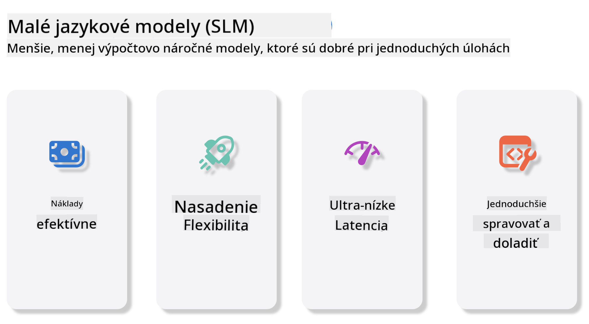
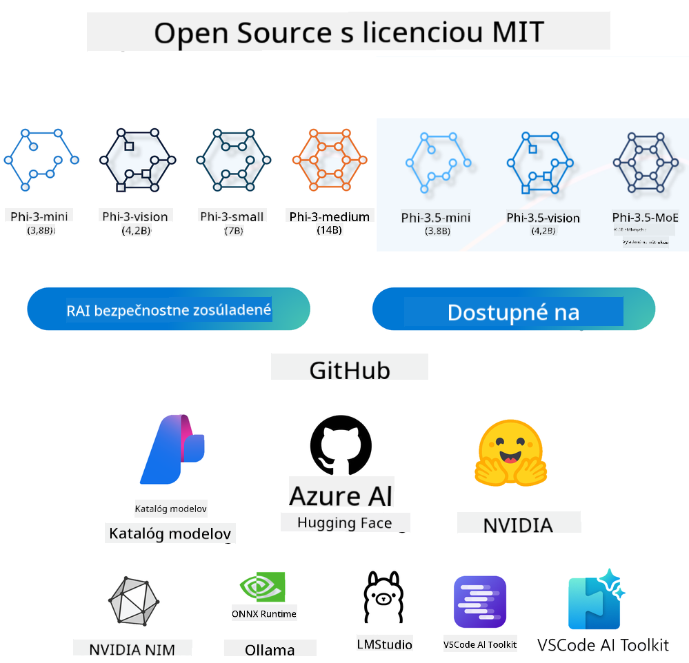

<!--
CO_OP_TRANSLATOR_METADATA:
{
  "original_hash": "124ad36cfe96f74038811b6e2bb93e9d",
  "translation_date": "2025-07-09T18:47:14+00:00",
  "source_file": "19-slm/README.md",
  "language_code": "sk"
}
-->
# Úvod do malých jazykových modelov pre generatívnu AI pre začiatočníkov  
Generatívna AI je fascinujúca oblasť umelej inteligencie, ktorá sa zameriava na vytváranie systémov schopných generovať nový obsah. Tento obsah môže byť text, obrázky, hudba alebo dokonca celé virtuálne prostredia. Jednou z najzaujímavejších aplikácií generatívnej AI sú jazykové modely.

## Čo sú malé jazykové modely?  
Malý jazykový model (SLM) predstavuje zmenšenú verziu veľkého jazykového modelu (LLM), ktorá využíva mnohé architektonické princípy a techniky LLM, no s výrazne nižšími nárokmi na výpočtový výkon.

SLM sú podmnožinou jazykových modelov navrhnutých na generovanie textu podobného ľudskému. Na rozdiel od ich väčších náprotivkov, ako je GPT-4, sú SLM kompaktnejšie a efektívnejšie, čo ich robí ideálnymi pre aplikácie s obmedzenými výpočtovými zdrojmi. Napriek menšej veľkosti dokážu vykonávať rôzne úlohy. Zvyčajne sa SLM vytvárajú kompresiou alebo destiláciou LLM s cieľom zachovať podstatnú časť pôvodnej funkčnosti a jazykových schopností modelu. Zmenšenie veľkosti modelu znižuje jeho celkovú zložitosť, čím sa SLM stávajú efektívnejšími z hľadiska pamäte aj výpočtových požiadaviek. Napriek týmto optimalizáciám môžu SLM vykonávať širokú škálu úloh spracovania prirodzeného jazyka (NLP):

- Generovanie textu: tvorba zmysluplných a kontextovo relevantných viet alebo odstavcov.  
- Dokončovanie textu: predpovedanie a dopĺňanie viet na základe daného podnetu.  
- Preklad: prevod textu z jedného jazyka do druhého.  
- Zhrnutie: skrátenie dlhých textov do stručnejších a ľahšie stráviteľných súhrnov.  

Aj keď s určitými kompromismi vo výkone alebo hĺbke porozumenia v porovnaní s väčšími modelmi.

## Ako malé jazykové modely fungujú?  
SLM sa trénujú na obrovskom množstve textových dát. Počas tréningu sa učia vzory a štruktúry jazyka, čo im umožňuje generovať text, ktorý je gramaticky správny a kontextovo vhodný. Proces tréningu zahŕňa:

- Zber dát: zhromažďovanie veľkých datasetov textu z rôznych zdrojov.  
- Predspracovanie: čistenie a organizovanie dát, aby boli vhodné na tréning.  
- Tréning: použitie algoritmov strojového učenia na naučenie modelu porozumieť a generovať text.  
- Doladenie: úprava modelu na zlepšenie jeho výkonu pri konkrétnych úlohách.  

Vývoj SLM reaguje na rastúcu potrebu modelov, ktoré je možné nasadiť v prostrediach s obmedzenými zdrojmi, ako sú mobilné zariadenia alebo edge computing platformy, kde by plnohodnotné LLM boli nepraktické kvôli vysokým nárokom na zdroje. Zameraním sa na efektivitu SLM vyvažujú výkon a dostupnosť, čo umožňuje širšie využitie v rôznych oblastiach.



## Ciele učenia  
V tejto lekcii sa snažíme predstaviť poznatky o SLM a spojiť ich s Microsoft Phi-3, aby sme sa naučili rôzne scenáre v oblasti textového obsahu, videnia a MoE.

Na konci tejto lekcie by ste mali vedieť odpovedať na nasledujúce otázky:

- Čo je SLM  
- Aký je rozdiel medzi SLM a LLM  
- Čo je Microsoft Phi-3/3.5 rodina  
- Ako vykonať inferenciu s Microsoft Phi-3/3.5 rodinou  

Pripravení? Poďme na to.

## Rozdiely medzi veľkými jazykovými modelmi (LLM) a malými jazykovými modelmi (SLM)  
Oba modely, LLM aj SLM, sú postavené na základných princípoch pravdepodobnostného strojového učenia a používajú podobné prístupy v architektúre, metódach tréningu, procesoch generovania dát a hodnotení modelov. Napriek tomu existuje niekoľko kľúčových faktorov, ktoré tieto dva typy modelov odlišujú.

## Aplikácie malých jazykových modelov  
SLM majú široké spektrum využitia, vrátane:

- Chatboti: poskytovanie zákazníckej podpory a komunikácia s používateľmi v konverzačnej forme.  
- Tvorba obsahu: pomoc spisovateľom pri generovaní nápadov alebo dokonca písaní celých článkov.  
- Vzdelávanie: pomoc študentom pri písaní úloh alebo učení sa nových jazykov.  
- Prístupnosť: tvorba nástrojov pre osoby so zdravotným postihnutím, napríklad systémy na prevod textu na reč.  

**Veľkosť**  
Hlavný rozdiel medzi LLM a SLM spočíva vo veľkosti modelov. LLM, ako napríklad ChatGPT (GPT-4), môžu obsahovať odhadom 1,76 bilióna parametrov, zatiaľ čo open-source SLM ako Mistral 7B majú výrazne menej parametrov – približne 7 miliárd. Tento rozdiel vyplýva najmä z odlišnej architektúry a tréningových procesov. Napríklad ChatGPT používa mechanizmus self-attention v rámci encoder-decoder architektúry, zatiaľ čo Mistral 7B využíva sliding window attention, čo umožňuje efektívnejší tréning v rámci decoder-only modelu. Táto architektonická odlišnosť má zásadný vplyv na zložitosť a výkon modelov.

**Porozumenie**  
SLM sú zvyčajne optimalizované na výkon v konkrétnych oblastiach, čo ich robí vysoko špecializovanými, ale potenciálne obmedzenými v schopnosti poskytovať široké kontextové porozumenie naprieč viacerými oblasťami poznania. Naopak, LLM sa snažia simulovať ľudskú inteligenciu na komplexnejšej úrovni. Trénované na rozsiahlych a rôznorodých datasetoch, LLM sú navrhnuté tak, aby dobre fungovali v rôznych oblastiach, ponúkajúc väčšiu všestrannosť a prispôsobivosť. Preto sú LLM vhodnejšie pre širšie spektrum úloh, ako je spracovanie prirodzeného jazyka a programovanie.

**Výpočtové nároky**  
Tréning a nasadenie LLM sú náročné na zdroje, často vyžadujú rozsiahlu výpočtovú infraštruktúru vrátane veľkých GPU klastrov. Napríklad tréning modelu ako ChatGPT od základov môže vyžadovať tisíce GPU počas dlhých období. Naopak, SLM s menším počtom parametrov sú dostupnejšie z hľadiska výpočtových zdrojov. Modely ako Mistral 7B je možné trénovať a spúšťať na lokálnych zariadeniach s miernymi GPU kapacitami, hoci tréning stále vyžaduje niekoľko hodín na viacerých GPU.

**Bias (predpojatosť)**  
Bias je známy problém LLM, ktorý vyplýva najmä z povahy tréningových dát. Tieto modely často používajú surové, verejne dostupné dáta z internetu, ktoré môžu nedostatočne zastupovať alebo nesprávne reprezentovať určité skupiny, obsahovať chybné označenia alebo odrážať jazykové predsudky ovplyvnené dialektmi, geografickými rozdielmi a gramatickými pravidlami. Okrem toho môže zložitosť architektúry LLM neúmyselne zhoršovať tieto predsudky, ktoré môžu zostať nepovšimnuté bez dôkladného doladenia. Naopak, SLM, ktoré sa trénujú na obmedzenejších, doménovo špecifických datasetoch, sú prirodzene menej náchylné na takéto predsudky, hoci úplne im neunikajú.

**Inferencia**  
Menšia veľkosť SLM im poskytuje výraznú výhodu v rýchlosti inferencie, čo im umožňuje efektívne generovať výstupy na lokálnom hardvéri bez potreby rozsiahleho paralelného spracovania. Naopak, LLM kvôli svojej veľkosti a zložitosti často vyžadujú značné paralelné výpočtové zdroje na dosiahnutie prijateľných časov inferencie. Prítomnosť viacerých súbežných používateľov ešte viac spomaľuje reakčné časy LLM, najmä pri nasadení vo veľkom meradle.

Na záver, hoci LLM aj SLM zdieľajú základné princípy strojového učenia, výrazne sa líšia vo veľkosti modelu, požiadavkách na zdroje, schopnosti kontextového porozumenia, náchylnosti na predsudky a rýchlosti inferencie. Tieto rozdiely odrážajú ich vhodnosť pre rôzne použitia – LLM sú všestrannejšie, ale náročnejšie na zdroje, zatiaľ čo SLM ponúkajú efektívnosť v špecifických oblastiach s nižšími výpočtovými nárokmi.

***Poznámka: V tejto kapitole predstavíme SLM na príklade Microsoft Phi-3 / 3.5.***

## Predstavenie rodiny Phi-3 / Phi-3.5  
Rodina Phi-3 / 3.5 je primárne zameraná na textové, vizuálne a Agent (MoE) aplikačné scenáre:

### Phi-3 / 3.5 Instruct  
Hlavne pre generovanie textu, dokončovanie konverzácií a extrakciu obsahových informácií.

**Phi-3-mini**  
3,8 miliardy parametrov, dostupný na Microsoft Azure AI Studio, Hugging Face a Ollama. Modely Phi-3 výrazne prekonávajú jazykové modely rovnakej alebo väčšej veľkosti v kľúčových benchmarkoch (viď nižšie, vyššie čísla znamenajú lepší výkon). Phi-3-mini prekonáva modely dvojnásobnej veľkosti, zatiaľ čo Phi-3-small a Phi-3-medium prekonávajú väčšie modely vrátane GPT-3.5.

**Phi-3-small & medium**  
S iba 7 miliardami parametrov Phi-3-small prekonáva GPT-3.5T v rôznych jazykových, logických, kódovacích a matematických benchmarkoch.  
Phi-3-medium s 14 miliardami parametrov pokračuje v tomto trende a prekonáva Gemini 1.0 Pro.

**Phi-3.5-mini**  
Môžeme ho považovať za vylepšenú verziu Phi-3-mini. Parametre zostávajú rovnaké, no zlepšuje podporu viacerých jazykov (podpora viac ako 20 jazykov: arabčina, čínština, čeština, dánčina, holandčina, angličtina, fínčina, francúzština, nemčina, hebrejčina, maďarčina, taliančina, japončina, kórejčina, norčina, poľština, portugalčina, ruština, španielčina, švédčina, thajčina, turečtina, ukrajinčina) a pridáva silnejšiu podporu pre dlhý kontext.  
Phi-3.5-mini s 3,8 miliardami parametrov prekonáva jazykové modely rovnakej veľkosti a je porovnateľný s modelmi dvojnásobnej veľkosti.

### Phi-3 / 3.5 Vision  
Môžeme si predstaviť Instruct model Phi-3/3.5 ako schopnosť Phi rozumieť, a Vision je to, čo Phi dáva oči na pochopenie sveta.

**Phi-3-Vision**  
Phi-3-Vision, s iba 4,2 miliardami parametrov, pokračuje v trende a prekonáva väčšie modely ako Claude-3 Haiku a Gemini 1.0 Pro V v úlohách všeobecného vizuálneho uvažovania, OCR a porozumenia tabuliek a diagramov.

**Phi-3.5-Vision**  
Phi-3.5-Vision je tiež vylepšením Phi-3-Vision, pridáva podporu pre viacero obrázkov. Môžeme ho vnímať ako zlepšenie vo videní – nielenže vidí obrázky, ale aj videá.  
Phi-3.5-Vision prekonáva väčšie modely ako Claude-3.5 Sonnet a Gemini 1.5 Flash v úlohách OCR, porozumenia tabuliek a grafov a je porovnateľný v úlohách všeobecného vizuálneho uvažovania. Podporuje viacnásobný vstup snímok, teda uvažovanie nad viacerými vstupnými obrázkami.

### Phi-3.5-MoE  
***Mixture of Experts (MoE)*** umožňuje modelom byť predtrénované s oveľa menšími výpočtovými nákladmi, čo znamená, že môžete dramaticky zväčšiť veľkosť modelu alebo datasetu pri rovnakom výpočtovom rozpočte ako hustý model. Konkrétne, MoE model by mal dosiahnuť rovnakú kvalitu ako jeho hustý náprotivok oveľa rýchlejšie počas predtrénovania.

Phi-3.5-MoE pozostáva zo 16x3,8 miliardových expertných modulov. Phi-3.5-MoE s iba 6,6 miliardami aktívnych parametrov dosahuje podobnú úroveň uvažovania, porozumenia jazyka a matematiky ako oveľa väčšie modely.

Modely rodiny Phi-3/3.5 môžeme používať podľa rôznych scenárov. Na rozdiel od LLM môžete Phi-3/3.5-mini alebo Phi-3/3.5-Vision nasadiť na edge zariadeniach.

## Ako používať modely rodiny Phi-3/3.5  
Chceme využiť Phi-3/3.5 v rôznych scenároch. Ďalej použijeme Phi-3/3.5 podľa rôznych situácií.



### Rozdiely v inferencii cez cloudové API  

**GitHub Models**  
GitHub Models je najpriamejší spôsob. Môžete rýchlo pristupovať k modelu Phi-3/3.5-Instruct cez GitHub Models. V kombinácii s Azure AI Inference SDK / OpenAI SDK môžete cez kód volať API a dokončiť volanie Phi-3/3.5-Instruct. Rôzne výsledky môžete tiež testovať cez Playground.

- Demo: Porovnanie efektov Phi-3-mini a Phi-3.5-mini v čínskych scenároch


**Azure AI Studio**  
Ak chcete používať modely Vision a MoE, môžete využiť Azure AI Studio na vykonanie volaní. Ak máte záujem, môžete si prečítať Phi-3 Cookbook, kde sa naučíte, ako volať Phi-3/3.5 Instruct, Vision a MoE cez Azure AI Studio [Kliknite na tento odkaz](https://github.com/microsoft/Phi-3CookBook/blob/main/md/02.QuickStart/AzureAIStudio_QuickStart.md?WT.mc_id=academic-105485-koreyst)

**NVIDIA NIM**  
Okrem cloudových riešení Model Catalog poskytovaných Azure a GitHub môžete využiť aj [NVIDIA NIM](https://developer.nvidia.com/nim?WT.mc_id=academic-105485-koreyst) na vykonanie súvisiacich volaní. NVIDIA NIM (NVIDIA Inference Microservices) je súbor akcelerovaných mikroservisov na inferenciu, ktoré pomáhajú vývojárom efektívne nasadzovať AI modely v rôznych prostrediach, vrátane cloudov, dátových centier a pracovných staníc.

Kľúčové vlastnosti NVIDIA NIM:

- **Jednoduchosť nasadenia:** NIM umožňuje nasadiť AI modely jediným príkazom, čo uľahčuje integráciu do existujúcich pracovných tokov.  
- **Optimalizovaný výkon:** Využíva predoptimalizované inferenčné enginy NVIDIA
- **Bezpečnosť a kontrola:** Organizácie môžu udržiavať kontrolu nad svojimi dátami a aplikáciami tým, že si NIM mikroslužby nasadia na vlastnej spravovanej infraštruktúre.
- **Štandardné API:** NIM poskytuje priemyselné štandardné API, čo uľahčuje vytváranie a integráciu AI aplikácií, ako sú chatboty, AI asistenti a ďalšie.

NIM je súčasťou NVIDIA AI Enterprise, ktorého cieľom je zjednodušiť nasadenie a prevádzku AI modelov a zabezpečiť ich efektívny beh na NVIDIA GPU.

- Demo: Použitie Nvidia NIM na volanie Phi-3.5-Vision-API [[Kliknite na tento odkaz](../../../19-slm/python/Phi-3-Vision-Nividia-NIM.ipynb)]


### Inference Phi-3/3.5 v lokálnom prostredí
Inference v súvislosti s Phi-3 alebo akýmkoľvek jazykovým modelom ako GPT-3 znamená proces generovania odpovedí alebo predpovedí na základe vstupu, ktorý model dostane. Keď zadáte prompt alebo otázku Phi-3, využije svoj trénovaný neurónový model na odhad najpravdepodobnejšej a relevantnej odpovede analýzou vzorov a vzťahov v dátach, na ktorých bol trénovaný.

**Hugging Face Transformer**  
Hugging Face Transformers je výkonná knižnica určená na spracovanie prirodzeného jazyka (NLP) a ďalšie úlohy strojového učenia. Tu sú niektoré kľúčové body:

1. **Predtrénované modely:** Poskytuje tisíce predtrénovaných modelov, ktoré možno použiť na rôzne úlohy, ako je klasifikácia textu, rozpoznávanie pomenovaných entít, odpovedanie na otázky, sumarizácia, preklad a generovanie textu.

2. **Podpora viacerých frameworkov:** Knižnica podporuje viaceré frameworky hlbokého učenia, vrátane PyTorch, TensorFlow a JAX. To umožňuje trénovať model v jednom frameworku a používať ho v inom.

3. **Multimodálne schopnosti:** Okrem NLP podporuje Hugging Face Transformers aj úlohy v počítačovom videní (napr. klasifikácia obrázkov, detekcia objektov) a spracovaní zvuku (napr. rozpoznávanie reči, klasifikácia zvuku).

4. **Jednoduchosť použitia:** Knižnica ponúka API a nástroje na jednoduché stiahnutie a doladenie modelov, čo ju robí prístupnou pre začiatočníkov aj expertov.

5. **Komunita a zdroje:** Hugging Face má aktívnu komunitu a rozsiahlu dokumentáciu, návody a príručky, ktoré pomáhajú používateľom začať a vyťažiť z knižnice maximum.  
[oficiálna dokumentácia](https://huggingface.co/docs/transformers/index?WT.mc_id=academic-105485-koreyst) alebo ich [GitHub repozitár](https://github.com/huggingface/transformers?WT.mc_id=academic-105485-koreyst).

Toto je najčastejšie používaná metóda, ale vyžaduje aj GPU akceleráciu. Scény ako Vision a MoE totiž vyžadujú veľa výpočtov, ktoré budú na CPU veľmi obmedzené, ak nie sú kvantizované.


- Demo: Použitie Transformer na volanie Phi-3.5-Instuct [Kliknite na tento odkaz](../../../19-slm/python/phi35-instruct-demo.ipynb)

- Demo: Použitie Transformer na volanie Phi-3.5-Vision [Kliknite na tento odkaz](../../../19-slm/python/phi35-vision-demo.ipynb)

- Demo: Použitie Transformer na volanie Phi-3.5-MoE [Kliknite na tento odkaz](../../../19-slm/python/phi35_moe_demo.ipynb)

**Ollama**  
[Ollama](https://ollama.com/?WT.mc_id=academic-105485-koreyst) je platforma navrhnutá tak, aby uľahčila spúšťanie veľkých jazykových modelov (LLM) lokálne na vašom zariadení. Podporuje rôzne modely ako Llama 3.1, Phi 3, Mistral a Gemma 2, medzi inými. Platforma zjednodušuje proces tým, že kombinuje váhy modelu, konfiguráciu a dáta do jedného balíka, čo používateľom umožňuje jednoduchšie prispôsobovať a vytvárať vlastné modely. Ollama je dostupná pre macOS, Linux a Windows. Je to skvelý nástroj, ak chcete experimentovať s LLM alebo ich nasadiť bez závislosti na cloudových službách. Ollama je najpriamejšia cesta, stačí spustiť nasledujúci príkaz.


```bash

ollama run phi3.5

```


**ONNX Runtime pre GenAI**

[ONNX Runtime](https://github.com/microsoft/onnxruntime-genai?WT.mc_id=academic-105485-koreyst) je multiplatformový akcelerátor pre inferenciu a trénovanie strojového učenia. ONNX Runtime pre Generative AI (GENAI) je výkonný nástroj, ktorý vám pomáha efektívne spúšťať generatívne AI modely na rôznych platformách.

## Čo je ONNX Runtime?  
ONNX Runtime je open-source projekt, ktorý umožňuje vysoko výkonnú inferenciu modelov strojového učenia. Podporuje modely vo formáte Open Neural Network Exchange (ONNX), ktorý je štandardom pre reprezentáciu modelov strojového učenia. ONNX Runtime inferencia môže zabezpečiť rýchlejšie zákaznícke skúsenosti a nižšie náklady, podporujúc modely z frameworkov hlbokého učenia ako PyTorch a TensorFlow/Keras, ako aj klasické knižnice strojového učenia ako scikit-learn, LightGBM, XGBoost a ďalšie. ONNX Runtime je kompatibilný s rôznym hardvérom, ovládačmi a operačnými systémami a poskytuje optimálny výkon využitím hardvérových akcelerátorov tam, kde je to možné, spolu s optimalizáciami a transformáciami grafov.

## Čo je Generatívna AI?  
Generatívna AI označuje AI systémy, ktoré dokážu vytvárať nový obsah, ako text, obrázky alebo hudbu, na základe dát, na ktorých boli trénované. Príkladmi sú jazykové modely ako GPT-3 a modely na generovanie obrázkov ako Stable Diffusion. Knižnica ONNX Runtime pre GenAI poskytuje generatívnu AI slučku pre ONNX modely, vrátane inferencie s ONNX Runtime, spracovania logitov, vyhľadávania a vzorkovania a správy KV cache.

## ONNX Runtime pre GENAI  
ONNX Runtime pre GENAI rozširuje schopnosti ONNX Runtime o podporu generatívnych AI modelov. Tu sú niektoré kľúčové vlastnosti:

- **Široká podpora platforiem:** Funguje na rôznych platformách vrátane Windows, Linux, macOS, Android a iOS.
- **Podpora modelov:** Podporuje mnoho populárnych generatívnych AI modelov, ako LLaMA, GPT-Neo, BLOOM a ďalšie.
- **Optimalizácia výkonu:** Obsahuje optimalizácie pre rôzne hardvérové akcelerátory ako NVIDIA GPU, AMD GPU a ďalšie.
- **Jednoduchosť použitia:** Poskytuje API pre jednoduchú integráciu do aplikácií, umožňujúc generovať text, obrázky a iný obsah s minimálnym kódom.
- Používatelia môžu volať vysokoúrovňovú metódu generate(), alebo spúšťať každú iteráciu modelu v slučke, generujúc jeden token naraz a voliteľne meniť parametre generovania v rámci slučky.
- ONNX Runtime tiež podporuje greedy/beam search a TopP, TopK vzorkovanie na generovanie sekvencií tokenov a vstavané spracovanie logitov ako penalizácie opakovania. Môžete tiež jednoducho pridať vlastné skórovanie.

## Začíname  
Ak chcete začať s ONNX Runtime pre GENAI, postupujte podľa týchto krokov:

### Inštalácia ONNX Runtime:  
```Python
pip install onnxruntime
```  
### Inštalácia rozšírení pre Generatívnu AI:  
```Python
pip install onnxruntime-genai
```

### Spustenie modelu: Tu je jednoduchý príklad v Pythone:  
```Python
import onnxruntime_genai as og

model = og.Model('path_to_your_model.onnx')

tokenizer = og.Tokenizer(model)

input_text = "Hello, how are you?"

input_tokens = tokenizer.encode(input_text)

output_tokens = model.generate(input_tokens)

output_text = tokenizer.decode(output_tokens)

print(output_text) 
```  
### Demo: Použitie ONNX Runtime GenAI na volanie Phi-3.5-Vision


```python

import onnxruntime_genai as og

model_path = './Your Phi-3.5-vision-instruct ONNX Path'

img_path = './Your Image Path'

model = og.Model(model_path)

processor = model.create_multimodal_processor()

tokenizer_stream = processor.create_stream()

text = "Your Prompt"

prompt = "<|user|>\n"

prompt += "<|image_1|>\n"

prompt += f"{text}<|end|>\n"

prompt += "<|assistant|>\n"

image = og.Images.open(img_path)

inputs = processor(prompt, images=image)

params = og.GeneratorParams(model)

params.set_inputs(inputs)

params.set_search_options(max_length=3072)

generator = og.Generator(model, params)

while not generator.is_done():

    generator.compute_logits()
    
    generator.generate_next_token()

    new_token = generator.get_next_tokens()[0]
    
    code += tokenizer_stream.decode(new_token)
    
    print(tokenizer_stream.decode(new_token), end='', flush=True)

```


**Ostatné**

Okrem referenčných metód ONNX Runtime a Ollama môžeme tiež doplniť referenciu kvantitatívnych modelov na základe referenčných metód modelov poskytovaných rôznymi výrobcami. Napríklad Apple MLX framework s Apple Metal, Qualcomm QNN s NPU, Intel OpenVINO s CPU/GPU a podobne. Viac informácií nájdete aj v [Phi-3 Cookbook](https://github.com/microsoft/phi-3cookbook?WT.mc_id=academic-105485-koreyst).


## Viac

Naučili sme sa základy rodiny Phi-3/3.5, ale na hlbšie pochopenie SLM potrebujeme viac vedomostí. Odpovede nájdete v Phi-3 Cookbook. Ak chcete vedieť viac, navštívte prosím [Phi-3 Cookbook](https://github.com/microsoft/phi-3cookbook?WT.mc_id=academic-105485-koreyst).

**Vyhlásenie o zodpovednosti**:  
Tento dokument bol preložený pomocou AI prekladateľskej služby [Co-op Translator](https://github.com/Azure/co-op-translator). Hoci sa snažíme o presnosť, prosím, majte na pamäti, že automatizované preklady môžu obsahovať chyby alebo nepresnosti. Originálny dokument v jeho pôvodnom jazyku by mal byť považovaný za autoritatívny zdroj. Pre kritické informácie sa odporúča profesionálny ľudský preklad. Nie sme zodpovední za akékoľvek nedorozumenia alebo nesprávne interpretácie vyplývajúce z použitia tohto prekladu.