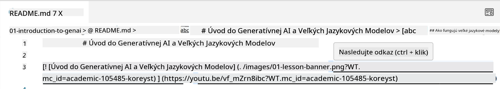
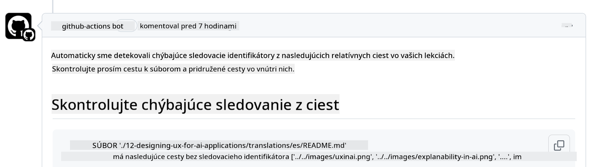
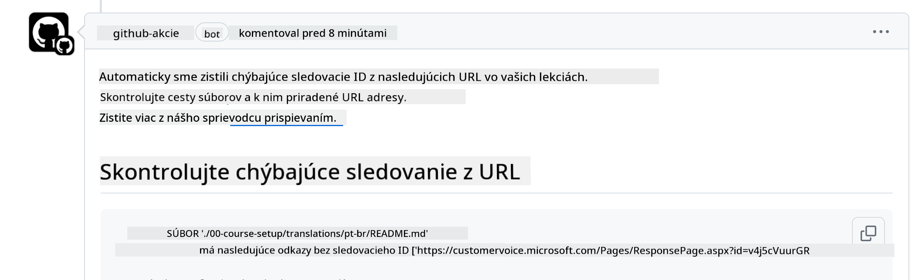
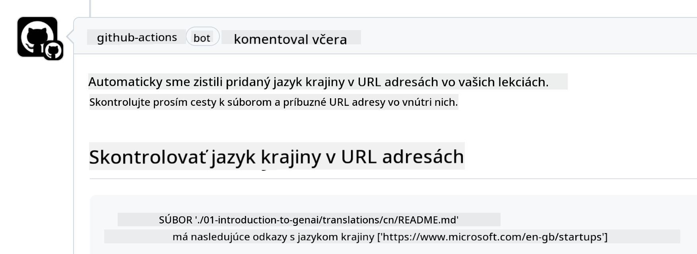

<!--
CO_OP_TRANSLATOR_METADATA:
{
  "original_hash": "57c41f2af71001a2cff9d8eb797cb843",
  "translation_date": "2025-05-19T11:24:20+00:00",
  "source_file": "CONTRIBUTING.md",
  "language_code": "sk"
}
-->
# Prispievanie

Tento projekt víta príspevky a návrhy. Väčšina príspevkov vyžaduje, aby ste súhlasili s Dohodou o licencii prispievateľa (CLA), ktorá potvrdzuje, že máte právo udeliť nám práva na použitie vášho príspevku. Podrobnosti nájdete na <https://cla.microsoft.com>.

> Dôležité: pri preklade textu v tomto repozitári sa uistite, že nepoužívate strojový preklad. Preklady overíme prostredníctvom komunity, takže sa hláste iba na preklady v jazykoch, v ktorých ste zdatní.

Keď odošlete požiadavku na zmenu, CLA-bot automaticky určí, či potrebujete poskytnúť CLA a adekvátne upraví PR (napr. označenie, komentár). Jednoducho postupujte podľa pokynov poskytnutých botom. Toto budete musieť urobiť iba raz vo všetkých repozitároch používajúcich našu CLA.

## Kódex správania

Tento projekt prijal [Microsoft Open Source Code of Conduct](https://opensource.microsoft.com/codeofconduct/?WT.mc_id=academic-105485-koreyst).
Pre viac informácií si prečítajte [Code of Conduct FAQ](https://opensource.microsoft.com/codeofconduct/faq/?WT.mc_id=academic-105485-koreyst) alebo kontaktujte [opencode@microsoft.com](mailto:opencode@microsoft.com) s akýmikoľvek ďalšími otázkami alebo pripomienkami.

## Otázka alebo problém?

Prosím, neotvárajte problémy na GitHub pre všeobecné otázky podpory, pretože zoznam GitHub by mal byť použitý pre požiadavky na funkcie a hlásenia chýb. Týmto spôsobom môžeme ľahšie sledovať skutočné problémy alebo chyby z kódu a udržať všeobecnú diskusiu oddelenú od skutočného kódu.

## Preklepy, problémy, chyby a príspevky

Pri odosielaní akýchkoľvek zmien do repozitára Generative AI for Beginners, prosím, dodržiavajte tieto odporúčania.

* Vždy si pred úpravami vytvorte vlastnú kópiu repozitára
* Nekombinujte viacero zmien do jednej požiadavky na zmenu. Napríklad, odošlite opravu chyby a aktualizácie dokumentácie pomocou samostatných PR
* Ak vaša požiadavka na zmenu vykazuje konflikty zlúčenia, uistite sa, že aktualizujete svoju lokálnu hlavnú verziu tak, aby bola zrkadlom toho, čo je v hlavnom repozitári pred vykonaním vašich úprav
* Ak odosielate preklad, prosím, vytvorte jednu PR pre všetky preložené súbory, pretože neprijímame čiastočné preklady obsahu
* Ak odosielate opravu preklepu alebo dokumentácie, môžete kombinovať úpravy do jedného PR, kde je to vhodné

## Všeobecné pokyny pre písanie

- Uistite sa, že všetky vaše URL sú obalené v hranatých zátvorkách nasledovaných zátvorkou bez ďalších medzier okolo nich alebo v nich ``.
- Uistite sa, že akýkoľvek relatívny odkaz (t.j. odkazy na iné súbory a priečinky v repozitári) začína `./` odkazujúc na súbor alebo priečinok umiestnený v aktuálnom pracovnom adresári alebo `../` odkazujúc na súbor alebo priečinok umiestnený v nadradenom pracovnom adresári.
- Uistite sa, že akýkoľvek relatívny odkaz (t.j. odkazy na iné súbory a priečinky v repozitári) má sledovacie ID (t.j. `?` alebo `&` potom `wt.mc_id=` alebo `WT.mc_id=`) na jeho konci.
- Uistite sa, že akákoľvek URL z nasledujúcich domén _github.com, microsoft.com, visualstudio.com, aka.ms, a azure.com_ má sledovacie ID (t.j. `?` alebo `&` potom `wt.mc_id=` alebo `WT.mc_id=`) na jeho konci.
- Uistite sa, že vaše odkazy nemajú v sebe špecifický jazykový kód krajiny (t.j. `/en-us/` alebo `/en/`).
- Uistite sa, že všetky obrázky sú uložené v priečinku `./images`.
- Uistite sa, že obrázky majú popisné názvy používajúce anglické znaky, čísla a pomlčky v názve vášho obrázku.

## GitHub Workflows

Keď odošlete požiadavku na zmenu, štyri rôzne pracovné postupy budú spustené na overenie predchádzajúcich pravidiel.
Jednoducho postupujte podľa pokynov uvedených tu, aby ste prešli kontrolami pracovného postupu.

- [Kontrola zlomených relatívnych ciest](../..)
- [Kontrola ciest majúcich sledovanie](../..)
- [Kontrola URL majúcich sledovanie](../..)
- [Kontrola URL bez lokálneho kódu](../..)

### Kontrola zlomených relatívnych ciest

Tento pracovný postup zabezpečuje, že akákoľvek relatívna cesta vo vašich súboroch funguje.
Tento repozitár je nasadený na GitHub stránkach, takže musíte byť veľmi opatrní, keď píšete odkazy, ktoré všetko spájajú, aby ste nikoho nesmerovali na nesprávne miesto.

Aby ste sa uistili, že vaše odkazy fungujú správne, jednoducho použite VS code na kontrolu toho.

Napríklad, keď prejdete myšou nad akýmkoľvek odkazom vo vašich súboroch, budete vyzvaní, aby ste nasledovali odkaz stlačením **ctrl + klik**

Ak kliknete na odkaz a nefunguje lokálne, určite spustí pracovný postup a nebude fungovať na GitHub.

Na vyriešenie tohto problému sa pokúste napísať odkaz s pomocou VS code.

Keď napíšete `./` alebo `../`, VS code vás vyzve, aby ste si vybrali z dostupných možností podľa toho, čo ste napísali.

Sledujte cestu kliknutím na požadovaný súbor alebo priečinok a budete si istí, že vaša cesta nie je zlomená.

Keď pridáte správnu relatívnu cestu, uložte a odošlite svoje zmeny, pracovný postup sa znova spustí na overenie vašich zmien.
Ak prejdete kontrolou, ste pripravení pokračovať.

### Kontrola ciest majúcich sledovanie

Tento pracovný postup zabezpečuje, že akákoľvek relatívna cesta má v sebe sledovanie.
Tento repozitár je nasadený na GitHub stránkach, takže musíme sledovať pohyb medzi rôznymi súbormi a priečinkami.

Aby ste sa uistili, že vaše relatívne cesty majú v sebe sledovanie, jednoducho skontrolujte nasledujúci text `?wt.mc_id=` na konci cesty.
Ak je pripojený k vašim relatívnym cestám, prejdete touto kontrolou.

Ak nie, môžete dostať nasledujúcu chybu.

Na vyriešenie tohto problému sa pokúste otvoriť cestu súboru, ktorú pracovný postup zvýraznil, a pridajte sledovacie ID na koniec relatívnych ciest.

Keď pridáte sledovacie ID, uložte a odošlite svoje zmeny, pracovný postup sa znova spustí na overenie vašich zmien.
Ak prejdete kontrolou, ste pripravení pokračovať.

### Kontrola URL majúcich sledovanie

Tento pracovný postup zabezpečuje, že akákoľvek webová URL má v sebe sledovanie.
Tento repozitár je dostupný pre všetkých, takže sa musíte uistiť, že sledujete prístup, aby ste vedeli, odkiaľ pochádza návštevnosť.

Aby ste sa uistili, že vaše URL majú v sebe sledovanie, jednoducho skontrolujte nasledujúci text `?wt.mc_id=` na konci URL.
Ak je pripojený k vašim URL, prejdete touto kontrolou.

Ak nie, môžete dostať nasledujúcu chybu.

Na vyriešenie tohto problému sa pokúste otvoriť cestu súboru, ktorú pracovný postup zvýraznil, a pridajte sledovacie ID na koniec URL.

Keď pridáte sledovacie ID, uložte a odošlite svoje zmeny, pracovný postup sa znova spustí na overenie vašich zmien.
Ak prejdete kontrolou, ste pripravení pokračovať.

### Kontrola URL bez lokálneho kódu

Tento pracovný postup zabezpečuje, že akákoľvek webová URL nemá v sebe špecifický jazykový kód krajiny.
Tento repozitár je dostupný pre všetkých po celom svete, takže sa musíte uistiť, že nezahrniete jazykový kód vašej krajiny do URL.

Aby ste sa uistili, že vaše URL nemajú v sebe jazykový kód krajiny, jednoducho skontrolujte nasledujúci text `/en-us/` alebo `/en/` alebo akýkoľvek iný jazykový kód kdekoľvek v URL.
Ak nie je prítomný vo vašich URL, prejdete touto kontrolou.

Ak nie, môžete dostať nasledujúcu chybu.

Na vyriešenie tohto problému sa pokúste otvoriť cestu súboru, ktorú pracovný postup zvýraznil, a odstrániť jazykový kód krajiny z URL.

Keď odstránite jazykový kód krajiny, uložte a odošlite svoje zmeny, pracovný postup sa znova spustí na overenie vašich zmien.
Ak prejdete kontrolou, ste pripravení pokračovať.

Gratulujeme! Ozveme sa vám čo najskôr s spätnou väzbou na váš príspevok.

**Upozornenie**:  
Tento dokument bol preložený pomocou služby AI prekladu [Co-op Translator](https://github.com/Azure/co-op-translator). Aj keď sa snažíme o presnosť, uvedomte si, že automatizované preklady môžu obsahovať chyby alebo nepresnosti. Pôvodný dokument v jeho pôvodnom jazyku by mal byť považovaný za autoritatívny zdroj. Pre kritické informácie sa odporúča profesionálny ľudský preklad. Nie sme zodpovední za žiadne nedorozumenia alebo nesprávne interpretácie vyplývajúce z použitia tohto prekladu.