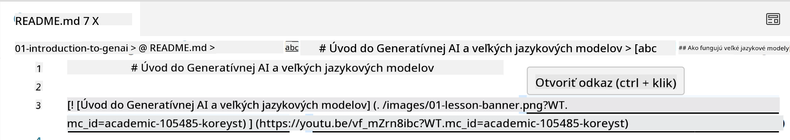
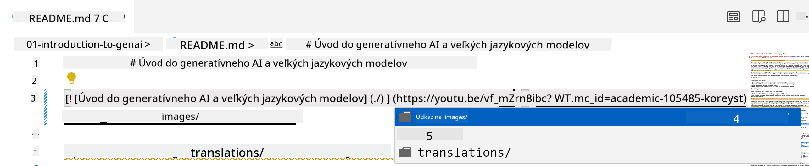
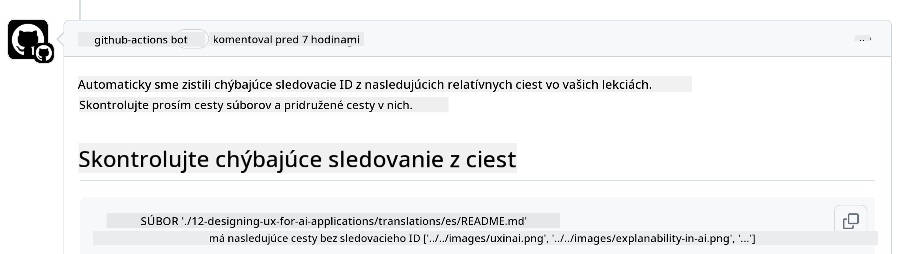
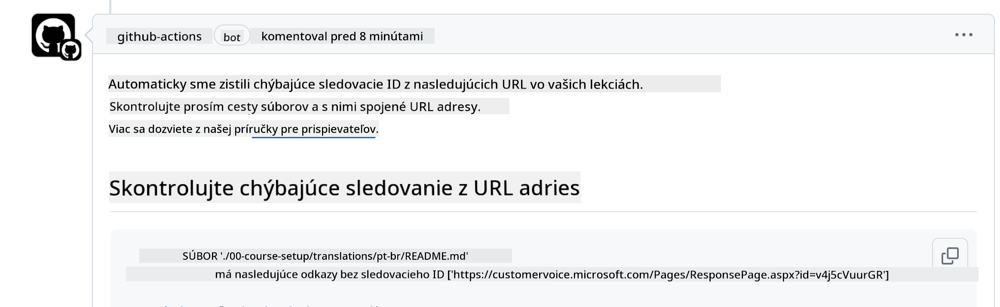
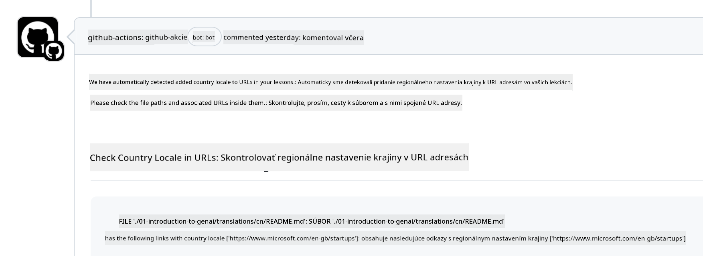

<!--
CO_OP_TRANSLATOR_METADATA:
{
  "original_hash": "57c41f2af71001a2cff9d8eb797cb843",
  "translation_date": "2025-06-25T07:18:50+00:00",
  "source_file": "CONTRIBUTING.md",
  "language_code": "sk"
}
-->
# Prispievanie

Tento projekt víta príspevky a návrhy. Väčšina príspevkov vyžaduje, aby ste súhlasili s Licenčnou zmluvou pre prispievateľov (CLA), ktorá deklaruje, že máte právo, a skutočne udeľujete nám práva na používanie vášho príspevku. Podrobnosti nájdete na <https://cla.microsoft.com>.

> Dôležité: pri prekladaní textu v tomto repozitári sa uistite, že nepoužívate strojový preklad. Preklady overíme prostredníctvom komunity, preto sa dobrovoľne hláste na preklady len v jazykoch, v ktorých ste zdatní.

Keď odošlete pull request, CLA-bot automaticky určí, či potrebujete poskytnúť CLA a správne označí PR (napr. štítok, komentár). Jednoducho postupujte podľa pokynov, ktoré vám poskytne bot. Toto budete musieť urobiť iba raz vo všetkých repozitároch používajúcich našu CLA.

## Kódex správania

Tento projekt prijal [Kódex správania pre otvorený zdrojový kód od Microsoftu](https://opensource.microsoft.com/codeofconduct/?WT.mc_id=academic-105485-koreyst). Pre viac informácií si prečítajte [FAQ kódexu správania](https://opensource.microsoft.com/codeofconduct/faq/?WT.mc_id=academic-105485-koreyst) alebo kontaktujte [opencode@microsoft.com](mailto:opencode@microsoft.com) s akýmikoľvek ďalšími otázkami alebo komentármi.

## Otázky alebo problémy?

Prosím, neotvárajte GitHub issues pre všeobecné otázky podpory, pretože zoznam GitHub by mal byť použitý na žiadosti o funkcie a hlásenia chýb. Týmto spôsobom môžeme ľahšie sledovať skutočné problémy alebo chyby v kóde a oddeliť všeobecnú diskusiu od skutočného kódu.

## Preklepy, problémy, chyby a príspevky

Kedykoľvek odosielate akékoľvek zmeny do repozitára Generative AI for Beginners, dodržujte tieto odporúčania.

* Vždy forknite repozitár do svojho vlastného účtu predtým, ako urobíte svoje úpravy
* Nekombinujte viacero zmien do jedného pull requestu. Napríklad, odosielajte akékoľvek opravy chýb a aktualizácie dokumentácie pomocou samostatných PR
* Ak váš pull request vykazuje konflikty zlúčenia, uistite sa, že aktualizujete svoju lokálnu hlavnú vetvu, aby bola zrkadlom toho, čo je v hlavnom repozitári predtým, ako urobíte svoje úpravy
* Ak odosielate preklad, vytvorte jeden PR pre všetky preložené súbory, pretože neprijímame čiastočné preklady obsahu
* Ak odosielate opravu preklepu alebo dokumentácie, môžete kombinovať úpravy do jedného PR, kde je to vhodné

## Všeobecné pokyny pre písanie

- Uistite sa, že všetky vaše URL sú obalené v hranatých zátvorkách nasledovaných zátvorkou bez medzier okolo nich alebo vnútri nich ``.
- Uistite sa, že akýkoľvek relatívny odkaz (t.j. odkazy na iné súbory a priečinky v repozitári) začína `./` odkazujúcim na súbor alebo priečinok nachádzajúci sa v aktuálnom pracovnom adresári alebo `../` odkazujúcim na súbor alebo priečinok nachádzajúci sa v nadradenom pracovnom adresári.
- Uistite sa, že akýkoľvek relatívny odkaz (t.j. odkazy na iné súbory a priečinky v repozitári) má sledovacie ID (t.j. `?` alebo `&` potom `wt.mc_id=` alebo `WT.mc_id=`) na jeho konci.
- Uistite sa, že akýkoľvek URL z nasledujúcich domén _github.com, microsoft.com, visualstudio.com, aka.ms, a azure.com_ má sledovacie ID (t.j. `?` alebo `&` potom `wt.mc_id=` alebo `WT.mc_id=`) na jeho konci.
- Uistite sa, že vaše odkazy nemajú v nich špecifickú jazykovú lokalizáciu krajiny (t.j. `/en-us/` alebo `/en/`).
- Uistite sa, že všetky obrázky sú uložené v priečinku `./images`.
- Uistite sa, že obrázky majú popisné názvy používajúce anglické znaky, čísla a pomlčky v názve vášho obrázka.

## GitHub Workflows

Keď odošlete pull request, štyri rôzne workflowy budú spustené na overenie predchádzajúcich pravidiel. Jednoducho postupujte podľa pokynov uvedených tu, aby ste prešli kontrolami workflowu.

- [Skontrolovať nefunkčné relatívne cesty](../..)
- [Skontrolovať, či majú cesty sledovanie](../..)
- [Skontrolovať, či majú URL sledovanie](../..)
- [Skontrolovať, či URL nemajú lokalizáciu](../..)

### Skontrolovať nefunkčné relatívne cesty

Tento workflow zabezpečuje, že akákoľvek relatívna cesta vo vašich súboroch funguje. Tento repozitár je nasadený na GitHub stránkach, takže musíte byť veľmi opatrní, keď píšete odkazy, ktoré všetko spájajú, aby ste nikoho neodviedli na nesprávne miesto.

Aby ste sa uistili, že vaše odkazy fungujú správne, jednoducho použite VS code na kontrolu.

Napríklad, keď prejdete kurzorom nad akýkoľvek odkaz vo vašich súboroch, budete vyzvaní nasledovať odkaz stlačením **ctrl + klik**

Ak kliknete na odkaz a nefunguje lokálne, potom určite spustí workflow a nebude fungovať na GitHub.

Aby ste tento problém vyriešili, skúste napísať odkaz s pomocou VS code.

Keď napíšete `./` alebo `../`, VS code vás vyzve vybrať si z dostupných možností podľa toho, čo ste napísali.

Nasledujte cestu kliknutím na požadovaný súbor alebo priečinok a budete si istí, že vaša cesta nie je poškodená.

Akonáhle pridáte správnu relatívnu cestu, uložte a pushnite svoje zmeny, workflow bude znovu spustený na overenie vašich zmien. Ak prejdete kontrolou, ste pripravení pokračovať.

### Skontrolovať, či majú cesty sledovanie

Tento workflow zabezpečuje, že akákoľvek relatívna cesta má v sebe sledovanie. Tento repozitár je nasadený na GitHub stránkach, takže musíme sledovať pohyb medzi rôznymi súbormi a priečinkami.

Aby ste sa uistili, že vaše relatívne cesty majú v sebe sledovanie, jednoducho skontrolujte nasledujúci text `?wt.mc_id=` na konci cesty. Ak je pripojený k vašim relatívnym cestám, prejdete touto kontrolou.

Ak nie, môžete dostať nasledujúcu chybu.

Aby ste tento problém vyriešili, skúste otvoriť cestu súboru, ktorú workflow zvýraznil a pridajte sledovacie ID na koniec relatívnych ciest.

Akonáhle pridáte sledovacie ID, uložte a pushnite svoje zmeny, workflow bude znovu spustený na overenie vašich zmien. Ak prejdete kontrolou, ste pripravení pokračovať.

### Skontrolovať, či majú URL sledovanie

Tento workflow zabezpečuje, že akýkoľvek webový URL má v sebe sledovanie. Tento repozitár je dostupný pre všetkých, takže musíte zabezpečiť sledovanie prístupu, aby ste vedeli, odkiaľ prichádza návštevnosť.

Aby ste sa uistili, že vaše URL majú v sebe sledovanie, jednoducho skontrolujte nasledujúci text `?wt.mc_id=` na konci URL. Ak je pripojený k vašim URL, prejdete touto kontrolou.

Ak nie, môžete dostať nasledujúcu chybu.

Aby ste tento problém vyriešili, skúste otvoriť cestu súboru, ktorú workflow zvýraznil a pridajte sledovacie ID na koniec URL.

Akonáhle pridáte sledovacie ID, uložte a pushnite svoje zmeny, workflow bude znovu spustený na overenie vašich zmien. Ak prejdete kontrolou, ste pripravení pokračovať.

### Skontrolovať, či URL nemajú lokalizáciu

Tento workflow zabezpečuje, že akýkoľvek webový URL nemá v sebe špecifickú jazykovú lokalizáciu krajiny. Tento repozitár je dostupný pre všetkých po celom svete, takže musíte zabezpečiť, aby ste nezahrnuli lokalizáciu svojej krajiny do URL.

Aby ste sa uistili, že vaše URL nemajú v sebe lokalizáciu krajiny, jednoducho skontrolujte nasledujúci text `/en-us/` alebo `/en/` alebo akúkoľvek inú jazykovú lokalizáciu kdekoľvek v URL. Ak nie je prítomný vo vašich URL, prejdete touto kontrolou.

Ak nie, môžete dostať nasledujúcu chybu.

Aby ste tento problém vyriešili, skúste otvoriť cestu súboru, ktorú workflow zvýraznil a odstráňte lokalizáciu krajiny z URL.

Akonáhle odstránite lokalizáciu krajiny, uložte a pushnite svoje zmeny, workflow bude znovu spustený na overenie vašich zmien. Ak prejdete kontrolou, ste pripravení pokračovať.

Gratulujeme! Čoskoro sa vám ozveme s odozvou na váš príspevok.

**Upozornenie**:  
Tento dokument bol preložený pomocou AI prekladateľskej služby [Co-op Translator](https://github.com/Azure/co-op-translator). Aj keď sa snažíme o presnosť, prosím, uvedomte si, že automatizované preklady môžu obsahovať chyby alebo nepresnosti. Pôvodný dokument v jeho rodnom jazyku by mal byť považovaný za autoritatívny zdroj. Pre kritické informácie sa odporúča profesionálny ľudský preklad. Nie sme zodpovední za akékoľvek nedorozumenia alebo nesprávne interpretácie vyplývajúce z použitia tohto prekladu.