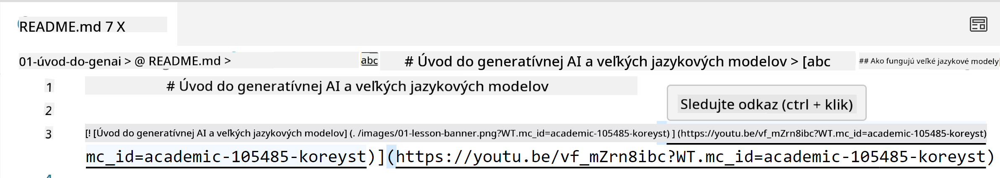
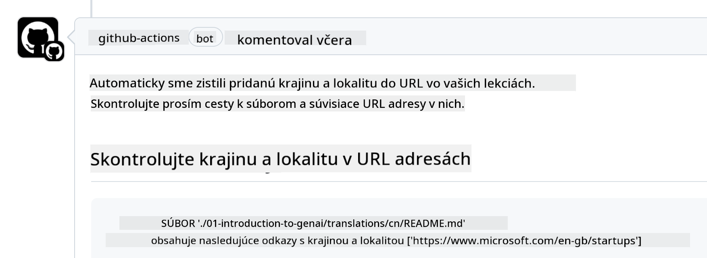

<!--
CO_OP_TRANSLATOR_METADATA:
{
  "original_hash": "57c41f2af71001a2cff9d8eb797cb843",
  "translation_date": "2025-07-09T06:12:06+00:00",
  "source_file": "CONTRIBUTING.md",
  "language_code": "sk"
}
-->
# Prispievanie

Tento projekt vítá príspevky a návrhy. Väčšina príspevkov vyžaduje, aby ste súhlasili s Contributor License Agreement (CLA), ktorý potvrdzuje, že máte právo a skutočne nám udeľujete práva na použitie vášho príspevku. Pre podrobnosti navštívte <https://cla.microsoft.com>.

> Dôležité: pri preklade textov v tomto repozitári prosím nepoužívajte strojový preklad. Preklady budú overované komunitou, preto sa prosím zapájajte len do prekladov do jazykov, ktorým dobre rozumiete.

Keď odošlete pull request, CLA-bot automaticky zistí, či je potrebné poskytnúť CLA, a označí PR príslušným štítkom alebo komentárom. Stačí postupovať podľa pokynov bota. Toto je potrebné urobiť iba raz pre všetky repozitáre používajúce náš CLA.

## Kódex správania

Tento projekt prijal [Microsoft Open Source Code of Conduct](https://opensource.microsoft.com/codeofconduct/?WT.mc_id=academic-105485-koreyst).
Pre viac informácií si prečítajte [Často kladené otázky o Kódexe správania](https://opensource.microsoft.com/codeofconduct/faq/?WT.mc_id=academic-105485-koreyst) alebo kontaktujte [opencode@microsoft.com](mailto:opencode@microsoft.com) s ďalšími otázkami či pripomienkami.

## Otázky alebo problémy?

Prosím, neotvárajte GitHub issues pre všeobecné otázky podpory, pretože zoznam na GitHube by mal slúžiť na požiadavky na funkcie a hlásenia chýb. Takto môžeme ľahšie sledovať skutočné problémy alebo chyby v kóde a oddeliť všeobecnú diskusiu od samotného kódu.

## Preklepy, problémy, chyby a príspevky

Pri zasielaní akýchkoľvek zmien do repozitára Generative AI for Beginners, prosím, dodržiavajte tieto odporúčania.

* Vždy si najprv vytvorte fork repozitára na svoj účet pred vykonaním zmien
* Nespojujte viacero zmien do jedného pull requestu. Napríklad, opravy chýb a aktualizácie dokumentácie posielajte v samostatných PR
* Ak váš pull request vykazuje konflikty pri zlúčení, aktualizujte si lokálnu vetvu main tak, aby zodpovedala hlavnej vetve v repozitári pred vykonaním zmien
* Ak posielate preklad, vytvorte jeden PR pre všetky preložené súbory, pretože neprijímame čiastočné preklady obsahu
* Ak posielate opravu preklepu alebo dokumentácie, môžete vhodne spojiť viac zmien do jedného PR

## Všeobecné pokyny pre písanie

- Uistite sa, že všetky vaše URL sú uzavreté v hranatých zátvorkách a hneď za nimi nasledujú zátvorky bez medzier ``.
- Uistite sa, že akýkoľvek relatívny odkaz (t.j. odkazy na iné súbory a priečinky v repozitári) začína `./` pre súbor alebo priečinok v aktuálnom pracovnom adresári alebo `../` pre súbor alebo priečinok v nadradenom adresári.
- Uistite sa, že každý relatívny odkaz má na konci sledovací identifikátor (t.j. `?` alebo `&` a potom `wt.mc_id=` alebo `WT.mc_id=`).
- Uistite sa, že každá URL z domén _github.com, microsoft.com, visualstudio.com, aka.ms a azure.com_ má na konci sledovací identifikátor (t.j. `?` alebo `&` a potom `wt.mc_id=` alebo `WT.mc_id=`).
- Uistite sa, že vaše odkazy neobsahujú špecifickú lokalizáciu krajiny (napr. `/en-us/` alebo `/en/`).
- Uistite sa, že všetky obrázky sú uložené v priečinku `./images`.
- Uistite sa, že obrázky majú popisné názvy používaním anglických znakov, číslic a pomlčiek.

## GitHub Workflows

Keď odošlete pull request, spustia sa štyri rôzne workflow na overenie vyššie uvedených pravidiel.
Jednoducho postupujte podľa pokynov uvedených tu, aby ste prešli kontrolami workflow.

- [Kontrola nefunkčných relatívnych ciest](../..)
- [Kontrola, či cesty obsahujú sledovanie](../..)
- [Kontrola, či URL obsahujú sledovanie](../..)
- [Kontrola, či URL neobsahujú lokalizáciu](../..)

### Kontrola nefunkčných relatívnych ciest

Tento workflow zabezpečuje, že každá relatívna cesta vo vašich súboroch funguje.
Tento repozitár je nasadený na GitHub pages, preto musíte byť veľmi opatrní pri písaní odkazov, aby nikto nebol presmerovaný na nesprávne miesto.

Pre istotu, že vaše odkazy fungujú správne, použite VS Code na ich kontrolu.

Napríklad, keď podržíte kurzor nad akýmkoľvek odkazom vo vašich súboroch, zobrazí sa vám možnosť otvoriť odkaz stlačením **ctrl + kliknutie**

Ak kliknete na odkaz a lokálne nefunguje, workflow ho určite označí ako chybný a nebude fungovať ani na GitHube.

Na opravu tohto problému skúste odkaz napísať s pomocou VS Code.

Keď začnete písať `./` alebo `../`, VS Code vám ponúkne výber z dostupných možností podľa toho, čo ste zadali.

Vyberte cestu kliknutím na požadovaný súbor alebo priečinok a budete mať istotu, že vaša cesta nie je nefunkčná.

Keď pridáte správnu relatívnu cestu, uložte a odošlite zmeny, workflow sa spustí znova na overenie zmien.
Ak kontrolu prejdete, môžete pokračovať.

### Kontrola, či cesty obsahujú sledovanie

Tento workflow zabezpečuje, že každá relatívna cesta obsahuje sledovanie.
Tento repozitár je nasadený na GitHub pages, preto potrebujeme sledovať pohyb medzi rôznymi súbormi a priečinkami.

Pre istotu, že vaše relatívne cesty obsahujú sledovanie, skontrolujte, či na konci cesty je text `?wt.mc_id=`.
Ak je pridaný, kontrolu prejdete.

Ak nie, môžete dostať nasledujúcu chybu.

Na opravu tohto problému otvorte súbor, ktorý workflow označil, a pridajte sledovací identifikátor na koniec relatívnych ciest.

Keď pridáte sledovací identifikátor, uložte a odošlite zmeny, workflow sa spustí znova na overenie zmien.
Ak kontrolu prejdete, môžete pokračovať.

### Kontrola, či URL obsahujú sledovanie

Tento workflow zabezpečuje, že každá webová URL obsahuje sledovanie.
Tento repozitár je dostupný pre všetkých, preto je potrebné sledovať prístupy, aby sme vedeli, odkiaľ prichádza návštevnosť.

Pre istotu, že vaše URL obsahujú sledovanie, skontrolujte, či na konci URL je text `?wt.mc_id=`.
Ak je pridaný, kontrolu prejdete.

Ak nie, môžete dostať nasledujúcu chybu.

Na opravu tohto problému otvorte súbor, ktorý workflow označil, a pridajte sledovací identifikátor na koniec URL.

Keď pridáte sledovací identifikátor, uložte a odošlite zmeny, workflow sa spustí znova na overenie zmien.
Ak kontrolu prejdete, môžete pokračovať.

### Kontrola, či URL neobsahujú lokalizáciu

Tento workflow zabezpečuje, že žiadna webová URL neobsahuje lokalizáciu špecifickú pre krajinu.
Tento repozitár je dostupný pre všetkých na celom svete, preto je potrebné zabezpečiť, aby URL neobsahovali lokalizáciu vašej krajiny.

Pre istotu, že vaše URL neobsahujú lokalizáciu krajiny, skontrolujte, či sa v URL nenachádza text `/en-us/` alebo `/en/` alebo akákoľvek iná jazyková lokalizácia.
Ak tam nie je, kontrolu prejdete.

Ak nie, môžete dostať nasledujúcu chybu.

Na opravu tohto problému otvorte súbor, ktorý workflow označil, a odstráňte lokalizáciu krajiny z URL.

Keď lokalizáciu odstránite, uložte a odošlite zmeny, workflow sa spustí znova na overenie zmien.
Ak kontrolu prejdete, môžete pokračovať.

Gratulujeme! Čoskoro sa vám ozveme s spätnou väzbou na váš príspevok.

**Vyhlásenie o zodpovednosti**:  
Tento dokument bol preložený pomocou AI prekladateľskej služby [Co-op Translator](https://github.com/Azure/co-op-translator). Aj keď sa snažíme o presnosť, prosím, majte na pamäti, že automatizované preklady môžu obsahovať chyby alebo nepresnosti. Originálny dokument v jeho pôvodnom jazyku by mal byť považovaný za autoritatívny zdroj. Pre kritické informácie sa odporúča profesionálny ľudský preklad. Nie sme zodpovední za akékoľvek nedorozumenia alebo nesprávne interpretácie vyplývajúce z použitia tohto prekladu.