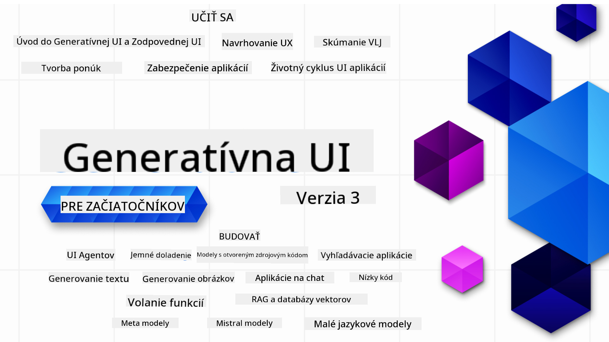

<!--
CO_OP_TRANSLATOR_METADATA:
{
  "original_hash": "ca2afa136ed9aca0634f39f51239746e",
  "translation_date": "2025-08-27T08:53:33+00:00",
  "source_file": "README.md",
  "language_code": "sk"
}
-->

### 21 lekcií, ktoré vás naučia všetko, čo potrebujete vedieť na začatie budovania aplikácií s generatívnou AI

  
  
  
  
  

  
  
  

### 🌐 Podpora viacerých jazykov

#### Podporované prostredníctvom GitHub Action (automatizované a vždy aktuálne)

[Francúzština](../fr/README.md) | [Španielčina](../es/README.md) | [Nemčina](../de/README.md) | [Ruština](../ru/README.md) | [Arabčina](../ar/README.md) | [Perzština (Farsi)](../fa/README.md) | [Urdu](../ur/README.md) | [Čínština (zjednodušená)](../zh/README.md) | [Čínština (tradičná, Macao)](../mo/README.md) | [Čínština (tradičná, Hongkong)](../hk/README.md) | [Čínština (tradičná, Taiwan)](../tw/README.md) | [Japončina](../ja/README.md) | [Kórejčina](../ko/README.md) | [Hindčina](../hi/README.md) | [Bengálčina](../bn/README.md) | [Maráthčina](../mr/README.md) | [Nepálčina](../ne/README.md) | [Pandžábčina (Gurmukhi)](../pa/README.md) | [Portugalčina (Portugalsko)](../pt/README.md) | [Portugalčina (Brazília)](../br/README.md) | [Taliančina](../it/README.md) | [Litovčina](../lt/README.md) | [Poľština](../pl/README.md) | [Turečtina](../tr/README.md) | [Gréčtina](../el/README.md) | [Thajčina](../th/README.md) | [Švédčina](../sv/README.md) | [Dánčina](../da/README.md) | [Nórčina](../no/README.md) | [Fínčina](../fi/README.md) | [Holandčina](../nl/README.md) | [Hebrejčina](../he/README.md) | [Vietnamčina](../vi/README.md) | [Indonézština](../id/README.md) | [Malajčina](../ms/README.md) | [Tagalog (Filipínčina)](../tl/README.md) | [Swahilčina](../sw/README.md) | [Maďarčina](../hu/README.md) | [Čeština](../cs/README.md) | [Slovenčina](./README.md) | [Rumunčina](../ro/README.md) | [Bulharčina](../bg/README.md) | [Srbčina (cyrilika)](../sr/README.md) | [Chorvátčina](../hr/README.md) | [Slovinčina](../sl/README.md) | [Ukrajinčina](../uk/README.md) | [Barmčina (Myanmar)](../my/README.md)

# Generatívna AI pre začiatočníkov (Verzia 3) - Kurz

Naučte sa základy budovania aplikácií s generatívnou AI prostredníctvom nášho komplexného kurzu s 21 lekciami od Microsoft Cloud Advocates.

## 🌱 Začíname

Tento kurz obsahuje 21 lekcií. Každá lekcia sa venuje vlastnej téme, takže môžete začať kdekoľvek!

Lekcie sú označené buď ako "Learn" (učte sa), ktoré vysvetľujú koncept generatívnej AI, alebo ako "Build" (budujte), ktoré zahŕňajú koncepty a ukážky kódu v **Python** a **TypeScript**, ak je to možné.

Pre vývojárov .NET si pozrite [Generatívna AI pre začiatočníkov (.NET edícia)](https://github.com/microsoft/Generative-AI-for-beginners-dotnet?WT.mc_id=academic-105485-koreyst)!

Každá lekcia obsahuje aj sekciu "Keep Learning" (pokračujte v učení) s ďalšími nástrojmi na učenie.

## Čo potrebujete
### Na spustenie kódu z tohto kurzu môžete použiť:
 - [Azure OpenAI Service](https://aka.ms/genai-beginners/azure-open-ai?WT.mc_id=academic-105485-koreyst) - **Lekcie:** "aoai-assignment"  
 - [GitHub Marketplace Model Catalog](https://aka.ms/genai-beginners/gh-models?WT.mc_id=academic-105485-koreyst) - **Lekcie:** "githubmodels"  
 - [OpenAI API](https://aka.ms/genai-beginners/open-ai?WT.mc_id=academic-105485-koreyst) - **Lekcie:** "oai-assignment"  

- Základné znalosti Pythonu alebo TypeScriptu sú užitočné - \*Pre úplných začiatočníkov si pozrite tieto kurzy [Python](https://aka.ms/genai-beginners/python?WT.mc_id=academic-105485-koreyst) a [TypeScript](https://aka.ms/genai-beginners/typescript?WT.mc_id=academic-105485-koreyst)  
- GitHub účet na [forknutie celého repozitára](https://aka.ms/genai-beginners/github?WT.mc_id=academic-105485-koreyst) do vášho vlastného GitHub účtu  

Vytvorili sme lekciu **[Course Setup](./00-course-setup/README.md?WT.mc_id=academic-105485-koreyst)**, ktorá vám pomôže nastaviť vaše vývojové prostredie.

Nezabudnite [označiť hviezdičkou (🌟) tento repozitár](https://docs.github.com/en/get-started/exploring-projects-on-github/saving-repositories-with-stars?WT.mc_id=academic-105485-koreyst), aby ste ho neskôr ľahšie našli.

## 🧠 Pripravení na nasadenie?

Ak hľadáte pokročilejšie ukážky kódu, pozrite si našu [zbierku ukážok kódu pre generatívnu AI](https://aka.ms/genai-beg-code?WT.mc_id=academic-105485-koreyst) v **Python** a **TypeScript**.

## 🗣️ Spojte sa s ostatnými študentmi, získajte podporu

Pripojte sa k nášmu [oficiálnemu Discord serveru Azure AI Foundry](https://aka.ms/genai-discord?WT.mc_id=academic-105485-koreyst), aby ste sa stretli a nadviazali kontakty s ostatnými študentmi, ktorí absolvujú tento kurz, a získali podporu.

Pýtajte sa otázky alebo zdieľajte spätnú väzbu na produkty v našom [Azure AI Foundry Developer Forum](https://aka.ms/azureaifoundry/forum) na GitHube.

## 🚀 Budujete startup?

Navštívte [Microsoft for Startups](https://www.microsoft.com/startups), aby ste zistili, ako začať budovať s Azure kreditmi už dnes.

## 🙏 Chcete pomôcť?

Máte návrhy alebo ste našli pravopisné chyby či chyby v kóde? [Vytvorte issue](https://github.com/microsoft/generative-ai-for-beginners/issues?WT.mc_id=academic-105485-koreyst) alebo [vytvorte pull request](https://github.com/microsoft/generative-ai-for-beginners/pulls?WT.mc_id=academic-105485-koreyst).

## 📂 Každá lekcia obsahuje:

- Krátke video úvod do témy  
- Písomnú lekciu umiestnenú v README  
- Ukážky kódu v Python a TypeScript podporujúce Azure OpenAI a OpenAI API  
- Odkazy na ďalšie zdroje na pokračovanie v učení  

## 🗃️ Lekcie

| #   | **Odkaz na lekciu**                                                                                                                          | **Popis**                                                                                       | **Video**                                                                   | **Ďalšie učenie**                                                              |
| --- | -------------------------------------------------------------------------------------------------------------------------------------------- | ----------------------------------------------------------------------------------------------- | --------------------------------------------------------------------------- | ------------------------------------------------------------------------------ |
| 00  | [Course Setup](./00-course-setup/README.md?WT.mc_id=academic-105485-koreyst)                                                                 | **Learn:** Ako nastaviť vaše vývojové prostredie                                                | Video čoskoro dostupné                                                      | [Learn More](https://aka.ms/genai-collection?WT.mc_id=academic-105485-koreyst) |
| 01  | [Úvod do generatívnej AI a LLMs](./01-introduction-to-genai/README.md?WT.mc_id=academic-105485-koreyst)                                       | **Learn:** Pochopenie, čo je generatívna AI a ako fungujú veľké jazykové modely (LLMs).         | [Video](https://aka.ms/gen-ai-lesson-1-gh?WT.mc_id=academic-105485-koreyst) | [Learn More](https://aka.ms/genai-collection?WT.mc_id=academic-105485-koreyst) |
| 02  | [Preskúmanie a porovnanie rôznych LLMs](./02-exploring-and-comparing-different-llms/README.md?WT.mc_id=academic-105485-koreyst)               | **Learn:** Ako vybrať správny model pre váš prípad použitia                                     | [Video](https://aka.ms/gen-ai-lesson2-gh?WT.mc_id=academic-105485-koreyst)  | [Learn More](https://aka.ms/genai-collection?WT.mc_id=academic-105485-koreyst) |
| 03  | [Používanie generatívnej AI zodpovedne](./03-using-generative-ai-responsibly/README.md?WT.mc_id=academic-105485-koreyst)                      | **Learn:** Ako budovať aplikácie s generatívnou AI zodpovedne                                   | [Video](https://aka.ms/gen-ai-lesson3-gh?WT.mc_id=academic-105485-koreyst)  | [Learn More](https://aka.ms/genai-collection?WT.mc_id=academic-105485-koreyst) |
| 04  | [Pochopenie základov prompt engineering](./04-prompt-engineering-fundamentals/README.md?WT.mc_id=academic-105485-koreyst)                     | **Learn:** Praktické najlepšie postupy pre prompt engineering                                   | [Video](https://aka.ms/gen-ai-lesson4-gh?WT.mc_id=academic-105485-koreyst)  | [Learn More](https://aka.ms/genai-collection?WT.mc_id=academic-105485-koreyst) |
| 05  | [Vytváranie pokročilých promptov](./05-advanced-prompts/README.md?WT.mc_id=academic-105485-koreyst)                                          | **Learn:** Ako aplikovať techniky prompt engineering na zlepšenie výsledkov vašich promptov.    | [Video](https://aka.ms/gen-ai-lesson5-gh?WT.mc_id=academic-105485-koreyst)  | [Learn More](https://aka.ms/genai-collection?WT.mc_id=academic-105485-koreyst) |
| 06  | [Vytváranie aplikácií na generovanie textu](./06-text-generation-apps/README.md?WT.mc_id=academic-105485-koreyst)                                | **Vytvorte:** Aplikáciu na generovanie textu pomocou Azure OpenAI / OpenAI API                                | [Video](https://aka.ms/gen-ai-lesson6-gh?WT.mc_id=academic-105485-koreyst)  | [Viac informácií](https://aka.ms/genai-collection?WT.mc_id=academic-105485-koreyst) |
| 07  | [Vytváranie chatovacích aplikácií](./07-building-chat-applications/README.md?WT.mc_id=academic-105485-koreyst)                                     | **Vytvorte:** Techniky na efektívne vytváranie a integráciu chatovacích aplikácií.               | [Video](https://aka.ms/gen-ai-lessons7-gh?WT.mc_id=academic-105485-koreyst) | [Viac informácií](https://aka.ms/genai-collection?WT.mc_id=academic-105485-koreyst) |
| 08  | [Vytváranie vyhľadávacích aplikácií s vektorovými databázami](./08-building-search-applications/README.md?WT.mc_id=academic-105485-koreyst)                        | **Vytvorte:** Vyhľadávaciu aplikáciu, ktorá používa embeddings na vyhľadávanie údajov.                        | [Video](https://aka.ms/gen-ai-lesson8-gh?WT.mc_id=academic-105485-koreyst)  | [Viac informácií](https://aka.ms/genai-collection?WT.mc_id=academic-105485-koreyst) |
| 09  | [Vytváranie aplikácií na generovanie obrázkov](./09-building-image-applications/README.md?WT.mc_id=academic-105485-koreyst)                        | **Vytvorte:** Aplikáciu na generovanie obrázkov                                                       | [Video](https://aka.ms/gen-ai-lesson9-gh?WT.mc_id=academic-105485-koreyst)  | [Viac informácií](https://aka.ms/genai-collection?WT.mc_id=academic-105485-koreyst) |
| 10  | [Vytváranie AI aplikácií s nízkym kódom](./10-building-low-code-ai-applications/README.md?WT.mc_id=academic-105485-koreyst)                       | **Vytvorte:** Generatívnu AI aplikáciu pomocou nástrojov s nízkym kódom                                     | [Video](https://aka.ms/gen-ai-lesson10-gh?WT.mc_id=academic-105485-koreyst) | [Viac informácií](https://aka.ms/genai-collection?WT.mc_id=academic-105485-koreyst) |
| 11  | [Integrácia externých aplikácií pomocou volania funkcií](./11-integrating-with-function-calling/README.md?WT.mc_id=academic-105485-koreyst) | **Vytvorte:** Čo je volanie funkcií a jeho použitie v aplikáciách                          | [Video](https://aka.ms/gen-ai-lesson11-gh?WT.mc_id=academic-105485-koreyst) | [Viac informácií](https://aka.ms/genai-collection?WT.mc_id=academic-105485-koreyst) |
| 12  | [Navrhovanie UX pre AI aplikácie](./12-designing-ux-for-ai-applications/README.md?WT.mc_id=academic-105485-koreyst)                         | **Naučte sa:** Ako aplikovať princípy UX dizajnu pri vývoji generatívnych AI aplikácií         | [Video](https://aka.ms/gen-ai-lesson12-gh?WT.mc_id=academic-105485-koreyst) | [Viac informácií](https://aka.ms/genai-collection?WT.mc_id=academic-105485-koreyst) |
| 13  | [Zabezpečenie vašich generatívnych AI aplikácií](./13-securing-ai-applications/README.md?WT.mc_id=academic-105485-koreyst)                         | **Naučte sa:** Hrozby a riziká pre AI systémy a metódy na ich zabezpečenie.             | [Video](https://aka.ms/gen-ai-lesson13-gh?WT.mc_id=academic-105485-koreyst) | [Viac informácií](https://aka.ms/genai-collection?WT.mc_id=academic-105485-koreyst) |
| 14  | [Životný cyklus generatívnych AI aplikácií](./14-the-generative-ai-application-lifecycle/README.md?WT.mc_id=academic-105485-koreyst)           | **Naučte sa:** Nástroje a metriky na správu životného cyklu LLM a LLMOps                         | [Video](https://aka.ms/gen-ai-lesson14-gh?WT.mc_id=academic-105485-koreyst) | [Viac informácií](https://aka.ms/genai-collection?WT.mc_id=academic-105485-koreyst) |
| 15  | [Retrieval Augmented Generation (RAG) a vektorové databázy](./15-rag-and-vector-databases/README.md?WT.mc_id=academic-105485-koreyst)        | **Vytvorte:** Aplikáciu pomocou RAG Framework na získavanie embeddings z vektorových databáz  | [Video](https://aka.ms/gen-ai-lesson15-gh?WT.mc_id=academic-105485-koreyst) | [Viac informácií](https://aka.ms/genai-collection?WT.mc_id=academic-105485-koreyst) |
| 16  | [Open Source modely a Hugging Face](./16-open-source-models/README.md?WT.mc_id=academic-105485-koreyst)                                    | **Vytvorte:** Aplikáciu pomocou open source modelov dostupných na Hugging Face                    | [Video](https://aka.ms/gen-ai-lesson16-gh?WT.mc_id=academic-105485-koreyst) | [Viac informácií](https://aka.ms/genai-collection?WT.mc_id=academic-105485-koreyst) |
| 17  | [AI agenti](./17-ai-agents/README.md?WT.mc_id=academic-105485-koreyst)                                                                       | **Vytvorte:** Aplikáciu pomocou AI Agent Framework                                           | [Video](https://aka.ms/gen-ai-lesson17-gh?WT.mc_id=academic-105485-koreyst) | [Viac informácií](https://aka.ms/genai-collection?WT.mc_id=academic-105485-koreyst) |
| 18  | [Doladenie LLM](./18-fine-tuning/README.md?WT.mc_id=academic-105485-koreyst)                                                              | **Naučte sa:** Čo, prečo a ako doladiť LLM                                            | [Video](https://aka.ms/gen-ai-lesson18-gh?WT.mc_id=academic-105485-koreyst) | [Viac informácií](https://aka.ms/genai-collection?WT.mc_id=academic-105485-koreyst) |
| 19  | [Vytváranie s SLM](./19-slm/README.md?WT.mc_id=academic-105485-koreyst)                                                              | **Naučte sa:** Výhody vytvárania s malými jazykovými modelmi                                            | Video čoskoro | [Viac informácií](https://aka.ms/genai-collection?WT.mc_id=academic-105485-koreyst) |
| 20  | [Vytváranie s modelmi Mistral](./20-mistral/README.md?WT.mc_id=academic-105485-koreyst)                                                              | **Naučte sa:** Funkcie a rozdiely modelov rodiny Mistral                                           | Video čoskoro | [Viac informácií](https://aka.ms/genai-collection?WT.mc_id=academic-105485-koreyst) |
| 21  | [Vytváranie s modelmi Meta](./21-meta/README.md?WT.mc_id=academic-105485-koreyst)                                                              | **Naučte sa:** Funkcie a rozdiely modelov rodiny Meta                                           | Video čoskoro | [Viac informácií](https://aka.ms/genai-collection?WT.mc_id=academic-105485-koreyst) |

### 🌟 Špeciálne poďakovanie

Špeciálne poďakovanie patrí [**Johnovi Azizovi**](https://www.linkedin.com/in/john0isaac/) za vytvorenie všetkých GitHub Actions a workflowov.

[**Bernhardovi Merkle**](https://www.linkedin.com/in/bernhard-merkle-738b73/) za kľúčové príspevky do každej lekcie na zlepšenie skúseností študentov a kódu.

## 🎒 Ďalšie kurzy

Náš tím vytvára aj ďalšie kurzy! Pozrite si:

- [**NOVÉ** Model Context Protocol pre začiatočníkov](https://github.com/microsoft/mcp-for-beginners)
- [AI agenti pre začiatočníkov](https://github.com/microsoft/ai-agents-for-beginners)
- [Generatívna AI pre začiatočníkov pomocou .NET](https://github.com/microsoft/Generative-AI-for-beginners-dotnet)
- [Generatívna AI pre začiatočníkov pomocou JavaScriptu](https://aka.ms/genai-js-course)
- [Generatívna AI pre začiatočníkov pomocou Javy](https://aka.ms/genaijava)
- [ML pre začiatočníkov](https://aka.ms/ml-beginners)
- [Data Science pre začiatočníkov](https://aka.ms/datascience-beginners)
- [AI pre začiatočníkov](https://aka.ms/ai-beginners)
- [Kybernetická bezpečnosť pre začiatočníkov](https://github.com/microsoft/Security-101)
- [Webový vývoj pre začiatočníkov](https://aka.ms/webdev-beginners)
- [IoT pre začiatočníkov](https://aka.ms/iot-beginners)
- [XR vývoj pre začiatočníkov](https://github.com/microsoft/xr-development-for-beginners)
- [Ovládnutie GitHub Copilot pre AI párové programovanie](https://aka.ms/GitHubCopilotAI)
- [Ovládnutie GitHub Copilot pre vývojárov C#/.NET](https://github.com/microsoft/mastering-github-copilot-for-dotnet-csharp-developers)
- [Vyberte si vlastné dobrodružstvo s Copilotom](https://github.com/microsoft/CopilotAdventures)

---

**Upozornenie**:  
Tento dokument bol preložený pomocou služby na automatický preklad [Co-op Translator](https://github.com/Azure/co-op-translator). Aj keď sa snažíme o presnosť, upozorňujeme, že automatické preklady môžu obsahovať chyby alebo nepresnosti. Pôvodný dokument v jeho pôvodnom jazyku by mal byť považovaný za autoritatívny zdroj. Pre dôležité informácie sa odporúča profesionálny ľudský preklad. Nezodpovedáme za akékoľvek nedorozumenia alebo nesprávne interpretácie vyplývajúce z použitia tohto prekladu.