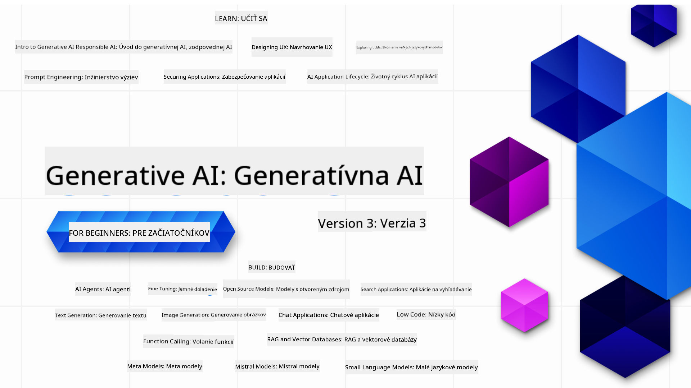

<!--
CO_OP_TRANSLATOR_METADATA:
{
  "original_hash": "c2ee25895ebbfa1a52868bb6eab686fc",
  "translation_date": "2025-05-19T12:00:59+00:00",
  "source_file": "README.md",
  "language_code": "sk"
}
-->

### 21 lekcií, ktoré vás naučia všetko, čo potrebujete vedieť, aby ste mohli začať budovať aplikácie s generatívnou AI

### 🌐 Podpora viacerých jazykov

#### Podporované prostredníctvom GitHub Action (Automatizované a vždy aktuálne)
[Francúzština](../fr/README.md) | [Španielčina](../es/README.md) | [Nemčina](../de/README.md) | [Ruština](../ru/README.md) | [Arabčina](../ar/README.md) | [Perzština (Farsi)](../fa/README.md) | [Urdu](../ur/README.md) | [Čínština (zjednodušená)](../zh/README.md) | [Čínština (tradičná, Macao)](../mo/README.md) | [Čínština (tradičná, Hongkong)](../hk/README.md) | [Čínština (tradičná, Taiwan)](../tw/README.md) | [Japončina](../ja/README.md) | [Kórejčina](../ko/README.md) | [Hindčina](../hi/README.md) | [Bengálčina](../bn/README.md) | [Maráthčina](../mr/README.md) | [Nepálčina](../ne/README.md) | [Pandžábčina (Gurmukhi)](../pa/README.md) | [Portugalčina (Portugalsko)](../pt/README.md) | [Portugalčina (Brazília)](../br/README.md) | [Taliančina](../it/README.md) | [Poľština](../pl/README.md) | [Turečtina](../tr/README.md) | [Gréčtina](../el/README.md) | [Thajčina](../th/README.md) | [Švédčina](../sv/README.md) | [Dánčina](../da/README.md) | [Nórčina](../no/README.md) | [Fínčina](../fi/README.md) | [Holandčina](../nl/README.md) | [Hebrejčina](../he/README.md) | [Vietnamčina](../vi/README.md) | [Indonézština](../id/README.md) | [Malajčina](../ms/README.md) | [Tagalog (Filipínčina)](../tl/README.md) | [Swahilčina](../sw/README.md) | [Maďarčina](../hu/README.md) | [Čeština](../cs/README.md) | [Slovenčina](./README.md) | [Rumunčina](../ro/README.md) | [Bulharčina](../bg/README.md) | [Srbčina (cyrilika)](../sr/README.md) | [Chorvátčina](../hr/README.md) | [Slovinčina](../sl/README.md)Prosím, píšte výstup zľava doprava.
# Generatívna AI pre začiatočníkov (Verzia 3) - Kurz

Naučte sa základy tvorby aplikácií s generatívnou AI pomocou nášho komplexného kurzu od Microsoft Cloud Advocates, ktorý obsahuje 21 lekcií.

## 🌱 Začíname

Tento kurz obsahuje 21 lekcií. Každá lekcia sa venuje vlastnej téme, takže začnite tam, kde chcete!

Lekcie sú označené buď ako "Learn" lekcie, ktoré vysvetľujú koncept generatívnej AI, alebo "Build" lekcie, ktoré vysvetľujú koncept a obsahujú príklady kódu v **Python** a **TypeScript**, ak je to možné.

Pre .NET vývojárov si pozrite [Generatívna AI pre začiatočníkov (.NET Edition)](https://github.com/microsoft/Generative-AI-for-beginners-dotnet?WT.mc_id=academic-105485-koreyst)!

Každá lekcia tiež obsahuje sekciu "Keep Learning" s ďalšími nástrojmi na učenie.

## Čo potrebujete
### Na spustenie kódu z tohto kurzu môžete použiť:
 - [Azure OpenAI Service](https://aka.ms/genai-beginners/azure-open-ai?WT.mc_id=academic-105485-koreyst) - **Lekcie:** "aoai-assignment"
 - [GitHub Marketplace Model Catalog](https://aka.ms/genai-beginners/gh-models?WT.mc_id=academic-105485-koreyst) - **Lekcie:** "githubmodels"
 - [OpenAI API](https://aka.ms/genai-beginners/open-ai?WT.mc_id=academic-105485-koreyst) - **Lekcie:** "oai-assignment" 

- Základné znalosti Pythonu alebo TypeScriptu sú užitočné - \*Pre úplných začiatočníkov si pozrite tieto kurzy [Python](https://aka.ms/genai-beginners/python?WT.mc_id=academic-105485-koreyst) a [TypeScript](https://aka.ms/genai-beginners/typescript?WT.mc_id=academic-105485-koreyst)
- GitHub účet na [forkovanie celého repozitára](https://aka.ms/genai-beginners/github?WT.mc_id=academic-105485-koreyst) na váš vlastný GitHub účet

Vytvorili sme lekciu **[Course Setup](./00-course-setup/README.md?WT.mc_id=academic-105485-koreyst)**, ktorá vám pomôže s nastavením vášho vývojového prostredia.

Nezabudnite [označiť hviezdičkou (🌟) tento repozitár](https://docs.github.com/en/get-started/exploring-projects-on-github/saving-repositories-with-stars?WT.mc_id=academic-105485-koreyst), aby ste ho neskôr ľahšie našli.

## 🧠 Pripravení na nasadenie?

Ak hľadáte pokročilejšie ukážky kódu, pozrite si našu [zbierku ukážok kódu s generatívnou AI](https://aka.ms/genai-beg-code?WT.mc_id=academic-105485-koreyst) v **Python** a **TypeScript**.

## 🗣️ Spoznajte ostatných študentov, získajte podporu

Pripojte sa na náš [oficiálny Azure AI Foundry Discord server](https://aka.ms/genai-discord?WT.mc_id=academic-105485-koreyst), kde sa môžete stretnúť a sieťovať s ostatnými študentmi tohto kurzu a získať podporu.

Pýtajte sa otázky alebo zdieľajte spätnú väzbu na produkty na našom [Azure AI Foundry Developer Forum](https://aka.ms/azureaifoundry/forum) na Github.

## 🚀 Budujete startup?

Zaregistrujte sa na [Microsoft for Startups Founders Hub](https://aka.ms/genai-foundershub?WT.mc_id=academic-105485-koreyst), aby ste získali **bezplatné kredity OpenAI** a až **150k dolárov na kredity Azure na prístup k modelom OpenAI prostredníctvom Azure OpenAI Services**.

## 🙏 Chcete pomôcť?

Máte návrhy alebo ste našli chyby v pravopise či kóde? [Vytvorte issue](https://github.com/microsoft/generative-ai-for-beginners/issues?WT.mc_id=academic-105485-koreyst) alebo [Vytvorte pull request](https://github.com/microsoft/generative-ai-for-beginners/pulls?WT.mc_id=academic-105485-koreyst)

## 📂 Každá lekcia obsahuje:

- Krátke video úvod do témy
- Písomnú lekciu umiestnenú v README
- Ukážky kódu v Python a TypeScript podporujúce Azure OpenAI a OpenAI API
- Odkazy na ďalšie zdroje na pokračovanie vo vašom učení

## 🗃️ Lekcie

| #   | **Odkaz na lekciu**                                                                                                                              | **Popis**                                                                                 | **Video**                                                                   | **Ďalšie učenie**                                                             |
| --- | -------------------------------------------------------------------------------------------------------------------------------------------- | ----------------------------------------------------------------------------------------------- | --------------------------------------------------------------------------- | ------------------------------------------------------------------------------ |
| 00  | [Course Setup](./00-course-setup/README.md?WT.mc_id=academic-105485-koreyst)                                                                 | **Learn:** Ako nastaviť vaše vývojové prostredie                                            | Video prichádza čoskoro                                                                 | [Learn More](https://aka.ms/genai-collection?WT.mc_id=academic-105485-koreyst) |
| 01  | [Úvod do Generatívnej AI a LLMs](./01-introduction-to-genai/README.md?WT.mc_id=academic-105485-koreyst)                              | **Learn:** Pochopenie, čo je generatívna AI a ako fungujú veľké jazykové modely (LLMs).       | [Video](https://aka.ms/gen-ai-lesson-1-gh?WT.mc_id=academic-105485-koreyst) | [Learn More](https://aka.ms/genai-collection?WT.mc_id=academic-105485-koreyst) |
| 02  | [Preskúmanie a porovnanie rôznych LLMs](./02-exploring-and-comparing-different-llms/README.md?WT.mc_id=academic-105485-koreyst)             | **Learn:** Ako vybrať správny model pre váš prípad použitia                                      | [Video](https://aka.ms/gen-ai-lesson2-gh?WT.mc_id=academic-105485-koreyst)  | [Learn More](https://aka.ms/genai-collection?WT.mc_id=academic-105485-koreyst) |
| 03  | [Používanie generatívnej AI zodpovedne](./03-using-generative-ai-responsibly/README.md?WT.mc_id=academic-105485-koreyst)                           | **Learn:** Ako zodpovedne budovať aplikácie s generatívnou AI                                  | [Video](https://aka.ms/gen-ai-lesson3-gh?WT.mc_id=academic-105485-koreyst)  | [Learn More](https://aka.ms/genai-collection?WT.mc_id=academic-105485-koreyst) |
| 04  | [Porozumenie základom inžinierstva promptov](./04-prompt-engineering-fundamentals/README.md?WT.mc_id=academic-105485-koreyst)             | **Learn:** Praktické najlepšie praktiky inžinierstva promptov                                           | [Video](https://aka.ms/gen-ai-lesson4-gh?WT.mc_id=academic-105485-koreyst)  | [Learn More](https://aka.ms/genai-collection?WT.mc_id=academic-105485-koreyst) |
| 05  | [Vytváranie pokročilých výziev](./05-advanced-prompts/README.md?WT.mc_id=academic-105485-koreyst)                                                | **Naučte sa:** Ako aplikovať techniky inžinierstva výziev, ktoré zlepšujú výsledky vašich výziev. | [Video](https://aka.ms/gen-ai-lesson5-gh?WT.mc_id=academic-105485-koreyst)  | [Viac informácií](https://aka.ms/genai-collection?WT.mc_id=academic-105485-koreyst) |
| 06  | [Vytváranie aplikácií na generovanie textu](./06-text-generation-apps/README.md?WT.mc_id=academic-105485-koreyst)                                | **Vytvorte:** Aplikáciu na generovanie textu pomocou Azure OpenAI / OpenAI API                                | [Video](https://aka.ms/gen-ai-lesson6-gh?WT.mc_id=academic-105485-koreyst)  | [Viac informácií](https://aka.ms/genai-collection?WT.mc_id=academic-105485-koreyst) |
| 07  | [Vytváranie chatovacích aplikácií](./07-building-chat-applications/README.md?WT.mc_id=academic-105485-koreyst)                                     | **Vytvorte:** Techniky pre efektívne vytváranie a integráciu chatovacích aplikácií.               | [Video](https://aka.ms/gen-ai-lessons7-gh?WT.mc_id=academic-105485-koreyst) | [Viac informácií](https://aka.ms/genai-collection?WT.mc_id=academic-105485-koreyst) |
| 08  | [Vytváranie vyhľadávacích aplikácií s vektorovými databázami](./08-building-search-applications/README.md?WT.mc_id=academic-105485-koreyst)                        | **Vytvorte:** Vyhľadávaciu aplikáciu, ktorá používa vkladania na vyhľadávanie údajov.                        | [Video](https://aka.ms/gen-ai-lesson8-gh?WT.mc_id=academic-105485-koreyst)  | [Viac informácií](https://aka.ms/genai-collection?WT.mc_id=academic-105485-koreyst) |
| 09  | [Vytváranie aplikácií na generovanie obrázkov](./09-building-image-applications/README.md?WT.mc_id=academic-105485-koreyst)                        | **Vytvorte:** Aplikáciu na generovanie obrázkov                                                       | [Video](https://aka.ms/gen-ai-lesson9-gh?WT.mc_id=academic-105485-koreyst)  | [Viac informácií](https://aka.ms/genai-collection?WT.mc_id=academic-105485-koreyst) |
| 10  | [Vytváranie nízkokódových AI aplikácií](./10-building-low-code-ai-applications/README.md?WT.mc_id=academic-105485-koreyst)                       | **Vytvorte:** Generatívnu AI aplikáciu pomocou nástrojov s nízkym kódom                                     | [Video](https://aka.ms/gen-ai-lesson10-gh?WT.mc_id=academic-105485-koreyst) | [Viac informácií](https://aka.ms/genai-collection?WT.mc_id=academic-105485-koreyst) |
| 11  | [Integrácia externých aplikácií s volaním funkcií](./11-integrating-with-function-calling/README.md?WT.mc_id=academic-105485-koreyst) | **Vytvorte:** Čo je volanie funkcií a jeho použitie pre aplikácie                          | [Video](https://aka.ms/gen-ai-lesson11-gh?WT.mc_id=academic-105485-koreyst) | [Viac informácií](https://aka.ms/genai-collection?WT.mc_id=academic-105485-koreyst) |
| 12  | [Návrh UX pre AI aplikácie](./12-designing-ux-for-ai-applications/README.md?WT.mc_id=academic-105485-koreyst)                         | **Naučte sa:** Ako aplikovať princípy návrhu UX pri vývoji generatívnych AI aplikácií         | [Video](https://aka.ms/gen-ai-lesson12-gh?WT.mc_id=academic-105485-koreyst) | [Viac informácií](https://aka.ms/genai-collection?WT.mc_id=academic-105485-koreyst) |
| 13  | [Zabezpečenie vašich generatívnych AI aplikácií](./13-securing-ai-applications/README.md?WT.mc_id=academic-105485-koreyst)                         | **Naučte sa:** Hrozby a riziká pre AI systémy a metódy na zabezpečenie týchto systémov.             | [Video](https://aka.ms/gen-ai-lesson13-gh?WT.mc_id=academic-105485-koreyst) | [Viac informácií](https://aka.ms/genai-collection?WT.mc_id=academic-105485-koreyst) |
| 14  | [Životný cyklus generatívnej AI aplikácie](./14-the-generative-ai-application-lifecycle/README.md?WT.mc_id=academic-105485-koreyst)           | **Naučte sa:** Nástroje a metriky na riadenie životného cyklu LLM a LLMOps                         | [Video](https://aka.ms/gen-ai-lesson14-gh?WT.mc_id=academic-105485-koreyst) | [Viac informácií](https://aka.ms/genai-collection?WT.mc_id=academic-105485-koreyst) |
| 15  | [Generovanie podporované vyhľadávaním (RAG) a vektorové databázy](./15-rag-and-vector-databases/README.md?WT.mc_id=academic-105485-koreyst)        | **Vytvorte:** Aplikáciu pomocou RAG Framework na vyhľadanie embeddingov z vektorových databáz  | [Video](https://aka.ms/gen-ai-lesson15-gh?WT.mc_id=academic-105485-koreyst) | [Viac informácií](https://aka.ms/genai-collection?WT.mc_id=academic-105485-koreyst) |
| 16  | [Open Source modely a Hugging Face](./16-open-source-models/README.md?WT.mc_id=academic-105485-koreyst)                                    | **Vytvorte:** Aplikáciu pomocou open source modelov dostupných na Hugging Face                    | [Video](https://aka.ms/gen-ai-lesson16-gh?WT.mc_id=academic-105485-koreyst) | [Viac informácií](https://aka.ms/genai-collection?WT.mc_id=academic-105485-koreyst) |
| 17  | [AI agenti](./17-ai-agents/README.md?WT.mc_id=academic-105485-koreyst)                                                                       | **Vytvorte:** Aplikáciu pomocou AI Agent Framework                                           | [Video](https://aka.ms/gen-ai-lesson17-gh?WT.mc_id=academic-105485-koreyst) | [Viac informácií](https://aka.ms/genai-collection?WT.mc_id=academic-105485-koreyst) |
| 18  | [Doladenie LLMs](./18-fine-tuning/README.md?WT.mc_id=academic-105485-koreyst)                                                              | **Naučte sa:** Čo, prečo a ako doladenie LLMs                                            | [Video](https://aka.ms/gen-ai-lesson18-gh?WT.mc_id=academic-105485-koreyst) | [Viac informácií](https://aka.ms/genai-collection?WT.mc_id=academic-105485-koreyst) |
| 19  | [Budovanie s SLMs](./19-slm/README.md?WT.mc_id=academic-105485-koreyst)                                                              | **Naučte sa:** Výhody budovania s malými jazykovými modelmi                                            | Video čoskoro | [Viac informácií](https://aka.ms/genai-collection?WT.mc_id=academic-105485-koreyst) |
| 20  | [Budovanie s Mistral modelmi](./20-mistral/README.md?WT.mc_id=academic-105485-koreyst)                                                              | **Naučte sa:** Vlastnosti a rozdiely modelov rodiny Mistral                                           | Video čoskoro | [Viac informácií](https://aka.ms/genai-collection?WT.mc_id=academic-105485-koreyst) |
| 21  | [Budovanie s Meta modelmi](./21-meta/README.md?WT.mc_id=academic-105485-koreyst)                                                              | **Naučte sa:** Vlastnosti a rozdiely modelov rodiny Meta                                           | Video čoskoro | [Viac informácií](https://aka.ms/genai-collection?WT.mc_id=academic-105485-koreyst) |

### 🌟 Špeciálne poďakovanie

Špeciálne poďakovanie patrí [**Johnovi Azizovi**](https://www.linkedin.com/in/john0isaac/) za vytvorenie všetkých GitHub Actions a pracovných postupov

[**Bernhardovi Merkle**](https://www.linkedin.com/in/bernhard-merkle-738b73/) za kľúčové príspevky do každej lekcie, ktoré zlepšili skúsenosti študentov a kódu.

## 🎒 Ďalšie kurzy

Náš tím produkuje aj ďalšie kurzy! Pozrite sa na:

- [**NOVÝ** AI agenti pre začiatočníkov](https://github.com/microsoft/ai-agents-for-beginners?WT.mc_id=academic-105485-koreyst)
- [**NOVÝ** Generatívna AI pre začiatočníkov pomocou .NET](https://github.com/microsoft/Generative-AI-for-beginners-dotnet?WT.mc_id=academic-105485-koreyst)
- [**NOVÝ** Generatívna AI pre začiatočníkov pomocou JavaScriptu](https://aka.ms/genai-js-course?WT.mc_id=academic-105485-koreyst)
- [ML pre začiatočníkov](https://aka.ms/ml-beginners?WT.mc_id=academic-105485-koreyst)
- [Data Science pre začiatočníkov](https://aka.ms/datascience-beginners?WT.mc_id=academic-105485-koreyst)
- [AI pre začiatočníkov](https://aka.ms/ai-beginners?WT.mc_id=academic-105485-koreyst)
- [Kybernetická bezpečnosť pre začiatočníkov](https://github.com/microsoft/Security-101??WT.mc_id=academic-96948-sayoung)
- [Web Dev pre začiatočníkov](https://aka.ms/webdev-beginners?WT.mc_id=academic-105485-koreyst)
- [IoT pre začiatočníkov](https://aka.ms/iot-beginners?WT.mc_id=academic-105485-koreyst)
- [XR vývoj pre začiatočníkov](https://github.com/microsoft/xr-development-for-beginners?WT.mc_id=academic-105485-koreyst)
- [Ovládanie GitHub Copilot pre párové programovanie s umelou inteligenciou](https://aka.ms/GitHubCopilotAI?WT.mc_id=academic-105485-koreyst)
- [Ovládanie GitHub Copilot pre vývojárov C#/.NET](https://github.com/microsoft/mastering-github-copilot-for-dotnet-csharp-developers?WT.mc_id=academic-105485-koreyst)
- [Vyberte si vlastné dobrodružstvo s Copilotom](https://github.com/microsoft/CopilotAdventures?WT.mc_id=academic-105485-koreyst)

**Upozornenie**:  
Tento dokument bol preložený pomocou služby pre automatizovaný preklad [Co-op Translator](https://github.com/Azure/co-op-translator). Aj keď sa snažíme o presnosť, prosím, uvedomte si, že automatizované preklady môžu obsahovať chyby alebo nepresnosti. Pôvodný dokument v jeho rodnom jazyku by mal byť považovaný za autoritatívny zdroj. Pre kritické informácie sa odporúča profesionálny ľudský preklad. Nie sme zodpovední za žiadne nedorozumenia alebo nesprávne interpretácie vzniknuté použitím tohto prekladu.