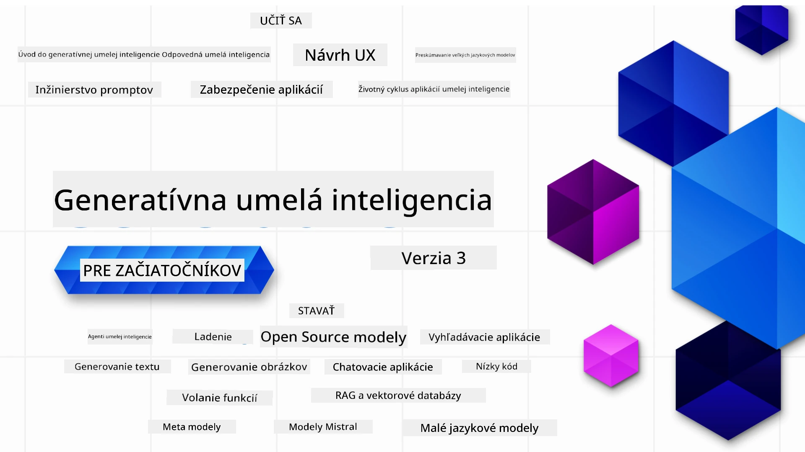

### 21 lekcií, ktoré vás naučia všetko, čo potrebujete vedieť na začatie vytvárania aplikácií Generatívnej AI

[](https://github.com/microsoft/Generative-AI-For-Beginners/blob/master/LICENSE?WT.mc_id=academic-105485-koreyst)
[](https://GitHub.com/microsoft/Generative-AI-For-Beginners/graphs/contributors/?WT.mc_id=academic-105485-koreyst)
[](https://GitHub.com/microsoft/Generative-AI-For-Beginners/issues/?WT.mc_id=academic-105485-koreyst)
[](https://GitHub.com/microsoft/Generative-AI-For-Beginners/pulls/?WT.mc_id=academic-105485-koreyst)
[](http://makeapullrequest.com?WT.mc_id=academic-105485-koreyst)

[](https://GitHub.com/microsoft/Generative-AI-For-Beginners/watchers/?WT.mc_id=academic-105485-koreyst)
[](https://GitHub.com/microsoft/Generative-AI-For-Beginners/network/?WT.mc_id=academic-105485-koreyst)
[](https://GitHub.com/microsoft/Generative-AI-For-Beginners/stargazers/?WT.mc_id=academic-105485-koreyst)

[](https://discord.gg/nTYy5BXMWG)

### 🌐 Podpora viacerých jazykov

#### Podporované cez GitHub Action (automatizované a vždy aktuálne)

<!-- CO-OP TRANSLATOR LANGUAGES TABLE START -->
[Arabčina](../ar/README.md) | [Bengálčina](../bn/README.md) | [Bulharčina](../bg/README.md) | [Barmčina (Myanmar)](../my/README.md) | [Čínština (zjednodušená)](../zh-CN/README.md) | [Čínština (tradičná, Hong Kong)](../zh-HK/README.md) | [Čínština (tradičná, Macau)](../zh-MO/README.md) | [Čínština (tradičná, Taiwan)](../zh-TW/README.md) | [Chorvátčina](../hr/README.md) | [Čeština](../cs/README.md) | [Dánčina](../da/README.md) | [Holandčina](../nl/README.md) | [Estónčina](../et/README.md) | [Fínčina](../fi/README.md) | [Francúzština](../fr/README.md) | [Nemčina](../de/README.md) | [Gréčtina](../el/README.md) | [Hebrejčina](../he/README.md) | [Hindi](../hi/README.md) | [Maďarčina](../hu/README.md) | [Indonézština](../id/README.md) | [Taliančina](../it/README.md) | [Japončina](../ja/README.md) | [Kannadčina](../kn/README.md) | [Khmer](../km/README.md) | [Kórejčina](../ko/README.md) | [Litevčina](../lt/README.md) | [Malajčina](../ms/README.md) | [Malayálamčina](../ml/README.md) | [Maráthčina](../mr/README.md) | [Nepálčina](../ne/README.md) | [Nigérijská pidginčina](../pcm/README.md) | [Nórčina](../no/README.md) | [Perzština (Farsi)](../fa/README.md) | [Poľština](../pl/README.md) | [Portugalčina (Brazília)](../pt-BR/README.md) | [Portugalčina (Portugalsko)](../pt-PT/README.md) | [Pandžábčina (Gurmukhi)](../pa/README.md) | [Rumunčina](../ro/README.md) | [Ruština](../ru/README.md) | [Srbčina (cyrilika)](../sr/README.md) | [Slovenčina](./README.md) | [Slovinčina](../sl/README.md) | [Španielčina](../es/README.md) | [Swahili](../sw/README.md) | [Švédčina](../sv/README.md) | [Tagalog (filipínčina)](../tl/README.md) | [Tamilčina](../ta/README.md) | [Telugčina](../te/README.md) | [Thajčina](../th/README.md) | [Turečtina](../tr/README.md) | [Ukrajinčina](../uk/README.md) | [Urdu](../ur/README.md) | [Vietnamčina](../vi/README.md)

> **Preferujete klonovať lokálne?**
>
> Tento repozitár zahŕňa vyše 50 jazykových prekladov, čo výrazne zväčšuje veľkosť sťahovania. Ak chcete klonovať bez prekladov, použite sparse checkout:
>
> **Bash / macOS / Linux:**
> ```bash
> git clone --filter=blob:none --sparse https://github.com/microsoft/generative-ai-for-beginners.git
> cd generative-ai-for-beginners
> git sparse-checkout set --no-cone '/*' '!translations' '!translated_images'
> ```
>
> **CMD (Windows):**
> ```cmd
> git clone --filter=blob:none --sparse https://github.com/microsoft/generative-ai-for-beginners.git
> cd generative-ai-for-beginners
> git sparse-checkout set --no-cone "/*" "!translations" "!translated_images"
> ```
>
> Takto získate všetko, čo potrebujete na dokončenie kurzu s oveľa rýchlejším sťahovaním.
<!-- CO-OP TRANSLATOR LANGUAGES TABLE END -->

# Generatívna AI pre začiatočníkov (verzia 3) - kurz

Naučte sa základy tvorby aplikácií Generatívnej AI s naším komplexným 21-lekčným kurzom od Microsoft Cloud Advocates.

## 🌱 Začíname

Tento kurz obsahuje 21 lekcií. Každá lekcia pokrýva samostatnú tému, takže začnite kdekoľvek chcete!

Lekcie sú označené ako "Learn" lekcie vysvetľujúce koncept Generatívnej AI alebo "Build" lekcie, ktoré vysvetľujú koncept a ukážky kódu v **Python** a **TypeScript**, ak je to možné.

Pre .NET vývojárov sa pozrite na [Generatívnu AI pre začiatočníkov (.NET edícia)](https://github.com/microsoft/Generative-AI-for-beginners-dotnet?WT.mc_id=academic-105485-koreyst)!

Každá lekcia obsahuje aj sekciu "Keep Learning" s ďalšími vzdelávacími nástrojmi.

## Čo potrebujete
### Na spustenie kódu z tohto kurzu môžete použiť:
 - [Azure OpenAI Service](https://aka.ms/genai-beginners/azure-open-ai?WT.mc_id=academic-105485-koreyst) - **Lekcie:** "aoai-assignment"
 - [GitHub Marketplace Model Catalog](https://aka.ms/genai-beginners/gh-models?WT.mc_id=academic-105485-koreyst) - **Lekcie:** "githubmodels"
 - [OpenAI API](https://aka.ms/genai-beginners/open-ai?WT.mc_id=academic-105485-koreyst) - **Lekcie:** "oai-assignment" 
   
- Základné znalosti Pythonu alebo TypeScriptu sú užitočné - \*Pre úplných začiatočníkov si pozrite tieto [Python](https://aka.ms/genai-beginners/python?WT.mc_id=academic-105485-koreyst) a [TypeScript](https://aka.ms/genai-beginners/typescript?WT.mc_id=academic-105485-koreyst) kurzy
- Účet na GitHube na [forknutie tohto celého repozitára](https://aka.ms/genai-beginners/github?WT.mc_id=academic-105485-koreyst) do vlastného GitHub účtu

Vytvorili sme lekciu **[Course Setup](./00-course-setup/README.md?WT.mc_id=academic-105485-koreyst)**, ktorá vám pomôže s nastavením vývojového prostredia.

Nezabudnite tento repozitár [označiť hviezdičkou (🌟)](https://docs.github.com/en/get-started/exploring-projects-on-github/saving-repositories-with-stars?WT.mc_id=academic-105485-koreyst), aby ste ho neskôr ľahšie našli.

## 🧠 Pripravení na nasadenie?

Ak hľadáte pokročilejšie ukážky kódu, pozrite si našu [kolekciu ukážok kódu Generatívnej AI](https://aka.ms/genai-beg-code?WT.mc_id=academic-105485-koreyst) v **Pythone** aj **TypeScripte**.

## 🗣️ Spojte sa s ostatnými študentmi, získajte podporu

Pridajte sa na náš [oficiálny Azure AI Foundry Discord server](https://aka.ms/genai-discord?WT.mc_id=academic-105485-koreyst), kde môžete spoznať a spojiť sa s ďalšími študentmi tohto kurzu a získať podporu.

Pokladajte otázky alebo zdieľajte spätnú väzbu k produktu v našom [Azure AI Foundry Developer fóre](https://aka.ms/azureaifoundry/forum) na GitHube.

## 🚀 Budujete startup?

Navštívte [Microsoft for Startups](https://www.microsoft.com/startups), aby ste zistili, ako začať vytvárať s Azure kreditmi ešte dnes.

## 🙏 Chcete pomôcť?

Máte návrhy alebo ste našli chyby v pravopise či kóde? [Otvorte issue](https://github.com/microsoft/generative-ai-for-beginners/issues?WT.mc_id=academic-105485-koreyst) alebo [vytvorte pull request](https://github.com/microsoft/generative-ai-for-beginners/pulls?WT.mc_id=academic-105485-koreyst)

## 📂 Každá lekcia obsahuje:

- Krátke video s úvodom do témy
- Písanú lekciu uloženú v README
- Ukážky kódov v Pythone a TypeScripte s podporou Azure OpenAI a OpenAI API
- Odkazy na ďalšie zdroje pre pokračovanie vo vzdelávaní

## 🗃️ Lekcie

| #   | **Odkaz na lekciu**                                                                                                                              | **Popis**                                                                                       | **Video**                                                                   | **Doplňujúce vzdelávanie**                                                    |
| --- | ----------------------------------------------------------------------------------------------------------------------------------------------- | ---------------------------------------------------------------------------------------------- | --------------------------------------------------------------------------- | ------------------------------------------------------------------------------ |
| 00  | [Nastavenie kurzu](./00-course-setup/README.md?WT.mc_id=academic-105485-koreyst)                                                                 | **Naučte sa:** Ako nastaviť svoje vývojové prostredie                                         | Video čoskoro                                                                 | [Viac informácií](https://aka.ms/genai-collection?WT.mc_id=academic-105485-koreyst) |
| 01  | [Úvod do Generatívnej AI a LLM](./01-introduction-to-genai/README.md?WT.mc_id=academic-105485-koreyst)                                           | **Naučte sa:** Pochopenie, čo je Generatívna AI a ako fungujú veľké jazykové modely (LLM)      | [Video](https://aka.ms/gen-ai-lesson-1-gh?WT.mc_id=academic-105485-koreyst) | [Viac informácií](https://aka.ms/genai-collection?WT.mc_id=academic-105485-koreyst) |
| 02  | [Preskúmanie a porovnanie rôznych LLM](./02-exploring-and-comparing-different-llms/README.md?WT.mc_id=academic-105485-koreyst)                    | **Naučte sa:** Ako vybrať správny model pre váš prípad použitia                               | [Video](https://aka.ms/gen-ai-lesson2-gh?WT.mc_id=academic-105485-koreyst)  | [Viac informácií](https://aka.ms/genai-collection?WT.mc_id=academic-105485-koreyst) |
| 03  | [Zodpovedné používanie Generatívnej AI](./03-using-generative-ai-responsibly/README.md?WT.mc_id=academic-105485-koreyst)                          | **Naučte sa:** Ako zodpovedne vytvárať aplikácie Generatívnej AI                              | [Video](https://aka.ms/gen-ai-lesson3-gh?WT.mc_id=academic-105485-koreyst)  | [Viac informácií](https://aka.ms/genai-collection?WT.mc_id=academic-105485-koreyst) |
| 04  | [Pochopenie základov prompt inžinierstva](./04-prompt-engineering-fundamentals/README.md?WT.mc_id=academic-105485-koreyst)             | **Naučte sa:** Praktické osvedčené postupy v prompt inžinierstve                                  | [Video](https://aka.ms/gen-ai-lesson4-gh?WT.mc_id=academic-105485-koreyst)  | [Viac informácií](https://aka.ms/genai-collection?WT.mc_id=academic-105485-koreyst) |
| 05  | [Vytváranie pokročilých promptov](./05-advanced-prompts/README.md?WT.mc_id=academic-105485-koreyst)                                         | **Naučte sa:** Ako aplikovať techniky prompt inžinierstva, ktoré zlepšujú výsledky vašich promptov. | [Video](https://aka.ms/gen-ai-lesson5-gh?WT.mc_id=academic-105485-koreyst)  | [Viac informácií](https://aka.ms/genai-collection?WT.mc_id=academic-105485-koreyst) |
| 06  | [Budovanie aplikácií na generovanie textu](./06-text-generation-apps/README.md?WT.mc_id=academic-105485-koreyst)                              | **Postavte:** Aplikáciu na generovanie textu pomocou Azure OpenAI / OpenAI API                   | [Video](https://aka.ms/gen-ai-lesson6-gh?WT.mc_id=academic-105485-koreyst)  | [Viac informácií](https://aka.ms/genai-collection?WT.mc_id=academic-105485-koreyst) |
| 07  | [Budovanie chatovacích aplikácií](./07-building-chat-applications/README.md?WT.mc_id=academic-105485-koreyst)                                 | **Postavte:** Techniky na efektívne budovanie a integráciu chatovacích aplikácií.               | [Video](https://aka.ms/gen-ai-lessons7-gh?WT.mc_id=academic-105485-koreyst) | [Viac informácií](https://aka.ms/genai-collection?WT.mc_id=academic-105485-koreyst) |
| 08  | [Budovanie vyhľadávacích aplikácií so vektorovými databázami](./08-building-search-applications/README.md?WT.mc_id=academic-105485-koreyst)    | **Postavte:** Vyhľadávaciu aplikáciu, ktorá využíva embeddings na vyhľadávanie dát.            | [Video](https://aka.ms/gen-ai-lesson8-gh?WT.mc_id=academic-105485-koreyst)  | [Viac informácií](https://aka.ms/genai-collection?WT.mc_id=academic-105485-koreyst) |
| 09  | [Budovanie aplikácií na generovanie obrázkov](./09-building-image-applications/README.md?WT.mc_id=academic-105485-koreyst)                      | **Postavte:** Aplikáciu na generovanie obrázkov                                              | [Video](https://aka.ms/gen-ai-lesson9-gh?WT.mc_id=academic-105485-koreyst)  | [Viac informácií](https://aka.ms/genai-collection?WT.mc_id=academic-105485-koreyst) |
| 10  | [Budovanie AI aplikácií s nízkym kódom](./10-building-low-code-ai-applications/README.md?WT.mc_id=academic-105485-koreyst)                      | **Postavte:** Generatívnu AI aplikáciu pomocou nástrojov s nízkym kódom                        | [Video](https://aka.ms/gen-ai-lesson10-gh?WT.mc_id=academic-105485-koreyst) | [Viac informácií](https://aka.ms/genai-collection?WT.mc_id=academic-105485-koreyst) |
| 11  | [Integrácia externých aplikácií s funkcionalitou volania funkcií](./11-integrating-with-function-calling/README.md?WT.mc_id=academic-105485-koreyst) | **Postavte:** Čo je volanie funkcií a jeho použitia v aplikáciách                             | [Video](https://aka.ms/gen-ai-lesson11-gh?WT.mc_id=academic-105485-koreyst) | [Viac informácií](https://aka.ms/genai-collection?WT.mc_id=academic-105485-koreyst) |
| 12  | [Navrhovanie UX pre AI aplikácie](./12-designing-ux-for-ai-applications/README.md?WT.mc_id=academic-105485-koreyst)                             | **Naučte sa:** Ako aplikovať princípy UX dizajnu pri vývoji Generatívnych AI aplikácií         | [Video](https://aka.ms/gen-ai-lesson12-gh?WT.mc_id=academic-105485-koreyst) | [Viac informácií](https://aka.ms/genai-collection?WT.mc_id=academic-105485-koreyst) |
| 13  | [Zabezpečenie vašich Generatívnych AI aplikácií](./13-securing-ai-applications/README.md?WT.mc_id=academic-105485-koreyst)                     | **Naučte sa:** Hrozby a riziká pre AI systémy a spôsoby ich zabezpečenia.                      | [Video](https://aka.ms/gen-ai-lesson13-gh?WT.mc_id=academic-105485-koreyst) | [Viac informácií](https://aka.ms/genai-collection?WT.mc_id=academic-105485-koreyst) |
| 14  | [Životný cyklus Generatívnej AI aplikácie](./14-the-generative-ai-application-lifecycle/README.md?WT.mc_id=academic-105485-koreyst)              | **Naučte sa:** Nástroje a metriky na riadenie životného cyklu LLM a LLMOps                    | [Video](https://aka.ms/gen-ai-lesson14-gh?WT.mc_id=academic-105485-koreyst) | [Viac informácií](https://aka.ms/genai-collection?WT.mc_id=academic-105485-koreyst) |
| 15  | [Retrieval Augmented Generation (RAG) a vektorové databázy](./15-rag-and-vector-databases/README.md?WT.mc_id=academic-105485-koreyst)             | **Postavte:** Aplikáciu využívajúcu RAG rámec na získavanie embeddings z vektorových databáz  | [Video](https://aka.ms/gen-ai-lesson15-gh?WT.mc_id=academic-105485-koreyst) | [Viac informácií](https://aka.ms/genai-collection?WT.mc_id=academic-105485-koreyst) |
| 16  | [Open Source modely a Hugging Face](./16-open-source-models/README.md?WT.mc_id=academic-105485-koreyst)                                           | **Postavte:** Aplikáciu využívajúcu open source modely dostupné na Hugging Face              | [Video](https://aka.ms/gen-ai-lesson16-gh?WT.mc_id=academic-105485-koreyst) | [Viac informácií](https://aka.ms/genai-collection?WT.mc_id=academic-105485-koreyst) |
| 17  | [AI agenti](./17-ai-agents/README.md?WT.mc_id=academic-105485-koreyst)                                                                            | **Postavte:** Aplikáciu využívajúcu rámec AI agenta                                          | [Video](https://aka.ms/gen-ai-lesson17-gh?WT.mc_id=academic-105485-koreyst) | [Viac informácií](https://aka.ms/genai-collection?WT.mc_id=academic-105485-koreyst) |
| 18  | [Ladenie LLM](./18-fine-tuning/README.md?WT.mc_id=academic-105485-koreyst)                                                                       | **Naučte sa:** Čo, prečo a ako vykonávať ladenie LLM                                        | [Video](https://aka.ms/gen-ai-lesson18-gh?WT.mc_id=academic-105485-koreyst) | [Viac informácií](https://aka.ms/genai-collection?WT.mc_id=academic-105485-koreyst) |
| 19  | [Budovanie so SLM](./19-slm/README.md?WT.mc_id=academic-105485-koreyst)                                                                         | **Naučte sa:** Výhody budovania so Small Language Models                                   | Video Coming Soon | [Viac informácií](https://aka.ms/genai-collection?WT.mc_id=academic-105485-koreyst) |
| 20  | [Budovanie s Mistral modelmi](./20-mistral/README.md?WT.mc_id=academic-105485-koreyst)                                                          | **Naučte sa:** Vlastnosti a rozdiely modelov rodiny Mistral                                | Video Coming Soon | [Viac informácií](https://aka.ms/genai-collection?WT.mc_id=academic-105485-koreyst) |
| 21  | [Budovanie s Meta modelmi](./21-meta/README.md?WT.mc_id=academic-105485-koreyst)                                                                | **Naučte sa:** Vlastnosti a rozdiely modelov rodiny Meta                                  | Video Coming Soon | [Viac informácií](https://aka.ms/genai-collection?WT.mc_id=academic-105485-koreyst) |

### 🌟 Špeciálne poďakovanie

Špeciálne poďakovanie patrí [**Johnovi Azizovi**](https://www.linkedin.com/in/john0isaac/) za vytvorenie všetkých GitHub Actions a workflowov

[**Bernhardovi Merkleovi**](https://www.linkedin.com/in/bernhard-merkle-738b73/) za jeho kľúčový príspevok ku každej lekcii, ktorý zlepšil zážitok študentov a kvalitu kódu.

## 🎒 Iné kurzy

Náš tím vytvára aj iné kurzy! Pozrite si:

<!-- CO-OP TRANSLATOR OTHER COURSES START -->
### LangChain
[](https://aka.ms/langchain4j-for-beginners)
[](https://aka.ms/langchainjs-for-beginners?WT.mc_id=m365-94501-dwahlin)
[](https://github.com/microsoft/langchain-for-beginners?WT.mc_id=m365-94501-dwahlin)
---

### Azure / Edge / MCP / Agenti
[](https://github.com/microsoft/AZD-for-beginners?WT.mc_id=academic-105485-koreyst)
[](https://github.com/microsoft/edgeai-for-beginners?WT.mc_id=academic-105485-koreyst)
[](https://github.com/microsoft/mcp-for-beginners?WT.mc_id=academic-105485-koreyst)
[](https://github.com/microsoft/ai-agents-for-beginners?WT.mc_id=academic-105485-koreyst)

---
 
### Séria Generatívnej AI
[](https://github.com/microsoft/generative-ai-for-beginners?WT.mc_id=academic-105485-koreyst)
[-9333EA?style=for-the-badge&labelColor=E5E7EB&color=9333EA)](https://github.com/microsoft/Generative-AI-for-beginners-dotnet?WT.mc_id=academic-105485-koreyst)
[-C084FC?style=for-the-badge&labelColor=E5E7EB&color=C084FC)](https://github.com/microsoft/generative-ai-for-beginners-java?WT.mc_id=academic-105485-koreyst)
[-E879F9?style=for-the-badge&labelColor=E5E7EB&color=E879F9)](https://github.com/microsoft/generative-ai-with-javascript?WT.mc_id=academic-105485-koreyst)

---
 
### Základné učenie
[](https://aka.ms/ml-beginners?WT.mc_id=academic-105485-koreyst)
[](https://aka.ms/datascience-beginners?WT.mc_id=academic-105485-koreyst)
[](https://aka.ms/ai-beginners?WT.mc_id=academic-105485-koreyst)
[](https://github.com/microsoft/Security-101?WT.mc_id=academic-96948-sayoung)
[](https://aka.ms/webdev-beginners?WT.mc_id=academic-105485-koreyst)
[](https://aka.ms/iot-beginners?WT.mc_id=academic-105485-koreyst)
[](https://github.com/microsoft/xr-development-for-beginners?WT.mc_id=academic-105485-koreyst)

---
 
### Séria Copilot
[](https://aka.ms/GitHubCopilotAI?WT.mc_id=academic-105485-koreyst)
[](https://github.com/microsoft/mastering-github-copilot-for-dotnet-csharp-developers?WT.mc_id=academic-105485-koreyst)
[](https://github.com/microsoft/CopilotAdventures?WT.mc_id=academic-105485-koreyst)
<!-- CO-OP TRANSLATOR OTHER COURSES END -->

## Získanie pomoci

Ak sa zaseknete alebo máte akékoľvek otázky o tvorbe AI aplikácií. Pridajte sa k ďalším študentom a skúseným vývojárom v diskusiách o MCP. Je to podporná komunita, kde sú otázky vítané a vedomosti sa slobodne zdieľajú.

[](https://discord.gg/nTYy5BXMWG)

Ak máte spätnú väzbu k produktu alebo chyby počas vývoja, navštívte:

[](https://aka.ms/foundry/forum)

---

<!-- CO-OP TRANSLATOR DISCLAIMER START -->
**Zrieknutie sa zodpovednosti**:
Tento dokument bol preložený pomocou AI prekladateľskej služby [Co-op Translator](https://github.com/Azure/co-op-translator). Aj keď sa snažíme o presnosť, berte prosím na vedomie, že automatické preklady môžu obsahovať chyby alebo nepresnosti. Originálny dokument v jeho pôvodnom jazyku by mal byť považovaný za autoritatívny zdroj. Pre kritické informácie sa odporúča profesionálny ľudský preklad. Za akékoľvek nedorozumenia alebo nesprávne interpretácie vyplývajúce z použitia tohto prekladu nenesieme zodpovednosť.
<!-- CO-OP TRANSLATOR DISCLAIMER END -->