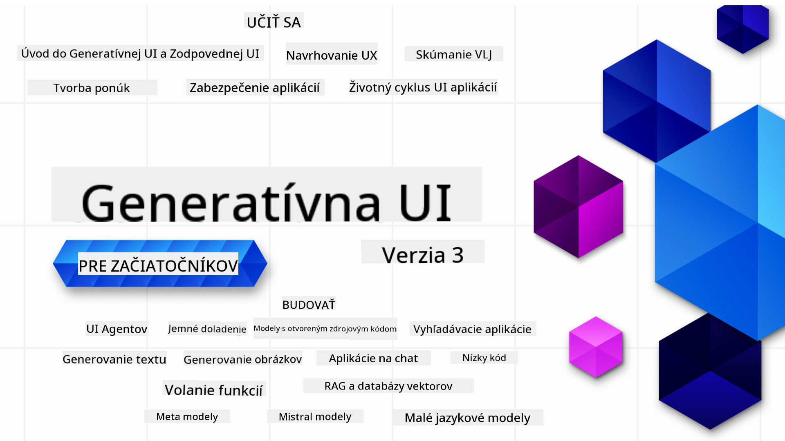

<!--
CO_OP_TRANSLATOR_METADATA:
{
  "original_hash": "6e3f4c8a4f323b8eab1cf11ded304b0f",
  "translation_date": "2025-06-25T08:14:08+00:00",
  "source_file": "README.md",
  "language_code": "sk"
}
-->

### 21 lekcií, ktoré vás naučia všetko, čo potrebujete vedieť na začiatok tvorby aplikácií s generatívnou AI

### 🌐 Podpora viacerých jazykov

#### Podporované cez GitHub Action (Automatizované a vždy aktuálne)

# Generatívna AI pre začiatočníkov (Verzia 3) - Kurz

Naučte sa základy budovania aplikácií generatívnej AI s naším komplexným kurzom od Microsoft Cloud Advocates, ktorý obsahuje 21 lekcií.

## 🌱 Začíname

Tento kurz má 21 lekcií. Každá lekcia sa venuje svojmu vlastnému téme, takže začnite, kdekoľvek sa vám páči!

Lekcie sú označené buď ako "Learn" lekcie vysvetľujúce koncept generatívnej AI, alebo ako "Build" lekcie, ktoré vysvetľujú koncept a poskytujú príklady kódu v **Python** a **TypeScript**, keď je to možné.

Pre .NET vývojárov si pozrite [Generatívna AI pre začiatočníkov (.NET Edition)](https://github.com/microsoft/Generative-AI-for-beginners-dotnet?WT.mc_id=academic-105485-koreyst)!

Každá lekcia tiež obsahuje sekciu "Pokračujte v učení" s ďalšími nástrojmi na učenie.

## Čo potrebujete
### Na spustenie kódu tohto kurzu môžete použiť:
 - [Azure OpenAI Service](https://aka.ms/genai-beginners/azure-open-ai?WT.mc_id=academic-105485-koreyst) - **Lekcie:** "aoai-assignment"
 - [GitHub Marketplace Model Catalog](https://aka.ms/genai-beginners/gh-models?WT.mc_id=academic-105485-koreyst) - **Lekcie:** "githubmodels"
 - [OpenAI API](https://aka.ms/genai-beginners/open-ai?WT.mc_id=academic-105485-koreyst) - **Lekcie:** "oai-assignment" 
   
- Základné znalosti Python alebo TypeScript sú užitočné - \*Pre absolútnych začiatočníkov si pozrite tieto kurzy [Python](https://aka.ms/genai-beginners/python?WT.mc_id=academic-105485-koreyst) a [TypeScript](https://aka.ms/genai-beginners/typescript?WT.mc_id=academic-105485-koreyst)
- GitHub účet na [fork celého tohto repozitára](https://aka.ms/genai-beginners/github?WT.mc_id=academic-105485-koreyst) do vášho vlastného GitHub účtu

Vytvorili sme lekciu **[Course Setup](./00-course-setup/README.md?WT.mc_id=academic-105485-koreyst)**, ktorá vám pomôže s nastavením vášho vývojového prostredia.

Nezabudnite [označiť (🌟) tento repozitár](https://docs.github.com/en/get-started/exploring-projects-on-github/saving-repositories-with-stars?WT.mc_id=academic-105485-koreyst), aby ste ho neskôr ľahšie našli.

## 🧠 Pripravený na nasadenie?

Ak hľadáte pokročilejšie vzorky kódu, pozrite si našu [kolekciu vzoriek kódu generatívnej AI](https://aka.ms/genai-beg-code?WT.mc_id=academic-105485-koreyst) v **Python** a **TypeScript**.

## 🗣️ Spoznajte ďalších študentov, získajte podporu

Pripojte sa k nášmu [oficiálnemu Azure AI Foundry Discord serveru](https://aka.ms/genai-discord?WT.mc_id=academic-105485-koreyst) a stretnite sa s ďalšími študentmi, ktorí absolvujú tento kurz, a získajte podporu.

Pýtajte sa otázky alebo zdieľajte spätnú väzbu na našom [Azure AI Foundry Developer Forum](https://aka.ms/azureaifoundry/forum) na Github.

## 🚀 Budujete startup?

Zaregistrujte sa do [Microsoft for Startups Founders Hub](https://aka.ms/genai-foundershub?WT.mc_id=academic-105485-koreyst) a získajte **bezplatné kredity OpenAI** a až **150 tisíc dolárov na kredity Azure na prístup k modelom OpenAI prostredníctvom Azure OpenAI Services**.

## 🙏 Chcete pomôcť?

Máte návrhy alebo ste našli pravopisné chyby či chyby v kóde? [Vytvorte problém](https://github.com/microsoft/generative-ai-for-beginners/issues?WT.mc_id=academic-105485-koreyst) alebo [Vytvorte pull request](https://github.com/microsoft/generative-ai-for-beginners/pulls?WT.mc_id=academic-105485-koreyst)

## 📂 Každá lekcia obsahuje:

- Krátke video predstavenie témy
- Písanú lekciu umiestnenú v README
- Vzorky kódu v Python a TypeScript podporujúce Azure OpenAI a OpenAI API
- Odkazy na ďalšie zdroje na pokračovanie v učení

## 🗃️ Lekcie

| #   | **Odkaz na lekciu**                                                                                                                              | **Popis**                                                                                 | **Video**                                                                   | **Ďalšie učenie**                                                             |
| --- | -------------------------------------------------------------------------------------------------------------------------------------------- | ----------------------------------------------------------------------------------------------- | --------------------------------------------------------------------------- | ------------------------------------------------------------------------------ |
| 00  | [Course Setup](./00-course-setup/README.md?WT.mc_id=academic-105485-koreyst)                                                                 | **Learn:** Ako nastaviť vaše vývojové prostredie                                            | Video čoskoro                                                                 | [Learn More](https://aka.ms/genai-collection?WT.mc_id=academic-105485-koreyst) |
| 01  | [Úvod do generatívnej AI a LLMs](./01-introduction-to-genai/README.md?WT.mc_id=academic-105485-koreyst)                              | **Learn:** Porozumenie tomu, čo je generatívna AI a ako fungujú veľké jazykové modely (LLMs).       | [Video](https://aka.ms/gen-ai-lesson-1-gh?WT.mc_id=academic-105485-koreyst) | [Learn More](https://aka.ms/genai-collection?WT.mc_id=academic-105485-koreyst) |
| 02  | [Preskúmanie a porovnávanie rôznych LLMs](./02-exploring-and-comparing-different-llms/README.md?WT.mc_id=academic-105485-koreyst)             | **Learn:** Ako vybrať správny model pre váš prípad použitia                                      | [Video](https://aka.ms/gen-ai-lesson2-gh?WT.mc_id=academic-105485-koreyst)  | [Learn More](https://aka.ms/genai-collection?WT.mc_id=academic-105485-koreyst) |
| 03  | [Používanie generatívnej AI zodpovedne](./03-using-generative-ai-responsibly/README.md?WT.mc_id=academic-105485-koreyst)                           | **Learn:** Ako zodpovedne budovať aplikácie generatívnej AI                                  | [Video](https://aka.ms/gen-ai-lesson3-gh?WT.mc_id=academic-105485-koreyst)  | [Learn More](https://aka.ms/genai-collection?WT.mc_id=academic-105485-koreyst) |
| 04  | [Porozumenie základom prompt engineering](./04-prompt-engineering-fundamentals/README.md?WT.mc_id=academic-105485-koreyst)             | **Learn:** Praktické najlepšie postupy v prompt engineering                                           | [Video](https://aka.ms/gen-ai-lesson4-gh?WT.mc_id=academic-105485-koreyst)  | [Learn More](https://aka.ms/genai-collection?WT.mc_id=academic-105485-koreyst) |
| 05  | [Vytváranie pokročilých promptov](./05-advanced-prompts/README.md?WT.mc_id=academic-105485-koreyst)                                                | **Naučte sa:** Ako aplikovať techniky inžinierstva promptov, ktoré zlepšujú výsledky vašich promptov. | [Video](https://aka.ms/gen-ai-lesson5-gh?WT.mc_id=academic-105485-koreyst)  | [Zistiť viac](https://aka.ms/genai-collection?WT.mc_id=academic-105485-koreyst) |
| 06  | [Vytváranie aplikácií na generovanie textu](./06-text-generation-apps/README.md?WT.mc_id=academic-105485-koreyst)                                | **Vytvorte:** Aplikáciu na generovanie textu pomocou Azure OpenAI / OpenAI API                                | [Video](https://aka.ms/gen-ai-lesson6-gh?WT.mc_id=academic-105485-koreyst)  | [Zistiť viac](https://aka.ms/genai-collection?WT.mc_id=academic-105485-koreyst) |
| 07  | [Vytváranie chatovacích aplikácií](./07-building-chat-applications/README.md?WT.mc_id=academic-105485-koreyst)                                     | **Vytvorte:** Techniky na efektívne vytváranie a integráciu chatovacích aplikácií.               | [Video](https://aka.ms/gen-ai-lessons7-gh?WT.mc_id=academic-105485-koreyst) | [Zistiť viac](https://aka.ms/genai-collection?WT.mc_id=academic-105485-koreyst) |
| 08  | [Vytváranie aplikácií na vyhľadávanie vektorových databáz](./08-building-search-applications/README.md?WT.mc_id=academic-105485-koreyst)                        | **Vytvorte:** Vyhľadávaciu aplikáciu, ktorá používa Embeddings na vyhľadávanie údajov.                        | [Video](https://aka.ms/gen-ai-lesson8-gh?WT.mc_id=academic-105485-koreyst)  | [Zistiť viac](https://aka.ms/genai-collection?WT.mc_id=academic-105485-koreyst) |
| 09  | [Vytváranie aplikácií na generovanie obrázkov](./09-building-image-applications/README.md?WT.mc_id=academic-105485-koreyst)                        | **Vytvorte:** Aplikáciu na generovanie obrázkov                                                       | [Video](https://aka.ms/gen-ai-lesson9-gh?WT.mc_id=academic-105485-koreyst)  | [Zistiť viac](https://aka.ms/genai-collection?WT.mc_id=academic-105485-koreyst) |
| 10  | [Vytváranie AI aplikácií s nízkym kódom](./10-building-low-code-ai-applications/README.md?WT.mc_id=academic-105485-koreyst)                       | **Vytvorte:** Generatívnu AI aplikáciu pomocou nástrojov s nízkym kódom                                     | [Video](https://aka.ms/gen-ai-lesson10-gh?WT.mc_id=academic-105485-koreyst) | [Zistiť viac](https://aka.ms/genai-collection?WT.mc_id=academic-105485-koreyst) |
| 11  | [Integrácia externých aplikácií s volaním funkcií](./11-integrating-with-function-calling/README.md?WT.mc_id=academic-105485-koreyst) | **Vytvorte:** Čo je volanie funkcií a jeho prípady použitia pre aplikácie                          | [Video](https://aka.ms/gen-ai-lesson11-gh?WT.mc_id=academic-105485-koreyst) | [Zistiť viac](https://aka.ms/genai-collection?WT.mc_id=academic-105485-koreyst) |
| 12  | [Navrhovanie UX pre AI aplikácie](./12-designing-ux-for-ai-applications/README.md?WT.mc_id=academic-105485-koreyst)                         | **Naučte sa:** Ako aplikovať princípy dizajnu UX pri vývoji generatívnych AI aplikácií         | [Video](https://aka.ms/gen-ai-lesson12-gh?WT.mc_id=academic-105485-koreyst) | [Zistiť viac](https://aka.ms/genai-collection?WT.mc_id=academic-105485-koreyst) |
| 13  | [Zabezpečenie vašich generatívnych AI aplikácií](./13-securing-ai-applications/README.md?WT.mc_id=academic-105485-koreyst)                         | **Naučte sa:** Hrozby a riziká pre AI systémy a metódy na ich zabezpečenie.             | [Video](https://aka.ms/gen-ai-lesson13-gh?WT.mc_id=academic-105485-koreyst) | [Zistiť viac](https://aka.ms/genai-collection?WT.mc_id=academic-105485-koreyst) |
| 14  | [Životný cyklus generatívnej AI aplikácie](./14-the-generative-ai-application-lifecycle/README.md?WT.mc_id=academic-105485-koreyst)           | **Naučte sa:** Nástroje a metriky na riadenie životného cyklu LLM a LLMOps                         | [Video](https://aka.ms/gen-ai-lesson14-gh?WT.mc_id=academic-105485-koreyst) | [Zistiť viac](https://aka.ms/genai-collection?WT.mc_id=academic-105485-koreyst) |
| 15  | [Vyhľadávanie Augmentované Generovanie (RAG) a Vektorové Databázy](./15-rag-and-vector-databases/README.md?WT.mc_id=academic-105485-koreyst) | **Postavte:** Aplikáciu pomocou RAG Frameworku na vyhľadávanie vektorových reprezentácií z Vektorových Databáz | [Video](https://aka.ms/gen-ai-lesson15-gh?WT.mc_id=academic-105485-koreyst) | [Zistite viac](https://aka.ms/genai-collection?WT.mc_id=academic-105485-koreyst) |
| 16  | [Open Source Modely a Hugging Face](./16-open-source-models/README.md?WT.mc_id=academic-105485-koreyst)                                     | **Postavte:** Aplikáciu pomocou open source modelov dostupných na Hugging Face                               | [Video](https://aka.ms/gen-ai-lesson16-gh?WT.mc_id=academic-105485-koreyst) | [Zistite viac](https://aka.ms/genai-collection?WT.mc_id=academic-105485-koreyst) |
| 17  | [AI Agenti](./17-ai-agents/README.md?WT.mc_id=academic-105485-koreyst)                                                                       | **Postavte:** Aplikáciu pomocou AI Agent Frameworku                                                          | [Video](https://aka.ms/gen-ai-lesson17-gh?WT.mc_id=academic-105485-koreyst) | [Zistite viac](https://aka.ms/genai-collection?WT.mc_id=academic-105485-koreyst) |
| 18  | [Doladenie LLMs](./18-fine-tuning/README.md?WT.mc_id=academic-105485-koreyst)                                                               | **Naučte sa:** Čo, prečo a ako doladiť LLMs                                                                   | [Video](https://aka.ms/gen-ai-lesson18-gh?WT.mc_id=academic-105485-koreyst) | [Zistite viac](https://aka.ms/genai-collection?WT.mc_id=academic-105485-koreyst) |
| 19  | [Stavanie s SLMs](./19-slm/README.md?WT.mc_id=academic-105485-koreyst)                                                                      | **Naučte sa:** Výhody stavania s Malými Jazykovými Modelmi                                                   | Video čoskoro | [Zistite viac](https://aka.ms/genai-collection?WT.mc_id=academic-105485-koreyst) |
| 20  | [Stavanie s Mistral Modelmi](./20-mistral/README.md?WT.mc_id=academic-105485-koreyst)                                                       | **Naučte sa:** Funkcie a rozdiely modelov Mistral Family                                                     | Video čoskoro | [Zistite viac](https://aka.ms/genai-collection?WT.mc_id=academic-105485-koreyst) |
| 21  | [Stavanie s Meta Modelmi](./21-meta/README.md?WT.mc_id=academic-105485-koreyst)                                                             | **Naučte sa:** Funkcie a rozdiely modelov Meta Family                                                        | Video čoskoro | [Zistite viac](https://aka.ms/genai-collection?WT.mc_id=academic-105485-koreyst) |

### 🌟 Špeciálne poďakovanie

Špeciálne poďakovanie patrí [**John Aziz**](https://www.linkedin.com/in/john0isaac/) za vytvorenie všetkých GitHub Actions a pracovných postupov.

[**Bernhard Merkle**](https://www.linkedin.com/in/bernhard-merkle-738b73/) za významné príspevky k jednotlivým lekciám na zlepšenie zážitku študenta a kódu.

## 🎒 Iné kurzy

Náš tím produkuje aj iné kurzy! Pozrite sa na:

- [**NOVÝ** Protokol kontextu modelu pre začiatočníkov](https://github.com/microsoft/mcp-for-beginners?WT.mc_id=academic-105485-koreyst)
- [AI Agenti pre začiatočníkov](https://github.com/microsoft/ai-agents-for-beginners?WT.mc_id=academic-105485-koreyst)
- [Generatívna AI pre začiatočníkov pomocou .NET](https://github.com/microsoft/Generative-AI-for-beginners-dotnet?WT.mc_id=academic-105485-koreyst)
- [Generatívna AI pre začiatočníkov pomocou JavaScriptu](https://aka.ms/genai-js-course?WT.mc_id=academic-105485-koreyst)
- [ML pre začiatočníkov](https://aka.ms/ml-beginners?WT.mc_id=academic-105485-koreyst)
- [Data Science pre začiatočníkov](https://aka.ms/datascience-beginners?WT.mc_id=academic-105485-koreyst)
- [AI pre začiatočníkov](https://aka.ms/ai-beginners?WT.mc_id=academic-105485-koreyst)
- [Kybernetická bezpečnosť pre začiatočníkov](https://github.com/microsoft/Security-101??WT.mc_id=academic-96948-sayoung)
- [Webový vývoj pre začiatočníkov](https://aka.ms/webdev-beginners?WT.mc_id=academic-105485-koreyst)
- [IoT pre začiatočníkov](https://aka.ms/iot-beginners?WT.mc_id=academic-105485-koreyst)
- [XR vývoj pre začiatočníkov](https://github.com/microsoft/xr-development-for-beginners?WT.mc_id=academic-105485-koreyst)
- [Ovládnutie GitHub Copilot pre párové programovanie s AI](https://aka.ms/GitHubCopilotAI?WT.mc_id=academic-105485-koreyst)
- [Ovládnutie GitHub Copilot pre vývojárov C#/.NET](https://github.com/microsoft/mastering-github-copilot-for-dotnet-csharp-developers?WT.mc_id=academic-105485-koreyst)
- [Vyber si svoj vlastný Copilot dobrodružstvo](https://github.com/microsoft/CopilotAdventures?WT.mc_id=academic-105485-koreyst)

**Upozornenie**:  
Tento dokument bol preložený pomocou služby AI prekladu [Co-op Translator](https://github.com/Azure/co-op-translator). Hoci sa snažíme o presnosť, prosím, uvedomte si, že automatizované preklady môžu obsahovať chyby alebo nepresnosti. Pôvodný dokument v jeho rodnom jazyku by mal byť považovaný za autoritatívny zdroj. Pre kritické informácie sa odporúča profesionálny ľudský preklad. Nie sme zodpovední za žiadne nedorozumenia alebo nesprávne interpretácie vyplývajúce z použitia tohto prekladu.