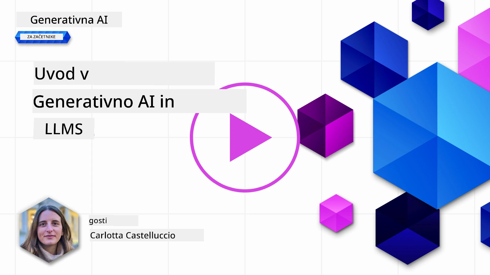
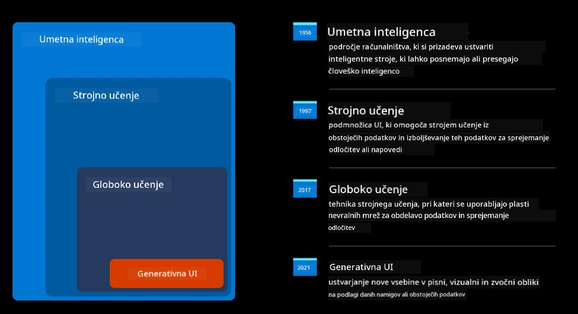
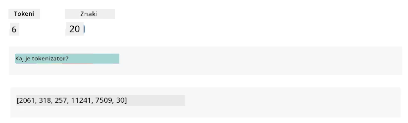
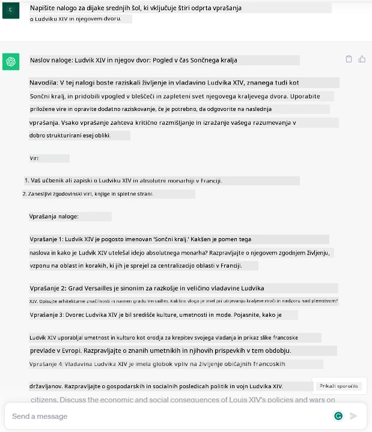
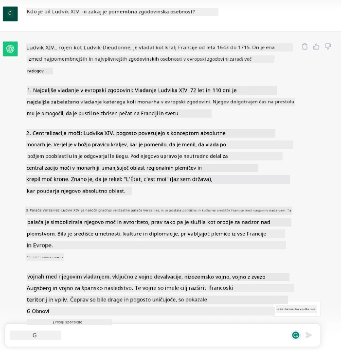
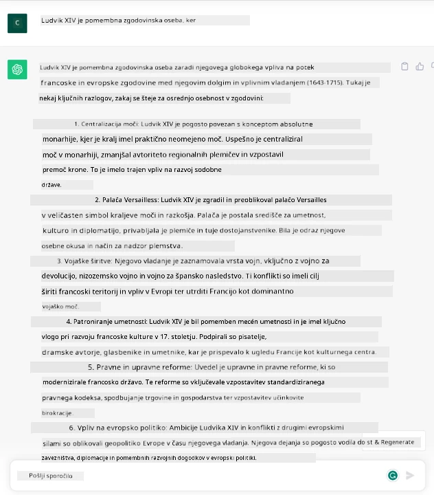
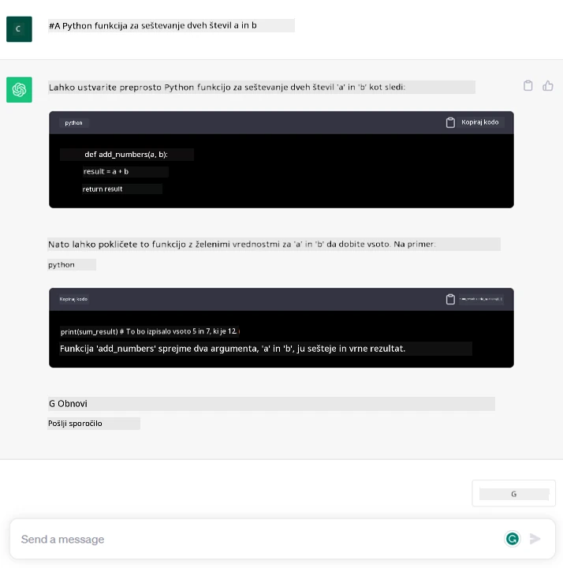

# Uvod v generativno umetno inteligenco in velike jezikovne modele

_(Kliknite na zgornjo sliko za ogled videa te lekcije)_

Generativna umetna inteligenca je umetna inteligenca, sposobna ustvarjati besedila, slike in druge vrste vsebin. Tisto, kar jo dela fantastično tehnologijo, je, da demokratizira AI, vsakdo jo lahko uporablja le z besedilnim pozivom, stavkom napisanem v naravnem jeziku. Ni vam treba se učiti jezika, kot sta Java ali SQL, da bi dosegli nekaj koristnega, potrebujete le uporabiti svoj jezik, navesti, kaj želite, in nastane predlog iz AI modela. Aplikacije in vpliv tega so ogromni, pišete ali razumete poročila, pišete aplikacije in še več, vse v nekaj sekundah.

V tem učnem načrtu bomo raziskali, kako naše zagonsko podjetje uporablja generativno AI za odklepanje novih scenarijev v svetu izobraževanja ter kako naslovimo neizogibne izzive, povezane z družbenimi implikacijami njene uporabe in tehnološkimi omejitvami.

## Uvod

Ta lekcija bo zajemala:

- Uvod v poslovni scenarij: ideja in poslanstvo našega zagonskega podjetja.
- Generativna AI in kako smo prišli do trenutnega tehnološkega stanja.
- Notranje delovanje velikega jezikovnega modela.
- Glavne zmogljivosti in praktične uporabe velikih jezikovnih modelov.

## Cilji učenja

Po zaključku te lekcije boste razumeli:

- Kaj je generativna AI in kako delujejo veliki jezikovni modeli.
- Kako lahko izkoristite velike jezikovne modele za različne primere uporabe z osredotočenostjo na izobraževalne scenarije.

## Scenarij: naše izobraževalno zagonsko podjetje

Generativna umetna inteligenca (AI) predstavlja vrhunec AI tehnologije, ki premika meje tistega, kar je bilo nekoč nenavadno. Generativni AI modeli imajo več zmogljivosti in aplikacij, vendar bomo v tem učnem načrtu raziskali, kako revolucionarno spreminjajo izobraževanje prek izmišljenega zagonskega podjetja. To zagonsko podjetje bomo imenovali _naše zagonsko podjetje_. Naše podjetje deluje na področju izobraževanja z ambicioznim poslanstvom

> _izboljšati dostopnost do učenja na globalni ravni, zagotoviti pošten dostop do izobraževanja in zagotavljati prilagojene učne izkušnje vsakemu učencu glede na njihove potrebe_.

Ekipa našega zagonskega podjetja se zaveda, da tega cilja ne bomo mogli doseči brez uporabe enega najmočnejših orodij sodobnega časa – velikih jezikovnih modelov (LLM).

Pričakuje se, da bo generativna AI revolucionarno spremenila način, kako se danes učimo in učimo, saj imajo študenti na voljo virtualne učitelje 24 ur na dan, ki zagotavljajo ogromno informacij in primerov, učitelji pa lahko uporabljajo inovativna orodja za ocenjevanje svojih učencev in podajanje povratnih informacij.

Za začetek opredelimo nekaj osnovnih pojmov in terminologije, ki jih bomo uporabljali skozi učni načrt.

## Kako smo prišli do generativne AI?

Kljub izjemnemu _hypeu_, ustvarjenemu nedavno z objavo generativnih AI modelov, je ta tehnologija v razvoju že desetletja, pri čemer segajo prvotni raziskovalni napori v 60. leta. Danes smo na točki, kjer ima AI kognitivne sposobnosti, podobne človeku, kot je pogovor, kot npr. [OpenAI ChatGPT](https://openai.com/chatgpt) ali [Microsoft Copilot](https://copilot.microsoft.com/?WT.mc_id=academic-105485-koreyst), ki prav tako uporablja GPT model za svojo izkušnjo konverzacijske spletne iskalne funkcije.

Začnimo nekoliko nazaj: prvi prototipi AI so bili tičkani klepetalni roboti, ki so temeljili na bazi znanja, izvlečeni iz skupine strokovnjakov in prikazani v računalniku. Odgovori v bazi znanja so se sprožili na podlagi ključnih besed, ki so se pojavile v vhodnem besedilu.
Vendar je postalo kmalu jasno, da takšen pristop, uporaba tičkanih klepetalnih robotov, ni dobro skaliral.

### Statistični pristop k AI: strojno učenje

Prelomnica je prišla v 90. letih z uporabo statističnega pristopa k analizi besedila. To je privedlo do razvoja novih algoritmov – poznanih kot strojno učenje – ki so sposobni učiti se vzorce iz podatkov brez eksplicitnega programiranja. Tak pristop omogoča strojem simulacijo razumevanja človeškega jezika: statistični model je usposobljen na parih besedilo-oznaka, kar omogoča razvrščanje neznanih vhodnih besedil s predhodno določeno oznako, ki predstavlja namen sporočila.

### Nevronske mreže in sodobni virtualni asistenti

V zadnjih letih je tehnološki razvoj strojne opreme, zmožne obdelovati večje količine podatkov in kompleksnejše izračune, spodbudil raziskave na področju AI, kar je privedlo do razvoja naprednih algoritmov strojnega učenja, znanih kot nevronske mreže ali globoko učenje.

Nevronske mreže (zlasti ponavljajoče nevronske mreže – RNN) so močno izboljšale obdelavo naravnega jezika, omogočajoč bolj smiselno reprezentacijo pomena besedila in cenjenje konteksta besede v stavku.

To je tehnologija, ki je poganjala virtualne asistente v prvem desetletju novega stoletja, zelo usposobljene za razumevanje človeškega jezika, prepoznavanje potreb in izvajanje dejanj za zadovoljitev – kot je odgovor z vnaprej določenim skriptom ali uporabo storitve tretje strani.

### Danes: generativna AI

Tako smo prišli do današnje generativne AI, ki jo lahko vidimo kot podmnožico globokega učenja.

Po desetletjih raziskav na področju AI je nova arhitektura modela – imenovana _Transformer_ – premagala omejitve RNN-jev, saj je sposoben sprejeti dosti daljše zaporedje besedila kot vhod. Transformatorji temeljijo na mehanizmu pozornosti, ki omogoča modelu, da različnim vhodom dodeli različne uteži, 'posveča več pozornosti' tam, kjer je koncentrirana najbolj relevantna informacija, ne glede na njihov vrstni red v nizu besedila.

Večina nedavnih generativnih AI modelov – znanih tudi kot veliki jezikovni modeli (LLM), saj delujejo z besedilnimi vhodi in izhodi – temelji prav na tej arhitekturi. Kar je zanimivo pri teh modelih – usposobljenih na ogromno količino neoznačenih podatkov iz različnih virov, kot so knjige, članki in spletne strani – je, da jih je mogoče prilagoditi širokemu spektru nalog in ustvariti slovnično pravilna besedila s pridihom kreativnosti. Torej ne samo, da so izjemno izboljšali sposobnost stroja za 'razumevanje' vhodnega besedila, temveč so omogočili tudi njihovo sposobnost, da generirajo izviren odgovor v človeškem jeziku.

## Kako delujejo veliki jezikovni modeli?

V naslednjem poglavju bomo raziskali različne vrste generativnih AI modelov, za zdaj pa si poglejmo, kako delujejo veliki jezikovni modeli, s poudarkom na modelih OpenAI GPT (Generative Pre-trained Transformer).

- **Tokenizator, tekst v številke**: Veliki jezikovni modeli prejmejo besedilo kot vhod in ustvarijo besedilo kot izhod. Ker so statistični modeli, delujejo mnogo bolje s številkami kot z besedilnimi zaporedji. Zato vsak vhod v model obdela tokenizator, preden ga uporablja osnovni model. Token je kos besedila – ki ga sestavlja spremenljivo število znakov, zato je glavna naloga tokenizatorja razdeliti vhod v niz tokenov. Nato je vsak token preslikan z indeksom tokena, kar je celoštevilska kodiranja izvirnega kosa besedila.

- **Napovedovanje izhodnih tokenov**: Glede na n tokenov kot vhod (pri čemer je maksimalno n odvisno od modela) je model sposoben napovedati en token kot izhod. Ta token se nato vključi v vhod naslednje iteracije v vzorcu razširitvenega okna, kar omogoča boljšo uporabniško izkušnjo prejemanja enega (ali več) stavkov kot odgovora. To pojasnjuje, zakaj ste, če ste se kdaj igrali s ChatGPT, morda opazili, da včasih deluje, kot da se ustavi na polovici stavka.

- **Proces izbire, porazdelitev verjetnosti**: Izhodni token izbere model glede na verjetnost njegovega pojava po trenutnem besedilnem zaporedju. To je zato, ker model napoveduje verjetnostno porazdelitev za vse možne 'naslednje tokene', izračunano na podlagi njegovega usposabljanja. Vendar pa token z najvišjo verjetnostjo ni vedno izbran iz porazdelitve. Temu izboru je dodana stopnja naključnosti, tako da model deluje na nedeterminističen način - pri istih vhodih ne dobimo natančno istega izhoda. Ta stopnja naključnosti je dodana, da simulira proces ustvarjalnega razmišljanja in jo lahko prilagajamo z nastavitvijo parametra modela, imenovanim temperatura.

## Kako lahko naše zagonsko podjetje izkoristi velike jezikovne modele?

Zdaj, ko bolje razumemo notranje delovanje velikega jezikovnega modela, si poglejmo nekatere praktične primere najpogostejših nalog, ki jih lahko dobro opravljajo, z vidika našega poslovnega scenarija.
Rekli smo, da je glavna zmogljivost velikega jezikovnega modela _generiranje besedila iz nič, na podlagi tekstualnega vhoda, zapisanega v naravnem jeziku_.

Vendar kakšen tekstualni vhod in izhod?
Vhod velikega jezikovnega modela je znan kot poziv (prompt), izhod pa kot dokončanje (completion), izraz, ki se nanaša na mehanizem generiranja naslednjega tokena za dokončanje trenutnega vhoda. Podrobneje bomo raziskali, kaj je poziv in kako ga oblikovati tako, da bomo iz modela dobili največ. Za zdaj pa recimo, da poziv lahko vključuje:

- **Navodilo**, ki določa vrsto izhoda, ki ga pričakujemo od modela. To navodilo včasih vključuje primere ali dodatne podatke.

  1. Povzetek članka, knjige, mnenj o izdelku in več, skupaj z izvlečkom spoznanj iz nestrukturiranih podatkov.
    
    
  
  2. Kreativno ustvarjanje in oblikovanje članka, eseja, domače naloge ali več.
      
     

- **Vprašanje**, postavljeno v obliki pogovora z agentom.
  
  

- Kos **besedila za dokončanje**, ki implicitno pomeni prošnjo po pisateljski pomoči.
  
  

- Kos **kode** skupaj z zahtevo po razlagi in dokumentaciji ali komentarjem za generiranje dela kode za določeno nalogo.
  
  

Primeri zgoraj so precej enostavni in ne predstavljajo izčrpnega prikaza zmogljivosti velikih jezikovnih modelov. Namenjeni so prikazu potenciala uporabe generativne AI, zlasti, a ne omejeno na izobraževalne kontekste.

Prav tako izhod generativnega AI modela ni popoln in včasih lahko ustvarjalnost modela deluje proti njemu, kar vodi do izhoda, ki je kombinacija besed, ki jih človek lahko interpretira kot zavajanje realnosti ali pa je lahko neprimeren. Generativna AI ni inteligentna – vsaj ne v širši definiciji inteligence, ki vključuje kritično in ustvarjalno razmišljanje ali čustveno inteligenco; ni deterministična in ni zanesljiva, saj se izmišljotine, kot so napačni sklici, vsebine in izjave, lahko združijo s pravimi informacijami in predstavijo na prepričljiv in samozavesten način. V naslednjih lekcijah se bomo spopadli z vsemi temi omejitvami in videli, kako jih lahko omilimo.

## Naloga

Vaša naloga je prebrati več o [generativni AI](https://en.wikipedia.org/wiki/Generative_artificial_intelligence?WT.mc_id=academic-105485-koreyst) in poskusiti opredeliti področje, kjer bi danes dodali generativno AI, kjer je tega še ni. Kako bi bil vpliv drugačen kot pri "starem načinu"? Ali lahko naredite nekaj, česar prej niste mogli, ali ste hitrejši? Napišite 300-besedni povzetek o tem, kako bi izgledalo vaše sanjsko AI zagonsko podjetje in vključite naslove, kot so "Problem", "Kako bi uporabil AI", "Vpliv" in po želji poslovni načrt.

Če ste opravili to nalogo, boste morda pripravljeni prijaviti se v Microsoftov inkubator, [Microsoft for Startups Founders Hub](https://www.microsoft.com/startups?WT.mc_id=academic-105485-koreyst), kjer ponujamo kredite za Azure, OpenAI, mentorstvo in še več, oglejte si!

## Preverjanje znanja

Kaj drži za velike jezikovne modele?

1. Vedno dobite točen isti odgovor.
1. Delajo popolno, odlično seštevanje, ustvarijo delujočo kodo itd.
1. Odgovor je lahko različen, čeprav uporabite isti poziv. Prav tako so odlični za pripravo prvega osnutka nečesa, bodisi besedila ali kode. Toda rezultate je treba izboljšati.

A: 3, LLM ni determinističen, odgovor se razlikuje, lahko pa nadzorujete njegovo varianco preko nastavitve temperature. Prav tako ne smete pričakovati, da dela stvari popolno, njegov namen je opraviti težka opravila, kar pogosto pomeni, da dobite dobro prvo različico nečesa, kar morate postopoma izboljševati.

## Odlično delo! Nadaljujte pot

Po zaključku te lekcije si oglejte našo [Generativno AI zbirko za učenje](https://aka.ms/genai-collection?WT.mc_id=academic-105485-koreyst), da nadaljujete z nadgradnjo svojega znanja o generativni AI!

Pojdite na Lekcijo 2, kjer si bomo ogledali, kako [raziskovati in primerjati različne vrste LLM](../02-exploring-and-comparing-different-llms/README.md?WT.mc_id=academic-105485-koreyst)!

---

<!-- CO-OP TRANSLATOR DISCLAIMER START -->
**Omejitev odgovornosti**:
Ta dokument je bil preveden z uporabo AI prevajalske storitve [Co-op Translator](https://github.com/Azure/co-op-translator). Čeprav si prizadevamo za natančnost, vas prosimo, da upoštevate, da avtomatizirani prevodi lahko vsebujejo napake ali netočnosti. Izvirni dokument v njegovem izvirnem jeziku je treba obravnavati kot avtoritativni vir. Za kritične informacije je priporočljiv strokovni človeški prevod. Ne odgovarjamo za morebitna nesporazume ali napačne interpretacije, ki izhajajo iz uporabe tega prevoda.
<!-- CO-OP TRANSLATOR DISCLAIMER END -->