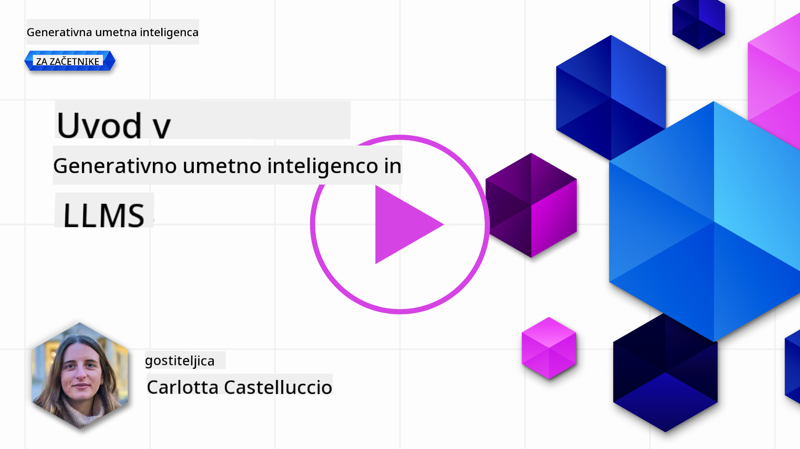
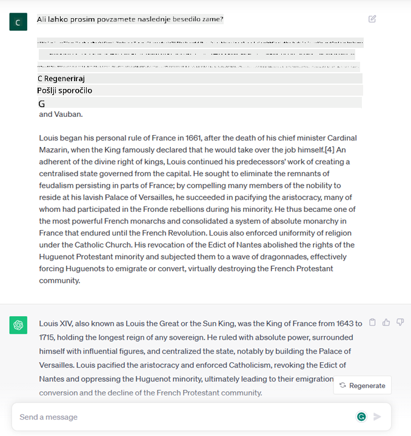

<!--
CO_OP_TRANSLATOR_METADATA:
{
  "original_hash": "bfb7901bdbece1ba3e9f35c400ca33e8",
  "translation_date": "2025-10-18T01:45:18+00:00",
  "source_file": "01-introduction-to-genai/README.md",
  "language_code": "sl"
}
-->
# Uvod v generativno umetno inteligenco in velike jezikovne modele

_(Kliknite na zgornjo sliko za ogled videa te lekcije)_

Generativna umetna inteligenca je umetna inteligenca, ki je sposobna generirati besedilo, slike in druge vrste vsebin. Kar to tehnologijo dela izjemno, je njena dostopnost – vsakdo jo lahko uporablja zgolj z besednim pozivom, stavkom, napisanim v naravnem jeziku. Ni vam treba poznati programskih jezikov, kot sta Java ali SQL, da bi dosegli nekaj vrednega; vse, kar potrebujete, je vaš jezik, izrazite, kaj želite, in AI model vam ponudi predlog. Uporaba in vpliv te tehnologije sta ogromna – od pisanja ali razumevanja poročil, pisanja aplikacij in še veliko več, vse v nekaj sekundah.

V tem učnem načrtu bomo raziskali, kako naš startup uporablja generativno umetno inteligenco za odpiranje novih scenarijev v svetu izobraževanja ter kako se spopadamo z neizogibnimi izzivi, povezanimi s socialnimi implikacijami njene uporabe in tehnološkimi omejitvami.

## Uvod

Ta lekcija bo obravnavala:

- Uvod v poslovni scenarij: našo idejo in poslanstvo startupa.
- Generativno umetno inteligenco in kako smo prišli do trenutne tehnološke pokrajine.
- Delovanje velikega jezikovnega modela.
- Glavne zmogljivosti in praktične primere uporabe velikih jezikovnih modelov.

## Cilji učenja

Po zaključku te lekcije boste razumeli:

- Kaj je generativna umetna inteligenca in kako delujejo veliki jezikovni modeli.
- Kako lahko izkoristite velike jezikovne modele za različne primere uporabe, s poudarkom na izobraževalnih scenarijih.

## Scenarij: naš izobraževalni startup

Generativna umetna inteligenca (AI) predstavlja vrhunec tehnologije umetne inteligence, ki premika meje nekoč nemogočega. Generativni AI modeli imajo številne zmogljivosti in aplikacije, vendar bomo v tem učnem načrtu raziskali, kako revolucionirajo izobraževanje prek izmišljenega startupa. Ta startup bomo imenovali _naš startup_. Naš startup deluje na področju izobraževanja z ambicioznim poslanstvom:

> _izboljšati dostopnost do učenja na globalni ravni, zagotoviti enakopraven dostop do izobraževanja in nuditi personalizirane učne izkušnje vsakemu učencu glede na njegove potrebe_.

Ekipa našega startupa se zaveda, da tega cilja ne bomo mogli doseči brez uporabe enega najmočnejših orodij sodobnega časa – velikih jezikovnih modelov (LLMs).

Generativna umetna inteligenca naj bi revolucionirala način, kako danes učimo in se učimo, saj bodo imeli učenci na voljo virtualne učitelje 24 ur na dan, ki zagotavljajo ogromne količine informacij in primerov, učitelji pa bodo lahko uporabljali inovativna orodja za ocenjevanje svojih učencev in podajanje povratnih informacij.

Za začetek opredelimo nekaj osnovnih pojmov in terminologije, ki jo bomo uporabljali skozi celoten učni načrt.

## Kako smo prišli do generativne umetne inteligence?

Kljub izjemnemu _hypeu_, ki ga je v zadnjem času povzročila objava generativnih AI modelov, se ta tehnologija razvija že desetletja, pri čemer prvi raziskovalni napori segajo v 60. leta. Zdaj smo na točki, ko ima AI človeške kognitivne sposobnosti, kot je pogovor, kar dokazujejo na primer [OpenAI ChatGPT](https://openai.com/chatgpt) ali [Bing Chat](https://www.microsoft.com/edge/features/bing-chat?WT.mc_id=academic-105485-koreyst), ki za spletne pogovore uporablja GPT model.

Če se nekoliko vrnemo nazaj, so prvi prototipi AI vključevali pisalne klepetalne robote, ki so se zanašali na bazo znanja, pridobljeno od skupine strokovnjakov in predstavljeno v računalniku. Odgovori v bazi znanja so se sprožili s ključnimi besedami, ki so se pojavile v vhodnem besedilu. Vendar se je kmalu izkazalo, da takšen pristop, ki uporablja pisalne klepetalne robote, ni bil dobro prilagodljiv.

### Statistični pristop k umetni inteligenci: strojno učenje

Prelomnica je nastopila v 90. letih z uporabo statističnega pristopa k analizi besedila. To je privedlo do razvoja novih algoritmov – znanih kot strojno učenje – ki so sposobni prepoznavati vzorce iz podatkov, ne da bi bili izrecno programirani. Ta pristop omogoča strojem simulacijo razumevanja človeškega jezika: statistični model se usposobi na parih besedilo-oznaka, kar modelu omogoča razvrščanje neznanega vhodnega besedila s predhodno določeno oznako, ki predstavlja namen sporočila.

### Nevronske mreže in sodobni virtualni asistenti

V zadnjih letih je tehnološki razvoj strojne opreme, ki je sposobna obdelati večje količine podatkov in bolj zapletene izračune, spodbudil raziskave na področju umetne inteligence, kar je privedlo do razvoja naprednih algoritmov strojnega učenja, znanih kot nevronske mreže ali algoritmi globokega učenja.

Nevronske mreže (zlasti povratne nevronske mreže – RNN) so bistveno izboljšale obdelavo naravnega jezika, saj omogočajo bolj smiselno predstavitev pomena besedila, pri čemer upoštevajo kontekst besede v stavku.

To je tehnologija, ki je omogočila nastanek virtualnih asistentov v prvem desetletju novega stoletja, ki so zelo spretni pri interpretaciji človeškega jezika, prepoznavanju potreb in izvajanju dejanj za njihovo zadovoljitev – na primer odgovarjanju s predhodno določenim scenarijem ali uporabi storitev tretjih oseb.

### Danes, generativna umetna inteligenca

Tako smo prišli do današnje generativne umetne inteligence, ki jo lahko vidimo kot podskupino globokega učenja.

Po desetletjih raziskav na področju umetne inteligence je nova arhitektura modela – imenovana _Transformer_ – presegla omejitve RNN-jev, saj je sposobna sprejeti veliko daljše zaporedje besedila kot vhod. Transformatorji temeljijo na mehanizmu pozornosti, ki modelu omogoča, da različnim vhodnim podatkom dodeli različne teže, 'posveča več pozornosti' tam, kjer je zgoščena najbolj relevantna informacija, ne glede na njihov vrstni red v zaporedju besedila.

Večina nedavnih generativnih AI modelov – znanih tudi kot veliki jezikovni modeli (LLMs), saj delujejo z besedilnimi vhodi in izhodi – temelji prav na tej arhitekturi. Zanimivo pri teh modelih – usposobljenih na ogromni količini neoznačenih podatkov iz različnih virov, kot so knjige, članki in spletne strani – je, da jih je mogoče prilagoditi za širok spekter nalog in generirati slovnično pravilno besedilo z nekaj ustvarjalnosti. Tako so ne le izjemno izboljšali sposobnost stroja, da 'razume' vhodno besedilo, ampak so omogočili tudi njegovo sposobnost generiranja izvirnega odgovora v človeškem jeziku.

## Kako delujejo veliki jezikovni modeli?

V naslednjem poglavju bomo raziskali različne vrste generativnih AI modelov, za zdaj pa si poglejmo, kako delujejo veliki jezikovni modeli, s poudarkom na modelih OpenAI GPT (Generative Pre-trained Transformer).

- **Tokenizer, pretvorba besedila v številke**: Veliki jezikovni modeli sprejmejo besedilo kot vhod in generirajo besedilo kot izhod. Ker pa so statistični modeli, bolje delujejo s številkami kot z besedilnimi zaporedji. Zato je vsak vhod v model obdelan s tokenizerjem, preden ga uporabi osrednji model. Token je del besedila – sestavljen iz spremenljivega števila znakov, zato je glavna naloga tokenizerja razdeliti vhod na niz tokenov. Nato se vsak token preslika v indeks tokena, ki je celoštevilska kodifikacija izvirnega dela besedila.

- **Napovedovanje izhodnih tokenov**: Glede na n tokenov kot vhod (pri čemer se največji n razlikuje od modela do modela) je model sposoben napovedati en token kot izhod. Ta token se nato vključi v vhod naslednje iteracije, v vzorcu razširjajočega se okna, kar omogoča boljšo uporabniško izkušnjo pridobivanja enega (ali več) stavkov kot odgovora. To pojasnjuje, zakaj, če ste se kdaj igrali s ChatGPT, ste morda opazili, da se včasih zdi, da se ustavi sredi stavka.

- **Postopek izbire, porazdelitev verjetnosti**: Izhodni token model izbere glede na njegovo verjetnost, da se pojavi po trenutnem besedilnem zaporedju. To je zato, ker model napoveduje porazdelitev verjetnosti za vse možne 'naslednje tokene', izračunano na podlagi njegovega usposabljanja. Vendar pa ni vedno izbran token z najvišjo verjetnostjo iz nastale porazdelitve. Temu izboru se doda določena stopnja naključnosti, tako da model deluje na nedeterminističen način – za isti vhod ne dobimo vedno enakega izhoda. Ta stopnja naključnosti je dodana za simulacijo procesa ustvarjalnega razmišljanja in jo je mogoče prilagoditi z nastavitvijo parametra modela, imenovanega temperatura.

## Kako lahko naš startup izkoristi velike jezikovne modele?

Zdaj, ko bolje razumemo delovanje velikega jezikovnega modela, si poglejmo nekaj praktičnih primerov najpogostejših nalog, ki jih lahko ti modeli zelo dobro opravljajo, s poudarkom na našem poslovnem scenariju. Rekli smo, da je glavna zmogljivost velikega jezikovnega modela _generiranje besedila iz nič, na podlagi besedilnega vhoda, napisanega v naravnem jeziku_.

Toda kakšen je lahko besedilni vhod in izhod?
Vhod velikega jezikovnega modela je znan kot poziv (prompt), medtem ko je izhod znan kot zaključek (completion), kar se nanaša na mehanizem modela za generiranje naslednjega tokena za dokončanje trenutnega vhoda. Podrobneje bomo raziskali, kaj je poziv in kako ga oblikovati, da kar najbolje izkoristimo naš model. Za zdaj pa recimo, da lahko poziv vključuje:

- **Navodilo**, ki določa vrsto izhoda, ki ga pričakujemo od modela. To navodilo lahko včasih vključuje nekaj primerov ali dodatnih podatkov.

  1. Povzetek članka, knjige, pregledov izdelkov in več, skupaj z izluščanjem vpogledov iz nestrukturiranih podatkov.
    
    
  
  2. Ustvarjalno oblikovanje in zasnova članka, eseja, naloge ali več.
      
     

- **Vprašanje**, zastavljeno v obliki pogovora z agentom.
  
  

- Del **besedila za dokončanje**, kar implicitno pomeni prošnjo za pomoč pri pisanju.
  
  

- Del **kode** skupaj s prošnjo za razlago in dokumentiranje ali komentarjem, ki zahteva generiranje dela kode za izvedbo določene naloge.
  
  

Zgornji primeri so precej preprosti in niso namenjeni izčrpni predstavitvi zmogljivosti velikih jezikovnih modelov. Namenjeni so prikazu potenciala uporabe generativne umetne inteligence, zlasti, vendar ne izključno, v izobraževalnih kontekstih.

Prav tako izhod generativnega AI modela ni popoln in včasih lahko ustvarjalnost modela deluje proti njemu, kar ima za posledico izhod, ki je kombinacija besed, ki jih lahko človeški uporabnik interpretira kot izkrivljanje resničnosti, ali pa je lahko žaljiv. Generativna umetna inteligenca ni inteligentna – vsaj ne v širšem pomenu inteligence, ki vključuje kritično in ustvarjalno razmišljanje ali čustveno inteligenco; ni deterministična in ni zanesljiva, saj se lahko napačne reference, vsebine in izjave kombinirajo s pravilnimi informacijami in predstavijo na prepričljiv in samozavesten način. V naslednjih lekcijah se bomo ukvarjali z vsemi temi omejitvami in videli, kaj lahko storimo, da jih omilimo.

## Naloga

Vaša naloga je, da se dodatno informirate o [generativni umetni inteligenci](https://en.wikipedia.org/wiki/Generative_artificial_intelligence?WT.mc_id=academic-105485-koreyst) in poskusite identificirati področje, kjer bi danes dodali generativno umetno inteligenco, ki je še nima. Kako bi bil učinek drugačen od izvajanja na "stari način", ali lahko naredite nekaj, česar prej niste mogli, ali ste hitrejši? Napišite 300-besedno povzetek o tem, kako bi izgledal vaš sanjski AI startup, in vključite naslove, kot so "Problem", "Kako bi uporabil AI", "Vpliv" in po želji poslovni načrt.

Če ste opravili to nalogo, ste morda že pripravljeni na prijavo v Microsoftov inkubator, [Microsoft for Startups Founders Hub](https://www.microsoft.com/startups?WT.mc_id=academic-105485-koreyst), kjer ponujamo kredite za Azure, OpenAI, mentorstvo in še veliko več, preverite!

## Preverjanje znanja

Kaj drži za velike jezikovne modele?

1. Vsakič dobite popolnoma enak odgovor.
1. Vse naredi popolno, odlično sešteva številke, proizvaja delujočo kodo itd.
1. Odgovor se lahko razlikuje, kljub uporabi istega poziva. Prav tako je odličen pri pripravi prvega osnutka nečesa, bodisi besedila ali kode. Vendar morate rezultate izboljšati.

A: 3, LLM ni determinističen, odgovor se razlikuje, vendar lahko njegovo variabilnost nadzorujete z nastavitvijo temperature. Prav tako ne smete pričakovati, da bo vse naredil popolno; tukaj je, da opravi težje delo namesto vas, kar pogosto pomeni, da dobite dober prvi poskus nečesa, kar morate postopoma izboljšati.

## Odlično delo! Nadaljujte z učenjem

Po zaključku te lekcije si oglejte našo [zbirko učenja o generativni umetni inteligenci](https://aka.ms/genai-collection?WT.mc_id=academic-105485-koreyst), da še naprej poglabljate svoje znanje o generativni umetni inteligenci!
Pojdite na Lekcijo 2, kjer si bomo ogledali, kako [raziskovati in primerjati različne vrste LLM](../02-exploring-and-comparing-different-llms/README.md?WT.mc_id=academic-105485-koreyst)!

---

**Omejitev odgovornosti**:  
Ta dokument je bil preveden z uporabo storitve za prevajanje AI [Co-op Translator](https://github.com/Azure/co-op-translator). Čeprav si prizadevamo za natančnost, vas prosimo, da upoštevate, da lahko avtomatizirani prevodi vsebujejo napake ali netočnosti. Izvirni dokument v njegovem maternem jeziku je treba obravnavati kot avtoritativni vir. Za ključne informacije priporočamo profesionalni človeški prevod. Ne prevzemamo odgovornosti za morebitna nesporazumevanja ali napačne razlage, ki izhajajo iz uporabe tega prevoda.