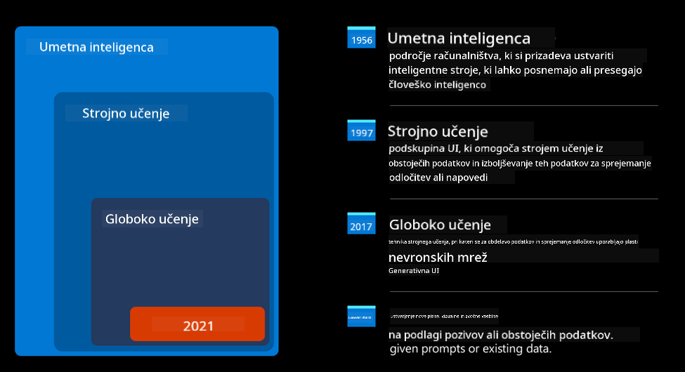
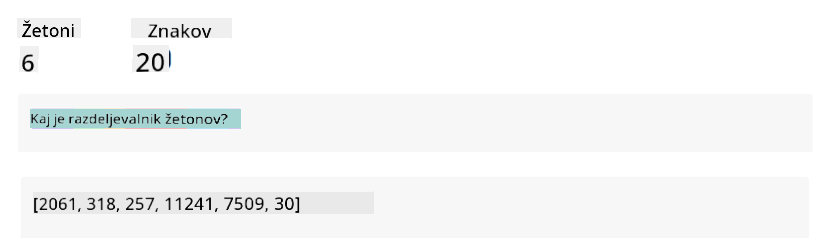
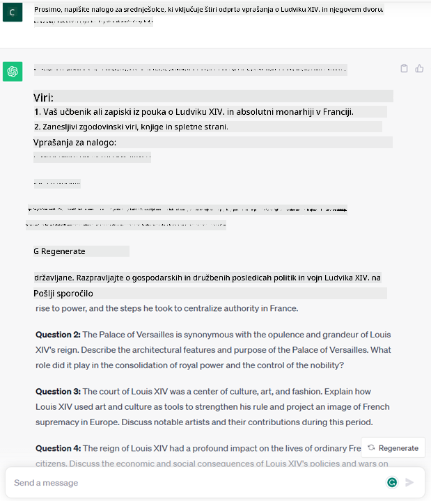
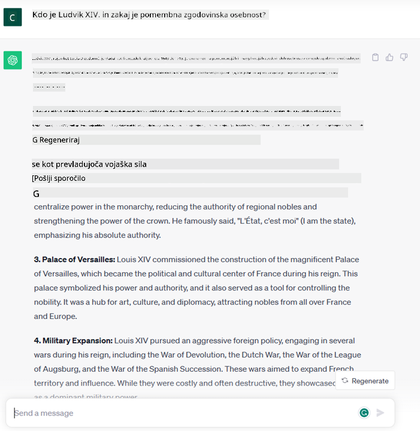
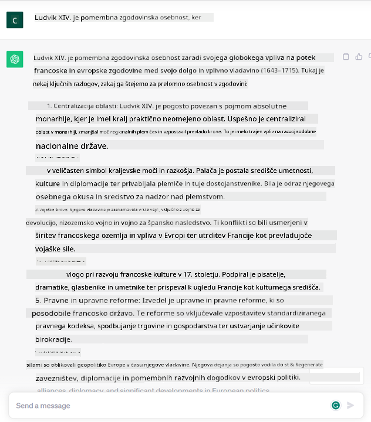
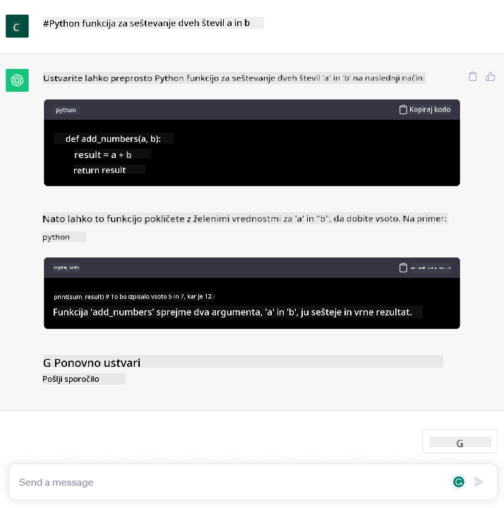

<!--
CO_OP_TRANSLATOR_METADATA:
{
  "original_hash": "f53ba0fa49164f9323043f1c6b11f2b1",
  "translation_date": "2025-07-09T08:04:24+00:00",
  "source_file": "01-introduction-to-genai/README.md",
  "language_code": "sl"
}
-->
# Uvod v generativno AI in velike jezikovne modele

_(Kliknite na zgornjo sliko za ogled videa te lekcije)_

Generativna AI je umetna inteligenca, ki zna ustvarjati besedila, slike in druge vrste vsebin. Njena prednost je, da demokratizira AI – vsak jo lahko uporablja z le nekaj besedami, napisano v naravnem jeziku. Ni vam treba znati programskih jezikov, kot sta Java ali SQL, da bi dosegli nekaj uporabnega; dovolj je, da uporabite svoj jezik, izrazite, kaj želite, in AI model vam ponudi predlog. Uporaba in vpliv so ogromni – pišete ali razumete poročila, ustvarjate aplikacije in še več, vse v nekaj sekundah.

V tem učnem načrtu bomo raziskali, kako naš startup uporablja generativno AI za odpiranje novih možnosti v izobraževanju ter kako se spopadamo z neizogibnimi izzivi, ki jih prinašajo družbeni vplivi uporabe te tehnologije in njene omejitve.

## Uvod

Ta lekcija bo zajemala:

- Predstavitev poslovnega scenarija: ideja in poslanstvo našega startupa.
- Generativno AI in kako smo prišli do trenutnega tehnološkega stanja.
- Notranje delovanje velikega jezikovnega modela.
- Glavne zmožnosti in praktične uporabe velikih jezikovnih modelov.

## Cilji učenja

Po zaključku te lekcije boste razumeli:

- Kaj je generativna AI in kako delujejo veliki jezikovni modeli.
- Kako lahko izkoristite velike jezikovne modele za različne primere uporabe, s poudarkom na izobraževalnih scenarijih.

## Scenarij: naš izobraževalni startup

Generativna umetna inteligenca (AI) predstavlja vrhunec AI tehnologije, saj premika meje tega, kar je bilo nekoč nepredstavljivo. Generativni AI modeli imajo številne zmožnosti in uporabe, a v tem učnem načrtu bomo raziskali, kako spreminjajo izobraževanje skozi fiktivni startup, ki ga bomo imenovali _naš startup_. Naš startup deluje na področju izobraževanja z ambicioznim poslanstvom:

> _izboljšati dostopnost do učenja na globalni ravni, zagotoviti pravičen dostop do izobraževanja in nuditi personalizirane učne izkušnje vsakemu učencu glede na njegove potrebe_.

Ekipa našega startupa se zaveda, da tega cilja ne bomo dosegli brez uporabe enega najmočnejših orodij sodobnega časa – velikih jezikovnih modelov (LLM).

Pričakuje se, da bo generativna AI revolucionirala način, kako danes učimo in se učimo, saj bodo imeli študenti na voljo virtualne učitelje 24 ur na dan, ki bodo zagotavljali ogromno količino informacij in primerov, učitelji pa bodo lahko uporabljali inovativna orodja za ocenjevanje in povratne informacije.

Za začetek si poglejmo nekaj osnovnih pojmov in terminologije, ki jih bomo uporabljali skozi celoten učni načrt.

## Kako smo prišli do generativne AI?

Kljub izjemnemu _navdušenju_, ki ga je v zadnjem času povzročilo pojavljanje generativnih AI modelov, je ta tehnologija v razvoju že desetletja, pri čemer segajo prvi raziskovalni napori v 60. leta prejšnjega stoletja. Danes smo na točki, ko AI dosega človeške kognitivne sposobnosti, kot je na primer pogovor, kar prikazujeta [OpenAI ChatGPT](https://openai.com/chatgpt) ali [Bing Chat](https://www.microsoft.com/edge/features/bing-chat?WT.mc_id=academic-105485-koreyst), ki prav tako uporablja GPT model za spletno iskanje in pogovore.

Če se vrnemo nazaj, so bili prvi prototipi AI tipkani chatbot-i, ki so temeljili na bazi znanja, pridobljeni od skupine strokovnjakov in vneseni v računalnik. Odgovori v bazi so se sprožili na podlagi ključnih besed v vhodnem besedilu. Kmalu pa je postalo jasno, da tak pristop s tipkanimi chatbot-i ni dobro skalabilen.

### Statistični pristop k AI: strojno učenje

Prelomnica je nastopila v 90. letih, ko je bil uporabljen statistični pristop k analizi besedil. To je privedlo do razvoja novih algoritmov – znanih kot strojno učenje – ki so sposobni prepoznavati vzorce v podatkih brez eksplicitnega programiranja. Ta pristop omogoča strojem simulacijo razumevanja človeškega jezika: statistični model se uči na parih besedilo-oznaka, kar mu omogoča, da razvrsti neznano vhodno besedilo z vnaprej določenimi oznakami, ki predstavljajo namen sporočila.

### Nevronske mreže in sodobni virtualni asistenti

V zadnjih letih je tehnološki razvoj strojne opreme, ki lahko obdeluje večje količine podatkov in bolj zapletene izračune, spodbudil raziskave na področju AI, kar je privedlo do razvoja naprednih algoritmov strojnega učenja, znanih kot nevronske mreže ali globoko učenje.

Nevronske mreže (še posebej rekurentne nevronske mreže – RNN) so močno izboljšale obdelavo naravnega jezika, saj omogočajo bolj smiselno predstavitev pomena besedila, upoštevajoč kontekst besede v stavku.

To je tehnologija, ki je poganjala virtualne asistente, rojene v prvem desetletju novega stoletja, zelo spretne pri razumevanju človeškega jezika, prepoznavanju potreb in izvajanju dejanj za njihovo zadovoljitev – na primer odgovarjanje s prednastavljenimi skripti ali uporaba storitev tretjih oseb.

### Današnji čas, generativna AI

Tako smo prišli do današnje generativne AI, ki jo lahko razumemo kot podskupino globokega učenja.

Po desetletjih raziskav na področju AI je nova arhitektura modela – imenovana _Transformer_ – premagala omejitve RNN-jev, saj lahko obdeluje veliko daljše zaporedje besedila kot vhod. Transformerji temeljijo na mehanizmu pozornosti, ki modelu omogoča, da različnim vhodom dodeli različne uteži, ‘posveča več pozornosti’ tam, kjer je zgoščena najbolj relevantna informacija, ne glede na njihov vrstni red v besedilnem zaporedju.

Večina sodobnih generativnih AI modelov – znanih tudi kot veliki jezikovni modeli (LLM), saj delujejo z besedilnimi vhodi in izhodi – temelji prav na tej arhitekturi. Zanimivo pri teh modelih, ki so usposobljeni na ogromnih količinah neoznačenih podatkov iz različnih virov, kot so knjige, članki in spletne strani, je, da jih je mogoče prilagoditi za širok spekter nalog in ustvarjati slovnično pravilno besedilo z določeno mero ustvarjalnosti. Tako niso le močno izboljšali sposobnost stroja, da ‘razume’ vhodno besedilo, ampak so mu omogočili tudi ustvarjanje izvirnih odgovorov v človeškem jeziku.

## Kako delujejo veliki jezikovni modeli?

V naslednjem poglavju bomo raziskali različne vrste generativnih AI modelov, za zdaj pa si poglejmo, kako delujejo veliki jezikovni modeli, s poudarkom na OpenAI GPT (Generative Pre-trained Transformer) modelih.

- **Tokenizer, pretvorba besedila v številke**: Veliki jezikovni modeli prejmejo besedilo kot vhod in ustvarijo besedilo kot izhod. Ker pa so statistični modeli, bolje delujejo s številkami kot z besedilnimi zaporedji. Zato vsak vhod pred uporabo v jedru modela obdela tokenizer. Token je kos besedila – sestavljen iz spremenljivega števila znakov, zato je glavna naloga tokenizerja razdeliti vhod na niz tokenov. Nato je vsak token povezan z indeksom tokena, kar je celoštevilska koda izvirnega kosa besedila.

- **Napovedovanje izhodnih tokenov**: Model, ki prejme n tokenov kot vhod (maksimalno število n se razlikuje med modeli), lahko napove en token kot izhod. Ta token se nato vključi v vhod naslednje iteracije, v vzorcu razširjajočega se okna, kar omogoča boljšo uporabniško izkušnjo, saj dobite enega (ali več) stavkov kot odgovor. To pojasnjuje, zakaj se vam je morda zdelo, da ChatGPT včasih ustavi sredi stavka.

- **Postopek izbire, porazdelitev verjetnosti**: Izhodni token izbere model glede na verjetnost njegovega pojavljanja po trenutnem besedilnem zaporedju. Model napove porazdelitev verjetnosti za vse možne ‘naslednje tokene’, izračunano na podlagi usposabljanja. Vendar pa ni vedno izbran token z najvišjo verjetnostjo. Dodana je mera naključnosti, tako da model deluje nedeterministično – za isti vhod ne dobimo vedno enakega izhoda. Ta naključnost simulira proces ustvarjalnega razmišljanja in jo lahko nastavimo z parametrom temperature.

## Kako lahko naš startup izkoristi velike jezikovne modele?

Zdaj, ko bolje razumemo notranje delovanje velikega jezikovnega modela, si poglejmo nekaj praktičnih primerov najpogostejših nalog, ki jih ti modeli zelo dobro opravijo, z mislijo na naš poslovni scenarij. Glavna zmožnost velikega jezikovnega modela je _generiranje besedila iz nič, na podlagi besedilnega vhoda, napisanega v naravnem jeziku_.

Kakšen vhod in izhod torej?
Vhod velikega jezikovnega modela imenujemo prompt, izhod pa completion, kar se nanaša na mehanizem modela za generiranje naslednjega tokena, ki dopolni trenutni vhod. Podrobno bomo raziskali, kaj je prompt in kako ga oblikovati, da bomo iz modela izvlekli največ. Za zdaj pa naj povemo, da prompt lahko vključuje:

- **Navodilo**, ki določa vrsto izhoda, ki ga pričakujemo od modela. To navodilo včasih vsebuje tudi primere ali dodatne podatke.

  1. Povzetek članka, knjige, ocen izdelkov in več, skupaj z izvlečkom vpogledov iz nestrukturiranih podatkov.
    
    
  
  2. Kreativno ustvarjanje in oblikovanje članka, eseja, naloge ali več.
      
     

- **Vprašanje**, postavljeno v obliki pogovora z agentom.
  
  

- Kos **besedila za dopolnitev**, kar implicitno pomeni prošnjo za pomoč pri pisanju.
  
  

- Kos **kode** skupaj z zahtevo po razlagi in dokumentaciji ali komentarjem, ki prosi za generiranje dela kode za določeno nalogo.
  
  

Zgornji primeri so precej preprosti in niso namenjeni izčrpnemu prikazu zmožnosti velikih jezikovnih modelov. Namenjeni so prikazu potenciala uporabe generativne AI, zlasti, a ne izključno, v izobraževalnih okoljih.

Prav tako izhod generativnega AI modela ni popoln in včasih lahko ustvarjalnost modela deluje proti njemu, kar vodi do izhoda, ki je kombinacija besed, ki jih uporabnik lahko dojema kot zavajanje ali pa je lahko žaljiv. Generativna AI ni inteligentna – vsaj ne v širšem pomenu inteligence, ki vključuje kritično in ustvarjalno razmišljanje ali čustveno inteligenco; ni deterministična in ni zanesljiva, saj se lahko napačne informacije, kot so netočne reference, vsebine in izjave, pomešajo s pravilnimi in so predstavljene na prepričljiv in samozavesten način. V naslednjih lekcijah se bomo ukvarjali z vsemi temi omejitvami in pogledali, kako jih lahko omilimo.

## Naloga

Vaša naloga je, da preberete več o [generativni AI](https://en.wikipedia.org/wiki/Generative_artificial_intelligence?WT.mc_id=academic-105485-koreyst) in poskušate identificirati področje, kjer bi danes dodali generativno AI, če je še nima. Kako bi bil vpliv drugačen v primerjavi s “starim načinom”? Ali lahko naredite nekaj, česar prej niste mogli, ali ste hitrejši? Napišite 300 besed dolg povzetek o tem, kakšen bi bil vaš sanjski AI startup, in vključite naslove, kot so "Problem", "Kako bi uporabil AI", "Vpliv" in po želji poslovni načrt.

Če opravite to nalogo, boste morda pripravljeni prijaviti se v Microsoftov inkubator, [Microsoft for Startups Founders Hub](https://www.microsoft.com/startups?WT.mc_id=academic-105485-koreyst), kjer ponujamo kredite za Azure, OpenAI, mentorstvo in še več, preverite!

## Preverjanje znanja

Kaj drži za velike jezikovne modele?

1. Vedno dobite točno isti odgovor.
1. Delajo popolno, odlično seštejejo številke, ustvarjajo delujočo kodo itd.
1. Odgovor se lahko razlikuje, tudi če uporabite isti prompt. Prav tako so odlični za pripravo prvega osnutka nečesa, bodisi besedila ali kode. Rezultate pa je treba izboljšati.

Odgovor: 3, LLM je nedeterminističen, odgovor se razlikuje, vendar lahko njegovo variabilnost nadzorujete z nastavitvijo temperature. Prav tako ne smete pričakovati popolnosti; model je tu, da opravi težje delo, kar pogosto pomeni, da dobite dober prvi poskus, ki ga je treba postopoma izboljšati.

## Odlično delo! Nadaljujte pot

Po zaključku te lekcije si oglejte našo [Generative AI Learning collection](https://aka.ms/genai-collection?WT.mc_id=academic-105485-koreyst) in nadaljujte z nadgrajevanjem svojega znanja o generativni AI!
Pojdite na Lekcijo 2, kjer bomo raziskali, kako [raziskati in primerjati različne vrste LLM-jev](../02-exploring-and-comparing-different-llms/README.md?WT.mc_id=academic-105485-koreyst)!

**Omejitev odgovornosti**:  
Ta dokument je bil preveden z uporabo AI prevajalske storitve [Co-op Translator](https://github.com/Azure/co-op-translator). Čeprav si prizadevamo za natančnost, vas opozarjamo, da avtomatizirani prevodi lahko vsebujejo napake ali netočnosti. Izvirni dokument v njegovem izvirnem jeziku velja za avtoritativni vir. Za ključne informacije priporočamo strokovni človeški prevod. Za morebitna nesporazume ali napačne interpretacije, ki izhajajo iz uporabe tega prevoda, ne odgovarjamo.