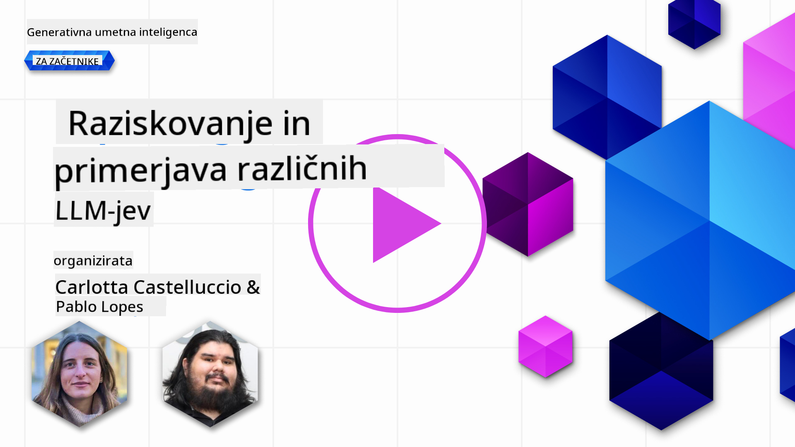
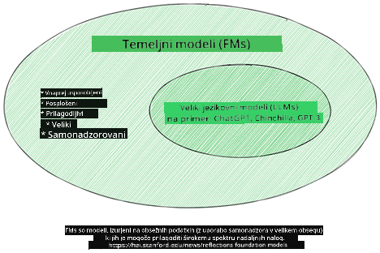
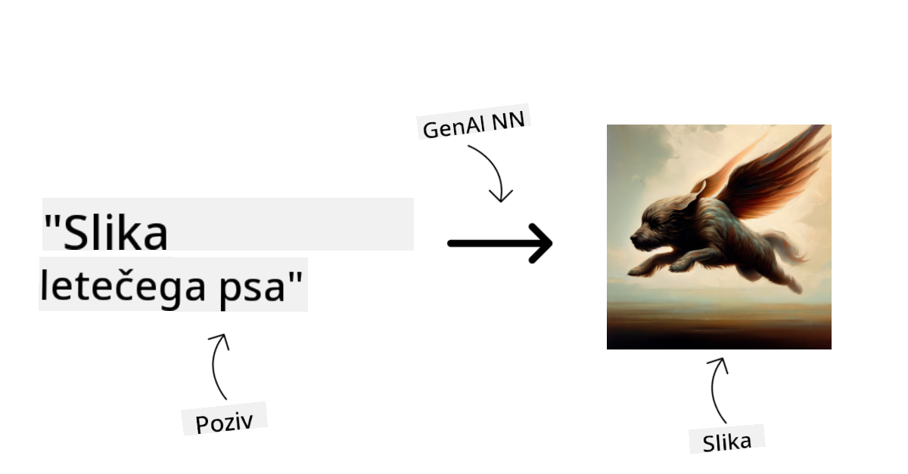
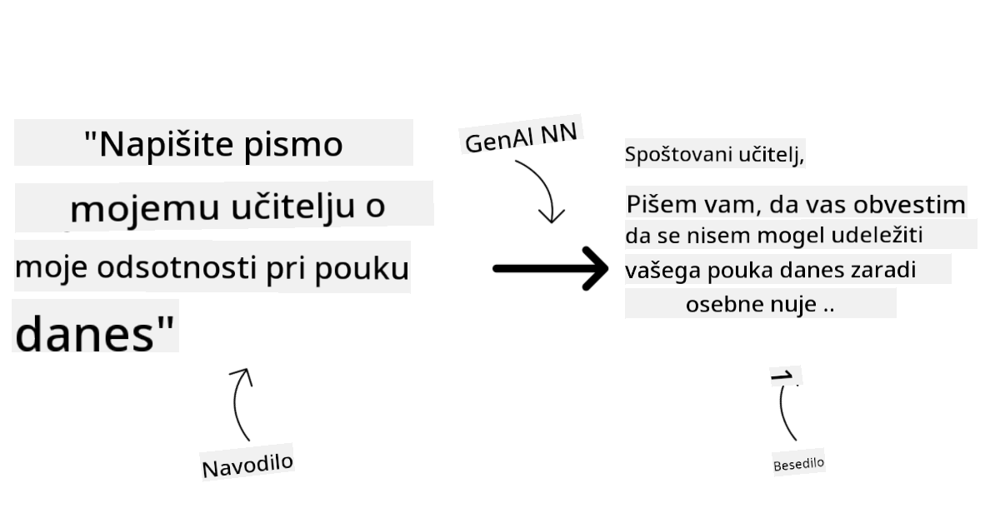
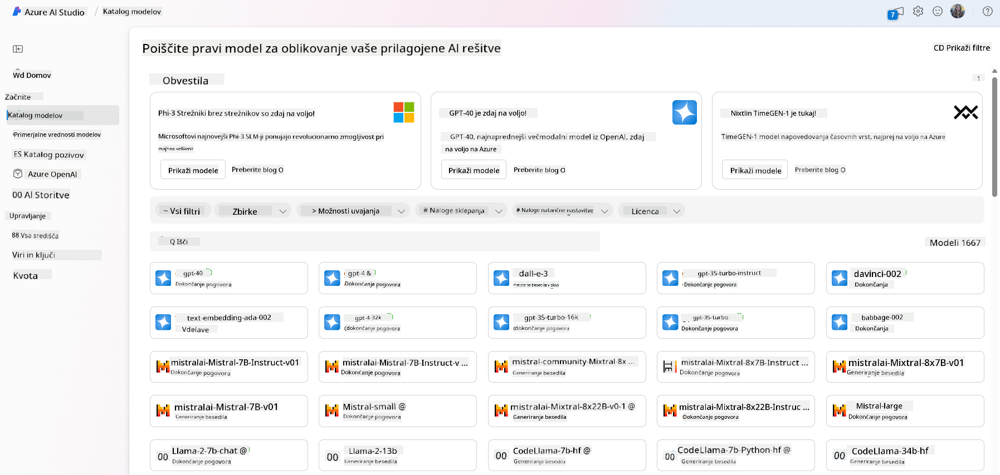
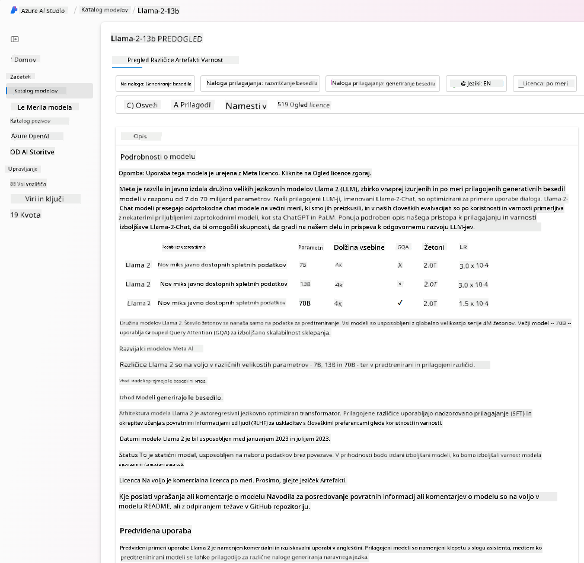
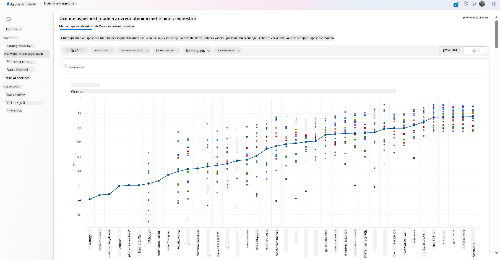
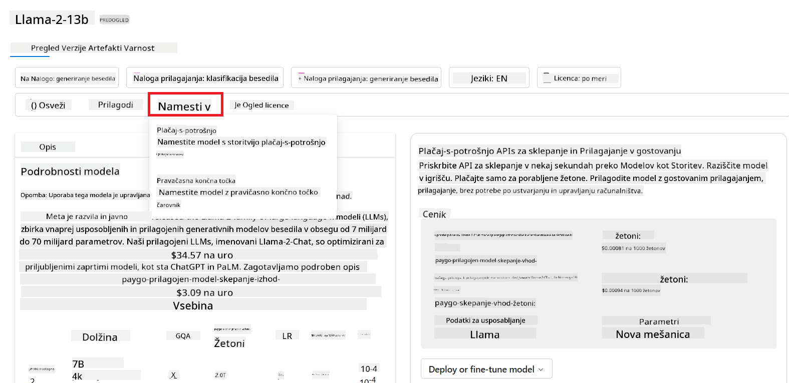
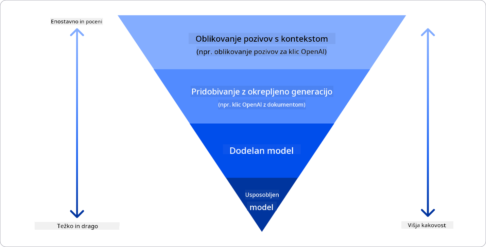

<!--
CO_OP_TRANSLATOR_METADATA:
{
  "original_hash": "e2f686f2eb794941761252ac5e8e090b",
  "translation_date": "2025-05-19T14:28:06+00:00",
  "source_file": "02-exploring-and-comparing-different-llms/README.md",
  "language_code": "sl"
}
-->
# Raziskovanje in primerjava različnih LLM-jev

> _Kliknite zgornjo sliko za ogled videa te lekcije_

V prejšnji lekciji smo videli, kako Generativna umetna inteligenca spreminja tehnološko pokrajino, kako delujejo Veliki jezikovni modeli (LLM-ji) in kako jih lahko podjetje - kot naš startup - uporabi za svoje primere uporabe in rast! V tem poglavju bomo primerjali in kontrastirali različne vrste velikih jezikovnih modelov (LLM-jev), da bi razumeli njihove prednosti in slabosti.

Naslednji korak na poti našega startupa je raziskovanje trenutne pokrajine LLM-jev in razumevanje, kateri so primerni za naš primer uporabe.

## Uvod

Ta lekcija bo pokrivala:

- Različne vrste LLM-jev v trenutni pokrajini.
- Testiranje, iteracijo in primerjavo različnih modelov za vaš primer uporabe v Azure.
- Kako uvesti LLM.

## Cilji učenja

Po zaključku te lekcije boste sposobni:

- Izbrati pravi model za vaš primer uporabe.
- Razumeti, kako testirati, iterirati in izboljšati delovanje vašega modela.
- Vedeti, kako podjetja uvajajo modele.

## Razumevanje različnih vrst LLM-jev

LLM-ji imajo lahko več kategorij glede na njihovo arhitekturo, podatke za usposabljanje in primer uporabe. Razumevanje teh razlik bo našemu startupu pomagalo izbrati pravi model za scenarij in razumeti, kako testirati, iterirati in izboljšati delovanje.

Obstaja veliko različnih vrst LLM modelov, vaša izbira modela pa je odvisna od tega, za kaj jih želite uporabiti, vaših podatkov, koliko ste pripravljeni plačati in več.

Glede na to, ali nameravate modele uporabljati za besedilo, zvok, video, generiranje slik in tako naprej, se lahko odločite za drugačno vrsto modela.

- **Prepoznavanje zvoka in govora**. Za ta namen so modeli tipa Whisper odlična izbira, saj so splošno namenjeni in usmerjeni na prepoznavanje govora. Usposobljeni so na raznolikem zvoku in lahko izvajajo večjezično prepoznavanje govora. Več o modelih tipa Whisper preberite [tukaj](https://platform.openai.com/docs/models/whisper?WT.mc_id=academic-105485-koreyst).

- **Generiranje slik**. Za generiranje slik sta DALL-E in Midjourney dve zelo znani izbiri. DALL-E ponuja Azure OpenAI. [Preberite več o DALL-E tukaj](https://platform.openai.com/docs/models/dall-e?WT.mc_id=academic-105485-koreyst) in tudi v 9. poglavju tega kurikuluma.

- **Generiranje besedila**. Večina modelov je usposobljena za generiranje besedila in imate veliko izbiro od GPT-3.5 do GPT-4. Prihajajo z različnimi stroški, pri čemer je GPT-4 najdražji. Vredno je preveriti [Azure OpenAI playground](https://oai.azure.com/portal/playground?WT.mc_id=academic-105485-koreyst), da ocenite, kateri modeli najbolj ustrezajo vašim potrebam glede na sposobnosti in stroške.

- **Večmodalnost**. Če želite obravnavati več vrst podatkov na vhodu in izhodu, si lahko ogledate modele, kot so [gpt-4 turbo z vizijo ali gpt-4o](https://learn.microsoft.com/azure/ai-services/openai/concepts/models#gpt-4-and-gpt-4-turbo-models?WT.mc_id=academic-105485-koreyst) - najnovejše izdaje modelov OpenAI - ki so sposobni kombinirati obdelavo naravnega jezika z vizualnim razumevanjem, kar omogoča interakcije prek večmodalnih vmesnikov.

Izbira modela pomeni, da dobite nekaj osnovnih sposobnosti, ki pa morda ne bodo dovolj. Pogosto imate podjetju specifične podatke, o katerih morate LLM nekako obvestiti. Obstaja nekaj različnih možnosti, kako pristopiti k temu, več o tem v prihajajočih odsekih.

### Temeljni modeli v primerjavi z LLM-ji

Izraz Temeljni model so [skovali raziskovalci na Stanfordu](https://arxiv.org/abs/2108.07258?WT.mc_id=academic-105485-koreyst) in ga definirali kot AI model, ki sledi nekaterim merilom, kot so:

- **Usposobljeni so z nesuperviziranim učenjem ali samosuperviziranim učenjem**, kar pomeni, da so usposobljeni na nelabeliranih večmodalnih podatkih in ne potrebujejo človeškega označevanja ali labeliranja podatkov za svoj proces usposabljanja.
- **So zelo veliki modeli**, ki temeljijo na zelo globokih nevronskih mrežah, usposobljenih na milijardah parametrov.
- **Običajno so namenjeni služiti kot 'temelj' za druge modele**, kar pomeni, da jih je mogoče uporabiti kot izhodišče za gradnjo drugih modelov, kar se lahko izvede z natančnim prilagajanjem.

Vir slike: [Essential Guide to Foundation Models and Large Language Models | avtor Babar M Bhatti | Medium](https://thebabar.medium.com/essential-guide-to-foundation-models-and-large-language-models-27dab58f7404)

Da bi dodatno pojasnili to razliko, vzemimo ChatGPT kot primer. Za izgradnjo prve različice ChatGPT je model GPT-3.5 služil kot temeljni model. To pomeni, da je OpenAI uporabil nekaj podatkov, specifičnih za klepet, da je ustvaril prilagojeno različico GPT-3.5, ki je bila specializirana za dobro delovanje v konverzacijskih scenarijih, kot so klepetalni roboti.

Vir slike: [2108.07258.pdf (arxiv.org)](https://arxiv.org/pdf/2108.07258.pdf?WT.mc_id=academic-105485-koreyst)

### Odprtokodni v primerjavi s Proprietarnimi modeli

Drug način za kategorizacijo LLM-jev je, ali so odprtokodni ali proprietarni.

Odprtokodni modeli so modeli, ki so na voljo javnosti in jih lahko uporablja kdorkoli. Pogosto so na voljo s strani podjetja, ki jih je ustvarilo, ali raziskovalne skupnosti. Ti modeli so dovoljeni za pregledovanje, spreminjanje in prilagajanje za različne primere uporabe v LLM-jev. Vendar pa niso vedno optimizirani za uporabo v produkciji in morda niso tako zmogljivi kot proprietarni modeli. Poleg tega je financiranje odprtokodnih modelov lahko omejeno in morda niso vzdrževani dolgoročno ali posodobljeni z najnovejšimi raziskavami. Primeri priljubljenih odprtokodnih modelov vključujejo [Alpaca](https://crfm.stanford.edu/2023/03/13/alpaca.html?WT.mc_id=academic-105485-koreyst), [Bloom](https://huggingface.co/bigscience/bloom) in [LLaMA](https://llama.meta.com).

Proprietarni modeli so modeli, ki so v lasti podjetja in niso na voljo javnosti. Ti modeli so pogosto optimizirani za uporabo v produkciji. Vendar pa jih ni dovoljeno pregledovati, spreminjati ali prilagajati za različne primere uporabe. Poleg tega niso vedno na voljo brezplačno in lahko zahtevajo naročnino ali plačilo za uporabo. Uporabniki prav tako nimajo nadzora nad podatki, ki se uporabljajo za usposabljanje modela, kar pomeni, da morajo zaupati lastniku modela, da zagotovi zavezanost k varovanju podatkov in odgovorni uporabi AI. Primeri priljubljenih proprietarnih modelov vključujejo [OpenAI modele](https://platform.openai.com/docs/models/overview?WT.mc_id=academic-105485-koreyst), [Google Bard](https://sapling.ai/llm/bard?WT.mc_id=academic-105485-koreyst) ali [Claude 2](https://www.anthropic.com/index/claude-2?WT.mc_id=academic-105485-koreyst).

### Vdelava v primerjavi z Generiranjem slik v primerjavi z Generiranjem besedila in kode

LLM-ji se lahko kategorizirajo tudi glede na izhod, ki ga ustvarjajo.

Vdelave so niz modelov, ki lahko pretvorijo besedilo v numerično obliko, imenovano vdelava, ki je numerična predstavitev vhodnega besedila. Vdelave olajšajo strojem razumevanje odnosov med besedami ali stavki in jih lahko zaužijejo kot vhodi drugi modeli, kot so klasifikacijski modeli ali modeli za združevanje, ki imajo boljše delovanje na numeričnih podatkih. Modeli vdelav se pogosto uporabljajo za prenosno učenje, kjer je model zgrajen za nadomestno nalogo, za katero je na voljo veliko podatkov, nato pa se uteži modela (vdelave) ponovno uporabijo za druge naloge navzdol. Primer te kategorije je [OpenAI embeddings](https://platform.openai.com/docs/models/embeddings?WT.mc_id=academic-105485-koreyst).

Modeli za generiranje slik so modeli, ki ustvarjajo slike. Ti modeli se pogosto uporabljajo za urejanje slik, sintezo slik in prevajanje slik. Modeli za generiranje slik so pogosto usposobljeni na velikih zbirkah podatkov slik, kot je [LAION-5B](https://laion.ai/blog/laion-5b/?WT.mc_id=academic-105485-koreyst), in se lahko uporabljajo za ustvarjanje novih slik ali urejanje obstoječih slik s tehnikami, kot so inpainting, super-resolucija in barvanje. Primeri vključujejo [DALL-E-3](https://openai.com/dall-e-3?WT.mc_id=academic-105485-koreyst) in [Stable Diffusion models](https://github.com/Stability-AI/StableDiffusion?WT.mc_id=academic-105485-koreyst).

Modeli za generiranje besedila in kode so modeli, ki ustvarjajo besedilo ali kodo. Ti modeli se pogosto uporabljajo za povzemanje besedila, prevajanje in odgovarjanje na vprašanja. Modeli za generiranje besedila so pogosto usposobljeni na velikih zbirkah podatkov besedila, kot je [BookCorpus](https://www.cv-foundation.org/openaccess/content_iccv_2015/html/Zhu_Aligning_Books_and_ICCV_2015_paper.html?WT.mc_id=academic-105485-koreyst), in se lahko uporabljajo za ustvarjanje novega besedila ali odgovarjanje na vprašanja. Modeli za generiranje kode, kot je [CodeParrot](https://huggingface.co/codeparrot?WT.mc_id=academic-105485-koreyst), so pogosto usposobljeni na velikih zbirkah podatkov kode, kot je GitHub, in se lahko uporabljajo za ustvarjanje nove kode ali odpravljanje napak v obstoječi kodi.

### Enkoder-Dekoder v primerjavi z Dekoder-samo

Za pogovor o različnih vrstah arhitektur LLM-jev uporabimo analogijo.

Predstavljajte si, da vam je vaš vodja dal nalogo pisanja kviza za študente. Imate dva sodelavca; eden je odgovoren za ustvarjanje vsebine, drugi pa za pregledovanje.

Ustvarjalec vsebine je kot model samo Dekoder, lahko pogleda temo in vidi, kaj ste že napisali, nato pa lahko napiše tečaj na podlagi tega. So zelo dobri pri pisanju privlačne in informativne vsebine, vendar niso zelo dobri pri razumevanju teme in učnih ciljev. Nekateri primeri modelov Dekoder so modeli družine GPT, kot je GPT-3.

Recenzent je kot model samo Enkoder, pogleda tečaj, ki je napisan, in odgovore, opazi odnos med njimi in razume kontekst, vendar ni dober pri generiranju vsebine. Primer modela samo Enkoder bi bil BERT.

Predstavljajte si, da imamo lahko nekoga, ki bi lahko ustvaril in pregledal kviz, to je model Enkoder-Dekoder. Nekateri primeri bi bili BART in T5.

### Storitev v primerjavi z Modelom

Zdaj pa se pogovorimo o razliki med storitvijo in modelom. Storitev je izdelek, ki ga ponuja ponudnik oblačnih storitev in je pogosto kombinacija modelov, podatkov in drugih komponent. Model je osrednja komponenta storitve in je pogosto temeljni model, kot je LLM.

Storitve so pogosto optimizirane za uporabo v produkciji in so pogosto lažje za uporabo kot modeli, preko grafičnega uporabniškega vmesnika. Vendar pa storitve niso vedno na voljo brezplačno in lahko zahtevajo naročnino ali plačilo za uporabo, v zameno za uporabo opreme in virov lastnika storitve, optimizacijo stroškov in enostavno skaliranje. Primer storitve je [Azure OpenAI Service](https://learn.microsoft.com/azure/ai-services/openai/overview?WT.mc_id=academic-105485-koreyst), ki ponuja načrt plačila po porabi, kar pomeni, da so uporabniki zaračunani sorazmerno s tem, koliko uporabljajo storitev. Poleg tega Azure OpenAI Service ponuja varnost na ravni podjetja in okvir za odgovorno AI na vrhu zmogljivosti modelov.

Modeli so le nevronska mreža, z parametri, utežmi in drugimi. Podjetjem omogočajo lokalno izvajanje, vendar bi morali kupiti opremo, zgraditi strukturo za skaliranje in kupiti licenco ali uporabiti odprtokodni model. Model, kot je LLaMA, je na voljo za uporabo, kar zahteva računalniško moč za izvajanje modela.

## Kako testirati in iterirati z različnimi modeli za razumevanje delovanja na Azure

Ko je naša ekipa raziskala trenutno pokrajino LLM-jev in identificirala nekaj dobrih kandidatov za svoje scenarije, je naslednji korak testiranje na njihovih podatkih in na njihovem delovnem nalogu. To je iterativni proces, ki se izvaja z eksperimenti in meritvami.
Večina modelov, ki smo jih omenili v prejšnjih odstavkih (OpenAI modeli, odprtokodni modeli, kot je Llama2, in Hugging Face transformerji), so na voljo v [Model Catalog](https://learn.microsoft.com/azure/ai-studio/how-to/model-catalog-overview?WT.mc_id=academic-105485-koreyst) v [Azure AI Studio](https://ai.azure.com/?WT.mc_id=academic-105485-koreyst).

[Azure AI Studio](https://learn.microsoft.com/azure/ai-studio/what-is-ai-studio?WT.mc_id=academic-105485-koreyst) je oblačna platforma, zasnovana za razvijalce za gradnjo generativnih AI aplikacij in upravljanje celotnega življenjskega cikla razvoja - od eksperimentiranja do ocenjevanja - z združevanjem vseh Azure AI storitev v en sam hub s priročnim GUI. Katalog modelov v Azure AI Studio omogoča uporabniku:

- Poiščite temeljni model, ki vas zanima, v katalogu - bodisi proprietarni ali odprtokodni, filtriranje po nalogi, licenci ali imenu. Za izboljšanje iskalnosti so modeli organizirani v zbirke, kot so zbirka Azure OpenAI, zbirka Hugging Face in več.

- Preglejte kartico modela, vključno s podrobnim opisom nameravane uporabe in podatkov za usposabljanje, vzorci kode in rezultati ocenjevanja na interni knjižnici ocenjevanja.

- Primerjajte merila med modeli in nabori podatkov, ki so na voljo v industriji, da ocenite, kateri ustreza poslovnemu scenariju, prek podokna [Model Benchmarks](https://learn.microsoft.com/azure/ai-studio/how-to/model-benchmarks?WT.mc_id=academic-105485-koreyst).

- Prilagodite model s prilagojenimi podatki za usposabljanje, da izboljšate delovanje modela pri določeni delovni obremenitvi, z izkoriščanjem eksperimentiranja in zmožnosti sledenja v Azure AI Studio.

- Namestite izvirni predhodno usposobljeni model ali prilagojeno različico na oddaljeno točko za inferenco v realnem času - upravljano računalništvo - ali brezstrežni API konec - [plačaj po uporabi](https://learn.microsoft.com/azure/ai-studio/how-to/model-catalog-overview#model-deployment-managed-compute-and-serverless-api-pay-as-you-go?WT.mc_id=academic-105485-koreyst) - da omogočite aplikacijam njegovo uporabo.

> [!NOTE]
> Vsi modeli v katalogu trenutno niso na voljo za prilagajanje in/ali namestitev po sistemu plačaj po uporabi. Preverite kartico modela za podrobnosti o zmogljivostih in omejitvah modela.

## Izboljšanje rezultatov LLM

Z našo startup ekipo smo raziskali različne vrste LLM-jev in platformo v oblaku (Azure Machine Learning), ki nam omogoča primerjavo različnih modelov, njihovo ocenjevanje na testnih podatkih, izboljšanje zmogljivosti in namestitev na točke za inferenco.

Kdaj pa naj razmislijo o prilagoditvi modela namesto uporabe predhodno usposobljenega? Ali obstajajo drugi pristopi za izboljšanje delovanja modela pri specifičnih delovnih obremenitvah?

Obstaja več pristopov, ki jih podjetje lahko uporabi za dosego želenih rezultatov z LLM-jem. Pri uvajanju LLM-ja v proizvodnjo lahko izberete različne vrste modelov z različnimi stopnjami usposabljanja, z različnimi stopnjami kompleksnosti, stroškov in kakovosti. Tukaj je nekaj različnih pristopov:

- **Inženiring pozivov s kontekstom**. Ideja je zagotoviti dovolj konteksta, ko postavite poziv, da zagotovite, da dobite odgovore, ki jih potrebujete.

- **Pridobivanje z obogateno generacijo, RAG**. Vaši podatki lahko obstajajo v podatkovni bazi ali spletnem koncu, na primer, da zagotovite, da so ti podatki ali njihov podnabor vključeni ob času pozivanja, lahko pridobite ustrezne podatke in jih vključite v uporabnikov poziv.

- **Prilagojen model**. Tukaj ste model dodatno usposobili na lastnih podatkih, kar je pripeljalo do tega, da je model bolj natančen in odziven na vaše potrebe, vendar je lahko drag.

Vir slike: [Štirje načini, kako podjetja uvajajo LLM-je | Fiddler AI Blog](https://www.fiddler.ai/blog/four-ways-that-enterprises-deploy-llms?WT.mc_id=academic-105485-koreyst)

### Inženiring pozivov s kontekstom

Predhodno usposobljeni LLM-ji delujejo zelo dobro pri splošnih nalogah naravnega jezika, tudi če jih pokličete s kratkim pozivom, kot je stavek za dokončanje ali vprašanje - tako imenovano "zero-shot" učenje.

Vendar, bolj ko lahko uporabnik oblikuje svoje vprašanje, z natančno zahtevo in primeri - Kontekst - bolj natančen in bližje uporabnikovim pričakovanjem bo odgovor. V tem primeru govorimo o "one-shot" učenju, če poziv vključuje samo en primer, in "few-shot učenju", če vključuje več primerov.
Inženiring pozivov s kontekstom je najbolj stroškovno učinkovit pristop za začetek.

### Pridobivanje z obogateno generacijo (RAG)

LLM-ji imajo omejitev, da lahko uporabijo samo podatke, ki so bili uporabljeni med njihovim usposabljanjem za ustvarjanje odgovora. To pomeni, da ne vedo ničesar o dejstvih, ki so se zgodila po njihovem usposabljanju, in ne morejo dostopati do ne-javnih informacij (kot so podatki podjetja).
To je mogoče premagati z RAG, tehniko, ki obogati poziv z zunanjimi podatki v obliki delov dokumentov, ob upoštevanju omejitev dolžine poziva. To podpirajo orodja za vektorsko bazo podatkov (kot je [Azure Vector Search](https://learn.microsoft.com/azure/search/vector-search-overview?WT.mc_id=academic-105485-koreyst)), ki pridobijo uporabne dele iz različnih vnaprej določenih virov podatkov in jih dodajo v kontekst poziva.

Ta tehnika je zelo uporabna, ko podjetje nima dovolj podatkov, časa ali sredstev za prilagoditev LLM-ja, a še vedno želi izboljšati zmogljivost pri določeni delovni obremenitvi in zmanjšati tveganje izmišljotin, tj. mistifikacije resničnosti ali škodljive vsebine.

### Prilagojen model

Prilagajanje je proces, ki izkorišča prenosno učenje za 'prilagoditev' modela na nalogo navzdol ali za reševanje specifičnega problema. Različno od "few-shot" učenja in RAG, rezultira v novem modelu, ki je ustvarjen, s posodobljenimi utežmi in pristranskostmi. Zahteva niz primerov za usposabljanje, ki sestojijo iz enega vnosa (poziv) in njegovega povezanega izhoda (dokončanje).
To bi bil prednostni pristop, če:

- **Uporaba prilagojenih modelov**. Podjetje bi želelo uporabiti prilagojene manj sposobne modele (kot so vgradni modeli) namesto visokozmogljivih modelov, kar bi rezultiralo v bolj stroškovno učinkoviti in hitri rešitvi.

- **Upoštevanje latence**. Latenca je pomembna za specifičen primer uporabe, zato ni mogoče uporabiti zelo dolgih pozivov ali števila primerov, ki jih je treba naučiti iz modela, ne ustreza omejitvi dolžine poziva.

- **Ohranjanje ažurnosti**. Podjetje ima veliko visokokakovostnih podatkov in resničnih etiket ter sredstva, potrebna za vzdrževanje teh podatkov ažurnih skozi čas.

### Usposobljen model

Usposabljanje LLM-ja iz nič je brez dvoma najtežji in najbolj kompleksen pristop za sprejetje, ki zahteva ogromne količine podatkov, usposobljene vire in ustrezno računalniško moč. Ta možnost bi morala biti upoštevana samo v scenariju, kjer ima podjetje primer uporabe, specifičen za domeno, in veliko količino podatkov, osredotočenih na domeno.

## Preverjanje znanja

Kaj bi lahko bil dober pristop za izboljšanje rezultatov dokončanja LLM?

1. Inženiring pozivov s kontekstom
1. RAG
1. Prilagojen model

A:3, če imate čas in sredstva ter visokokakovostne podatke, je prilagajanje boljša možnost za ohranjanje ažurnosti. Vendar, če razmišljate o izboljšanju stvari in vam primanjkuje časa, je vredno najprej razmisliti o RAG.

## 🚀 Izziv

Preberite več o tem, kako lahko [uporabite RAG](https://learn.microsoft.com/azure/search/retrieval-augmented-generation-overview?WT.mc_id=academic-105485-koreyst) za svoje podjetje.

## Odlično delo, nadaljujte z učenjem

Po zaključku te lekcije si oglejte našo [kolekcijo za učenje Generativne AI](https://aka.ms/genai-collection?WT.mc_id=academic-105485-koreyst), da še naprej izboljšujete svoje znanje o Generativni AI!

Odpravite se na Lekcijo 3, kjer bomo pogledali, kako [graditi z Generativno AI odgovorno](../03-using-generative-ai-responsibly/README.md?WT.mc_id=academic-105485-koreyst)!

**Omejitev odgovornosti**:  
Ta dokument je bil preveden z uporabo storitve AI prevajanja [Co-op Translator](https://github.com/Azure/co-op-translator). Čeprav si prizadevamo za natančnost, vas opozarjamo, da lahko avtomatizirani prevodi vsebujejo napake ali netočnosti. Izvirni dokument v njegovem maternem jeziku je treba obravnavati kot avtoritativni vir. Za kritične informacije se priporoča profesionalni človeški prevod. Ne odgovarjamo za morebitna nesporazumevanja ali napačne razlage, ki izhajajo iz uporabe tega prevoda.