<!--
CO_OP_TRANSLATOR_METADATA:
{
  "original_hash": "e2f686f2eb794941761252ac5e8e090b",
  "translation_date": "2025-07-09T08:42:52+00:00",
  "source_file": "02-exploring-and-comparing-different-llms/README.md",
  "language_code": "sl"
}
-->
# Raziščite in primerjajte različne LLM-je

> _Kliknite na zgornjo sliko za ogled videa te lekcije_

V prejšnji lekciji smo videli, kako Generativna AI spreminja tehnološki svet, kako delujejo Large Language Models (LLM) in kako jih lahko podjetje – kot je naš startup – uporabi za svoje primere uporabe in raste! V tem poglavju bomo primerjali in kontrastirali različne vrste velikih jezikovnih modelov (LLM), da bi razumeli njihove prednosti in slabosti.

Naslednji korak na poti našega startupa je raziskati trenutno stanje LLM-jev in ugotoviti, kateri so primerni za naš primer uporabe.

## Uvod

Ta lekcija bo zajemala:

- Različne vrste LLM-jev v trenutnem okolju.
- Testiranje, iteriranje in primerjanje različnih modelov za vaš primer uporabe v Azure.
- Kako namestiti LLM.

## Cilji učenja

Po zaključku te lekcije boste znali:

- Izbrati pravi model za vaš primer uporabe.
- Razumeti, kako testirati, iterirati in izboljšati zmogljivost vašega modela.
- Vedeti, kako podjetja nameščajo modele.

## Razumevanje različnih vrst LLM-jev

LLM-je lahko razvrstimo na več načinov glede na njihovo arhitekturo, podatke za učenje in primer uporabe. Razumevanje teh razlik bo našemu startupu pomagalo izbrati pravi model za določen scenarij ter razumeti, kako testirati, iterirati in izboljšati zmogljivost.

Obstaja veliko različnih vrst LLM modelov, izbira modela pa je odvisna od tega, za kaj jih želite uporabiti, vaših podatkov, koliko ste pripravljeni plačati in še več.

Glede na to, ali želite modele uporabiti za besedilo, zvok, video, generiranje slik in podobno, boste morda izbrali drugačen tip modela.

- **Prepoznavanje zvoka in govora**. Za ta namen so Whisper modeli odlična izbira, saj so splošno uporabni in namenjeni prepoznavanju govora. Usposobljeni so na raznolikih zvočnih posnetkih in lahko izvajajo večjezično prepoznavanje govora. Več o [Whisper modelih tukaj](https://platform.openai.com/docs/models/whisper?WT.mc_id=academic-105485-koreyst).

- **Generiranje slik**. Za generiranje slik sta DALL-E in Midjourney dve zelo znani izbiri. DALL-E je na voljo preko Azure OpenAI. [Preberite več o DALL-E tukaj](https://platform.openai.com/docs/models/dall-e?WT.mc_id=academic-105485-koreyst) in tudi v 9. poglavju tega učnega načrta.

- **Generiranje besedila**. Večina modelov je usposobljenih za generiranje besedila in imate širok izbor od GPT-3.5 do GPT-4. Ti modeli imajo različne stroške, pri čemer je GPT-4 najdražji. Vredno je preizkusiti [Azure OpenAI playground](https://oai.azure.com/portal/playground?WT.mc_id=academic-105485-koreyst), da ocenite, kateri modeli najbolje ustrezajo vašim potrebam glede zmogljivosti in stroškov.

- **Večmodalnost**. Če želite obdelovati več vrst podatkov na vhodu in izhodu, si oglejte modele, kot so [gpt-4 turbo z vidom ali gpt-4o](https://learn.microsoft.com/azure/ai-services/openai/concepts/models#gpt-4-and-gpt-4-turbo-models?WT.mc_id=academic-105485-koreyst) – najnovejše izdaje OpenAI modelov – ki združujejo obdelavo naravnega jezika z vizualnim razumevanjem in omogočajo interakcije preko večmodalnih vmesnikov.

Izbira modela pomeni, da dobite osnovne zmogljivosti, ki pa morda ne bodo zadostovale. Pogosto imate podatke, specifične za podjetje, o katerih morate LLM-ju nekako sporočiti. Obstaja nekaj različnih pristopov, o katerih bomo več povedali v naslednjih razdelkih.

### Foundation modeli proti LLM-jem

Izraz Foundation Model so [skovali raziskovalci s Stanforda](https://arxiv.org/abs/2108.07258?WT.mc_id=academic-105485-koreyst) in ga definirali kot AI model, ki izpolnjuje določene kriterije, kot so:

- **Usposobljeni so z ne-nadzorovanim ali samonadzorovanim učenjem**, kar pomeni, da so usposobljeni na neoznačenih večmodalnih podatkih in ne potrebujejo ročnega označevanja podatkov za proces učenja.
- **So zelo veliki modeli**, ki temeljijo na zelo globokih nevronskih mrežah, usposobljenih na milijardah parametrov.
- **Običajno so namenjeni kot ‘osnova’ za druge modele**, kar pomeni, da jih lahko uporabimo kot izhodišče za gradnjo drugih modelov, kar se lahko naredi z dodatnim prilagajanjem (fine-tuningom).

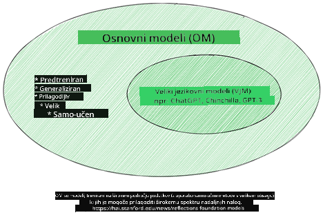

Vir slike: [Essential Guide to Foundation Models and Large Language Models | by Babar M Bhatti | Medium](https://thebabar.medium.com/essential-guide-to-foundation-models-and-large-language-models-27dab58f7404)

Za boljšo razlago si vzemimo primer ChatGPT. Za izdelavo prve različice ChatGPT je model GPT-3.5 služil kot foundation model. To pomeni, da je OpenAI uporabil nekaj podatkov, specifičnih za klepet, da je ustvaril prilagojeno različico GPT-3.5, specializirano za dobro delovanje v pogovornih scenarijih, kot so chatbot-i.

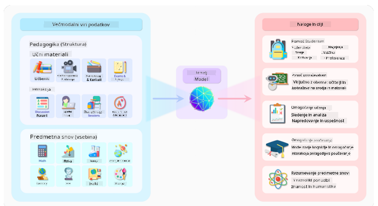

Vir slike: [2108.07258.pdf (arxiv.org)](https://arxiv.org/pdf/2108.07258.pdf?WT.mc_id=academic-105485-koreyst)

### Odprtokodni proti lastniškim modelom

Drugi način razvrstitve LLM-jev je, ali so odprtokodni ali lastniški.

Odprtokodni modeli so modeli, ki so javno dostopni in jih lahko uporablja kdorkoli. Pogosto jih objavi podjetje, ki jih je ustvarilo, ali raziskovalna skupnost. Ti modeli so dovoljeni za pregledovanje, spreminjanje in prilagajanje za različne primere uporabe LLM-jev. Vendar pa niso vedno optimizirani za produkcijsko uporabo in morda niso tako zmogljivi kot lastniški modeli. Poleg tega je financiranje odprtokodnih modelov lahko omejeno, zato morda niso vzdrževani dolgoročno ali posodobljeni z najnovejšimi raziskavami. Primeri priljubljenih odprtokodnih modelov so [Alpaca](https://crfm.stanford.edu/2023/03/13/alpaca.html?WT.mc_id=academic-105485-koreyst), [Bloom](https://huggingface.co/bigscience/bloom) in [LLaMA](https://llama.meta.com).

Lastniški modeli so modeli, ki so v lasti podjetja in niso javno dostopni. Ti modeli so pogosto optimizirani za produkcijsko uporabo. Vendar jih ni dovoljeno pregledovati, spreminjati ali prilagajati za različne primere uporabe. Poleg tega niso vedno brezplačni in lahko zahtevajo naročnino ali plačilo za uporabo. Uporabniki nimajo nadzora nad podatki, ki se uporabljajo za usposabljanje modela, zato morajo lastniku modela zaupati, da bo spoštoval zasebnost podatkov in odgovorno uporabo AI. Primeri priljubljenih lastniških modelov so [OpenAI modeli](https://platform.openai.com/docs/models/overview?WT.mc_id=academic-105485-koreyst), [Google Bard](https://sapling.ai/llm/bard?WT.mc_id=academic-105485-koreyst) ali [Claude 2](https://www.anthropic.com/index/claude-2?WT.mc_id=academic-105485-koreyst).

### Embedding proti generiranju slik proti generiranju besedila in kode

LLM-je lahko razvrstimo tudi glede na izhod, ki ga ustvarjajo.

Embedding modeli so tisti, ki lahko pretvorijo besedilo v numerično obliko, imenovano embedding, kar je numerična predstavitev vhodnega besedila. Embeddingi olajšajo strojno razumevanje odnosov med besedami ali stavki in jih lahko uporabljajo drugi modeli, kot so klasifikacijski ali gručevalni modeli, ki bolje delujejo z numeričnimi podatki. Embedding modeli se pogosto uporabljajo za prenosno učenje, kjer se model zgradi za nadomestno nalogo, za katero je na voljo veliko podatkov, nato pa se uteži modela (embeddingi) ponovno uporabijo za druge naloge. Primer te kategorije so [OpenAI embeddings](https://platform.openai.com/docs/models/embeddings?WT.mc_id=academic-105485-koreyst).

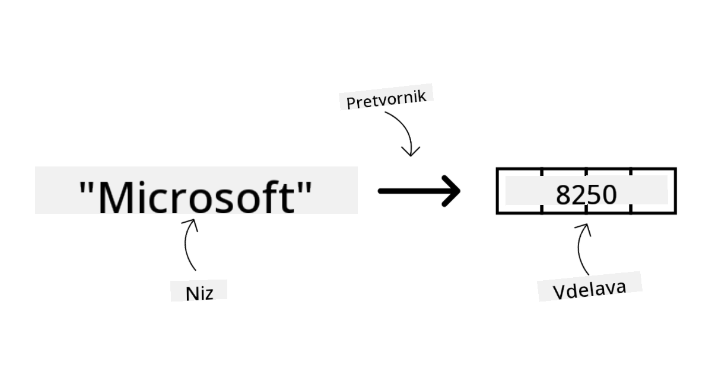

Modeli za generiranje slik so modeli, ki ustvarjajo slike. Pogosto se uporabljajo za urejanje slik, sintezo slik in prevajanje slik. Ti modeli so pogosto usposobljeni na velikih zbirkah slik, kot je [LAION-5B](https://laion.ai/blog/laion-5b/?WT.mc_id=academic-105485-koreyst), in se lahko uporabljajo za ustvarjanje novih slik ali urejanje obstoječih s tehnikami, kot so inpainting, super-resolucija in koloriranje. Primeri so [DALL-E-3](https://openai.com/dall-e-3?WT.mc_id=academic-105485-koreyst) in [Stable Diffusion modeli](https://github.com/Stability-AI/StableDiffusion?WT.mc_id=academic-105485-koreyst).

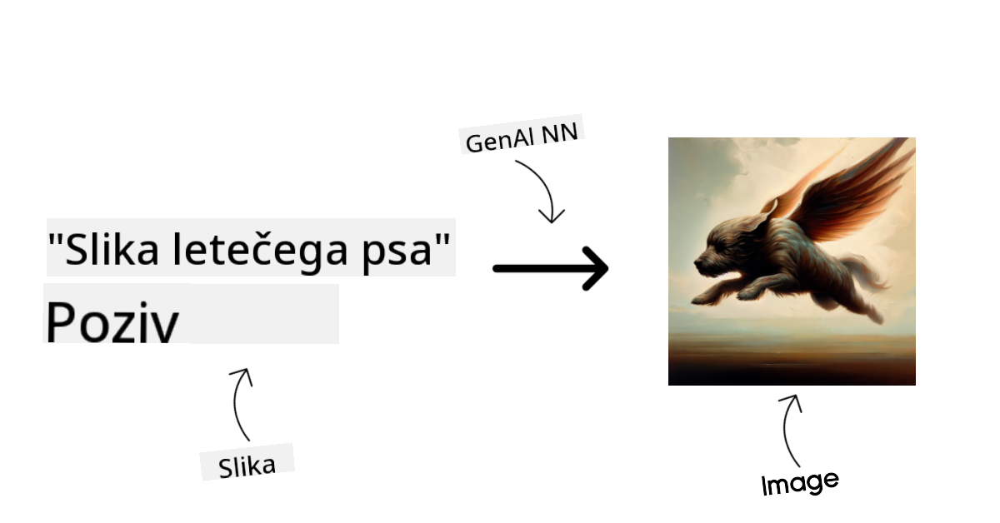

Modeli za generiranje besedila in kode so modeli, ki ustvarjajo besedilo ali kodo. Pogosto se uporabljajo za povzemanje besedil, prevajanje in odgovarjanje na vprašanja. Modeli za generiranje besedila so pogosto usposobljeni na velikih zbirkah besedil, kot je [BookCorpus](https://www.cv-foundation.org/openaccess/content_iccv_2015/html/Zhu_Aligning_Books_and_ICCV_2015_paper.html?WT.mc_id=academic-105485-koreyst), in se lahko uporabljajo za ustvarjanje novega besedila ali odgovarjanje na vprašanja. Modeli za generiranje kode, kot je [CodeParrot](https://huggingface.co/codeparrot?WT.mc_id=academic-105485-koreyst), so pogosto usposobljeni na velikih zbirkah kode, kot je GitHub, in se lahko uporabljajo za ustvarjanje nove kode ali odpravljanje napak v obstoječi kodi.

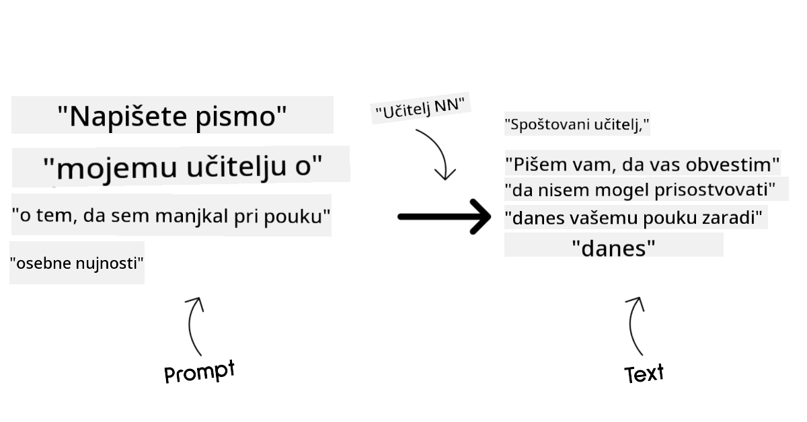

### Encoder-Decoder proti samo Decoder

Za razlago različnih arhitektur LLM-jev uporabimo primerjavo.

Predstavljajte si, da vam je vaš nadrejeni dal nalogo, da pripravite kviz za študente. Imate dva sodelavca; eden skrbi za ustvarjanje vsebine, drugi pa za pregled.

Ustvarjalec vsebine je kot model samo z Decoderjem, lahko pogleda temo in vidi, kaj ste že napisali, nato pa na podlagi tega napiše tečaj. So zelo dobri pri pisanju zanimive in informativne vsebine, vendar niso najboljši pri razumevanju teme in učnih ciljev. Nekateri primeri Decoder modelov so GPT družina modelov, kot je GPT-3.

Pregledovalec je kot model samo z Encoderjem, pregleda napisani tečaj in odgovore, opazi povezave med njimi in razume kontekst, vendar ni dober pri ustvarjanju vsebine. Primer modela samo z Encoderjem je BERT.

Predstavljajte si, da imamo nekoga, ki lahko hkrati ustvarja in pregleduje kviz, to je model Encoder-Decoder. Nekateri primeri so BART in T5.

### Storitev proti modelu

Zdaj pa o razlikah med storitvijo in modelom. Storitev je produkt, ki ga ponuja ponudnik oblačnih storitev in je pogosto kombinacija modelov, podatkov in drugih komponent. Model je osrednji del storitve in je pogosto foundation model, kot je LLM.

Storitev je pogosto optimizirana za produkcijsko uporabo in je običajno lažja za uporabo kot modeli, preko grafičnega uporabniškega vmesnika. Vendar storitve niso vedno brezplačne in lahko zahtevajo naročnino ali plačilo za uporabo, v zameno za uporabo opreme in virov lastnika storitve, optimizacijo stroškov in enostavno skaliranje. Primer storitve je [Azure OpenAI Service](https://learn.microsoft.com/azure/ai-services/openai/overview?WT.mc_id=academic-105485-koreyst), ki ponuja plačilo po porabi, kar pomeni, da uporabniki plačajo sorazmerno z uporabo storitve. Poleg tega Azure OpenAI Service nudi varnost na ravni podjetja in okvir za odgovorno uporabo AI, ki temelji na zmogljivostih modelov.

Modeli so zgolj nevronske mreže s parametri, utežmi in drugimi elementi. Podjetjem omogočajo lokalno izvajanje, vendar bi morali kupiti opremo, zgraditi infrastrukturo za skaliranje in kupiti licenco ali uporabiti odprtokodni model. Model, kot je LLaMA, je na voljo za uporabo, vendar zahteva računsko moč za zagon modela.

## Kako testirati in iterirati z različnimi modeli za razumevanje zmogljivosti v Azure

Ko je naša ekipa raziskala trenutno stanje LLM-jev in izbrala nekaj primernih kandidatov za svoje scenarije, je naslednji korak testiranje na njihovih podatkih in delovnih obremenitvah. To je iterativen proces, ki poteka preko eksperimentov in meritev.
Večina modelov, ki smo jih omenili v prejšnjih odstavkih (OpenAI modeli, odprtokodni modeli, kot je Llama2, in Hugging Face transformatorji), je na voljo v [Model Catalog](https://learn.microsoft.com/azure/ai-studio/how-to/model-catalog-overview?WT.mc_id=academic-105485-koreyst) v [Azure AI Studio](https://ai.azure.com/?WT.mc_id=academic-105485-koreyst).

[Azure AI Studio](https://learn.microsoft.com/azure/ai-studio/what-is-ai-studio?WT.mc_id=academic-105485-koreyst) je oblačna platforma, namenjena razvijalcem za ustvarjanje generativnih AI aplikacij in upravljanje celotnega razvojnega cikla – od eksperimentiranja do ocenjevanja – s povezovanjem vseh Azure AI storitev v eno samo središče z uporabniku prijaznim grafičnim vmesnikom. Model Catalog v Azure AI Studio omogoča uporabniku:

- Iskanje ustreznega Foundation Modela v katalogu – bodisi lastniškega ali odprtokodnega, z možnostjo filtriranja po nalogi, licenci ali imenu. Za lažje iskanje so modeli organizirani v zbirke, kot so Azure OpenAI zbirka, Hugging Face zbirka in druge.

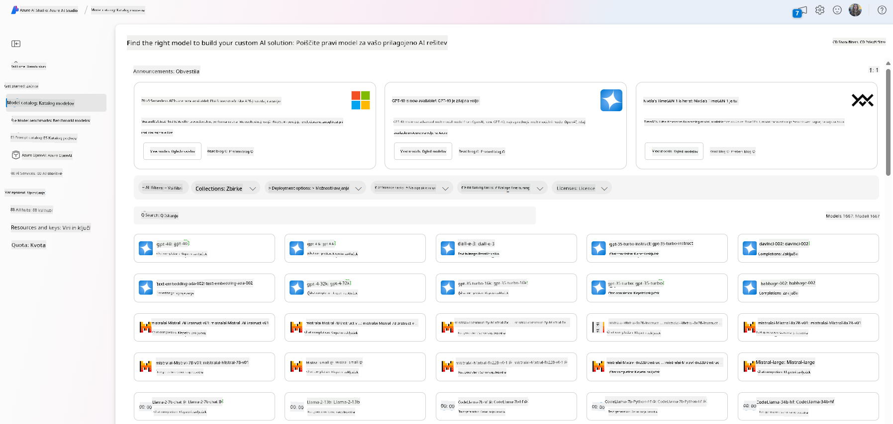

- Pregled modelne kartice, ki vključuje podroben opis predvidene uporabe in učnih podatkov, primere kode ter rezultate ocenjevanja v interni knjižnici ocen.

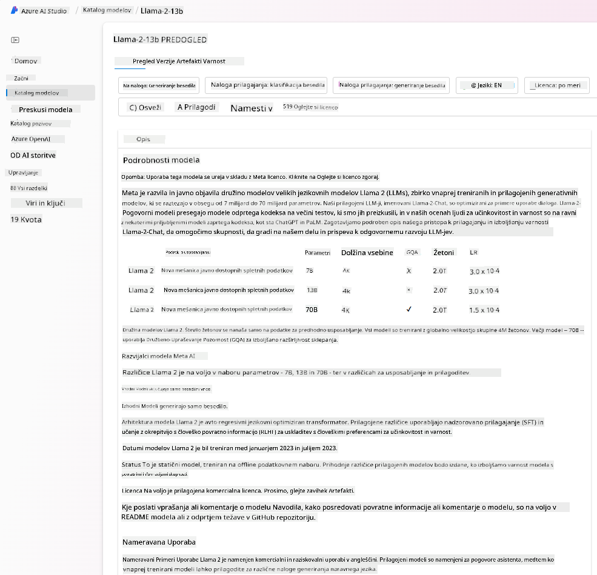

- Primerjavo merilnikov uspešnosti med modeli in podatkovnimi nizi, ki so na voljo v industriji, da se oceni, kateri model najbolj ustreza poslovnemu scenariju, preko [Model Benchmarks](https://learn.microsoft.com/azure/ai-studio/how-to/model-benchmarks?WT.mc_id=academic-105485-koreyst) okna.

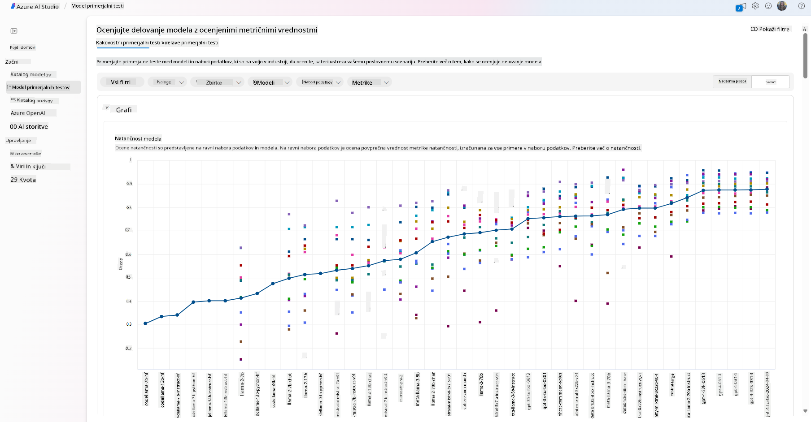

- Prilagoditev modela na lastnih učnih podatkih za izboljšanje zmogljivosti modela pri specifični nalogi, z uporabo možnosti eksperimentiranja in sledenja v Azure AI Studio.

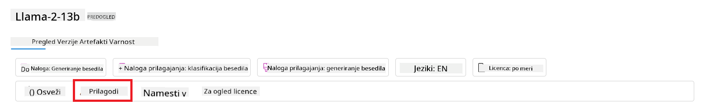

- Namestitev originalnega predhodno usposobljenega modela ali prilagojene različice na oddaljeni realnočasovni inferenčni strežnik – upravljan računalniški sistem – ali brezstrežni API konektor – [plačilo po porabi](https://learn.microsoft.com/azure/ai-studio/how-to/model-catalog-overview#model-deployment-managed-compute-and-serverless-api-pay-as-you-go?WT.mc_id=academic-105485-koreyst) – da aplikacije lahko uporabljajo model.

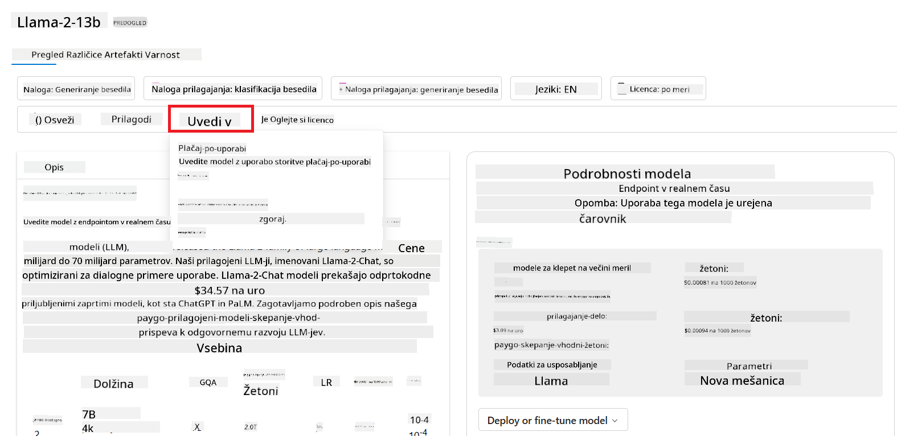

> [!NOTE]
> Ne vsi modeli v katalogu so trenutno na voljo za prilagajanje (fine-tuning) in/ali namestitev s plačilom po porabi. Za podrobnosti o zmogljivostih in omejitvah modela preverite modelno kartico.

## Izboljševanje rezultatov LLM

Z našo startup ekipo smo preizkusili različne vrste LLM-jev in oblačno platformo (Azure Machine Learning), ki nam omogoča primerjavo različnih modelov, njihovo ocenjevanje na testnih podatkih, izboljšanje zmogljivosti in namestitev na inferenčne končne točke.

Kdaj pa naj razmislijo o prilagoditvi modela (fine-tuning) namesto uporabe predhodno usposobljenega? Ali obstajajo še drugi pristopi za izboljšanje zmogljivosti modela pri specifičnih nalogah?

Podjetje lahko uporabi več pristopov, da doseže želene rezultate z LLM. Pri uvajanju LLM v produkcijo lahko izberete različne vrste modelov z različnimi stopnjami usposobljenosti, z različnimi zahtevami glede kompleksnosti, stroškov in kakovosti. Tukaj je nekaj različnih pristopov:

- **Prompt inženiring s kontekstom**. Ideja je, da ob pozivu zagotovite dovolj konteksta, da dobite želene odgovore.

- **Retrieval Augmented Generation, RAG**. Vaši podatki so lahko shranjeni v podatkovni bazi ali na spletni končni točki, na primer, zato lahko za zagotovitev, da so ti podatki ali njihov del vključeni ob pozivu, pridobite ustrezne podatke in jih vključite v poziv uporabnika.

- **Prilagojen model (fine-tuned model)**. Tukaj model dodatno usposobite na lastnih podatkih, kar pripelje do natančnejših in bolj odzivnih rezultatov, vendar je lahko dražje.

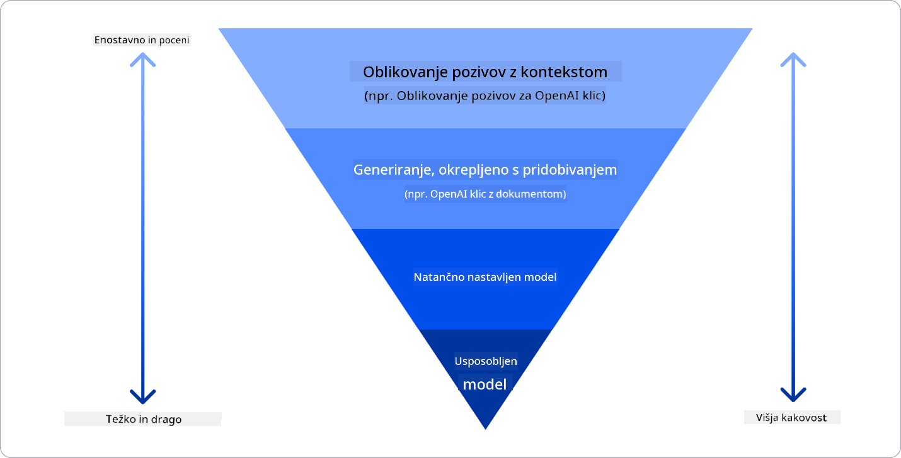

Vir slike: [Four Ways that Enterprises Deploy LLMs | Fiddler AI Blog](https://www.fiddler.ai/blog/four-ways-that-enterprises-deploy-llms?WT.mc_id=academic-105485-koreyst)

### Prompt inženiring s kontekstom

Predhodno usposobljeni LLM-ji zelo dobro delujejo pri splošnih nalogah naravnega jezika, tudi če jih pokličemo z kratkim pozivom, kot je stavek za dopolnitev ali vprašanje – t.i. “zero-shot” učenje.

Vendar pa, čim bolj lahko uporabnik oblikuje svoj poizvedbo z natančnim zahtevkom in primeri – torej s kontekstom – tem bolj natančen in bližji pričakovanjem bo odgovor. V tem primeru govorimo o “one-shot” učenju, če poziv vsebuje le en primer, in “few-shot” učenju, če vsebuje več primerov.
Prompt inženiring s kontekstom je najbolj stroškovno učinkovit pristop za začetek.

### Retrieval Augmented Generation (RAG)

LLM-ji imajo omejitev, da lahko za generiranje odgovora uporabijo le podatke, ki so bili uporabljeni med njihovim usposabljanjem. To pomeni, da ne poznajo dejstev, ki so se zgodila po njihovem usposabljanju, in nimajo dostopa do ne-javnih informacij (kot so podatki podjetja).
To omejitev lahko premagamo z RAG, tehniko, ki poziv dopolni z zunanjimi podatki v obliki delov dokumentov, ob upoštevanju omejitev dolžine poziva. To omogočajo orodja za vektorsko iskanje (kot je [Azure Vector Search](https://learn.microsoft.com/azure/search/vector-search-overview?WT.mc_id=academic-105485-koreyst)), ki pridobijo uporabne dele iz različnih vnaprej določenih virov podatkov in jih dodajo v kontekst poziva.

Ta tehnika je zelo uporabna, kadar podjetje nima dovolj podatkov, časa ali virov za prilagoditev LLM, a vseeno želi izboljšati zmogljivost pri specifični nalogi in zmanjšati tveganja za izmišljanje dejstev ali škodljivo vsebino.

### Prilagojen model (fine-tuned model)

Prilagajanje modela je proces, ki uporablja prenosno učenje za ‘prilagoditev’ modela na specifično nalogo ali rešitev določenega problema. V nasprotju z few-shot učenjem in RAG, ta proces ustvari nov model z posodobljenimi utežmi in pristranskostmi. Potrebuje nabor učnih primerov, ki vsebujejo posamezen vhod (poziv) in pripadajoči izhod (doplnitev).
To je priporočljiv pristop, če:

- **Uporabljate prilagojene modele**. Podjetje želi uporabljati prilagojene manj zmogljive modele (kot so embedding modeli) namesto zmogljivih modelov, kar prinaša bolj stroškovno učinkovito in hitrejšo rešitev.

- **Upoštevate zakasnitev (latenco)**. Latenca je pomembna za določen primer uporabe, zato ni mogoče uporabiti zelo dolgih pozivov ali števila primerov, ki jih mora model usvojiti, ne ustreza omejitvi dolžine poziva.

- **Ostajate posodobljeni**. Podjetje ima veliko kakovostnih podatkov in oznak resničnih stanj ter vire za vzdrževanje teh podatkov ažurnih skozi čas.

### Usposobljen model

Usposabljanje LLM-ja iz nič je nedvomno najzahtevnejši in najbolj kompleksen pristop, ki zahteva ogromne količine podatkov, usposobljene vire in ustrezno računalniško moč. To možnost je smiselno upoštevati le, če ima podjetje domeno-specifičen primer uporabe in veliko količino podatkov, osredotočenih na to domeno.

## Preverjanje znanja

Kateri pristop bi bil dober za izboljšanje rezultatov dopolnjevanja LLM?

1. Prompt inženiring s kontekstom  
1. RAG  
1. Prilagojen model  

Odgovor: 3, če imate čas, vire in kakovostne podatke, je prilagajanje boljša izbira za ostati posodobljen. Vendar, če želite izboljšati rezultate in vam primanjkuje časa, je vredno najprej razmisliti o RAG.

## 🚀 Izziv

Preberite več o tem, kako lahko [uporabite RAG](https://learn.microsoft.com/azure/search/retrieval-augmented-generation-overview?WT.mc_id=academic-105485-koreyst) za vaše podjetje.

## Odlično delo, nadaljujte z učenjem

Po zaključku te lekcije si oglejte našo [Generative AI Learning collection](https://aka.ms/genai-collection?WT.mc_id=academic-105485-koreyst) in nadaljujte z nadgrajevanjem svojega znanja o generativni umetni inteligenci!

Pojdite na Lekcijo 3, kjer bomo pogledali, kako [graditi z generativno AI odgovorno](../03-using-generative-ai-responsibly/README.md?WT.mc_id=academic-105485-koreyst)!

**Omejitev odgovornosti**:  
Ta dokument je bil preveden z uporabo AI prevajalske storitve [Co-op Translator](https://github.com/Azure/co-op-translator). Čeprav si prizadevamo za natančnost, vas opozarjamo, da avtomatizirani prevodi lahko vsebujejo napake ali netočnosti. Izvirni dokument v njegovem izvirnem jeziku velja za avtoritativni vir. Za ključne informacije priporočamo strokovni človeški prevod. Za morebitna nesporazume ali napačne interpretacije, ki izhajajo iz uporabe tega prevoda, ne odgovarjamo.