# Raziskovanje in primerjava različnih LLM-jev

[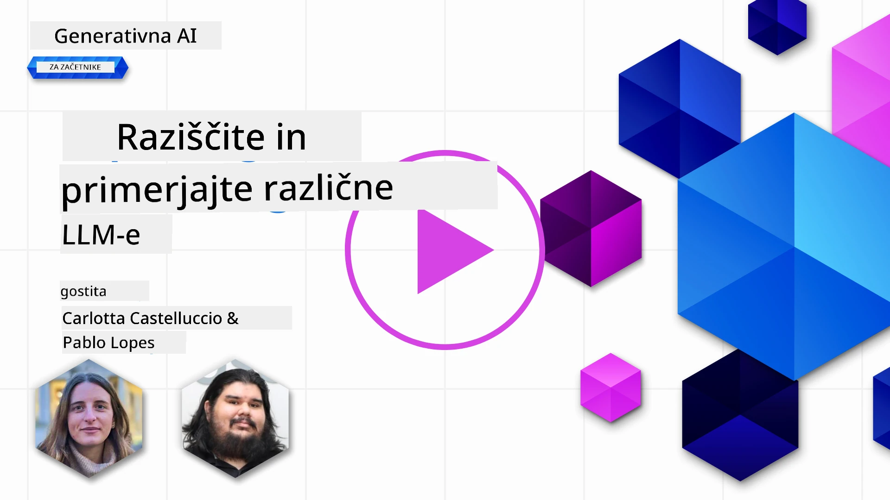](https://youtu.be/KIRUeDKscfI?si=8BHX1zvwzQBn-PlK)

> _Kliknite zgornjo sliko za ogled videoposnetka te lekcije_

V prejšnji lekciji smo videli, kako generativna AI spreminja tehnološki svet, kako delujejo veliki jezikovni modeli (LLM) in kako jih lahko podjetje - kot je naš startup - uporablja za svoje primere uporabe in raste! V tem poglavju želimo primerjati in kontrastirati različne vrste velikih jezikovnih modelov (LLM), da bi razumeli njihove prednosti in slabosti.

Naslednji korak na poti našega startupa je raziskovanje trenutnega stanja LLM-jev in razumevanje, kateri so primerni za naš primer uporabe.

## Uvod

Ta lekcija bo obravnavala:

- Različne vrste LLM-jev v trenutnem okolju.
- Testiranje, ponavljanje in primerjanje različnih modelov za vaš primer uporabe v Azure.
- Kako razporediti LLM.

## Cilji učenja

Po končani tej lekciji boste sposobni:

- Izbrati pravilen model za vaš primer uporabe.
- Razumeti, kako testirati, ponavljati in izboljšati učinkovitost vašega modela.
- Vedeti, kako podjetja razporejajo modele.

## Razumevanje različnih vrst LLM-jev

LLM-ji imajo lahko več kategorij glede na njihovo arhitekturo, podatke za učenje in primer uporabe. Razumevanje teh razlik bo pomagalo našemu startupu izbrati pravi model za scenarij in razumeti, kako testirati, ponavljati in izboljšati učinkovitost.

Obstaja veliko različnih vrst LLM modelov, vaša izbira modela je odvisna od tega, za kaj jih želite uporabljati, vaših podatkov, koliko ste pripravljeni plačati in več.

Glede na to, ali želite modele uporabljati za besedilo, avdio, video, generiranje slik in tako naprej, boste morda izbrali drugačno vrsto modela.

- **Prepoznavanje zvoka in govora**. Whisper-stilski modeli so še vedno uporabni kot splošni modeli za prepoznavanje govora, vendar produkcijske izbire zdaj vključujejo tudi novejše modele za pretvorbo govora v besedilo, kot so `gpt-4o-transcribe`, `gpt-4o-mini-transcribe` in različice za diarizacijo. Ocenite podporo jezikom, diarizacijo, podporo v realnem času, latenco in stroške za vaš scenarij. Več informacij najdete v [OpenAI dokumentaciji za govor v besedilo](https://platform.openai.com/docs/guides/speech-to-text?WT.mc_id=academic-105485-koreyst).

- **Generiranje slik**. DALL-E in Midjourney sta dobro znani možnosti za generiranje slik, vendar trenutni OpenAI API-ji za slike temeljijo na GPT Image modelih, kot je `gpt-image-2`, poleg tega pa so pogoste izbire tudi modeli Stable Diffusion, Imagen, Flux in druge družine modelov. Primerjajte spoštovanje navodil, podporo urejanju, nadzor sloga, zahteve varnosti in licenciranje. Več informacij poiščite v [OpenAI vodniku za generiranje slik](https://platform.openai.com/docs/guides/images?WT.mc_id=academic-105485-koreyst) in poglavju 9 tega kurikuluma.

- **Generiranje besedila**. Besedilni modeli sedaj zajemajo vodilne modele, modele za sklepanje, manjše modele z nizko latenco in modele z odprtimi utežmi. Trenutni primeri vključujejo OpenAI GPT-5.x modele, Anthropic Claude 4.x modele, Google Gemini 3.x modele, Meta Llama 4 modele in modele Mistral. Ne izbirajte samo glede na datum izida ali ceno; primerjajte kakovost naloge, latenco, velikost kontekstnega okna, uporabo orodij, vedenje glede varnosti, regionalno razpoložljivost in stroške v celoti. [Microsoftov katalog modelov Foundry](https://ai.azure.com/catalog?WT.mc_id=academic-105485-koreyst) je dobro mesto za primerjavo modelov, ki so na voljo na Azure.

- **Multimodalnost**. Veliko trenutnih modelov lahko procesira več kot besedilo. Nekateri sprejemajo vhodne podatke kot so slike, avdio ali video; nekateri lahko kličejo orodja; specializirani modeli lahko generirajo slike, avdio ali video. Na primer, trenutni OpenAI modeli podpirajo besedilni in slikovni vhod, Gemini modeli lahko podpirajo besedilo, kodo, slike, avdio in video glede na različico, Llama 4 Scout in Maverick pa sta modeli z odprtimi utežmi, ki sta naravno multimodalna. Vedno preverite kartico modela za podprte vhodne in izhodne modalitete, preden zgradite delovni tok.

Izbira modela pomeni, da dobite osnovne zmogljivosti, ki pa morda niso dovolj. Pogosto imate podatke, specifične za podjetje, o katerih morate LLM kako obvestiti. Obstaja nekaj različnih možnosti, kako se temu pristopiti, več o tem v nadaljevanju.

### Osnovni modeli proti LLM-jem

Izraz Osnovni model so [izmislili raziskovalci iz Stanforda](https://arxiv.org/abs/2108.07258?WT.mc_id=academic-105485-koreyst) in definiran je kot AI model, ki ustreza nekaterim kriterijem, kot so:

- **So usposobljeni z brez nadzora ali samonadzorovanim učenjem**, kar pomeni, da so usposobljeni na neoznačenih multimodalnih podatkih in ne potrebujejo ročnega označevanja podatkov za proces učenja.
- **So zelo veliki modeli**, ki temeljijo na zelo globokih nevronskih mrežah, usposobljenih na milijardah parametrov.
- **Namenjeni so služiti kot 'osnova' za druge modele**, kar pomeni, da jih je mogoče uporabiti kot izhodišče za gradnjo drugih modelov z dodatnim prilagajanjem (finetuningom).

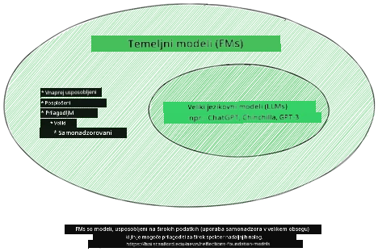

Vir slike: [Essential Guide to Foundation Models and Large Language Models | avtor Babar M Bhatti | Medium
](https://thebabar.medium.com/essential-guide-to-foundation-models-and-large-language-models-27dab58f7404)

Za dodatno pojasnilo te razlike vzemimo za zgodovinski primer ChatGPT. Zgodnje verzije ChatGPT so uporabljale GPT-3.5 kot osnovni model. OpenAI je nato uporabil podatke specifične za klepet in tehnike usklajevanja, da je ustvaril prilagojeno verzijo, ki je bolje delovala v pogovornih scenarijih, kot so klepetalni roboti. Sodobne AI storitve pogosto preklapljajo med več različicami modelov, zato ime storitve in ime osnovnega modela pogosto nista enaka.

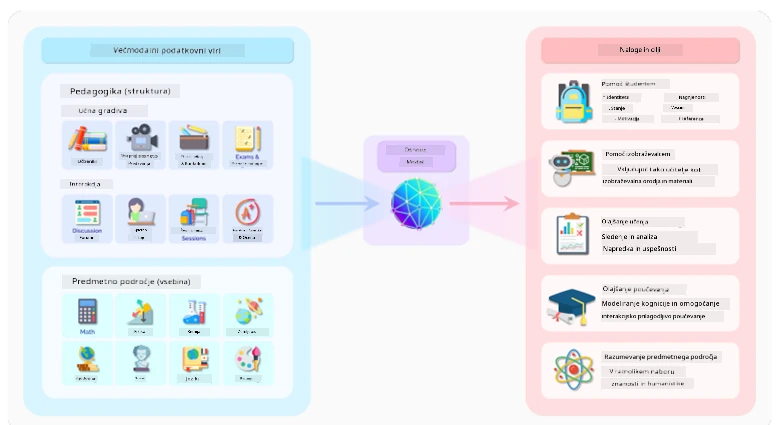

Vir slike: [2108.07258.pdf (arxiv.org)](https://arxiv.org/pdf/2108.07258.pdf?WT.mc_id=academic-105485-koreyst)

### Modeli z odprtimi utežmi/odprtokodni proti lastniškim modelom

Drug način kategorizacije LLM je glede na to, ali so modeli z odprtimi utežmi, odprtokodni ali lastniški.

Odprtokodni in modeli z odprtimi utežmi omogočajo ogled, prenos ali prilagoditev modela, vendar se njihove licence razlikujejo. Nekateri so povsem odprtokodni, medtem ko so drugi modeli z odprtimi utežmi z omejitvami uporabe. Koristni so, kadar podjetje potrebuje večji nadzor nad razporeditvijo, lokalizacijo podatkov, stroški ali prilagoditvijo. Vendar pa morajo ekipe še vedno pregledati licenčne pogoje, stroške uporabe, vzdrževanje, varnostne posodobitve in kakovost ocenjevanja pred uporabo v produkciji. Primeri vključujejo [Meta Llama 4](https://ai.meta.com/blog/llama-4-multimodal-intelligence/?WT.mc_id=academic-105485-koreyst), nekatere [Mistral modele](https://docs.mistral.ai/models/overview?WT.mc_id=academic-105485-koreyst) in mnoge modele, gostovane na [Hugging Face](https://huggingface.co/models?WT.mc_id=academic-105485-koreyst).

Lastniški modeli so v lasti ponudnika in gostovani pri njem. Ti modeli so pogosto optimizirani za upravljano produkcijsko uporabo in lahko nudijo močno podporo, sisteme varnosti, integracijo orodij in skaliranje. Vendar pa uporabniki običajno ne morejo pregledovati ali spreminjati teže modela ter morajo skrbno pregledati pogoje zasebnosti, hrambe, skladnosti in dopustne uporabe. Primeri vključujejo [OpenAI modele](https://platform.openai.com/docs/models?WT.mc_id=academic-105485-koreyst), [Google Gemini](https://deepmind.google/models/gemini/pro/?WT.mc_id=academic-105485-koreyst) in [Anthropic Claude](https://platform.claude.com/docs/en/about-claude/models/overview?WT.mc_id=academic-105485-koreyst).

### Vdelava proti generiranju slik proti generiranju besedila in kode

LLM se lahko kategorizira tudi glede na izhod, ki ga ustvarjajo.

Vdelave so skupina modelov, ki lahko pretvorijo besedilo v številčno obliko, imenovano embedding, kar je številčna predstavitev vhodnega besedila. Vdelave olajšajo strojem razumevanje povezanosti med besedami ali stavki in jih lahko uporabljajo drugi modeli, kot so modeli za klasifikacijo ali za gručenje, ki bolje delujejo na številčnih podatkih. Vdelavni modeli se pogosto uporabljajo za prenosno učenje, kjer je model zgrajen za nadomestno nalogo, za katero imamo obilico podatkov, nato pa se uteži modela (vdelave) ponovno uporabijo za druge naloge. Primer te kategorije so [OpenAI vdelave](https://platform.openai.com/docs/models/embeddings?WT.mc_id=academic-105485-koreyst).

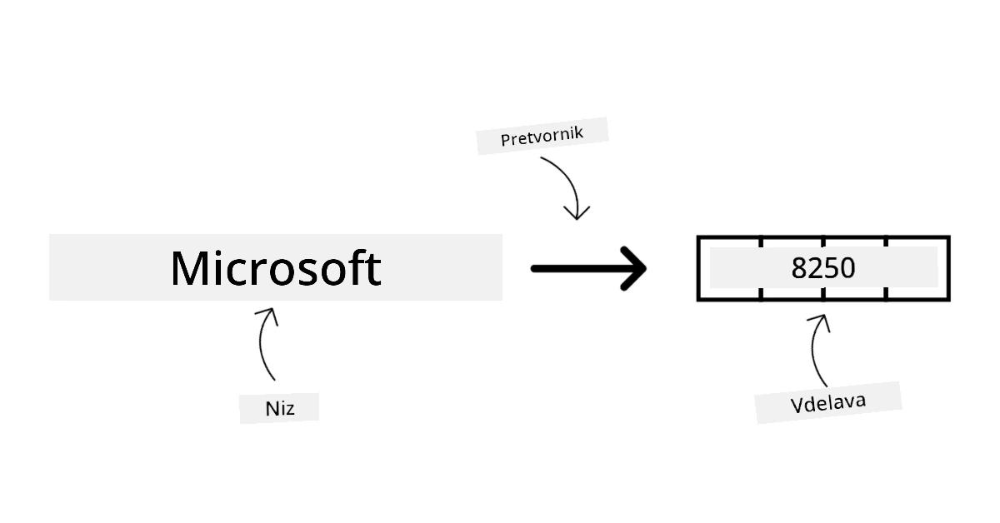

Modeli za generiranje slik so modeli, ki ustvarjajo slike. Ti modeli se pogosto uporabljajo za urejanje slik, sintezo slik in prevajanje slik. Modeli za generiranje slik so pogosto usposobljeni na velikih zbirkah slik, kot je [LAION-5B](https://laion.ai/blog/laion-5b/?WT.mc_id=academic-105485-koreyst), in jih je mogoče uporabiti za ustvarjanje novih slik ali za urejanje obstoječih slik z metodami kot so inpainting, superresolucija in koloriranje. Primeri vključujejo [GPT Image modele](https://platform.openai.com/docs/guides/images?WT.mc_id=academic-105485-koreyst), [Stable Diffusion modele](https://github.com/Stability-AI/StableDiffusion?WT.mc_id=academic-105485-koreyst) in modele Imagen.

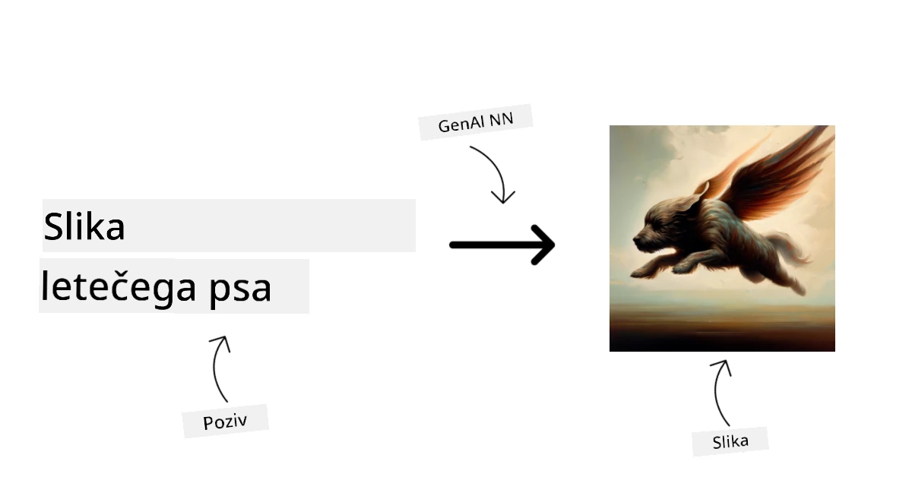

Modeli za generiranje besedila in kode so modeli, ki ustvarjajo besedilo ali kodo. Ti modeli se pogosto uporabljajo za povzemanje besedila, prevajanje in odgovarjanje na vprašanja. Modeli za generiranje besedila so pogosto usposobljeni na velikih zbirkah besedil, kot je [BookCorpus](https://www.cv-foundation.org/openaccess/content_iccv_2015/html/Zhu_Aligning_Books_and_ICCV_2015_paper.html?WT.mc_id=academic-105485-koreyst) in jih je mogoče uporabiti za ustvarjanje novega besedila ali za odgovarjanje na vprašanja. Modeli za generiranje kode, kot je [CodeParrot](https://huggingface.co/codeparrot?WT.mc_id=academic-105485-koreyst), so pogosto usposobljeni na velikih zbirkah kode, kot je GitHub, in jih je mogoče uporabiti za ustvarjanje nove kode ali odpravljanje napak v obstoječi kodi.

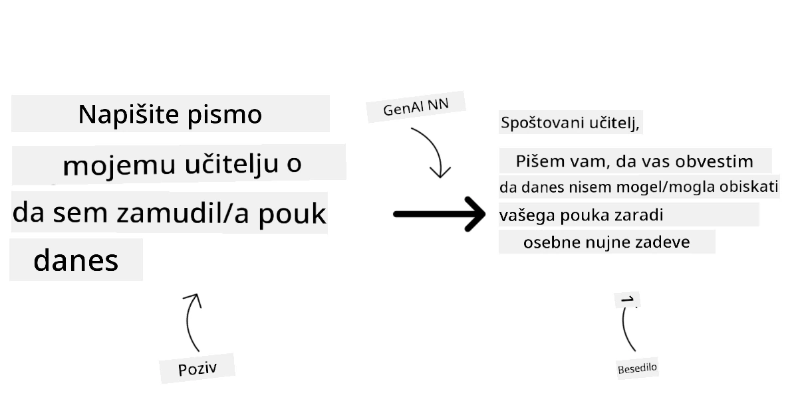

### Encoder-Decoder proti samo Decoder

Za razpravo o različnih arhitekturah LLM-jev, uporabimo prispodobo.

Predstavljajte si, da vam je vodja dal nalogo napisati kviz za študente. Imate dva sodelavca; en nadzira ustvarjanje vsebine, drugi pa pregledovanje le-te.

Ustvarjalec vsebine je kot samo decoder model: lahko pogleda temo, vidi, kaj ste že napisali, in nadaljuje z generiranjem vsebine na podlagi tega konteksta. So zelo dobri pri pisanju zanimive in informativne vsebine, vendar niso vedno najboljša izbira, ko je naloga samo klasificirati, poiskati ali kodirati informacije. Primeri modelskih družin samo decoder vključujejo GPT in Llama modele.

Pregledovalec je kot samo Encoder model, gleda napisani tečaj in odgovore, opazuje odnos med njimi in razume kontekst, vendar ni dober pri generiranju vsebine. Primer samo Encoder modela bi bil BERT.

Predstavljajte si, da lahko imate nekoga, ki lahko tudi ustvarja in preverja kviz, to je Encoder-Decoder model. Nekateri primeri so BART in T5.

### Storitev proti modelu

Zdaj govorimo o razliki med storitvijo in modelom. Storitev je produkt, ki ga ponuja ponudnik oblačnih storitev, pogosto pa je kombinacija modelov, podatkov in drugih komponent. Model je jedro storitve in je pogosto osnovni model, kot je LLM.

Storitev je pogosto optimizirana za produkcijsko uporabo in jo je pogosto lažje uporabljati kot modele preko grafičnega uporabniškega vmesnika. Vendar storitve niso vedno brezplačne in lahko zahtevajo naročnino ali plačilo za uporabo, v zameno za uporabo lastnine in virov lastnika storitve, optimizacijo stroškov in enostavno skaliranje. Primer storitve je [Azure OpenAI Service](https://learn.microsoft.com/azure/ai-services/openai/overview?WT.mc_id=academic-105485-koreyst), ki ponuja cenovni načrt plačaj-po-porabi, kar pomeni, da so uporabniki zaračunani sorazmerno s stopnjo uporabe storitve. Azure OpenAI Service prav tako nudi varnost na ravni podjetja in odgovorni AI okvir na vrhu zmožnosti modelov.

Modeli so artefakti nevronskih mrež: parametri, uteži, arhitektura, tokenizer in podporna konfiguracija. Lokalen zagon modela ali v zasebnem okolju zahteva ustrezno strojno opremo, infrastrukturo za poganjanje, nadzorovanje ter bodisi združljivo odprtokodno/odprto-utežno licenco ali komercialno licenco. Modeli z odprtimi utežmi, kot sta Llama 4 ali Mistral, so lahko samostojno gostovani, vendar še vedno zahtevajo računalniško moč in strokovno upravljanje.

## Kako testirati in ponavljati z različnimi modeli, da razumete zmogljivost na Azure

Ko je naša ekipa raziskala trenutno stanje LLM-jev in identificirala nekaj dobrih kandidatov za njihove scenarije, je naslednji korak testiranje na njihovih podatkih in delovni obremenitvi. To je iterativni proces, izveden z eksperimenti in meritvami.
Večina modelov, ki smo jih omenili v prejšnjih odstavkih (OpenAI modeli, modeli z odprtimi utežmi, kot sta Llama 4 in Mistral, ter modeli Hugging Face), je na voljo v [Microsoft Foundry Models](https://learn.microsoft.com/azure/foundry/concepts/foundry-models-overview?WT.mc_id=academic-105485-koreyst).

[Microsoft Foundry](https://learn.microsoft.com/azure/foundry/what-is-foundry?WT.mc_id=academic-105485-koreyst), prej Azure AI Studio/Azure AI Foundry, je združena Azure platforma za gradnjo AI aplikacij in agentov. Pomaga razvijalcem upravljati življenjski cikel od eksperimentiranja in ocenjevanja do uvajanja, spremljanja in upravljanja. Katalog modelov v Microsoft Foundry uporabniku omogoča:

- Iskanje osnovnega modela interesa v katalogu, vključno z modeli, ki jih prodaja Azure, in modeli partnerjev ter skupnostnih ponudnikov. Uporabniki lahko filtrirajo po nalogi, ponudniku, licenci, možnosti uvajanja ali imenu.

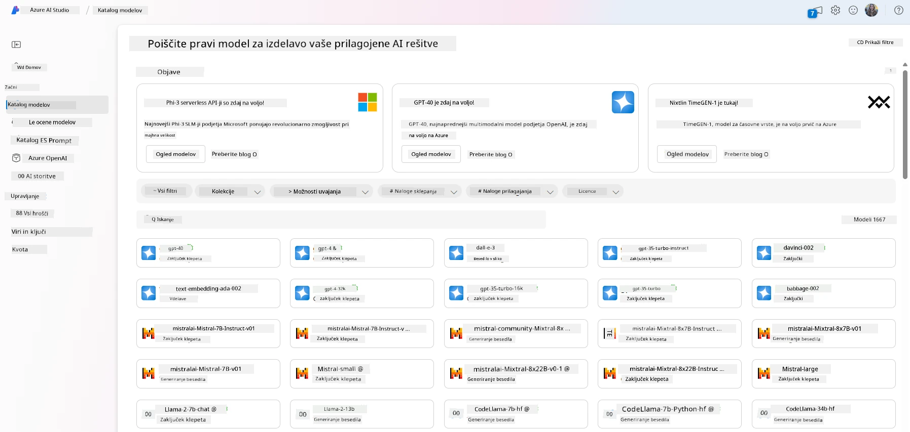

- Pregled modelne kartice, vključno z podrobnim opisom predvidene uporabe in podatkov za učenje, primeri kode ter evaluacijskimi rezultati iz internega evalvacijskega skladišča.

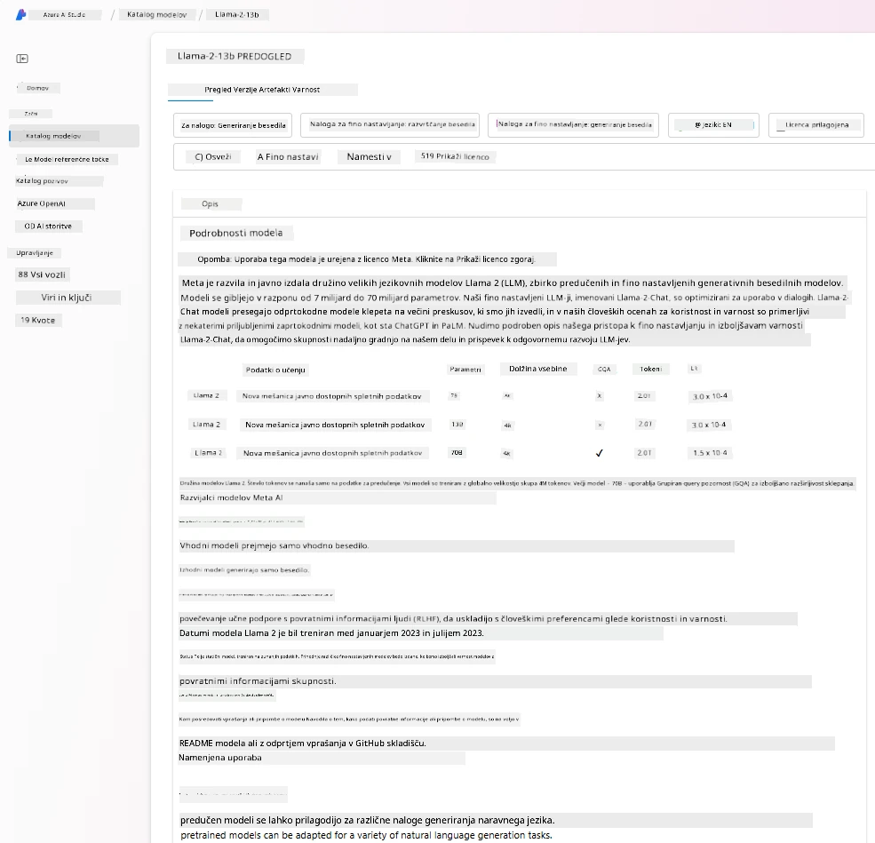

- Primerjavo ocen med modeli in nabori podatkov, ki so na voljo v industriji, da ocenite, kateri najbolje ustreza poslovnemu scenariju, preko zavihka [Model Benchmarks](https://learn.microsoft.com/azure/ai-studio/how-to/model-benchmarks?WT.mc_id=academic-105485-koreyst).

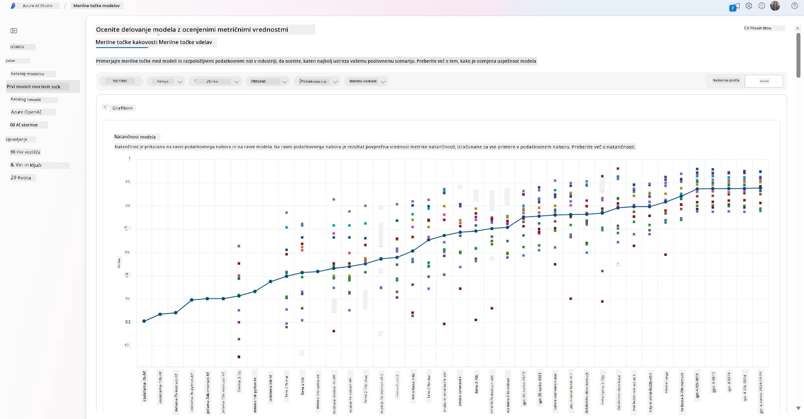

- Fino prilagajanje podprtih modelov na podatkih po meri za izboljšanje zmogljivosti modela pri specifični delovni obremenitvi, z uporabo zmožnosti eksperimentiranja in sledenja v Microsoft Foundry.

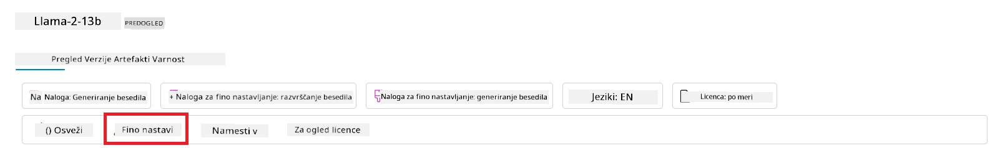

- Uvajanje originalnega predhodno naučenega modela ali fino prilagojene različice na oddaljeno točko za sklepanje v realnem času, z uporabo upravljanih računalniških ali brezstrežniških možnosti uvajanja, da aplikacije lahko nanj dostopajo.

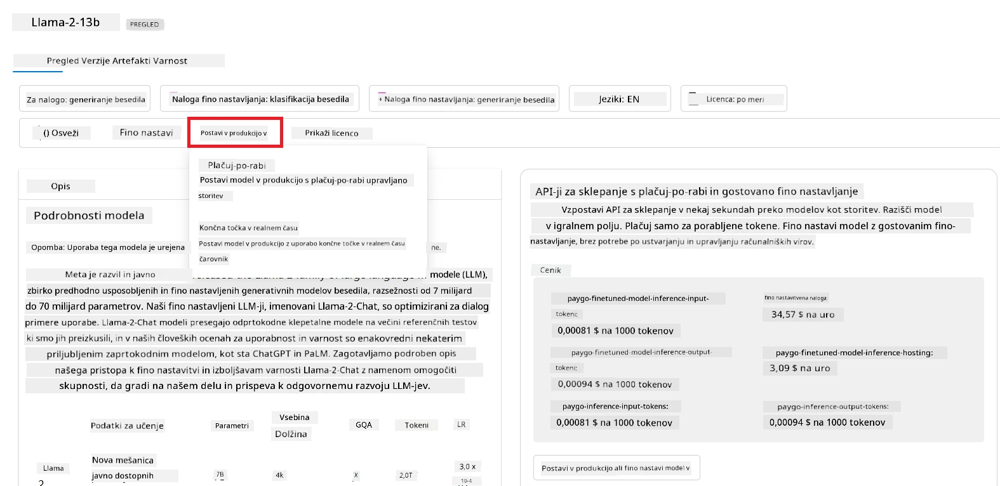

> [!NOTE]
> Ne vsi modeli v katalogu so trenutno na voljo za fino prilagajanje in/ali uvajanje po sistemu plačaj-za-porabo. Preverite modelno kartico za podrobnosti o zmožnostih in omejitvah modela.

## Izboljšanje rezultatov LLM

S svojo startup ekipo smo raziskali različne vrste LLM-jev in oblačno platformo (Microsoft Foundry), ki nam omogoča primerjavo različnih modelov, njihovo ocenjevanje na testnih podatkih, izboljšanje zmogljivosti in uvajanje na točke sklepanja.

Kdaj naj razmislijo o fino prilagoditvi modela namesto uporabe predhodno naučenega? Ali obstajajo drugi pristopi za izboljšanje zmogljivosti modela pri specifičnih delovnih obremenitvah?

Obstaja več pristopov, ki jih lahko podjetje uporabi, da dobi rezultate, ki jih potrebuje od LLM. Ob uvajanju LLM v produkcijo lahko izberete različne vrste modelov z različnimi stopnjami učenja, z različnimi nivoji kompleksnosti, stroškov in kakovosti. Tukaj je nekaj različnih pristopov:

- **Inženiring pozivov z kontekstom**. Ideja je zagotoviti dovolj konteksta ob pozivu, da dobite potrebne odgovore.

- **Retrieval Augmented Generation, RAG**. Vaši podatki morda obstajajo v zbirki podatkov ali spletni točki; da zagotovite vključitev tega podatka ali njegove podmnožice ob pozivu, lahko pridobite relevantne podatke in jih vključite v poziv uporabnika.

- **Fino prilagojen model**. Tukaj ste model dodatno naučili na lastnih podatkih, kar je povzročilo, da je model bolj natančen in odziven na vaše potrebe, a je lahko tudi drag.

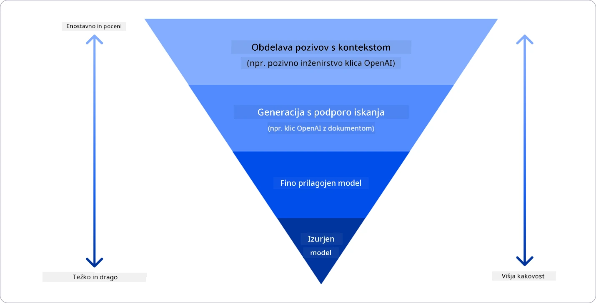

Vir slike: [Four Ways that Enterprises Deploy LLMs | Fiddler AI Blog](https://www.fiddler.ai/blog/four-ways-that-enterprises-deploy-llms?WT.mc_id=academic-105485-koreyst)

### Inženiring pozivov z kontekstom

Predhodno naučeni LLM modeli zelo dobro delujejo pri generaliziranih nalogah naravnega jezika, celo s kratkim pozivom, kot je stavek za dopolnitev ali vprašanje – t.i. "zero-shot" učenje.

Vendar pa čim bolje uporabnik oblikuje svojo poizvedbo z podrobnimi zahtevami in primeri – Kontekstom – tem bolj natančen in bližje pričakovanjem bo odgovor. V tem primeru govorimo o "one-shot" učenju, če poziv vključuje le en primer, in o "few-shot" učenju, če vključuje več primerov.
Inženiring pozivov s kontekstom je najbolj stroškovno učinkovit pristop za začetek.

### Retrieval Augmented Generation (RAG)

LLM-ji imajo omejitev, da lahko uporabijo le podatke, ki so bili uporabljeni med njihovim učenjem za generiranje odgovora. To pomeni, da ne poznajo dejstev, ki so se zgodila po procesu učenja, in nimajo dostopa do nepubliciranih informacij (kot so poslovni podatki).
To je mogoče premagati z RAG, tehniko, ki poziv dopolni z zunanjimi podatki v obliki delcev dokumentov, ob upoštevanju omejitev dolžine poziva. To podpirajo orodja za vektorsko bazo podatkov (kot je [Azure Vector Search](https://learn.microsoft.com/azure/search/vector-search-overview?WT.mc_id=academic-105485-koreyst)), ki poiščejo uporabne delce iz različnih vnaprej določenih virov podatkov in jih dodajo v kontekst poziva.

Ta tehnika je zelo uporabna, kadar podjetje nima dovolj podatkov, časa ali virov za fino prilagajanje LLM, a še vedno želi izboljšati zmogljivost pri specifični delovni obremenitvi in zmanjšati tveganje haluciniranih, zastarelih ali nepodprtih odgovorov.

### Fino prilagojen model

Fino prilagajanje je proces, ki uporablja prenosno učenje za "prilagoditev" modela nižji nalogi ali reševanju specifičnega problema. Za razliko od few-shot učenja in RAG, rezultira v nastanku novega modela z posodobljenimi utežmi in pristranskostmi. Zahteva nabor učnih primerov, ki vsebuje posamezen vhod (poziv) in pripadajoč izhod (doplnitev).
To bi bil zaželen pristop, če:

- **Uporabljate manjše modele, specializirane za nalogo**. Podjetje želi fino prilagoditi manjši model za ozko nalogo namesto večkratnega pozivanja večjega omladinskega modela, kar vodi v stroškovno učinkovitejšo in hitrejšo rešitev.

- **Upoštevate zakasnitev**. Zakasnitev je pomembna za specifičen primer uporabe, zato ni mogoče uporabiti zelo dolgih pozivov ali pa število primerov, ki jih mora model naučiti, ne ustreza omejitvi dolžine poziva.

- **Prilagajate stabilno vedenje**. Podjetje ima veliko kakovostnih primerov in želi, da model dosledno sledi vzorcu naloge, formatu izhoda, tonu ali stilu, specifičnemu za domeno. Če je glavni problem sveža dejstva ali zasebno znanje, ki se pogosto spreminja, uporabite RAG namesto, da se zanašate samo na fino prilagajanje.

### Naučen model

Učenje LLM od začetka je nedvomno najzahtevnejši in najbolj kompleksen pristop, ki zahteva ogromne količine podatkov, usposobljene vire in ustrezno računalniško zmogljivost. To možnost je vredno razmisliti le v primeru, ko ima podjetje domenično specifičen primer uporabe in veliko količino domenično osredinjenih podatkov.

## Preverjanje znanja

Kaj bi bil dober pristop za izboljšanje rezultatov dopolnitve LLM?

1. Inženiring pozivov s kontekstom
1. RAG
1. Fino prilagojen model

O: Vsi trije lahko pomagajo. Začnite z inženiringom pozivov in kontekstom za hitre izboljšave ter uporabite RAG, kadar model potrebuje aktualna dejstva ali zasebne poslovne podatke. Izberite fino prilagajanje, ko imate dovolj kakovostnih primerov in potrebujete, da model dosledno sledi nalogi, formatu, tonu ali vzorcu domene.

## 🚀 Izziv

Preberite več o tem, kako lahko [uporabite RAG](https://learn.microsoft.com/azure/search/retrieval-augmented-generation-overview?WT.mc_id=academic-105485-koreyst) za vaše podjetje.

## Odlično delo, nadaljujte z učenjem

Po zaključku te lekcije si oglejte našo [zbirko učenja o Generativni AI](https://aka.ms/genai-collection?WT.mc_id=academic-105485-koreyst), da nadaljujete z nadgradnjo znanja o Generativni AI!

Pojdite na lekcijo 3, kjer bomo pogledali, kako [graditi z Generativno AI odgovorno](../03-using-generative-ai-responsibly/README.md?WT.mc_id=academic-105485-koreyst)!

---

<!-- CO-OP TRANSLATOR DISCLAIMER START -->
**Omejitev odgovornosti**:
Ta dokument je bil preveden z uporabo AI prevajalske storitve [Co-op Translator](https://github.com/Azure/co-op-translator). Čeprav si prizadevamo za natančnost, vas prosimo, da upoštevate, da avtomatizirani prevodi lahko vsebujejo napake ali netočnosti. Izvirni dokument v njegovem izvirnem jeziku je treba obravnavati kot avtoritativni vir. Za kritične informacije je priporočljiv strokovni človeški prevod. Ne odgovarjamo za morebitna nesporazume ali napačne interpretacije, ki izhajajo iz uporabe tega prevoda.
<!-- CO-OP TRANSLATOR DISCLAIMER END -->