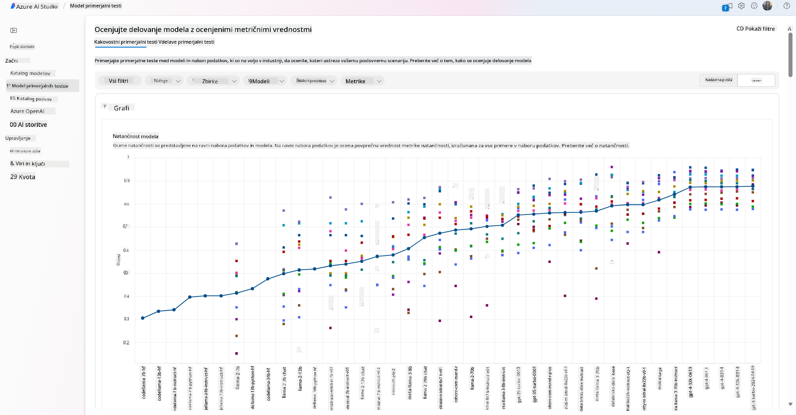
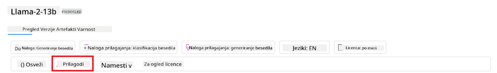
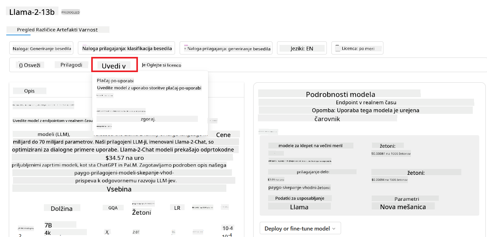
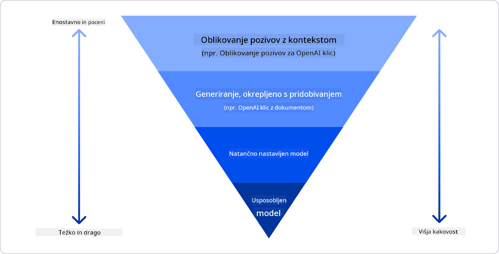

<!--
CO_OP_TRANSLATOR_METADATA:
{
  "original_hash": "e2f686f2eb794941761252ac5e8e090b",
  "translation_date": "2025-06-25T11:05:58+00:00",
  "source_file": "02-exploring-and-comparing-different-llms/README.md",
  "language_code": "sl"
}
-->
# Raziskovanje in primerjava različnih LLM-jev

> _Kliknite zgornjo sliko za ogled videa te lekcije_

V prejšnji lekciji smo videli, kako Generativna umetna inteligenca spreminja tehnološko pokrajino, kako delujejo veliki jezikovni modeli (LLM-ji) in kako jih lahko podjetje - kot naš startup - uporabi za svoje primere uporabe in rast! V tem poglavju želimo primerjati in kontrastirati različne tipe velikih jezikovnih modelov (LLM-jev), da bi razumeli njihove prednosti in slabosti.

Naslednji korak v naši startup poti je raziskovanje trenutne pokrajine LLM-jev in razumevanje, kateri so primerni za naš primer uporabe.

## Uvod

Ta lekcija bo zajemala:

- Različne vrste LLM-jev v trenutni pokrajini.
- Testiranje, iteracijo in primerjavo različnih modelov za vaš primer uporabe v Azure.
- Kako namestiti LLM.

## Cilji učenja

Po zaključku te lekcije boste lahko:

- Izbrali pravi model za vaš primer uporabe.
- Razumeli, kako testirati, iterirati in izboljšati zmogljivost vašega modela.
- Vedeli, kako podjetja nameščajo modele.

## Razumevanje različnih vrst LLM-jev

LLM-ji imajo lahko več kategorij glede na njihovo arhitekturo, podatke za učenje in primer uporabe. Razumevanje teh razlik bo našemu startupu pomagalo izbrati pravi model za scenarij in razumeti, kako testirati, iterirati in izboljšati zmogljivost.

Obstaja veliko različnih vrst LLM modelov, izbira modela pa je odvisna od tega, za kaj jih želite uporabiti, vaših podatkov, koliko ste pripravljeni plačati in še več.

Glede na to, ali želite modele uporabiti za generiranje besedila, zvoka, videa, slik in tako naprej, se lahko odločite za drugo vrsto modela.

- **Prepoznavanje zvoka in govora**. Za ta namen so modeli tipa Whisper odlična izbira, saj so splošno uporabni in namenjeni prepoznavanju govora. Usposobljeni so na raznolikem zvoku in lahko izvajajo večjezično prepoznavanje govora. Več o modelih tipa Whisper si preberite [tukaj](https://platform.openai.com/docs/models/whisper?WT.mc_id=academic-105485-koreyst).

- **Generiranje slik**. Za generiranje slik sta DALL-E in Midjourney dve zelo znani izbiri. DALL-E ponuja Azure OpenAI. [Preberite več o DALL-E tukaj](https://platform.openai.com/docs/models/dall-e?WT.mc_id=academic-105485-koreyst) in tudi v 9. poglavju tega učnega načrta.

- **Generiranje besedila**. Večina modelov je usposobljena za generiranje besedila in imate veliko izbiro od GPT-3.5 do GPT-4. Imajo različne stroške, pri čemer je GPT-4 najdražji. Vredno je raziskati [Azure OpenAI playground](https://oai.azure.com/portal/playground?WT.mc_id=academic-105485-koreyst), da ocenite, kateri modeli najbolje ustrezajo vašim potrebam glede na zmogljivosti in stroške.

- **Večmodalnost**. Če želite obdelati več vrst podatkov na vhodu in izhodu, boste morda želeli pogledati modele, kot je [gpt-4 turbo z vizijo ali gpt-4o](https://learn.microsoft.com/azure/ai-services/openai/concepts/models#gpt-4-and-gpt-4-turbo-models?WT.mc_id=academic-105485-koreyst) - najnovejše izdaje modelov OpenAI - ki so sposobni združiti obdelavo naravnega jezika z vizualnim razumevanjem, kar omogoča interakcije prek večmodalnih vmesnikov.

Izbira modela pomeni, da dobite nekatere osnovne zmogljivosti, ki pa morda niso dovolj. Pogosto imate podatke, specifične za podjetje, ki jih morate nekako sporočiti LLM-ju. Obstaja nekaj različnih možnosti, kako pristopiti k temu, več o tem v naslednjih razdelkih.

### Temeljni modeli proti LLM-jem

Izraz Temeljni model je bil [skovan s strani raziskovalcev Stanforda](https://arxiv.org/abs/2108.07258?WT.mc_id=academic-105485-koreyst) in opredeljen kot AI model, ki sledi nekaterim kriterijem, kot so:

- **Usposobljeni so z uporabo nenadzorovanega učenja ali samonadzorovanega učenja**, kar pomeni, da so usposobljeni na neoznačenih večmodalnih podatkih in ne potrebujejo človeškega označevanja ali označevanja podatkov za njihov proces usposabljanja.
- **So zelo veliki modeli**, ki temeljijo na zelo globokih nevronskih mrežah, usposobljenih na milijardah parametrov.
- **Običajno so namenjeni služenju kot 'temelj' za druge modele**, kar pomeni, da se lahko uporabljajo kot izhodišče za gradnjo drugih modelov, kar se lahko doseže s fino nastavitvijo.

Za nadaljnjo razjasnitev te razlike, vzemimo ChatGPT kot primer. Za izgradnjo prve različice ChatGPT je model z imenom GPT-3.5 služil kot temeljni model. To pomeni, da je OpenAI uporabil nekaj podatkov, specifičnih za klepet, da je ustvaril prilagojeno različico GPT-3.5, ki je bila specializirana za dobro delovanje v pogovornih scenarijih, kot so klepetalniki.

### Odprtokodni proti lastniškim modelom

Drug način za kategorizacijo LLM-jev je, ali so odprtokodni ali lastniški.

Odprtokodni modeli so modeli, ki so na voljo javnosti in jih lahko uporablja kdorkoli. Pogosto jih omogoči podjetje, ki jih je ustvarilo, ali raziskovalna skupnost. Ti modeli se lahko pregledajo, spremenijo in prilagodijo za različne primere uporabe v LLM-jih. Vendar pa niso vedno optimizirani za uporabo v proizvodnji in morda niso tako zmogljivi kot lastniški modeli. Poleg tega je financiranje odprtokodnih modelov lahko omejeno in morda ne bodo vzdrževani dolgoročno ali posodobljeni z najnovejšimi raziskavami. Primeri priljubljenih odprtokodnih modelov vključujejo [Alpaca](https://crfm.stanford.edu/2023/03/13/alpaca.html?WT.mc_id=academic-105485-koreyst), [Bloom](https://huggingface.co/bigscience/bloom) in [LLaMA](https://llama.meta.com).

Lastniški modeli so modeli, ki so v lasti podjetja in niso na voljo javnosti. Ti modeli so pogosto optimizirani za uporabo v proizvodnji. Vendar pa jih ni dovoljeno pregledovati, spreminjati ali prilagajati za različne primere uporabe. Poleg tega niso vedno na voljo brezplačno in lahko zahtevajo naročnino ali plačilo za uporabo. Uporabniki prav tako nimajo nadzora nad podatki, ki se uporabljajo za usposabljanje modela, kar pomeni, da morajo zaupati lastniku modela, da zagotovi zavezanost k varovanju podatkov in odgovorni uporabi AI. Primeri priljubljenih lastniških modelov vključujejo [OpenAI modele](https://platform.openai.com/docs/models/overview?WT.mc_id=academic-105485-koreyst), [Google Bard](https://sapling.ai/llm/bard?WT.mc_id=academic-105485-koreyst) ali [Claude 2](https://www.anthropic.com/index/claude-2?WT.mc_id=academic-105485-koreyst).

### Vdelava proti generiranju slik proti generiranju besedila in kode

LLM-ji se lahko kategorizirajo tudi glede na izhod, ki ga generirajo.

Vdelave so niz modelov, ki lahko pretvorijo besedilo v numerično obliko, imenovano vdelava, kar je numerična predstavitev vhodnega besedila. Vdelave olajšajo strojem razumevanje odnosov med besedami ali stavki in jih lahko kot vhodne podatke porabijo drugi modeli, kot so modeli za klasifikacijo ali modeli za združevanje, ki imajo boljše zmogljivosti na numeričnih podatkih. Modeli za vdelavo se pogosto uporabljajo za prenosno učenje, kjer je model zgrajen za nadomestno nalogo, za katero je na voljo obilje podatkov, nato pa se uteži modela (vdelave) ponovno uporabijo za druge nadaljnje naloge. Primer te kategorije je [OpenAI vdelave](https://platform.openai.com/docs/models/embeddings?WT.mc_id=academic-105485-koreyst).

Modeli za generiranje slik so modeli, ki generirajo slike. Ti modeli se pogosto uporabljajo za urejanje slik, sintezo slik in prevajanje slik. Modeli za generiranje slik so pogosto usposobljeni na velikih zbirkah slik, kot je [LAION-5B](https://laion.ai/blog/laion-5b/?WT.mc_id=academic-105485-koreyst), in se lahko uporabljajo za generiranje novih slik ali urejanje obstoječih slik s tehnikami, kot so inpainting, super-resolucija in barvanje. Primeri vključujejo [DALL-E-3](https://openai.com/dall-e-3?WT.mc_id=academic-105485-koreyst) in [Stable Diffusion modele](https://github.com/Stability-AI/StableDiffusion?WT.mc_id=academic-105485-koreyst).

Modeli za generiranje besedila in kode so modeli, ki generirajo besedilo ali kodo. Ti modeli se pogosto uporabljajo za povzemanje besedila, prevajanje in odgovarjanje na vprašanja. Modeli za generiranje besedila so pogosto usposobljeni na velikih zbirkah besedil, kot je [BookCorpus](https://www.cv-foundation.org/openaccess/content_iccv_2015/html/Zhu_Aligning_Books_and_ICCV_2015_paper.html?WT.mc_id=academic-105485-koreyst), in se lahko uporabljajo za generiranje novega besedila ali za odgovarjanje na vprašanja. Modeli za generiranje kode, kot je [CodeParrot](https://huggingface.co/codeparrot?WT.mc_id=academic-105485-koreyst), so pogosto usposobljeni na velikih zbirkah kode, kot je GitHub, in se lahko uporabljajo za generiranje nove kode ali za popravljanje napak v obstoječi kodi.

### Encoder-Decoder proti samo Decoder

Da bi govorili o različnih vrstah arhitektur LLM-jev, uporabimo analogijo.

Predstavljajte si, da vam je vaš nadrejeni dal nalogo, da napišete kviz za študente. Imate dva sodelavca; eden je zadolžen za ustvarjanje vsebine, drugi pa za pregledovanje.

Ustvarjalec vsebine je kot model samo Decoder, lahko pogleda na temo in vidi, kaj ste že napisali, nato pa lahko napiše tečaj na podlagi tega. So zelo dobri pri pisanju privlačne in informativne vsebine, vendar niso zelo dobri pri razumevanju teme in učnih ciljev. Nekateri primeri modelov Decoder so modeli družine GPT, kot je GPT-3.

Pregledovalec je kot model samo Encoder, pogleda na napisan tečaj in odgovore, opazi odnos med njimi in razume kontekst, vendar ni dober pri generiranju vsebine. Primer modela samo Encoder bi bil BERT.

Predstavljajte si, da imamo lahko tudi nekoga, ki bi lahko ustvaril in pregledal kviz, to je model Encoder-Decoder. Nekateri primeri bi bili BART in T5.

### Storitev proti modelu

Zdaj pa govorimo o razliki med storitvijo in modelom. Storitev je izdelek, ki ga ponuja ponudnik storitev v oblaku in je pogosto kombinacija modelov, podatkov in drugih komponent. Model je osrednja komponenta storitve in je pogosto temeljni model, kot je LLM.

Storitve so pogosto optimizirane za uporabo v proizvodnji in so pogosto lažje za uporabo kot modeli, prek grafičnega uporabniškega vmesnika. Vendar storitve niso vedno na voljo brezplačno in lahko zahtevajo naročnino ali plačilo za uporabo, v zameno za izkoriščanje opreme in virov lastnika storitve, optimizacijo stroškov in enostavno prilagajanje. Primer storitve je [Azure OpenAI Service](https://learn.microsoft.com/azure/ai-services/openai/overview?WT.mc_id=academic-105485-koreyst), ki ponuja načrt zaračunavanja glede na uporabo, kar pomeni, da se uporabnikom zaračuna sorazmerno glede na to, koliko uporabljajo storitev. Prav tako Azure OpenAI Service ponuja varnost na ravni podjetja in okvir odgovorne umetne inteligence na vrhu zmogljivosti modelov.

Modeli so le nevronska mreža, s parametri, utežmi in drugimi. Omogočajo podjetjem, da delujejo lokalno, vendar bi morali kupiti opremo, zgraditi strukturo za prilagajanje in kupiti licenco ali uporabiti odprtokodni model. Model, kot je LLaMA, je na voljo za uporabo, kar zahteva računalniško moč za zagon modela.

## Kako testirati in iterirati z različnimi modeli za razumevanje zmogljivosti na Azure

Ko je naša ekipa raziskala trenutno pokrajino LLM-jev in identificirala nekaj dobrih kandidatov za njihove scenarije, je naslednji korak testiranje na njihovih podatkih in na njihovi delovni obremenitvi. To je iterativni proces, izveden z eksperimenti in meritvami.
Večina modelov, ki smo jih omenili v prejšnjih odstavkih (OpenAI modeli, odprtokodni modeli, kot je Llama2, in Hugging Face transformatorji) so na voljo v [Model Catalog](https://learn.microsoft.com/azure/ai-studio/how-to/model-catalog-overview?WT.mc_id=academic-105485-koreyst) v [Azure AI Studio](https://ai.azure.com/?WT.mc_id=academic-105485-koreyst).

[Azure AI Studio](https://learn.microsoft.com/azure/ai-studio/what-is-ai-studio?WT.mc_id=academic-105485-koreyst) je oblačna platforma, zasnovana za razvijalce, da gradijo generativne AI aplikacije in upravljajo celoten razvojni življenjski cikel - od eksperimentiranja do ocenjevanja - z združevanjem vseh Azure AI storitev v en sam hub z uporabnim GUI. Model Catalog v Azure AI Studio omogoča uporabniku:

- Iskanje temeljnega modela v katalogu - bodisi lastniškega bodisi odprtokodnega, filtriranje po nalogi, licenci ali imenu. Za izboljšanje iskalnosti so modeli organizirani v zbirke, kot je zbirka Azure OpenAI, zbirka Hugging Face in več.

- Pregled modelne kartice, vključno s podrobnim opisom nameravane uporabe in podatkov za usposabljanje, vzorci kode in rezultati ocenjevanja v notranji knjižnici ocenjevanj.
- Primerjajte merila uspešnosti med modeli in podatkovnimi nabori, ki so na voljo v industriji, da ocenite, kateri ustreza poslovnemu scenariju, prek podokna [Model Benchmarks](https://learn.microsoft.com/azure/ai-studio/how-to/model-benchmarks?WT.mc_id=academic-105485-koreyst).

- Prilagodite model z lastnimi podatki za usposabljanje, da izboljšate zmogljivost modela v določenem delovnem bremenu, s pomočjo zmogljivosti za eksperimentiranje in sledenje v Azure AI Studio.

- Namestite izvirni predhodno usposobljeni model ali prilagojeno različico na oddaljeno točko za sklepanje v realnem času - upravljano računalništvo - ali brez strežniško API končno točko - [plačaj po porabi](https://learn.microsoft.com/azure/ai-studio/how-to/model-catalog-overview#model-deployment-managed-compute-and-serverless-api-pay-as-you-go?WT.mc_id=academic-105485-koreyst) - da omogočite aplikacijam, da ga uporabljajo.

> [!NOTE]
> Trenutno niso vsi modeli v katalogu na voljo za prilagajanje in/ali namestitev po načelu plačaj po porabi. Preverite kartico modela za podrobnosti o zmožnostih in omejitvah modela.

## Izboljšanje rezultatov LLM

Raziskovali smo z našo startup ekipo različne vrste LLM-jev in Cloud Platformo (Azure Machine Learning), ki nam omogoča primerjavo različnih modelov, njihovo ocenjevanje na testnih podatkih, izboljšanje zmogljivosti in njihovo namestitev na točkah za sklepanje.

Kdaj pa naj razmislijo o prilagajanju modela namesto uporabe predhodno usposobljenega? Ali obstajajo drugi pristopi za izboljšanje zmogljivosti modela v specifičnih delovnih bremenih?

Obstaja več pristopov, ki jih podjetje lahko uporabi, da doseže rezultate, ki jih potrebuje od LLM-ja. Lahko izberete različne vrste modelov z različnimi stopnjami usposabljanja pri namestitvi LLM-ja v produkcijo, z različnimi stopnjami kompleksnosti, stroškov in kakovosti. Tukaj je nekaj različnih pristopov:

- **Oblikovanje pozivov s kontekstom**. Ideja je zagotoviti dovolj konteksta, ko oblikujete poziv, da zagotovite, da dobite potrebne odgovore.

- **Pridobivanje obogatene generacije, RAG**. Vaši podatki lahko obstajajo v podatkovni bazi ali spletnem končnem mestu, na primer, da zagotovite, da so ti podatki ali njihov podnabor vključeni ob času pozivanja, lahko pridobite ustrezne podatke in jih vključite v uporabnikov poziv.

- **Prilagojen model**. Tukaj ste dodatno usposobili model na lastnih podatkih, kar je pripeljalo do tega, da je model bolj natančen in odziven na vaše potrebe, vendar je lahko drag.

Vir slike: [Four Ways that Enterprises Deploy LLMs | Fiddler AI Blog](https://www.fiddler.ai/blog/four-ways-that-enterprises-deploy-llms?WT.mc_id=academic-105485-koreyst)

### Oblikovanje pozivov s kontekstom

Predhodno usposobljeni LLM-ji delujejo zelo dobro na splošnih nalogah naravnega jezika, tudi če jih pokličemo s kratkim pozivom, kot je stavek za dokončanje ali vprašanje – tako imenovano učenje brez primerov.

Vendar, bolj ko lahko uporabnik oblikuje svojo poizvedbo z natančno zahtevo in primeri – Kontekst – bolj natančen in bližje pričakovanjem uporabnika bo odgovor. V tem primeru govorimo o "učenju z enim primerom", če poziv vključuje le en primer, in "učenju z več primeri", če vključuje več primerov. Oblikovanje pozivov s kontekstom je najbolj stroškovno učinkovit pristop za začetek.

### Pridobivanje obogatene generacije (RAG)

LLM-ji imajo omejitev, da lahko uporabijo le podatke, ki so bili uporabljeni med njihovim usposabljanjem, za generiranje odgovora. To pomeni, da ne vedo ničesar o dejstvih, ki so se zgodila po njihovem usposabljanju, in ne morejo dostopati do ne-javnih informacij (kot so podatki podjetja).
To lahko premostimo z RAG, tehniko, ki obogati poziv z zunanjimi podatki v obliki kosov dokumentov, ob upoštevanju omejitev dolžine poziva. To podpira orodja za podatkovne baze vektorjev (kot je [Azure Vector Search](https://learn.microsoft.com/azure/search/vector-search-overview?WT.mc_id=academic-105485-koreyst)), ki pridobijo uporabne kose iz različnih vnaprej določenih virov podatkov in jih dodajo v kontekst poziva.

Ta tehnika je zelo koristna, ko podjetje nima dovolj podatkov, dovolj časa ali sredstev za prilagoditev LLM-ja, vendar še vedno želi izboljšati zmogljivost v specifičnem delovnem bremenu in zmanjšati tveganja izmišljotin, tj. mistifikacije realnosti ali škodljive vsebine.

### Prilagojen model

Prilagajanje je proces, ki izkorišča prenosno učenje za 'prilagoditev' modela na nalogo navzdol ali za reševanje specifičnega problema. Različno od učenja z več primeri in RAG, to vodi v generiranje novega modela z posodobljenimi utežmi in pristranskostmi. Zahteva niz primerov usposabljanja, ki vsebujejo en sam vhod (poziv) in njegov pripadajoč izhod (dokončanje).
To bi bil prednostni pristop, če:

- **Uporaba prilagojenih modelov**. Podjetje bi želelo uporabiti prilagojene manj sposobne modele (kot so modeli za vdelavo) namesto visoko zmogljivih modelov, kar vodi v bolj stroškovno učinkovito in hitro rešitev.

- **Upoštevanje zakasnitve**. Zakasnitev je pomembna za specifično uporabo, zato ni mogoče uporabiti zelo dolgih pozivov ali števila primerov, ki bi se morali naučiti iz modela, ne ustreza omejitvam dolžine poziva.

- **Ostajanje posodobljeno**. Podjetje ima veliko visokokakovostnih podatkov in resničnih oznak ter sredstva, potrebna za vzdrževanje teh podatkov posodobljenih skozi čas.

### Usposobljen model

Usposabljanje LLM-ja iz nič je nedvomno najtežji in najbolj kompleksen pristop, ki ga je treba sprejeti, zahteva ogromne količine podatkov, usposobljene vire in ustrezno računalniško moč. To možnost je treba upoštevati le v scenariju, kjer ima podjetje domeno-specifično uporabo in veliko količino podatkov, osredotočenih na domeno.

## Preverjanje znanja

Kateri bi bil dober pristop za izboljšanje rezultatov dokončanja LLM?

1. Oblikovanje pozivov s kontekstom
1. RAG
1. Prilagojen model

A:3, če imate čas in sredstva ter visokokakovostne podatke, je prilagajanje boljša možnost za ostajanje posodobljen. Vendar, če želite izboljšati stvari in vam primanjkuje časa, je vredno najprej razmisliti o RAG.

## 🚀 Izziv

Preberite več o tem, kako lahko [uporabite RAG](https://learn.microsoft.com/azure/search/retrieval-augmented-generation-overview?WT.mc_id=academic-105485-koreyst) za vaše podjetje.

## Odlično delo, nadaljujte z učenjem

Po zaključku te lekcije si oglejte našo [Generative AI Learning collection](https://aka.ms/genai-collection?WT.mc_id=academic-105485-koreyst), da nadaljujete z nadgradnjo vašega znanja o generativni umetni inteligenci!

Odpravite se na lekcijo 3, kjer bomo pogledali, kako [graditi z generativno umetno inteligenco odgovorno](../03-using-generative-ai-responsibly/README.md?WT.mc_id=academic-105485-koreyst)!

**Izjava o omejitvi odgovornosti**:  
Ta dokument je bil preveden z uporabo AI prevajalske storitve [Co-op Translator](https://github.com/Azure/co-op-translator). Čeprav si prizadevamo za natančnost, vas prosimo, da se zavedate, da lahko avtomatizirani prevodi vsebujejo napake ali netočnosti. Izvirni dokument v njegovem maternem jeziku je treba obravnavati kot avtoritativni vir. Za ključne informacije je priporočljivo profesionalno človeško prevajanje. Ne odgovarjamo za morebitne nesporazume ali napačne razlage, ki bi izhajale iz uporabe tega prevoda.