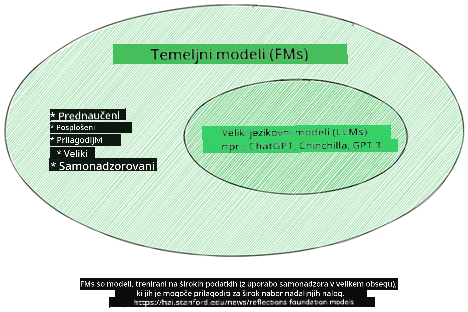

<!--
CO_OP_TRANSLATOR_METADATA:
{
  "original_hash": "6b7629b8ee4d7d874a27213e903d86a7",
  "translation_date": "2025-10-18T01:42:08+00:00",
  "source_file": "02-exploring-and-comparing-different-llms/README.md",
  "language_code": "sl"
}
-->
# Raziskovanje in primerjava različnih velikih jezikovnih modelov (LLM)

> _Kliknite zgornjo sliko za ogled videoposnetka te lekcije_

V prejšnji lekciji smo videli, kako generativna umetna inteligenca spreminja tehnološko pokrajino, kako delujejo veliki jezikovni modeli (LLM) in kako lahko podjetje - kot je naš startup - te modele uporabi za svoje primere uporabe in rast! V tem poglavju bomo primerjali in kontrastirali različne vrste velikih jezikovnih modelov (LLM), da bi razumeli njihove prednosti in slabosti.

Naslednji korak v poti našega startupa je raziskovanje trenutne pokrajine LLM-jev in razumevanje, kateri so primerni za naš primer uporabe.

## Uvod

Ta lekcija bo zajemala:

- Različne vrste LLM-jev v trenutni pokrajini.
- Testiranje, iteracijo in primerjavo različnih modelov za vaš primer uporabe v Azure.
- Kako namestiti LLM.

## Cilji učenja

Po zaključku te lekcije boste lahko:

- Izbrali pravi model za vaš primer uporabe.
- Razumeli, kako testirati, iterirati in izboljšati zmogljivost vašega modela.
- Vedeli, kako podjetja nameščajo modele.

## Razumevanje različnih vrst LLM-jev

LLM-ji se lahko razvrstijo glede na njihovo arhitekturo, podatke za učenje in primer uporabe. Razumevanje teh razlik bo našemu startupu pomagalo izbrati pravi model za določeno situacijo ter razumeti, kako testirati, iterirati in izboljšati zmogljivost.

Obstaja veliko različnih vrst LLM modelov, izbira modela pa je odvisna od tega, za kaj jih nameravate uporabiti, vaših podatkov, koliko ste pripravljeni plačati in drugih dejavnikov.

Glede na to, ali nameravate modele uporabiti za generiranje besedila, zvoka, videa, slik in podobno, boste morda izbrali drugačno vrsto modela.

- **Prepoznavanje zvoka in govora**. Za ta namen so modeli tipa Whisper odlična izbira, saj so splošno uporabni in namenjeni prepoznavanju govora. Usposobljeni so na raznolikih zvočnih podatkih in lahko izvajajo večjezično prepoznavanje govora. Več o modelih tipa Whisper preberite [tukaj](https://platform.openai.com/docs/models/whisper?WT.mc_id=academic-105485-koreyst).

- **Generiranje slik**. Za generiranje slik sta DALL-E in Midjourney dve zelo znani izbiri. DALL-E ponuja Azure OpenAI. [Preberite več o DALL-E tukaj](https://platform.openai.com/docs/models/dall-e?WT.mc_id=academic-105485-koreyst) in tudi v 9. poglavju tega učnega načrta.

- **Generiranje besedila**. Večina modelov je usposobljenih za generiranje besedila, na voljo pa imate širok izbor od GPT-3.5 do GPT-4. Ti modeli imajo različne stroške, pri čemer je GPT-4 najdražji. Vredno je raziskati [Azure OpenAI playground](https://oai.azure.com/portal/playground?WT.mc_id=academic-105485-koreyst), da ocenite, kateri modeli najbolje ustrezajo vašim potrebam glede zmogljivosti in stroškov.

- **Multimodalnost**. Če želite obdelovati več vrst podatkov v vhodu in izhodu, bi morda želeli raziskati modele, kot sta [gpt-4 turbo z vizijo ali gpt-4o](https://learn.microsoft.com/azure/ai-services/openai/concepts/models#gpt-4-and-gpt-4-turbo-models?WT.mc_id=academic-105485-koreyst) - najnovejše izdaje modelov OpenAI - ki so sposobni združiti obdelavo naravnega jezika z vizualnim razumevanjem, kar omogoča interakcije prek multimodalnih vmesnikov.

Izbira modela pomeni, da dobite osnovne zmogljivosti, ki pa morda ne bodo dovolj. Pogosto imate podatke, specifične za podjetje, ki jih morate nekako predstaviti LLM-ju. Obstaja nekaj različnih pristopov, kako to doseči, več o tem v naslednjih razdelkih.

### Temeljni modeli proti LLM-jem

Izraz Temeljni model so [skovali raziskovalci na Stanfordu](https://arxiv.org/abs/2108.07258?WT.mc_id=academic-105485-koreyst) in ga opredelili kot model umetne inteligence, ki sledi nekaterim kriterijem, kot so:

- **Usposobljeni so z uporabo nenadzorovanega učenja ali samonadzorovanega učenja**, kar pomeni, da so usposobljeni na neoznačenih večmodalnih podatkih in ne potrebujejo človeškega označevanja ali označevanja podatkov za svoj učni proces.
- **So zelo veliki modeli**, ki temeljijo na zelo globokih nevronskih mrežah, usposobljenih na milijardah parametrov.
- **Običajno so namenjeni kot 'temelj' za druge modele**, kar pomeni, da se lahko uporabijo kot izhodišče za gradnjo drugih modelov, kar se lahko doseže z dodatnim prilagajanjem.

Vir slike: [Essential Guide to Foundation Models and Large Language Models | by Babar M Bhatti | Medium
](https://thebabar.medium.com/essential-guide-to-foundation-models-and-large-language-models-27dab58f7404)

Za dodatno pojasnitev te razlike vzemimo ChatGPT kot primer. Za izdelavo prve različice ChatGPT je model GPT-3.5 služil kot temeljni model. To pomeni, da je OpenAI uporabil nekaj podatkov, specifičnih za klepet, da bi ustvaril prilagojeno različico GPT-3.5, ki je bila specializirana za dobro delovanje v pogovornih scenarijih, kot so klepetalni roboti.

Vir slike: [2108.07258.pdf (arxiv.org)](https://arxiv.org/pdf/2108.07258.pdf?WT.mc_id=academic-105485-koreyst)

### Odprtokodni proti lastniškim modelom

Drugi način razvrščanja LLM-jev je, ali so odprtokodni ali lastniški.

Odprtokodni modeli so modeli, ki so na voljo javnosti in jih lahko uporablja vsak. Pogosto jih objavi podjetje, ki jih je ustvarilo, ali raziskovalna skupnost. Ti modeli omogočajo pregled, spreminjanje in prilagajanje za različne primere uporabe LLM-jev. Vendar pa niso vedno optimizirani za uporabo v produkciji in morda niso tako zmogljivi kot lastniški modeli. Poleg tega je financiranje odprtokodnih modelov lahko omejeno, morda niso dolgoročno vzdrževani ali posodobljeni z najnovejšimi raziskavami. Primeri priljubljenih odprtokodnih modelov vključujejo [Alpaca](https://crfm.stanford.edu/2023/03/13/alpaca.html?WT.mc_id=academic-105485-koreyst), [Bloom](https://huggingface.co/bigscience/bloom) in [LLaMA](https://llama.meta.com).

Lastniški modeli so modeli, ki so v lasti podjetja in niso na voljo javnosti. Ti modeli so pogosto optimizirani za uporabo v produkciji. Vendar pa jih ni mogoče pregledovati, spreminjati ali prilagajati za različne primere uporabe. Poleg tega niso vedno brezplačno dostopni in za njihovo uporabo je morda potrebna naročnina ali plačilo. Uporabniki tudi nimajo nadzora nad podatki, ki se uporabljajo za usposabljanje modela, kar pomeni, da morajo zaupati lastniku modela, da zagotovi zavezanost k varovanju podatkov in odgovorni uporabi umetne inteligence. Primeri priljubljenih lastniških modelov vključujejo [OpenAI modele](https://platform.openai.com/docs/models/overview?WT.mc_id=academic-105485-koreyst), [Google Bard](https://sapling.ai/llm/bard?WT.mc_id=academic-105485-koreyst) ali [Claude 2](https://www.anthropic.com/index/claude-2?WT.mc_id=academic-105485-koreyst).

### Vdelava proti generiranju slik proti generiranju besedila in kode

LLM-je lahko razvrstimo tudi glede na izhod, ki ga generirajo.

Vdelave so nabor modelov, ki lahko pretvorijo besedilo v numerično obliko, imenovano vdelava, kar je numerična predstavitev vhodnega besedila. Vdelave olajšajo strojem razumevanje odnosov med besedami ali stavki in jih lahko uporabimo kot vhodne podatke za druge modele, kot so klasifikacijski modeli ali modeli za razvrščanje, ki imajo boljšo zmogljivost pri numeričnih podatkih. Modeli vdelave se pogosto uporabljajo za prenosno učenje, kjer se model gradi za nadomestno nalogo, za katero je na voljo veliko podatkov, nato pa se uteži modela (vdelave) ponovno uporabijo za druge naloge. Primer te kategorije je [OpenAI embeddings](https://platform.openai.com/docs/models/embeddings?WT.mc_id=academic-105485-koreyst).

Modeli za generiranje slik so modeli, ki generirajo slike. Ti modeli se pogosto uporabljajo za urejanje slik, sintezo slik in prevajanje slik. Modeli za generiranje slik so pogosto usposobljeni na velikih zbirkah slik, kot je [LAION-5B](https://laion.ai/blog/laion-5b/?WT.mc_id=academic-105485-koreyst), in jih je mogoče uporabiti za generiranje novih slik ali za urejanje obstoječih slik s tehnikami, kot so inpainting, super-resolucija in barvanje. Primeri vključujejo [DALL-E-3](https://openai.com/dall-e-3?WT.mc_id=academic-105485-koreyst) in [Stable Diffusion models](https://github.com/Stability-AI/StableDiffusion?WT.mc_id=academic-105485-koreyst).

Modeli za generiranje besedila in kode so modeli, ki generirajo besedilo ali kodo. Ti modeli se pogosto uporabljajo za povzemanje besedila, prevajanje in odgovarjanje na vprašanja. Modeli za generiranje besedila so pogosto usposobljeni na velikih zbirkah besedila, kot je [BookCorpus](https://www.cv-foundation.org/openaccess/content_iccv_2015/html/Zhu_Aligning_Books_and_ICCV_2015_paper.html?WT.mc_id=academic-105485-koreyst), in jih je mogoče uporabiti za generiranje novega besedila ali za odgovarjanje na vprašanja. Modeli za generiranje kode, kot je [CodeParrot](https://huggingface.co/codeparrot?WT.mc_id=academic-105485-koreyst), so pogosto usposobljeni na velikih zbirkah kode, kot je GitHub, in jih je mogoče uporabiti za generiranje nove kode ali za odpravljanje napak v obstoječi kodi.

### Encoder-Decoder proti samo Decoder

Za razpravo o različnih vrstah arhitektur LLM-jev uporabimo analogijo.

Predstavljajte si, da vam je vaš vodja dal nalogo, da napišete kviz za študente. Imate dva sodelavca; eden je zadolžen za ustvarjanje vsebine, drugi pa za njeno pregledovanje.

Ustvarjalec vsebine je kot model samo Decoder, ki lahko pogleda temo in vidi, kaj ste že napisali, nato pa na podlagi tega napiše tečaj. Zelo dobro zna pisati privlačno in informativno vsebino, vendar ni zelo dober pri razumevanju teme in učnih ciljev. Nekateri primeri modelov samo Decoder so modeli družine GPT, kot je GPT-3.

Recenzent je kot model samo Encoder, ki pogleda napisani tečaj in odgovore, opazi odnos med njimi ter razume kontekst, vendar ni dober pri ustvarjanju vsebine. Primer modela samo Encoder bi bil BERT.

Predstavljajte si, da imamo nekoga, ki bi lahko ustvarjal in pregledoval kviz, to je model Encoder-Decoder. Nekateri primeri bi bili BART in T5.

### Storitev proti modelu

Zdaj pa se pogovorimo o razliki med storitvijo in modelom. Storitev je produkt, ki ga ponuja ponudnik storitev v oblaku in je pogosto kombinacija modelov, podatkov in drugih komponent. Model je osrednja komponenta storitve in je pogosto temeljni model, kot je LLM.

Storitve so pogosto optimizirane za uporabo v produkciji in so pogosto lažje za uporabo kot modeli, prek grafičnega uporabniškega vmesnika. Vendar storitve niso vedno brezplačno dostopne in za njihovo uporabo je morda potrebna naročnina ali plačilo, v zameno za uporabo opreme in virov lastnika storitve, kar optimizira stroške in omogoča enostavno skaliranje. Primer storitve je [Azure OpenAI Service](https://learn.microsoft.com/azure/ai-services/openai/overview?WT.mc_id=academic-105485-koreyst), ki ponuja načrt plačevanja glede na uporabo, kar pomeni, da se uporabniki zaračunavajo sorazmerno s tem, koliko uporabljajo storitev. Poleg tega Azure OpenAI Service ponuja varnost na ravni podjetja in okvir odgovorne umetne inteligence poleg zmogljivosti modelov.

Modeli so le nevronska mreža, s parametri, utežmi in drugimi komponentami. Podjetjem omogočajo lokalno izvajanje, vendar bi morala kupiti opremo, zgraditi strukturo za skaliranje in kupiti licenco ali uporabiti odprtokodni model. Model, kot je LLaMA, je na voljo za uporabo, kar zahteva računalniško moč za njegovo izvajanje.

## Kako testirati in iterirati z različnimi modeli za razumevanje zmogljivosti v Azure

Ko je naša ekipa raziskala trenutno pokrajino LLM-jev in identificirala nekaj dobrih kandidatov za njihove scenarije, je naslednji korak testiranje teh modelov na njihovih podatkih in delovnih obremenitvah. To je iterativen proces, ki se izvaja z eksperimenti in meritvami.
Večina modelov, ki smo jih omenili v prejšnjih odstavkih (modeli OpenAI, odprtokodni modeli, kot je Llama2, in Hugging Face transformers), je na voljo v [katalogu modelov](https://learn.microsoft.com/azure/ai-studio/how-to/model-catalog-overview?WT.mc_id=academic-105485-koreyst) v [Azure AI Studio](https://ai.azure.com/?WT.mc_id=academic-105485-koreyst).

[Azure AI Studio](https://learn.microsoft.com/azure/ai-studio/what-is-ai-studio?WT.mc_id=academic-105485-koreyst) je oblačna platforma, zasnovana za razvijalce, da gradijo aplikacije generativne umetne inteligence in upravljajo celoten razvojni cikel - od eksperimentiranja do ocenjevanja - s kombiniranjem vseh storitev Azure AI v enoten vmesnik z uporabniku prijaznim grafičnim vmesnikom. Katalog modelov v Azure AI Studio omogoča uporabniku:

- Iskanje osnovnega modela, ki ga zanima, v katalogu - bodisi lastniškega ali odprtokodnega, s filtriranjem po nalogi, licenci ali imenu. Za boljšo iskalnost so modeli organizirani v zbirke, kot so zbirka Azure OpenAI, zbirka Hugging Face in druge.

- Pregled kartice modela, ki vključuje podroben opis namena uporabe in podatkov za učenje, vzorce kode ter rezultate ocenjevanja v interni knjižnici za ocenjevanje.

- Primerjava meril uspešnosti med modeli in podatkovnimi nabori, ki so na voljo v industriji, da se oceni, kateri ustreza poslovnemu scenariju, prek zavihka [Model Benchmarks](https://learn.microsoft.com/azure/ai-studio/how-to/model-benchmarks?WT.mc_id=academic-105485-koreyst).

- Prilagoditev modela na podlagi lastnih podatkov za učenje, da se izboljša zmogljivost modela za določeno delovno obremenitev, z uporabo zmogljivosti za eksperimentiranje in sledenje v Azure AI Studio.

- Namestitev prvotnega predhodno naučenega modela ali prilagojene različice za oddaljeno sklepanje v realnem času - upravljano računalništvo - ali strežniško API končno točko - [plačilo po porabi](https://learn.microsoft.com/azure/ai-studio/how-to/model-catalog-overview#model-deployment-managed-compute-and-serverless-api-pay-as-you-go?WT.mc_id=academic-105485-koreyst) - da omogočite aplikacijam njegovo uporabo.

> [!NOTE]
> Vsi modeli v katalogu trenutno niso na voljo za prilagoditev in/ali namestitev s plačilom po porabi. Preverite kartico modela za podrobnosti o zmogljivostih in omejitvah modela.

## Izboljšanje rezultatov LLM

Skupaj z našo startup ekipo smo raziskovali različne vrste LLM-jev in oblačno platformo (Azure Machine Learning), ki nam omogoča primerjavo različnih modelov, njihovo ocenjevanje na testnih podatkih, izboljšanje zmogljivosti in namestitev na sklepne točke.

Kdaj naj torej razmislijo o prilagoditvi modela namesto uporabe predhodno naučenega? Ali obstajajo drugi pristopi za izboljšanje zmogljivosti modela pri specifičnih delovnih obremenitvah?

Obstaja več pristopov, ki jih lahko podjetje uporabi za dosego želenih rezultatov z LLM. Pri uvajanju LLM v produkcijo lahko izberete različne vrste modelov z različnimi stopnjami učenja, ki se razlikujejo po kompleksnosti, stroških in kakovosti. Tukaj je nekaj različnih pristopov:

- **Oblikovanje pozivov s kontekstom**. Ideja je, da zagotovite dovolj konteksta pri pozivu, da dobite želene odgovore.

- **Generacija z obogatenim pridobivanjem podatkov (RAG)**. Vaši podatki lahko obstajajo v podatkovni bazi ali spletni končni točki, na primer. Da zagotovite, da so ti podatki ali njihov podnabor vključeni ob pozivanju, lahko pridobite ustrezne podatke in jih vključite v poziv uporabnika.

- **Prilagojen model**. Tukaj model dodatno naučite na svojih podatkih, kar vodi do bolj natančnega in odzivnega modela, ki ustreza vašim potrebam, vendar je to lahko drago.

Vir slike: [Four Ways that Enterprises Deploy LLMs | Fiddler AI Blog](https://www.fiddler.ai/blog/four-ways-that-enterprises-deploy-llms?WT.mc_id=academic-105485-koreyst)

### Oblikovanje pozivov s kontekstom

Predhodno naučeni LLM-ji zelo dobro delujejo pri splošnih nalogah naravnega jezika, tudi če jih pozovemo s kratkim pozivom, kot je stavek za dokončanje ali vprašanje – tako imenovano učenje brez primerov ("zero-shot" learning).

Vendar pa bolj kot uporabnik lahko oblikuje svoje vprašanje z natančno zahtevo in primeri – kontekst – bolj natančen in bližje pričakovanjem uporabnika bo odgovor. V tem primeru govorimo o učenju z enim primerom ("one-shot" learning), če poziv vključuje samo en primer, in o učenju z več primeri ("few-shot learning"), če vključuje več primerov. Oblikovanje pozivov s kontekstom je stroškovno najučinkovitejši pristop za začetek.

### Generacija z obogatenim pridobivanjem podatkov (RAG)

LLM-ji imajo omejitev, da lahko za generiranje odgovora uporabljajo le podatke, ki so bili uporabljeni med njihovim učenjem. To pomeni, da ne vedo ničesar o dejstvih, ki so se zgodila po njihovem učnem procesu, in ne morejo dostopati do zasebnih informacij (kot so podatki podjetja). 

To lahko premagamo z RAG, tehniko, ki poziv obogati z zunanjimi podatki v obliki delov dokumentov, pri čemer upošteva omejitve dolžine poziva. To podpirajo orodja za iskanje v vektorskih podatkovnih bazah (kot je [Azure Vector Search](https://learn.microsoft.com/azure/search/vector-search-overview?WT.mc_id=academic-105485-koreyst)), ki pridobijo uporabne dele iz različnih vnaprej določenih virov podatkov in jih dodajo v kontekst poziva.

Ta tehnika je zelo koristna, kadar podjetje nima dovolj podatkov, časa ali virov za prilagoditev LLM-ja, vendar še vedno želi izboljšati zmogljivost pri specifični delovni obremenitvi in zmanjšati tveganje za napake, tj. izkrivljanje resničnosti ali škodljivo vsebino.

### Prilagojen model

Prilagoditev je proces, ki izkorišča prenos učenja za 'prilagoditev' modela na specifično nalogo ali za reševanje določenega problema. Za razliko od učenja z več primeri in RAG, prilagoditev ustvari nov model z posodobljenimi utežmi in pristranskostmi. Zahteva nabor učnih primerov, ki vsebujejo en sam vhod (poziv) in njegov pripadajoči izhod (dokončanje). 

To bi bil prednostni pristop, če:

- **Uporaba prilagojenih modelov**. Podjetje želi uporabiti prilagojene manj zmogljive modele (kot so modeli za vdelavo) namesto visoko zmogljivih modelov, kar vodi do bolj stroškovno učinkovite in hitrejše rešitve.

- **Upoštevanje zakasnitve**. Zakasnitev je pomembna za določen primer uporabe, zato ni mogoče uporabiti zelo dolgih pozivov ali števila primerov, ki bi jih model moral naučiti, ne ustreza omejitvam dolžine poziva.

- **Ohranjanje ažurnosti**. Podjetje ima veliko visokokakovostnih podatkov in resničnih oznak ter potrebne vire za vzdrževanje teh podatkov ažurnih skozi čas.

### Naučen model

Učenje LLM-ja od začetka je nedvomno najtežji in najbolj zahteven pristop, ki zahteva ogromne količine podatkov, usposobljene vire in ustrezno računalniško moč. To možnost je treba upoštevati le v scenariju, kjer ima podjetje primer uporabe, specifičen za določeno področje, in veliko količino podatkov, osredotočenih na to področje.

## Preverjanje znanja

Kaj bi bil dober pristop za izboljšanje rezultatov dokončanja LLM?

1. Oblikovanje pozivov s kontekstom  
1. RAG  
1. Prilagojen model  

A:3, če imate čas, vire in visokokakovostne podatke, je prilagoditev boljša možnost za ohranjanje ažurnosti. Vendar pa, če želite izboljšati stvari in vam primanjkuje časa, je vredno najprej razmisliti o RAG.

## 🚀 Izziv

Preberite več o tem, kako lahko [uporabite RAG](https://learn.microsoft.com/azure/search/retrieval-augmented-generation-overview?WT.mc_id=academic-105485-koreyst) za vaše podjetje.

## Odlično delo, nadaljujte z učenjem

Po zaključku te lekcije si oglejte našo [zbirko učenja o generativni umetni inteligenci](https://aka.ms/genai-collection?WT.mc_id=academic-105485-koreyst), da še naprej nadgrajujete svoje znanje o generativni umetni inteligenci!

Pojdite na 3. lekcijo, kjer bomo raziskali, kako [odgovorno uporabljati generativno umetno inteligenco](../03-using-generative-ai-responsibly/README.md?WT.mc_id=academic-105485-koreyst)!

---

**Omejitev odgovornosti**:  
Ta dokument je bil preveden z uporabo storitve za prevajanje z umetno inteligenco [Co-op Translator](https://github.com/Azure/co-op-translator). Čeprav si prizadevamo za natančnost, vas prosimo, da upoštevate, da lahko avtomatski prevodi vsebujejo napake ali netočnosti. Izvirni dokument v njegovem maternem jeziku je treba obravnavati kot avtoritativni vir. Za ključne informacije priporočamo profesionalni človeški prevod. Ne prevzemamo odgovornosti za morebitne nesporazume ali napačne razlage, ki bi nastale zaradi uporabe tega prevoda.