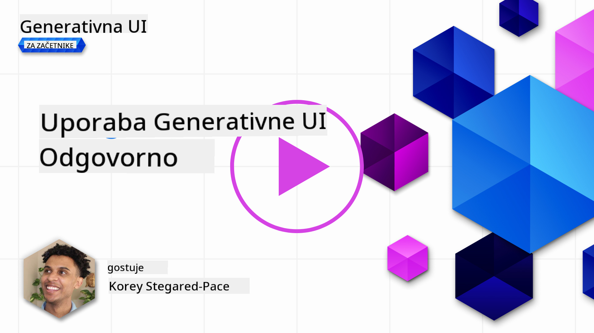
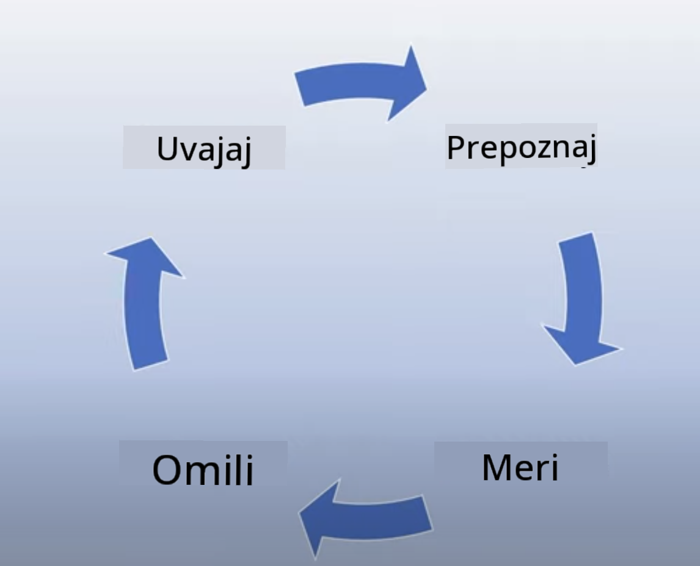
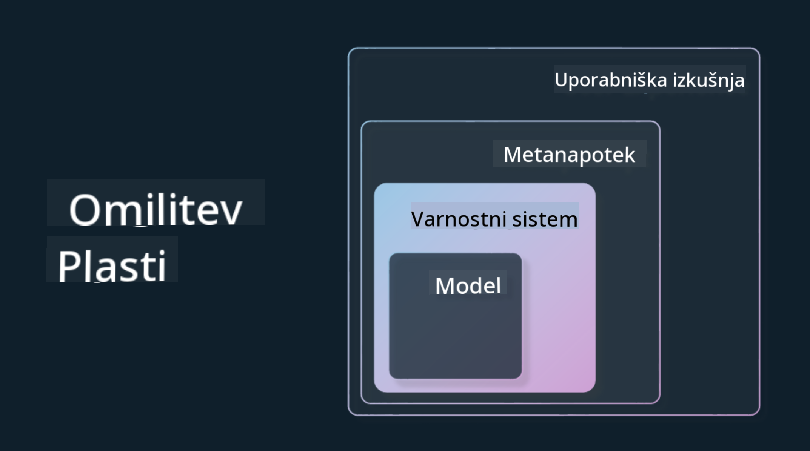

<!--
CO_OP_TRANSLATOR_METADATA:
{
  "original_hash": "7f8f4c11f8c1cb6e1794442dead414ea",
  "translation_date": "2025-07-09T09:04:57+00:00",
  "source_file": "03-using-generative-ai-responsibly/README.md",
  "language_code": "sl"
}
-->
# Odgovorna uporaba generativne umetne inteligence

> _Kliknite na zgornjo sliko za ogled videa te lekcije_

Generativna umetna inteligenca je lahko zelo fascinantna, a pomembno je, da razmislite, kako jo boste uporabljali odgovorno. Treba je upoštevati, kako zagotoviti, da so rezultati pravični, neškodljivi in še več. Ta poglavje vam bo ponudilo kontekst, na kaj morate biti pozorni in kako lahko aktivno izboljšate svojo uporabo AI.

## Uvod

V tej lekciji bomo obravnavali:

- Zakaj je pri razvoju aplikacij z generativno AI pomembno dati prednost odgovorni uporabi AI.
- Osnovna načela odgovorne AI in kako se povezujejo z generativno AI.
- Kako ta načela odgovorne AI uresničiti v praksi s strategijo in orodji.

## Cilji učenja

Po zaključku te lekcije boste razumeli:

- Pomen odgovorne AI pri razvoju aplikacij z generativno AI.
- Kdaj razmišljati o osnovnih načelih odgovorne AI in jih uporabljati pri razvoju generativnih AI aplikacij.
- Katere strategije in orodja so vam na voljo za uresničevanje koncepta odgovorne AI.

## Načela odgovorne AI

Navdušenje nad generativno AI še nikoli ni bilo večje. To navdušenje je pritegnilo veliko novih razvijalcev, pozornosti in financiranja na tem področju. Čeprav je to zelo pozitivno za vse, ki želijo graditi izdelke in podjetja z generativno AI, je prav tako pomembno, da pri tem ravnamo odgovorno.

V tem tečaju se osredotočamo na gradnjo našega startupa in našega izobraževalnega AI izdelka. Uporabili bomo načela odgovorne AI: pravičnost, vključevanje, zanesljivost/varnost, varnost in zasebnost, preglednost ter odgovornost. S temi načeli bomo raziskali, kako se povezujejo z uporabo generativne AI v naših izdelkih.

## Zakaj dati prednost odgovorni AI

Pri razvoju izdelka je najboljši pristop osredotočenost na človeka, kjer imate v mislih najboljše interese uporabnika.

Edinstvenost generativne AI je njena moč ustvarjanja koristnih odgovorov, informacij, navodil in vsebin za uporabnike. To lahko doseže brez veliko ročnih korakov, kar lahko privede do zelo impresivnih rezultatov. Brez ustreznega načrtovanja in strategij pa lahko žal povzroči tudi škodljive posledice za vaše uporabnike, izdelek in družbo kot celoto.

Oglejmo si nekaj (a ne vseh) teh potencialno škodljivih rezultatov:

### Halucinacije

Halucinacije so izraz, ki opisuje, ko LLM ustvari vsebino, ki je popolnoma nesmiselna ali pa je dejansko napačna glede na druge vire informacij.

Na primer, če razvijemo funkcijo za naš startup, ki študentom omogoča postavljanje zgodovinskih vprašanj modelu. Študent vpraša: `Kdo je bil edini preživeli Titanika?`

Model odgovori, kot je prikazano spodaj:

> _(Vir: [Flying bisons](https://flyingbisons.com?WT.mc_id=academic-105485-koreyst))_

To je zelo samozavesten in podroben odgovor. Na žalost je napačen. Že z minimalnim raziskovanjem bi ugotovili, da je bilo več preživelih katastrofe Titanika. Za študenta, ki šele začenja raziskovati to temo, je ta odgovor lahko dovolj prepričljiv, da ga ne postavi pod vprašaj in ga obravnava kot dejstvo. Posledice tega so lahko nezanesljivost AI sistema in negativni vpliv na ugled našega startupa.

Z vsako novo različico LLM smo opazili izboljšave pri zmanjševanju halucinacij. Kljub temu pa moramo kot razvijalci in uporabniki ostati zavedni teh omejitev.

### Škodljiva vsebina

V prejšnjem delu smo obravnavali, ko LLM ustvari napačne ali nesmiselne odgovore. Drugo tveganje, na katerega moramo biti pozorni, je, ko model odgovori s škodljivo vsebino.

Škodljivo vsebino lahko opredelimo kot:

- Navodila ali spodbujanje samopoškodovanja ali škode določenim skupinam.
- Sovražno ali ponižujočo vsebino.
- Načrtovanje napadov ali nasilnih dejanj.
- Navodila, kako najti nezakonito vsebino ali storiti nezakonita dejanja.
- Prikazovanje spolno eksplicitne vsebine.

Za naš startup želimo zagotoviti, da imamo ustrezna orodja in strategije, ki preprečujejo, da bi študenti videli tovrstno vsebino.

### Pomanjkanje pravičnosti

Pravičnost pomeni „zagotoviti, da je AI sistem prost predsodkov in diskriminacije ter da vse obravnava pravično in enako.“ V svetu generativne AI želimo zagotoviti, da model ne krepi izključujočih pogledov na marginalizirane skupine.

Takšni izpisi niso le škodljivi za ustvarjanje pozitivnih uporabniških izkušenj, ampak povzročajo tudi dodatno družbeno škodo. Kot razvijalci aplikacij moramo vedno imeti v mislih široko in raznoliko bazo uporabnikov pri razvoju rešitev z generativno AI.

## Kako odgovorno uporabljati generativno AI

Zdaj, ko smo prepoznali pomen odgovorne generativne AI, poglejmo 4 korake, ki jih lahko naredimo za odgovorno gradnjo AI rešitev:

### Merjenje potencialnih škod

Pri testiranju programske opreme preverjamo pričakovane akcije uporabnika v aplikaciji. Podobno je testiranje različnih vrst vprašanj, ki jih bodo uporabniki najverjetneje postavljali, dober način za merjenje potencialne škode.

Ker naš startup razvija izobraževalni izdelek, je smiselno pripraviti seznam izobraževalno povezanih vprašanj. To lahko vključuje določeno temo, zgodovinske dejstva in vprašanja o študentskem življenju.

### Omejevanje potencialnih škod

Čas je, da poiščemo načine, kako preprečiti ali omejiti morebitno škodo, ki jo lahko povzroči model in njegovi odgovori. To lahko obravnavamo na 4 različnih nivojih:

- **Model**. Izbira pravega modela za pravi primer uporabe. Večji in bolj kompleksni modeli, kot je GPT-4, lahko predstavljajo večje tveganje za škodljivo vsebino, če jih uporabimo za manjše in bolj specifične primere. Uporaba lastnih podatkov za dodatno usposabljanje zmanjša tveganje škodljive vsebine.

- **Varnostni sistem**. Varnostni sistem je niz orodij in nastavitev na platformi, ki streže model, in pomaga omejiti škodo. Primer tega je sistem filtriranja vsebin na storitvi Azure OpenAI. Sistemi morajo zaznavati tudi poskuse zaobidenja varnosti (jailbreak) in nezaželeno aktivnost, kot so zahteve botov.

- **Metaprompt**. Metaprompti in utemeljitev so načini, kako lahko usmerjamo ali omejujemo model glede na določena vedenja in informacije. To lahko vključuje sistemske vnose, ki določajo meje modela, ter zagotavljanje izhodov, ki so bolj relevantni za obseg ali področje sistema.

Lahko vključuje tudi tehnike, kot je Retrieval Augmented Generation (RAG), kjer model črpa informacije samo iz izbranih zaupanja vrednih virov. V kasnejši lekciji tega tečaja je [gradnja iskalnih aplikacij](../08-building-search-applications/README.md?WT.mc_id=academic-105485-koreyst).

- **Uporabniška izkušnja**. Zadnji nivo je, kjer uporabnik neposredno komunicira z modelom preko vmesnika naše aplikacije. Tukaj lahko oblikujemo UI/UX tako, da omejimo vrste vhodov, ki jih lahko uporabnik pošlje modelu, kot tudi besedilo ali slike, prikazane uporabniku. Pri uvajanju AI aplikacije moramo biti tudi transparentni glede tega, kaj naša generativna AI aplikacija zna in česa ne.

Za to imamo celotno lekcijo namenjeno [oblikovanju UX za AI aplikacije](../12-designing-ux-for-ai-applications/README.md?WT.mc_id=academic-105485-koreyst).

- **Ocena modela**. Delo z LLM je lahko zahtevno, saj nimamo vedno nadzora nad podatki, na katerih je bil model usposobljen. Kljub temu moramo vedno ocenjevati zmogljivost in izhode modela. Pomembno je meriti natančnost, podobnost, utemeljenost in relevantnost izhoda. To pomaga zagotoviti preglednost in zaupanje deležnikom in uporabnikom.

### Upravljanje odgovorne generativne AI rešitve

Vzpostavitev operativnih praks okoli vaših AI aplikacij je zadnja faza. To vključuje sodelovanje z drugimi oddelki v našem startupu, kot so pravni in varnostni, da zagotovimo skladnost z vsemi regulativnimi zahtevami. Pred lansiranjem želimo pripraviti tudi načrte za dostavo, obravnavo incidentov in povrnitev sprememb, da preprečimo škodo uporabnikom.

## Orodja

Čeprav se razvoj odgovornih AI rešitev morda zdi zahtevno, je delo vredno truda. Ker področje generativne AI raste, bodo na voljo vedno boljša orodja, ki bodo razvijalcem pomagala učinkovito vključevati odgovornost v svoje delovne procese. Na primer, [Azure AI Content Safety](https://learn.microsoft.com/azure/ai-services/content-safety/overview?WT.mc_id=academic-105485-koreyst) lahko preko API zahteve zazna škodljivo vsebino in slike.

## Preverjanje znanja

Kaj morate upoštevati, da zagotovite odgovorno uporabo AI?

1. Da je odgovor pravilen.  
1. Da AI ni uporabljena za kriminalne namene.  
1. Da je AI prost predsodkov in diskriminacije.

Odgovor: Pravilna sta 2 in 3. Odgovorna AI vam pomaga razmisliti, kako omejiti škodljive učinke, predsodke in še več.

## 🚀 Izziv

Preberite si o [Azure AI Content Safety](https://learn.microsoft.com/azure/ai-services/content-safety/overview?WT.mc_id=academic-105485-koreyst) in preverite, kaj lahko uporabite za svojo uporabo.

## Odlično delo, nadaljujte z učenjem

Po zaključku te lekcije si oglejte našo [Generative AI Learning collection](https://aka.ms/genai-collection?WT.mc_id=academic-105485-koreyst) in nadgradite svoje znanje o generativni AI!

Pojdite na Lekcijo 4, kjer bomo obravnavali [osnove oblikovanja promptov](../04-prompt-engineering-fundamentals/README.md?WT.mc_id=academic-105485-koreyst)!

**Omejitev odgovornosti**:  
Ta dokument je bil preveden z uporabo AI prevajalske storitve [Co-op Translator](https://github.com/Azure/co-op-translator). Čeprav si prizadevamo za natančnost, vas opozarjamo, da avtomatizirani prevodi lahko vsebujejo napake ali netočnosti. Izvirni dokument v njegovem izvirnem jeziku velja za avtoritativni vir. Za ključne informacije priporočamo strokovni človeški prevod. Nismo odgovorni za morebitna nesporazume ali napačne interpretacije, ki izhajajo iz uporabe tega prevoda.