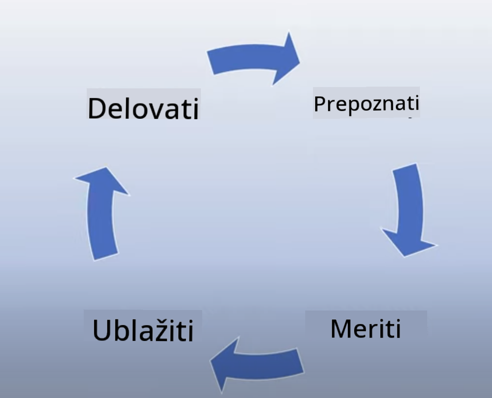

<!--
CO_OP_TRANSLATOR_METADATA:
{
  "original_hash": "4d57fad773cbeb69c5dd62e65c34200d",
  "translation_date": "2025-10-18T01:40:52+00:00",
  "source_file": "03-using-generative-ai-responsibly/README.md",
  "language_code": "sl"
}
-->
# Uporaba generativne umetne inteligence odgovorno

> _Kliknite zgornjo sliko za ogled videa te lekcije_

Generativna umetna inteligenca je fascinantna, vendar je pomembno razmisliti, kako jo uporabljati odgovorno. Pomembno je upo코tevati, kako zagotoviti, da so rezultati pravi캜ni, ne코kodljivi in 코e ve캜. Ta poglavje vam 쬰li ponuditi kontekst, kaj upo코tevati in kako sprejeti aktivne korake za izbolj코anje uporabe umetne inteligence.

## Uvod

Ta lekcija bo obravnavala:

- Zakaj bi morali dati prednost odgovorni umetni inteligenci pri gradnji aplikacij z generativno umetno inteligenco.
- Temeljna na캜ela odgovorne umetne inteligence in kako se nana코ajo na generativno umetno inteligenco.
- Kako ta na캜ela odgovorne umetne inteligence uresni캜iti s strategijo in orodji.

## Cilji u캜enja

Po zaklju캜ku te lekcije boste vedeli:

- Pomen odgovorne umetne inteligence pri gradnji aplikacij z generativno umetno inteligenco.
- Kdaj razmi코ljati o temeljnih na캜elih odgovorne umetne inteligence in jih uporabiti pri gradnji aplikacij z generativno umetno inteligenco.
- Katera orodja in strategije so na voljo za uresni캜itev koncepta odgovorne umetne inteligence.

## Na캜ela odgovorne umetne inteligence

Navdu코enje nad generativno umetno inteligenco je ve캜je kot kdajkoli prej. To navdu코enje je pritegnilo veliko novih razvijalcev, pozornosti in financiranja na tem podro캜ju. 캛eprav je to zelo pozitivno za vse, ki 쬰lijo graditi izdelke in podjetja z generativno umetno inteligenco, je prav tako pomembno, da ravnamo odgovorno.

V tem te캜aju se osredoto캜amo na gradnjo na코ega startupa in na코ega izobra쬰valnega produkta z umetno inteligenco. Uporabili bomo na캜ela odgovorne umetne inteligence: pravi캜nost, vklju캜enost, zanesljivost/varnost, varnost in zasebnost, transparentnost ter odgovornost. S temi na캜eli bomo raziskali, kako se nana코ajo na na코o uporabo generativne umetne inteligence v na코ih izdelkih.

## Zakaj bi morali dati prednost odgovorni umetni inteligenci

Pri gradnji izdelka je 캜love코ko usmerjen pristop, ki upo코teva najbolj코e interese uporabnika, klju캜nega pomena za doseganje najbolj코ih rezultatov.

Posebnost generativne umetne inteligence je njena sposobnost ustvarjanja koristnih odgovorov, informacij, nasvetov in vsebin za uporabnike. To je mogo캜e dose캜i brez 코tevilnih ro캜nih korakov, kar lahko vodi do zelo impresivnih rezultatov. Brez ustreznega na캜rtovanja in strategij pa lahko na 쬬lost povzro캜i tudi 코kodljive rezultate za va코e uporabnike, va코 izdelek in dru쬭o kot celoto.

Poglejmo nekaj (ne vseh) potencialno 코kodljivih rezultatov:

### Halucinacije

Halucinacije so izraz, ki opisuje, ko LLM ustvari vsebino, ki je bodisi popolnoma nesmiselna bodisi nekaj, kar vemo, da je dejansko napa캜no glede na druge vire informacij.

Recimo, da zgradimo funkcijo za na코 startup, ki omogo캜a 코tudentom, da modelu postavljajo zgodovinska vpra코anja. 맚udent postavi vpra코anje: `Kdo je bil edini pre쬴veli Titanika?`

Model ustvari odgovor, kot je spodnji:

> _(Vir: [Flying bisons](https://flyingbisons.com?WT.mc_id=academic-105485-koreyst))_

To je zelo samozavesten in podroben odgovor. Na 쬬lost je napa캜en. Tudi z minimalno koli캜ino raziskav bi ugotovili, da je bilo ve캜 pre쬴velih v katastrofi Titanika. Za 코tudenta, ki 코ele za캜enja raziskovati to temo, je tak odgovor lahko dovolj prepri캜ljiv, da ga ne bo podvomil in ga bo obravnaval kot dejstvo. Posledice tega lahko privedejo do nezanesljivosti sistema umetne inteligence in negativno vplivajo na ugled na코ega startupa.

Z vsako iteracijo dolo캜enega LLM smo opazili izbolj코ave zmogljivosti pri zmanj코evanju halucinacij. Kljub tem izbolj코avam moramo kot graditelji aplikacij in uporabniki ostati pozorni na te omejitve.

### 맒odljiva vsebina

V prej코njem razdelku smo obravnavali primere, ko LLM ustvari napa캜ne ali nesmiselne odgovore. Drugo tveganje, na katerega moramo biti pozorni, je, ko model odgovori s 코kodljivo vsebino.

맒odljiva vsebina je lahko opredeljena kot:

- Podajanje navodil ali spodbujanje samopo코kodovanja ali 코kodovanja dolo캜enim skupinam.
- Sovra쬹a ali poni쬿jo캜a vsebina.
- Usmerjanje na캜rtovanja kakr코nih koli napadov ali nasilnih dejanj.
- Podajanje navodil, kako najti nezakonito vsebino ali storiti nezakonita dejanja.
- Prikazovanje spolno eksplicitne vsebine.

Za na코 startup 쬰limo zagotoviti, da imamo na voljo prava orodja in strategije za prepre캜evanje prikaza tovrstne vsebine 코tudentom.

### Pomanjkanje pravi캜nosti

Pravi캜nost je opredeljena kot "zagotavljanje, da je sistem umetne inteligence brez pristranskosti in diskriminacije ter da obravnava vse pravi캜no in enakopravno." V svetu generativne umetne inteligence 쬰limo zagotoviti, da izklju캜ujo캜i pogledi na marginalizirane skupine niso oja캜ani z izhodom modela.

Tak코ni izhodi ne le 코kodujejo gradnji pozitivnih izku코enj z izdelki za na코e uporabnike, temve캜 povzro캜ajo tudi dodatno dru쬭eno 코kodo. Kot graditelji aplikacij bi morali vedno imeti v mislih 코iroko in raznoliko bazo uporabnikov pri gradnji re코itev z generativno umetno inteligenco.

## Kako uporabljati generativno umetno inteligenco odgovorno

Zdaj, ko smo opredelili pomen odgovorne generativne umetne inteligence, si poglejmo 4 korake, ki jih lahko naredimo, da odgovorno gradimo na코e re코itve z umetno inteligenco:

### Merjenje potencialnih 코kod

Pri testiranju programske opreme testiramo pri캜akovane akcije uporabnika v aplikaciji. Podobno je testiranje raznolikega nabora pozivov, ki jih bodo uporabniki najverjetneje uporabili, dober na캜in za merjenje potencialne 코kode.

Ker na코 startup gradi izobra쬰valni produkt, bi bilo dobro pripraviti seznam pozivov, povezanih z izobra쬰vanjem. To bi lahko vklju캜evalo dolo캜ene predmete, zgodovinska dejstva in pozive o 코tudentskem 쬴vljenju.

### Zmanj코anje potencialnih 코kod

Zdaj je 캜as, da najdemo na캜ine, kako prepre캜iti ali omejiti potencialno 코kodo, ki jo povzro캜a model in njegovi odgovori. To lahko obravnavamo na 4 razli캜nih ravneh:

- **Model**. Izbira pravega modela za pravi primer uporabe. Ve캜ji in bolj zapleteni modeli, kot je GPT-4, lahko predstavljajo ve캜je tveganje za 코kodljivo vsebino, 캜e se uporabljajo za manj코e in bolj specifi캜ne primere uporabe. Uporaba va코ih podatkov za prilagoditev modela prav tako zmanj코uje tveganje za 코kodljivo vsebino.

- **Varnostni sistem**. Varnostni sistem je niz orodij in konfiguracij na platformi, ki slu쬴 modelu in pomaga zmanj코ati 코kodo. Primer tega je sistem za filtriranje vsebine na storitvi Azure OpenAI. Sistemi bi morali zaznati tudi napade na varnost in ne쬰leno dejavnost, kot so zahteve botov.

- **Metaprompt**. Metaprompti in utemeljitve so na캜ini, kako lahko usmerimo ali omejimo model na podlagi dolo캜enih vedenj in informacij. To bi lahko vklju캜evalo uporabo sistemskih vnosov za dolo캜anje dolo캜enih omejitev modela. Poleg tega pa zagotavljanje izhodov, ki so bolj relevantni za obseg ali podro캜je sistema.

Lahko se uporablja tudi tehnike, kot je Retrieval Augmented Generation (RAG), da model pridobi informacije samo iz izbranih zaupanja vrednih virov. Kasneje v tem te캜aju je lekcija o [gradnji iskalnih aplikacij](../08-building-search-applications/README.md?WT.mc_id=academic-105485-koreyst).

- **Uporabni코ka izku코nja**. Zadnja plast je tam, kjer uporabnik neposredno komunicira z modelom prek vmesnika na코e aplikacije. Na ta na캜in lahko oblikujemo UI/UX, da omejimo uporabnika glede vrst vnosov, ki jih lahko po코lje modelu, kot tudi glede besedila ali slik, prikazanih uporabniku. Pri uvajanju aplikacije z umetno inteligenco moramo biti tudi transparentni glede tega, kaj na코a aplikacija z generativno umetno inteligenco zmore in 캜esa ne.

Imamo celotno lekcijo, posve캜eno [Oblikovanju UX za aplikacije z umetno inteligenco](../12-designing-ux-for-ai-applications/README.md?WT.mc_id=academic-105485-koreyst).

- **Ocenjevanje modela**. Delo z LLM-ji je lahko zahtevno, ker nimamo vedno nadzora nad podatki, na katerih je bil model usposobljen. Kljub temu bi morali vedno oceniti delovanje in izhode modela. 만 vedno je pomembno meriti natan캜nost modela, podobnost, utemeljenost in relevantnost izhoda. To pomaga zagotoviti transparentnost in zaupanje dele쬹ikom in uporabnikom.

### Upravljanje odgovorne re코itve z generativno umetno inteligenco

Zadnja faza je vzpostavitev operativne prakse okoli va코ih aplikacij z umetno inteligenco. To vklju캜uje sodelovanje z drugimi deli na코ega startupa, kot sta pravni oddelek in varnost, da zagotovimo skladnost z vsemi regulativnimi politikami. Pred lansiranjem 쬰limo tudi pripraviti na캜rte za dostavo, obravnavo incidentov in povratne ukrepe, da prepre캜imo kakr코no koli 코kodo na코im uporabnikom.

## Orodja

캛eprav se delo pri razvoju re코itev z odgovorno umetno inteligenco morda zdi obse쬹o, je to delo vredno truda. Z rastjo podro캜ja generativne umetne inteligence se bodo razvijala tudi orodja, ki bodo razvijalcem pomagala u캜inkovito vklju캜iti odgovornost v njihove delovne procese. Na primer, [Azure AI Content Safety](https://learn.microsoft.com/azure/ai-services/content-safety/overview?WT.mc_id=academic-105485-koreyst) lahko pomaga zaznati 코kodljivo vsebino in slike prek API zahteve.

## Preverjanje znanja

Na kaj morate biti pozorni, da zagotovite odgovorno uporabo umetne inteligence?

1. Da je odgovor pravilen.
1. 맒odljiva uporaba, da umetna inteligenca ni uporabljena za kriminalne namene.
1. Zagotavljanje, da je umetna inteligenca brez pristranskosti in diskriminacije.

A: 2 in 3 sta pravilna. Odgovorna umetna inteligenca vam pomaga razmisliti, kako zmanj코ati 코kodljive u캜inke in pristranskosti ter 코e ve캜.

## 游 Izziv

Preberite ve캜 o [Azure AI Content Safety](https://learn.microsoft.com/azure/ai-services/content-safety/overview?WT.mc_id=academic-105485-koreyst) in preverite, kaj lahko uporabite za svoje potrebe.

## Odli캜no delo, nadaljujte z u캜enjem

Po zaklju캜ku te lekcije si oglejte na코o [zbirko u캜enja o generativni umetni inteligenci](https://aka.ms/genai-collection?WT.mc_id=academic-105485-koreyst), da 코e naprej nadgrajujete svoje znanje o generativni umetni inteligenci!

Pojdite na lekcijo 4, kjer bomo obravnavali [Osnove in쬰niringa pozivov](../04-prompt-engineering-fundamentals/README.md?WT.mc_id=academic-105485-koreyst)!

---

**Omejitev odgovornosti**:  
Ta dokument je bil preveden z uporabo storitve za prevajanje z umetno inteligenco [Co-op Translator](https://github.com/Azure/co-op-translator). 캛eprav si prizadevamo za natan캜nost, vas prosimo, da upo코tevate, da lahko avtomatski prevodi vsebujejo napake ali neto캜nosti. Izvirni dokument v njegovem maternem jeziku je treba obravnavati kot avtoritativni vir. Za klju캜ne informacije priporo캜amo profesionalni 캜love코ki prevod. Ne prevzemamo odgovornosti za morebitne nesporazume ali napa캜ne razlage, ki bi nastale zaradi uporabe tega prevoda.