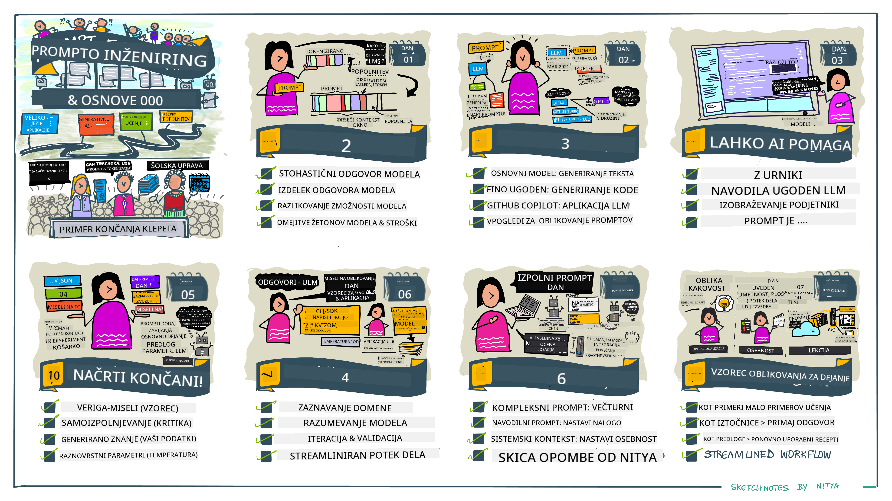
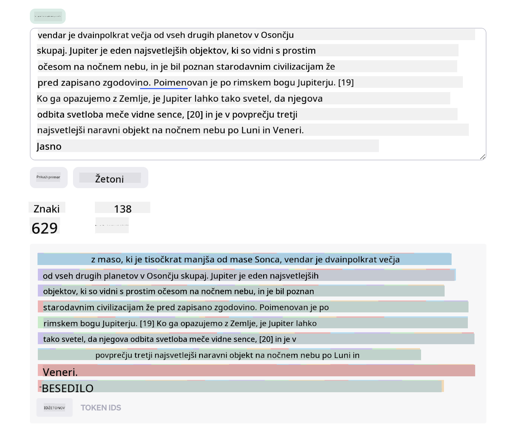
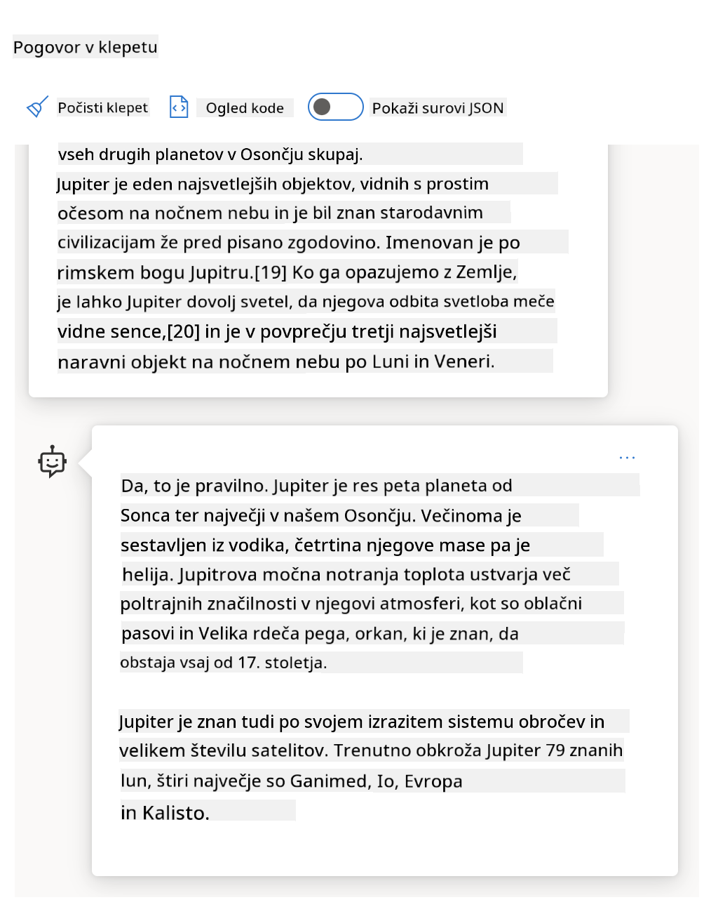
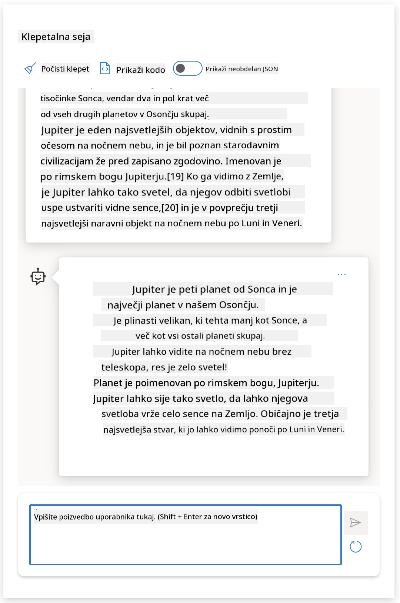
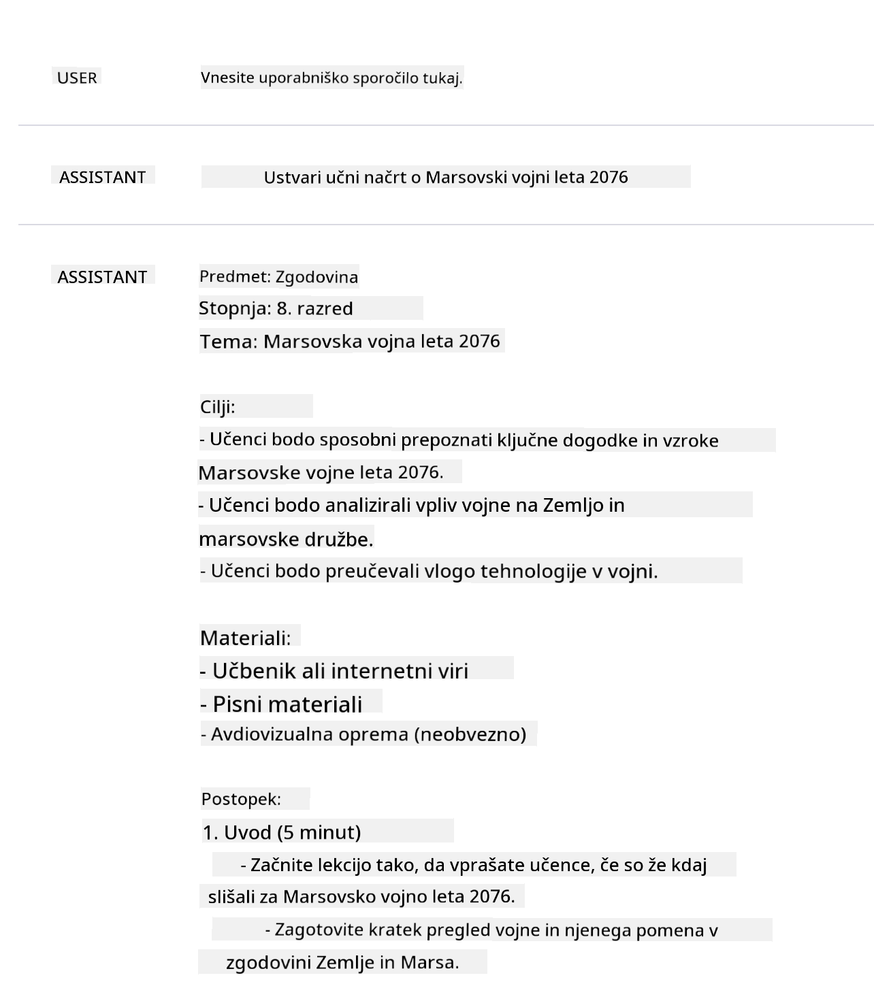
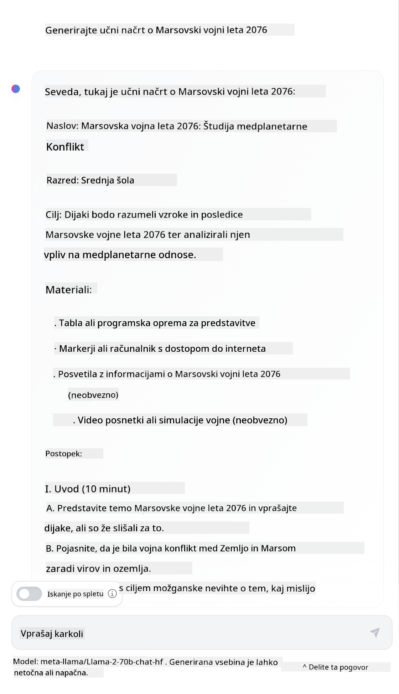

<!--
CO_OP_TRANSLATOR_METADATA:
{
  "original_hash": "dcbaaae026cb50fee071e690685b5843",
  "translation_date": "2025-08-26T19:50:42+00:00",
  "source_file": "04-prompt-engineering-fundamentals/README.md",
  "language_code": "sl"
}
-->
# Osnove inženiringa pozivov

[](https://aka.ms/gen-ai-lesson4-gh?WT.mc_id=academic-105485-koreyst)

## Uvod
Ta modul pokriva ključne koncepte in tehnike za ustvarjanje učinkovitih pozivov v generativnih AI modelih. Pomembno je, kako napišete svoj poziv za LLM. Skrbno oblikovan poziv lahko prinese bolj kakovosten odgovor. Kaj pa pravzaprav pomenita izraza _poziv_ in _inženiring pozivov_? In kako izboljšam _vhodni poziv_, ki ga pošljem LLM-ju? Na ta vprašanja bomo poskušali odgovoriti v tem in naslednjem poglavju.

_Generativna umetna inteligenca_ zna ustvarjati novo vsebino (npr. besedilo, slike, zvok, kodo itd.) kot odziv na zahteve uporabnika. To doseže z uporabo _velikih jezikovnih modelov_, kot je serija GPT ("Generative Pre-trained Transformer") podjetja OpenAI, ki so trenirani za uporabo naravnega jezika in kode.

Uporabniki lahko zdaj komunicirajo s temi modeli na znan način, kot je klepet, brez tehničnega znanja ali izobraževanja. Modeli temeljijo na _pozivih_ – uporabnik pošlje besedilni vhod (poziv) in prejme AI odgovor (dokončanje). Nato lahko "klepetajo z AI" večkrat, v več korakih, in izpopolnjujejo poziv, dokler odgovor ne ustreza njihovim pričakovanjem.

"Pozivi" so tako postali glavni _programski vmesnik_ za generativne AI aplikacije, saj modelom povedo, kaj naj naredijo, in vplivajo na kakovost odgovorov. "Inženiring pozivov" je hitro rastoče področje, ki se osredotoča na _oblikovanje in optimizacijo_ pozivov za dosledne in kakovostne odgovore v večjem obsegu.

## Cilji učenja

V tej lekciji bomo spoznali, kaj je inženiring pozivov, zakaj je pomemben in kako lahko oblikujemo bolj učinkovite pozive za določen model in cilj aplikacije. Spoznali bomo osnovne koncepte in najboljše prakse za inženiring pozivov – ter se seznanili z interaktivnim okoljem "sandbox" v Jupyter Notebooku, kjer lahko te koncepte preizkusimo na resničnih primerih.

Do konca te lekcije bomo znali:

1. Razložiti, kaj je inženiring pozivov in zakaj je pomemben.
2. Opisati sestavne dele poziva in njihovo uporabo.
3. Spoznati najboljše prakse in tehnike za inženiring pozivov.
4. Uporabiti naučene tehnike na resničnih primerih z uporabo OpenAI vmesnika.

## Ključni pojmi

Inženiring pozivov: Praksa oblikovanja in izpopolnjevanja vhodov, ki usmerjajo AI modele k želenim izhodom.
Tokenizacija: Proces pretvorbe besedila v manjše enote, imenovane tokeni, ki jih model lahko razume in obdela.
LLM-ji, uglašeni z navodili: Veliki jezikovni modeli (LLM), ki so bili dodatno prilagojeni s posebnimi navodili za bolj natančne in relevantne odgovore.

## Učni sandbox

Inženiring pozivov je trenutno bolj umetnost kot znanost. Najboljši način za izboljšanje intuicije je _več vadbe_ in pristop poskusov in napak, ki združuje strokovno znanje iz aplikacijskega področja s priporočenimi tehnikami in optimizacijami, prilagojenimi modelu.

Jupyter Notebook, ki spremlja to lekcijo, ponuja okolje _sandbox_, kjer lahko sproti preizkušate, kar se naučite – med lekcijo ali kot del izziva s kodo na koncu. Za izvajanje vaj boste potrebovali:

1. **Azure OpenAI API ključ** – končna točka storitve za nameščen LLM.
2. **Python okolje** – v katerem lahko zaženete Notebook.
3. **Lokalne okoljske spremenljivke** – _izvedite [SETUP](./../00-course-setup/02-setup-local.md?WT.mc_id=academic-105485-koreyst) korake zdaj, da se pripravite_.

Notebook vsebuje _začetne_ vaje – vendar ste vabljeni, da dodate svoje _Markdown_ (opisne) in _Code_ (pozivne zahteve) razdelke, da preizkusite več primerov ali idej – in si tako zgradite občutek za oblikovanje pozivov.

## Ilustriran vodič

Želite najprej dobiti splošno sliko, kaj ta lekcija pokriva? Oglejte si ta ilustriran vodič, ki vam predstavi glavne teme in ključne poudarke, o katerih razmislite pri vsaki. Načrt lekcije vas vodi od razumevanja osnovnih konceptov in izzivov do njihovega reševanja z ustreznimi tehnikami in najboljšimi praksami inženiringa pozivov. Upoštevajte, da se razdelek "Napredne tehnike" v tem vodiču nanaša na vsebino, ki jo obravnavamo v _naslednjem_ poglavju tega tečaja.



## Naš startup

Poglejmo, kako je _ta tema_ povezana z našo startup misijo [prinašanja AI inovacij v izobraževanje](https://educationblog.microsoft.com/2023/06/collaborating-to-bring-ai-innovation-to-education?WT.mc_id=academic-105485-koreyst). Želimo graditi AI aplikacije za _personalizirano učenje_ – zato razmislimo, kako bi različni uporabniki naše aplikacije "oblikovali" pozive:

- **Administratorji** bi lahko AI prosili, naj _analizira podatke o učnem načrtu in poišče vrzeli v pokritosti_. AI lahko povzame rezultate ali jih prikaže s kodo.
- **Učitelji** bi lahko AI prosili, naj _ustvari učni načrt za določeno ciljno skupino in temo_. AI lahko pripravi personaliziran načrt v želeni obliki.
- **Študenti** bi lahko AI prosili, naj jih _poučuje pri zahtevnem predmetu_. AI lahko študente vodi z lekcijami, namigi in primeri, prilagojenimi njihovi ravni.

To je le začetek. Oglejte si [Prompts For Education](https://github.com/microsoft/prompts-for-edu/tree/main?WT.mc_id=academic-105485-koreyst) – odprtokodno knjižnico pozivov, ki so jo pripravili izobraževalni strokovnjaki – za širši vpogled v možnosti! _Preizkusite nekaj teh pozivov v sandboxu ali v OpenAI Playgroundu in poglejte, kaj se zgodi!_

<!--
PREDLOGA LEKCIJE:
Ta enota naj pokriva osnovni koncept #1.
Poudarite koncept s primeri in referencami.

KONCEPT #1:
Inženiring pozivov.
Definirajte ga in razložite, zakaj je potreben.
-->

## Kaj je inženiring pozivov?

Lekcijo smo začeli z definicijo **inženiringa pozivov** kot procesa _oblikovanja in optimizacije_ besedilnih vhodov (pozivov) za dosledne in kakovostne odgovore (dokončanja) glede na cilj aplikacije in model. To si lahko predstavljamo kot dvostopenjski proces:

- _oblikovanje_ začetnega poziva za določen model in cilj
- _izpopolnjevanje_ poziva v več korakih za izboljšanje kakovosti odgovora

Gre za proces poskusov in napak, ki zahteva intuicijo in trud uporabnika za optimalne rezultate. Zakaj je to pomembno? Da odgovorimo na to, moramo najprej razumeti tri koncepte:

- _Tokenizacija_ = kako model "vidi" poziv
- _Osnovni LLM-ji_ = kako temeljni model "obdeluje" poziv
- _LLM-ji, uglašeni z navodili_ = kako model zdaj vidi "naloge"

### Tokenizacija

LLM pozive vidi kot _zaporedje tokenov_, pri čemer lahko različni modeli (ali različice modela) isti poziv tokenizirajo na različne načine. Ker so LLM-ji trenirani na tokenih (ne na surovem besedilu), način tokenizacije poziva neposredno vpliva na kakovost ustvarjenega odgovora.

Za boljši občutek, kako deluje tokenizacija, preizkusite orodja, kot je [OpenAI Tokenizer](https://platform.openai.com/tokenizer?WT.mc_id=academic-105485-koreyst) spodaj. Kopirajte svoj poziv in opazujte, kako se pretvori v tokene, pri tem pa bodite pozorni na obravnavo presledkov in ločil. Upoštevajte, da je ta primer za starejši LLM (GPT-3) – uporaba novejšega modela lahko da drugačen rezultat.



### Koncept: Temeljni modeli

Ko je poziv tokeniziran, je glavna naloga ["osnovnega LLM-ja"](https://blog.gopenai.com/an-introduction-to-base-and-instruction-tuned-large-language-models-8de102c785a6?WT.mc_id=academic-105485-koreyst) (ali temeljnega modela) napovedati naslednji token v zaporedju. Ker so LLM-ji trenirani na ogromnih besedilnih podatkovnih zbirkah, dobro poznajo statistične povezave med tokeni in lahko to napoved naredijo z določeno zanesljivostjo. Upoštevajte, da ne razumejo _pomena_ besed v pozivu ali tokenu; vidijo le vzorec, ki ga lahko "dopolnijo" z naslednjo napovedjo. Lahko nadaljujejo napovedovanje zaporedja, dokler jih ne ustavi uporabnik ali vnaprej določeni pogoj.

Želite videti, kako deluje dokončanje na podlagi poziva? Vnesite zgornji poziv v Azure OpenAI Studio [_Chat Playground_](https://oai.azure.com/playground?WT.mc_id=academic-105485-koreyst) z privzetimi nastavitvami. Sistem obravnava pozive kot zahteve za informacije – zato boste videli dokončanje, ki ustreza temu kontekstu.

Kaj pa, če želi uporabnik videti nekaj specifičnega, kar ustreza določenim kriterijem ali cilju naloge? Tu nastopijo LLM-ji, uglašeni z navodili.



### Koncept: LLM-ji, uglašeni z navodili

[LLM, uglašen z navodili](https://blog.gopenai.com/an-introduction-to-base-and-instruction-tuned-large-language-models-8de102c785a6?WT.mc_id=academic-105485-koreyst) začne s temeljnim modelom in ga dodatno prilagodi s primeri ali pari vhod/izhod (npr. večkorakna "sporočila"), ki vsebujejo jasna navodila – in AI se v odgovoru trudi slediti tem navodilom.

Uporablja tehnike, kot je učenje z okrepitvijo in povratnimi informacijami ljudi (RLHF), ki model naučijo _slediti navodilom_ in _se učiti iz povratnih informacij_, da ustvari odgovore, ki so bolj uporabni v praksi in bolj relevantni za cilje uporabnika.

Preizkusimo – ponovno uporabite zgornji poziv, tokrat pa spremenite _sistemsko sporočilo_ in dodajte naslednja navodila kot kontekst:

> _Povzemi vsebino, ki ti jo posredujem, za drugošolca. Rezultat naj bo en odstavek s 3–5 točkami._

Opazite, kako je rezultat zdaj prilagojen želenemu cilju in obliki? Učitelj lahko ta odgovor neposredno uporabi v svojih prosojnicah za razred.



## Zakaj potrebujemo inženiring pozivov?

Zdaj, ko vemo, kako LLM-ji obdelujejo pozive, poglejmo, _zakaj_ potrebujemo inženiring pozivov. Odgovor je v tem, da imajo trenutni LLM-ji več izzivov, zaradi katerih je _zanesljivo in dosledno dokončanje_ težje doseči brez truda pri oblikovanju in optimizaciji pozivov. Na primer:

1. **Odgovori modela so stohastični.** _Isti poziv_ bo verjetno dal različne odgovore pri različnih modelih ali različicah modela. Lahko pa se razlikuje tudi pri _istem modelu_ ob različnih časih. _Tehnike inženiringa pozivov nam pomagajo zmanjšati te razlike z boljšimi usmeritvami._

1. **Modeli lahko izmišljajo odgovore.** Modeli so predhodno trenirani na _velikih, a končnih_ podatkovnih zbirkah, kar pomeni, da ne poznajo konceptov zunaj tega obsega. Zato lahko ustvarijo dokončanja, ki so netočna, izmišljena ali celo v nasprotju z znanimi dejstvi. _Tehnike inženiringa pozivov pomagajo uporabnikom prepoznati in zmanjšati take izmišljotine, npr. z zahtevo po citatih ali razlagi._

1. **Zmožnosti modelov se razlikujejo.** Novejši modeli ali generacije imajo več zmožnosti, a prinašajo tudi posebnosti in kompromise glede stroškov in kompleksnosti. _Inženiring pozivov nam pomaga razviti najboljše prakse in delovne tokove, ki poenostavijo razlike in se prilagodijo zahtevam posameznega modela na učinkovit in prilagodljiv način._

Poglejmo to v praksi v OpenAI ali Azure OpenAI Playgroundu:

- Uporabite isti poziv z različnimi LLM implementacijami (npr. OpenAI, Azure OpenAI, Hugging Face) – ste opazili razlike?
- Uporabite isti poziv večkrat z _isto_ LLM implementacijo (npr. Azure OpenAI playground) – kako so se odgovori razlikovali?

### Primer izmišljotin

V tem tečaju uporabljamo izraz **"izmišljotina"** za pojav, ko LLM-ji včasih ustvarijo dejansko napačne informacije zaradi omejitev v učenju ali drugih razlogov. Morda ste to zasledili tudi kot _"halucinacije"_ v člankih ali raziskavah. Vendar močno priporočamo uporabo izraza _"izmišljotina"_, da ne bi po pomoti pripisovali človeških lastnosti strojno ustvarjenim izidom. To je skladno tudi s [smernicami za odgovorno AI](https://www.microsoft.com/ai/responsible-ai?WT.mc_id=academic-105485-koreyst) z vidika terminologije, saj odstranjuje izraze, ki so lahko v nekaterih kontekstih neprimerni ali izključujoči.

Želite videti, kako delujejo izmišljotine? Pomislite na poziv, ki AI-ju naroči, naj ustvari vsebino za neobstoječo temo (da je zagotovo ni v učni podatkovni zbirki). Na primer – jaz sem preizkusil ta poziv:
# Učni načrt: Marsovska vojna leta 2076

## Cilji učne ure

- Razumeti vzroke in posledice Marsovske vojne leta 2076
- Raziskati ključne dogodke in pomembne osebnosti, povezane z vojno
- Razviti kritično mišljenje o vplivu vojne na človeštvo in kolonizacijo Marsa

## Uvod (10 minut)

- Kratek pregled kolonizacije Marsa pred letom 2076
- Predstavitev glavnih akterjev: Zemlja, Marsovske kolonije, neodvisne frakcije
- Razprava o napetostih, ki so vodile do konflikta

## Glavni del (30 minut)

### 1. Vzroki za vojno

- Tekmovanje za vire: voda, kisik, energija
- Politične razlike med Zemljo in Marsom
- Vzpon neodvisnih gibanj na Marsu

### 2. Potek vojne

- Prvi spopadi in pomembne bitke
- Vloga napredne tehnologije: roboti, umetna inteligenca, vesoljska plovila
- Ključne osebnosti: poveljniki, diplomati, znanstveniki

### 3. Posledice vojne

- Spremembe v upravljanju Marsa
- Vpliv na odnose med Zemljo in Marsom
- Dolgoročne posledice za kolonizacijo drugih planetov

## Aktivnosti (15 minut)

- Skupinska razprava: Ali bi se vojni lahko izognili? Kakšne alternative so obstajale?
- Analiza primarnih virov: izseki iz dnevnikov, poročil in novic iz leta 2076
- Ustvarjanje časovnice ključnih dogodkov

## Zaključek (5 minut)

- Povzetek glavnih točk učne ure
- Razmislek o pomenu Marsovske vojne za prihodnost človeštva
- Domača naloga: Napiši esej o tem, kako bi se zgodovina lahko odvila drugače, če bi bila sprejeta drugačna odločitev

## Dodatni viri

- Knjige in članki o Marsovski vojni
- Interaktivni zemljevidi bitk
- Dokumentarni filmi in intervjuji z udeleženci
Spletno iskanje mi je pokazalo, da obstajajo izmišljeni opisi (npr. televizijske serije ali knjige) o vojnah na Marsu – vendar nobena iz leta 2076. Zdrava pamet nam tudi pove, da je leto 2076 _v prihodnosti_ in zato ne more biti povezano z resničnim dogodkom.

Kaj se torej zgodi, če ta poziv pošljemo različnim ponudnikom LLM?

> **Odgovor 1**: OpenAI Playground (GPT-35)



> **Odgovor 2**: Azure OpenAI Playground (GPT-35)


> **Odgovor 3**: Hugging Face Chat Playground (LLama-2)



Kot pričakovano vsak model (ali različica modela) ustvari nekoliko drugačen odgovor zaradi stohastičnega vedenja in razlik v zmogljivostih modela. Na primer, en model cilja na učence 8. razreda, drugi pa predvideva srednješolca. Vendar pa so vsi trije modeli ustvarili odgovore, ki bi lahko nevednega uporabnika prepričali, da je dogodek resničen.

Tehnike inženiringa pozivov, kot sta _metaprompting_ in _nastavitev temperature_, lahko do neke mere zmanjšajo izmišljotine modela. Nove _arhitekture_ inženiringa pozivov prav tako vključujejo nova orodja in tehnike neposredno v tok poziva, da omilijo ali zmanjšajo nekatere od teh učinkov.

## Študija primera: GitHub Copilot

To poglavje zaključimo s pogledom na to, kako se inženiring pozivov uporablja v resničnih rešitvah, in sicer s študijo primera: [GitHub Copilot](https://github.com/features/copilot?WT.mc_id=academic-105485-koreyst).

GitHub Copilot je vaš "AI par programer" – besedilne pozive pretvori v dopolnitve kode in je integriran v vaše razvojno okolje (npr. Visual Studio Code) za nemoteno uporabniško izkušnjo. Kot je opisano v spodnjih blogih, je bila prva različica osnovana na modelu OpenAI Codex – inženirji pa so hitro ugotovili potrebo po dodatnem prilagajanju modela in razvoju boljših tehnik inženiringa pozivov za izboljšanje kakovosti kode. Julija so [predstavili izboljšan AI model, ki presega Codex](https://github.blog/2023-07-28-smarter-more-efficient-coding-github-copilot-goes-beyond-codex-with-improved-ai-model/?WT.mc_id=academic-105485-koreyst) in omogoča še hitrejše predloge.

Objave preberite po vrsti, da boste lahko sledili njihovi poti učenja.

- **Maj 2023** | [GitHub Copilot je vse boljši pri razumevanju vaše kode](https://github.blog/2023-05-17-how-github-copilot-is-getting-better-at-understanding-your-code/?WT.mc_id=academic-105485-koreyst)
- **Maj 2023** | [Znotraj GitHuba: Delo z LLM-ji za GitHub Copilot](https://github.blog/2023-05-17-inside-github-working-with-the-llms-behind-github-copilot/?WT.mc_id=academic-105485-koreyst).
- **Junij 2023** | [Kako pisati boljše pozive za GitHub Copilot](https://github.blog/2023-06-20-how-to-write-better-prompts-for-github-copilot/?WT.mc_id=academic-105485-koreyst).
- **Julij 2023** | [.. GitHub Copilot presega Codex z izboljšanim AI modelom](https://github.blog/2023-07-28-smarter-more-efficient-coding-github-copilot-goes-beyond-codex-with-improved-ai-model/?WT.mc_id=academic-105485-koreyst)
- **Julij 2023** | [Razvijalčev vodič za inženiring pozivov in LLM-je](https://github.blog/2023-07-17-prompt-engineering-guide-generative-ai-llms/?WT.mc_id=academic-105485-koreyst)
- **September 2023** | [Kako zgraditi podjetniško LLM aplikacijo: Lekcije iz GitHub Copilot](https://github.blog/2023-09-06-how-to-build-an-enterprise-llm-application-lessons-from-github-copilot/?WT.mc_id=academic-105485-koreyst)

Lahko pa prebrskate tudi njihov [inženirski blog](https://github.blog/category/engineering/?WT.mc_id=academic-105485-koreyst) za več objav, kot je [ta](https://github.blog/2023-09-27-how-i-used-github-copilot-chat-to-build-a-reactjs-gallery-prototype/?WT.mc_id=academic-105485-koreyst), ki prikazuje, kako se ti modeli in tehnike _uporabljajo_ za razvoj resničnih aplikacij.

---

## Sestavljanje pozivov

Videli smo, zakaj je inženiring pozivov pomemben – zdaj pa poglejmo, kako so pozivi _sestavljeni_, da lahko ocenimo različne tehnike za učinkovitejše oblikovanje pozivov.

### Osnovni poziv

Začnimo z osnovnim pozivom: besedilni vnos, poslan modelu brez dodatnega konteksta. Tukaj je primer – ko pošljemo prvih nekaj besed ameriške državne himne OpenAI [Completion API](https://platform.openai.com/docs/api-reference/completions?WT.mc_id=academic-105485-koreyst), ta takoj _dopolni_ odgovor z naslednjimi vrsticami, kar ponazarja osnovno napovedno vedenje.

| Poziv (vnos)         | Dopolnitev (izhod)                                                                                                                        |
| :------------------- | :---------------------------------------------------------------------------------------------------------------------------------------- |
| Oh say can you see   | Zdi se, da ste začeli z besedilom "The Star-Spangled Banner", ameriške državne himne. Celotno besedilo je ...                            |

### Kompleksni poziv

Zdaj osnovnemu pozivu dodajmo še kontekst in navodila. [Chat Completion API](https://learn.microsoft.com/azure/ai-services/openai/how-to/chatgpt?WT.mc_id=academic-105485-koreyst) nam omogoča sestavo kompleksnega poziva kot zbirko _sporočil_ z:

- Pari vhod/izhod, ki odražajo _uporabniški_ vnos in _asistentov_ odgovor.
- Sistemskim sporočilom, ki določa kontekst za vedenje ali osebnost asistenta.

Zahteva je zdaj v spodnji obliki, kjer _tokenizacija_ učinkovito zajame pomembne informacije iz konteksta in pogovora. Sprememba sistemskega konteksta lahko zdaj enako vpliva na kakovost dopolnitev kot uporabniški vnosi.

```python
response = openai.chat.completions.create(
    model="gpt-3.5-turbo",
    messages=[
        {"role": "system", "content": "You are a helpful assistant."},
        {"role": "user", "content": "Who won the world series in 2020?"},
        {"role": "assistant", "content": "The Los Angeles Dodgers won the World Series in 2020."},
        {"role": "user", "content": "Where was it played?"}
    ]
)
```

### Navodilni poziv

V zgornjih primerih je bil uporabniški poziv preprosto besedilno vprašanje, ki ga lahko razumemo kot zahtevo po informacijah. Z _navodilnimi_ pozivi lahko to besedilo uporabimo za natančnejšo opredelitev naloge in s tem AI-ju damo boljša navodila. Tukaj je primer:

| Poziv (vnos)                                                                                                                                                                                                                         | Dopolnitev (izhod)                                                                                                        | Tip navodila        |
| :----------------------------------------------------------------------------------------------------------------------------------------------------------------------------------------------------------------------------------- | :------------------------------------------------------------------------------------------------------------------------- | :------------------ |
| Napiši opis državljanske vojne                                                                                                                                                                                                      | _vrne preprost odstavek_                                                                                                  | Preprosto           |
| Napiši opis državljanske vojne. Navedi ključne datume in dogodke ter opiši njihov pomen                                                                                                       | _vrne odstavek, nato seznam ključnih datumov z opisi_                                                                     | Kompleksno          |
| Napiši opis državljanske vojne v enem odstavku. Navedi 3 alineje s ključnimi datumi in njihovim pomenom. Dodaj še 3 alineje s ključnimi zgodovinskimi osebami in njihovimi prispevki. Rezultat vrni kot JSON datoteko                  | _vrne obsežnejše podrobnosti v besedilnem polju, formatirane kot JSON, ki ga lahko kopirate v datoteko in po potrebi preverite_ | Kompleksno. Formatirano. |

## Primarna vsebina

V zgornjih primerih je bil poziv še vedno precej odprt, kar je LLM-ju omogočilo, da sam izbere, kateri del predtrenirane zbirke podatkov je relevanten. Z vzorcem _primarne vsebine_ je vhodno besedilo razdeljeno na dva dela:

- navodilo (dejanje)
- relevantna vsebina (ki vpliva na dejanje)

Tukaj je primer, kjer je navodilo "povzemi to v 2 stavkih".

| Poziv (vnos)                                                                                                                                                                                                                                                                                                                                                                                                                                                                                                                                                                                                                                                                                      | Dopolnitev (izhod)                                                                                                                                                                                                                                                                             |
| :-------------------------------------------------------------------------------------------------------------------------------------------------------------------------------------------------------------------------------------------------------------------------------------------------------------------------------------------------------------------------------------------------------------------------------------------------------------------------------------------------------------------------------------------------------------------------------------------------------------------------------------------------------------------------------------------------- | :---------------------------------------------------------------------------------------------------------------------------------------------------------------------------------------------------------------------------------------------------------------------------------------------- |
| Jupiter je peta planeta od Sonca in največja v Osončju. Je plinasti velikan z maso, ki je tisočinka Sončeve, a dva in polkrat večja od vseh drugih planetov v Osončju skupaj. Jupiter je eden najsvetlejših objektov, ki so vidni s prostim očesom na nočnem nebu, in je znan starodavnim civilizacijam že pred začetkom pisane zgodovine. Ime je dobil po rimskem bogu Jupiterju.[19] Ko ga opazujemo z Zemlje, je Jupiter lahko tako svetel, da njegova odbita svetloba meče vidne sence,[20] in je v povprečju tretji najsvetlejši naravni objekt na nočnem nebu po Luni in Veneri. <br/> **Povzemi to v 2 kratkih stavkih** | Jupiter, peta planeta od Sonca, je največja v Osončju in znana kot eden najsvetlejših objektov na nočnem nebu. Poimenovan po rimskem bogu Jupiterju, je plinasti velikan, katerega masa je dva in polkrat večja od vseh drugih planetov v Osončju skupaj. |

Segment primarne vsebine lahko uporabimo na različne načine za učinkovitejša navodila:

- **Primeri** – namesto da modelu izrecno povemo, kaj naj naredi, mu damo primere želenega izhoda in naj sam razbere vzorec.
- **Namigi** – navodilu sledi "namig", ki usmeri dopolnitev in model vodi k bolj relevantnim odgovorom.
- **Predloge** – to so ponovljivi 'recepti' za pozive s spremenljivkami, ki jih lahko prilagodimo za določene primere uporabe.

Oglejmo si to v praksi.

### Uporaba primerov

To je pristop, kjer primarno vsebino uporabimo, da "nahranimo model" z nekaj primeri želenega izhoda za dano navodilo in mu prepustimo, da sam razbere vzorec želenega izhoda. Glede na število podanih primerov ločimo zero-shot, one-shot, few-shot pozivanje itd.

Poziv zdaj sestavljajo trije deli:

- Opis naloge
- Nekaj primerov želenega izhoda
- Začetek novega primera (ki postane implicitni opis naloge)

| Tip učenja | Poziv (vnos)                                                                                                                                        | Dopolnitev (izhod)         |
| :--------- | :-------------------------------------------------------------------------------------------------------------------------------------------------- | :------------------------- |
| Zero-shot  | "The Sun is Shining". Prevedi v španščino                                                                                                          | "El Sol está brillando".   |
| One-shot   | "The Sun is Shining" => ""El Sol está brillando". <br> "It's a Cold and Windy Day" =>                                                               | "Es un día frío y ventoso".|
| Few-shot   | The player ran the bases => Baseball <br/> The player hit an ace => Tennis <br/> The player hit a six => Cricket <br/> The player made a slam-dunk => | Basketball                 |
|            |                                                                                                                                                     |                            |

Opazite, da smo morali v zero-shot primeru podati izrecno navodilo ("Prevedi v španščino"), v one-shot primeru pa ga model že sklepa iz primera. Few-shot primer pokaže, kako lahko z več primeri modelu omogočimo natančnejše sklepe brez dodatnih navodil.

### Namigi v pozivu

Druga tehnika uporabe primarne vsebine je, da modelu damo _namige_ namesto primerov. V tem primeru modelu damo rahel potisk v pravo smer, tako da _začnemo_ z delčkom, ki odraža želeno obliko odgovora. Model nato "pobere namig" in nadaljuje v tej smeri.

| Število namigov | Poziv (vnos)                                                                                                                                                                                                                                                                                                                                                                                                                                               | Dopolnitev (izhod)                                                                                                                                                                                                                                                                                       |
| :-------------- | :--------------------------------------------------------------------------------------------------------------------------------------------------------------------------------------------------------------------------------------------------------------------------------------------------------------------------------------------------------------------------------------------------------------------------------------------------------- | :-------------------------------------------------------------------------------------------------------------------------------------------------------------------------------------------------------------------------------------------------------------------------------------------------------- |
| 0               | Jupiter je peta planeta od Sonca in največja v Osončju. Je plinasti velikan z maso, ki je tisočinka Sončeve, a dva in polkrat večja od vseh drugih planetov v Osončju skupaj. Jupiter je eden najsvetlejših objektov, ki so vidni s prostim očesom na nočnem nebu, in je znan starodavnim civilizacijam že pred začetkom pisane zgodovine.

**Povzetek**                                       | Jupiter je največji planet v našem Osončju in peti po oddaljenosti od Sonca. Je plinski velikan z maso, ki je tisočkrat manjša od Sončeve, a je težji od vseh ostalih planetov skupaj. Stare civilizacije so Jupiter poznale že dolgo časa, saj je viden s prostim očesom na nočnem nebu. |
| 1              | Jupiter je peti planet od Sonca in največji v Osončju. Je plinski velikan z maso, ki je tisočkrat manjša od Sončeve, a ima dve in polkrat večjo maso kot vsi ostali planeti skupaj. Jupiter je eden najsvetlejših objektov, ki jih lahko vidimo s prostim očesom na nočnem nebu, in je bil poznan že starodavnim civilizacijam, še preden so začeli pisati zgodovino. <br/>**Povzetek** <br/> Naučili smo se, da je Jupiter | peti planet od Sonca in največji v Osončju. Je plinski velikan z maso, ki je tisočkrat manjša od Sončeve, a ima dve in polkrat večjo maso kot vsi ostali planeti skupaj. Zlahka ga opazimo s prostim očesom in je poznan že iz antičnih časov.                        |
| 2              | Jupiter je peti planet od Sonca in največji v Osončju. Je plinski velikan z maso, ki je tisočkrat manjša od Sončeve, a ima dve in polkrat večjo maso kot vsi ostali planeti skupaj. Jupiter je eden najsvetlejših objektov, ki jih lahko vidimo s prostim očesom na nočnem nebu, in je bil poznan že starodavnim civilizacijam, še preden so začeli pisati zgodovino. <br/>**Povzetek** <br/> Top 3 dejstva, ki smo jih izvedeli:         | 1. Jupiter je peti planet od Sonca in največji v Osončju. <br/> 2. Je plinski velikan z maso, ki je tisočkrat manjša od Sončeve...<br/> 3. Jupiter je viden s prostim očesom že od antičnih časov ...                                                                       |
|                |                                                                                                                                                                                                                                                                                                                                                                                                                                                              |                                                                                                                                                                                                                                                                                                           |

### Predloge za pozive

Predloga za poziv je _vnaprej pripravljena receptura za poziv_, ki jo lahko shranimo in ponovno uporabimo po potrebi, da zagotovimo bolj dosledno uporabniško izkušnjo v večjem obsegu. V najpreprostejši obliki je to zbirka primerov pozivov, kot je [ta primer OpenAI](https://platform.openai.com/examples?WT.mc_id=academic-105485-koreyst), ki vsebuje tako interaktivne komponente poziva (sporočila uporabnika in sistema) kot tudi format zahteve za API – za podporo ponovni uporabi.

V bolj kompleksni obliki, kot je [ta primer iz LangChain](https://python.langchain.com/docs/concepts/prompt_templates/?WT.mc_id=academic-105485-koreyst), vsebuje _nadomestne oznake_, ki jih lahko zamenjamo s podatki iz različnih virov (uporabniški vnos, sistemski kontekst, zunanji viri podatkov itd.), da dinamično ustvarimo poziv. Tako lahko ustvarimo knjižnico večkrat uporabnih pozivov, ki jih lahko programatično uporabimo za dosledno uporabniško izkušnjo v večjem obsegu.

Prava vrednost predlog pa je v možnosti ustvarjanja in objavljanja _knjižnic pozivov_ za posamezna področja uporabe – kjer je predloga poziva _optimizirana_ tako, da odraža specifičen kontekst ali primere, ki naredijo odgovore bolj relevantne in natančne za ciljno skupino uporabnikov. [Prompts For Edu](https://github.com/microsoft/prompts-for-edu?WT.mc_id=academic-105485-koreyst) je odličen primer tega pristopa, saj zbira knjižnico pozivov za izobraževalno področje s poudarkom na ključnih ciljih, kot so načrtovanje učnih ur, oblikovanje kurikuluma, tutorstvo študentov itd.

## Podporna vsebina

Če na gradnjo pozivov gledamo kot na sestavljanje navodila (naloge) in ciljne (primarne) vsebine, je _sekundarna vsebina_ dodatni kontekst, ki ga dodamo, da **na nek način vplivamo na izhod**. To so lahko parametri za prilagajanje, navodila za oblikovanje, tematske taksonomije itd., ki modelu pomagajo _prilagoditi_ odgovor želenim ciljem ali pričakovanjem uporabnika.

Na primer: Če imamo katalog predmetov z obsežnimi metapodatki (ime, opis, stopnja, oznake, predavatelj itd.) za vse predmete v kurikulumu:

- lahko določimo navodilo "povzemi katalog predmetov za jesen 2023"
- kot primarno vsebino podamo nekaj primerov želenega izhoda
- kot sekundarno vsebino pa določimo 5 najpomembnejših "oznak".

Model lahko nato poda povzetek v želeni obliki, kot jo pokažejo primeri – če pa ima rezultat več oznak, lahko prednostno izbere 5, ki smo jih določili v sekundarni vsebini.

---

<!--
PREDLOGA UČNE ENOTE:
Ta enota naj pokrije ključno vsebino #1.
Okrepite koncept s primeri in referencami.

KONCEPT #3:
Tehnike za pripravo pozivov.
Katere so osnovne tehnike za pripravo pozivov?
Ponazorite jih z vajami.
-->

## Najboljše prakse za pripravo pozivov

Zdaj, ko vemo, kako lahko pozive _sestavimo_, lahko začnemo razmišljati, kako jih _oblikovati_ v skladu z najboljšimi praksami. To lahko razdelimo na dva dela – imeti pravo _miselnost_ in uporabiti prave _tehnike_.

### Miselnost za pripravo pozivov

Priprava pozivov je proces preizkušanja in napak, zato imejte v mislih tri splošna vodila:

1. **Razumevanje domene je pomembno.** Natančnost in relevantnost odgovorov sta odvisni od _domene_, v kateri deluje aplikacija ali uporabnik. Uporabite svojo intuicijo in strokovno znanje za **dodatno prilagoditev tehnik**. Na primer, v sistemskih pozivih določite _osebnosti, značilne za domeno_, ali v uporabniških pozivih uporabite _predloge, značilne za domeno_. Dodajte sekundarno vsebino, ki odraža kontekst domene, ali uporabite _namige in primere, značilne za domeno_, da model usmerite k znanim vzorcem uporabe.

2. **Razumevanje modela je pomembno.** Vemo, da so modeli po naravi stohastični. Implementacije modelov pa se lahko razlikujejo glede na uporabljeni učni nabor (predhodno znanje), zmogljivosti (npr. prek API ali SDK) in vrsto vsebine, za katero so optimizirani (npr. koda, slike, besedilo). Spoznajte prednosti in omejitve modela, ki ga uporabljate, in to znanje uporabite za _določanje prioritet nalog_ ali gradnjo _prilagojenih predlog_, ki so optimizirane za zmogljivosti modela.

3. **Iteracija in preverjanje sta pomembna.** Modeli se hitro razvijajo, prav tako tehnike za pripravo pozivov. Kot strokovnjak za domeno imate lahko dodatne kontekste ali kriterije, ki so specifični za _vašo_ aplikacijo in morda ne veljajo za širšo skupnost. Uporabite orodja in tehnike za pripravo pozivov, da "pospešite" gradnjo pozivov, nato pa rezultate iterirajte in preverite s svojo intuicijo in strokovnim znanjem. Zabeležite svoje ugotovitve in ustvarite **bazo znanja** (npr. knjižnice pozivov), ki jih lahko drugi uporabijo kot novo izhodišče za hitrejše iteracije v prihodnje.

## Najboljše prakse

Poglejmo si nekaj pogostih najboljših praks, ki jih priporočajo strokovnjaki [OpenAI](https://help.openai.com/en/articles/6654000-best-practices-for-prompt-engineering-with-openai-api?WT.mc_id=academic-105485-koreyst) in [Azure OpenAI](https://learn.microsoft.com/azure/ai-services/openai/concepts/prompt-engineering#best-practices?WT.mc_id=academic-105485-koreyst).

| Kaj                              | Zakaj                                                                                                                                                                                                                                               |
| :-------------------------------- | :------------------------------------------------------------------------------------------------------------------------------------------------------------------------------------------------------------------------------------------------ |
| Preverite najnovejše modele.       | Novejše generacije modelov imajo verjetno boljše funkcije in kakovost – a so lahko tudi dražje. Preverite njihov vpliv in se nato odločite za prehod.                                                                                |
| Ločite navodila in kontekst   | Preverite, ali vaš model/ponudnik določa _ločilnike_ za jasnejšo razmejitev navodil, primarne in sekundarne vsebine. To lahko modelom pomaga natančneje določiti pomembnost posameznih delov besedila.                                                         |
| Bodite natančni in jasni             | Podajte več podrobnosti o želenem kontekstu, izhodu, dolžini, obliki, slogu itd. To bo izboljšalo kakovost in doslednost odgovorov. Recepture shranjujte v večkrat uporabnih predlogah.                                                          |
| Bodite opisni, uporabite primere      | Modeli se pogosto bolje odzovejo na pristop "pokaži in povej". Začnite z `zero-shot` pristopom, kjer podate le navodilo (brez primerov), nato pa poskusite še `few-shot` in dodajte nekaj primerov želenega izhoda. Uporabite analogije. |
| Uporabite namige za začetek odgovora | Usmerite model k želenemu izhodu tako, da mu podate nekaj začetnih besed ali fraz, ki jih lahko uporabi kot izhodišče za odgovor.                                                                                                               |
| Poudarite navodila                       | Včasih je treba modelu navodila ponoviti. Podajte navodila pred in po primarni vsebini, uporabite navodilo in namig itd. Iterirajte in preverite, kaj deluje.                                                         |
| Vrstni red je pomemben                     | Vrstni red, v katerem modelu predstavite informacije, lahko vpliva na izhod, tudi v učnih primerih, zaradi pristranskosti k zadnjemu. Preizkusite različne možnosti in preverite, kaj deluje najbolje.                                                               |
| Dajte modelu možnost "izhoda"           | Modelu podajte _nadomestni_ odgovor, ki ga lahko uporabi, če naloge iz kakršnegakoli razloga ne more dokončati. Tako zmanjšate možnost, da bi model ustvaril napačne ali izmišljene odgovore.                                                         |
|                                   |                                                                                                                                                                                                                                                   |

Kot pri vsaki najboljši praksi velja, da _se lahko rezultati razlikujejo_ glede na model, nalogo in domeno. Uporabite jih kot izhodišče in iterirajte, da najdete, kaj vam najbolj ustreza. S prihodom novih modelov in orodij nenehno preverjajte svoj proces priprave pozivov, s poudarkom na razširljivosti in kakovosti odgovorov.

<!--
PREDLOGA UČNE ENOTE:
Ta enota naj vključi izziv s kodo, če je primerno

IZZIV:
Povezava do Jupyter zvezka, kjer so v navodilih le komentarji (deli s kodo so prazni).

REŠITEV:
Povezava do kopije tega zvezka, kjer so pozivi izpolnjeni in izvedeni, kot primer.
-->

## Naloga

Čestitamo! Prišli ste do konca lekcije! Zdaj je čas, da nekaj teh konceptov in tehnik preizkusite na pravih primerih!

Za nalogo bomo uporabili Jupyter zvezek z vajami, ki jih lahko rešujete interaktivno. Zvezek lahko tudi razširite z lastnimi Markdown in kodo celicami ter tako raziskujete ideje in tehnike po svoje.

### Za začetek forknite repozitorij, nato

- (Priporočeno) Zaženite GitHub Codespaces
- (Alternativno) Klonirajte repozitorij na svojo napravo in ga uporabite z Docker Desktop
- (Alternativno) Odprite zvezek v svojem najljubšem okolju za Jupyter zvezke.

### Nato nastavite okoljske spremenljivke

- Kopirajte datoteko `.env.copy` iz korena repozitorija v `.env` in vnesite vrednosti za `AZURE_OPENAI_API_KEY`, `AZURE_OPENAI_ENDPOINT` in `AZURE_OPENAI_DEPLOYMENT`. Vrnite se na [Learning Sandbox sekcijo](../../../04-prompt-engineering-fundamentals/04-prompt-engineering-fundamentals) za navodila.

### Nato odprite Jupyter zvezek

- Izberite jedro za izvajanje. Če uporabljate možnosti 1 ali 2, preprosto izberite privzeto Python 3.10.x jedro, ki ga ponuja razvojni vsebnik.

Pripravljeni ste na reševanje vaj. Upoštevajte, da tukaj ni _pravih ali napačnih_ odgovorov – gre za raziskovanje možnosti s preizkušanjem in gradnjo intuicije, kaj deluje za določen model in področje uporabe.

_Zato v tej lekciji ni segmentov s kodo rešitvami. Namesto tega bo v zvezku Markdown celica z naslovom "Moja rešitev:", ki prikazuje en primer izhoda za referenco._

 <!--
PREDLOGA UČNE ENOTE:
Zaključite sekcijo s povzetkom in viri za samostojno učenje.
-->

## Preverjanje znanja

Kateri izmed spodnjih pozivov je dober primer, ki sledi razumnim najboljšim praksam?

1. Prikaži mi sliko rdečega avtomobila
2. Prikaži mi sliko rdečega avtomobila znamke Volvo in modela XC90, parkiranega ob pečini ob sončnem zahodu
3. Prikaži mi sliko rdečega avtomobila znamke Volvo in modela XC90

Odgovor: 2, ta poziv je najboljši, saj podrobno opiše "kaj" in je zelo specifičen (ne le kateri koli avto, ampak točno določena znamka in model) ter opiše tudi celotno okolje. 3 je naslednji najboljši, saj vsebuje veliko opisnih podatkov.

## 🚀 Izziv

Preizkusite, ali lahko uporabite tehniko "namiga" s pozivom: Dopolni stavek "Prikaži mi sliko rdečega avtomobila znamke Volvo in ". Kaj model odgovori in kako bi to izboljšali?

## Odlično delo! Nadaljujte z učenjem

Želite izvedeti več o različnih konceptih priprave pozivov? Obiščite [stran za nadaljnje učenje](https://aka.ms/genai-collection?WT.mc_id=academic-105485-koreyst), kjer najdete še več odličnih virov na to temo.

Nadaljujte z Lekcijo 5, kjer bomo pogledali [napredne tehnike priprave pozivov](../05-advanced-prompts/README.md?WT.mc_id=academic-105485-koreyst)!

---

**Izjava o omejitvi odgovornosti**:
Ta dokument je bil preveden s pomočjo storitve za strojno prevajanje [Co-op Translator](https://github.com/Azure/co-op-translator). Čeprav si prizadevamo za natančnost, vas prosimo, da upoštevate, da lahko avtomatski prevodi vsebujejo napake ali netočnosti. Izvirni dokument v svojem maternem jeziku naj velja za avtoritativni vir. Za kritične informacije priporočamo strokovni človeški prevod. Ne prevzemamo odgovornosti za morebitne nesporazume ali napačne razlage, ki bi izhajale iz uporabe tega prevoda.