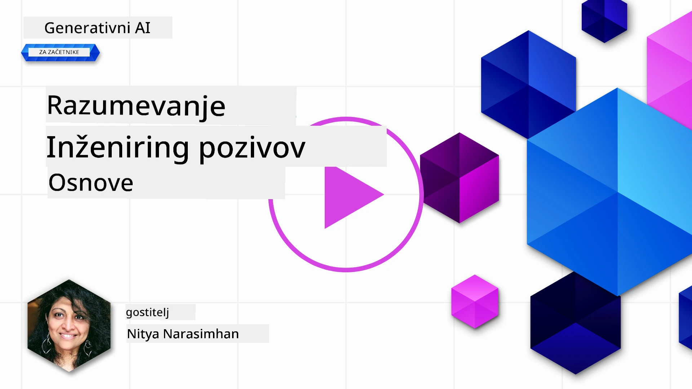
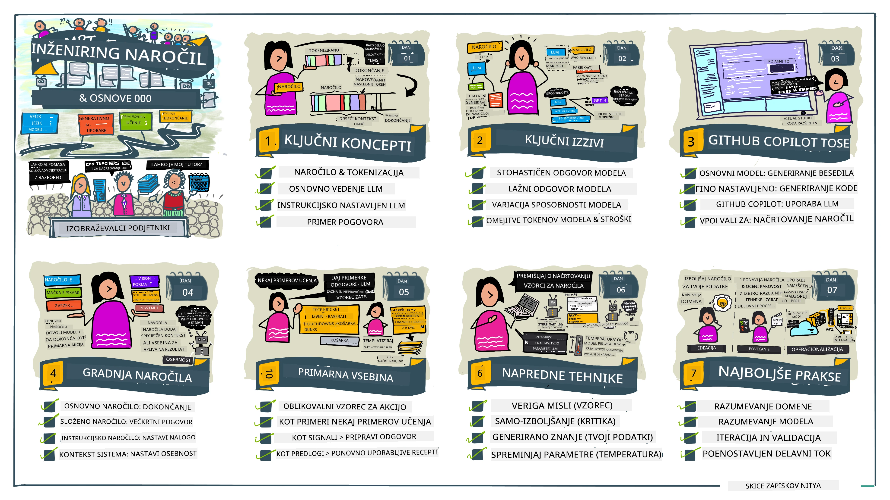
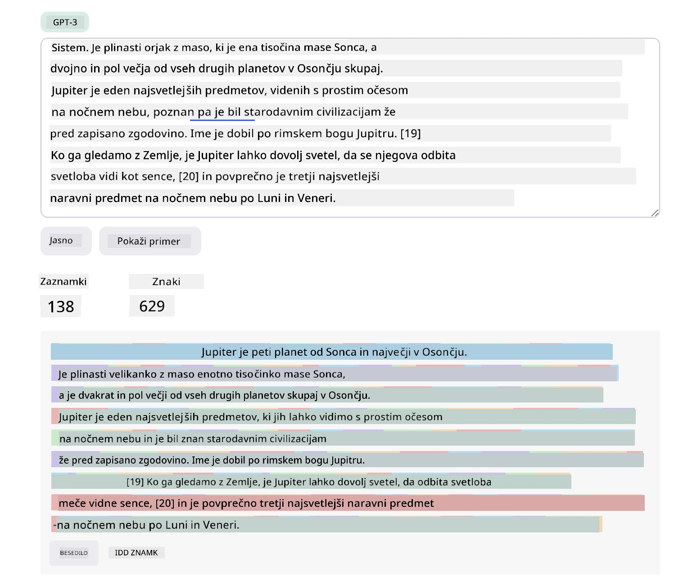
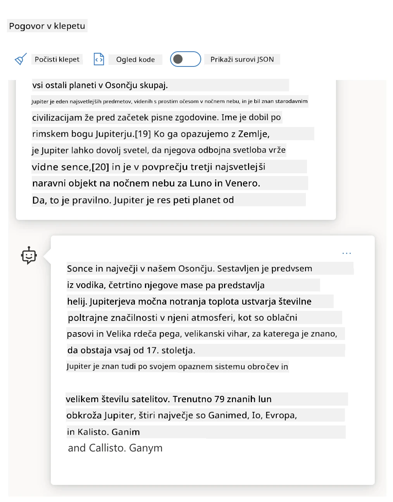
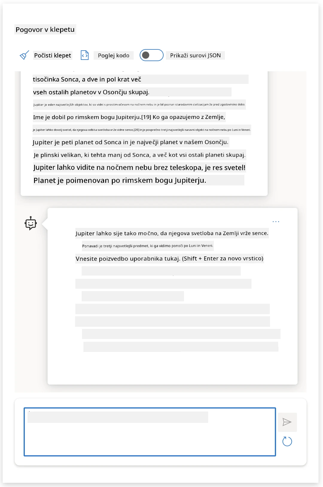
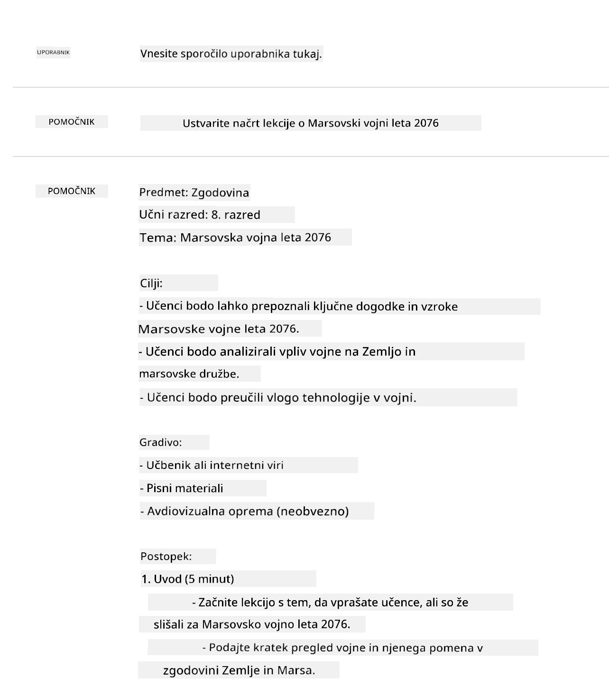
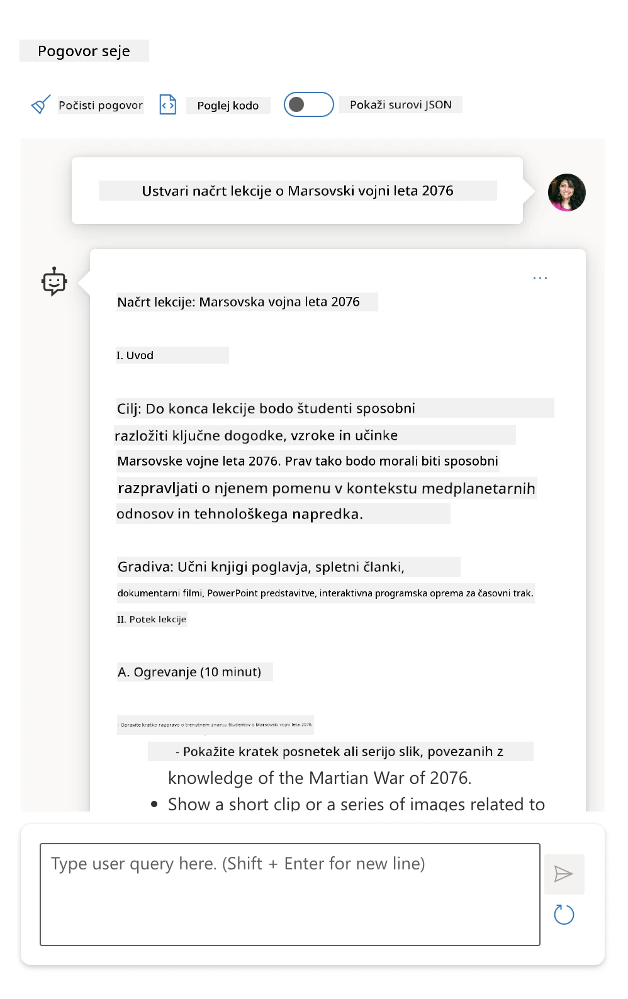

# Osnove izdelave navodil (prompt engineering)

[](https://youtu.be/GElCu2kUlRs?si=qrXsBvXnCW12epb8)

## Uvod
Ta modul pokriva osnovne koncepte in tehnike za ustvarjanje učinkovitih navodil (promptov) v generativnih modelih umetne inteligence. Pomembno je tudi, kako napišete navodilo za LLM. Skrbno oblikovano navodilo lahko doseže boljšo kakovost odgovora. Kaj pa pravzaprav pomenijo izrazi kot sta _navodilo_ in _izdelava navodil (prompt engineering)_? In kako izboljšam navodilo (_input_), ki ga pošljem LLM? To so vprašanja, na katera bomo poskušali odgovoriti v tem in naslednjem poglavju.

_Generativna umetna inteligenca_ je sposobna ustvarjati novo vsebino (npr. besedilo, slike, zvok, kodo itd.) kot odziv na uporabniške zahteve. Dosega to z uporabo _velikih jezikovnih modelov_ (Large Language Models) kot je npr. GPT (»Generative Pre-trained Transformer«) od OpenAI, ki so trenirani za uporabo naravnega jezika in kode.

Uporabniki lahko sedaj z modeli komunicirajo s poznanimi pristopi, kot je klepet, brez potrebe po tehničnem znanju ali usposabljanju. Model temelji na _navodilih_ – uporabniki pošljejo besedilno navodilo (prompt) in prejmejo odgovor umetne inteligence (dopolnitev). Nato lahko iterativno »klepetajo z umetno inteligenco« v večkratnih pogovorih in izpopolnjujejo svoje navodilo, dokler odgovor ne ustreza njihovim pričakovanjem.

»Navodila« so tako postala glavni _programski vmesnik_ za aplikacije generativne umetne inteligence, saj modelom sporočajo, kaj naj naredijo, in vplivajo na kakovost vrnjenih odgovorov. »Izdelava navodil« (Prompt Engineering) je hitro rastoče področje, ki se osredotoča na _oblikovanje in optimizacijo_ navodil, da zagotovi konsistentne in kakovostne odgovore v velikem obsegu.

## Cilji učenja

V tej lekciji se bomo naučili, kaj je izdelava navodil (prompt engineering), zakaj je pomembna in kako oblikovati učinkovitejša navodila za določen model in cilje aplikacije. Spoznali bomo osnovne koncepte in najboljše prakse za izdelavo navodil – ter se naučili o interaktivnem okolju Jupyter Notebooka »sandbox«, kjer si lahko ogledamo te koncepte na resničnih primerih.

Na koncu te lekcije bomo znali:

1. Pojasniti, kaj je izdelava navodil in zakaj je pomembna.
2. Opisati sestavine navodila in kako se uporabljajo.
3. Naučiti se najboljših praks in tehnik izdelave navodil.
4. Uporabiti naučene tehnike na resničnih primerih z uporabo OpenAI endpointa.

## Ključni pojmi

Izdelava navodil (Prompt Engineering): Praksa oblikovanja in izboljševanja vhodov za usmerjanje AI modelov k željenim izhodom.  
Tokenizacija: Proces pretvarjanja besedila v manjše enote, imenovane tokeni, ki jih model lahko razume in obdeluje.  
Navodilo-prilagojeni LLM (Instruction-Tuned LLMs): Veliki jezikovni modeli, ki so dodatno prilagojeni z določenimi navodili, da izboljšajo natančnost in relevantnost odgovorov.

## Učno okolje «sandbox»

Izdelava navodil je trenutno bolj umetnost kot znanost. Najboljši način za izboljšanje občutka za to je _več vadbe_ in pristop poskusa in napake, ki združuje strokovno znanje s priporočenimi tehnikami in model-specifičnimi optimizacijami.

Jupyter Notebook, ki spremlja to lekcijo, ponuja _sandbox_ okolje, v katerem lahko preizkušate naučeno – sproti ali kot del kodne izzive na koncu. Za izvajanje vaj boste potrebovali:

1. **Ključ Azure OpenAI API** – storitveni endpoint za nameščen LLM.  
2. **Python izvedbeno okolje** – za izvajanje Notebooka.  
3. **Lokalne okoljske spremenljivke** – _izvedite zdaj [POSTOPEK PRIPRAVE](./../00-course-setup/02-setup-local.md?WT.mc_id=academic-105485-koreyst), da se pripravite_.

Notebook vsebuje _začetne_ vaje – vendar ste vabljeni, da dodajate svoje _Markdown_ (opisne) in _Code_ (zahteve za navodila) odseke, da preizkusite več primerov ali idej – in si tako izgradite občutek za oblikovanje navodil.

## Ilustriran vodič

Želite dobiti širši vpogled v vsebino lekcije, preden se poglobite? Oglejte si ta ilustriran vodič, ki vam daje vtis glavnih tem in ključnih spoznanj za razmislek o vsaki izmed njih. Načrt lekcije vas popelje od razumevanja osnovnih konceptov in izzivov do njihovega naslavljanja z ustreznimi tehnikami izdelave navodil in najboljšimi praksami. Upoštevajte, da se oddelek »Napredne tehnike« v tem vodiču nanaša na vsebine, obravnavane v _naslednjem_ poglavju tega učnega načrta.



## Naš startup

Zdaj pa povejmo, kako se _ta tema_ povezuje z našo nalogo zagona (startupa) za [uvajanje inovacij umetne inteligence v izobraževanje](https://educationblog.microsoft.com/2023/06/collaborating-to-bring-ai-innovation-to-education?WT.mc_id=academic-105485-koreyst). Želimo graditi aplikacije na osnovi umetne inteligence, ki omogočajo _personalizirano učenje_ – zato razmislimo, kako lahko različni uporabniki naše aplikacije »oblikujejo« navodila:

- **Administratorji** lahko zahtevajo od AI, da _analizira podatke učnih načrtov in prepozna vrzeli v pokritosti_. AI lahko povzame rezultate ali jih vizualizira s kodo.  
- **Učitelji** lahko AI prosijo, da _ustvari načrt učne ure za določeno ciljno skupino in temo_. AI lahko zgradi personaliziran načrt v določenem formatu.  
- **Učenci** lahko AI prosijo, da _jim pomaga pri težavni temi_. AI jim lahko vodi lekcije, ponudi namige in zaključi s primeri, prilagojenimi njihovi ravni.

To je šele vrh ledene gore. Oglejte si [Prompts For Education](https://github.com/microsoft/prompts-for-edu/tree/main?WT.mc_id=academic-105485-koreyst) – odprtokodno knjižnico navodil, urejeno s strani strokovnjakov za izobraževanje – da dobite širši vpogled v možnosti! _Poskusite zagnati nekaj takih navodil v sandboxu ali v OpenAI Playgroundu in opazujte rezultate!_

<!--
LESSON TEMPLATE:
This unit should cover core concept #1.
Reinforce the concept with examples and references.

CONCEPT #1:
Prompt Engineering.
Define it and explain why it is needed.
-->

## Kaj je izdelava navodil (prompt engineering)?

Lekcijo smo začeli z definicijo **izdelave navodil (prompt engineering)** kot procesa _oblikovanja in optimizacije_ besedilnih vhodov (promptov) za zagotavljanje konsistentnih in kakovostnih odgovorov (doplnitev) za določen cilj aplikacije in model. To lahko razumemo kot dvostopenjski proces:

- _oblikovanje_ začetnega navodila za določen model in cilj  
- _izpopolnjevanje_ navodila iterativno za izboljšanje kakovosti odgovora

To je nujno proces poskusov in napak, ki zahteva intuicijo in trud uporabnika, da doseže optimalne rezultate. Zakaj je torej to pomembno? Za odgovor moramo najprej razumeti tri koncepte:

- _tokenizacija_ = kako model »vidi« navodilo  
- _osnovni LLM-ji_ = kako temeljni model »obdeluje« navodilo  
- _navodilo-prilagojeni LLM-ji_ = kako model zdaj lahko vidi »naloge«

### Tokenizacija

LLM obravnava navodila kot _sekvenco tokenov_, pri čemer različni modeli (ali različice modela) lahko isto navodilo razdelijo na tokene različno. Ker so LLM-ji trenirani na tokenih (ne na surovem besedilu), način tokenizacije vpliva neposredno na kakovost generiranega odgovora.

Za občutek, kako tokenizacija deluje, poskusite orodja, kot je [OpenAI Tokenizer](https://platform.openai.com/tokenizer?WT.mc_id=academic-105485-koreyst), prikazano spodaj. Kopirajte svoje navodilo in si oglejte, kako je razčlenjeno v tokene, bodite pozorni na presledke in ločila. Upoštevajte, da primer uporablja starejši LLM (GPT-3), zato lahko z novejšim modelom dobite drugačne rezultate.



### Koncept: Temeljni modeli

Ko je navodilo pretvorjeno v tokene, je glavna naloga ["osnovnega LLM-ja"](https://blog.gopenai.com/an-introduction-to-base-and-instruction-tuned-large-language-models-8de102c785a6?WT.mc_id=academic-105485-koreyst) (tj. temeljnega modela) napovedovati naslednji token v zaporedju. Ker so LLM-ji trenirani na ogromnih besedilnih podatkovnih množicah, imajo dober občutek za statistične povezave med tokeni in lahko napovedujejo z določeno gotovostjo. Pomembno je, da ne razumejo _pomena_ besed v navodilu ali tokenu; vidijo zgolj vzorec, ki ga lahko »dopopolnijo« z naslednjo napovedjo. Nadaljujejo lahko z napovedovanjem, dokler jih ne ustavi uporabnik ali nek prej določeni pogoj.

Želite videti, kako deluje dokončevanje navodil? Vnesite zgornje navodilo v Azure OpenAI Studio [_Chat Playground_](https://oai.azure.com/playground?WT.mc_id=academic-105485-koreyst) s privzetimi nastavitvami. Sistem je nastavljen, da navodila obravnava kot zahteve po informacijah – tako boste dobili odgovor, ki ustreza temu kontekstu.

Kaj pa, če uporabnik želi nekaj posebnega, kar ustreza določenim kriterijem oziroma nalogi? Takrat v igro stopijo _navodilo-prilagojeni_ LLM-ji.



### Koncept: Navodilo-prilagojeni LLM-ji

[Navodilo-prilagojeni LLM](https://blog.gopenai.com/an-introduction-to-base-and-instruction-tuned-large-language-models-8de102c785a6?WT.mc_id=academic-105485-koreyst) izhaja iz temeljnega modela, ki je dodatno prilagojen s primeri ali vhodno-izhodnimi pari (npr. večkrožnimi »sporočili«), ki lahko vsebujejo jasna navodila – AI pa skuša slediti temu navodilu v odgovoru.

Uporabljuje tehnike, kot je okrepitev učenja s povratnimi informacijami ljudi (Reinforcement Learning with Human Feedback – RLHF), ki naučijo model _slediti navodilom_ in _učiti se iz povratnih informacij_, da proizvede odgovore, ki so bolje prilagojeni praktičnim aplikacijam in uporabniškim ciljem.

Poskusimo – vrnite se na zgornje navodilo, spremenite pa _sistemsko sporočilo_, da omogočite naslednje navodilo kot kontekst:

> _Povzemite vsebino, ki vam je dana, za učenca drugega razreda. Rezultat naj bo en odstavek z 3-5 ključnimi točkami._

Vidite, da je rezultat zdaj prilagojen želenemu cilju in formatu? Učitelj to lahko uporabi neposredno v svojih diapozitivih za ta pouk.



## Zakaj potrebujemo izdelavo navodil?

Zdaj, ko razumemo, kako LLM-ji obdelujejo navodila, pa poglejmo, _zakaj_ potrebujemo izdelavo navodil. Odgovor leži v dejstvu, da trenutni LLM-ji predstavljajo številne izzive, ki otežujejo _zanesljive in konsistentne odgovore_ brez truda pri oblikovanju in optimizaciji navodil. Na primer:

1. **Odgovori modelov so stohastični.** _Isto navodilo_ lahko pri različnih modelih ali različicah modela proizvede različne odgovore. Tudi isti model lahko da različen odgovor, če ga vprašate večkrat. _Tehnike izdelave navodil lahko pomagajo zmanjšati te variacije z boljšimi varovali_.

1. **Modeli lahko izmišljajo odgovore.** Modeli so predtrenirani na _velikih, a končnih_ podatkovnih nizih, kar pomeni, da nimajo znanja o konceptih zunaj svojega področja usposabljanja. Zaradi tega lahko ustvarijo odgovore, ki so netočni, izmišljeni ali v neposrednem nasprotju z dejstvi. _Tehnike izdelave navodil pomagajo uporabnikom prepoznati in ublažiti take izmišljotine, npr. z zahtevami po citatih ali obrazložitvah_.

1. **Zmožnosti modelov se razlikujejo.** Novejši modeli ali generacije modelov imajo bogatejše zmogljivosti, hkrati pa prinašajo posebne lastnosti in kompromis med stroški ter kompleksnostjo. _Izdelava navodil lahko pomaga razviti najboljše prakse in poteke dela, ki abstraktno zakrijejo razlike in se prilagodijo model-specifičnim zahtevam na skalabilen in nemoten način_.

Preizkusite to v OpenAI ali Azure OpenAI Playgroundu:

- Uporabite isto navodilo z različnimi LLM implementacijami (npr. OpenAI, Azure OpenAI, Hugging Face) – ste opazili razlike?  
- Uporabite isto navodilo večkrat z _istim_ LLM-jem (npr. Azure OpenAI playground) – kako so se te variacije razlikovale?

### Primer izmišljotin

V tem tečaju uporabljamo izraz **»izmišljotina«** (fabrication) za pojav, ko LLM-ji včasih ustvarjajo dejansko napačne informacije zaradi omejitev v usposabljanju ali drugih dejavnikov. Morda ste to slišali imenovati tudi _»halucinacije«_ v popularnih člankih ali raziskovalnih prispevkih. Vendar močno priporočamo uporabo izraza _»izmišljotina«_, da ne bi nehote antropomorfizirali vedenja z pripisovanjem človeške lastnosti strojno generiranemu rezultatu. To tudi krepi [smernice za odgovorno umetno inteligenco](https://www.microsoft.com/ai/responsible-ai?WT.mc_id=academic-105485-koreyst) z vidika terminologije, tako da odstranjujemo izraze, ki so lahko v nekaterih kontekstih žaljivi ali neinkluzivni.

Želite dobiti občutek, kako delujejo izmišljotine? Pomislite na navodilo, ki umetni inteligenci naroči, naj ustvari vsebino o neobstoječi temi (da zagotovite, da ni del podatkov za usposabljanje). Na primer – poskusil sem takšno navodilo:

> **Navodilo:** Ustvari načrt učne ure o marsovski vojni leta 2076.
Spletno iskanje mi je pokazalo, da so obstajali fiktivni zapisi (npr. televizijske serije ali knjige) o marsovskih vojnah – vendar nobeden v letu 2076. Zdrav razum nam tudi pove, da je leto 2076 _v prihodnosti_ in zato ne more biti povezano z resničnim dogodkom.

Kaj se torej zgodi, ko zaženemo ta poziv pri različnih ponudnikih LLM?

> **Odgovor 1**: OpenAI Playground (GPT-35)



> **Odgovor 2**: Azure OpenAI Playground (GPT-35)



> **Odgovor 3**: : Hugging Face Chat Playground (LLama-2)


Kot smo pričakovali, vsak model (ali različica modela) ustvari rahlo različne odgovore zaradi stohastičnega vedenja in razlik v zmožnostih modelov. Na primer, eden od modelov cilja na občinstvo osmega razreda, medtem ko drugega predpostavlja za dijaka srednje šole. Vendar pa so vsi trije modeli ustvarili odgovore, ki bi lahko neinformiranega uporabnika prepričali, da je bil dogodek resničen.

Tehnike oblikovanja pozivov, kot so _metaprompting_ in _nastavitve temperature_, lahko do neke mere zmanjšajo izmišljanje modelov. Novi _arhitekture_ oblikovanja pozivov tudi brezhibno vključujejo nova orodja in tehnike v tok poziva, da ublažijo ali zmanjšajo nekatere od teh učinkov.

## Študija primera: GitHub Copilot

Zaključimo ta razdelek z vpogledom v to, kako se oblikovanje pozivov uporablja v rešitvah iz resničnega sveta, z ogledom ene študije primera: [GitHub Copilot](https://github.com/features/copilot?WT.mc_id=academic-105485-koreyst).

GitHub Copilot je vaš "AI parovski programer" – pretvori besedilne pozive v dokončanja kode in je integriran v vaše razvojno okolje (npr. Visual Studio Code) za nemoteno uporabniško izkušnjo. Kot je dokumentirano v nizu spodnjih blogov, je najzgodnejša različica temeljila na OpenAI Codex modelu – inženirji so hitro spoznali potrebo po fino prilagajanju modela in razvoju boljših tehnik oblikovanja pozivov za izboljšanje kakovosti kode. Julija so predstavili [izboljšan AI model, ki presega Codex](https://github.blog/2023-07-28-smarter-more-efficient-coding-github-copilot-goes-beyond-codex-with-improved-ai-model/?WT.mc_id=academic-105485-koreyst) za še hitrejše predloge.

Preberite prispevke v zaporedju, da sledite njihovi učni poti.

- **Maj 2023** | [GitHub Copilot bolje razume vašo kodo](https://github.blog/2023-05-17-how-github-copilot-is-getting-better-at-understanding-your-code/?WT.mc_id=academic-105485-koreyst)
- **Maj 2023** | [Znotraj GitHuba: delo z LLM-ji za GitHub Copilot](https://github.blog/2023-05-17-inside-github-working-with-the-llms-behind-github-copilot/?WT.mc_id=academic-105485-koreyst)
- **Junij 2023** | [Kako napisati boljše pozive za GitHub Copilot](https://github.blog/2023-06-20-how-to-write-better-prompts-for-github-copilot/?WT.mc_id=academic-105485-koreyst)
- **Julij 2023** | [.. GitHub Copilot presega Codex z izboljšanim AI modelom](https://github.blog/2023-07-28-smarter-more-efficient-coding-github-copilot-goes-beyond-codex-with-improved-ai-model/?WT.mc_id=academic-105485-koreyst)
- **Julij 2023** | [Vodnik za razvijalce o oblikovanju pozivov in LLM-jih](https://github.blog/2023-07-17-prompt-engineering-guide-generative-ai-llms/?WT.mc_id=academic-105485-koreyst)
- **September 2023** | [Kako zgraditi podjetniško aplikacijo LLM: Lekcije od GitHub Copilot](https://github.blog/2023-09-06-how-to-build-an-enterprise-llm-application-lessons-from-github-copilot/?WT.mc_id=academic-105485-koreyst)

Lahko tudi prebrskate njihov [inženirski blog](https://github.blog/category/engineering/?WT.mc_id=academic-105485-koreyst) za več prispevkov, kot je [ta](https://github.blog/2023-09-27-how-i-used-github-copilot-chat-to-build-a-reactjs-gallery-prototype/?WT.mc_id=academic-105485-koreyst), ki prikazuje, kako so ti modeli in tehnike _uporabljeni_ za poganjanje aplikacij iz resničnega sveta.

---

<!--
LESSON TEMPLATE:
This unit should cover core concept #2.
Reinforce the concept with examples and references.

CONCEPT #2:
Prompt Design.
Illustrated with examples.
-->

## Konstrukcija poziva

Videli smo, zakaj je oblikovanje pozivov pomembno – zdaj pa razumimo, kako so pozivi _konstruirani_, da bomo lahko ocenili različne tehnike za učinkovitejšo zasnovo pozivov.

### Osnovni poziv

Začnimo z osnovnim pozivom: besedilni vhod, poslan modelu brez drugega konteksta. Tu je primer – ko pošljemo prvih nekaj besed ameriške himne na OpenAI [Completion API](https://platform.openai.com/docs/api-reference/completions?WT.mc_id=academic-105485-koreyst), model takoj _dokonča_ odgovor z naslednjimi vrsticami, kar kaže osnovno prediktivno vedenje.

| Poziv (Vhod)      | Dokončanje (Izhod)                                                                                                                        |
| :---------------- | :----------------------------------------------------------------------------------------------------------------------------------------- |
| Oh say can you see | Zdi se, da začenjate besedilo "The Star-Spangled Banner", državne himne Združenih držav. Celotno besedilo je ... |

### Kompleksni poziv

Sedaj dodajmo kontekst in navodila k osnovnemu pozivu. [Chat Completion API](https://learn.microsoft.com/azure/ai-services/openai/how-to/chatgpt?WT.mc_id=academic-105485-koreyst) nam omogoča konstrukcijo kompleksnega poziva kot zbirke _sporočil_ z:

- pari vhod/izhoda, ki odražajo _uporabnikov_ vnos in _pomočnikov_ odgovor.
- sistemskim sporočilom, ki določa kontekst za vedenje ali osebnost pomočnika.

Zahteva je sedaj v obliki spodaj, kjer _tokenizacija_ učinkovito zajame relevantne informacije iz konteksta in pogovora. Sprememba sistemskega konteksta lahko močno vpliva na kakovost dokončanj, prav tako kot vhodni podatki od uporabnika.

```python
response = openai.chat.completions.create(
    model="gpt-3.5-turbo",
    messages=[
        {"role": "system", "content": "You are a helpful assistant."},
        {"role": "user", "content": "Who won the world series in 2020?"},
        {"role": "assistant", "content": "The Los Angeles Dodgers won the World Series in 2020."},
        {"role": "user", "content": "Where was it played?"}
    ]
)
```

### Navodilo za poziv

V zgornjih primerih je bil uporabniški poziv preprosto besedilno vprašanje, ki ga lahko razložimo kot prošnjo po informacijah. Z _navodili_ pri pozivih lahko uporabimo ta tekst za podrobnejšo določitev naloge in boljšega vodstva umetni inteligenci. Tu je primer:

| Poziv (Vhod)                                                                                                                                                                                                                          | Dokončanje (Izhod)                                                                                                  | Vrsta navodila     |
| :----------------------------------------------------------------------------------------------------------------------------------------------------------------------------------------------------------------------------------- | :----------------------------------------------------------------------------------------------------------------- | :----------------- |
| Napiši opis ameriške državljanske vojne                                                                                                                                                                                            | _vrnil preprost odstavek_                                                                                          | Preprosto          |
| Napiši opis ameriške državljanske vojne. Navedite ključne datume in dogodke ter opišite njihov pomen                                                                                                                                 | _vrnil odstavek, sledil pa je seznam ključnih datumov z opisi_                                                    | Kompleksno         |
| Napiši opis ameriške državljanske vojne v enem odstavku. Navedite 3 alineje s ključnimi datumi in njihovim pomenom. Nato navedite še 3 alineje s pomembnimi zgodovinskimi osebnostmi in njihovimi prispevki. Rezultat vrnite v obliki JSON | _vrne obsežnejše podrobnosti v besedilnem polju, formatirano kot JSON, ki ga lahko kopirate v datoteko in po potrebi preverite_ | Kompleksno. Formatirano. |

## Primarna vsebina

V zgornjih primerih je bil poziv še vedno precej odprt, kar je modelu omogočilo, da sam določi, kateri del njegovega predtreniranega nabora podatkov je relevanten. Z oblikovnim vzorcem _primarne vsebine_ je vhodno besedilo razdeljeno na dva dela:

- navodilo (akcija)
- relevantna vsebina (ki vpliva na akcijo)

Tu je primer, kjer je navodilo "povzetek v 2 stavkih".

| Poziv (Vhod)                                                                                                                                                                                                                                                                                                                                                                                                                                                                                                                                                                                                                                                             | Dokončanje (Izhod)                                                                                                                                                                                                                                                                                   |
| :--------------------------------------------------------------------------------------------------------------------------------------------------------------------------------------------------------------------------------------------------------------------------------------------------------------------------------------------------------------------------------------------------------------------------------------------------------------------------------------------------------------------------------------------------------------------------------------------------------------------------------------------------------------------------- | :-------------------------------------------------------------------------------------------------------------------------------------------------------------------------------------------------------------------------------------------------------------------------------------------------- |
| Jupiter je peti planet od Sonca in največji v Osončju. Je plinski velikan z maso ena tisočinka mase Sonca, a ima dve in pol-krat večjo maso kot vsi drugi planeti v Osončju skupaj. Jupiter je ena najsvetlejših teles, ki so vidna s prostim očesom na nočnem nebu, in je poznan starodavnim civilizacijam še pred zabeleženo zgodovino. Ime je dobil po rimskem bogu Jupiterju.[19] Ko ga opazujemo z Zemlje, je Jupiter lahko dovolj svetel, da njegovo odsevano svetlobo vidimo v obliki senc,[20] in je povprečno tretje najsvetlejše naravno telo na nočnem nebu za Luno in Venero. <br/> **Povzemi to v 2 kratka stavka** | Jupiter, peti planet od Sonca, je največji v Osončju in znan kot eno najsvetlejših teles na nočnem nebu. Ime je dobil po rimskem bogu Jupiterju; je plinski velikan s maso, ki je dve in pol krat večja od mase vseh drugih planetov Osončja skupaj. |

Segment primarne vsebine je mogoče uporabiti na različne načine za učinkovitejša navodila:

- **Primeri** - namesto da modelu povedemo natančno, kaj naj naredi z eksplicitnim navodilom, mu damo primere, kaj naj naredi, in naj sam sklepa vzorec.
- **Namigi** - po navodilu dodamo "namig", ki usmeri dokončanje in vodi model k bolj relevantnim odgovorom.
- **Predloge** – to so ponovljive 'recepture' za pozive s prostorčki (spremenljivkami), ki jih je mogoče prilagoditi s podatki za specifične primere uporabe.

Poglejmo si te primere v akciji.

### Uporaba primerov

To je pristop, kjer uporabimo primarno vsebino, da "hranimo model" z nekaj primeri želenega izhoda za dano navodilo in mu dovolimo sklepanje vzorca za želeni izhod. Glede na število podanih primerov poznamo nič-izstrelkov, en-izstrelek, nekaj-izstrelkov itd.

Poziv sedaj sestavljajo trije deli:

- opis naloge
- nekaj primerov želenega izhoda
- začetek novega primera (ki postane implicitni opis naloge)

| Tip učenja   | Poziv (Vhod)                                                                                                                                         | Dokončanje (Izhod)         |
| :----------- | :--------------------------------------------------------------------------------------------------------------------------------------------------- | :-------------------------- |
| Nič-izstrelek | "The Sun is Shining". Prevedi v španščino                                                                                                           | "El Sol está brillando".    |
| En-izstrelek | "The Sun is Shining" => ""El Sol está brillando". <br> "It's a Cold and Windy Day" =>                                                                 | "Es un día frío y ventoso". |
| Nekaj-izstrelkov | Igralec je tekel okoli baz => Baseball <br/> Igralec je zadel 'ace' => Tenis <br/> Igralec je zadel šestico => Kriket <br/> Igralec je izvedel 'slam-dunk' => | Košarka                    |
|              |                                                                                                                                                      |                             |

Opazite, da smo morali v nič-izstrelek pozivu eksplicitno navesti nalogo ("Prevedi v španščino"), vendar se v primeru enega izstrela to implicitno razume. Primer nekaj izstrelkov pokaže, kako dodajanje več primerov omogoča modelom natančnejša sklepanja brez dodatnih navodil.

### Namigi za pozive

Druga tehnika za uporabo primarne vsebine je zagotoviti _namige_ namesto primerov. V tem primeru modelu damo rahlo usmeritev s koščkom besedila, ki odraža želeni format odgovora. Model nato "sprejme namig" in nadaljuje v tem slogu.

| Število namigov | Poziv (Vhod)                                                                                                                                                                                                                                                                                                                                                                                                                                           | Dokončanje (Izhod)                                                                                                                                                                                                                                                                                       |
| :-------------- | :----------------------------------------------------------------------------------------------------------------------------------------------------------------------------------------------------------------------------------------------------------------------------------------------------------------------------------------------------------------------------------------------------------------------------------------------------- | :-------------------------------------------------------------------------------------------------------------------------------------------------------------------------------------------------------------------------------------------------------------------------------------------------------- |
| 0               | Jupiter je peti planet od Sonca in največji v Osončju. Je plinski velikan z maso ena tisočinka mase Sonca, a ima dve in pol-krat večjo maso kot vsi drugi planeti v Osončju skupaj. Jupiter je ena najsvetlejših teles, ki so vidna s prostim očesom na nočnem nebu, in je poznan starodavnim civilizacijam še pred zabeleženo zgodovino. <br/>**Povzemi to**                                                                                 | Jupiter je največji planet v našem Osončju in peti od Sonca. Je plinski velikan z maso 1/1000 mase Sonca, vendar težji od vseh drugih planetov skupaj. Starodavne civilizacije poznajo Jupiter že dolgo časa in je lahko viden na nočnem nebu.                                                           |
| 1              | Jupiter je peta planeta od Sonca in največja v Osončju. Je plinski velikan z maso, ki je tisočinka mase Sonca, a dva in polkratna vsem ostalim planetam Osončja skupaj. Jupiter je enega najsvetlejših predmetov, vidnih s prostim očesom na nočnem nebu, in je znan starodavnim civilizacijam že pred pisano zgodovino. <br/>**Povzemite to** <br/> Kar smo se naučili, je, da je Jupiter | peta planeta od Sonca in največja v Osončju. Je plinski velikan z maso tisočinka mase Sonca, a dva in polkratna vsem drugim planetam skupaj. Je lahko viden s prostim očesom in je poznan že od starodavnih časov.                      |
| 2              | Jupiter je peta planeta od Sonca in največja v Osončju. Je plinski velikan z maso, ki je tisočinka mase Sonca, a dva in polkratna vsem ostalim planetam Osončja skupaj. Jupiter je enega najsvetlejših predmetov, vidnih s prostim očesom na nočnem nebu, in je znan starodavnim civilizacijam že pred pisano zgodovino. <br/>**Povzemite to** <br/> Top 3 dejstva, ki smo se jih naučili:         | 1. Jupiter je peta planeta od Sonca in največja v Osončju. <br/> 2. Je plinski velikan z maso, ki je tisočinka mase Sonca...<br/> 3. Jupiter je viden s prostim očesom že od starodavnih časov ...                                                                   |
|                |                                                                                                                                                                                                                                                                                                                                                                                                                                                              |                                                                                                                                                                                                                                                                                                           |

### Predloge Pozivov

Predloga poziva je _vnaprej določena sestavina poziva_, ki jo lahko shranimo in ponovno uporabimo po potrebi, da zagotovimo bolj dosledno uporabniško izkušnjo v velikem obsegu. V svoji najpreprostejši obliki je to zbirka primerov pozivov, kot je [ta primer OpenAI](https://platform.openai.com/examples?WT.mc_id=academic-105485-koreyst), ki zagotavlja interaktivne komponente poziva (uporabniški in sistemski sporočili) ter format zahteve prek API-ja – za podporo ponovni uporabi.

V bolj zapleteni obliki, kot je [ta primer LangChain](https://python.langchain.com/docs/concepts/prompt_templates/?WT.mc_id=academic-105485-koreyst), vsebuje _zaščitna mesta_, ki jih je mogoče zamenjati z podatki iz različnih virov (uporabniški vnos, sistemski kontekst, zunanji podatkovni viri itd.), da se dinamično ustvari poziv. To nam omogoča ustvarjanje knjižnice ponovno uporabnih pozivov, ki se lahko **programatično** uporabljajo za zagotavljanje doslednih uporabniških izkušenj v velikem obsegu.

Nazadnje je prava vrednost predlog v sposobnosti ustvarjanja in objave _knjižnic pozivov_ za vertikalna aplikativna področja – kjer je predloga poziva zdaj _optimizirana_ za aplikativni kontekst ali primere, ki naredijo odzive bolj relevantne in natančne za ciljno uporabniško publiko. Repozitorij [Prompts For Edu](https://github.com/microsoft/prompts-for-edu?WT.mc_id=academic-105485-koreyst) je odličen primer tega pristopa, saj zbira knjižnico pozivov za izobraževalno področje s poudarkom na ključnih ciljih, kot so načrtovanje lekcij, načrtovanje kurikuluma, poučevanje študentov itd.

## Podporna vsebina

Če obravnavamo konstrukcijo poziva kot imeti navodilo (nalogo) in cilj (primarno vsebino), potem je _sekundarna vsebina_ dodatni kontekst, ki ga zagotovimo, da **na nek način vpliva na izhod**. To so lahko parametri nastavitve, navodila za oblikovanje, taksonomije tem itd., ki pomagajo modelu _prilagoditi_ odziv, da ustreza želenim ciljem ali pričakovanjem uporabnika.

Na primer: Glede na katalog tečajev z obsežnimi metapodatki (ime, opis, stopnja, oznake metapodatkov, inštruktor itd.) o vseh razpoložljivih tečajih v kurikulumu:

- lahko določimo navodilo, da "povzamemo katalog tečajev za jesen 2023"
- lahko uporabimo primarno vsebino, da zagotovimo nekaj primerov želenega izhoda
- lahko uporabimo sekundarno vsebino za določitev petih najpomembnejših "oznak".

Model lahko nato zagotovi povzetek v obliki, kot jo prikazujejo primeri – toda če ima rezultat več oznak, lahko da prednost petim označenim v sekundarni vsebini.

---

<!--
TEMPLAT LEKCIJE:
Ta enota naj pokrije osnovni koncept #1.
Okrepiti koncept s primeri in referencami.

KONCEPT #3:
Tehnike oblikovanja poziva.
Katere so osnovne tehnike za oblikovanje poziva?
Ponazorite jih z vajami.
-->

## Najboljše prakse pri oblikovanju pozivov

Zdaj, ko vemo, kako lahko pozive _konstruiramo_, lahko začnemo razmišljati, kako jih _oblikovati_, da upoštevamo najboljše prakse. Razdelimo jih lahko na pravilen _nagnjenost_ in uporabo pravih _tehnik_.

### Mislitveni okvir za oblikovanje poziva

Oblikovanje poziva je proces poskusov in napak, zato imejte v mislih tri široke vodilne dejavnike:

1. **Razumevanje domene šteje.** Natančnost in relevantnost odziva sta funkciji _domena_, v kateri aplikacija ali uporabnik deluje. Uporabite svojo intuicijo in strokovno znanje domene za **prilagoditev tehnik**. Na primer, določite _osebnosti specifične za domeno_ v svojih sistemskih pozivih ali uporabite _predloge specifične za domeno_ v uporabniških pozivih. Zagotovite sekundarno vsebino, ki odraža kontekste specifične za domeno, ali uporabite _namige in primere specifične za domeno_, da model usmerite k poznanim vzorcem uporabe.

2. **Razumevanje modela šteje.** Vemo, da so modeli po naravi stohastični. Toda implementacije modelov se lahko razlikujejo glede na uporabljeni učni niz podatkov (vnaprej usposobljeno znanje), možnosti, ki jih ponujajo (npr. prek API ali SDK), in vrsto vsebine, za katero so optimizirani (npr. koda proti slikam ali besedilu). Razumite moči in omejitve modela, ki ga uporabljate, in uporabite to znanje za _prioritizacijo nalog_ ali gradnjo _prilagojenih predlog_, ki so optimizirane za zmogljivosti modela.

3. **Ponavljanje in preverjanje šteje.** Modeli hitro napredujejo, prav tako tudi tehnike oblikovanja poziva. Kot strokovnjak za domeno imate lahko še drug kontekst ali merila za _vašo_ specifično aplikacijo, ki niso nujno uporabna širši skupnosti. Uporabite orodja in tehnike oblikovanja poziva za "hitri začetek" konstrukcije poziva, nato ponavljajte in preverjajte rezultate z lastno intuicijo in strokovnim znanjem. Zabeležite si ugotovitve in ustvarite **bazo znanja** (npr. knjižnice pozivov), ki jo lahko drugi uporabijo kot novo izhodišče za hitrejše ponovitve.

## Najboljše prakse

Poglejmo sedaj skupne najboljše prakse, ki jih priporoča [OpenAI](https://help.openai.com/en/articles/6654000-best-practices-for-prompt-engineering-with-openai-api?WT.mc_id=academic-105485-koreyst) in [Azure OpenAI](https://learn.microsoft.com/azure/ai-services/openai/concepts/prompt-engineering#best-practices?WT.mc_id=academic-105485-koreyst).

| Kaj                              | Zakaj                                                                                                                                                                                                                                              |
| :-------------------------------- | :------------------------------------------------------------------------------------------------------------------------------------------------------------------------------------------------------------------------------------------------- |
| Preizkusite najnovejše modele.   | Nove generacije modelov verjetno imajo izboljšane lastnosti in kvaliteto – vendar lahko povzročajo večje stroške. Ocenite njihov vpliv in nato sprejmite odločitve o selitvi.                                                                       |
| Ločite navodila in kontekst      | Preverite, ali vaš model/ponudnik določa _ločila_ za jasnejšo razliko med navodili, primarno in sekundarno vsebino. To lahko modelom pomaga natančneje dodeliti teže za posamezne enote.                                                           |
| Bodite specifični in jasni       | Podajte več podrobnosti o želenem kontekstu, izidu, dolžini, formatu, slogu itd. To izboljša kakovost in doslednost odzivov. Zajemite recepte v ponovno uporabnih predlogah.                                                                   |
| Bodite opisni, uporabite primere | Modeli se lahko bolje odzovejo na pristop "pokaži in povej". Začnite z `zero-shot` pristopom, kjer daste navodilo (brez primerov), nato poskusite `few-shot` kot izpopolnitev z nekaj primeri želenega izhoda. Uporabite analogije.                     |
| Uporabite namige za zagon        | Usmerite ga proti želenemu rezultatu tako, da mu daste nekaj začetnih besed ali fraz, ki jih lahko uporabi kot izhodišče za odgovor.                                                                                                             |
| Ponovite, če je treba            | Včasih je potrebno modelu ponoviti. Dajte navodila pred in po primarni vsebini, uporabite navodilo in namig itd. Ponavljajte in preverjajte, kaj deluje.                                                                                        |
| Pomemben je vrstni red           | Vrstni red, v katerem modelu podajate informacije, lahko vpliva na izhod, tudi v primerih učenja, zaradi pristranskosti aktualnosti. Poskusite različne možnosti in ugotovite, kaj najbolje deluje.                                                  |
| Dajte modelu možnost “izstopa”  | Modelu zagotovite _rezervni_ odziv, če zanj iz kakršnega koli razloga ne more dokončati naloge. To zmanjša možnosti, da bi modeli ustvarili napačne ali izmišljene odzive.                                                                       |
|                                 |                                                                                                                                                                                                                                                   |

Kot pri vsaki najboljši praksi, ne pozabite, da se _vaši rezultati lahko razlikujejo_ glede na model, nalogo in domeno. Uporabite jih kot izhodišče in ponavljajte, da najdete, kaj najbolje deluje za vas. Nenehno ponovno ocenjujte svoj postopek oblikovanja poziva, ko so na voljo novi modeli in orodja, s poudarkom na razširljivosti procesa in kakovosti odziva.

<!--
TEMPLAT LEKCIJE:
Ta enota naj ponudi izziv s kodo, če je to primerno.

IZZIV:
Povezava do Jupyterove beležnice, kjer so v navodilih samo komentarji kode (kodne sekcije so prazne).

REŠITEV:
Povezava do kopije te beležnice z izpolnjenimi pozivi in izvajanjem, ki prikazuje en primer izhoda.
-->

## Naloga

Čestitamo! Prišli ste do konca lekcije! Čas je, da nekatere od teh konceptov in tehnik preizkusite v praksi z resničnimi primeri!

Za našo nalogo bomo uporabili Jupyter beležnico z vajami, ki jih lahko interaktivno dokončate. Beležnico lahko tudi razširite z lastnimi Markdown in Code celicami, da sami raziskujete ideje in tehnike.

### Za začetek, forknite repozitorij, nato

- (Priporočeno) Zaženite GitHub Codespaces
- (Alternativa) Klonirajte repozitorij na lokalno napravo in ga uporabite z Docker Desktop
- (Alternativa) Odprite beležnico v vaši priljubljeni obliki za izvajanje Jupyter beležnic

### Nato nastavite svoje okoljske spremenljivke

- Kopirajte datoteko `.env.copy` v korenski mapo repozitorija kot `.env` in vnesite vrednosti `AZURE_OPENAI_API_KEY`, `AZURE_OPENAI_ENDPOINT` in `AZURE_OPENAI_DEPLOYMENT`. Nato se vrnite na razdelek [Learning Sandbox](../../../04-prompt-engineering-fundamentals), da se naučite, kako.

### Nato odprite Jupyter beležnico

- Izberite jedro za izvajanje. Če uporabljate prva dva načina, izberite privzeto jedro Python 3.10.x, ki je vključeno v razvojno okolje.

Pripravljeni ste za izvajanje vaj. Opomba: ni pravih ali napačnih odgovorov – gre za raziskovanje možnosti z metodo poskusov in napak ter razvijanje intuicije, kaj deluje za določen model in domeno aplikacije.

_Zaradi tega v tej lekciji ni segmentov s kodo za rešitev. Namesto tega ima beležnica Markdown celice z naslovom “Moja rešitev:”, ki prikazujejo en primer izhoda za referenco._

<!--
TEMPLAT LEKCIJE:
Zaključite razdelek s povzetkom in viri za samostojno učenje.
-->

## Preverjanje znanja

Kateri od naslednjih je dober poziv po sprejemljivih najboljših praksah?

1. Pokaži mi sliko rdečega avtomobila
2. Pokaži mi sliko rdečega avtomobila znamke Volvo in modela XC90, parkiranega ob pečini ob zahajajočem soncu
3. Pokaži mi sliko rdečega avtomobila znamke Volvo in modela XC90

Odgovor: 2, ker je najboljši poziv, saj ponuja podrobnosti o "čemu" in gre v specifičnosti (ne samo kateri koli avto, ampak določena znamka in model) ter opisuje celoten prizor. Sledi 3, ki prav tako vsebuje veliko opisov.

## 🚀 Izziv

Poskusite uporabiti tehniko "namiga" s pozivom: Dokončaj stavek "Pokaži mi sliko rdečega avtomobila znamke Volvo in ". Kako se odzove, in kako bi ga izboljšali?

## Odlično delo! Nadaljujte učenje

Želite izvedeti več o različnih konceptih oblikovanja poziva? Obiščite [stran za nadaljnje učenje](https://aka.ms/genai-collection?WT.mc_id=academic-105485-koreyst), kjer boste našli odlične vire o tej temi.

Pojdite na lekcijo 5, kjer bomo pogledali [napredne tehnike oblikovanja poziva](../05-advanced-prompts/README.md?WT.mc_id=academic-105485-koreyst)!

---

<!-- CO-OP TRANSLATOR DISCLAIMER START -->
**Opozorilo**:
Ta dokument je bil preveden z uporabo AI prevajalske storitve [Co-op Translator](https://github.com/Azure/co-op-translator). Čeprav si prizadevamo za natančnost, upoštevajte, da lahko avtomatizirani prevodi vsebujejo napake ali netočnosti. Izvirni dokument v njegovem izvorno jeziku velja za zanesljiv vir. Za ključne informacije priporočamo strokovni človeški prevod. Nismo odgovorni za morebitne nesporazume ali napačne interpretacije, ki izhajajo iz uporabe tega prevoda.
<!-- CO-OP TRANSLATOR DISCLAIMER END -->