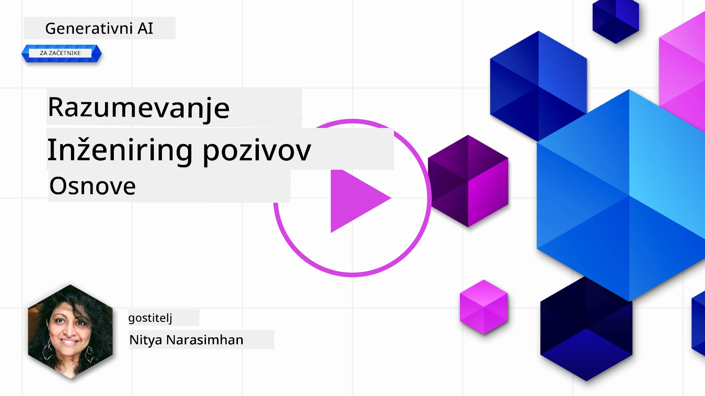
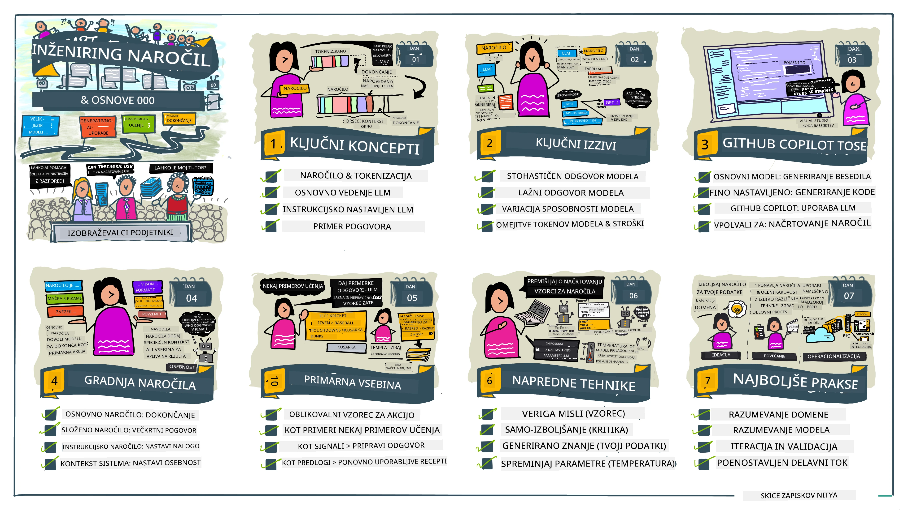
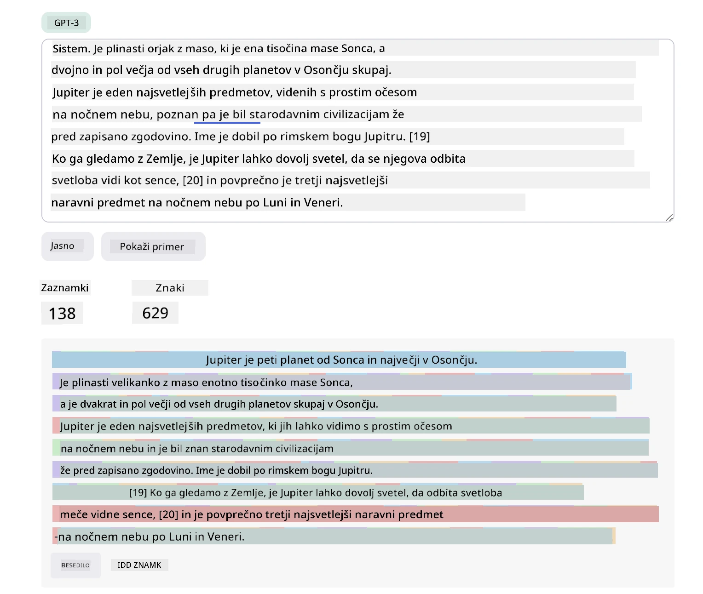
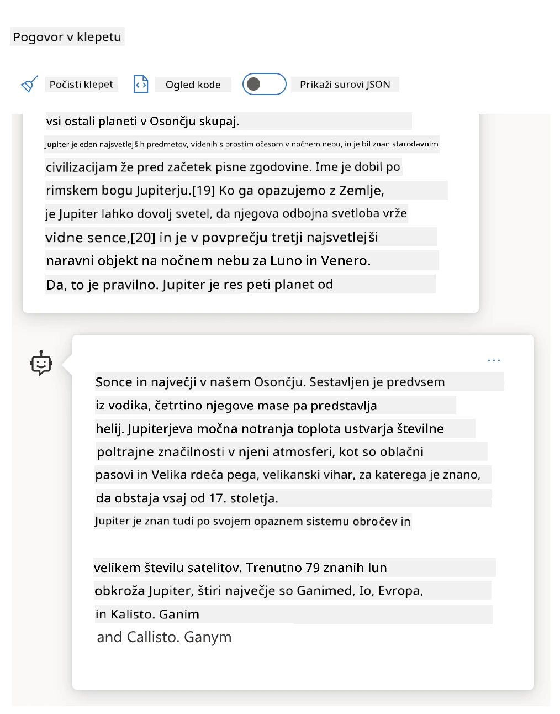
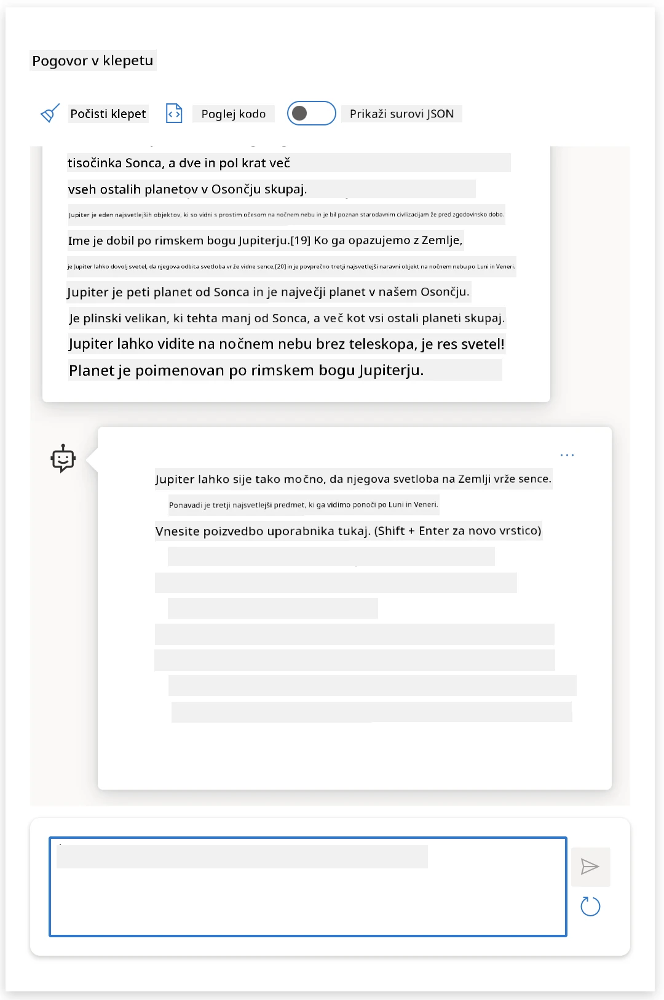
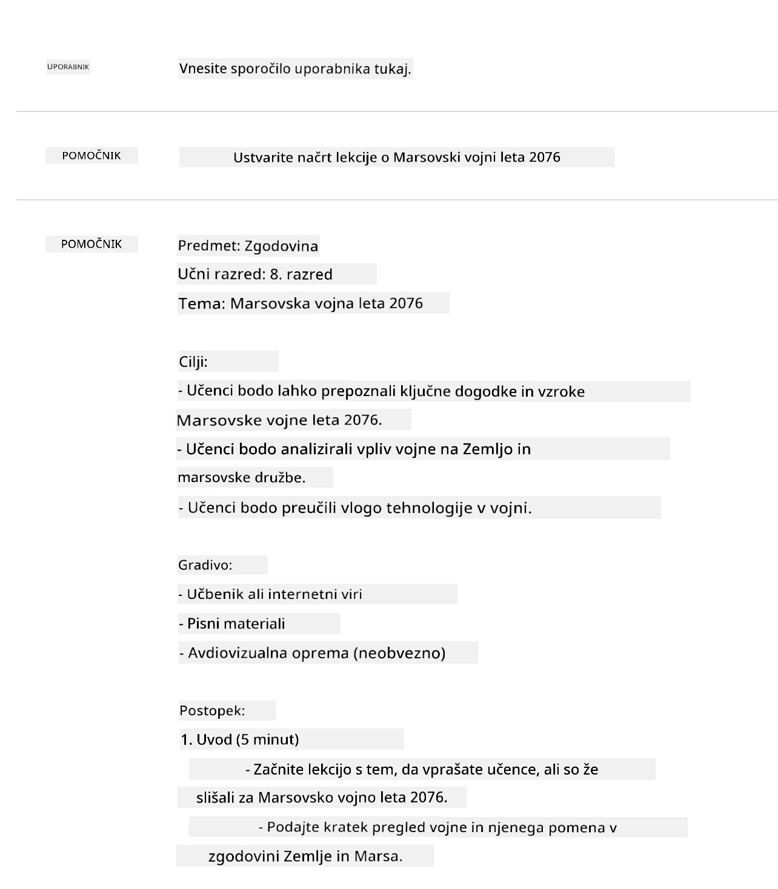
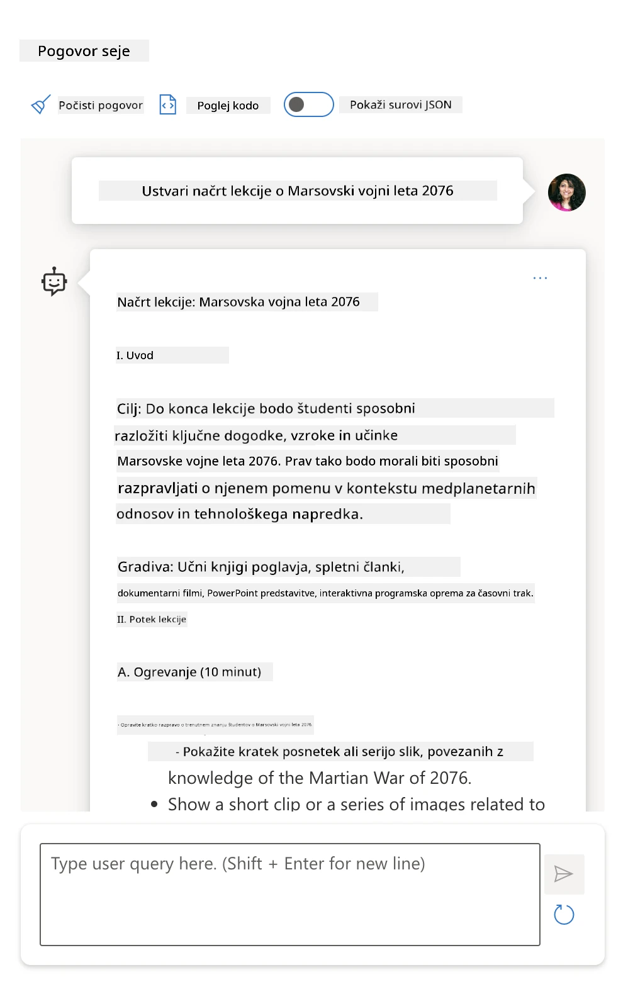
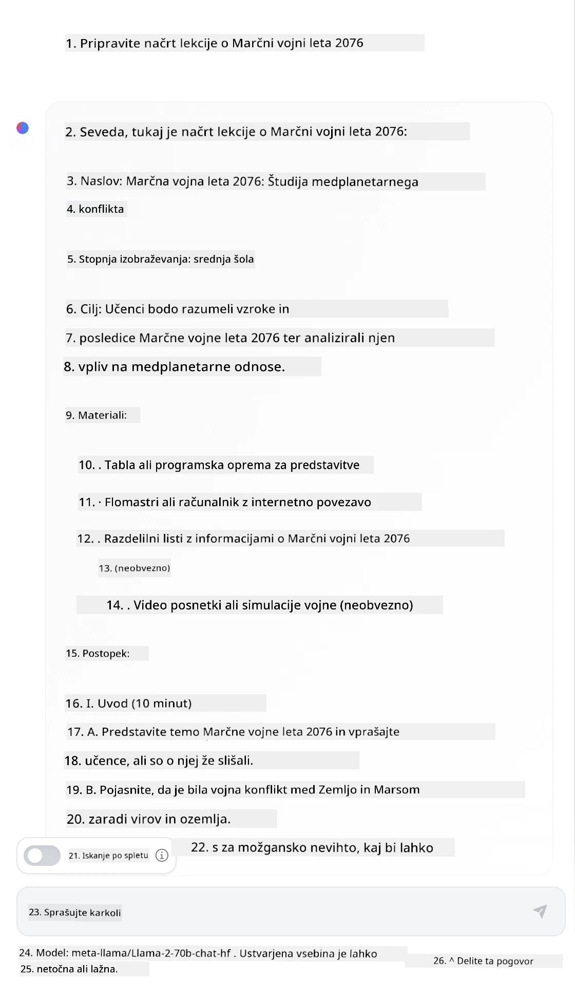

# Osnove oblikovanja pozivov (Prompt Engineering)

[](https://youtu.be/GElCu2kUlRs?si=qrXsBvXnCW12epb8)

## Uvod
Ta modul zajema osnovne koncepte in tehnike za ustvarjanje učinkovitih pozivov v generativnih modelih umetne inteligence. Tudi način, kako napišete svoj poziv za LLM, je pomemben. Skrbno oblikovan poziv lahko doseže bolj kakovostne odgovore. A kaj točno pomenita izraza _poziv_ in _oblikovanje pozivov_? In kako izboljšam _vnos_ poziva, ki ga pošljem LLM? To so vprašanja, na katera bomo poskušali odgovoriti v tem in naslednjem poglavju.

_Generativna umetna inteligenca_ je sposobna ustvarjati novo vsebino (npr. besedilo, slike, zvok, kodo itd.) kot odgovor na uporabniške zahteve. Doseže to z uporabo _velikih jezikovnih modelov_ (Large Language Models) kot so OpenAI-jevi GPT ("Generative Pre-trained Transformer"), ki so usposobljeni za uporabo naravnega jezika in kode.

Uporabniki lahko sedaj z modeli komunicirajo preko znanih paradigme, kot je klepet, brez potrebe po tehničnem znanju ali usposabljanju. Modeli so _na osnovi pozivov_ – uporabniki pošljejo besedilni vnos (poziv) in prejmejo AI odgovor (zaključek). Nato lahko v iterativnih večkrokovnih pogovorih "klepetajo z AI" in izboljšujejo svoj poziv, dokler odgovor ne ustreza njihovim pričakovanjem.

"Pozivi" postanejo primarni _programski vmesnik_ za aplikacije generativne AI, saj napravijo modele, da vedo, kaj naj naredijo in vplivajo na kakovost vrnjenih odgovorov. "Oblikovanje pozivov" je hitro rastoče področje, ki se osredotoča na _načrtovanje in optimizacijo_ pozivov za zagotavljanje doslednih in kakovostnih odzivov v velikem obsegu.

## Cilji učenja

V tej lekciji se bomo naučili, kaj je oblikovanje pozivov, zakaj je pomembno in kako lahko izdelamo učinkovitejše pozive za določen model in namen aplikacije. Spoznali bomo osnovne koncepte in najboljše prakse za oblikovanje pozivov – ter se seznanili z interaktivnim okoljem Jupyter Notebook... "peskovnik", kjer lahko vidimo uporabo teh konceptov na pravih primerih.

Do konca lekcije boste sposobni:

1. Razložiti, kaj je oblikovanje pozivov in zakaj je pomembno.
2. Opisati sestavne dele poziva in kako se uporabljajo.
3. Naučiti se najboljših praks in tehnik oblikovanja pozivov.
4. Uporabiti naučene tehnike na pravih primerih z uporabo OpenAI končne točke.

## Ključni izrazi

Oblikovanje pozivov: Praksa načrtovanja in izboljševanja vhodov za usmerjanje AI modelov k želenim izhodom.
Tokenizacija: Postopek pretvarjanja besedila v manjše enote, imenovane tokeni, ki jih model lahko razume in obdela.
Modeli LLM, prilagojeni z navodili (Instruction-Tuned LLMs): Veliki jezikovni modeli, ki so bili dodatno prilagojeni s specifičnimi navodili za izboljšanje točnosti in relevantnosti odgovorov.

## Peskovnik za učenje

Oblikovanje pozivov je trenutno bolj umetnost kot znanost. Najboljši način za izboljšanje intuicije je _več ponavljanja_ in sprejetje pristopa poskušanja in napake, ki združuje strokovno znanje o področju uporabe z priporočilnimi tehnikami in specifičnimi optimizacijami modela.

Jupyter Notebook, ki spremlja to lekcijo, ponuja _peskovnik_ okolje, kjer lahko preizkusite, kar se naučite – sproti ali kot del izziva na koncu. Za izvajanje vaj boste potrebovali:

1. **Azure OpenAI API ključ** – končno točko storitve za nameščen LLM.
2. **Python runtime okolje** – v katerem lahko zaženete Notebook.
3. **Lokalne okoljske spremenljivke** – _pripravite se zdaj, tako da dokončate [POSTOPEK NASTAVITVE](./../00-course-setup/02-setup-local.md?WT.mc_id=academic-105485-koreyst)_.

Notebook vključuje _začetne_ vaje – a ste vabljeni, da dodate svoje _Markdown_ (opisi) in _Kodo_ (zahteve pozivov) za preizkus dodatnih primerov ali idej – in si tako oblikujete svojo intuicijo za načrtovanje pozivov.

## Ilustriran vodič

Želite dobiti celovit pregled vsebine lekcije, preden začnete? Oglejte si ta ilustriran vodič, ki vam predstavi glavne teme in ključna spoznanja, o katerih lahko razmislite pri vsaki tem. Potek lekcije vas vodi od razumevanja osnovnih konceptov in izzivov do reševanja z ustreznimi tehnikami in najboljšimi praksami oblikovanja pozivov. Opomba: razdelek "Napredne tehnike" v tem vodiču se nanaša na vsebino, zajeto v _naslednjem_ poglavju tega kurikuluma.



## Naš startup

Zdaj pa pogovorimo, kako _ta tematika_ povezuje z našo startup misijo, da [prinesemo inovacije AI v izobraževanje](https://educationblog.microsoft.com/2023/06/collaborating-to-bring-ai-innovation-to-education?WT.mc_id=academic-105485-koreyst). Želimo zgraditi AI-podprte aplikacije za _personalizirano učenje_ – razmislimo torej, kako bi lahko različni uporabniki naše aplikacije "načrtovali" pozive:

- **Administratorji** bi lahko od AI zahtevali, da _analizira podatke učnih načrtov, da identificira vrzeli v pokritosti_. AI lahko povzame rezultate ali jih vizualizira s kodo.
- **Izobraževalci** bi lahko AI prosili, da _ustvari načrt lekcije za ciljno publiko in temo_. AI lahko sestavi personaliziran načrt v določenem formatu.
- **Učenci** bi lahko prosili AI, naj jih _mentorira pri težki temi_. AI lahko zdaj vodi učence z lekcijami, namigi in primeri prilagojenimi njihovi ravni.

To je le vrh ledene gore. Oglejte si [Pozive za izobraževanje](https://github.com/microsoft/prompts-for-edu/tree/main?WT.mc_id=academic-105485-koreyst) – odprtokodno knjižnico pozivov, ki jo urejajo strokovnjaki za izobraževanje – da dobite širši vpogled v možnosti! _Poskusite zagnati nekaj teh pozivov v peskovniku ali z uporabo OpenAI Playground in poglejte, kaj se zgodi!_

<!--
PREDLOGA LEKCIJE:
Ta enota naj pokrije osnovni koncept #1.
Konzistentno podkrepite koncept s primeri in referencami.

KONCEPT #1:
Oblikovanje pozivov.
Določite ga in razložite, zakaj je potrebno.
-->

## Kaj je oblikovanje pozivov?

Lekcijo smo začeli z definicijo **oblikovanja pozivov** kot postopka _načrtovanja in optimizacije_ tekstovnih vhodov (pozivov), da zagotovimo dosledne in kakovostne odzive (zaključke) za določen namen aplikacije in model. Lahko si ga predstavljamo kot dvostopenjski postopek:

- _načrtovanje_ začetnega poziva za določen model in namen
- _izboljševanje_ poziva iterativno za izboljšanje kakovosti odgovora

Gre za nujno poskusno-izkustveni postopek, ki zahteva intuicijo uporabnika in trud za doseganje optimalnih rezultatov. Zakaj je torej to pomembno? Da odgovorimo na to vprašanje, moramo najprej razumeti tri pojme:

- _Tokenizacija_ = kako model "vidi" poziv
- _Osnovni LLM_ = kako temeljni model "obdeluje" poziv
- _Modeli LLM prilagojeni z navodili_ = kako model zdaj lahko vidi "naloge"

### Tokenizacija

LLM dojemajo pozive kot _zaporedje tokenov_, kjer lahko različni modeli (ali različice istega modela) iste pozive tokenizirajo različno. Ker so LLM usposobljeni na tokenih (ne na surovem besedilu), način, kako so pozivi tokenizirani, neposredno vpliva na kakovost generiranega odgovora.

Za občutek, kako tokenizacija deluje, preizkusite orodja kot je [OpenAI Tokenizer](https://platform.openai.com/tokenizer?WT.mc_id=academic-105485-koreyst) prikazano spodaj. Kopirajte svoj poziv in si oglejte, kako se pretvori v tokenizirane enote, pri tem pa pazite, kako se obravnavajo presledki in ločila. Upoštevajte, da ta primer prikazuje starejši LLM (GPT-3) – zato lahko pri novejšem modelu dobite drugačen rezultat.



### Koncept: Temeljni modeli (Foundation Models)

Ko je poziv tokeniziran, je glavna funkcija ["Osnovnega LLM"](https://blog.gopenai.com/an-introduction-to-base-and-instruction-tuned-large-language-models-8de102c785a6?WT.mc_id=academic-105485-koreyst) (ali temeljnega modela) napovedovanje naslednjega tokena v zaporedju. Ker so LLM usposobljeni na obsežnih besedilnih zbirkah, imajo dober občutek za statistične odnose med tokeni in lahko z določeno gotovostjo naredijo napoved. Opomba: ne razumejo _pomena_ besed v pozivu ali tokenu; samo vidijo vzorec, ki ga lahko "zaključijo" z naslednjo napovedjo. Lahko nadaljujejo z napovedovanjem zaporedja, dokler jih uporabnik ne prekine ali dokler ne pride do vnaprej določenega pogoja.

Želite videti, kako deluje zaključek na osnovi poziva? Vnesite zgornji poziv v [Microsoft Foundry playground](https://ai.azure.com?WT.mc_id=academic-105485-koreyst) z privzetimi nastavitvami. Sistem je konfiguriran tako, da pozive obravnava kot zahteve po informacijah – zato bi morali videti zaključek, ki ustreza temu kontekstu.

Kaj pa, če uporabnik želi videti nekaj specifičnega, kar izpolnjuje določene kriterije ali cilj naloge? Takrat pridejo na vrsto _modeli LLM prilagojeni z navodili_.



### Koncept: Modeli LLM prilagojeni z navodili

[Model LLM, prilagojen z navodili](https://blog.gopenai.com/an-introduction-to-base-and-instruction-tuned-large-language-models-8de102c785a6?WT.mc_id=academic-105485-koreyst) začne s temeljnim modelom, ki ga dodatno prilagodi s primeri ali vhodno-izhodnimi pari (npr. večkrokovna "sporočila"), ki lahko vsebujejo jasna navodila – in AI se trudi slediti tem navodilom.

To uporablja tehnike, kot je učenje s okrepljenim povratnim zankam človeka (RLHF), ki modelu omogoča, da _sledi navodilom_ in _uči se iz povratnih informacij_, tako da proizvaja odgovore, ki so bolje prilagojeni praktičnim aplikacijam in bolj relevantni za cilje uporabnikov.

Poskusimo – ponovno obiščite zgornji poziv, vendar zdaj spremenite _sistemsko sporočilo_, da kot kontekst navedete naslednje navodilo:

> _Povzemite vsebino, ki vam je dana, za učenca drugega razreda. Rezultat naj bo en odstavek s 3-5 ključnimi točkami._

Vidite, kako je rezultat zdaj prilagojen želenemu cilju in formatu? Izobraževalec lahko ta odgovor neposredno uporabi v svojih predstavitvah za ta razred.



## Zakaj potrebujemo oblikovanje pozivov?

Zdaj, ko vemo, kako modeli LLM obdelujejo pozive, se pogovorimo, _zakaj_ potrebujemo oblikovanje pozivov. Odgovor je v tem, da trenutni LLM postavljajo številne izzive, zaradi katerih je težje doseči _zanesljive in dosledne zaključke_ brez vloženega truda v konstrukcijo in optimizacijo pozivov. Na primer:

1. **Odgovori modela so stohastični.** _Isti poziv_ bo verjetno dal različne odgovore z različnimi modeli ali različicami modela. Lahko pa tudi različne rezultate z _istim modelom_ v različnih časih. _Tehnike oblikovanja pozivov nam lahko pomagajo zmanjšati te različice z zagotavljanjem boljših omejitev_.

1. **Modeli lahko izmišljajo odgovore.** Modeli so predusposobljeni na _obsežnih, a končnih_ zbirkah podatkov, kar pomeni, da nimajo znanja o pojmih zunaj tega obsega učenja. Posledično lahko tvorijo zaključke, ki so netočni, izmišljeni ali neposredno v nasprotju z znanimi dejstvi. _Tehnike oblikovanja pozivov pomagajo uporabnikom prepoznati in omiliti takšne izmišljotine, npr. z vprašanjem AI za citate ali razmišljanje_.

1. **Zmožnosti modelov se razlikujejo.** Novejši modeli ali generacije modelov bodo imeli bogatejše zmožnosti, a prinašajo tudi posebne lastnosti in kompromis v stroških ter kompleksnosti. _Oblikovanje pozivov nam lahko pomaga razviti najboljše prakse in delovne tokove, ki apstrahirajo razlike in se prilagajajo zahtevam posameznega modela na skalabilen in nemoten način_.

Poglejmo to v praksi v OpenAI ali Azure OpenAI Playground:

- Uporabite isti poziv z različnimi nameščenimi LLM (npr. OpenAI, Azure OpenAI, Hugging Face) – ste opazili razlike?
- Uporabite isti poziv večkrat z _istim_ nameščenim LLM (npr. Azure OpenAI playground) – kako so se razlikovale te različice?

### Primer izmišljotin

V tem kurzu uporabljamo izraz **"izmišljotina"** za pojav, ko LLM včasih generira dejansko napačne informacije zaradi omejitev v usposabljanju ali drugih omejitev. Ta pojav je v popularnih člankih ali raziskovalnih prispevkih znan tudi kot _"halucinacije"_. Vendar močno priporočamo uporabo izraza _"izmišljotina"_, da ne antropomorfiziramo vedenja s pripisovanjem človeških lastnosti stroju. To tudi podpira [Smernice odgovorne AI](https://www.microsoft.com/ai/responsible-ai?WT.mc_id=academic-105485-koreyst) z vidika terminologije, saj odstranjuje izraze, ki bi lahko bili v nekaterih kontekstih neprimerni ali neinkluzivni.

Želite dobiti občutek, kako delujejo izmišljotine? Pomislite na poziv, ki AI naroči, naj ustvari vsebino o neobstoječi temi (da zagotovite, da je ni mogoče najti v učnih podatkih). Na primer – preizkusil sem ta poziv:

> **Poziv:** ustvarite načrt lekcije o Marsovski vojni leta 2076.

Spletno iskanje mi je pokazalo, da obstajajo fiktivni prikazi (npr. televizijske serije ali knjige) o marsovskih vojnah – vendar noben iz leta 2076. Zdrav razum tudi pove, da je leto 2076 _v prihodnosti_ in zato ne more biti povezano z resničnim dogodkom.


Kaj se torej zgodi, ko ta poziv zaženemo z različnimi ponudniki LLM?

> **Odgovor 1**: OpenAI Playground (GPT-35)



> **Odgovor 2**: Azure OpenAI Playground (GPT-35)



> **Odgovor 3**: : Hugging Face Chat Playground (LLama-2)



Kot je bilo pričakovano, vsak model (ali različica modela) proizvaja nekoliko različne odgovore zaradi stohastičnega vedenja in variacij zmogljivosti modela. Na primer, en model cilja na občinstvo osmega razreda, medtem ko drugi predpostavlja srednješolca. Vendar pa so vsi trije modeli ustvarili odgovore, ki bi lahko prepričali nepoznavnega uporabnika, da je dogodek resničen.

Tehnike inženiringa pozivov, kot sta _metaprompting_ in _nastavitev temperature_, lahko do določene mere zmanjšajo izmišljotine modela. Nove arhitekture prompt inženiringa tudi brez težav vključujejo nova orodja in tehnike v tok poziva, da omilijo ali zmanjšajo nekatere od teh učinkov.

## Študija primera: GitHub Copilot

Zaključimo ta del s pregledom, kako se prompt inženiring uporablja v rešitvah iz resničnega sveta, z ogledom ene študije primera: [GitHub Copilot](https://github.com/features/copilot?WT.mc_id=academic-105485-koreyst).

GitHub Copilot je vaš "AI programerski par" – pretvarja tekstovne pozive v dokončanja kode in je integriran v vaše razvojno okolje (npr. Visual Studio Code) za nemoteno uporabniško izkušnjo. Kot je dokumentirano v spodnji seriji blogov, je bila najzgodnejša različica osnovana na modelu OpenAI Codex - inženirji so hitro ugotovili potrebo po natančnejšem nastavljanju modela in razvoju boljših tehnik prompt inženiringa za izboljšanje kakovosti kode. Julija so [predstavili izboljšan AI model, ki presega Codex](https://github.blog/2023-07-28-smarter-more-efficient-coding-github-copilot-goes-beyond-codex-with-improved-ai-model/?WT.mc_id=academic-105485-koreyst) za še hitrejše predloge.

Preberite objave v zaporedju, da sledite njihovi učni poti.

- **Maj 2023** | [GitHub Copilot se bolje uči razumeti vašo kodo](https://github.blog/2023-05-17-how-github-copilot-is-getting-better-at-understanding-your-code/?WT.mc_id=academic-105485-koreyst)
- **Maj 2023** | [Inside GitHub: delo z LLM-ji za GitHub Copilot](https://github.blog/2023-05-17-inside-github-working-with-the-llms-behind-github-copilot/?WT.mc_id=academic-105485-koreyst).
- **Junij 2023** | [Kako napisati boljše pozive za GitHub Copilot](https://github.blog/2023-06-20-how-to-write-better-prompts-for-github-copilot/?WT.mc_id=academic-105485-koreyst).
- **Julij 2023** | [.. GitHub Copilot presega Codex z izboljšanim AI modelom](https://github.blog/2023-07-28-smarter-more-efficient-coding-github-copilot-goes-beyond-codex-with-improved-ai-model/?WT.mc_id=academic-105485-koreyst)
- **Julij 2023** | [Vodnik za razvijalce o prompt inženiringu in LLM-jih](https://github.blog/2023-07-17-prompt-engineering-guide-generative-ai-llms/?WT.mc_id=academic-105485-koreyst)
- **September 2023** | [Kako zgraditi aplikacijo podjetniškega LLM: lekcije iz GitHub Copilot](https://github.blog/2023-09-06-how-to-build-an-enterprise-llm-application-lessons-from-github-copilot/?WT.mc_id=academic-105485-koreyst)

Lahko si ogledate tudi njihov [inženirski blog](https://github.blog/category/engineering/?WT.mc_id=academic-105485-koreyst) za več objav, kot je [ta](https://github.blog/2023-09-27-how-i-used-github-copilot-chat-to-build-a-reactjs-gallery-prototype/?WT.mc_id=academic-105485-koreyst), ki prikazuje, kako se ti modeli in tehnike _uporabljajo_ za poganjanje rešitev iz resničnega sveta.

---

<!--
PREDLOGA ZA LEKCIJO:
Ta enota naj pokrije ključno pojmovanje #2.
Pojem utrdite z zgledi in referencami.

POJEM #2:
Oblikovanje prompta.
Prikazano s primeri.
-->

## Konstrukcija poziva

Videli smo, zakaj je prompt inženiring pomemben – zdaj pa razumimo, kako so pozivi _sestavljeni_, da lahko ocenimo različne tehnike za učinkovitejšo zasnovo poziva.

### Osnovni poziv

Začnimo z osnovnim pozivom: besedilnim vnosom, poslanim modelu brez drugega konteksta. Tukaj je primer – ko na OpenAI [Completion API](https://platform.openai.com/docs/api-reference/completions?WT.mc_id=academic-105485-koreyst) pošljemo prvih nekaj besed ameriške himne, ta takoj _dokonča_ odgovor z naslednjimi vrsticami, kar ponazarja osnovno vedenje napovedovanja.

| Poziv (vnos)       | Dokončanje (izhod)                                                                                                                       |
| :----------------- | :----------------------------------------------------------------------------------------------------------------------------------------- |
| Oh say can you see | Zdi se, da začenjate besedilo "The Star-Spangled Banner", ameriške nacionalne himne. Celotno besedilo je ...                            |

### Kompleksni poziv

Zdaj dodajmo kontekst in navodila k osnovnemu pozivu. [Chat Completion API](https://learn.microsoft.com/azure/ai-services/openai/how-to/chatgpt?WT.mc_id=academic-105485-koreyst) nam omogoča, da zgradimo kompleksen poziv kot zbirko _sporočil_ z:

- Parnimi vhodnimi/izhodnimi podatki, ki odražajo _uporabnikov_ vnos in _asistentov_ odgovor.
- Sistemskim sporočilom, ki nastavi kontekst za vedenje ali osebnost asistenta.

Zahteva je zdaj v obliki spodaj, kjer _tokenizacija_ učinkovito zajema relevantne informacije iz konteksta in pogovora. Zdaj je spreminjanje sistemskega konteksta lahko tako vplivno na kakovost dokončanj kot podani uporabniški vnosi.

```python
response = client.responses.create(
    model="gpt-4o-mini",
    input=[
        {"role": "system", "content": "You are a helpful assistant."},
        {"role": "user", "content": "Who won the world series in 2020?"},
        {"role": "assistant", "content": "The Los Angeles Dodgers won the World Series in 2020."},
        {"role": "user", "content": "Where was it played?"}
    ]
)
```

### Navodila za poziv

V zgornjih primerih je bil uporabnikov poziv preprost besedilni poizvedba, ki jo je mogoče razlagati kot zahtevo po informacijah. Pri _navodilnih_ pozivih lahko ta tekst uporabimo za podrobnejšo opredelitev naloge in AI zagotovimo boljše smernice. Tukaj je primer:

| Poziv (vnos)                                                                                                                                                                                                                         | Dokončanje (izhod)                                                                                                        | Vrsta navodila    |
| :------------------------------------------------------------------------------------------------------------------------------------------------------------------------------------------------------------------------------------- | :------------------------------------------------------------------------------------------------------------------------- | :------------------ |
| Napiši opis državljanske vojne                                                                                                                                                                                                      | _vrnil preprost odstavek_                                                                                                 | Preprosto           |
| Napiši opis državljanske vojne. Navedite ključne datume in dogodke ter opišite njihov pomen                                                                                                                                             | _vrnil odstavek, ki mu sledi seznam ključnih datumov dogodkov z opisi_                                                    | Kompleksno          |
| Napiši opis državljanske vojne v 1 odstavku. Navedite 3 ključne točke z datumi in njihovim pomenom. Navedite 3 dodatne točke z zgodovinskimi osebami in njihovim prispevkom. Izpis vrni kot JSON datoteko           | _vrne bolj obširne podrobnosti v besedilnem oknu, oblikovane kot JSON, ki ga lahko kopirate v datoteko in po potrebi preverite_ | Kompleksno. Oblikovan.|

## Primarna vsebina

V zgornjih primerih je bil poziv še vedno dokaj odprt, kar je LLM-ju dovoljevalo, da se odloči, kateri del njegovega vnaprej usposobljenega niza podatkov je relevanten. S _primarnim vsebinskim_ vzorcem je vhodno besedilo razdeljeno na dva dela:

- navodilo (dejanje)
- relevantna vsebina (ki vpliva na dejanje)

Tukaj je primer, kjer je navodilo "povzemi to v 2 stavkih".

| Poziv (vnos)                                                                                                                                                                                                                                                                                                                                                                                                                                                                                                                                                                                                                                                                                     | Dokončanje (izhod)                                                                                                                                                                                                                                                                              |
| :------------------------------------------------------------------------------------------------------------------------------------------------------------------------------------------------------------------------------------------------------------------------------------------------------------------------------------------------------------------------------------------------------------------------------------------------------------------------------------------------------------------------------------------------------------------------------------------------------------------------------------------------------------------------------------------------- | :----------------------------------------------------------------------------------------------------------------------------------------------------------------------------------------------------------------------------------------------------------------------------------------------- |
| Jupiter je peti planet od Sonca in največji v Osončju. Je plinski velikan z maso tisočinko Sončevega, a s težo dve in pol krat večjo od vseh ostalih planetov v Osončju skupaj. Jupiter je eden najsvetlejših objektov, vidnih s prostim očesom na nočnem nebu, in je bil poznan starodavnim civilizacijam že pred zabeleženo zgodovino. Ime je dobil po rimskem bogu Jupiterju.[19] Ko ga gledamo z Zemlje, je Jupiter lahko dovolj svetel, da njegov odsev vrže vidne sence,[20] in je povprečno tretji najsvetlejši naravni objekt na nočnem nebu za Mesecem in Venero. <br/> **Povzemite to v 2 kratkih stavkih** | Jupiter, peti planet od Sonca, je največji v Osončju in je znan kot eden najsvetlejših objektov na nočnem nebu. Imenovan po rimskem bogu Jupiterju, je plinski velikan z maso dve in pol krat večjo od vseh drugih planetov Osončja skupaj. |

Primarni vsebinski segment lahko uporabimo na različne načine za bolj učinkovita navodila:

- **Primeri** - namesto da modelu z jasno navodilo povemo, kaj naj stori, mu dajmo primere, kaj narediti, in naj sam razbere vzorec.
- **Namigi** - navodilu sledite z "namigom", ki usmeri dokončanje in model vodi k bolj relevantnim odgovorom.
- **Predloge** - to so ponovljeni 'recepti' za pozive s praznimi mesti (spremenljivkami), ki jih lahko prilagodimo z podatki za specifične uporabe.

Raziščimo jih v akciji.

### Uporaba primerov

To je pristop, kjer s primarno vsebino "nahranite model" z nekaj primeri želenega izhoda za dano navodilo in mu dovolite, da sam razbere vzorec želenega izhoda. Glede na število podanih primerov imamo nič-shot pozive, en-shot pozive, nekaj-shot pozive itd.

Poziv je zdaj sestavljen iz treh komponent:

- Opis naloge
- Nekaj primerov želenega izhoda
- Začetek novega primera (ki postane implicitni opis naloge)

| Tip učenja | Poziv (vnos)                                                                                                                                                  | Dokončanje (izhod)       |
| :---------- | :---------------------------------------------------------------------------------------------------------------------------------------------------------- | :------------------------ |
| Nič-shot   | "The Sun is Shining". Prevedi v španščino                                                                                                                  | "El Sol está brillando".  |
| En-shot    | "The Sun is Shining" => "El Sol está brillando". <br> "It's a Cold and Windy Day" =>                                                                         | "Es un día frío y ventoso".|
| Nekaj-shot | Igralec je tekel po bazah => Baseball <br/> Igralec je dosegel as => Tenis <br/> Igralec je zadel šestico => Kriket <br/> Igralec je naredil slam-dunk =>      | Košarka                   |
|             |                                                                                                                                                             |                          |

Opazite, kako smo pri nič-shot pozivanju morali podati eksplicitno navodilo ("Prevedi v španščino"), medtem ko je v en-shot primeru to že implicitno razvidno. Primer nekaj-shot pa pokaže, kako dodajanje več primerov omogoča modelom natančnejše sklepe brez dodatnih navodil.

### Namigi pri pozivu

Druga tehnika uporabe primarne vsebine je, da zagotovimo _namige_ namesto primerov. V tem primeru modelu damo spodbudo v pravo smer z začetkom, ki odraža želeni format odgovora. Model nato "zagrabi namig", da nadaljuje v tem slogu.

| Število namigov | Poziv (vnos)                                                                                                                                                                                                                                                                                                                                                                                                                             | Dokončanje (izhod)                                                                                                                                                                                                                                                                                                  |
| :------------- | :------------------------------------------------------------------------------------------------------------------------------------------------------------------------------------------------------------------------------------------------------------------------------------------------------------------------------------------------------------------------------------------------------------------------------------------- | :------------------------------------------------------------------------------------------------------------------------------------------------------------------------------------------------------------------------------------------------------------------------------------------------------------------- |
| 0              | Jupiter je peti planet od Sonca in največji v Osončju. Je plinski velikan z maso tisočinko Sončevega, a s težo dve in pol krat večjo od vseh ostalih planetov v Osončju skupaj. Jupiter je eden najsvetlejših objektov, vidnih s prostim očesom na nočnem nebu, in je bil poznan starodavnim civilizacijam že pred zabeleženo zgodovino. <br/>**Povzemite to**                                       | Jupiter je največji planet v našem Osončju in peti od Sonca. Je plinski velikan z maso 1/1000 Sončeve, vendar je težji kot vsi ostali planeti skupaj. Starodavne civilizacije poznajo Jupitra že dolgo časa, na nočnem nebu pa je enostavno viden.                               |
| 1              | Jupiter je peti planet od Sonca in največji v Osončju. Je plinski velikan z maso tisočinko Sončevega, a s težo dve in pol krat večjo od vseh ostalih planetov v Osončju skupaj. Jupiter je eden najsvetlejših objektov, vidnih s prostim očesom na nočnem nebu, in je bil poznan starodavnim civilizacijam že pred zabeleženo zgodovino. <br/>**Povzemite to** <br/> Kar smo se naučili, je, da je Jupiter | peti planet od Sonca in največji v Osončju. Je plinski velikan z maso tisočinko Sončevega, a s težo dve in pol krat večjo od vseh ostalih planetov skupaj. Je enostavno viden s prostim očesom in poznan že od davnih časov.                                   |

| 2              | Jupiter je peti planet od Sonca in največji v Osončju. Je plinski velikan z maso, ki je tisočinka mase Sonca, a dvakrat in pol večja od mase vseh ostalih planetov v Osončju skupaj. Jupiter je eden najbolj svetlih objektov, vidnih s prostim očesom na nočnem nebu, in je bil znan starodavnim civilizacijam že pred zgodovinskim časom. <br/>**Povzetek** <br/> 3 najpomembnejša dejstva, ki smo jih izvedeli:         | 1. Jupiter je peti planet od Sonca in največji v Osončju. <br/> 2. Je plinski velikan z maso, ki je tisočinka mase Sonca...<br/> 3. Jupiter je bil s prostim očesom viden že v starodavnih časih ...                                                                       |
|                |                                                                                                                                                                                                                                                                                                                                                                                                                                                              |                                                                                                                                                                                                                                                                                                           |

### Predloge pozivov

Predloga poziva je _vnaprej določena formula za poziv_, ki jo lahko shranimo in po potrebi ponovno uporabimo, da zagotovimo bolj dosledne uporabniške izkušnje na velikem obsegu. V najpreprostejši obliki je to preprosto zbirka primerov pozivov, kot je [ta primer s strani OpenAI](https://cookbook.openai.com/examples/gpt4-1_prompting_guide?WT.mc_id=academic-105485-koreyst), ki nudi tako interaktivne sestavine poziva (uporabniška in sistemska sporočila) kot tudi format zahteve, ki ga poganja API - za podporo ponovni uporabi.

V bolj zapleteni obliki, kot je [ta primer s strani LangChain](https://python.langchain.com/docs/concepts/prompt_templates/?WT.mc_id=academic-105485-koreyst), vsebuje _zamenljive dele_, ki jih lahko zamenjamo z podatki iz različnih virov (uporabniški vnos, sistemski kontekst, zunanji podatkovni viri itd.) za dinamično generiranje poziva. To nam omogoča ustvarjanje knjižnice ponovno uporabnih pozivov, ki jih je mogoče **programsko** uporabljati za zagotavljanje doslednih uporabniških izkušenj v večjem obsegu.

Resnična vrednost predlog pa je zmožnost ustvarjanja in objave _knjižnic pozivov_ za vertikalne aplikacijske domene - kjer je predloga poziva _optimizirana_ tako, da odraža kontekst ali primere, specifične za aplikacijo, zaradi česar so odgovori bolj relevantni in točni za ciljno uporabniško publiko. Repozitorij [Prompts For Edu](https://github.com/microsoft/prompts-for-edu?WT.mc_id=academic-105485-koreyst) je odlični primer tega pristopa, saj ureja knjižnico pozivov za področje izobraževanja, s poudarkom na ključnih ciljih, kot so načrtovanje lekcij, oblikovanje kurikuluma, poučevanje študentov itd.

## Podporna vsebina

Če o konstrukciji poziva razmišljamo kot o navodilu (nalogi) in cilju (primarni vsebini), potem je _sekundarna vsebina_ kot dodaten kontekst, ki ga zagotovimo, da **nekako vpliva na izhod**. To so lahko nastavitveni parametri, navodila za oblikovanje, taksonomije tem itd., ki lahko pomagajo modelu _prilagoditi_ odgovor, da ustreza želenim uporabniškim ciljem ali pričakovanjem.

Na primer: Glede na katalog tečajev z obsežnimi metapodatki (ime, opis, raven, oznake metapodatkov, inštruktor itd.) za vse razpoložljive tečaje v kurikulumu:

- lahko definiramo navodilo, kot je "povzemite katalog tečajev za jesen 2023"
- lahko uporabimo primarno vsebino, da zagotovimo nekaj primerov želenega izhoda
- lahko uporabimo sekundarno vsebino za določitev top 5 "oznak", ki so zanimive.

Model lahko zdaj poda povzetek v formatu, prikazanem s primeri - vendar če ima rezultat več oznak, lahko prioritetno obravnava 5 oznak, določenih v sekundarni vsebini.

---

<!--
PREDLOGA LEKCIJE:
Ta enota naj zajema osnovni koncept #1.
Poudarite koncept z zgledi in referencami.

KONCEPT #3:
Tehnike za prompt inženiring.
Katere so osnovne tehnike za prompt inženiring?
Prikažite jih z nekaj vajami.
-->

## Najboljše prakse pri ustvarjanju pozivov

Zdaj, ko vemo, kako lahko pozive _sestavljamo_, lahko začnemo razmišljati o tem, kako jih _oblikovati_ tako, da odražajo najboljše prakse. Lahko to razdelimo na dva dela - imeti pravo _miselnost_ in uporabiti prave _tehnike_.

### Miselnost za prompt inženiring

Prompt inženiring je proces preskušanja in napak, zato si zapomnite tri široke vodilne dejavnike:

1. **Pomembno je razumevanje domene.** Natančnost in ustreznost odgovorov je funkcija _domena_, v kateri aplikacija ali uporabnik deluje. Uporabite svojo intuicijo in strokovno znanje domene za nadaljnjo **prilagoditev tehnik**. Na primer, definirajte _specifične osebnosti domene_ v svojih sistemskih pozivih ali uporabite _predloge specifične za domeno_ v uporabniških pozivih. Zagotovite sekundarno vsebino, ki odraža kontekst specifičen za domeno, ali uporabite _namige in primere specifične za domeno_, da usmerite model k znanim vzorcem uporabe.

2. **Pomembno je razumevanje modela.** Vemo, da so modeli po naravi stohastični. Vendar se lahko modelne implementacije razlikujejo glede na podatkovni niz za učenje (vnaprej naučeno znanje), zmogljivosti, ki jih nudijo (npr. preko API ali SDK) in vrsto vsebine, za katero so optimizirani (npr. koda proti slikam proti besedilu). Razumite prednosti in omejitve modela, ki ga uporabljate, in uporabite to znanje za _prioritizacijo nalog_ ali gradnjo _prilagojenih predlog_, ki so optimizirane za zmožnosti modela.

3. **Pomembni sta iteracija in validacija.** Modeli se hitro razvijajo, prav tako tudi tehnike prompt inženiringa. Kot strokovnjak za domeno imate lahko druge kontekste ali kriterije za _vašo_ specifično aplikacijo, ki morda ne veljajo za širšo skupnost. Uporabljajte orodja in tehnike prompt inženiringa za "pospešitev" konstrukcije poziva, nato iterirajte in validirajte rezultate z lastno intuicijo in strokovnim znanjem domene. Zabeležite svoje ugotovitve in ustvarite **bazo znanja** (npr. knjižnice pozivov), ki jo lahko drugi uporabijo kot novo osnovo za hitrejše iteracije v prihodnosti.

## Najboljše prakse

Oglejmo si zdaj pogoste najboljše prakse, ki jih priporočajo praktiki [OpenAI](https://help.openai.com/en/articles/6654000-best-practices-for-prompt-engineering-with-openai-api?WT.mc_id=academic-105485-koreyst) in [Azure OpenAI](https://learn.microsoft.com/azure/ai-services/openai/concepts/prompt-engineering#best-practices?WT.mc_id=academic-105485-koreyst).

| Kaj                              | Zakaj                                                                                                                                                                                                                                               |
| :-------------------------------- | :------------------------------------------------------------------------------------------------------------------------------------------------------------------------------------------------------------------------------------------------ |
| Ocenjujte najnovejše modele.       | Nove generacije modelov imajo verjetno izboljšane funkcije in kakovost - a lahko povzročijo tudi višje stroške. Ocenite njihov vpliv in nato sprejmite odločitve o migraciji.                                                                       |
| Ločite navodila in kontekst         | Preverite, ali vaš model/provajalec definira _ločila_ za jasnejšo ločitev navodil, primarne in sekundarne vsebine. To lahko pomaga modelom natančneje dodeliti uteži tokenom.                                                                  |
| Bodite specifični in jasni          | Navedite več podrobnosti o želenem kontekstu, izidu, dolžini, formatu, slogu itd. To bo izboljšalo tako kakovost kot doslednost odgovorov. Zapisi recepte v ponovno uporabne predloge.                                                          |
| Bodite opisni, uporabite primere    | Modeli se morda bolje odzovejo na pristop "pokaži in povej". Začnite z `zero-shot` pristopom, kjer podate navodilo (brez primerov), nato poskusite `few-shot` kot izpopolnitev z nekaj primeri želenega izida. Uporabljajte analogije.             |
| Uporabite namige za zagon dokončanj | Usmerite model proti želenemu izidu z nekaj uvodnimi besedami ali frazami kot začetno točko za odgovor.                                                                                                                                            |
| Ponovite, če je treba              | Včasih boste morali modelu ponoviti navodila. Dajte navodila pred in po primarni vsebini, uporabite navodilo in namig itd. Iterirajte in validirajte, da vidite, kaj deluje.                                                                      |
| Pomemben je vrstni red              | Vrstni red, v katerem modelu predstavite informacije, lahko vpliva na izhod, tudi v učnih primerih, zaradi pristranskosti nedavnih dogodkov. Preizkusite različne možnosti, da vidite, kaj deluje najbolje.                                        |
| Modelu omogočite "izhod"           | Modelu ponudite _alternativni_ odziv, ki ga lahko poda, če iz kateregakoli razloga ne more dokončati naloge. To zmanjša možnost, da model generira napačne ali izmišljene odgovore.                                                               |
|                                   |                                                                                                                                                                                                                                                   |

Kot pri vsaki najboljši praksi ne pozabite, da _vaši rezultati lahko variirajo_ glede na model, nalogo in domeno. Uporabite jih kot izhodišče in iterirajte, da najdete, kaj vam najbolj ustreza. Nenehno ponovno ocenjujte svoj postopek prompt inženiringa, saj postajajo na voljo novi modeli in orodja, s poudarkom na razširljivosti procesa in kakovosti odziva.

<!--
PREDLOGA LEKCIJE:
Ta enota mora vsebovati izziv s kodo, če je primerno

IZZIV:
Povezava do Jupyter zvezka z navodili, ki vsebujejo samo komentarje kode (kodne sekcije so prazne).

REŠITEV:
Povezava do kopije tega zvezka z izpolnjenimi in izvedenimi pozivi, ki prikazuje, kaj je lahko en primer.
-->

## Naloga

Čestitamo! Prišli ste do konca lekcije! Zdaj je čas, da nekaj teh konceptov in tehnik preizkusite na pravih primerih!

Za nalogo bomo uporabili Jupyter Notebook z vajami, ki jih lahko opravite interaktivno. Notebook lahko tudi razširite z lastnimi Markdown in kodnimi celicami, da sami raziskujete ideje in tehnike.

### Za začetek, forkajte repozitorij, nato pa

- (Priporočeno) Zaženite GitHub Codespaces
- (Kot alternativo) Klonirajte repozitorij na lokalno napravo in ga uporabite z Docker Desktop
- (Kot alternativo) Odprite Notebook v želenem okolju za izvajanje notebokov.

### Nato konfigurirajte svoje okoljske spremenljivke

- Kopirajte datoteko `.env.copy` v korenu repozitorija v `.env` in vnesite vrednosti za `AZURE_OPENAI_API_KEY`, `AZURE_OPENAI_ENDPOINT` in `AZURE_OPENAI_DEPLOYMENT`. Vrnite se na [razdelek Learning Sandbox](#peskovnik-za-učenje) za navodila.

### Nato odprite Jupyter Notebook

- Izberite jedro za izvajanje. Če uporabljate možnosti 1 ali 2, preprosto izberite privzeto jedro Python 3.10.x, ki ga zagotavlja razvojni kontejner.

Pripravljeni ste za izvajanje vaj. Upoštevajte, da ni pravih ali napačnih odgovorov - gre zgolj za raziskovanje možnosti s preskušanjem in napako ter izgradnjo intuicije za to, kaj deluje za določen model in aplikacijsko domeno.

_Zaradi tega lekcija ne vsebuje segmentov z rešitvami kode. Namesto tega bo Notebook imel Markdown celice z naslovom "Moja rešitev:", ki prikazujejo en primer izhoda kot referenco._

 <!--
PREDLOGA LEKCIJE:
Povzemite razdelek in navedite vire za samostojno učenje.
-->

## Preverjanje znanja

Kateri od naslednjih je dober poziv po nekaterih razumnih najboljših praksah?

1. Pokaži mi sliko rdečega avtomobila
2. Pokaži mi sliko rdečega avtomobila znamke Volvo in modela XC90, parkiranega ob pečini ob sončnem zahodu
3. Pokaži mi sliko rdečega avtomobila znamke Volvo in modela XC90

A: 2, je najboljši poziv, saj nudi podrobnosti o "čem" in gre v specifičnosti (ne gre za katerikoli avto, temveč za specifično znamko in model) ter opisuje tudi celotno okolico. 3 je naslednji najboljši, ker prav tako vsebuje veliko opisov.

## 🚀 Izziv

Poskusite uporabiti tehniko "namiga" s pozivom: Dokončajte stavek "Pokaži mi sliko rdečega avtomobila znamke Volvo in ". Kako odgovori in kako bi ga izboljšali?

## Odlično delo! Nadaljujte z učenjem

Želite izvedeti več o različnih konceptih Prompt Engineeringa? Obiščite [stran za nadaljnje učenje](https://aka.ms/genai-collection?WT.mc_id=academic-105485-koreyst), kjer boste našli druge odlične vire o tej temi.

Odpravite se na Lekcijo 5, kjer bomo pogledali [napredne tehnike pozivanja](../05-advanced-prompts/README.md?WT.mc_id=academic-105485-koreyst)!

---

<!-- CO-OP TRANSLATOR DISCLAIMER START -->
**Omejitev odgovornosti**:
Ta dokument je bil preveden z uporabo AI prevajalske storitve [Co-op Translator](https://github.com/Azure/co-op-translator). Čeprav si prizadevamo za natančnost, vas prosimo, da upoštevate, da avtomatizirani prevodi lahko vsebujejo napake ali netočnosti. Izvirni dokument v njegovem izvirnem jeziku je treba obravnavati kot avtoritativni vir. Za kritične informacije je priporočljiv strokovni človeški prevod. Ne odgovarjamo za morebitna nesporazume ali napačne interpretacije, ki izhajajo iz uporabe tega prevoda.
<!-- CO-OP TRANSLATOR DISCLAIMER END -->