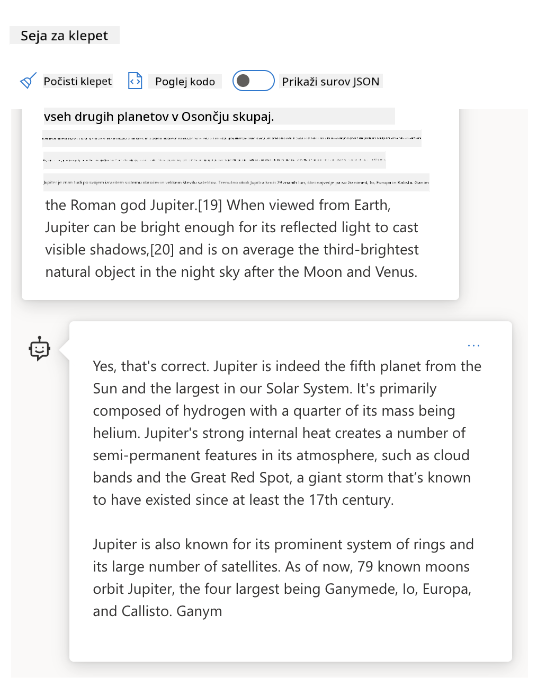

<!--
CO_OP_TRANSLATOR_METADATA:
{
  "original_hash": "8b3cb38518cf4fe7714d2f5e74dfa3eb",
  "translation_date": "2025-10-03T10:33:08+00:00",
  "source_file": "04-prompt-engineering-fundamentals/README.md",
  "language_code": "sl"
}
-->
# Osnove oblikovanja pozivov

[](https://aka.ms/gen-ai-lesson4-gh?WT.mc_id=academic-105485-koreyst)

## Uvod
Ta modul pokriva ključne koncepte in tehnike za ustvarjanje učinkovitih pozivov v generativnih AI modelih. Način, kako napišete svoj poziv za LLM, je pomemben. Skrbno oblikovan poziv lahko prinese bolj kakovostne odgovore. Kaj pa pravzaprav pomenijo izrazi, kot sta _poziv_ in _oblikovanje pozivov_? In kako izboljšati _vhodni poziv_, ki ga pošljemo LLM? To so vprašanja, na katera bomo poskušali odgovoriti v tem poglavju in naslednjem.

_Generativna umetna inteligenca_ je sposobna ustvarjati novo vsebino (npr. besedilo, slike, zvok, kodo itd.) kot odgovor na zahteve uporabnikov. To dosega z uporabo _velikih jezikovnih modelov_, kot je serija GPT ("Generative Pre-trained Transformer") podjetja OpenAI, ki so usposobljeni za uporabo naravnega jezika in kode.

Uporabniki lahko zdaj komunicirajo s temi modeli prek znanih paradigm, kot je klepet, brez potrebe po tehničnem znanju ali usposabljanju. Ti modeli temeljijo na _pozivih_ - uporabniki pošljejo besedilni vhod (poziv) in dobijo AI odgovor (dokončanje). Nato lahko "klepetajo z AI" iterativno, v večkratnih pogovorih, dokler odgovor ne ustreza njihovim pričakovanjem.

"Pozivi" postajajo primarni _programski vmesnik_ za aplikacije generativne umetne inteligence, ki modelom pove, kaj naj storijo, in vplivajo na kakovost vrnjenih odgovorov. "Oblikovanje pozivov" je hitro rastoče področje študija, ki se osredotoča na _oblikovanje in optimizacijo_ pozivov za dosledne in kakovostne odgovore na večji ravni.

## Cilji učenja

V tej lekciji se bomo naučili, kaj je oblikovanje pozivov, zakaj je pomembno in kako lahko oblikujemo bolj učinkovite pozive za določen model in cilj aplikacije. Razumeli bomo osnovne koncepte in najboljše prakse oblikovanja pozivov ter spoznali interaktivno okolje "sandbox" v Jupyter Notebookih, kjer lahko te koncepte uporabimo na resničnih primerih.

Do konca te lekcije bomo lahko:

1. Razložili, kaj je oblikovanje pozivov in zakaj je pomembno.
2. Opisali sestavne dele poziva in kako se uporabljajo.
3. Spoznali najboljše prakse in tehnike oblikovanja pozivov.
4. Uporabili naučene tehnike na resničnih primerih z uporabo OpenAI končne točke.

## Ključni izrazi

Oblikovanje pozivov: Praksa oblikovanja in izboljševanja vhodov za usmerjanje AI modelov k ustvarjanju želenih izhodov.
Tokenizacija: Proces pretvorbe besedila v manjše enote, imenovane tokeni, ki jih model lahko razume in obdeluje.
LLM-ji prilagojeni za navodila: Veliki jezikovni modeli (LLM-ji), ki so bili dodatno prilagojeni z določenimi navodili za izboljšanje natančnosti in ustreznosti njihovih odgovorov.

## Sandbox za učenje

Oblikovanje pozivov je trenutno bolj umetnost kot znanost. Najboljši način za izboljšanje intuicije je _več vadbe_ in sprejetje pristopa poskusov in napak, ki združuje strokovno znanje na področju aplikacij z priporočenimi tehnikami in optimizacijami, specifičnimi za model.

Jupyter Notebook, ki spremlja to lekcijo, ponuja okolje _sandbox_, kjer lahko sproti preizkušate, kar se naučite, ali kot del izziva s kodo na koncu. Za izvajanje vaj boste potrebovali:

1. **Azure OpenAI API ključ** - končno točko storitve za nameščen LLM.
2. **Python okolje** - v katerem lahko Notebook izvajate.
3. **Lokalne okoljske spremenljivke** - _izvedite korake [SETUP](./../00-course-setup/02-setup-local.md?WT.mc_id=academic-105485-koreyst) zdaj, da se pripravite_.

Notebook vsebuje _začetne_ vaje - vendar vas spodbujamo, da dodate svoje _Markdown_ (opisne) in _Code_ (zahteve za pozive) razdelke, da preizkusite več primerov ali idej ter zgradite svojo intuicijo za oblikovanje pozivov.

## Ilustrirani vodič

Želite dobiti širšo sliko o tem, kaj zajema ta lekcija, preden se poglobite? Oglejte si ta ilustrirani vodič, ki vam daje občutek glavnih tem, ki jih pokriva, in ključnih spoznanj, o katerih lahko razmislite pri vsaki. Načrt lekcije vas vodi od razumevanja osnovnih konceptov in izzivov do njihovega reševanja z ustreznimi tehnikami oblikovanja pozivov in najboljšimi praksami. Upoštevajte, da se oddelek "Napredne tehnike" v tem vodiču nanaša na vsebino, ki je zajeta v _naslednjem_ poglavju tega učnega načrta.


## Naša zagonska ideja

Zdaj pa se pogovorimo o tem, kako _ta tema_ sovpada z našim poslanstvom zagonskega podjetja [prinašati AI inovacije v izobraževanje](https://educationblog.microsoft.com/2023/06/collaborating-to-bring-ai-innovation-to-education?WT.mc_id=academic-105485-koreyst). Želimo graditi aplikacije, ki temeljijo na AI, za _personalizirano učenje_ - zato razmislimo, kako bi različni uporabniki naše aplikacije lahko "oblikovali" pozive:

- **Administratorji** bi lahko prosili AI, da _analizira podatke o učnem načrtu za prepoznavanje vrzeli v pokritosti_. AI lahko povzame rezultate ali jih vizualizira s kodo.
- **Učitelji** bi lahko prosili AI, da _ustvari učni načrt za ciljno občinstvo in temo_. AI lahko pripravi personaliziran načrt v določenem formatu.
- **Študenti** bi lahko prosili AI, da jih _poučuje o težki temi_. AI lahko zdaj vodi študente z lekcijami, namigi in primeri, prilagojenimi njihovi ravni.

To je le vrh ledene gore. Oglejte si [Prompts For Education](https://github.com/microsoft/prompts-for-edu/tree/main?WT.mc_id=academic-105485-koreyst) - odprtokodno knjižnico pozivov, ki so jo pripravili strokovnjaki za izobraževanje - da dobite širši občutek o možnostih! _Preizkusite nekaj teh pozivov v sandboxu ali z uporabo OpenAI Playgrounda, da vidite, kaj se zgodi!_

<!--
PREDLOGA LEKCIJE:
Ta enota naj pokriva osnovni koncept #1.
Okrepite koncept s primeri in referencami.

KONCEPT #1:
Oblikovanje pozivov.
Definirajte ga in razložite, zakaj je potreben.
-->

## Kaj je oblikovanje pozivov?

To lekcijo smo začeli z definiranjem **oblikovanja pozivov** kot procesa _oblikovanja in optimizacije_ besedilnih vhodov (pozivov) za dosledne in kakovostne odgovore (dokončanja) za določen cilj aplikacije in model. Na to lahko gledamo kot na dvostopenjski proces:

- _oblikovanje_ začetnega poziva za določen model in cilj
- _izboljševanje_ poziva iterativno za izboljšanje kakovosti odgovora

To je nujno proces poskusov in napak, ki zahteva intuicijo in trud uporabnika za dosego optimalnih rezultatov. Zakaj je torej pomembno? Da odgovorimo na to vprašanje, moramo najprej razumeti tri koncepte:

- _Tokenizacija_ = kako model "vidi" poziv
- _Osnovni LLM-ji_ = kako osnovni model "obdeluje" poziv
- _LLM-ji prilagojeni za navodila_ = kako model zdaj vidi "naloge"

### Tokenizacija

LLM vidi pozive kot _zaporedje tokenov_, kjer lahko različni modeli (ali različice modela) tokenizirajo isti poziv na različne načine. Ker so LLM-ji usposobljeni na tokenih (in ne na surovem besedilu), ima način, kako se pozivi tokenizirajo, neposreden vpliv na kakovost ustvarjenega odgovora.

Da dobite intuicijo o tem, kako deluje tokenizacija, preizkusite orodja, kot je [OpenAI Tokenizer](https://platform.openai.com/tokenizer?WT.mc_id=academic-105485-koreyst), prikazano spodaj. Kopirajte svoj poziv - in si oglejte, kako se pretvori v tokene, pri čemer bodite pozorni na obravnavo presledkov in ločilnih znakov. Upoštevajte, da ta primer prikazuje starejši LLM (GPT-3) - zato lahko preizkušanje z novejšim modelom prinese drugačen rezultat.


### Koncept: Osnovni modeli

Ko je poziv tokeniziran, je primarna funkcija ["osnovnega LLM-ja"](https://blog.gopenai.com/an-introduction-to-base-and-instruction-tuned-large-language-models-8de102c785a6?WT.mc_id=academic-105485-koreyst) (ali osnovnega modela) napovedovanje naslednjega tokena v tem zaporedju. Ker so LLM-ji usposobljeni na obsežnih besedilnih podatkovnih zbirkah, imajo dober občutek za statistične odnose med tokeni in lahko to napoved naredijo z določeno stopnjo zaupanja. Upoštevajte, da ne razumejo _pomena_ besed v pozivu ali tokenu; vidijo le vzorec, ki ga lahko "dokončajo" z naslednjo napovedjo. Lahko nadaljujejo z napovedovanjem zaporedja, dokler jih ne prekine uporabnik ali neka vnaprej določena pogoj.

Želite videti, kako deluje dokončanje na podlagi pozivov? Vnesite zgornji poziv v Azure OpenAI Studio [_Chat Playground_](https://oai.azure.com/playground?WT.mc_id=academic-105485-koreyst) z privzetimi nastavitvami. Sistem je konfiguriran za obravnavo pozivov kot zahtev za informacije - zato bi morali videti dokončanje, ki ustreza temu kontekstu.

Kaj pa, če bi uporabnik želel videti nekaj specifičnega, kar ustreza določenim kriterijem ali cilju naloge? Tukaj pridejo v poštev _LLM-ji prilagojeni za navodila_.



### Koncept: LLM-ji prilagojeni za navodila

[LLM prilagojen za navodila](https://blog.gopenai.com/an-introduction-to-base-and-instruction-tuned-large-language-models-8de102c785a6?WT.mc_id=academic-105485-koreyst) začne z osnovnim modelom in ga dodatno prilagodi z zgledi ali pari vhodov/izhodov (npr. večkratnimi "sporočili"), ki lahko vsebujejo jasna navodila - in odgovor AI poskuša slediti tem navodilom.

To uporablja tehnike, kot je okrepitev učenja s povratnimi informacijami ljudi (RLHF), ki lahko model usposobijo za _sledenje navodilom_ in _učenje iz povratnih informacij_, tako da ustvari odgovore, ki so bolj primerni za praktične aplikacije in bolj relevantni za cilje uporabnikov.

Poskusimo - ponovno uporabite zgornji poziv, vendar zdaj spremenite _sistemsko sporočilo_, da zagotovite naslednje navodilo kot kontekst:

> _Povzemite vsebino, ki vam je na voljo, za učenca drugega razreda. Rezultat naj bo en odstavek s 3-5 točkami._

Opazite, kako je rezultat zdaj prilagojen, da odraža želeni cilj in format? Učitelj lahko zdaj neposredno uporabi ta odgovor v svojih diapozitivih za tisti razred.


## Zakaj potrebujemo oblikovanje pozivov?

Zdaj, ko vemo, kako LLM-ji obdelujejo pozive, se pogovorimo o _zakaj_ potrebujemo oblikovanje pozivov. Odgovor leži v dejstvu, da trenutni LLM-ji predstavljajo številne izzive, zaradi katerih je _zanesljivo in dosledno dokončanje_ težje doseči brez vloženega truda v oblikovanje in optimizacijo pozivov. Na primer:

1. **Odgovori modela so stohastični.** _Isti poziv_ bo verjetno prinesel različne odgovore z različnimi modeli ali različicami modelov. In lahko celo prinese različne rezultate z _istim modelom_ ob različnih časih. _Tehnike oblikovanja pozivov nam lahko pomagajo zmanjšati te variacije z zagotavljanjem boljših varoval_.

1. **Modeli lahko izmišljajo odgovore.** Modeli so predhodno usposobljeni z _velikimi, a končnimi_ podatkovnimi zbirkami, kar pomeni, da nimajo znanja o konceptih zunaj tega obsega usposabljanja. Posledično lahko ustvarijo dokončanja, ki so netočna, izmišljena ali neposredno nasprotujoča znanim dejstvom. _Tehnike oblikovanja pozivov pomagajo uporabnikom prepoznati in ublažiti takšne izmišljotine, npr. z zahtevo po citatih ali razmišljanju AI_.

1. **Zmožnosti modelov se razlikujejo.** Novejši modeli ali generacije modelov bodo imeli bogatejše zmožnosti, vendar prinašajo tudi edinstvene posebnosti in kompromise glede stroškov in kompleksnosti. _Oblikovanje pozivov nam lahko pomaga razviti najboljše prakse in delovne tokove, ki abstrahirajo razlike in se prilagodijo zahtevam, specifičnim za model, na skalabilen in brezhiben način_.

Poglejmo to v praksi v OpenAI ali Azure OpenAI Playgroundu:

- Uporabite isti poziv z različnimi LLM namestitvami (npr. OpenAI, Azure OpenAI, Hugging Face) - ste opazili variacije?
- Uporabite isti poziv večkrat z _isto_ LLM namestitvijo (npr. Azure OpenAI Playground) - kako so se te variacije razlikovale?

### Primer izmišljotin

V tem tečaju uporabljamo izraz **"izmišljotina"** za poimenovanje pojava, ko LLM-ji včasih ustvarijo dejansko napačne informacije zaradi omejitev v njihovem usposabljanju ali drugih omejitev. Morda ste to zasledili tudi kot _"halucinacije"_ v popularnih člankih ali raziskovalnih dokumentih. Vendar močno priporočamo uporabo izraza _"izmišljotina"_, da ne bi nehote antropomorfizirali vedenja z dodeljevanjem človeške lastnosti rezultatu, ki ga poganja stroj. To tudi krepi [smernice za odgovorno AI](https://www.microsoft.com/ai/responsible-ai?WT.mc_id=academic-105485-koreyst) z vidika terminologije, saj odstranjuje izraze, ki bi lahko bili v nekaterih kontekstih žaljivi ali neinkluzivni.

Želite dobiti občutek, kako delujejo izmišljotine? Pomislite na poziv, ki AI-ju naroči, naj ustvari vsebino za neobstoječo temo (da zagotovite, da ni v podatkovni zbirki za usposabljanje). Na primer - poskusil sem ta poziv:

> **Poziv:** ustvari učni načrt o Marsovski vojni leta 2076.
Spletno iskanje mi je pokazalo, da obstajajo izmišljeni zapisi (npr. televizijske serije ali knjige) o vojnah na Marsu – vendar noben iz leta 2076. Zdrava pamet nam tudi pove, da je leto 2076 _v prihodnosti_ in zato ne more biti povezano z resničnim dogodkom.

Kaj se zgodi, ko ta poziv izvedemo z različnimi ponudniki LLM?

> **Odgovor 1**: OpenAI Playground (GPT-35)


> **Odgovor 2**: Azure OpenAI Playground (GPT-35)


> **Odgovor 3**: Hugging Face Chat Playground (LLama-2)


Kot pričakovano, vsak model (ali različica modela) ustvari nekoliko drugačne odgovore zaradi stohastičnega vedenja in razlik v zmogljivostih modelov. Na primer, en model cilja na občinstvo osmega razreda, medtem ko drugi predvideva dijake srednje šole. Vendar so vsi trije modeli ustvarili odgovore, ki bi lahko prepričali neinformiranega uporabnika, da je dogodek resničen.

Tehnike oblikovanja pozivov, kot sta _metaprompting_ in _konfiguracija temperature_, lahko do neke mere zmanjšajo izmišljene odgovore modelov. Nove arhitekture oblikovanja pozivov prav tako vključujejo nova orodja in tehnike v tok pozivov, da ublažijo ali zmanjšajo nekatere od teh učinkov.

## Študija primera: GitHub Copilot

Zaključimo ta razdelek z vpogledom v to, kako se oblikovanje pozivov uporablja v resničnih rešitvah, tako da si ogledamo eno študijo primera: [GitHub Copilot](https://github.com/features/copilot?WT.mc_id=academic-105485-koreyst).

GitHub Copilot je vaš "AI parni programer" – pretvori besedilne pozive v dopolnitve kode in je integriran v vaše razvojno okolje (npr. Visual Studio Code) za brezhibno uporabniško izkušnjo. Kot je dokumentirano v seriji spodnjih blogov, je bila najzgodnejša različica zasnovana na modelu OpenAI Codex – inženirji pa so hitro ugotovili potrebo po prilagoditvi modela in razvoju boljših tehnik oblikovanja pozivov za izboljšanje kakovosti kode. Julija so [predstavili izboljšan AI model, ki presega Codex](https://github.blog/2023-07-28-smarter-more-efficient-coding-github-copilot-goes-beyond-codex-with-improved-ai-model/?WT.mc_id=academic-105485-koreyst) za še hitrejše predloge.

Preberite objave po vrsti, da sledite njihovi poti učenja.

- **Maj 2023** | [GitHub Copilot postaja boljši pri razumevanju vaše kode](https://github.blog/2023-05-17-how-github-copilot-is-getting-better-at-understanding-your-code/?WT.mc_id=academic-105485-koreyst)
- **Maj 2023** | [Znotraj GitHuba: Delo z LLM-ji za GitHub Copilot](https://github.blog/2023-05-17-inside-github-working-with-the-llms-behind-github-copilot/?WT.mc_id=academic-105485-koreyst).
- **Junij 2023** | [Kako napisati boljše pozive za GitHub Copilot](https://github.blog/2023-06-20-how-to-write-better-prompts-for-github-copilot/?WT.mc_id=academic-105485-koreyst).
- **Julij 2023** | [.. GitHub Copilot presega Codex z izboljšanim AI modelom](https://github.blog/2023-07-28-smarter-more-efficient-coding-github-copilot-goes-beyond-codex-with-improved-ai-model/?WT.mc_id=academic-105485-koreyst)
- **Julij 2023** | [Razvijalčev vodič za oblikovanje pozivov in LLM-je](https://github.blog/2023-07-17-prompt-engineering-guide-generative-ai-llms/?WT.mc_id=academic-105485-koreyst)
- **September 2023** | [Kako zgraditi podjetniško aplikacijo LLM: Lekcije iz GitHub Copilot](https://github.blog/2023-09-06-how-to-build-an-enterprise-llm-application-lessons-from-github-copilot/?WT.mc_id=academic-105485-koreyst)

Lahko pa brskate po njihovem [inženirskem blogu](https://github.blog/category/engineering/?WT.mc_id=academic-105485-koreyst) za več objav, kot je [ta](https://github.blog/2023-09-27-how-i-used-github-copilot-chat-to-build-a-reactjs-gallery-prototype/?WT.mc_id=academic-105485-koreyst), ki prikazuje, kako se ti modeli in tehnike _uporabljajo_ za poganjanje resničnih aplikacij.

---

## Oblikovanje pozivov

Videli smo, zakaj je oblikovanje pozivov pomembno – zdaj pa razumimo, kako so pozivi _sestavljeni_, da lahko ocenimo različne tehnike za bolj učinkovito oblikovanje pozivov.

### Osnovni poziv

Začnimo z osnovnim pozivom: besedilni vnos, poslan modelu brez dodatnega konteksta. Tukaj je primer – ko pošljemo prve besede ameriške državne himne OpenAI [Completion API](https://platform.openai.com/docs/api-reference/completions?WT.mc_id=academic-105485-koreyst), takoj _dopolni_ odgovor z naslednjimi vrsticami, kar ponazarja osnovno vedenje napovedovanja.

| Poziv (Vnos)     | Dopolnitev (Izhod)                                                                                                                        |
| :--------------- | :---------------------------------------------------------------------------------------------------------------------------------------- |
| Oh say can you see | Zdi se, da začenjate besedilo "The Star-Spangled Banner", državne himne Združenih držav Amerike. Celotno besedilo je ... |

### Kompleksen poziv

Zdaj dodajmo kontekst in navodila k temu osnovnemu pozivu. [Chat Completion API](https://learn.microsoft.com/azure/ai-services/openai/how-to/chatgpt?WT.mc_id=academic-105485-koreyst) nam omogoča sestavo kompleksnega poziva kot zbirko _sporočil_ z:

- Pari vhod/izhod, ki odražajo _uporabniški_ vnos in _odgovor asistenta_.
- Sistemskim sporočilom, ki določa kontekst za vedenje ali osebnost asistenta.

Zahteva je zdaj v spodnji obliki, kjer _tokenizacija_ učinkovito zajame ustrezne informacije iz konteksta in pogovora. Spreminjanje sistemskega konteksta je lahko enako vplivno na kakovost dopolnitev kot podani uporabniški vnosi.

```python
response = openai.chat.completions.create(
    model="gpt-3.5-turbo",
    messages=[
        {"role": "system", "content": "You are a helpful assistant."},
        {"role": "user", "content": "Who won the world series in 2020?"},
        {"role": "assistant", "content": "The Los Angeles Dodgers won the World Series in 2020."},
        {"role": "user", "content": "Where was it played?"}
    ]
)
```

### Navodila v pozivu

V zgornjih primerih je bil uporabniški poziv preprost besedilni poizvedek, ki ga je mogoče interpretirati kot zahtevo po informacijah. Z _navodili_ v pozivu lahko uporabimo besedilo za podrobnejšo specifikacijo naloge, kar AI-ju zagotovi boljše usmerjanje. Tukaj je primer:

| Poziv (Vnos)                                                                                                                                                                                                                         | Dopolnitev (Izhod)                                                                                                        | Vrsta navodila      |
| :------------------------------------------------------------------------------------------------------------------------------------------------------------------------------------------------------------------------------------- | :------------------------------------------------------------------------------------------------------------------------- | :------------------ |
| Napiši opis državljanske vojne                                                                                                                                                                                                   | _vrnjen je bil preprost odstavek_                                                                                              | Preprosto              |
| Napiši opis državljanske vojne. Navedi ključne datume in dogodke ter opiši njihov pomen                                                                                                                                     | _vrnjen je bil odstavek, ki mu je sledil seznam ključnih datumov dogodkov z opisi_                                             | Kompleksno             |
| Napiši opis državljanske vojne v 1 odstavku. Navedi 3 točke z ključnimi datumi in njihovim pomenom. Navedi še 3 točke s ključnimi zgodovinskimi osebnostmi in njihovimi prispevki. Vrni izhod kot datoteko JSON | _vrnjen je bil obsežnejši opis v besedilnem polju, formatiran kot JSON, ki ga lahko kopirate in prilepite v datoteko ter po potrebi preverite_ | Kompleksno. Formatirano. |

## Primarna vsebina

V zgornjih primerih je bil poziv še vedno precej odprt, kar je LLM-ju omogočilo, da sam odloči, kateri del njegovega predhodno usposobljenega nabora podatkov je ustrezen. Z oblikovalskim vzorcem _primarne vsebine_ je vhodno besedilo razdeljeno na dva dela:

- navodilo (dejanje)
- ustrezna vsebina (ki vpliva na dejanje)

Tukaj je primer, kjer je navodilo "povzemi to v 2 stavkih".

| Poziv (Vnos)                                                                                                                                                                                                                                                                                                                                                                                                                                                                                                                                                                                                                                                                                      | Dopolnitev (Izhod)                                                                                                                                                                                                                                                                             |
| :-------------------------------------------------------------------------------------------------------------------------------------------------------------------------------------------------------------------------------------------------------------------------------------------------------------------------------------------------------------------------------------------------------------------------------------------------------------------------------------------------------------------------------------------------------------------------------------------------------------------------------------------------------------------------------------------------- | :---------------------------------------------------------------------------------------------------------------------------------------------------------------------------------------------------------------------------------------------------------------------------------------------- |
| Jupiter je peti planet od Sonca in največji v Osončju. Je plinasti velikan z maso, ki je tisočinka mase Sonca, vendar dvainpolkrat večja od mase vseh drugih planetov v Osončju skupaj. Jupiter je eden najsvetlejših objektov, vidnih s prostim očesom na nočnem nebu, in je znan starodavnim civilizacijam že pred zapisano zgodovino. Imenovan je po rimskem bogu Jupiterju.[19] Ko ga opazujemo z Zemlje, je Jupiter lahko dovolj svetel, da njegova odbita svetloba meče vidne sence,[20] in je povprečno tretji najsvetlejši naravni objekt na nočnem nebu po Luni in Veneri. <br/> **Povzemi to v 2 kratkih stavkih** | Jupiter, peti planet od Sonca, je največji v Osončju in je znan kot eden najsvetlejših objektov na nočnem nebu. Imenovan po rimskem bogu Jupiterju, je plinasti velikan, katerega masa je dvainpolkrat večja od mase vseh drugih planetov v Osončju skupaj. |

Segment primarne vsebine se lahko uporablja na različne načine za bolj učinkovita navodila:

- **Primeri** – namesto da modelu povemo, kaj naj naredi z eksplicitnim navodilom, mu podamo primere, kaj naj naredi, in mu pustimo, da sklepa vzorec.
- **Namigi** – sledimo navodilu z "namigom", ki usmeri dopolnitev, kar model vodi k bolj ustreznim odgovorom.
- **Predloge** – to so ponovljivi 'recepti' za pozive s spremenljivkami (parametri), ki jih je mogoče prilagoditi z podatki za specifične primere uporabe.

Raziskujmo te v praksi.

### Uporaba primerov

To je pristop, kjer uporabimo primarno vsebino za "hranjenje modela" z nekaj primeri želenega izhoda za dano navodilo in mu pustimo, da sklepa vzorec za želeni izhod. Glede na število podanih primerov imamo pozivanje brez primerov, z enim primerom, z nekaj primeri itd.

Poziv zdaj vsebuje tri komponente:

- Opis naloge
- Nekaj primerov želenega izhoda
- Začetek novega primera (ki postane implicitni opis naloge)

| Vrsta učenja | Poziv (Vnos)                                                                                                                                        | Dopolnitev (Izhod)         |
| :----------- | :-------------------------------------------------------------------------------------------------------------------------------------------------- | :------------------------- |
| Brez primerov | "The Sun is Shining". Prevedi v španščino                                                                                                            | "El Sol está brillando".    |
| Z enim primerom | "The Sun is Shining" => ""El Sol está brillando". <br> "It's a Cold and Windy Day" =>                                                                 | "Es un día frío y ventoso". |
| Z nekaj primeri | Igralec je tekel po bazah => Baseball <br/> Igralec je zadel as => Tenis <br/> Igralec je zadel šestico => Kriket <br/> Igralec je dosegel zabijanje => | Košarka                    |
|               |                                                                                                                                                     |                             |

Opazite, kako smo morali podati eksplicitno navodilo ("Prevedi v španščino") pri pozivanju brez primerov, vendar se to sklepa pri pozivanju z enim primerom. Primer z nekaj primeri prikazuje, kako dodajanje več primerov omogoča modelom, da naredijo bolj natančne sklepe brez dodatnih navodil.

### Namigi v pozivu

Druga tehnika za uporabo primarne vsebine je podajanje _namigov_ namesto primerov. V tem primeru modelu podamo _začetek_, ki odraža želeno obliko odgovora. Model nato "sprejme namig" in nadaljuje v tej smeri.

| Število namigov | Poziv (Vnos)                                                                                                                                                                                                                                                                                                                                                                                                                                               | Dopolnitev (Izhod)                                                                                                                                                                                                                                                                                       |
| :------------- | :----------------------------------------------------------------------------------------------------------------------------------------------------------------------------------------------------------------------------------------------------------------------------------------------------------------------------------------------------------------------------------------------------------------------------------------------------------- | :-------------------------------------------------------------------------------------------------------------------------------------------------------------------------------------------------------------------------------------------------------------------------------------------------------- |
| 0              | Jupiter je peti planet od Sonca in največji v Osončju. Je plinasti velikan z maso, ki je tisočinka mase Sonca, vendar dvainpolkrat večja od mase vseh drugih planetov v Osončju skupaj. Jupiter je eden najsvetlejših objektov, vidnih s prostim očesom na nočnem nebu, in je znan starodavnim civilizacijam že pred zapisano zgodovino. <br/>**Povzemi to**                                       | Jupiter je največji planet v našem Osončju in peti od Sonca. Je plinasti velikan z maso, ki je 1/1000 mase Sonca, vendar je težji od vseh drugih planetov skupaj. Starodavne civilizacije poznajo Jupiter že dolgo časa, in je zlahka viden na nočnem nebu. |
| 1              | Jupiter je peti planet od Sonca in največji v Osončju. Je plinasti velikan z maso, ki je tisočinka mase Sonca, vendar dva in pol krat večja od mase vseh drugih planetov v Osončju skupaj. Jupiter je eden najsvetlejših objektov, vidnih s prostim očesom na nočnem nebu, in je bil poznan starodavnim civilizacijam že pred zapisano zgodovino. <br/>**Povzemi to** <br/> Naučili smo se, da je Jupiter | peti planet od Sonca in največji v Osončju. Je plinasti velikan z maso, ki je tisočinka mase Sonca, vendar dva in pol krat večja od mase vseh drugih planetov skupaj. Je zlahka viden s prostim očesom in je bil poznan že v starodavnih časih.                        |
| 2              | Jupiter je peti planet od Sonca in največji v Osončju. Je plinasti velikan z maso, ki je tisočinka mase Sonca, vendar dva in pol krat večja od mase vseh drugih planetov v Osončju skupaj. Jupiter je eden najsvetlejših objektov, vidnih s prostim očesom na nočnem nebu, in je bil poznan starodavnim civilizacijam že pred zapisano zgodovino. <br/>**Povzemi to** <br/> Top 3 dejstva, ki smo jih izvedeli:         | 1. Jupiter je peti planet od Sonca in največji v Osončju. <br/> 2. Je plinasti velikan z maso, ki je tisočinka mase Sonca...<br/> 3. Jupiter je bil viden s prostim očesom že v starodavnih časih ...                                                                       |
|                |                                                                                                                                                                                                                                                                                                                                                                                                                                                              |                                                                                                                                                                                                                                                                                                           |

### Predloge za pozive

Predloga za poziv je _vnaprej določena receptura za poziv_, ki jo je mogoče shraniti in ponovno uporabiti po potrebi, da se zagotovi bolj dosledna uporabniška izkušnja na večji ravni. V svoji najpreprostejši obliki je to zgolj zbirka primerov pozivov, kot je [ta primer iz OpenAI](https://platform.openai.com/examples?WT.mc_id=academic-105485-koreyst), ki vključuje interaktivne komponente poziva (sporočila uporabnika in sistema) ter format zahteve prek API-ja - za podporo ponovni uporabi.

V bolj kompleksni obliki, kot je [ta primer iz LangChain](https://python.langchain.com/docs/concepts/prompt_templates/?WT.mc_id=academic-105485-koreyst), vsebuje _rezervirana mesta_, ki jih je mogoče zamenjati s podatki iz različnih virov (uporabniški vnos, sistemski kontekst, zunanji viri podatkov itd.), da se poziv dinamično ustvari. To nam omogoča ustvarjanje knjižnice ponovljivih pozivov, ki jih je mogoče uporabiti za dosledno uporabniško izkušnjo **programsko** na večji ravni.

Nazadnje, prava vrednost predlog se kaže v sposobnosti ustvarjanja in objavljanja _knjižnic pozivov_ za vertikalne aplikacijske domene - kjer je predloga poziva zdaj _optimizirana_, da odraža aplikacijsko specifičen kontekst ali primere, ki naredijo odgovore bolj relevantne in natančne za ciljno uporabniško občinstvo. [Prompts For Edu](https://github.com/microsoft/prompts-for-edu?WT.mc_id=academic-105485-koreyst) je odličen primer tega pristopa, saj kurira knjižnico pozivov za izobraževalno področje s poudarkom na ključnih ciljih, kot so načrtovanje lekcij, oblikovanje učnega načrta, tutorstvo študentov itd.

## Podporna vsebina

Če razmišljamo o konstrukciji pozivov kot o navodilu (nalogi) in cilju (primarni vsebini), potem je _sekundarna vsebina_ kot dodatni kontekst, ki ga zagotovimo, da **vplivamo na izhod na določen način**. To so lahko parametri za prilagajanje, navodila za formatiranje, taksonomije tem itd., ki lahko modelu pomagajo _prilagoditi_ svoj odgovor, da ustreza želenim ciljem ali pričakovanjem uporabnika.

Na primer: Glede na katalog tečajev z obsežnimi metapodatki (ime, opis, raven, metapodatkovne oznake, inštruktor itd.) o vseh razpoložljivih tečajih v učnem načrtu:

- lahko definiramo navodilo za "povzemi katalog tečajev za jesen 2023"
- lahko uporabimo primarno vsebino za zagotavljanje nekaj primerov želenega izhoda
- lahko uporabimo sekundarno vsebino za identifikacijo top 5 "oznak" interesa.

Zdaj lahko model zagotovi povzetek v formatu, prikazanem v nekaj primerih - vendar če rezultat vsebuje več oznak, lahko prioritizira 5 oznak, identificiranih v sekundarni vsebini.

---

<!--
PREDLOGA LEKCIJE:
Ta enota naj pokriva osnovni koncept #1.
Okrepite koncept s primeri in referencami.

KONCEPT #3:
Tehnike za oblikovanje pozivov.
Katere so osnovne tehnike za oblikovanje pozivov?
Ponazorite jih z vajami.
-->

## Najboljše prakse za oblikovanje pozivov

Zdaj, ko vemo, kako lahko pozive _konstruiramo_, lahko začnemo razmišljati o tem, kako jih _oblikovati_, da odražajo najboljše prakse. To lahko razdelimo na dva dela - imeti pravo _miselnost_ in uporabljati prave _tehnike_.

### Miselnost pri oblikovanju pozivov

Oblikovanje pozivov je proces poskusov in napak, zato imejte v mislih tri široke vodilne dejavnike:

1. **Razumevanje domene je pomembno.** Natančnost in ustreznost odgovora sta funkciji _domene_, v kateri aplikacija ali uporabnik deluje. Uporabite svojo intuicijo in strokovno znanje o domeni za **nadaljnjo prilagoditev tehnik**. Na primer, definirajte _osebnosti, specifične za domeno_ v sistemskih pozivih ali uporabite _predloge, specifične za domeno_ v uporabniških pozivih. Zagotovite sekundarno vsebino, ki odraža kontekste, specifične za domeno, ali uporabite _namige in primere, specifične za domeno_, da model usmerite k znanim vzorcem uporabe.

2. **Razumevanje modela je pomembno.** Vemo, da so modeli po naravi stohastični. Toda implementacije modelov se lahko razlikujejo glede na podatkovne nabore, ki jih uporabljajo za učenje (predhodno naučeno znanje), zmogljivosti, ki jih zagotavljajo (npr. prek API-ja ali SDK-ja), in vrsto vsebine, za katero so optimizirani (npr. koda proti slikam proti besedilu). Razumite prednosti in omejitve modela, ki ga uporabljate, ter uporabite to znanje za _prioritizacijo nalog_ ali gradnjo _prilagojenih predlog_, ki so optimizirane za zmogljivosti modela.

3. **Iteracija in validacija sta pomembni.** Modeli se hitro razvijajo, prav tako pa tudi tehnike za oblikovanje pozivov. Kot strokovnjak za domeno imate morda druge kontekste ali kriterije, specifične za _vašo_ aplikacijo, ki morda ne veljajo za širšo skupnost. Uporabite orodja in tehnike za oblikovanje pozivov, da "pospešite" konstrukcijo pozivov, nato iterirajte in validirajte rezultate z lastno intuicijo in strokovnim znanjem o domeni. Zabeležite svoje vpoglede in ustvarite **bazo znanja** (npr. knjižnice pozivov), ki jih lahko drugi uporabijo kot novo izhodišče za hitrejše iteracije v prihodnosti.

## Najboljše prakse

Poglejmo zdaj običajne najboljše prakse, ki jih priporočajo [OpenAI](https://help.openai.com/en/articles/6654000-best-practices-for-prompt-engineering-with-openai-api?WT.mc_id=academic-105485-koreyst) in [Azure OpenAI](https://learn.microsoft.com/azure/ai-services/openai/concepts/prompt-engineering#best-practices?WT.mc_id=academic-105485-koreyst) praktiki.

| Kaj                               | Zakaj                                                                                                                                                                                                                                               |
| :-------------------------------- | :------------------------------------------------------------------------------------------------------------------------------------------------------------------------------------------------------------------------------------------------ |
| Ocenite najnovejše modele.        | Nove generacije modelov verjetno imajo izboljšane funkcije in kakovost - vendar lahko povzročijo tudi višje stroške. Ocenite njihov vpliv, nato sprejmite odločitve o migraciji.                                                                    |
| Ločite navodila in kontekst       | Preverite, ali vaš model/ponudnik definira _ločilnike_, da bolj jasno loči navodila, primarno in sekundarno vsebino. To lahko modelom pomaga natančneje dodeliti uteži tokenom.                                                                       |
| Bodite specifični in jasni        | Podajte več podrobnosti o želenem kontekstu, izidu, dolžini, formatu, slogu itd. To bo izboljšalo tako kakovost kot doslednost odgovorov. Zajemite recepture v ponovljivih predlogah.                                                                |
| Bodite opisni, uporabite primere  | Modeli se lahko bolje odzovejo na pristop "pokaži in povej". Začnite z `zero-shot` pristopom, kjer podate navodilo (brez primerov), nato poskusite `few-shot` kot izboljšavo, pri čemer podate nekaj primerov želenega izhoda. Uporabite analogije. |
| Uporabite namige za začetek       | Usmerite ga k želenemu izidu tako, da mu podate nekaj začetnih besed ali fraz, ki jih lahko uporabi kot izhodišče za odgovor.                                                                                                                       |
| Ponavljajte                      | Včasih boste morali modelu ponoviti navodila. Podajte navodila pred in po primarni vsebini, uporabite navodilo in namig itd. Iterirajte in validirajte, da vidite, kaj deluje.                                                                       |
| Vrstni red je pomemben            | Vrstni red, v katerem predstavite informacije modelu, lahko vpliva na izhod, tudi v učnih primerih, zaradi pristranskosti do nedavnosti. Poskusite različne možnosti, da vidite, kaj deluje najbolje.                                               |
| Dajte modelu "izhod"              | Modelu podajte _rezervni_ odgovor, ki ga lahko poda, če naloge ne more dokončati iz kakršnega koli razloga. To lahko zmanjša možnosti, da modeli ustvarijo napačne ali izmišljene odgovore.                                                         |
|                                   |                                                                                                                                                                                                                                                   |

Kot pri vsaki najboljši praksi, ne pozabite, da _vaša izkušnja lahko variira_ glede na model, nalogo in domeno. Uporabite jih kot izhodišče in iterirajte, da ugotovite, kaj deluje najbolje za vas. Nenehno ponovno ocenjujte svoj proces oblikovanja pozivov, ko postanejo na voljo novi modeli in orodja, s poudarkom na skalabilnosti procesa in kakovosti odgovorov.

<!--
PREDLOGA LEKCIJE:
Ta enota naj zagotovi izziv s kodo, če je primerno.

IZZIV:
Povezava do Jupyter Notebooka z le komentarji kode v navodilih (odseki kode so prazni).

REŠITEV:
Povezava do kopije tega Notebooka z izpolnjenimi pozivi in izvedenimi, ki prikazuje, kaj bi lahko bil en primer.
-->

## Naloga

Čestitke! Prišli ste do konca lekcije! Čas je, da preizkusite nekatere od teh konceptov in tehnik z resničnimi primeri!

Za našo nalogo bomo uporabili Jupyter Notebook z vajami, ki jih lahko interaktivno dokončate. Notebook lahko razširite tudi z lastnimi Markdown in Code celicami, da sami raziščete ideje in tehnike.

### Za začetek, forkajte repozitorij, nato

- (Priporočeno) Zaženite GitHub Codespaces
- (Alternativno) Klonirajte repozitorij na svojo lokalno napravo in ga uporabite z Docker Desktop
- (Alternativno) Odprite Notebook z vašo najljubšo okolico za zagon Notebookov.

### Nato konfigurirajte svoje okoljske spremenljivke

- Kopirajte `.env.copy` datoteko v korenu repozitorija v `.env` in izpolnite vrednosti `AZURE_OPENAI_API_KEY`, `AZURE_OPENAI_ENDPOINT` in `AZURE_OPENAI_DEPLOYMENT`. Vrnite se na [sekcijo Sandbox za učenje](../../../04-prompt-engineering-fundamentals/04-prompt-engineering-fundamentals), da se naučite kako.

### Nato odprite Jupyter Notebook

- Izberite jedro za zagon. Če uporabljate možnosti 1 ali 2, preprosto izberite privzeto Python 3.10.x jedro, ki ga zagotavlja razvojna vsebina.

Vse je pripravljeno za izvajanje vaj. Upoštevajte, da tukaj ni _pravih in napačnih_ odgovorov - gre zgolj za raziskovanje možnosti s poskusi in napakami ter gradnjo intuicije za to, kaj deluje za določen model in aplikacijsko domeno.

_Zaradi tega v tej lekciji ni segmentov z rešitvami kode. Namesto tega bo Notebook vseboval Markdown celice z naslovom "Moja rešitev:", ki prikazuje en primer izhoda za referenco._

 <!--
PREDLOGA LEKCIJE:
Zaključite sekcijo s povzetkom in viri za samostojno učenje.
-->

## Preverjanje znanja

Kateri od naslednjih je dober poziv, ki sledi nekaterim razumnim najboljšim praksam?

1. Pokaži mi sliko rdečega avtomobila
2. Pokaži mi sliko rdečega avtomobila znamke Volvo in modela XC90, parkiranega ob pečini ob sončnem zahodu
3. Pokaži mi sliko rdečega avtomobila znamke Volvo in modela XC90

A: 2, to je najboljši poziv, saj podaja podrobnosti o "kaj" in gre v specifike (ne samo kateri koli avto, ampak določeno znamko in model), prav tako pa opisuje celotno okolje. 3 je naslednji najboljši, saj vsebuje veliko opisov.

## 🚀 Izziv

Poskusite uporabiti tehniko "namiga" s pozivom: Dokončaj stavek "Pokaži mi sliko rdečega avtomobila znamke Volvo in ". Kaj odgovori, in kako bi to izboljšali?

## Odlično delo! Nadaljujte z učenjem

Želite izvedeti več o različnih konceptih oblikovanja pozivov? Obiščite [stran za nadaljnje učenje](https://aka.ms/genai-collection?WT.mc_id=academic-105485-koreyst), da najdete druge odlične vire na to temo.

Pojdite na lekcijo 5, kjer bomo obravnavali [napredne tehnike oblikovanja pozivov](../05-advanced-prompts/README.md?WT.mc_id=academic-105485-koreyst)!

---

**Omejitev odgovornosti**:  
Ta dokument je bil preveden z uporabo storitve AI za prevajanje [Co-op Translator](https://github.com/Azure/co-op-translator). Čeprav si prizadevamo za natančnost, vas prosimo, da upoštevate, da lahko avtomatizirani prevodi vsebujejo napake ali netočnosti. Izvirni dokument v njegovem izvirnem jeziku je treba obravnavati kot avtoritativni vir. Za ključne informacije priporočamo profesionalni človeški prevod. Ne prevzemamo odgovornosti za morebitna nesporazumevanja ali napačne razlage, ki izhajajo iz uporabe tega prevoda.