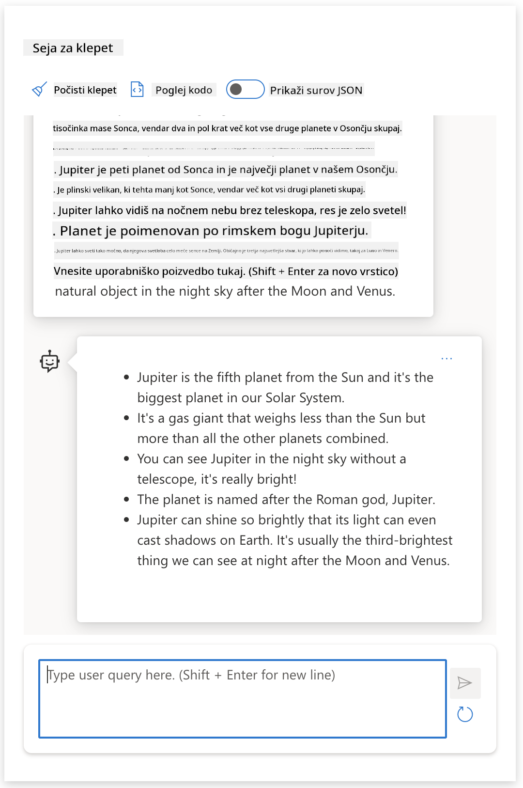
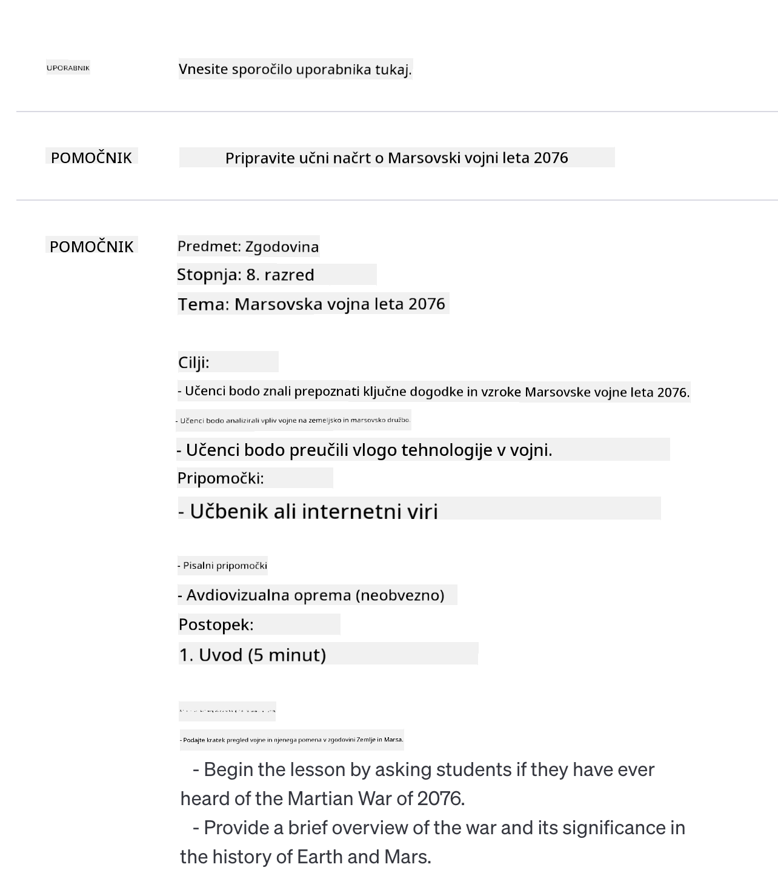
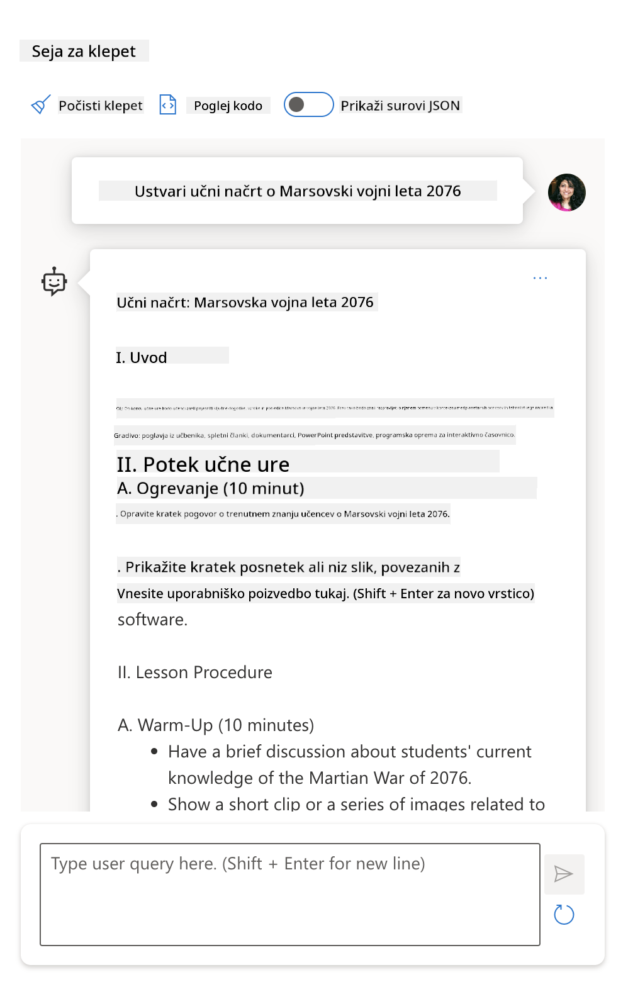

<!--
CO_OP_TRANSLATOR_METADATA:
{
  "original_hash": "a45c318dc6ebc2604f35b8b829f93af2",
  "translation_date": "2025-07-09T11:13:59+00:00",
  "source_file": "04-prompt-engineering-fundamentals/README.md",
  "language_code": "sl"
}
-->
# Osnove oblikovanja pozivov (Prompt Engineering)

[](https://aka.ms/gen-ai-lesson4-gh?WT.mc_id=academic-105485-koreyst)

## Uvod  
Ta modul zajema ključne pojme in tehnike za ustvarjanje učinkovitih pozivov v generativnih AI modelih. Pomembno je tudi, kako napišete svoj poziv za LLM. Dobro zasnovan poziv lahko prinese bolj kakovosten odgovor. Kaj pa pravzaprav pomenita izraza _poziv_ in _oblikovanje pozivov_? In kako izboljšati poziv (_input_), ki ga pošljemo LLM? Na ta vprašanja bomo poskušali odgovoriti v tem in naslednjem poglavju.

_Generativna AI_ je sposobna ustvarjati novo vsebino (npr. besedilo, slike, zvok, kodo itd.) kot odziv na uporabniške zahteve. To dosega z uporabo _velikih jezikovnih modelov_ (LLM), kot je serija GPT podjetja OpenAI ("Generative Pre-trained Transformer"), ki so usposobljeni za uporabo naravnega jezika in kode.

Uporabniki lahko zdaj z modeli komunicirajo preko znanih načinov, kot je klepet, brez potrebe po tehničnem znanju ali usposabljanju. Modeli so _pozivno usmerjeni_ – uporabniki pošljejo besedilni vhod (poziv) in prejmejo AI odgovor (dopolnilo). Nato lahko z AI "klepetajo" večkrat zapored, izboljšujejo svoj poziv, dokler odgovor ne ustreza njihovim pričakovanjem.

"Pozivi" so zdaj glavni _programski vmesnik_ za generativne AI aplikacije, saj modelom povedo, kaj naj naredijo, in vplivajo na kakovost vrnjenih odgovorov. "Oblikovanje pozivov" je hitro rastoče področje, ki se osredotoča na _načrtovanje in optimizacijo_ pozivov za zagotavljanje doslednih in kakovostnih odgovorov v velikem obsegu.

## Cilji učenja

V tej lekciji se bomo naučili, kaj je oblikovanje pozivov, zakaj je pomembno in kako lahko ustvarimo učinkovitejše pozive za določen model in cilje aplikacije. Spoznali bomo osnovne pojme in najboljše prakse oblikovanja pozivov ter se naučili o interaktivnem okolju Jupyter Notebook, kjer lahko te koncepte preizkusimo na resničnih primerih.

Na koncu lekcije bomo znali:

1. Pojasniti, kaj je oblikovanje pozivov in zakaj je pomembno.  
2. Opisati sestavne dele poziva in kako se uporabljajo.  
3. Spoznati najboljše prakse in tehnike oblikovanja pozivov.  
4. Uporabiti naučene tehnike na resničnih primerih z uporabo OpenAI končne točke.

## Ključni pojmi

**Oblikovanje pozivov:** Praksa načrtovanja in izboljševanja vhodov, da AI modeli proizvedejo želene izhode.  
**Tokenizacija:** Proces pretvarjanja besedila v manjše enote, imenovane tokeni, ki jih model lahko razume in obdela.  
**Instruction-Tuned LLMs:** Veliki jezikovni modeli, ki so dodatno prilagojeni z navodili za izboljšanje natančnosti in relevantnosti odgovorov.

## Učno okolje (Sandbox)

Oblikovanje pozivov je trenutno bolj umetnost kot znanost. Najboljši način za izboljšanje intuicije je _več vadbe_ in pristop poskusov in napak, ki združuje strokovno znanje s priporočenimi tehnikami in optimizacijami, specifičnimi za model.

Jupyter Notebook, ki spremlja to lekcijo, ponuja _sandbox_ okolje, kjer lahko preizkusite, kar se naučite – sproti ali kot del izziva na koncu. Za izvajanje vaj potrebujete:

1. **Azure OpenAI API ključ** – končno točko za nameščen LLM.  
2. **Python Runtime** – okolje za izvajanje Notebooka.  
3. **Lokalne okoljske spremenljivke** – _izvedite [SETUP](./../00-course-setup/SETUP.md?WT.mc_id=academic-105485-koreyst) korake, da se pripravite_.

Notebook vsebuje _začetne_ vaje, a ste vabljeni, da dodate svoje _Markdown_ (opisne) in _Code_ (pozivne zahteve) odseke, da preizkusite več primerov ali idej ter razvijete intuicijo za oblikovanje pozivov.

## Ilustriran vodič

Želite dobiti celostno sliko, kaj ta lekcija zajema, preden se poglobite? Oglejte si ta ilustriran vodič, ki vam predstavi glavne teme in ključne ugotovitve za razmislek. Načrt lekcije vas vodi od razumevanja osnovnih pojmov in izzivov do njihove rešitve z ustreznimi tehnikami in najboljšimi praksami oblikovanja pozivov. Upoštevajte, da se oddelek "Napredne tehnike" v tem vodiču nanaša na vsebino, ki jo obravnavamo v _naslednjem_ poglavju tega kurikuluma.


## Naš startup

Pogovorimo se, kako se _ta tema_ povezuje z našo poslanstvom startupa, da [prinesemo AI inovacije v izobraževanje](https://educationblog.microsoft.com/2023/06/collaborating-to-bring-ai-innovation-to-education?WT.mc_id=academic-105485-koreyst). Želimo razvijati AI-podprte aplikacije za _personalizirano učenje_ – zato razmislimo, kako bi različni uporabniki naše aplikacije lahko "oblikovali" pozive:

- **Administratorji** lahko AI prosijo, naj _analizira podatke učnih načrtov in identificira vrzeli v pokritosti_. AI lahko povzame rezultate ali jih vizualizira s kodo.  
- **Učitelji** lahko AI prosijo, naj _ustvari učni načrt za ciljno skupino in temo_. AI lahko sestavi personaliziran načrt v določenem formatu.  
- **Študenti** lahko AI prosijo, naj jih _poučuje v zahtevni temi_. AI lahko vodi študente z lekcijami, namigi in primeri, prilagojenimi njihovi ravni.

To je le vrh ledene gore. Oglejte si [Prompts For Education](https://github.com/microsoft/prompts-for-edu/tree/main?WT.mc_id=academic-105485-koreyst) – odprtokodno knjižnico pozivov, ki jo urejajo strokovnjaki za izobraževanje – da dobite širši vpogled v možnosti! _Poskusite nekaj teh pozivov v sandboxu ali v OpenAI Playground in poglejte, kaj se zgodi!_

<!--  
LESSON TEMPLATE:  
This unit should cover core concept #1.  
Reinforce the concept with examples and references.

CONCEPT #1:  
Prompt Engineering.  
Define it and explain why it is needed.  
-->

## Kaj je oblikovanje pozivov?

Lekcijo smo začeli z definicijo **oblikovanja pozivov** kot procesa _načrtovanja in optimizacije_ besedilnih vhodov (pozivov), da zagotovimo dosledne in kakovostne odgovore (doplnitve) za določen cilj aplikacije in model. To lahko razumemo kot dvostopenjski proces:

- _načrtovanje_ začetnega poziva za določen model in cilj  
- _izboljševanje_ poziva iterativno, da izboljšamo kakovost odgovora

To je nujno proces poskusov in napak, ki zahteva uporabniško intuicijo in trud za dosego optimalnih rezultatov. Zakaj je torej pomembno? Da odgovorimo na to vprašanje, moramo najprej razumeti tri pojme:

- _Tokenizacija_ = kako model "vidi" poziv  
- _Osnovni LLM_ = kako temeljni model "obdeluje" poziv  
- _Instruction-Tuned LLM_ = kako model zdaj lahko "razume naloge"

### Tokenizacija

LLM pozive vidi kot _zaporedje tokenov_, pri čemer različni modeli (ali različice modela) lahko isti poziv tokenizirajo različno. Ker so LLM usposobljeni na tokenih (in ne na surovem besedilu), ima način tokenizacije neposreden vpliv na kakovost generiranega odgovora.

Za boljšo predstavo, kako tokenizacija deluje, preizkusite orodja, kot je [OpenAI Tokenizer](https://platform.openai.com/tokenizer?WT.mc_id=academic-105485-koreyst), prikazano spodaj. Kopirajte svoj poziv in poglejte, kako se pretvori v tokene, pri čemer bodite pozorni na obravnavo presledkov in ločil. Upoštevajte, da ta primer prikazuje starejši LLM (GPT-3) – zato lahko z novejšim modelom dobite drugačen rezultat.


### Pojem: Temeljni modeli

Ko je poziv tokeniziran, je glavna naloga ["Osnovnega LLM"](https://blog.gopenai.com/an-introduction-to-base-and-instruction-tuned-large-language-models-8de102c785a6?WT.mc_id=academic-105485-koreyst) (ali temeljnega modela) napovedati naslednji token v zaporedju. Ker so LLM usposobljeni na ogromnih besedilnih zbirkah, dobro poznajo statistične povezave med tokeni in lahko to napoved opravijo z določeno gotovostjo. Pomembno je, da ne razumejo _pomena_ besed v pozivu ali tokenu; vidijo le vzorec, ki ga lahko "doplnijo" z naslednjo napovedjo. Napovedovanje lahko nadaljujejo, dokler jih uporabnik ne prekine ali ne nastopi vnaprej določena pogoj.

Želite videti, kako deluje dopolnjevanje na podlagi poziva? Vnesite zgornji poziv v Azure OpenAI Studio [_Chat Playground_](https://oai.azure.com/playground?WT.mc_id=academic-105485-koreyst) z privzetimi nastavitvami. Sistem je nastavljen tako, da pozive obravnava kot zahteve po informacijah – zato bi morali videti dopolnilo, ki ustreza temu kontekstu.

Kaj pa, če uporabnik želi videti nekaj specifičnega, kar ustreza določenim kriterijem ali cilju naloge? Tu pridejo na vrsto _instruction-tuned_ LLM.


### Pojem: Instruction-Tuned LLM

[Instruction-Tuned LLM](https://blog.gopenai.com/an-introduction-to-base-and-instruction-tuned-large-language-models-8de102c785a6?WT.mc_id=academic-105485-koreyst) izhaja iz temeljnega modela, ki ga dodatno prilagodijo z zgledi ali pari vhod/izhodi (npr. večkrožna "sporočila"), ki vsebujejo jasna navodila – AI pa skuša slediti tem navodilom.

Uporablja tehnike, kot je okrepljeno učenje s povratnimi informacijami ljudi (RLHF), ki model naučijo _slediti navodilom_ in _učiti se iz povratnih informacij_, da proizvede odgovore, ki so bolj primerni za praktične aplikacije in bolj relevantni za uporabniške cilje.

Poskusimo – ponovno uporabite zgornji poziv, a zdaj spremenite _sistemsko sporočilo_ tako, da vsebuje naslednje navodilo kot kontekst:

> _Povzemite vsebino, ki vam je dana, za učenca drugega razreda. Rezultat naj bo en odstavek s 3-5 ključnimi točkami._

Vidite, kako je rezultat zdaj prilagojen želenemu cilju in formatu? Učitelj lahko ta odgovor neposredno uporabi v svojih predstavitvah za ta razred.



## Zakaj potrebujemo oblikovanje pozivov?

Zdaj, ko vemo, kako LLM obdelujejo pozive, poglejmo, _zakaj_ potrebujemo oblikovanje pozivov. Odgovor je v tem, da trenutni LLM predstavljajo številne izzive, zaradi katerih je težje doseči _zanesljive in dosledne dopolnitve_ brez vloženega truda v konstrukcijo in optimizacijo pozivov. Na primer:

1. **Odgovori modela so stohastični.** _Isti poziv_ bo verjetno dal različne odgovore z različnimi modeli ali različicami modela. Tudi z _istim modelom_ se lahko rezultati razlikujejo ob različnih časih. _Tehnike oblikovanja pozivov nam pomagajo zmanjšati te razlike z boljšimi varovali_.

2. **Modeli lahko izmišljajo odgovore.** Modeli so predhodno usposobljeni na _velikih, a omejenih_ podatkovnih nizih, zato nimajo znanja o konceptih zunaj tega obsega. Posledično lahko ustvarijo odgovore, ki so netočni, izmišljeni ali neposredno v nasprotju z znanimi dejstvi. _Tehnike oblikovanja pozivov pomagajo uporabnikom prepoznati in omiliti takšne izmišljotine, npr. z zahtevo po navedbah ali obrazložitvah_.

3. **Zmožnosti modelov se razlikujejo.** Novejši modeli ali generacije modelov imajo bogatejše zmožnosti, a prinašajo tudi posebnosti in kompromis med stroški in kompleksnostjo. _Oblikovanje pozivov nam pomaga razviti najboljše prakse in delovne tokove, ki abstraktno obravnavajo razlike in se prilagajajo zahtevam posameznih modelov na skalabilen in nemoten način_.

Poglejmo to v praksi v OpenAI ali Azure OpenAI Playground:

- Uporabite isti poziv z različnimi LLM namestitvami (npr. OpenAI, Azure OpenAI, Hugging Face) – ste opazili razlike?  
- Uporabite isti poziv večkrat z _istim_ LLM (npr. Azure OpenAI playground) – kako so se razlikovali ti odgovori?

### Primer izmišljotin

V tem tečaju uporabljamo izraz **"izmišljotina"** za pojav, ko LLM včasih ustvarijo dejansko netočne informacije zaradi omejitev v usposabljanju ali drugih dejavnikov. V popularnih člankih ali raziskavah ste morda slišali izraz _"halucinacije"_. Vendar močno priporočamo uporabo izraza _"izmišljotina"_, da ne antropomorfiziramo vedenja z dodeljevanjem človeških lastnosti stroju. To tudi podpira [smernice za odgovorno AI](https://www.microsoft.com/ai/responsible-ai?WT.mc_id=academic-105485-koreyst) z vidika terminologije, saj odstranjuje izraze, ki bi lahko bili v nekaterih kontekstih žaljivi ali neinkluzivni.

Želite dobiti občutek, kako delujejo izmišljotine? Pomislite na poziv, ki AI naroči, naj ustvari vsebino o neobstoječi temi (da zagotovite, da je ni v učnem naboru). Na primer – poskusil sem ta poziv:
# Načrt učne ure: Marsovska vojna leta 2076

## Cilji učne ure
- Razumeti vzroke in potek Marsovske vojne leta 2076
- Analizirati ključne dogodke in njihove posledice
- Razviti kritično mišljenje o vplivu vojne na medplanetarno politiko

## Uvod (10 minut)
- Kratek pregled zgodovine Marsa pred letom 2076
- Predstavitev glavnih akterjev v vojni
- Pojasnilo, zakaj je vojna izbruhnila

## Glavni del (30 minut)
- Podrobna razlaga poteka vojne
  - Prve spopade in strategije
  - Tehnološki napredki uporabljeni v vojni
  - Ključne bitke in njihovi izidi
- Vpliv vojne na civilno prebivalstvo
- Mednarodni odzivi in posredovanja

## Aktivnost (15 minut)
- Razdelitev v skupine: vsaka skupina analizira določen vidik vojne (npr. vojaška taktika, diplomacija, tehnologija)
- Predstavitev ugotovitev skupin

## Zaključek (5 minut)
- Povzetek glavnih točk učne ure
- Diskusija o tem, kako bi se lahko izognili podobnim konfliktom v prihodnosti

## Domača naloga
- Napisati esej o tem, kako je Marsovska vojna leta 2076 vplivala na razvoj medplanetarnih odnosov v naslednjih desetletjih
Spletno iskanje mi je pokazalo, da obstajajo izmišljeni zapisi (npr. televizijske serije ali knjige) o marsovskih vojnah – vendar nobenih za leto 2076. Zdrava pamet nam tudi pove, da je leto 2076 _v prihodnosti_ in zato ne more biti povezano z resničnim dogodkom.

Kaj se torej zgodi, ko ta poziv zaženemo pri različnih ponudnikih LLM?

> **Odgovor 1**: OpenAI Playground (GPT-35)



> **Odgovor 2**: Azure OpenAI Playground (GPT-35)



> **Odgovor 3**: : Hugging Face Chat Playground (LLama-2)


Kot smo pričakovali, vsak model (ali različica modela) zaradi stohastičnega vedenja in razlik v zmogljivostih modela ustvari nekoliko različne odgovore. Na primer, en model cilja na občinstvo 8. razreda, medtem ko drugi predpostavlja dijaka srednje šole. Vsi trije modeli pa so vseeno ustvarili odgovore, ki bi lahko prepričali neinformiranega uporabnika, da je dogodek resničen.

Tehnike oblikovanja pozivov, kot sta _metaprompting_ in _nastavitev temperature_, lahko do neke mere zmanjšajo izmišljotine modela. Nove _arhitekture_ oblikovanja pozivov prav tako brezhibno vključujejo nova orodja in tehnike v potek poziva, da omilijo ali zmanjšajo nekatere od teh učinkov.

## Študija primera: GitHub Copilot

Zaključimo ta del z vpogledom, kako se oblikovanje pozivov uporablja v resničnih rešitvah, in si ogledamo eno študijo primera: [GitHub Copilot](https://github.com/features/copilot?WT.mc_id=academic-105485-koreyst).

GitHub Copilot je vaš "AI par programer" – pretvarja besedilne pozive v dokončanja kode in je integriran v vaše razvojno okolje (npr. Visual Studio Code) za nemoteno uporabniško izkušnjo. Kot je dokumentirano v spodnji seriji blogov, je bila najzgodnejša različica osnovana na modelu OpenAI Codex – inženirji so hitro spoznali potrebo po dodatnem prilagajanju modela in razvoju boljših tehnik oblikovanja pozivov za izboljšanje kakovosti kode. Julija so [predstavili izboljšan AI model, ki presega Codex](https://github.blog/2023-07-28-smarter-more-efficient-coding-github-copilot-goes-beyond-codex-with-improved-ai-model/?WT.mc_id=academic-105485-koreyst) za še hitrejše predloge.

Preberite objave v zaporedju, da sledite njihovi učni poti.

- **Maj 2023** | [GitHub Copilot postaja boljši pri razumevanju vaše kode](https://github.blog/2023-05-17-how-github-copilot-is-getting-better-at-understanding-your-code/?WT.mc_id=academic-105485-koreyst)
- **Maj 2023** | [Znotraj GitHuba: delo z LLM-ji za GitHub Copilot](https://github.blog/2023-05-17-inside-github-working-with-the-llms-behind-github-copilot/?WT.mc_id=academic-105485-koreyst)
- **Junij 2023** | [Kako napisati boljše pozive za GitHub Copilot](https://github.blog/2023-06-20-how-to-write-better-prompts-for-github-copilot/?WT.mc_id=academic-105485-koreyst)
- **Julij 2023** | [GitHub Copilot presega Codex z izboljšanim AI modelom](https://github.blog/2023-07-28-smarter-more-efficient-coding-github-copilot-goes-beyond-codex-with-improved-ai-model/?WT.mc_id=academic-105485-koreyst)
- **Julij 2023** | [Vodnik za razvijalce o oblikovanju pozivov in LLM-jih](https://github.blog/2023-07-17-prompt-engineering-guide-generative-ai-llms/?WT.mc_id=academic-105485-koreyst)
- **September 2023** | [Kako zgraditi poslovno aplikacijo LLM: lekcije iz GitHub Copilot](https://github.blog/2023-09-06-how-to-build-an-enterprise-llm-application-lessons-from-github-copilot/?WT.mc_id=academic-105485-koreyst)

Lahko si ogledate tudi njihov [inženirski blog](https://github.blog/category/engineering/?WT.mc_id=academic-105485-koreyst) za več objav, kot je [ta](https://github.blog/2023-09-27-how-i-used-github-copilot-chat-to-build-a-reactjs-gallery-prototype/?WT.mc_id=academic-105485-koreyst), ki prikazuje, kako se ti modeli in tehnike _uporabljajo_ za poganjanje resničnih aplikacij.

---

<!--
LESSON TEMPLATE:
Ta enota naj pokrije osnovni koncept #2.
Koncept utrdite z zgledi in referencami.

KONCEPT #2:
Oblikovanje pozivov.
Prikazano z zgledi.
-->

## Gradnja poziva

Videli smo, zakaj je oblikovanje pozivov pomembno – zdaj pa razumimo, kako so pozivi _zgrajeni_, da lahko ocenimo različne tehnike za učinkovitejše oblikovanje pozivov.

### Osnovni poziv

Začnimo z osnovnim pozivom: besedilni vnos, poslan modelu brez dodatnega konteksta. Tukaj je primer – ko pošljemo prvih nekaj besed ameriške himne OpenAI [Completion API-ju](https://platform.openai.com/docs/api-reference/completions?WT.mc_id=academic-105485-koreyst), ta takoj _dokonča_ odgovor z naslednjimi vrsticami, kar ilustrira osnovno vedenje napovedovanja.

| Poziv (vnos)       | Dokončanje (izhod)                                                                                                                        |
| :----------------- | :----------------------------------------------------------------------------------------------------------------------------------------- |
| Oh say can you see | Zdi se, da začenjate z besedilom "The Star-Spangled Banner," ameriške narodne himne. Celoten tekst je ... |

### Kompleksen poziv

Zdaj dodajmo osnovnemu pozivu kontekst in navodila. [Chat Completion API](https://learn.microsoft.com/azure/ai-services/openai/how-to/chatgpt?WT.mc_id=academic-105485-koreyst) nam omogoča sestavo kompleksnega poziva kot zbirke _sporočil_ z:

- pari vhod/izhod, ki odražajo _uporabnikov_ vnos in _pomočnikove_ odgovore,
- sistemskim sporočilom, ki določa kontekst za vedenje ali osebnost pomočnika.

Zahteva je zdaj v spodnji obliki, kjer _tokenizacija_ učinkovito zajame relevantne informacije iz konteksta in pogovora. Sprememba sistemskega konteksta lahko tako močno vpliva na kakovost dokončanj kot tudi uporabniški vnosi.

```python
response = openai.chat.completions.create(
    model="gpt-3.5-turbo",
    messages=[
        {"role": "system", "content": "You are a helpful assistant."},
        {"role": "user", "content": "Who won the world series in 2020?"},
        {"role": "assistant", "content": "The Los Angeles Dodgers won the World Series in 2020."},
        {"role": "user", "content": "Where was it played?"}
    ]
)
```

### Navodilo poziva

V zgornjih primerih je bil uporabnikov poziv preprosto besedilno vprašanje, ki ga lahko razumemo kot zahtevo po informacijah. Z _navodili_ v pozivih lahko to besedilo uporabimo za natančnejšo opredelitev naloge in AI-ju damo boljše smernice. Tukaj je primer:

| Poziv (vnos)                                                                                                                                                                                                                         | Dokončanje (izhod)                                                                                                        | Vrsta navodila     |
| :------------------------------------------------------------------------------------------------------------------------------------------------------------------------------------------------------------------------------------- | :------------------------------------------------------------------------------------------------------------------------- | :----------------- |
| Napiši opis državljanske vojne                                                                                                                                                                                                       | _vrnjen preprost odstavek_                                                                                                | Preprosto          |
| Napiši opis državljanske vojne. Navedite ključne datume in dogodke ter opišite njihov pomen                                                                                                                                           | _vrnjen odstavek, sledil je seznam ključnih datumov dogodkov z opisi_                                                     | Kompleksno         |
| Napiši opis državljanske vojne v enem odstavku. Navedite 3 ključne datume z njihovim pomenom v alinejah. Navedite še 3 alineje s pomembnimi zgodovinskimi osebnostmi in njihovimi prispevki. Izpis vrni kot JSON datoteko | _vrne obsežnejše podrobnosti v besedilnem polju, oblikovane kot JSON, ki ga lahko kopirate v datoteko in po potrebi preverite_ | Kompleksno. Oblikovan. |

## Primarna vsebina

V zgornjih primerih je bil poziv še vedno precej odprt, kar je LLM-ju omogočalo, da sam odloči, kateri del svojega predhodno naučenega nabora podatkov je relevanten. Z oblikovnim vzorcem _primarna vsebina_ je vhodno besedilo razdeljeno na dva dela:

- navodilo (dejanje)
- relevantna vsebina (ki vpliva na dejanje)

Tukaj je primer, kjer je navodilo "povzemi to v 2 stavkih".

| Poziv (vnos)                                                                                                                                                                                                                                                                                                                                                                                                                                                                                                                                                                                                                                                                                      | Dokončanje (izhod)                                                                                                                                                                                                                                                                             |
| :-------------------------------------------------------------------------------------------------------------------------------------------------------------------------------------------------------------------------------------------------------------------------------------------------------------------------------------------------------------------------------------------------------------------------------------------------------------------------------------------------------------------------------------------------------------------------------------------------------------------------------------------------------------------------------------------------- | :---------------------------------------------------------------------------------------------------------------------------------------------------------------------------------------------------------------------------------------------------------------------------------------------- |
| Jupiter je peti planet od Sonca in največji v Osončju. Je plinski velikan z maso, ki je tisočinka mase Sonca, a dve in pol krat večja od mase vseh ostalih planetov v Osončju skupaj. Jupiter je eden najsvetlejših objektov, ki so vidni s prostim očesom na nočnem nebu, in je bil znan starodavnim civilizacijam že pred zapisano zgodovino. Ime je dobil po rimskem bogu Jupiterju.[19] Ko ga opazujemo z Zemlje, je Jupiter lahko dovolj svetel, da njegova odsevna svetloba meče vidne sence,[20] in je povprečno tretji najsvetlejši naravni objekt na nočnem nebu po Luni in Veneri. <br/> **Povzemi to v 2 kratkih stavkih** | Jupiter, peti planet od Sonca, je največji v Osončju in velja za enega najsvetlejših objektov na nočnem nebu. Ime je dobil po rimskem bogu Jupiterju, je plinski velikan z maso, ki je dve in pol krat večja od mase vseh ostalih planetov v Osončju skupaj. |

Segment primarne vsebine lahko uporabimo na različne načine za učinkovitejša navodila:

- **Primeri** – namesto da modelu eksplicitno povemo, kaj naj naredi, mu damo primere, kaj naj naredi, in naj sam ugotovi vzorec.
- **Namigi** – navodilu sledimo z "namigom", ki usmerja dokončanje in vodi model k bolj relevantnim odgovorom.
- **Predloge** – to so ponovljive 'recepture' za pozive z rezerviranimi mesti (spremenljivkami), ki jih lahko prilagodimo z podatki za specifične primere uporabe.

Poglejmo si te prakse v akciji.

### Uporaba primerov

To je pristop, kjer uporabimo primarno vsebino, da "nahranimo model" z nekaj primeri želenega izhoda za dano navodilo in mu dovolimo, da sam ugotovi vzorec za želeni izhod. Glede na število podanih primerov lahko govorimo o zero-shot, one-shot, few-shot pozivanju itd.

Poziv zdaj sestavljajo trije deli:

- opis naloge
- nekaj primerov želenega izhoda
- začetek novega primera (ki postane implicitni opis naloge)

| Tip učenja   | Poziv (vnos)                                                                                                                                        | Dokončanje (izhod)         |
| :----------- | :-------------------------------------------------------------------------------------------------------------------------------------------------- | :-------------------------- |
| Zero-shot    | "The Sun is Shining". Prevedi v španščino                                                                                                         | "El Sol está brillando".    |
| One-shot     | "The Sun is Shining" => "El Sol está brillando". <br> "It's a Cold and Windy Day" =>                                                               | "Es un día frío y ventoso". |
| Few-shot     | Igralec je pretekel baze => Baseball <br/> Igralec je zadel as => Tenis <br/> Igralec je zadel šestico => Kriket <br/> Igralec je naredil slam-dunk => | Košarka                    |
|              |                                                                                                                                                     |                             |

Opazite, da smo pri zero-shot pozivanju morali dati eksplicitno navodilo ("Prevedi v španščino"), medtem ko se to v one-shot primeru implicitno razume. Primer few-shot pa pokaže, kako dodajanje več primerov omogoča modelom natančnejše sklepe brez dodatnih navodil.

### Namigi za poziv

Druga tehnika uporabe primarne vsebine je, da namesto primerov zagotovimo _namige_. V tem primeru modelu damo rahlo spodbudo z začetkom, ki odraža želeni format odgovora. Model nato "sprejme namig" in nadaljuje v istem slogu.

| Število namigov | Poziv (vnos)                                                                                                                                                                                                                                                                                                                                                                                                                                               | Dokončanje (izhod)                                                                                                                                                                                                                                                                                       |
| :-------------- | :----------------------------------------------------------------------------------------------------------------------------------------------------------------------------------------------------------------------------------------------------------------------------------------------------------------------------------------------------------------------------------------------------------------------------------------------------------- | :-------------------------------------------------------------------------------------------------------------------------------------------------------------------------------------------------------------------------------------------------------------------------------------------------------- |
| 0               | Jupiter je peti planet od Sonca in največji v Osončju. Je plinski velikan z maso, ki je tisočinka mase Sonca, a dve in pol krat večja od mase vseh ostalih planetov v Osončju skupaj. Jupiter je eden najsvetlejših objektov, ki so vidni s prostim očesom na nočnem nebu, in je bil znan starodavnim civilizacijam že pred zapisano zgodovino.

**Povzetek tega**                                       | Jupiter je največji planet v našem Osončju in peti po vrsti od Sonca. Je plinski velikan z maso, ki je 1/1000 mase Sonca, a je težji od vseh ostalih planetov skupaj. Stare civilizacije so Jupitra poznale že dolgo časa, in je lahko viden na nočnem nebu. |
| 1              | Jupiter je peti planet od Sonca in največji v Osončju. Je plinski velikan z maso, ki je ena tisočinka mase Sonca, a je dvakrat in pol težji od vseh ostalih planetov skupaj. Jupiter je eden najsvetlejših objektov, ki so vidni s prostim očesom na nočnem nebu, in je bil poznan starodavnim civilizacijam že pred začetkom pisane zgodovine. <br/>**Povzetek tega** <br/> Naučili smo se, da je Jupiter | peti planet od Sonca in največji v Osončju. Je plinski velikan z maso, ki je ena tisočinka mase Sonca, a dvakrat in pol težji od vseh ostalih planetov skupaj. Je lahko viden s prostim očesom in je poznan že od antičnih časov.                        |
| 2              | Jupiter je peti planet od Sonca in največji v Osončju. Je plinski velikan z maso, ki je ena tisočinka mase Sonca, a je dvakrat in pol težji od vseh ostalih planetov skupaj. Jupiter je eden najsvetlejših objektov, ki so vidni s prostim očesom na nočnem nebu, in je bil poznan starodavnim civilizacijam že pred začetkom pisane zgodovine. <br/>**Povzetek tega** <br/> Top 3 dejstva, ki smo jih izvedeli:         | 1. Jupiter je peti planet od Sonca in največji v Osončju. <br/> 2. Je plinski velikan z maso, ki je ena tisočinka mase Sonca...<br/> 3. Jupiter je bil viden s prostim očesom že v antičnih časih ...                                                                       |
|                |                                                                                                                                                                                                                                                                                                                                                                                                                                                              |                                                                                                                                                                                                                                                                                                           |

### Predloge za pozive

Predloga za poziv je _vnaprej določena receptura za poziv_, ki jo lahko shranimo in po potrebi ponovno uporabimo, da zagotovimo bolj dosledne uporabniške izkušnje v večjem obsegu. V najpreprostejši obliki je to zbirka primerov pozivov, kot je [ta od OpenAI](https://platform.openai.com/examples?WT.mc_id=academic-105485-koreyst), ki vsebuje tako interaktivne komponente poziva (uporabniška in sistemska sporočila) kot tudi format zahteve prek API-ja – za podporo ponovni uporabi.

V bolj zapleteni obliki, kot je [ta primer od LangChain](https://python.langchain.com/docs/concepts/prompt_templates/?WT.mc_id=academic-105485-koreyst), vsebuje _zamenljive dele_, ki jih lahko nadomestimo z različnimi podatki (uporabniški vnos, sistemski kontekst, zunanji viri itd.) za dinamično generiranje poziva. To nam omogoča ustvarjanje knjižnice ponovno uporabnih pozivov, ki se lahko **programsko** uporabljajo za zagotavljanje doslednih uporabniških izkušenj v večjem obsegu.

Prava vrednost predlog pa je v možnosti ustvarjanja in objave _knjižnic pozivov_ za vertikalne aplikacijske domene – kjer je predloga poziva zdaj _optimizirana_ tako, da odraža specifičen kontekst aplikacije ali primere, ki naredijo odgovore bolj relevantne in natančne za ciljno uporabniško publiko. Repozitorij [Prompts For Edu](https://github.com/microsoft/prompts-for-edu?WT.mc_id=academic-105485-koreyst) je odličen primer tega pristopa, saj zbira knjižnico pozivov za področje izobraževanja s poudarkom na ključnih ciljih, kot so načrtovanje lekcij, oblikovanje kurikuluma, poučevanje študentov itd.

## Podporna vsebina

Če razmišljamo o sestavi poziva kot o navodilu (nalogi) in cilju (primarni vsebini), potem je _sekundarna vsebina_ kot dodaten kontekst, ki ga zagotovimo, da **nekako vpliva na izhod**. To so lahko nastavitve, navodila za oblikovanje, taksonomije tem itd., ki pomagajo modelu _prilagoditi_ odgovor, da ustreza želenim uporabniškim ciljem ali pričakovanjem.

Na primer: Glede na katalog tečajev z obsežnimi metapodatki (ime, opis, raven, oznake metapodatkov, inštruktor itd.) za vse razpoložljive tečaje v kurikulumu:

- lahko določimo navodilo, da "povzamemo katalog tečajev za jesen 2023"
- uporabimo primarno vsebino za nekaj primerov želenega izhoda
- uporabimo sekundarno vsebino za identifikacijo top 5 "oznak" zanimanja.

Model lahko nato poda povzetek v formatu, prikazanem v nekaj primerih – a če ima rezultat več oznak, lahko prednostno obravnava 5 oznak, določenih v sekundarni vsebini.

---

<!--
PREDLOGA LEKCIJE:
Ta enota naj pokrije osnovni koncept #1.
Poudari koncept z primeri in referencami.

KONCEPT #3:
Tehnike za oblikovanje pozivov.
Katere so osnovne tehnike za oblikovanje pozivov?
Ponazori jih z nekaj vajami.
-->

## Najboljše prakse pri oblikovanju pozivov

Zdaj, ko vemo, kako lahko pozive _sestavimo_, lahko začnemo razmišljati, kako jih _zasnovati_, da odražajo najboljše prakse. To lahko razdelimo na dva dela – imeti pravi _miselni okvir_ in uporabiti prave _tehnike_.

### Miselni okvir za oblikovanje pozivov

Oblikovanje pozivov je proces poskusov in napak, zato imejte v mislih tri široke vodilne dejavnike:

1. **Razumevanje domene je pomembno.** Natančnost in relevantnost odgovora sta odvisni od _domena_, v kateri aplikacija ali uporabnik deluje. Uporabite svojo intuicijo in strokovno znanje domene za **prilagoditev tehnik**. Na primer, določite _osebnosti specifične za domeno_ v sistemskih pozivih ali uporabite _predloge specifične za domeno_ v uporabniških pozivih. Zagotovite sekundarno vsebino, ki odraža kontekste specifične za domeno, ali uporabite _namige in primere specifične za domeno_, da usmerite model k znanim vzorcem uporabe.

2. **Razumevanje modela je pomembno.** Vemo, da so modeli po naravi stohastični. A implementacije modelov se lahko razlikujejo glede na uporabljene učne podatke (predhodno naučeno znanje), zmogljivosti, ki jih nudijo (npr. prek API-ja ali SDK-ja) in vrsto vsebine, za katero so optimizirani (npr. koda, slike, besedilo). Razumite prednosti in omejitve modela, ki ga uporabljate, in to znanje uporabite za _prioritizacijo nalog_ ali izdelavo _prilagojenih predlog_, optimiziranih za zmogljivosti modela.

3. **Ponavljanje in preverjanje sta pomembna.** Modeli se hitro razvijajo, prav tako tehnike oblikovanja pozivov. Kot strokovnjak za domeno lahko imate dodatne kontekste ali kriterije za _vašo_ specifično aplikacijo, ki morda ne veljajo za širšo skupnost. Uporabite orodja in tehnike oblikovanja pozivov za "zagon" sestave poziva, nato ponavljajte in preverjajte rezultate z lastno intuicijo in strokovnim znanjem. Zabeležite svoje ugotovitve in ustvarite **bazo znanja** (npr. knjižnice pozivov), ki jo lahko drugi uporabijo kot novo izhodišče za hitrejše iteracije v prihodnosti.

## Najboljše prakse

Poglejmo zdaj pogoste najboljše prakse, ki jih priporočajo [OpenAI](https://help.openai.com/en/articles/6654000-best-practices-for-prompt-engineering-with-openai-api?WT.mc_id=academic-105485-koreyst) in [Azure OpenAI](https://learn.microsoft.com/azure/ai-services/openai/concepts/prompt-engineering#best-practices?WT.mc_id=academic-105485-koreyst) strokovnjaki.

| Kaj                              | Zakaj                                                                                                                                                                                                                                               |
| :-------------------------------- | :------------------------------------------------------------------------------------------------------------------------------------------------------------------------------------------------------------------------------------------------ |
| Ocenite najnovejše modele.       | Nove generacije modelov imajo verjetno izboljšane funkcije in kakovost – a lahko prinesejo tudi višje stroške. Ocenite njihov vpliv in se nato odločite za migracijo.                                                                                |
| Ločite navodila in kontekst      | Preverite, ali vaš model/ponudnik določa _ločila_ za jasnejšo razliko med navodili, primarno in sekundarno vsebino. To lahko pomaga modelom natančneje dodeliti uteži posameznim tokenom.                                                         |
| Bodite specifični in jasni       | Podajte več podrobnosti o želenem kontekstu, izidu, dolžini, formatu, slogu itd. To izboljša tako kakovost kot doslednost odgovorov. Recepti naj bodo zajeti v ponovno uporabnih predlogah.                                                          |
| Bodite opisni, uporabite primere | Modeli se lahko bolje odzovejo na pristop "pokaži in povej". Začnite z `zero-shot` pristopom, kjer podate navodilo (brez primerov), nato poskusite `few-shot` kot izboljšavo, kjer podate nekaj primerov želenega izhoda. Uporabite analogije. |
| Uporabite namige za zagon        | Usmerite model k želenemu izidu tako, da mu podate nekaj začetnih besed ali fraz, ki jih lahko uporabi kot izhodišče za odgovor.                                                                                                               |
| Ponovite, če je potrebno         | Včasih je treba modelu ponoviti navodila. Podajte navodila pred in po primarni vsebini, uporabite navodilo in namig itd. Ponavljajte in preverjajte, kaj deluje.                                                         |
| Pomemben je vrstni red           | Vrstni red, v katerem modelu predstavite informacije, lahko vpliva na izhod, tudi v učnih primerih, zaradi pristranskosti do nedavnih informacij. Preizkusite različne možnosti, da vidite, kaj deluje najbolje.                                                               |
| Dajte modelu možnost "izhoda"    | Dajte modelu _rezervni_ odgovor, ki ga lahko poda, če iz kakršnega koli razloga ne more dokončati naloge. To zmanjša možnost, da model generira napačne ali izmišljene odgovore.                                                         |
|                                   |                                                                                                                                                                                                                                                   |

Kot pri vsaki najboljši praksi, ne pozabite, da _se lahko vaša izkušnja razlikuje_ glede na model, nalogo in domeno. Uporabite jih kot izhodišče in ponavljajte, da najdete, kaj vam najbolj ustreza. Proces oblikovanja pozivov nenehno ponovno ocenjujte, ko so na voljo novi modeli in orodja, s poudarkom na razširljivosti procesa in kakovosti odgovorov.

<!--
PREDLOGA LEKCIJE:
Ta enota naj ponudi izziv s kodo, če je primerno.

IZZIV:
Povezava do Jupyter zvezka z navodili samo v komentarjih (koda je prazna).

REŠITEV:
Povezava do kopije zvezka z izpolnjenimi pozivi in zagon, ki prikazuje en primer izhoda.
-->

## Naloga

Čestitke! Prišli ste do konca lekcije! Čas je, da nekaj teh konceptov in tehnik preizkusite na pravih primerih!

Za nalogo bomo uporabili Jupyter Notebook z vajami, ki jih lahko interaktivno rešujete. Notebook lahko tudi razširite z lastnimi Markdown in Code celicami, da sami raziskujete ideje in tehnike.

### Za začetek, naredite fork repozitorija, nato

- (Priporočeno) Zaženite GitHub Codespaces
- (Alternativno) Klonirajte repozitorij na lokalni računalnik in ga uporabite z Docker Desktop
- (Alternativno) Odprite Notebook v svojem priljubljenem okolju za zagon Notebookov.

### Nato nastavite svoje okoljske spremenljivke

- Kopirajte datoteko `.env.copy` iz korena repozitorija v `.env` in izpolnite vrednosti `AZURE_OPENAI_API_KEY`, `AZURE_OPENAI_ENDPOINT` in `AZURE_OPENAI_DEPLOYMENT`. Nato se vrnite na [razdelek Learning Sandbox](../../../04-prompt-engineering-fundamentals/04-prompt-engineering-fundamentals), da se naučite, kako.

### Nato odprite Jupyter Notebook

- Izberite jedro za zagon. Če uporabljate možnosti 1 ali 2, preprosto izberite privzeto Python 3.10.x jedro, ki ga zagotavlja razvojno okolje.

Pripravljeni ste za izvajanje vaj. Upoštevajte, da tukaj ni _pravih ali napačnih_ odgovorov – gre za raziskovanje možnosti z metodo poskusov in napak ter gradnjo intuicije, kaj deluje za določen model in domeno uporabe.

_Zaradi tega v tej lekciji ni segmentov s kodo rešitve. Namesto tega bo v Notebooku nekaj Markdown celic z naslovom "Moja rešitev:", ki prikazujejo en primer izhoda za referenco._

 <!--
PREDLOGA LEKCIJE:
Zaključite razdelek s povzetkom in viri za samostojno učenje.
-->

## Preverjanje znanja

Kateri od naslednjih pozivov je dober in sledi nekaterim razumnih najboljših praks?

1. Pokaži mi sliko rdečega avtomobila  
2. Pokaži mi sliko rdečega avtomobila znamke Volvo in modela XC90, parkiranega ob pečini ob zahajajočem soncu  
3. Pokaži mi sliko rdečega avtomobila znamke Volvo in modela XC90

Odgovor: 2, je najboljši poziv, saj poda podrobnosti o "čemu" in gre v specifičnosti (ne samo kateri koli avto, ampak določen model in znamka) ter opisuje tudi okolje. 3 je naslednji najboljši, saj vsebuje veliko opisov.

## 🚀 Izziv

Poskusi uporabiti tehniko "namiga" s pozivom: Dokončaj stavek "Pokaži mi sliko rdečega avtomobila znamke Volvo in ". Kako se odzove in kako bi ga izboljšal?

## Odlično delo! Nadaljujte z učenjem

Želite izvedeti več o različnih konceptih oblikovanja pozivov? Obiščite [stran za nadaljnje učenje](https://aka.ms/genai-collection?WT.mc_id=academic-105485-koreyst), kjer boste našli druge odlične vire o tej temi.

Pojdite na Lekcijo 5, kjer bomo pogledali [napredne tehnike oblikovanja pozivov](../05-advanced-prompts/README.md?WT.mc_id=academic-105485-koreyst)!

**Omejitev odgovornosti**:  
Ta dokument je bil preveden z uporabo storitve za avtomatski prevod AI [Co-op Translator](https://github.com/Azure/co-op-translator). Čeprav si prizadevamo za natančnost, vas opozarjamo, da lahko avtomatizirani prevodi vsebujejo napake ali netočnosti. Izvirni dokument v njegovem izvirnem jeziku velja za avtoritativni vir. Za ključne informacije priporočamo strokovni človeški prevod. Za morebitna nesporazume ali napačne interpretacije, ki izhajajo iz uporabe tega prevoda, ne odgovarjamo.