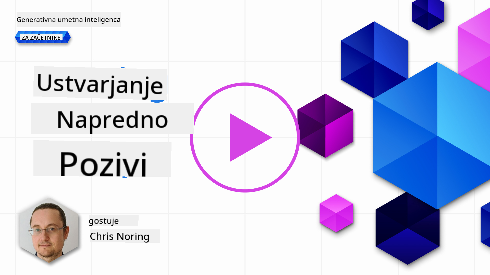

<!--
CO_OP_TRANSLATOR_METADATA:
{
  "original_hash": "b2651fb16bcfbc62b8e518751ed90fdb",
  "translation_date": "2025-10-18T01:37:47+00:00",
  "source_file": "05-advanced-prompts/README.md",
  "language_code": "sl"
}
-->
# Ustvarjanje naprednih pozivov

[](https://youtu.be/BAjzkaCdRok?si=NmUIyRf7-cDgbjtt)

Povzemimo nekaj naukov iz prejšnjega poglavja:

> Pozivno _inženirstvo_ je proces, s katerim **usmerjamo model k bolj relevantnim odgovorom** z zagotavljanjem bolj uporabnih navodil ali konteksta.

Obstajata tudi dva koraka pri pisanju pozivov: oblikovanje poziva z zagotavljanjem ustreznega konteksta in _optimizacija_, kako postopoma izboljšati poziv.

Na tej točki imamo osnovno razumevanje, kako pisati pozive, vendar moramo iti globlje. V tem poglavju boste prešli od preizkušanja različnih pozivov do razumevanja, zakaj je en poziv boljši od drugega. Naučili se boste, kako oblikovati pozive po nekaterih osnovnih tehnikah, ki jih je mogoče uporabiti pri katerem koli LLM.

## Uvod

V tem poglavju bomo obravnavali naslednje teme:

- Razširite svoje znanje o pozivnem inženirstvu z uporabo različnih tehnik pri svojih pozivih.
- Konfigurirajte svoje pozive za spreminjanje izhodnih rezultatov.

## Cilji učenja

Po zaključku te lekcije boste lahko:

- Uporabili tehnike pozivnega inženirstva, ki izboljšajo rezultate vaših pozivov.
- Izvajali pozive, ki so bodisi raznoliki bodisi deterministični.

## Pozivno inženirstvo

Pozivno inženirstvo je proces ustvarjanja pozivov, ki bodo prinesli želeni rezultat. Pozivno inženirstvo ni inženirska disciplina, temveč bolj niz tehnik, ki jih lahko uporabite za dosego želenega rezultata.

### Primer poziva

Vzemimo osnovni poziv, kot je ta:

> Ustvari 10 vprašanj o geografiji.

Pri tem pozivu dejansko uporabljate niz različnih tehnik pozivanja.

Razčlenimo ga.

- **Kontekst**, določite, da naj bo o "geografiji".
- **Omejevanje izhoda**, želite največ 10 vprašanj.

### Omejitve preprostega pozivanja

Morda ne boste dosegli želenega rezultata. Vaša vprašanja bodo ustvarjena, vendar je geografija široka tema in morda ne boste dobili tistega, kar želite, zaradi naslednjih razlogov:

- **Široka tema**, ne veste, ali bo šlo za države, prestolnice, reke itd.
- **Oblika**, kaj pa, če želite, da so vprašanja oblikovana na določen način?

Kot vidite, je treba pri ustvarjanju pozivov upoštevati veliko stvari.

Do sedaj smo videli primer preprostega poziva, vendar je generativna umetna inteligenca sposobna veliko več, da pomaga ljudem v različnih vlogah in industrijah. Raziščimo nekaj osnovnih tehnik.

### Tehnike pozivanja

Najprej moramo razumeti, da je pozivanje _emergentna_ lastnost LLM, kar pomeni, da to ni funkcija, ki je vgrajena v model, temveč nekaj, kar odkrijemo med uporabo modela.

Obstajajo nekatere osnovne tehnike, ki jih lahko uporabimo za pozivanje LLM. Raziščimo jih.

- **Pozivanje brez primerov (Zero-shot prompting)**, to je najbolj osnovna oblika pozivanja. Gre za en sam poziv, ki zahteva odgovor od LLM, ki temelji izključno na njegovih podatkih za usposabljanje.
- **Pozivanje z nekaj primeri (Few-shot prompting)**, ta vrsta pozivanja vodi LLM z zagotavljanjem enega ali več primerov, na katere se lahko opira pri ustvarjanju odgovora.
- **Veriga misli (Chain-of-thought)**, ta vrsta pozivanja pove LLM, kako razčleniti problem na korake.
- **Generirano znanje**, za izboljšanje odgovora poziva lahko poleg poziva zagotovite tudi generirana dejstva ali znanje.
- **Od najmanjšega do največjega (Least to most)**, podobno kot veriga misli, je ta tehnika namenjena razčlenitvi problema na vrsto korakov, ki jih nato izvedete po vrsti.
- **Samopopravki (Self-refine)**, ta tehnika vključuje kritiko izhoda LLM in nato zahtevo za izboljšanje.
- **Maievtika (Maieutic prompting)**. Tukaj želite zagotoviti, da je odgovor LLM pravilen, in ga prosite, da pojasni različne dele odgovora. To je oblika samopopravkov.

### Pozivanje brez primerov

Ta slog pozivanja je zelo preprost, sestavljen je iz enega samega poziva. Ta tehnika je verjetno tista, ki jo uporabljate, ko začnete spoznavati LLM. Tukaj je primer:

- Poziv: "Kaj je algebra?"
- Odgovor: "Algebra je veja matematike, ki preučuje matematične simbole in pravila za njihovo manipulacijo."

### Pozivanje z nekaj primeri

Ta slog pozivanja pomaga modelu z zagotavljanjem nekaj primerov skupaj z zahtevo. Sestavljen je iz enega samega poziva z dodatnimi podatki, specifičnimi za nalogo. Tukaj je primer:

- Poziv: "Napiši pesem v slogu Shakespeara. Tukaj je nekaj primerov Shakespeareovih sonetov:
  Sonet 18: 'Ali naj te primerjam s poletnim dnem? Ti si bolj ljubek in bolj zmeren...'
  Sonet 116: 'Naj ne bo ovir pri združitvi pravih umov. Ljubezen ni ljubezen, ki se spreminja, ko najde spremembo...'
  Sonet 132: 'Tvoje oči ljubim, in one, kot da me pomilujejo, vedoč, da tvoje srce me muči z zaničevanjem,...'
  Zdaj napiši sonet o lepoti lune."
- Odgovor: "Na nebu luna nežno sije, v srebrni svetlobi, ki nežno razliva svojo milino,..."

Primeri modelu LLM zagotavljajo kontekst, obliko ali slog želenega izhoda. Pomagajo modelu razumeti specifično nalogo in ustvariti bolj natančne ter ustrezne odgovore.

### Veriga misli

Veriga misli je zelo zanimiva tehnika, saj gre za to, da LLM vodimo skozi vrsto korakov. Ideja je, da LLM poučimo na način, da razume, kako nekaj narediti. Razmislimo o naslednjem primeru, z in brez verige misli:

    - Poziv: "Alice ima 5 jabolk, vrže 3 jabolka, da 2 Bobu in Bob ji eno vrne, koliko jabolk ima Alice?"
    - Odgovor: 5

LLM odgovori s 5, kar ni pravilno. Pravilen odgovor je 1 jabolko, glede na izračun (5 -3 -2 + 1 = 1).

Kako lahko naučimo LLM, da to naredi pravilno?

Poskusimo z verigo misli. Uporaba verige misli pomeni:

1. Dajte LLM podoben primer.
1. Pokažite izračun in kako ga pravilno izračunati.
1. Zagotovite izvirni poziv.

Tukaj je primer:

- Poziv: "Lisa ima 7 jabolk, vrže 1 jabolko, da 4 jabolka Bartu in Bart ji eno vrne:
  7 -1 = 6
  6 -4 = 2
  2 +1 = 3  
  Alice ima 5 jabolk, vrže 3 jabolka, da 2 Bobu in Bob ji eno vrne, koliko jabolk ima Alice?"
  Odgovor: 1

Opazite, kako napišemo bistveno daljši poziv z drugim primerom, izračunom in nato izvirnim pozivom ter pridemo do pravilnega odgovora 1.

Kot vidite, je veriga misli zelo močna tehnika.

### Generirano znanje

Velikokrat, ko želite oblikovati poziv, želite to storiti z uporabo podatkov vašega podjetja. Del poziva želite pridobiti iz podjetja, drugi del pa naj bo dejanski poziv, ki vas zanima.

Na primer, takšen je lahko vaš poziv, če ste v zavarovalniškem poslu:

```text
{{company}}: {{company_name}}
{{products}}:
{{products_list}}
Please suggest an insurance given the following budget and requirements:
Budget: {{budget}}
Requirements: {{requirements}}
```

Zgoraj vidite, kako je poziv oblikovan z uporabo predloge. V predlogi je več spremenljivk, označenih z `{{variable}}`, ki bodo zamenjane z dejanskimi vrednostmi iz API-ja podjetja.

Tukaj je primer, kako bi lahko izgledal poziv, ko so spremenljivke zamenjane z vsebino vašega podjetja:

```text
Insurance company: ACME Insurance
Insurance products (cost per month):
- Car, cheap, 500 USD
- Car, expensive, 1100 USD
- Home, cheap, 600 USD
- Home, expensive, 1200 USD
- Life, cheap, 100 USD

Please suggest an insurance given the following budget and requirements:
Budget: $1000
Requirements: Car, Home, and Life insurance
```

Če ta poziv zaženete skozi LLM, bo ustvaril odgovor, kot je ta:

```output
Given the budget and requirements, we suggest the following insurance package from ACME Insurance:
- Car, cheap, 500 USD
- Home, cheap, 600 USD
- Life, cheap, 100 USD
Total cost: $1,200 USD
```

Kot vidite, predlaga tudi življenjsko zavarovanje, kar ne bi smel. Ta rezultat kaže, da moramo optimizirati poziv tako, da bo bolj jasen glede tega, kaj lahko dovolimo. Po nekaj _poskusih in napakah_ pridemo do naslednjega poziva:

```text
Insurance company: ACME Insurance
Insurance products (cost per month):
- type: Car, cheap, cost: 500 USD
- type: Car, expensive, cost: 1100 USD
- type: Home, cheap, cost: 600 USD
- type: Home, expensive, cost: 1200 USD
- type: Life, cheap, cost: 100 USD

Please suggest an insurance given the following budget and requirements:
Budget: $1000 restrict choice to types: Car, Home
```

Opazite, kako dodajanje _tipa_ in _stroškov_ ter uporaba ključne besede _omeji_ pomaga LLM razumeti, kaj želimo.

Zdaj dobimo naslednji odgovor:

```output
Given the budget and requirements, we suggest the Car, Cheap insurance product which costs 500 USD per month.
```

Namen tega primera je bil pokazati, da čeprav uporabljamo osnovno tehniko, kot je _generirano znanje_, moramo v večini primerov optimizirati poziv, da dosežemo želeni rezultat.

### Od najmanjšega do največjega

Ideja pozivanja od najmanjšega do največjega je razčleniti večji problem na podprobleme. Na ta način pomagate voditi LLM, kako "premagati" večji problem. Dober primer bi lahko bil za podatkovno znanost, kjer lahko LLM vprašate, da razdeli problem, kot sledi:

> Poziv: Kako izvajati podatkovno znanost v 5 korakih?

Vaš AI asistent odgovori z:

1. Zbiranje podatkov
1. Čiščenje podatkov
1. Analiza podatkov
1. Vizualizacija podatkov
1. Predstavitev podatkov

### Samopopravki, kritika rezultatov

Pri generativni umetni inteligenci in LLM ne morete zaupati izhodu. Morate ga preveriti. Navsezadnje LLM samo predstavlja, kaj je naslednja najbolj verjetna stvar za povedati, ne pa kaj je pravilno. Zato je dobra ideja, da LLM prosite, da se samokritizira, kar nas pripelje do tehnike samopopravkov.

Kako deluje, je naslednje:

1. Začetni poziv, ki LLM prosi, da reši problem
1. LLM odgovori
1. Kritizirate odgovor in prosite AI, da ga izboljša
1. LLM ponovno odgovori, tokrat upošteva kritiko in predlaga rešitve, ki jih je iznašel

Ta proces lahko ponovite tolikokrat, kot želite.

Tukaj je primer uporabe te tehnike:

> Poziv: "Ustvari Python Web API z rutama products in customers"

AI Odgovor:

```python
import flask
app = Flask(__name__)

@app.route('/products')
def products():
    return 'Products'

@app.route('/customers')
def customers():
    return 'Customers'
```

> Poziv: predlagaj 3 izboljšave zgornje kode

AI Odgovor:

```text
Sure, here are three suggestions to improve the code:

Import the correct module: The first line should import Flask instead of flask. The correct import statement should be from flask import Flask.

Add a main function: Add a if __name__ == '__main__': block to the end of the file to run the application when the file is executed.

Use f-strings: Use f-strings to format the return statements in the route functions. For example, return 'Products' can be changed to return f'This is the {request.path} page'.
```

```python
from flask import Flask, request

app = Flask(__name__)

@app.route('/products')
def products():
    return f'This is the {request.path} page'

@app.route('/customers')
def customers():
    return f'This is the {request.path} page'

if __name__ == '__main__':
    app.run()
```

Kot vidite, zgornji AI odgovor izboljša prvo predlagano kodo zahvaljujoč kritiki prvega odgovora.

### Maievtika

Maievtika je tehnika, ki je podobna samopopravkom, vendar gre bolj za to, da LLM prosite, da se pojasni. Cilj je zmanjšati nedoslednosti v izhodu LLM, da se zagotovi, da pride do pravilnega odgovora. Postopek, ki ga je treba upoštevati, je:

1. Prosite LLM, da odgovori na vprašanje
1. Za vsak del odgovora prosite LLM, da ga podrobneje pojasni.
1. Če so prisotne nedoslednosti, zavrnite dele, ki so nedosledni.

Ponovite koraka 2 in 3, dokler ne pregledate vseh delov in ste zadovoljni z odgovorom.

Tukaj je primer poziva:

> Poziv: Kako lahko ustvarim krizni načrt za obvladovanje pandemije v 5 korakih?
> LLM odgovor:

```text
1. Identify the risks
1. Identify the stakeholders
1. Identify the resources
1. Identify the actions
1. Identify the communication channels
```

Identificiral je 5 korakov, vendar lahko ugotovimo, ali je to pravilno? Prosite LLM, da pojasni vsak korak:

> Poziv: Pojasni prvi korak podrobneje, kakšna so tveganja v podrobnostih pri pandemiji?

```text
The risks are the following:

- Loss of life
- Loss of business
- Loss of reputation
- Loss of customers
- Loss of employees
```

Na tej točki želimo zagotoviti, da je LLM pravilen, zato ga prosimo, da podrobneje pojasni prvo tveganje in upamo, da je dosleden z zgornjim odgovorom:

> Poziv: V pandemiji, katero je največje tveganje in zakaj?

```text
The biggest risk is loss of life because it's the most important thing to protect.
```

> Kateri sta dve največji tveganji v pandemiji?

```text
The two biggest risks are loss of life and loss of business.
```

Na tej točki je LLM dosleden in omenja "življenje" in "posel" kot dve največji tveganji. Zdaj lahko nadaljujemo na naslednji korak in se počutimo precej samozavestni. Vendar pa LLM ne smemo slepo zaupati, vedno moramo preveriti izhod.

## Spreminjanje izhoda

LLM so po naravi nedeterministični, kar pomeni, da boste ob vsakem zagonu istega poziva dobili različne rezultate. Poskusite naslednji poziv:

> "Ustvari kodo za Python Web API"

```python
# Import necessary modules
import flask
from flask import request, jsonify

# Create a Flask app
app = flask.Flask(__name__)

# Create a route for the API
@app.route('/api', methods=['GET'])
def api():
    # Get the data from the request
    data = request.args

    # Process the data
    result = process_data(data)

    # Return the result as JSON
    return jsonify(result)

# Function to process the data
def process_data(data):
    # Do something with the data
    result = data + 1

    # Return the result
    return result

# Run the app
if __name__ == '__main__':
    app.run()

```

Ponovni zagon istega poziva ustvari nekoliko drugačen odgovor:

```python
#import necessary packages
import flask
from flask import request, jsonify

#create the Flask application
app = flask.Flask(__name__)
app.config["DEBUG"] = True

#create a list of books
books = [
    {'id': 0,
     'title': 'A Fire Upon the Deep',
     'author': 'Vernor Vinge',
     'first_sentence': 'The coldsleep itself was dreamless.',
     'year_published': '1992'},
    {'id': 1,
     'title': 'The Ones Who Walk Away From Omelas',
     'author': 'Ursula K. Le Guin',
     'first_sentence': 'With a clamor of bells that set the swallows soaring, the Festival of Summer came to the city Omelas, bright-towered by the sea.',
     'published': '1973'},
    {'id': 2,
     'title': 'Dhalgren',
     'author': 'Samuel R. Delany',
     'first_sentence': 'to wound the autumnal city.',
     'published': '1975'}
]

#create an endpoint for the API
@app.route('/', methods=['GET'])
def home():
    return '''<h1>Books API</h1>
<p>A prototype API for retrieving books.</p>'''

#create an endpoint to return all books
@app.route('/api/v1/resources/books/all', methods=['GET'])
def api_all():
    return jsonify(books)

#create an endpoint to return a single book
@app.route('/api/v1/resources/books', methods=['GET'])
def api_id():
    #check if an ID was provided as part of the URL
    #if ID is provided, assign it to a variable
    #if no ID is provided, display an error
    if 'id' in request.args:
        id = int(request.args['id'])
    else:
        return "Error: No id field provided. Please specify an id."

    #create an empty list for our results
    results = []

    #loop through the data and match results that fit the requested ID
    #IDs are unique, but other fields might return many results
    for book in books:
        if book['id'] == id:
            results.append(book)

    #use the jsonify function from Flask to convert our list of
    #Python dictionaries to the JSON format
    return jsonify(results)

app.run()
```

> Ali je raznolik izhod problem?

Odvisno od tega, kaj poskušate doseči. Če želite specifičen odgovor, potem je to problem. Če vam ustreza raznolik izhod, kot je "Ustvari katera koli 3 vprašanja o geografiji", potem to ni problem.

### Uporaba temperature za spreminjanje izhoda

Ok, odločili smo se, da želimo omejiti izhod, da bo bolj predvidljiv, torej bolj determinističen. Kako to storiti?

Temperatura je vrednost med 0 in 1, kjer je 0 najbolj deterministična in 1 najbolj raznolika. Privzeta vrednost je 0.7. Poglejmo, kaj se zgodi z dvema zagonom istega poziva, pri čemer je temperatura nastavljena na 0.1:

> "Ustvari kodo za Python Web API"

```python
#import necessary libraries
import flask
from flask import request, jsonify

#create an instance of the Flask class
app = flask.Flask(__name__)

#create an endpoint for the API
@app.route('/api/v1/endpoint', methods=['GET'])
def api_endpoint():
    #get the request data
    data = request.get_json()

    #process the data
    result = process_data(data)

    #return the result
    return jsonify(result)

#function to process the data
def process_data(data):
    #process the data
    result = {'result': 'success'}

    #return the result
    return result

#run the Flask app
if __name__ == '__main__':
    app.run()

```

Ponovni zagon poziva daje naslednji rezultat:

```python
#import necessary libraries
import flask
from flask import request, jsonify

#create a Flask app
app = flask.Flask(__name__)

#create a route for the API
@app.route('/api', methods=['GET'])
def api_call():
    #get the data from the request
    data = request.get_json()

    #process the data
    result = process_data(data)

    #return the result
    return jsonify(result)

#define the process_data function
def process_data(data):
    #do something with the data
    result = data + 1

    #return the result
    return result

#run the app
if __name__ == '__main__':
    app.run()

```

Razlika med tema dvema izhodoma je zelo majhna. Tokrat naredimo nasprotno, nastavimo temperaturo na 0.9:

```python
# Import necessary libraries
import flask
from flask import request, jsonify

# Create a Flask app
app = flask.Flask(__name__)

# Create a route for the API
@app.route('/api', methods=['GET'])
def api_call():
    # Get the data from the request
    data = request.args

    # Process the data
    result = process_data(data)

    # Return the result
    return jsonify(result)

# Function to process the data
def process_data(data):
    # Do something with the data
    result = data + 1

    # Return the result
    return result

# Run the app
if __name__ == '__main__':
    app.run()

```

in drugi poskus z vrednostjo temperature 0.9:

```python
import flask
from flask import request, jsonify

# create the Flask app
app = flask.Flask(__name__)
app.config['DEBUG'] = True

# create some test data
books = [
    {'id': 0, 'title': 'A Fire Upon The Deep', 'author': 'Vernor Vinge', 'first_sentence': 'The coldsleep itself was dreamless.', 'year_published': '1992'},
    {'id': 1, 'title': 'The Ones Who Walk Away From Omelas', 'author': 'Ursula K. Le Guin', 'first_sentence': 'With a clamor of bells that set the swallows soaring, the Festival of Summer came to the city Omelas, bright-towered by the sea.', 'published': '1973'},
    {'id': 2, 'title': 'Dhalgren', 'author': 'Samuel R. Delany', 'first_sentence': 'to wound the autumnal city.', 'published': '1975'}
]

# create an endpoint
@app.route('/', methods=['GET'])
def home():
    return '''<h1>Welcome to our book API!</h1>'''

@app.route('/api/v1/resources/books

```

Kot lahko vidite, so rezultati zelo raznoliki.

> Upoštevajte, da obstajajo še drugi parametri, ki jih lahko spremenite za raznolikost izhoda, kot so top-k, top-p, kazen za ponavljanje, kazen za dolžino in kazen za raznolikost, vendar ti parametri niso del tega učnega načrta.

## Dobre prakse

Obstaja veliko praks, ki jih lahko uporabite, da dosežete želeni rezultat. Sčasoma boste razvili svoj lasten slog, ko boste večkrat uporabljali pozivanje.

Poleg tehnik, ki smo jih obravnavali, je nekaj dobrih praks, ki jih je vredno upoštevati pri pozivanju LLM.

Tukaj je nekaj dobrih praks, ki jih je vredno upoštevati:

- **Določite kontekst**. Kontekst je pomemben; bolj kot lahko določite področje, temo itd., boljši bo rezultat.
- Omejite izhod. Če želite določeno število elementov ali določeno dolžino, to jasno navedite.
- **Določite kaj in kako**. Ne pozabite omeniti, kaj želite in kako želite, na primer "Ustvari Python Web API z rutami za izdelke in stranke, razdeli ga v 3 datoteke".
- **Uporabljajte predloge**. Pogosto boste želeli obogatiti svoje pozive s podatki iz vašega podjetja. Uporabljajte predloge za to. Predloge lahko vsebujejo spremenljivke, ki jih zamenjate z dejanskimi podatki.
- **Pravilno črkujte**. LLM-ji vam lahko ponudijo pravilen odgovor, vendar če pravilno črkujete, boste dobili boljši odgovor.

## Naloga

Tukaj je koda v Pythonu, ki prikazuje, kako zgraditi preprost API z uporabo Flask:

```python
from flask import Flask, request

app = Flask(__name__)

@app.route('/')
def hello():
    name = request.args.get('name', 'World')
    return f'Hello, {name}!'

if __name__ == '__main__':
    app.run()
```

Uporabite AI asistenta, kot sta GitHub Copilot ali ChatGPT, in uporabite tehniko "samopopravka", da izboljšate kodo.

## Rešitev

Poskusite rešiti nalogo tako, da dodate ustrezne pozive k kodi.

> [!TIP]
> Oblikujte poziv, da zahteva izboljšave; dobro je omejiti število izboljšav. Prav tako lahko zahtevate izboljšave na določen način, na primer arhitektura, zmogljivost, varnost itd.

[Rešitev](../../../05-advanced-prompts/python/aoai-solution.py)

## Preverjanje znanja

Zakaj bi uporabil pozivanje z verigo misli? Pokaži mi 1 pravilen odgovor in 2 napačna odgovora.

1. Da naučim LLM, kako rešiti problem.
1. B, Da naučim LLM, kako najti napake v kodi.
1. C, Da LLM-u naročim, naj predlaga različne rešitve.

A: 1, ker pozivanje z verigo misli pomeni, da LLM-u pokažemo, kako rešiti problem, tako da mu predstavimo serijo korakov, podobne probleme in kako so bili rešeni.

## 🚀 Izziv

Pravkar ste uporabili tehniko samopopravka v nalogi. Vzemite kateri koli program, ki ste ga ustvarili, in razmislite, katere izboljšave bi želeli uvesti. Zdaj uporabite tehniko samopopravka, da uvedete predlagane spremembe. Kaj menite o rezultatu, boljši ali slabši?

## Odlično delo! Nadaljujte z učenjem

Po zaključku te lekcije si oglejte našo [zbirko učenja o generativni umetni inteligenci](https://aka.ms/genai-collection?WT.mc_id=academic-105485-koreyst), da nadaljujete z nadgradnjo svojega znanja o generativni umetni inteligenci!

Pojdite na 6. lekcijo, kjer bomo uporabili naše znanje o oblikovanju pozivov za [izdelavo aplikacij za generiranje besedila](../06-text-generation-apps/README.md?WT.mc_id=academic-105485-koreyst).

---

**Omejitev odgovornosti**:  
Ta dokument je bil preveden z uporabo storitve za prevajanje z umetno inteligenco [Co-op Translator](https://github.com/Azure/co-op-translator). Čeprav si prizadevamo za natančnost, vas prosimo, da upoštevate, da lahko avtomatizirani prevodi vsebujejo napake ali netočnosti. Izvirni dokument v njegovem maternem jeziku je treba obravnavati kot avtoritativni vir. Za ključne informacije priporočamo profesionalni človeški prevod. Ne prevzemamo odgovornosti za morebitne nesporazume ali napačne razlage, ki bi nastale zaradi uporabe tega prevoda.