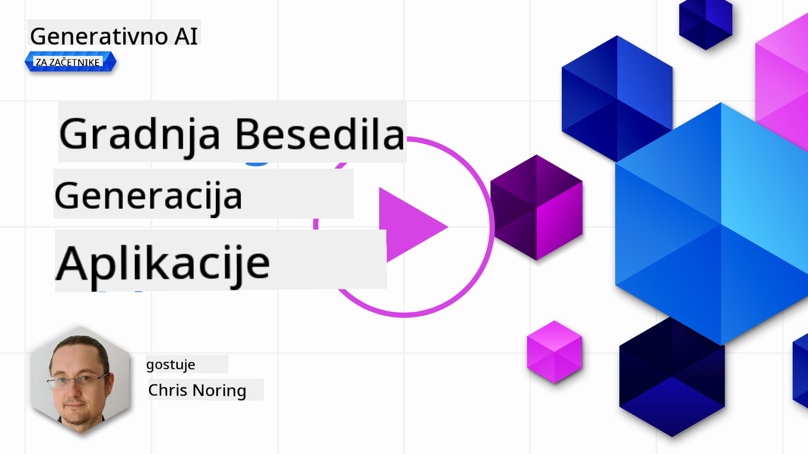

<!--
CO_OP_TRANSLATOR_METADATA:
{
  "original_hash": "ce8224073b86b728ed52b19bed7932fd",
  "translation_date": "2025-07-09T12:10:39+00:00",
  "source_file": "06-text-generation-apps/README.md",
  "language_code": "sl"
}
-->
# Gradnja aplikacij za generiranje besedila

[](https://aka.ms/gen-ai-lesson6-gh?WT.mc_id=academic-105485-koreyst)

> _(Kliknite na zgornjo sliko za ogled videa te lekcije)_

Do zdaj ste v tem učnem načrtu spoznali osnovne pojme, kot so pozivi (prompts) in celo celotno disciplino, imenovano "prompt engineering". Veliko orodij, s katerimi lahko komunicirate, kot so ChatGPT, Office 365, Microsoft Power Platform in drugi, vam omogočajo uporabo pozivov za dosego določenih ciljev.

Če želite takšno izkušnjo dodati aplikaciji, morate razumeti pojme, kot so pozivi, dokončanja (completions) in izbrati knjižnico za delo. Prav to se boste naučili v tem poglavju.

## Uvod

V tem poglavju boste:

- Spoznali knjižnico openai in njene osnovne pojme.
- Zgradili aplikacijo za generiranje besedila z uporabo openai.
- Razumeli, kako uporabljati pojme, kot so prompt, temperature in tokens za izdelavo aplikacije za generiranje besedila.

## Cilji učenja

Na koncu te lekcije boste znali:

- Pojasniti, kaj je aplikacija za generiranje besedila.
- Zgraditi aplikacijo za generiranje besedila z uporabo openai.
- Nastaviti aplikacijo tako, da uporablja več ali manj tokenov ter spremeniti temperaturo za raznolik izhod.

## Kaj je aplikacija za generiranje besedila?

Običajno, ko gradite aplikacijo, ima ta nekakšen vmesnik, kot je na primer:

- Na ukaze osnovana. Konzolne aplikacije so tipične aplikacije, kjer vnesete ukaz in ta izvede nalogo. Na primer, `git` je aplikacija, ki temelji na ukazih.
- Uporabniški vmesnik (UI). Nekatere aplikacije imajo grafične uporabniške vmesnike (GUI), kjer klikate gumbe, vnašate besedilo, izbirate možnosti in podobno.

### Konzolne in UI aplikacije so omejene

Primerjajte to z aplikacijo, ki temelji na ukazih, kjer vnesete ukaz:

- **Omejeno je**. Ne morete vnesti kateregakoli ukaza, le tistega, ki ga aplikacija podpira.
- **Jezikovno specifično**. Nekatere aplikacije podpirajo več jezikov, vendar je aplikacija privzeto zgrajena za določen jezik, čeprav lahko dodate podporo za več jezikov.

### Prednosti aplikacij za generiranje besedila

Kako se torej aplikacija za generiranje besedila razlikuje?

V takšni aplikaciji imate večjo prilagodljivost, niste omejeni na nabor ukazov ali določen vhodni jezik. Namesto tega lahko uporabljate naravni jezik za interakcijo z aplikacijo. Druga prednost je, da ker že komunicirate z virom podatkov, ki je bil usposobljen na ogromnem korpusu informacij, je tradicionalna aplikacija lahko omejena na podatke v bazi.

### Kaj lahko zgradim z aplikacijo za generiranje besedila?

Lahko zgradite veliko stvari. Na primer:

- **Chatbot**. Chatbot, ki odgovarja na vprašanja o temah, kot so vaše podjetje in njegovi izdelki, je lahko dobra izbira.
- **Pomočnik**. LLM-ji so odlični pri povzetkih besedil, pridobivanju vpogledov iz besedila, ustvarjanju besedil, kot so življenjepisi in še več.
- **Pomočnik za kodo**. Glede na jezikovni model, ki ga uporabljate, lahko zgradite pomočnika za kodo, ki vam pomaga pisati kodo. Na primer, lahko uporabite produkt, kot je GitHub Copilot, pa tudi ChatGPT za pomoč pri pisanju kode.

## Kako začeti?

Potrebno je najti način za integracijo z LLM, kar običajno vključuje naslednja dva pristopa:

- Uporaba API-ja. Tukaj sestavljate spletne zahteve s svojim pozivom in prejmete nazaj generirano besedilo.
- Uporaba knjižnice. Knjižnice pomagajo zapakirati klice API-ja in jih narediti lažje za uporabo.

## Knjižnice/SDK-ji

Obstaja nekaj dobro znanih knjižnic za delo z LLM-ji, kot so:

- **openai**, ta knjižnica omogoča enostavno povezavo z vašim modelom in pošiljanje pozivov.

Nato so tu knjižnice, ki delujejo na višji ravni, kot so:

- **Langchain**. Langchain je dobro znan in podpira Python.
- **Semantic Kernel**. Semantic Kernel je knjižnica podjetja Microsoft, ki podpira jezike C#, Python in Java.

## Prva aplikacija z uporabo openai

Poglejmo, kako lahko zgradimo prvo aplikacijo, katere knjižnice potrebujemo, koliko je potrebnega in tako naprej.

### Namestitev openai

Obstaja veliko knjižnic za interakcijo z OpenAI ali Azure OpenAI. Možno je uporabljati različne programske jezike, kot so C#, Python, JavaScript, Java in drugi. Izbrali smo knjižnico `openai` za Python, zato bomo uporabili `pip` za namestitev.

```bash
pip install openai
```

### Ustvarite vir

Izvedite naslednje korake:

- Ustvarite račun na Azure [https://azure.microsoft.com/free/](https://azure.microsoft.com/free/?WT.mc_id=academic-105485-koreyst).
- Pridobite dostop do Azure OpenAI. Obiščite [https://learn.microsoft.com/azure/ai-services/openai/overview#how-do-i-get-access-to-azure-openai](https://learn.microsoft.com/azure/ai-services/openai/overview#how-do-i-get-access-to-azure-openai?WT.mc_id=academic-105485-koreyst) in zaprosite za dostop.

  > [!NOTE]
  > Ob času pisanja morate zaprositi za dostop do Azure OpenAI.

- Namestite Python <https://www.python.org/>
- Ustvarite Azure OpenAI Service vir. Oglejte si ta vodič za [ustvarjanje vira](https://learn.microsoft.com/azure/ai-services/openai/how-to/create-resource?pivots=web-portal?WT.mc_id=academic-105485-koreyst).

### Poiščite API ključ in končno točko

Zdaj morate knjižnici `openai` povedati, kateri API ključ naj uporablja. Za iskanje API ključa pojdite v razdelek "Keys and Endpoint" vašega Azure OpenAI vira in kopirajte vrednost "Key 1".


Ko imate te podatke, usmerimo knjižnice, naj jih uporabijo.

> [!NOTE]
> Priporočljivo je, da svoj API ključ ločite od kode. To lahko storite z uporabo okoljskih spremenljivk.
>
> - Nastavite okoljsko spremenljivko `OPENAI_API_KEY` na vaš API ključ.
>   `export OPENAI_API_KEY='sk-...'`

### Nastavitev konfiguracije za Azure

Če uporabljate Azure OpenAI, nastavite konfiguracijo tako:

```python
openai.api_type = 'azure'
openai.api_key = os.environ["OPENAI_API_KEY"]
openai.api_version = '2023-05-15'
openai.api_base = os.getenv("API_BASE")
```

Zgoraj nastavljamo naslednje:

- `api_type` na `azure`. To pove knjižnici, da naj uporablja Azure OpenAI in ne OpenAI.
- `api_key`, to je vaš API ključ, ki ga najdete v Azure Portalu.
- `api_version`, to je različica API-ja, ki jo želite uporabiti. Ob času pisanja je najnovejša različica `2023-05-15`.
- `api_base`, to je končna točka API-ja. Najdete jo v Azure Portalu poleg vašega API ključa.

> [!NOTE] > `os.getenv` je funkcija, ki bere okoljske spremenljivke. Uporabite jo lahko za branje okoljskih spremenljivk, kot so `OPENAI_API_KEY` in `API_BASE`. Nastavite te okoljske spremenljivke v terminalu ali z uporabo knjižnice, kot je `dotenv`.

## Generiranje besedila

Besedilo generiramo z uporabo razreda `Completion`. Tukaj je primer:

```python
prompt = "Complete the following: Once upon a time there was a"

completion = openai.Completion.create(model="davinci-002", prompt=prompt)
print(completion.choices[0].text)
```

V zgornji kodi ustvarimo objekt completion in mu posredujemo model, ki ga želimo uporabiti, ter poziv. Nato izpišemo generirano besedilo.

### Chat completions

Do zdaj ste videli, kako uporabljamo `Completion` za generiranje besedila. Obstaja pa še en razred, imenovan `ChatCompletion`, ki je bolj primeren za chatbote. Tukaj je primer njegove uporabe:

```python
import openai

openai.api_key = "sk-..."

completion = openai.ChatCompletion.create(model="gpt-3.5-turbo", messages=[{"role": "user", "content": "Hello world"}])
print(completion.choices[0].message.content)
```

Več o tej funkcionalnosti v prihajajočem poglavju.

## Vaja - vaša prva aplikacija za generiranje besedila

Zdaj, ko smo se naučili, kako nastaviti in konfigurirati openai, je čas, da zgradite svojo prvo aplikacijo za generiranje besedila. Za izdelavo aplikacije sledite tem korakom:

1. Ustvarite virtualno okolje in namestite openai:

   ```bash
   python -m venv venv
   source venv/bin/activate
   pip install openai
   ```

   > [!NOTE]
   > Če uporabljate Windows, vnesite `venv\Scripts\activate` namesto `source venv/bin/activate`.

   > [!NOTE]
   > Poiščite svoj Azure OpenAI ključ tako, da obiščete [https://portal.azure.com/](https://portal.azure.com/?WT.mc_id=academic-105485-koreyst), poiščete `Open AI`, izberete `Open AI resource`, nato pa `Keys and Endpoint` in kopirate vrednost `Key 1`.

1. Ustvarite datoteko _app.py_ in ji dodajte naslednjo kodo:

   ```python
   import openai

   openai.api_key = "<replace this value with your open ai key or Azure OpenAI key>"

   openai.api_type = 'azure'
   openai.api_version = '2023-05-15'
   openai.api_base = "<endpoint found in Azure Portal where your API key is>"
   deployment_name = "<deployment name>"

   # add your completion code
   prompt = "Complete the following: Once upon a time there was a"
   messages = [{"role": "user", "content": prompt}]

   # make completion
   completion = openai.chat.completions.create(model=deployment_name, messages=messages)

   # print response
   print(completion.choices[0].message.content)
   ```

   > [!NOTE]
   > Če uporabljate Azure OpenAI, morate nastaviti `api_type` na `azure` in `api_key` na vaš Azure OpenAI ključ.

   Izpis bi moral biti podoben naslednjemu:

   ```output
    very unhappy _____.

   Once upon a time there was a very unhappy mermaid.
   ```

## Različne vrste pozivov za različne namene

Zdaj ste videli, kako generirati besedilo z uporabo poziva. Imate celo program, ki teče in ga lahko spreminjate za generiranje različnih vrst besedil.

Pozivi se lahko uporabljajo za vse vrste nalog. Na primer:

- **Generiranje vrste besedila**. Na primer, lahko generirate pesem, vprašanja za kviz itd.
- **Iskanje informacij**. Pozive lahko uporabite za iskanje informacij, kot v primeru: 'Kaj pomeni CORS v spletnem razvoju?'.
- **Generiranje kode**. Pozive lahko uporabite za generiranje kode, na primer za razvoj regularnih izrazov za preverjanje e-poštnih naslovov ali celo za generiranje celotne aplikacije, kot je spletna aplikacija.

## Bolj praktičen primer: generator receptov

Predstavljajte si, da imate doma sestavine in želite nekaj skuhati. Za to potrebujete recept. Recept lahko poiščete z iskalnikom ali pa uporabite LLM.

Lahko napišete poziv, kot je:

> "Pokaži mi 5 receptov za jed s sledečimi sestavinami: piščanec, krompir in korenje. Za vsak recept našteti vse uporabljene sestavine."

Glede na zgornji poziv lahko dobite odgovor, podoben temu:

```output
1. Roasted Chicken and Vegetables:
Ingredients:
- 4 chicken thighs
- 2 potatoes, cut into cubes
- 2 carrots, cut into cubes
- 2 tablespoons olive oil
- 2 cloves garlic, minced
- 1 teaspoon dried thyme
- 1 teaspoon dried oregano
- Salt and pepper, to taste

2. Chicken and Potato Stew:
Ingredients:
- 2 tablespoons olive oil
- 1 onion, diced
- 2 cloves garlic, minced
- 2 chicken breasts, cut into cubes
- 2 potatoes, cut into cubes
- 2 carrots, cut into cubes
- 1 teaspoon dried oregano
- 1 teaspoon dried thyme
- 1 cup chicken broth
- Salt and pepper, to taste

3. Chicken and Potato Bake:
Ingredients:
- 2 tablespoons olive oil
- 2 chicken breasts, cut into cubes
- 2 potatoes, cut into cubes
- 2 carrots, cut into cubes
- 1 onion, diced
- 2 cloves garlic, minced
- 1 teaspoon dried oregano
- 1 teaspoon dried thyme
- 1 cup chicken broth
- Salt and pepper, to taste

4. Chicken and Potato Soup:
Ingredients:
- 2 tablespoons olive oil
- 1 onion, diced
- 2 cloves garlic, minced
- 2 chicken breasts, cut into cubes
- 2 potatoes, cut into cubes
- 2 carrots, cut into cubes
- 1 teaspoon dried oregano
- 1 teaspoon dried thyme
- 4 cups chicken broth
- Salt and pepper, to taste

5. Chicken and Potato Hash:
Ingredients:
- 2 tablespoons olive oil
- 2 chicken breasts, cut into cubes
- 2 potatoes, cut into cubes
- 2 carrots, cut into cubes
- 1 onion, diced
- 2 cloves garlic, minced
- 1 teaspoon dried oregano
```

Ta rezultat je odličen, vem, kaj bom kuhal. V tem trenutku bi bile koristne izboljšave:

- Filtriranje sestavin, ki jih ne maram ali sem nanje alergičen.
- Izdelava nakupovalnega seznama, če doma nimam vseh sestavin.

Za zgornje primere dodajmo še en poziv:

> "Prosim, odstrani recepte z česnom, saj sem nanj alergičen, in ga nadomesti z nečim drugim. Prav tako prosim, pripravi nakupovalni seznam za recepte, ob upoštevanju, da imam doma že piščanca, krompir in korenje."

Zdaj imate nov rezultat, in sicer:

```output
1. Roasted Chicken and Vegetables:
Ingredients:
- 4 chicken thighs
- 2 potatoes, cut into cubes
- 2 carrots, cut into cubes
- 2 tablespoons olive oil
- 1 teaspoon dried thyme
- 1 teaspoon dried oregano
- Salt and pepper, to taste

2. Chicken and Potato Stew:
Ingredients:
- 2 tablespoons olive oil
- 1 onion, diced
- 2 chicken breasts, cut into cubes
- 2 potatoes, cut into cubes
- 2 carrots, cut into cubes
- 1 teaspoon dried oregano
- 1 teaspoon dried thyme
- 1 cup chicken broth
- Salt and pepper, to taste

3. Chicken and Potato Bake:
Ingredients:
- 2 tablespoons olive oil
- 2 chicken breasts, cut into cubes
- 2 potatoes, cut into cubes
- 2 carrots, cut into cubes
- 1 onion, diced
- 1 teaspoon dried oregano
- 1 teaspoon dried thyme
- 1 cup chicken broth
- Salt and pepper, to taste

4. Chicken and Potato Soup:
Ingredients:
- 2 tablespoons olive oil
- 1 onion, diced
- 2 chicken breasts, cut into cubes
- 2 potatoes, cut into cubes
- 2 carrots, cut into cubes
- 1 teaspoon dried oregano
- 1 teaspoon dried thyme
- 4 cups chicken broth
- Salt and pepper, to taste

5. Chicken and Potato Hash:
Ingredients:
- 2 tablespoons olive oil
- 2 chicken breasts, cut into cubes
- 2 potatoes, cut into cubes
- 2 carrots, cut into cubes
- 1 onion, diced
- 1 teaspoon dried oregano

Shopping List:
- Olive oil
- Onion
- Thyme
- Oregano
- Salt
- Pepper
```

To je vaših pet receptov brez česna in imate tudi nakupovalni seznam glede na sestavine, ki jih že imate doma.

## Vaja - zgradite generator receptov

Zdaj, ko smo odigrali scenarij, napišimo kodo, ki ustreza prikazanemu primeru. Sledite tem korakom:

1. Uporabite obstoječo datoteko _app.py_ kot izhodišče.
1. Poiščite spremenljivko `prompt` in spremenite njeno kodo v naslednjo:

   ```python
   prompt = "Show me 5 recipes for a dish with the following ingredients: chicken, potatoes, and carrots. Per recipe, list all the ingredients used"
   ```

   Če zdaj zaženete kodo, bi morali videti izpis, podoben temu:

   ```output
   -Chicken Stew with Potatoes and Carrots: 3 tablespoons oil, 1 onion, chopped, 2 cloves garlic, minced, 1 carrot, peeled and chopped, 1 potato, peeled and chopped, 1 bay leaf, 1 thyme sprig, 1/2 teaspoon salt, 1/4 teaspoon black pepper, 1 1/2 cups chicken broth, 1/2 cup dry white wine, 2 tablespoons chopped fresh parsley, 2 tablespoons unsalted butter, 1 1/2 pounds boneless, skinless chicken thighs, cut into 1-inch pieces
   -Oven-Roasted Chicken with Potatoes and Carrots: 3 tablespoons extra-virgin olive oil, 1 tablespoon Dijon mustard, 1 tablespoon chopped fresh rosemary, 1 tablespoon chopped fresh thyme, 4 cloves garlic, minced, 1 1/2 pounds small red potatoes, quartered, 1 1/2 pounds carrots, quartered lengthwise, 1/2 teaspoon salt, 1/4 teaspoon black pepper, 1 (4-pound) whole chicken
   -Chicken, Potato, and Carrot Casserole: cooking spray, 1 large onion, chopped, 2 cloves garlic, minced, 1 carrot, peeled and shredded, 1 potato, peeled and shredded, 1/2 teaspoon dried thyme leaves, 1/4 teaspoon salt, 1/4 teaspoon black pepper, 2 cups fat-free, low-sodium chicken broth, 1 cup frozen peas, 1/4 cup all-purpose flour, 1 cup 2% reduced-fat milk, 1/4 cup grated Parmesan cheese

   -One Pot Chicken and Potato Dinner: 2 tablespoons olive oil, 1 pound boneless, skinless chicken thighs, cut into 1-inch pieces, 1 large onion, chopped, 3 cloves garlic, minced, 1 carrot, peeled and chopped, 1 potato, peeled and chopped, 1 bay leaf, 1 thyme sprig, 1/2 teaspoon salt, 1/4 teaspoon black pepper, 2 cups chicken broth, 1/2 cup dry white wine

   -Chicken, Potato, and Carrot Curry: 1 tablespoon vegetable oil, 1 large onion, chopped, 2 cloves garlic, minced, 1 carrot, peeled and chopped, 1 potato, peeled and chopped, 1 teaspoon ground coriander, 1 teaspoon ground cumin, 1/2 teaspoon ground turmeric, 1/2 teaspoon ground ginger, 1/4 teaspoon cayenne pepper, 2 cups chicken broth, 1/2 cup dry white wine, 1 (15-ounce) can chickpeas, drained and rinsed, 1/2 cup raisins, 1/2 cup chopped fresh cilantro
   ```

   > NOTE, vaš LLM ni determinističen, zato lahko ob vsakem zagonu programa dobite različne rezultate.

   Odlično, poglejmo, kako lahko stvari izboljšamo. Za izboljšave želimo, da je koda prilagodljiva, tako da lahko spreminjamo sestavine in število receptov.

1. Spremenimo kodo na naslednji način:

   ```python
   no_recipes = input("No of recipes (for example, 5): ")

   ingredients = input("List of ingredients (for example, chicken, potatoes, and carrots): ")

   # interpolate the number of recipes into the prompt an ingredients
   prompt = f"Show me {no_recipes} recipes for a dish with the following ingredients: {ingredients}. Per recipe, list all the ingredients used"
   ```

   Testni zagon kode bi lahko izgledal takole:

   ```output
   No of recipes (for example, 5): 3
   List of ingredients (for example, chicken, potatoes, and carrots): milk,strawberries

   -Strawberry milk shake: milk, strawberries, sugar, vanilla extract, ice cubes
   -Strawberry shortcake: milk, flour, baking powder, sugar, salt, unsalted butter, strawberries, whipped cream
   -Strawberry milk: milk, strawberries, sugar, vanilla extract
   ```

### Izboljšajte z dodajanjem filtra in nakupovalnega seznama

Zdaj imamo delujočo aplikacijo, ki zna ustvarjati recepte in je prilagodljiva, saj temelji na vhodih uporabnika, tako glede števila receptov kot uporabljenih sestavin.

Za nadaljnje izboljšave želimo dodati naslednje:

- **Filtriranje sestavin**. Želimo lahko izločiti sestavine, ki jih ne maramo ali na katere smo alergični. Za to spremembo lahko uredimo obstoječi poziv in na konec dodamo pogoj za filtriranje, kot je:

  ```python
  filter = input("Filter (for example, vegetarian, vegan, or gluten-free): ")

  prompt = f"Show me {no_recipes} recipes for a dish with the following ingredients: {ingredients}. Per recipe, list all the ingredients used, no {filter}"
  ```

  Zgoraj dodamo `{filter}` na konec poziva in zajamemo vrednost filtra od uporabnika.

  Primer vnosa ob zagonu programa je lahko tak:

  ```output
  No of recipes (for example, 5): 3
  List of ingredients (for example, chicken, potatoes, and carrots): onion,milk
  Filter (for example, vegetarian, vegan, or gluten-free): no milk

  1. French Onion Soup

  Ingredients:

  -1 large onion, sliced
  -3 cups beef broth
  -1 cup milk
  -6 slices french bread
  -1/4 cup shredded Parmesan cheese
  -1 tablespoon butter
  -1 teaspoon dried thyme
  -1/4 teaspoon salt
  -1/4 teaspoon black pepper

  Instructions:

  1. In a large pot, sauté onions in butter until golden brown.
  2. Add beef broth, milk, thyme, salt, and pepper. Bring to a boil.
  3. Reduce heat and simmer for 10 minutes.
  4. Place french bread slices on soup bowls.
  5. Ladle soup over bread.
  6. Sprinkle with Parmesan cheese.

  2. Onion and Potato Soup

  Ingredients:

  -1 large onion, chopped
  -2 cups potatoes, diced
  -3 cups vegetable broth
  -1 cup milk
  -1/4 teaspoon black pepper

  Instructions:

  1. In a large pot, sauté onions in butter until golden brown.
  2. Add potatoes, vegetable broth, milk, and pepper. Bring to a boil.
  3. Reduce heat and simmer for 10 minutes.
  4. Serve hot.

  3. Creamy Onion Soup

  Ingredients:

  -1 large onion, chopped
  -3 cups vegetable broth
  -1 cup milk
  -1/4 teaspoon black pepper
  -1/4 cup all-purpose flour
  -1/2 cup shredded Parmesan cheese

  Instructions:

  1. In a large pot, sauté onions in butter until golden brown.
  2. Add vegetable broth, milk, and pepper. Bring to a boil.
  3. Reduce heat and simmer for 10 minutes.
  4. In a small bowl, whisk together flour and Parmesan cheese until smooth.
  5. Add to soup and simmer for an additional 5 minutes, or until soup has thickened.
  ```

  Kot vidite, so bili recepti, ki vsebujejo mleko, izločeni. Če ste na primer intolerantni na laktozo, boste morda želeli izločiti tudi recepte s sirom, zato je pomembno biti jasen.

- **Izdelava nakupovalnega seznama**. Želimo izdelati nakupovalni seznam, ob upoštevanju, kaj že imamo doma.

  Za to funkcionalnost lahko poskusimo vse rešiti v enem pozivu ali pa ga razdelimo na dva poziva. Poskusimo slednji pristop. Tukaj predlagamo dodajanje dodatnega poziva, vendar za to moramo rezultat prvega poziva vključiti kot kontekst v drugi poziv.

  Poiščite del kode, ki izpiše rezultat prvega poziva, in spodaj dodajte naslednjo kodo:

  ```python
  old_prompt_result = completion.choices[0].message.content
  prompt = "Produce a shopping list for the generated recipes and please don't include ingredients that I already have."

  new_prompt = f"{old_prompt_result} {prompt}"
  messages = [{"role": "user", "content": new_prompt}]
  completion = openai.Completion.create(engine=deployment_name, messages=messages, max_tokens=1200)

  # print response
  print("Shopping list:")
  print(completion.choices[0].message.content)
  ```

  Upoštevajte naslednje:

  1. Sestavljamo nov poziv tako, da rezultat prvega poziva dodamo novemu pozivu:

     ```python
     new_prompt = f"{old_prompt_result} {prompt}"
     ```
  1. Naredimo nov zahtevek, pri čemer upoštevamo tudi število tokenov, ki smo jih zahtevali v prvem pozivu, zato tokrat nastavimo `max_tokens` na 1200.

     ```python
     completion = openai.Completion.create(engine=deployment_name, prompt=new_prompt, max_tokens=1200)
     ```

     Ko zaženemo to kodo, dobimo naslednji izhod:

     ```output
     No of recipes (for example, 5): 2
     List of ingredients (for example, chicken, potatoes, and carrots): apple,flour
     Filter (for example, vegetarian, vegan, or gluten-free): sugar


     -Apple and flour pancakes: 1 cup flour, 1/2 tsp baking powder, 1/2 tsp baking soda, 1/4 tsp salt, 1 tbsp sugar, 1 egg, 1 cup buttermilk or sour milk, 1/4 cup melted butter, 1 Granny Smith apple, peeled and grated
     -Apple fritters: 1-1/2 cups flour, 1 tsp baking powder, 1/4 tsp salt, 1/4 tsp baking soda, 1/4 tsp nutmeg, 1/4 tsp cinnamon, 1/4 tsp allspice, 1/4 cup sugar, 1/4 cup vegetable shortening, 1/4 cup milk, 1 egg, 2 cups shredded, peeled apples
     Shopping list:
     -Flour, baking powder, baking soda, salt, sugar, egg, buttermilk, butter, apple, nutmeg, cinnamon, allspice
     ```

## Izboljšajte svojo nastavitev

Do zdaj imamo delujočo kodo, vendar je nekaj prilagoditev, ki bi jih morali narediti za nadaljnje izboljšave. Nekaj stvari, ki jih je dobro storiti:

- **Ločite skrivnosti od kode**, kot je API ključ. Skrivnosti ne sodijo v kodo in jih je treba shranjevati na varnem mestu. Za ločevanje skrivnosti od kode lahko uporabimo okoljske spremenljivke in knjižnice, kot je `python-dotenv`, ki jih naložijo iz datoteke. Tako bi to izgledalo v kodi:

  1. Ustvarite datoteko `.env` z naslednjo vsebino:

     ```bash
     OPENAI_API_KEY=sk-...
     ```

     
> Opomba, za Azure morate nastaviti naslednje okoljske spremenljivke:

     ```bash
     OPENAI_API_TYPE=azure
     OPENAI_API_VERSION=2023-05-15
     OPENAI_API_BASE=<replace>
     ```

     V kodi bi okoljske spremenljivke naložili takole:

     ```python
     from dotenv import load_dotenv

     load_dotenv()

     openai.api_key = os.environ["OPENAI_API_KEY"]
     ```

- **Beseda o dolžini tokenov**. Pomembno je razmisliti, koliko tokenov potrebujemo za generiranje želenega besedila. Tokeni stanejo, zato je smiselno biti čim bolj ekonomičen pri njihovi uporabi. Na primer, ali lahko oblikujemo poziv tako, da uporabimo manj tokenov?

  Za spremembo števila uporabljenih tokenov lahko uporabite parameter `max_tokens`. Če želite na primer uporabiti 100 tokenov, naredite:

  ```python
  completion = client.chat.completions.create(model=deployment, messages=messages, max_tokens=100)
  ```

- **Eksperimentiranje s temperaturo**. Temperatura je nekaj, o čemer do zdaj nismo govorili, a je pomemben dejavnik, ki vpliva na delovanje programa. Višja kot je vrednost temperature, bolj naključen bo izhod. Nižja kot je temperatura, bolj predvidljiv bo izhod. Premislite, ali želite v svojem izhodu večjo raznolikost ali ne.

  Za spremembo temperature uporabite parameter `temperature`. Če želite na primer nastaviti temperaturo na 0,5, naredite:

  ```python
  completion = client.chat.completions.create(model=deployment, messages=messages, temperature=0.5)
  ```

  > Opomba, bližje kot je vrednost 1.0, bolj raznolik bo izhod.

## Naloga

Za to nalogo lahko izberete, kaj boste ustvarili.

Tukaj je nekaj predlogov:

- Prilagodite aplikacijo za generiranje receptov in jo še izboljšajte. Preizkušajte različne vrednosti temperature in pozive ter poglejte, kaj lahko ustvarite.
- Naredite "študijskega prijatelja". Ta aplikacija naj zna odgovarjati na vprašanja o določeni temi, na primer Python. Lahko imate pozive, kot so "Kaj je določena tema v Pythonu?" ali pa poziv, ki zahteva prikaz kode za določeno temo.
- Zgodovinski bot, ki oživi zgodovino. Naredite, da bot igra vlogo določenega zgodovinskega lika in mu postavljajte vprašanja o njegovem življenju in času.

## Rešitev

### Študijski prijatelj

Spodaj je začetni poziv, poglejte, kako ga lahko uporabite in prilagodite po svoji želji.

```text
- "You're an expert on the Python language

    Suggest a beginner lesson for Python in the following format:

    Format:
    - concepts:
    - brief explanation of the lesson:
    - exercise in code with solutions"
```

### Zgodovinski bot

Tukaj je nekaj pozivov, ki jih lahko uporabite:

```text
- "You are Abe Lincoln, tell me about yourself in 3 sentences, and respond using grammar and words like Abe would have used"
- "You are Abe Lincoln, respond using grammar and words like Abe would have used:

   Tell me about your greatest accomplishments, in 300 words"
```

## Preverjanje znanja

Kaj počne koncept temperature?

1. Nadzoruje, kako naključen je izhod.
1. Nadzoruje, kako dolg je odgovor.
1. Nadzoruje, koliko tokenov se uporabi.

## 🚀 Izziv

Med delom na nalogi poskusite spreminjati temperaturo, nastavite jo na 0, 0,5 in 1. Zapomnite si, da je 0 najmanj raznoliko, 1 pa najbolj. Katera vrednost najbolje deluje za vašo aplikacijo?

## Odlično delo! Nadaljujte z učenjem

Po zaključku te lekcije si oglejte našo [Generative AI Learning collection](https://aka.ms/genai-collection?WT.mc_id=academic-105485-koreyst), da še naprej nadgrajujete svoje znanje o generativni umetni inteligenci!

Pojdite na Lekcijo 7, kjer bomo pogledali, kako [graditi klepetalne aplikacije](../07-building-chat-applications/README.md?WT.mc_id=academic-105485-koreyst)!

**Omejitev odgovornosti**:  
Ta dokument je bil preveden z uporabo storitve za avtomatski prevod AI [Co-op Translator](https://github.com/Azure/co-op-translator). Čeprav si prizadevamo za natančnost, vas opozarjamo, da lahko avtomatizirani prevodi vsebujejo napake ali netočnosti. Izvirni dokument v njegovem izvirnem jeziku velja za avtoritativni vir. Za ključne informacije priporočamo strokovni človeški prevod. Za morebitna nesporazume ali napačne interpretacije, ki izhajajo iz uporabe tega prevoda, ne odgovarjamo.