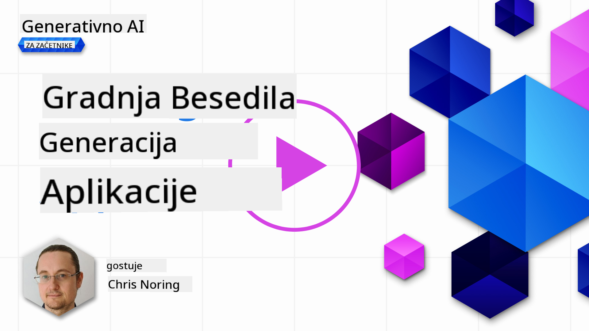

<!--
CO_OP_TRANSLATOR_METADATA:
{
  "original_hash": "5ec6c92b629564538ef397c550adb73e",
  "translation_date": "2025-06-25T14:57:47+00:00",
  "source_file": "06-text-generation-apps/README.md",
  "language_code": "sl"
}
-->
# Gradnja aplikacij za generiranje besedila

[](https://aka.ms/gen-ai-lesson6-gh?WT.mc_id=academic-105485-koreyst)

> _(Kliknite zgornjo sliko za ogled videa te lekcije)_

V tem učnem načrtu ste že videli, da obstajajo osnovni koncepti, kot so pozivi in celo cela disciplina, imenovana "inženiring pozivov". Mnoge orodja, s katerimi lahko komunicirate, kot so ChatGPT, Office 365, Microsoft Power Platform in druge, vam omogočajo uporabo pozivov za dosego nečesa.

Če želite takšno izkušnjo dodati aplikaciji, morate razumeti koncepte, kot so pozivi, dokončanja in izbrati knjižnico za delo. Točno to se boste naučili v tem poglavju.

## Uvod

V tem poglavju boste:

- Spoznali knjižnico openai in njene osnovne koncepte.
- Zgradili aplikacijo za generiranje besedila z uporabo openai.
- Razumeli, kako uporabiti koncepte, kot so poziv, temperatura in žetoni, za gradnjo aplikacije za generiranje besedila.

## Cilji učenja

Na koncu te lekcije boste lahko:

- Razložili, kaj je aplikacija za generiranje besedila.
- Zgradili aplikacijo za generiranje besedila z uporabo openai.
- Konfigurirali svojo aplikacijo za uporabo več ali manj žetonov ter spreminjali temperaturo za raznolik izhod.

## Kaj je aplikacija za generiranje besedila?

Običajno, ko gradite aplikacijo, ima nekakšen vmesnik, kot so naslednji:

- Na osnovi ukazov. Konzolne aplikacije so tipične aplikacije, kjer vnesete ukaz in ta izvede nalogo. Na primer, `git` je aplikacija na osnovi ukazov.
- Uporabniški vmesnik (UI). Nekatere aplikacije imajo grafične uporabniške vmesnike (GUI), kjer kliknete gumbe, vnašate besedilo, izbirate možnosti in več.

### Konzolne in UI aplikacije so omejene

Primerjajte to z aplikacijo na osnovi ukazov, kjer vnesete ukaz:

- **Je omejena**. Ne morete vnesti kateregakoli ukaza, le tiste, ki jih aplikacija podpira.
- **Jezikovno specifična**. Nekatere aplikacije podpirajo več jezikov, vendar je privzeto aplikacija zgrajena za določen jezik, tudi če lahko dodate večjezično podporo.

### Prednosti aplikacij za generiranje besedila

Kako je torej aplikacija za generiranje besedila drugačna?

V aplikaciji za generiranje besedila imate večjo fleksibilnost, niste omejeni na nabor ukazov ali določen vhodni jezik. Namesto tega lahko uporabite naravni jezik za interakcijo z aplikacijo. Druga prednost je, da ker že komunicirate z virom podatkov, ki je bil usposobljen na ogromnem korpusu informacij, medtem ko je tradicionalna aplikacija morda omejena na tisto, kar je v bazi podatkov.

### Kaj lahko zgradim z aplikacijo za generiranje besedila?

Obstaja veliko stvari, ki jih lahko zgradite. Na primer:

- **Klepetalni robot**. Klepetalni robot, ki odgovarja na vprašanja o temah, kot so vaše podjetje in njegovi izdelki, bi lahko bil dobra izbira.
- **Pomočnik**. LLM-ji so odlični pri stvareh, kot so povzemanje besedila, pridobivanje vpogledov iz besedila, ustvarjanje besedila, kot so življenjepisi, in več.
- **Pomočnik za kodo**. Odvisno od jezikovnega modela, ki ga uporabljate, lahko zgradite pomočnika za kodo, ki vam pomaga pisati kodo. Na primer, lahko uporabite izdelek, kot je GitHub Copilot, kot tudi ChatGPT, da vam pomagata pri pisanju kode.

## Kako lahko začnem?

No, morate najti način za integracijo z LLM, kar običajno vključuje naslednja dva pristopa:

- Uporaba API-ja. Tukaj konstruirate spletne zahteve s svojim pozivom in dobite generirano besedilo nazaj.
- Uporaba knjižnice. Knjižnice pomagajo kapsulirati klice API in jih olajšajo za uporabo.

## Knjižnice/SDK-ji

Obstaja nekaj znanih knjižnic za delo z LLM-ji, kot so:

- **openai**, ta knjižnica olajša povezavo z vašim modelom in pošiljanje pozivov.

Potem so tu knjižnice, ki delujejo na višji ravni, kot so:

- **Langchain**. Langchain je dobro znan in podpira Python.
- **Semantic Kernel**. Semantic Kernel je knjižnica Microsofta, ki podpira jezike C#, Python in Java.

## Prva aplikacija z uporabo openai

Poglejmo, kako lahko zgradimo našo prvo aplikacijo, katere knjižnice potrebujemo, koliko je potrebno in tako naprej.

### Namestitev openai

Obstaja veliko knjižnic za interakcijo z OpenAI ali Azure OpenAI. Možno je uporabiti številne programske jezike, kot so C#, Python, JavaScript, Java in več. Odločili smo se za uporabo knjižnice `openai` Python, zato bomo uporabili `pip` za njeno namestitev.

```bash
pip install openai
```

### Ustvarite vir

Izvesti morate naslednje korake:

- Ustvarite račun na Azure [https://azure.microsoft.com/free/](https://azure.microsoft.com/free/?WT.mc_id=academic-105485-koreyst).
- Pridobite dostop do Azure OpenAI. Pojdite na [https://learn.microsoft.com/azure/ai-services/openai/overview#how-do-i-get-access-to-azure-openai](https://learn.microsoft.com/azure/ai-services/openai/overview#how-do-i-get-access-to-azure-openai?WT.mc_id=academic-105485-koreyst) in zaprosite za dostop.

  > [!NOTE]
  > V času pisanja morate zaprositi za dostop do Azure OpenAI.

- Namestite Python <https://www.python.org/>
- Ustvarite vir Azure OpenAI Service. Oglejte si ta vodnik za [ustvarjanje vira](https://learn.microsoft.com/azure/ai-services/openai/how-to/create-resource?pivots=web-portal?WT.mc_id=academic-105485-koreyst).

### Poiščite API ključ in končno točko

Na tej točki morate knjižnici `openai` povedati, kateri API ključ naj uporablja. Če želite najti svoj API ključ, pojdite v razdelek "Ključi in končna točka" vašega Azure OpenAI vira in kopirajte vrednost "Ključ 1".


Zdaj, ko imate te informacije kopirane, povejmo knjižnicam, da jih uporabijo.

> [!NOTE]
> Vredno je ločiti svoj API ključ od kode. To lahko storite z uporabo okoljskih spremenljivk.
>
> - Nastavite okoljsko spremenljivko `OPENAI_API_KEY` to your API key.
>   `export OPENAI_API_KEY='sk-...'`

### Nastavitev konfiguracije Azure

Če uporabljate Azure OpenAI, tukaj je, kako nastavite konfiguracijo:

```python
openai.api_type = 'azure'
openai.api_key = os.environ["OPENAI_API_KEY"]
openai.api_version = '2023-05-15'
openai.api_base = os.getenv("API_BASE")
```

Zgoraj nastavljamo naslednje:

- `api_type` to `azure`. This tells the library to use Azure OpenAI and not OpenAI.
- `api_key`, this is your API key found in the Azure Portal.
- `api_version`, this is the version of the API you want to use. At the time of writing, the latest version is `2023-05-15`.
- `api_base`, this is the endpoint of the API. You can find it in the Azure Portal next to your API key.

> [!NOTE] > `os.getenv` is a function that reads environment variables. You can use it to read environment variables like `OPENAI_API_KEY` and `API_BASE`. Set these environment variables in your terminal or by using a library like `dotenv`.

## Generate text

The way to generate text is to use the `Completion` razred. Tukaj je primer:

```python
prompt = "Complete the following: Once upon a time there was a"

completion = openai.Completion.create(model="davinci-002", prompt=prompt)
print(completion.choices[0].text)
```

V zgornji kodi ustvarimo objekt dokončanja in vnesemo model, ki ga želimo uporabiti, ter poziv. Nato natisnemo generirano besedilo.

### Dokončanja klepeta

Doslej ste videli, kako smo uporabljali `Completion` to generate text. But there's another class called `ChatCompletion`, ki je bolj primeren za klepetalne robote. Tukaj je primer njegove uporabe:

```python
import openai

openai.api_key = "sk-..."

completion = openai.ChatCompletion.create(model="gpt-3.5-turbo", messages=[{"role": "user", "content": "Hello world"}])
print(completion.choices[0].message.content)
```

Več o tej funkcionalnosti v prihajajočem poglavju.

## Vaja - vaša prva aplikacija za generiranje besedila

Zdaj, ko smo se naučili, kako nastaviti in konfigurirati openai, je čas, da zgradimo vašo prvo aplikacijo za generiranje besedila. Za gradnjo vaše aplikacije sledite tem korakom:

1. Ustvarite virtualno okolje in namestite openai:

   ```bash
   python -m venv venv
   source venv/bin/activate
   pip install openai
   ```

   > [!NOTE]
   > Če uporabljate Windows, vnesite `venv\Scripts\activate` instead of `source venv/bin/activate`.

   > [!NOTE]
   > Locate your Azure OpenAI key by going to [https://portal.azure.com/](https://portal.azure.com/?WT.mc_id=academic-105485-koreyst) and search for `Open AI` and select the `Open AI vir` and then select `Ključi in končna točka` and copy the `Vrednost ključa 1`.

1. Ustvarite datoteko _app.py_ in ji dodajte naslednjo kodo:

   ```python
   import openai

   openai.api_key = "<replace this value with your open ai key or Azure OpenAI key>"

   openai.api_type = 'azure'
   openai.api_version = '2023-05-15'
   openai.api_base = "<endpoint found in Azure Portal where your API key is>"
   deployment_name = "<deployment name>"

   # add your completion code
   prompt = "Complete the following: Once upon a time there was a"
   messages = [{"role": "user", "content": prompt}]

   # make completion
   completion = openai.chat.completions.create(model=deployment_name, messages=messages)

   # print response
   print(completion.choices[0].message.content)
   ```

   > [!NOTE]
   > Če uporabljate Azure OpenAI, morate nastaviti `api_type` to `azure` and set the `api_key` na vaš Azure OpenAI ključ.

   Videti bi morali izhod, kot je naslednji:

   ```output
    very unhappy _____.

   Once upon a time there was a very unhappy mermaid.
   ```

## Različne vrste pozivov za različne stvari

Zdaj ste videli, kako generirati besedilo z uporabo poziva. Imate celo program, ki ga lahko spremenite in prilagodite za generiranje različnih vrst besedila.

Pozivi se lahko uporabljajo za vse vrste nalog. Na primer:

- **Generirajte vrsto besedila**. Na primer, lahko generirate pesem, vprašanja za kviz itd.
- **Iskanje informacij**. Pozive lahko uporabite za iskanje informacij, kot je naslednji primer 'Kaj pomeni CORS v spletnem razvoju?'.
- **Generiranje kode**. Pozive lahko uporabite za generiranje kode, na primer za razvoj regularnega izraza, ki se uporablja za validacijo e-poštnih naslovov, ali zakaj ne bi generirali celotnega programa, kot je spletna aplikacija?

## Bolj praktičen primer: generator receptov

Predstavljajte si, da imate doma sestavine in želite nekaj skuhati. Za to potrebujete recept. Eden od načinov za iskanje receptov je uporaba iskalnika ali pa lahko uporabite LLM za to.

Lahko napišete poziv, kot je ta:

> "Pokaži mi 5 receptov za jed z naslednjimi sestavinami: piščanec, krompir in korenje. Za vsak recept naštej vse uporabljene sestavine"

Glede na zgornji poziv lahko dobite odgovor, kot je ta:

```output
1. Roasted Chicken and Vegetables:
Ingredients:
- 4 chicken thighs
- 2 potatoes, cut into cubes
- 2 carrots, cut into cubes
- 2 tablespoons olive oil
- 2 cloves garlic, minced
- 1 teaspoon dried thyme
- 1 teaspoon dried oregano
- Salt and pepper, to taste

2. Chicken and Potato Stew:
Ingredients:
- 2 tablespoons olive oil
- 1 onion, diced
- 2 cloves garlic, minced
- 2 chicken breasts, cut into cubes
- 2 potatoes, cut into cubes
- 2 carrots, cut into cubes
- 1 teaspoon dried oregano
- 1 teaspoon dried thyme
- 1 cup chicken broth
- Salt and pepper, to taste

3. Chicken and Potato Bake:
Ingredients:
- 2 tablespoons olive oil
- 2 chicken breasts, cut into cubes
- 2 potatoes, cut into cubes
- 2 carrots, cut into cubes
- 1 onion, diced
- 2 cloves garlic, minced
- 1 teaspoon dried oregano
- 1 teaspoon dried thyme
- 1 cup chicken broth
- Salt and pepper, to taste

4. Chicken and Potato Soup:
Ingredients:
- 2 tablespoons olive oil
- 1 onion, diced
- 2 cloves garlic, minced
- 2 chicken breasts, cut into cubes
- 2 potatoes, cut into cubes
- 2 carrots, cut into cubes
- 1 teaspoon dried oregano
- 1 teaspoon dried thyme
- 4 cups chicken broth
- Salt and pepper, to taste

5. Chicken and Potato Hash:
Ingredients:
- 2 tablespoons olive oil
- 2 chicken breasts, cut into cubes
- 2 potatoes, cut into cubes
- 2 carrots, cut into cubes
- 1 onion, diced
- 2 cloves garlic, minced
- 1 teaspoon dried oregano
```

Ta rezultat je odličen, vem, kaj lahko skuham. Na tej točki, kaj bi lahko bili koristni izboljški:

- Filtriranje sestavin, ki mi niso všeč ali na katere sem alergičen.
- Ustvarjanje nakupovalnega seznama, v primeru, da nimam vseh sestavin doma.

Za zgornje primere dodajmo dodaten poziv:

> "Prosimo, odstranite recepte s česnom, saj sem alergičen, in ga nadomestite z nečim drugim. Prav tako, prosimo, ustvarite nakupovalni seznam za recepte, ob upoštevanju, da že imam doma piščanca, krompir in korenje."

Zdaj imate nov rezultat, in sicer:

```output
1. Roasted Chicken and Vegetables:
Ingredients:
- 4 chicken thighs
- 2 potatoes, cut into cubes
- 2 carrots, cut into cubes
- 2 tablespoons olive oil
- 1 teaspoon dried thyme
- 1 teaspoon dried oregano
- Salt and pepper, to taste

2. Chicken and Potato Stew:
Ingredients:
- 2 tablespoons olive oil
- 1 onion, diced
- 2 chicken breasts, cut into cubes
- 2 potatoes, cut into cubes
- 2 carrots, cut into cubes
- 1 teaspoon dried oregano
- 1 teaspoon dried thyme
- 1 cup chicken broth
- Salt and pepper, to taste

3. Chicken and Potato Bake:
Ingredients:
- 2 tablespoons olive oil
- 2 chicken breasts, cut into cubes
- 2 potatoes, cut into cubes
- 2 carrots, cut into cubes
- 1 onion, diced
- 1 teaspoon dried oregano
- 1 teaspoon dried thyme
- 1 cup chicken broth
- Salt and pepper, to taste

4. Chicken and Potato Soup:
Ingredients:
- 2 tablespoons olive oil
- 1 onion, diced
- 2 chicken breasts, cut into cubes
- 2 potatoes, cut into cubes
- 2 carrots, cut into cubes
- 1 teaspoon dried oregano
- 1 teaspoon dried thyme
- 4 cups chicken broth
- Salt and pepper, to taste

5. Chicken and Potato Hash:
Ingredients:
- 2 tablespoons olive oil
- 2 chicken breasts, cut into cubes
- 2 potatoes, cut into cubes
- 2 carrots, cut into cubes
- 1 onion, diced
- 1 teaspoon dried oregano

Shopping List:
- Olive oil
- Onion
- Thyme
- Oregano
- Salt
- Pepper
```

To je vaših pet receptov, brez omenjenega česna, in imate tudi nakupovalni seznam, glede na to, kar že imate doma.

## Vaja - zgradite generator receptov

Zdaj, ko smo preigrali scenarij, napišimo kodo, ki ustreza prikazanemu scenariju. Da to storite, sledite tem korakom:

1. Uporabite obstoječo datoteko _app.py_ kot izhodišče
1. Poiščite spremenljivko `prompt` in spremenite njeno kodo na naslednje:

   ```python
   prompt = "Show me 5 recipes for a dish with the following ingredients: chicken, potatoes, and carrots. Per recipe, list all the ingredients used"
   ```

   Če zdaj zaženete kodo, bi morali videti izhod, podoben:

   ```output
   -Chicken Stew with Potatoes and Carrots: 3 tablespoons oil, 1 onion, chopped, 2 cloves garlic, minced, 1 carrot, peeled and chopped, 1 potato, peeled and chopped, 1 bay leaf, 1 thyme sprig, 1/2 teaspoon salt, 1/4 teaspoon black pepper, 1 1/2 cups chicken broth, 1/2 cup dry white wine, 2 tablespoons chopped fresh parsley, 2 tablespoons unsalted butter, 1 1/2 pounds boneless, skinless chicken thighs, cut into 1-inch pieces
   -Oven-Roasted Chicken with Potatoes and Carrots: 3 tablespoons extra-virgin olive oil, 1 tablespoon Dijon mustard, 1 tablespoon chopped fresh rosemary, 1 tablespoon chopped fresh thyme, 4 cloves garlic, minced, 1 1/2 pounds small red potatoes, quartered, 1 1/2 pounds carrots, quartered lengthwise, 1/2 teaspoon salt, 1/4 teaspoon black pepper, 1 (4-pound) whole chicken
   -Chicken, Potato, and Carrot Casserole: cooking spray, 1 large onion, chopped, 2 cloves garlic, minced, 1 carrot, peeled and shredded, 1 potato, peeled and shredded, 1/2 teaspoon dried thyme leaves, 1/4 teaspoon salt, 1/4 teaspoon black pepper, 2 cups fat-free, low-sodium chicken broth, 1 cup frozen peas, 1/4 cup all-purpose flour, 1 cup 2% reduced-fat milk, 1/4 cup grated Parmesan cheese

   -One Pot Chicken and Potato Dinner: 2 tablespoons olive oil, 1 pound boneless, skinless chicken thighs, cut into 1-inch pieces, 1 large onion, chopped, 3 cloves garlic, minced, 1 carrot, peeled and chopped, 1 potato, peeled and chopped, 1 bay leaf, 1 thyme sprig, 1/2 teaspoon salt, 1/4 teaspoon black pepper, 2 cups chicken broth, 1/2 cup dry white wine

   -Chicken, Potato, and Carrot Curry: 1 tablespoon vegetable oil, 1 large onion, chopped, 2 cloves garlic, minced, 1 carrot, peeled and chopped, 1 potato, peeled and chopped, 1 teaspoon ground coriander, 1 teaspoon ground cumin, 1/2 teaspoon ground turmeric, 1/2 teaspoon ground ginger, 1/4 teaspoon cayenne pepper, 2 cups chicken broth, 1/2 cup dry white wine, 1 (15-ounce) can chickpeas, drained and rinsed, 1/2 cup raisins, 1/2 cup chopped fresh cilantro
   ```

   > OPOMBA, vaš LLM je nedeterminističen, zato lahko vsakič, ko zaženete program, dobite različne rezultate.

   Odlično, poglejmo, kako lahko izboljšamo stvari. Da izboljšamo stvari, želimo zagotoviti, da je koda prilagodljiva, tako da se sestavine in število receptov lahko izboljšajo in spremenijo.

1. Spremenimo kodo na naslednji način:

   ```python
   no_recipes = input("No of recipes (for example, 5): ")

   ingredients = input("List of ingredients (for example, chicken, potatoes, and carrots): ")

   # interpolate the number of recipes into the prompt an ingredients
   prompt = f"Show me {no_recipes} recipes for a dish with the following ingredients: {ingredients}. Per recipe, list all the ingredients used"
   ```

   Preizkus delovanja kode bi lahko izgledal takole:

   ```output
   No of recipes (for example, 5): 3
   List of ingredients (for example, chicken, potatoes, and carrots): milk,strawberries

   -Strawberry milk shake: milk, strawberries, sugar, vanilla extract, ice cubes
   -Strawberry shortcake: milk, flour, baking powder, sugar, salt, unsalted butter, strawberries, whipped cream
   -Strawberry milk: milk, strawberries, sugar, vanilla extract
   ```

### Izboljšajte z dodajanjem filtra in nakupovalnega seznama

Zdaj imamo delujočo aplikacijo, ki je sposobna proizvajati recepte in je prilagodljiva, saj se zanaša na vhodne podatke uporabnika, tako glede števila receptov kot tudi uporabljenih sestavin.

Da bi jo še izboljšali, želimo dodati naslednje:

- **Filtriranje sestavin**. Želimo biti sposobni filtrirati sestavine, ki nam niso všeč ali na katere smo alergični. Da dosežemo to spremembo, lahko uredimo naš obstoječi poziv in dodamo pogoj filtra na njegov konec, kot sledi:

  ```python
  filter = input("Filter (for example, vegetarian, vegan, or gluten-free): ")

  prompt = f"Show me {no_recipes} recipes for a dish with the following ingredients: {ingredients}. Per recipe, list all the ingredients used, no {filter}"
  ```

  Zgoraj dodamo `{filter}` na konec poziva in tudi zajamemo vrednost filtra od uporabnika.

  Primer vnosa pri zagonu programa lahko zdaj izgleda tako:

  ```output
  No of recipes (for example, 5): 3
  List of ingredients (for example, chicken, potatoes, and carrots): onion,milk
  Filter (for example, vegetarian, vegan, or gluten-free): no milk

  1. French Onion Soup

  Ingredients:

  -1 large onion, sliced
  -3 cups beef broth
  -1 cup milk
  -6 slices french bread
  -1/4 cup shredded Parmesan cheese
  -1 tablespoon butter
  -1 teaspoon dried thyme
  -1/4 teaspoon salt
  -1/4 teaspoon black pepper

  Instructions:

  1. In a large pot, sauté onions in butter until golden brown.
  2. Add beef broth, milk, thyme, salt, and pepper. Bring to a boil.
  3. Reduce heat and simmer for 10 minutes.
  4. Place french bread slices on soup bowls.
  5. Ladle soup over bread.
  6. Sprinkle with Parmesan cheese.

  2. Onion and Potato Soup

  Ingredients:

  -1 large onion, chopped
  -2 cups potatoes, diced
  -3 cups vegetable broth
  -1 cup milk
  -1/4 teaspoon black pepper

  Instructions:

  1. In a large pot, sauté onions in butter until golden brown.
  2. Add potatoes, vegetable broth, milk, and pepper. Bring to a boil.
  3. Reduce heat and simmer for 10 minutes.
  4. Serve hot.

  3. Creamy Onion Soup

  Ingredients:

  -1 large onion, chopped
  -3 cups vegetable broth
  -1 cup milk
  -1/4 teaspoon black pepper
  -1/4 cup all-purpose flour
  -1/2 cup shredded Parmesan cheese

  Instructions:

  1. In a large pot, sauté onions in butter until golden brown.
  2. Add vegetable broth, milk, and pepper. Bring to a boil.
  3. Reduce heat and simmer for 10 minutes.
  4. In a small bowl, whisk together flour and Parmesan cheese until smooth.
  5. Add to soup and simmer for an additional 5 minutes, or until soup has thickened.
  ```

  Kot vidite, so bili vsi recepti z mlekom filtrirani. Če pa ste intolerantni na laktozo, boste morda želeli filtrirati tudi recepte s sirom, zato je potrebno biti jasen.

- **Ustvarjanje nakupovalnega seznama**. Želimo ustvariti nakupovalni seznam, glede na to, kar že imamo doma.

  Za to funkcionalnost bi lahko poskusili rešiti vse v enem pozivu ali pa bi ga lahko razdelili na dva poziva. Poskusimo slednje. Tukaj predlagamo dodajanje dodatnega poziva, vendar da to deluje, moramo dodati rezultat prejšnjega poziva kot kontekst k naslednjemu pozivu.

  Poiščite del v kodi, ki natisne rezultat prvega poziva, in dodajte naslednjo kodo spodaj:

  ```python
  old_prompt_result = completion.choices[0].message.content
  prompt = "Produce a shopping list for the generated recipes and please don't include ingredients that I already have."

  new_prompt = f"{old_prompt_result} {prompt}"
  messages = [{"role": "user", "content": new_prompt}]
  completion = openai.Completion.create(engine=deployment_name, messages=messages, max_tokens=1200)

  # print response
  print("Shopping list:")
  print(completion.choices[0].message.content)
  ```

  Opazite naslednje:

  1. Konstruiramo nov poziv z dodajanjem rezultata prvega poziva k novemu pozivu:

     ```python
     new_prompt = f"{old_prompt_result} {prompt}"
     ```

  1. Naredimo novo zahtevo, vendar tudi upoštevamo število žetonov, ki smo jih zahtevali v prvem pozivu, zato tokrat rečemo, da je `max_tokens` 1200.

     ```python
     completion = openai.Completion.create(engine=deployment_name, prompt=new_prompt, max_tokens=1200)
     ```

     Če preizkusimo to kodo, zdaj pridemo do naslednjega izhoda:

     ```output
     No of recipes (for example, 5): 2
     List of ingredients (for example, chicken, potatoes, and carrots): apple,flour
     Filter (for example, vegetarian, vegan, or gluten-free): sugar


     -Apple and flour pancakes: 1 cup flour, 1/2 tsp baking powder, 1/2 tsp baking soda, 1/4 tsp salt, 1 tbsp sugar, 1 egg, 1 cup buttermilk or sour milk, 1/4 cup melted butter, 1 Granny Smith apple, peeled and grated
     -Apple fritters: 1-1/2 cups flour, 1 tsp baking powder, 1/4 tsp salt, 1/4 tsp baking soda, 1/4 tsp nutmeg, 1/4 tsp cinnamon, 1/4 tsp allspice, 1/4 cup sugar, 1/4 cup vegetable shortening, 1/4 cup milk, 1 egg, 2 cups shredded, peeled apples
     Shopping list:
     -Flour, baking powder, baking soda, salt, sugar, egg, buttermilk, butter, apple, nutmeg, cinnamon, allspice
     ```

## Izboljšajte svojo nastavitev

Kar imamo doslej, je koda, ki deluje, vendar obstajajo nekatere prilagoditve, ki bi jih morali narediti, da bi stvari še izboljšali. Nekatere stvari, ki bi jih morali narediti, so:

- **Ločite skrivnosti od kode**, kot je API ključ. Skrivnosti ne sodijo v kodo in bi morale biti shranjene na varnem mestu. Da ločimo skrivnosti od kode, lahko uporabimo okoljske spremenljivke in knjižnice, kot je `python-dotenv` to load them from a file. Here's how that would look like in code:

  1. Create a `.env` datoteka z naslednjo vsebino:

     ```bash
     OPENAI_API_KEY=sk-...
     ```

     > Opomba, za Azure morate nastaviti naslednje okoljske spremenljivke:

     ```bash
     OPENAI_API_TYPE=azure
     OPENAI_API_VERSION=2023-05-15
     OPENAI_API_BASE=<replace>
     ```

     V kodi bi naložili okoljske spremenljivke, kot sledi:

     ```python
     from dotenv import load_dotenv

     load_dotenv()

     openai.api_key = os.environ["OPENAI_API_KEY"]
     ```

- **Beseda o dolžini žetonov**. Morali bi razmisliti, koliko žetonov potrebujemo za generiranje besedila, ki ga želimo. Žetoni stanejo denar, zato bi morali, kjer je mogoče, poskušati biti varčni s številom žetonov, ki jih uporabljamo. Na primer, ali lahko oblikujemo poziv tako, da lahko uporabimo manj žetonov?

  Za spremembo uporabljenih žetonov lahko uporabite parameter `max_tokens`. Na primer, če želite uporabiti 100 žetonov, bi to storili tako:

  ```python
  completion = client.chat.completions.create(model=deployment, messages=messages, max_tokens=100)
  ```

- **Eksperimentiranje s temperaturo**. Temperatura je nekaj, česar doslej nismo omenjali, vendar je pomemben kontekst za to, kako naš program deluje. Višja kot je vrednost temperature, bolj naključen bo izhod. Nasprotno, nižja kot je vrednost temperature, bolj predvidljiv bo izhod. Razmislite, ali želite raznolikost v svojem izhodu ali ne.

  Za spremembo temperature lahko uporab

**Izjava o omejitvi odgovornosti**:  
Ta dokument je bil preveden z uporabo storitve AI za prevajanje [Co-op Translator](https://github.com/Azure/co-op-translator). Čeprav se trudimo za natančnost, vas prosimo, da se zavedate, da lahko avtomatizirani prevodi vsebujejo napake ali netočnosti. Izvirni dokument v svojem maternem jeziku je treba obravnavati kot avtoritativni vir. Za kritične informacije je priporočljiv profesionalni človeški prevod. Ne odgovarjamo za morebitne nesporazume ali napačne razlage, ki izhajajo iz uporabe tega prevoda.