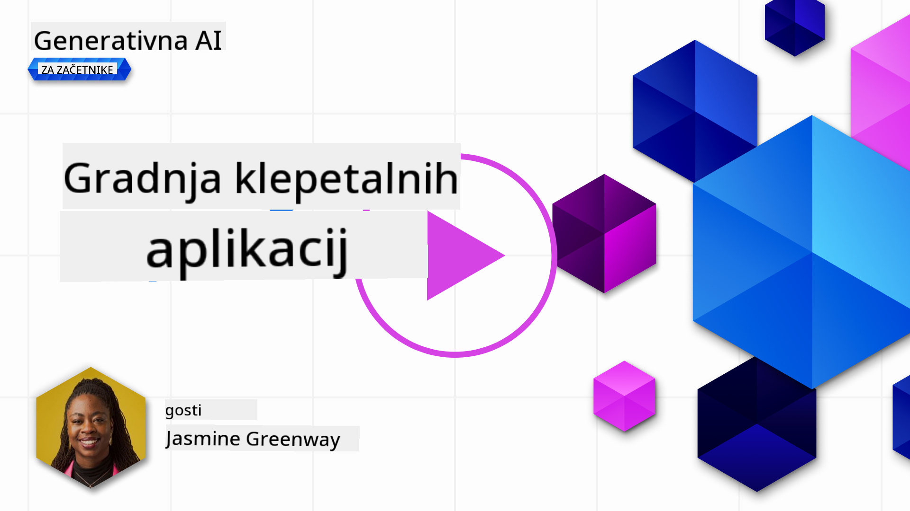
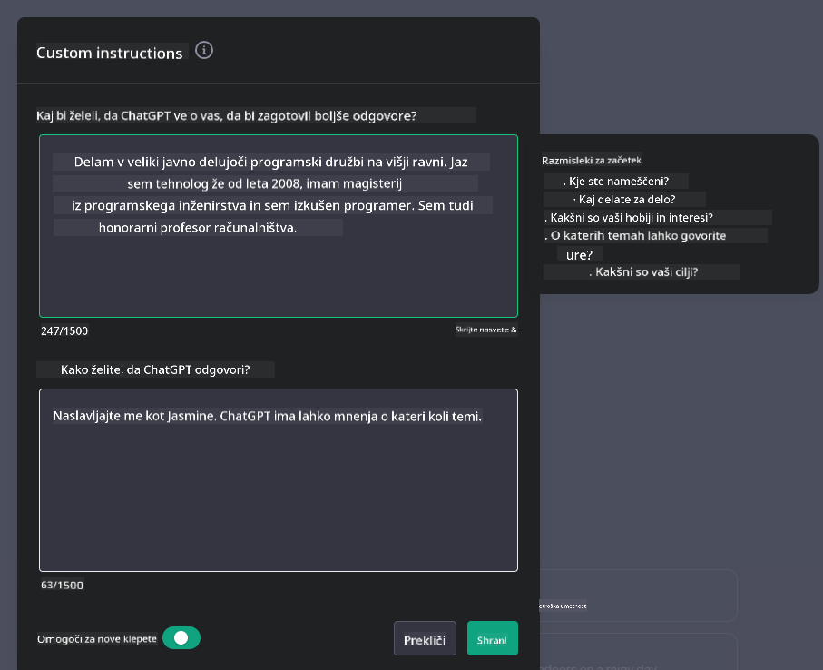

<!--
CO_OP_TRANSLATOR_METADATA:
{
  "original_hash": "ea4bbe640847aafbbba14dae4625e9af",
  "translation_date": "2025-05-19T18:16:26+00:00",
  "source_file": "07-building-chat-applications/README.md",
  "language_code": "sl"
}
-->
# Izdelava klepetalnih aplikacij z generativno umetno inteligenco

[](https://aka.ms/gen-ai-lessons7-gh?WT.mc_id=academic-105485-koreyst)

> _(Kliknite na sliko zgoraj za ogled videa te lekcije)_

Zdaj, ko smo videli, kako lahko izdelamo aplikacije za generiranje besedila, si oglejmo klepetalne aplikacije.

Klepetalne aplikacije so postale del našega vsakdanjega življenja in ponujajo več kot le sredstvo za priložnostne pogovore. So bistveni del storitev za stranke, tehnične podpore in celo kompleksnih svetovalnih sistemov. Verjetno ste pred kratkim dobili pomoč od klepetalne aplikacije. Ko v te platforme vključujemo naprednejše tehnologije, kot je generativna umetna inteligenca, se kompleksnost povečuje, prav tako pa se povečujejo izzivi.

Nekatera vprašanja, na katera moramo odgovoriti, so:

- **Izdelava aplikacije**. Kako učinkovito izdelati in brezhibno integrirati te aplikacije, ki jih poganja umetna inteligenca, za specifične primere uporabe?
- **Spremljanje**. Ko so aplikacije nameščene, kako jih lahko spremljamo in zagotovimo, da delujejo na najvišji ravni kakovosti, tako v smislu funkcionalnosti kot upoštevanja [šestih načel odgovorne umetne inteligence](https://www.microsoft.com/ai/responsible-ai?WT.mc_id=academic-105485-koreyst)?

Ko se premikamo v obdobje, ki ga opredeljuje avtomatizacija in brezhibna interakcija med človekom in strojem, postaja razumevanje, kako generativna umetna inteligenca spreminja obseg, globino in prilagodljivost klepetalnih aplikacij, bistveno. Ta lekcija bo preučila vidike arhitekture, ki podpirajo te kompleksne sisteme, se poglobila v metodologije za njihovo fino nastavitev za naloge, specifične za določen domen, in ocenila merila ter premisleke, pomembne za zagotavljanje odgovornega uvajanja umetne inteligence.

## Uvod

Ta lekcija zajema:

- Tehnike za učinkovito izdelavo in integracijo klepetalnih aplikacij.
- Kako uporabiti prilagajanje in fino nastavitev aplikacij.
- Strategije in premisleki za učinkovito spremljanje klepetalnih aplikacij.

## Cilji učenja

Do konca te lekcije boste sposobni:

- Opišite premisleke za izdelavo in integracijo klepetalnih aplikacij v obstoječe sisteme.
- Prilagodite klepetalne aplikacije za specifične primere uporabe.
- Prepoznajte ključne metrike in premisleke za učinkovito spremljanje in vzdrževanje kakovosti klepetalnih aplikacij, ki jih poganja umetna inteligenca.
- Zagotovite, da klepetalne aplikacije odgovorno izkoriščajo umetno inteligenco.

## Integracija generativne umetne inteligence v klepetalne aplikacije

Izboljšanje klepetalnih aplikacij z generativno umetno inteligenco ni osredotočeno le na njihovo pametnejše delovanje; gre za optimizacijo njihove arhitekture, zmogljivosti in uporabniškega vmesnika za zagotavljanje kakovostne uporabniške izkušnje. To vključuje preučevanje arhitekturnih temeljev, integracij API-jev in premislekov uporabniškega vmesnika. Ta razdelek vam želi ponuditi celovit načrt za navigacijo po teh kompleksnih pokrajinah, ne glede na to, ali jih priključujete v obstoječe sisteme ali jih gradite kot samostojne platforme.

Do konca tega razdelka boste opremljeni z znanjem, potrebnim za učinkovito izdelavo in vključitev klepetalnih aplikacij.

### Klepetalni robot ali klepetalna aplikacija?

Preden se poglobimo v izdelavo klepetalnih aplikacij, primerjajmo 'klepetalne robote' s 'klepetalnimi aplikacijami, ki jih poganja umetna inteligenca', ki imajo različne vloge in funkcionalnosti. Glavni namen klepetalnega robota je avtomatizacija specifičnih nalog pogovora, kot je odgovarjanje na pogosta vprašanja ali sledenje paketu. Običajno ga vodi logika, ki temelji na pravilih, ali kompleksni algoritmi umetne inteligence. Nasprotno pa je klepetalna aplikacija, ki jo poganja umetna inteligenca, veliko bolj obsežno okolje, zasnovano za olajšanje različnih oblik digitalne komunikacije, kot so besedilni, glasovni in video klepeti med človeškimi uporabniki. Njena ključna značilnost je integracija generativnega modela umetne inteligence, ki simulira natančne, človeške pogovore, generira odgovore na podlagi različnih vnosov in kontekstualnih namigov. Klepetalna aplikacija, ki jo poganja generativna umetna inteligenca, se lahko vključuje v odprte pogovore, se prilagaja razvijajočim se kontekstom pogovora in celo ustvarja kreativne ali kompleksne dialoge.

Spodnja tabela opisuje ključne razlike in podobnosti, da nam pomaga razumeti njihove edinstvene vloge v digitalni komunikaciji.

| Klepetalni robot                      | Klepetalna aplikacija, ki jo poganja generativna umetna inteligenca |
| ------------------------------------- | ------------------------------------------------------------------ |
| Osredotočenost na naloge in pravila   | Zavedanje konteksta                                                |
| Pogosto integriran v večje sisteme    | Lahko gosti enega ali več klepetalnih robotov                      |
| Omejen na programirane funkcije       | Vključuje generativne modele umetne inteligence                    |
| Specializirane in strukturirane interakcije | Sposobnost odprtih pogovorov                                     |

### Izkoristitev že pripravljenih funkcionalnosti z SDK-ji in API-ji

Ko gradimo klepetalno aplikacijo, je odličen prvi korak oceniti, kaj je že na voljo. Uporaba SDK-jev in API-jev za gradnjo klepetalnih aplikacij je koristna strategija iz več razlogov. Z integracijo dobro dokumentiranih SDK-jev in API-jev strateško postavljate svojo aplikacijo za dolgoročni uspeh, saj naslavljate pomisleke glede razširljivosti in vzdrževanja.

- **Pospešuje razvojni proces in zmanjšuje stroške**: Zanašanje na že pripravljene funkcionalnosti namesto dragega procesa njihove izdelave vam omogoča, da se osredotočite na druge vidike vaše aplikacije, ki se vam zdijo bolj pomembni, kot je poslovna logika.
- **Boljša zmogljivost**: Ko gradite funkcionalnost iz nič, se boste sčasoma vprašali "Kako se razširja? Ali je ta aplikacija sposobna obvladati nenaden pritok uporabnikov?" Dobro vzdrževani SDK-ji in API-ji pogosto vsebujejo vgrajene rešitve za te pomisleke.
- **Lažje vzdrževanje**: Posodobitve in izboljšave je lažje upravljati, saj večina API-jev in SDK-jev zahteva le posodobitev knjižnice, ko je izdana novejša različica.
- **Dostop do najnovejše tehnologije**: Uporaba modelov, ki so bili fino nastavljeni in usposobljeni na obsežnih podatkovnih zbirkah, omogoča vaši aplikaciji naravne jezikovne sposobnosti.

Dostop do funkcionalnosti SDK-ja ali API-ja običajno vključuje pridobitev dovoljenja za uporabo ponujenih storitev, kar je pogosto preko uporabe edinstvenega ključa ali avtentikacijskega žetona. Uporabili bomo knjižnico OpenAI Python, da raziščemo, kako to izgleda. Lahko poskusite sami v naslednjem [notebooku za OpenAI](../../../07-building-chat-applications/python/oai-assignment.ipynb) ali [notebooku za Azure OpenAI Services](../../../07-building-chat-applications/python/aoai-assignment.ipynb) za to lekcijo.

```python
import os
from openai import OpenAI

API_KEY = os.getenv("OPENAI_API_KEY","")

client = OpenAI(
    api_key=API_KEY
    )

chat_completion = client.chat.completions.create(model="gpt-3.5-turbo", messages=[{"role": "user", "content": "Suggest two titles for an instructional lesson on chat applications for generative AI."}])
```

Zgornji primer uporablja model GPT-3.5 Turbo za dokončanje poziva, vendar opazite, da je ključ API nastavljen pred tem. Prejeli boste napako, če ne nastavite ključa.

## Uporabniška izkušnja (UX)

Splošna načela UX veljajo za klepetalne aplikacije, vendar so tukaj nekateri dodatni premisleki, ki postanejo posebej pomembni zaradi komponent strojnega učenja.

- **Mehanizem za reševanje dvoumnosti**: Generativni modeli umetne inteligence občasno ustvarjajo dvoumne odgovore. Funkcija, ki omogoča uporabnikom, da zahtevajo pojasnila, je lahko koristna, če naletijo na ta problem.
- **Ohranjanje konteksta**: Napredni generativni modeli umetne inteligence imajo sposobnost zapomniti si kontekst znotraj pogovora, kar je lahko nujno za uporabniško izkušnjo. Dajanje uporabnikom možnosti za nadzor in upravljanje konteksta izboljšuje uporabniško izkušnjo, vendar uvaja tveganje ohranjanja občutljivih informacij uporabnika. Premisleki o tem, kako dolgo se te informacije hranijo, kot je uvedba politike hrambe, lahko uravnotežijo potrebo po kontekstu proti zasebnosti.
- **Personalizacija**: S sposobnostjo učenja in prilagajanja modeli umetne inteligence ponujajo individualizirano izkušnjo za uporabnika. Prilagajanje uporabniške izkušnje skozi funkcije, kot so uporabniški profili, ne le da uporabnika počuti razumljenega, ampak tudi pomaga pri iskanju specifičnih odgovorov, kar ustvarja bolj učinkovito in zadovoljivo interakcijo.

Eden takih primerov personalizacije je nastavitev "Custom instructions" v OpenAI-jevi ChatGPT. Omogoča vam, da zagotovite informacije o sebi, ki so lahko pomemben kontekst za vaše pozive. Tukaj je primer prilagojene instrukcije.



Ta "profil" poziva ChatGPT, da ustvari načrt lekcije o povezanih seznamih. Opazite, da ChatGPT upošteva, da uporabnik morda želi bolj poglobljen načrt lekcije glede na njeno izkušnjo.


### Microsoftov okvir sistemskih sporočil za modele velikih jezikov

[Microsoft je zagotovil smernice](https://learn.microsoft.com/azure/ai-services/openai/concepts/system-message#define-the-models-output-format?WT.mc_id=academic-105485-koreyst) za pisanje učinkovitih sistemskih sporočil pri generiranju odgovorov iz LLM-jev, razdeljene na 4 področja:

1. Določanje, za koga je model namenjen, ter njegove sposobnosti in omejitve.
2. Določanje izhodnega formata modela.
3. Zagotavljanje specifičnih primerov, ki prikazujejo nameravano vedenje modela.
4. Zagotavljanje dodatnih varoval vedenja.

### Dostopnost

Ne glede na to, ali ima uporabnik vidne, slušne, motorične ali kognitivne omejitve, bi morala biti dobro zasnovana klepetalna aplikacija uporabna za vse. Naslednji seznam razčlenjuje specifične funkcije, namenjene izboljšanju dostopnosti za različne uporabniške omejitve.

- **Funkcije za vidne omejitve**: Teme z visokim kontrastom in prilagodljivo besedilo, združljivost z bralnikom zaslona.
- **Funkcije za slušne omejitve**: Funkcije pretvorbe besedila v govor in govora v besedilo, vizualni namigi za avdio obvestila.
- **Funkcije za motorične omejitve**: Podpora za navigacijo s tipkovnico, glasovni ukazi.
- **Funkcije za kognitivne omejitve**: Poenostavljene možnosti jezika.

## Prilagajanje in fino nastavljanje za jezikovne modele, specifične za domeno

Predstavljajte si klepetalno aplikacijo, ki razume žargon vaše podjetja in predvideva specifične poizvedbe, ki jih ima njena uporabniška baza. Obstajata dva pristopa, ki sta vredna omembe:

- **Izkoristitev modelov DSL**. DSL pomeni jezik, specifičen za domeno. Uporabite lahko tako imenovani model DSL, usposobljen na specifičnem področju, da razume njegove koncepte in scenarije.
- **Uporaba finega nastavljanja**. Fino nastavljanje je proces nadaljnjega usposabljanja vašega modela s specifičnimi podatki.

## Prilagajanje: Uporaba DSL

Izkoristitev modelov jezika, specifičnega za domeno (DSL modeli), lahko izboljša angažiranost uporabnikov s ponujanjem specializiranih, kontekstualno relevantnih interakcij. To je model, ki je usposobljen ali fino nastavljen za razumevanje in generiranje besedila, povezanega s specifičnim področjem, industrijo ali predmetom. Možnosti uporabe modela DSL se lahko razlikujejo od usposabljanja enega iz nič, do uporabe že obstoječih prek SDK-jev in API-jev. Druga možnost je fino nastavljanje, ki vključuje uporabo obstoječega predusposobljenega modela in njegovo prilagajanje za specifično domeno.

## Prilagajanje: Uporaba finega nastavljanja

Fino nastavljanje se pogosto upošteva, ko predusposobljen model ne dosega pričakovanj na specializiranem področju ali specifični nalogi.

Na primer, medicinske poizvedbe so kompleksne in zahtevajo veliko konteksta. Ko medicinski strokovnjak diagnosticira pacienta, temelji na različnih dejavnikih, kot so življenjski slog ali predhodne bolezni, in se lahko celo zanaša na nedavne medicinske članke, da potrdi svojo diagnozo. V takih niansiranih scenarijih splošna klepetalna aplikacija umetne inteligence ne more biti zanesljiv vir.

### Scenarij: medicinska aplikacija

Razmislite o klepetalni aplikaciji, zasnovani za pomoč medicinskim strokovnjakom z zagotavljanjem hitrih referenc na smernice zdravljenja, interakcije med zdravili ali nedavne raziskovalne ugotovitve.

Splošen model je morda ustrezen za odgovarjanje na osnovna medicinska vprašanja ali zagotavljanje splošnih nasvetov, vendar lahko težko obvladuje naslednje:

- **Zelo specifični ali kompleksni primeri**. Na primer, nevrolog lahko vpraša aplikacijo: "Kakšne so trenutne najboljše prakse za obvladovanje epilepsije, odporne na zdravila, pri pediatričnih pacientih?"
- **Manjkajoči nedavni napredki**. Splošen model bi lahko imel težave pri zagotavljanju trenutnega odgovora, ki vključuje najnovejše napredke v nevrologiji in farmakologiji.

V takih primerih lahko fino nastavljanje modela s specializirano medicinsko podatkovno zbirko bistveno izboljša njegovo sposobnost obravnavanja teh zapletenih medicinskih poizvedb bolj natančno in zanesljivo. To zahteva dostop do velike in ustrezne podatkovne zbirke, ki predstavlja izzive in vprašanja, specifične za domeno, ki jih je treba obravnavati.

## Premisleki za kakovostno izkušnjo klepeta, ki jo poganja umetna inteligenca

Ta razdelek opisuje merila za "visokokakovostne" klepetalne aplikacije, ki vključujejo zajem merljivih metrik in upoštevanje okvira, ki odgovorno izkorišča tehnologijo umetne inteligence.

### Ključne metrike

Za vzdrževanje visokokakovostne zmogljivosti aplikacije je nujno spremljati ključne metrike in premisleke. Te meritve ne le zagotavljajo funkcionalnost aplikacije, temveč tudi ocenjujejo kakovost modela umetne inteligence in uporabniško izkušnjo. Spodaj je seznam, ki pokriva osnovne, AI in uporabniške izkušnje metrike, ki jih je treba upoštevati.

| Metrika                       | Definicija                                                                                                            | Premisleki za razvijalca klepeta                                          |
| ----------------------------- | --------------------------------------------------------------------------------------------------------------------- | ------------------------------------------------------------------------- |
| **Čas delovanja**             | Meri čas, ko je aplikacija operativna in dostopna uporabnikom.                                                        | Kako boste zmanjšali čas nedelovanja?                                     |
| **Čas odgovora**              | Čas, ki ga aplikacija potrebuje za odgovor na poizvedbo uporabnika.                                                   | Kako lahko optimizirate obdelavo poizvedb za izboljšanje časa odgovora?   |
| **Natančnost**                | Razmer

**Omejitev odgovornosti**:  
Ta dokument je bil preveden z uporabo storitve za strojno prevajanje [Co-op Translator](https://github.com/Azure/co-op-translator). Čeprav si prizadevamo za natančnost, vas prosimo, da se zavedate, da lahko avtomatizirani prevodi vsebujejo napake ali netočnosti. Izvirni dokument v njegovem maternem jeziku naj se šteje za avtoritativni vir. Za kritične informacije se priporoča strokovno človeško prevajanje. Ne odgovarjamo za morebitna napačna razumevanja ali napačne razlage, ki izhajajo iz uporabe tega prevoda.