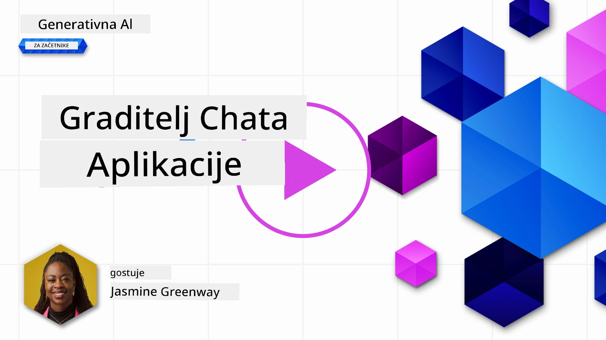
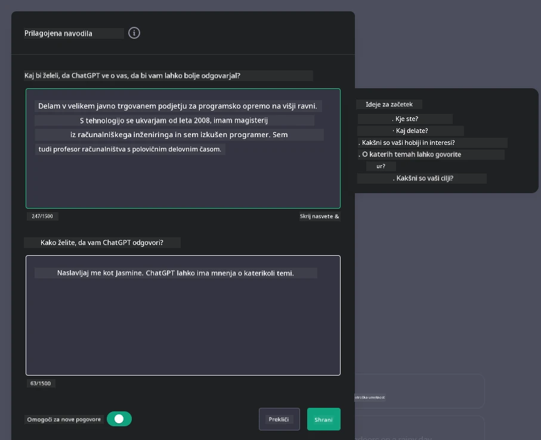
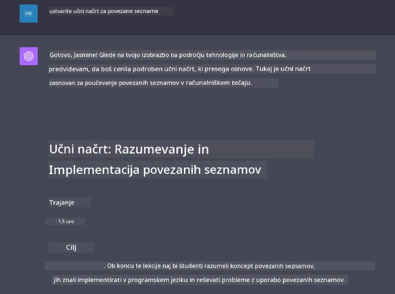

# Gradnja pogovornih aplikacij na osnovi generativne umetne inteligence

[](https://youtu.be/R9V0ZY1BEQo?si=IHuU-fS9YWT8s4sA)

> _(Kliknite zgornjo sliko za ogled videoposnetka te lekcije)_

Zdaj, ko smo videli, kako lahko gradimo aplikacije za generiranje besedila, poglejmo pogovorne aplikacije.

Pogovorne aplikacije so postale del našega vsakdana in ponujajo več kot le način za sproščen pogovor. So ključni deli storitev za stranke, tehnične podpore in celo sofisticiranih svetovalnih sistemov. Verjetno ste pred kratkim prejeli pomoč preko pogovorne aplikacije. Z vključevanjem naprednih tehnologij, kot je generativna umetna inteligenca, v te platforme, se kompleksnost povečuje, prav tako pa tudi izzivi.

Nekatera vprašanja, na katera moramo odgovoriti, so:

- **Gradnja aplikacije**. Kako učinkovito zgraditi in brezhibno integrirati te aplikacije, podprte z AI, za specifične primere uporabe?
- **Nadzor**. Ko so aplikacije uvete, kako jih lahko spremljamo in zagotavljamo, da delujejo na najvišji kakovostni ravni, tako glede funkcionalnosti kot spoštovanja [šestih načel odgovorne umetne inteligence](https://www.microsoft.com/ai/responsible-ai?WT.mc_id=academic-105485-koreyst)?

Ker se premikamo v dobo, ki jo opredeljuje avtomatizacija in brezhibna interakcija med človekom in strojem, je razumevanje, kako generativna umetna inteligenca spreminja obseg, globino in prilagodljivost pogovornih aplikacij, ključnega pomena. Ta lekcija bo raziskala vidike arhitekture, ki podpirajo te zapletene sisteme, metode za njihovo fino prilagajanje za naloge na specifičnih področjih ter ovrednotila metrike in premisleke za zagotavljanje odgovorne uporabe umetne inteligence.

## Uvod

Ta lekcija zajema:

- Tehnike za učinkovito gradnjo in integracijo pogovornih aplikacij.
- Kako uporabiti prilagoditev in fino nastavitev aplikacij.
- Strategije in premisleke za učinkovito spremljanje pogovornih aplikacij.

## Cilji učenja

Do konca te lekcije boste sposobni:

- Opisati premisleke za gradnjo in integracijo pogovornih aplikacij v obstoječe sisteme.
- Prilagoditi pogovorne aplikacije za specifične primere uporabe.
- Prepoznati ključne metrike in premisleke za učinkovito spremljanje in vzdrževanje kakovosti pogovornih aplikacij na osnovi umetne inteligence.
- Zagotoviti, da pogovorne aplikacije uporabljajo umetno inteligenco odgovorno.

## Integracija generativne umetne inteligence v pogovorne aplikacije

Nadgradnja pogovornih aplikacij s generativno umetno inteligenco ni samo v tem, da jih naredimo pametnejše; gre za optimizacijo njihove arhitekture, zmogljivosti in uporabniškega vmesnika za zagotavljanje kakovostne uporabniške izkušnje. To vključuje raziskovanje arhitekturnih temeljev, integracije API-jev in premislekov o uporabniškem vmesniku. Ta razdelek vam želi ponuditi celovito pot za navigacijo po teh zapletenih področjih, ne glede na to, ali jih vključujete v obstoječe sisteme ali gradite kot samostojne platforme.

Do konca tega razdelka boste opremljeni z znanjem, potrebnim za učinkovito gradnjo in vključevanje pogovornih aplikacij.

### Pogovorni robot ali pogovorna aplikacija?

Preden se poglobimo v gradnjo pogovornih aplikacij, primerjajmo 'pogovorne bote' in 'pogovorne aplikacije na osnovi umetne inteligence', ki služijo različnim vlogam in funkcionalnostim. Glavni namen pogovornega bota je avtomatizacija specifičnih pogovornih nalog, na primer odgovarjanje na pogosta vprašanja ali sledenje paketu. Običajno ga upravlja pravilo-based logika ali kompleksni AI algoritmi. Za razliko od tega je pogovorna aplikacija na osnovi umetne inteligence bistveno širše okolje, zasnovano za omogočanje različnih oblik digitalne komunikacije, kot so besedilni, glasovni in video pogovori med ljudmi. Njegova ključna značilnost je integracija generativnega AI modela, ki simulira nijansirane, človeške pogovore in ustvarja odgovore na podlagi širokega nabora vhodnih in kontekstualnih podatkov. Pogovorna aplikacija na osnovi generativne umetne inteligence lahko vodi odprto domeno pogovorov, se prilagaja razvijajočim se kontekstom pogovora in celo ustvarja kreativne ali kompleksne dialoge.

Spodnja tabela povzema ključne razlike in podobnosti, ki nam pomagajo razumeti njihove edinstvene vloge v digitalni komunikaciji.

| Pogovorni bot                       | Pogovorna aplikacija na osnovi generativne umetne inteligence |
| ---------------------------------- | --------------------------------------------------------------- |
| Osredotočen na naloge in pravila    | Zaznava kontekst                                                |
| Pogosto integriran v večje sisteme | Lahko gosti enega ali več pogovornih botov                      |
| Omejen na programirane funkcije     | Vključuje generativne AI modele                                 |
| Specializirane in strukturirane interakcije | Zmožen odprtodomenih razprav                                 |

### Izraba vnaprej pripravljene funkcionalnosti z SDK-ji in API-ji

Pri gradnji pogovorne aplikacije je odličen prvi korak ocena obstoječih rešitev. Uporaba SDK-jev in API-jev za gradnjo pogovornih aplikacij je koristna strategija iz različnih razlogov. Z integracijo dobro dokumentiranih SDK-jev in API-jev strateško pozicionirate vašo aplikacijo za dolgoročni uspeh, obravnavate vprašanja razširljivosti in vzdrževanja.

- **Pospeši razvojni proces in zmanjša stroške**: Zanašanje na vnaprej pripravljene funkcije namesto dragih postopkov samostojne izdelave vam omogoča, da se osredotočite na druge vidike vaše aplikacije, ki so vam morda bolj pomembni, kot je poslovna logika.
- **Boljša zmogljivost**: Pri gradnji funkcionalnosti od začetka se boste sčasoma vprašali "Kako se to širi? Ali je ta aplikacija sposobna obvladovati nenaden porast uporabnikov?" Dobro vzdrževani SDK-ji in API-ji pogosto vključujejo že vgrajene rešitve za te izzive.
- **Lažje vzdrževanje**: Posodobitve in izboljšave je lažje upravljati, saj večina API-jev in SDK-jev zahteva samo posodobitev knjižnice ob izdaji novejše različice.
- **Dostop do najsodobnejše tehnologije**: Uporaba modelov, ki so bili fino nastavljeni in trenirani na obsežnih podatkovnih zbirkah, zagotavlja vaši aplikaciji zmožnosti naravnega jezika.

Dostop do funkcionalnosti SDK-ja ali API-ja običajno zahteva dovoljenje za uporabo ponujenih storitev, ki je pogosto omogočeno z edinstvenim ključem ali avtentikacijskim žetonom. Za raziskovanje tega bomo uporabili OpenAI Python knjižnico. Lahko jo poskusite tudi sami v naslednjem [zvezku za OpenAI](./python/oai-assignment.ipynb?WT.mc_id=academic-105485-koreyst) ali [zvezku za Azure OpenAI storitve](./python/aoai-assignment.ipynb?WT.mc_id=academic-105485-koreys) za to lekcijo.

```python
import os
from openai import OpenAI

API_KEY = os.getenv("OPENAI_API_KEY","")

client = OpenAI(
    api_key=API_KEY
    )

response = client.responses.create(model="gpt-5-mini", input="Suggest two titles for an instructional lesson on chat applications for generative AI.", store=False)
print(response.output_text)
```

Zgornji primer uporablja model GPT-5 mini z API-jem za odgovore, da dopolni poziv, vendar opazite, da je API ključ nastavljen prej. Če ključ ne bi bil nastavljen, bi prejeli napako.

## Uporabniška izkušnja (UX)

Splošna načela UX veljajo za pogovorne aplikacije, vendar so tukaj še nekateri dodatni premisleki, ki postanejo posebej pomembni zaradi vključenih komponent strojnega učenja.

- **Mehanizem za reševanje nejasnosti**: Generativni AI modeli včasih ustvarijo nejasne odgovore. Funkcija, ki omogoča uporabnikom, da zaprosijo za pojasnilo, je lahko koristna, če naletijo na ta problem.
- **Ohranjanje konteksta**: Napredni generativni AI modeli imajo sposobnost zapomniti si kontekst znotraj pogovora, kar je lahko pomemben doprinos k uporabniški izkušnji. Omogočanje uporabnikom, da nadzorujejo in upravljajo kontekst, izboljšuje uporabniško izkušnjo, vendar prinaša tveganje shranjevanja občutljivih uporabniških podatkov. Premisleki o tem, kako dolgo se ti podatki hranijo, kot je uvedba obdobja hranjenja, lahko uravnotežijo potrebo po kontekstu glede na zasebnost.
- **Personalizacija**: Z zmožnostjo učenja in prilagajanja AI modeli nudijo individualizirano izkušnjo za uporabnika. Prilagajanje uporabniške izkušnje preko funkcij, kot so uporabniški profili, ne le da naredi uporabnika občutnega in razumljenega, ampak vam tudi pomaga najti specifične odgovore, s čimer ustvarja učinkovitejšo in zadovoljujočo interakcijo.

Eden takšnih primerov personalizacije so "Nastavitve po meri" v OpenAI ChatGPT. Omogočajo vam, da podate informacije o sebi, ki so lahko pomemben kontekst za vaše pozive. Tukaj je primer prilagojenih navodil.



Ta "profil" spodbuja ChatGPT, da ustvari učni načrt o povezanih seznamih. Opazimo, da ChatGPT upošteva, da uporabnica morda želi bolj poglobljen učni načrt glede na svojo izkušnjo.



### Microsoftov sistemski okvir za velika jezikovna modela

[Microsoft je zagotovil smernice](https://learn.microsoft.com/azure/ai-foundry/openai/concepts/system-message#define-the-models-output-format?WT.mc_id=academic-105485-koreyst) za pisanje učinkovitih sistemskih sporočil pri generiranju odgovorov iz LLM-jev, razdeljen na 4 področja:

1. Določanje, za koga je model namenjen, ter njegovih zmožnosti in omejitev.
2. Določanje izhodnega formata modela.
3. Zagotavljanje specifičnih primerov, ki prikazujejo predvideno vedenje modela.
4. Zagotavljanje dodatnih vedenjskih varovalk.

### Dostopnost

Ne glede na to, ali ima uporabnik vidne, slušne, motorične ali kognitivne ovire, mora biti dobro zasnovana pogovorna aplikacija uporabna za vse. Spodnji seznam povzema specifične funkcije, namenjene izboljšanju dostopnosti za različne uporabniške omejitve.

- **Funkcije za vidno okvaro**: Tematski visoki kontrasti in nastavljiva velikost pisave, združljivost s čitalci zaslona.
- **Funkcije za slušno okvaro**: Funkcije besedila v govor in govora v besedilo, vizualni signali za zvočna obvestila.
- **Funkcije za motorično okvaro**: Podpora za navigacijo s tipkovnico, glasovni ukazi.
- **Funkcije za kognitivno okvaro**: Poenostavljene jezikovne možnosti.

## Prilagoditev in fino nastavljanje jezikovnih modelov za specifična področja

Predstavljajte si pogovorno aplikacijo, ki razume žargon vašega podjetja in predvideva specifična vprašanja, ki jih pogosto postavljajo njeni uporabniki. Obstaja nekaj pristopov, ki jih je vredno omeniti:

- **Uporaba modelov specifičnega jezika (DSL)**. DSL pomeni domeno specifični jezik. Lahko uporabite t.i. DSL model, treniran na določeni domeni, da razume njene koncepte in scenarije.
- **Uporaba fine-nastavitve**. Fine-nastavitev je proces dodatnega treniranja vašega modela s specifičnimi podatki.

## Prilagoditev: uporaba DSL

Uporaba modelov specifičnega jezika (DSL modeli) lahko poveča angažiranost uporabnikov in zagotovi specializirane, kontekstualno relevantne interakcije. Gre za model, ki je treniran ali fino nastavljen za razumevanje in ustvarjanje besedila, povezanega z določeno področjem, industrijo ali temo. Možnosti uporabe DSL modela se razlikujejo od treniranja enega od začetka do uporabe obstoječih preko SDK-jev in API-jev. Druga možnost je fino nastavljanje, ki vključuje prilagoditev obstoječega vnaprej usposobljenega modela za specifično domeno.

## Prilagoditev: uporaba fine-nastavitve

Fine-nastavitev se pogosto uporabi, kadar vnaprej usposobljen model zaostaja na specializiranem področju ali specifični nalogi.

Na primer, medicinska vprašanja so kompleksna in zahtevajo veliko konteksta. Ko medicinski strokovnjak diagnosticira pacienta, to temelji na različnih dejavnikih, kot so življenjski slog ali predhodna stanja, lahko se opira tudi na najnovejše medicinske revije za potrditev diagnoze. V takih izpopolnjenih scenarijih splošna AI pogovorna aplikacija ne more biti zanesljiv vir.

### Scenarij: medicinska aplikacija

Predstavljajte si pogovorno aplikacijo, zasnovano za pomoč medicinskim delavcem z zagotavljanjem hitrih referenc za smernice zdravljenja, interakcije zdravil ali najnovejših raziskovalnih ugotovitev.

Splošni model je morda zadosten za odgovore na osnovna medicinska vprašanja ali splošne nasvete, a se lahko spopada z naslednjim:

- **Zelo specifični ali kompleksni primeri**. Na primer, nevrolog bi lahko vprašal aplikacijo: "Kateri so trenutno najboljši postopki za upravljanje zdravilno odporne epilepsije pri pediatričnih pacientih?"
- **Pomanjkanje najnovejših dognanj**. Splošni model lahko težko zagotovi aktualen odgovor, ki vključuje najnovejša dognanja na področju nevrologije in farmakologije.

V primerih, kot so ti, lahko fino nastavljanje modela s specializiranim medicinskim naborom podatkov bistveno izboljša njegovo sposobnost natančnega in zanesljivega obravnavanja teh zahtevnih medicinskih vprašanj. To zahteva dostop do velike in relevantne zbirke podatkov, ki predstavlja težave in vprašanja specifična za domeno.

## Premisleki za visokokakovostno uporabniško izkušnjo pogovorov z AI

Ta razdelek opisuje kriterije za "visokokakovostne" pogovorne aplikacije, ki vključujejo zajem ključnih metrik in spoštovanje okvira, ki odgovorno uporablja tehnologijo umetne inteligence.

### Ključne metrike

Za vzdrževanje visokokakovostne zmogljivosti aplikacije je bistveno spremljati ključne metrike in premisleke. Te meritve ne zagotavljajo le delovanja aplikacije, ampak tudi ocenjujejo kakovost AI modela in uporabniške izkušnje. Spodaj je seznam, ki zajema osnovne, AI in metrike uporabniške izkušnje, ki jih je treba upoštevati.

| Metrične           | Definicija                                                                                                           | Premisleki za razvijalca pogovora                               |
| ------------------ | ------------------------------------------------------------------------------------------------------------------- | -------------------------------------------------------------- |
| **Dostopnost (Uptime)** | Meri čas, ko je aplikacija operativna in dostopna uporabnikom.                                                     | Kako boste zmanjšali izpad delovanja?                           |
| **Čas odziva**      | Čas, ki ga aplikacija potrebuje za odgovor na uporabniško vprašanje.                                                | Kako lahko optimizirate obdelavo poizvedbe za izboljšanje časa odziva? |
| **Natančnost**      | Razmerje pravih pozitivnih napovedi glede na skupno število pozitivnih napovedi.                                     | Kako boste preverili natančnost svojega modela?                 |
| **Pokritost (Sensitivity)** | Razmerje pravih pozitivnih napovedi glede na dejansko število pozitivnih.                                          | Kako boste merili in izboljšali pokritost?                      |
| **F1 rezultat**     | Harmonično povprečje natančnosti in pokritosti, ki uravnava kompromis med obema.                                    | Kakšen je vaš cilj za F1 rezultat? Kako boste uravnotežili natančnost in pokritost? |
| **Perpleksnost**    | Meri, kako dobro verjetnostna porazdelitev, ki jo napoveduje model, sovpada z dejansko porazdelitvijo podatkov.      | Kako boste zmanjšali perpleksnost?                              |
| **Metrike zadovoljstva uporabnika** | Meri zaznavo uporabnika o aplikaciji. Pogosto zajeta preko anket.                                                   | Kako pogosto boste zbirali povratne informacije uporabnikov? Kako se boste prilagajali na podlagi tega? |
| **Stopnja napak**   | Stopnja, pri kateri model dela napake pri razumevanju ali izhodu.                                                    | Katere strategije imate za znižanje stopnje napak?             |
| **Cikli ponovnega treniranja** | Pogostost, s katero se model posodablja z vključevanjem novih podatkov in vpogledov.                             | Kako pogosto boste ponovno trenirali model? Kaj sproži cikel ponovnega treniranja? |

| **Odkrivanje anomalij**         | Orodja in tehnike za prepoznavanje nenavadnih vzorcev, ki ne ustrezajo pričakovanemu vedenju.                        | Kako boste odgovorili na anomalije?                                        |

### Izvajanje praks odgovorne umetne inteligence v klepetalnih aplikacijah

Microsoftov pristop k odgovorni umetni inteligenci je opredelil šest načel, ki bi morali usmerjati razvoj in uporabo umetne inteligence. Spodaj so načela, njihove definicije in stvari, ki jih mora razvijalec klepeta upoštevati ter zakaj jih mora jemati resno.

| Načela                | Microsoftova definicija                                | Premisleki za razvijalca klepeta                                | Zakaj je pomembno                                                                   |
| ---------------------- | ----------------------------------------------------- | ---------------------------------------------------------------- | ----------------------------------------------------------------------------------- |
| Poštenost             | Sistemi umetne inteligence morajo vse ljudi obravnavati pošteno. | Poskrbite, da klepetalna aplikacija ne diskriminira na podlagi uporabniških podatkov. | Za gradnjo zaupanja in vključujočnosti med uporabniki; preprečuje pravne posledice. |
| Zanesljivost in varnost | Sistemi umetne inteligence morajo delovati zanesljivo in varno. | Izvedite testiranja in varnostne mehanizme, da zmanjšate napake in tveganja. | Zagotavlja zadovoljstvo uporabnikov in preprečuje morebitno škodo.                   |
| Zasebnost in varnost  | Sistemi umetne inteligence morajo biti varni in spoštovati zasebnost. | Uvedite močno šifriranje in ukrepe za zaščito podatkov.             | Za zaščito občutljivih uporabniških podatkov in skladnost z zakonodajo o zasebnosti. |
| Vključenost           | Sistemi umetne inteligence morajo opolnomočiti vsakogar in vključevati ljudi. | Oblikujte UI/UX, ki je dostopna in enostavna za uporabo raznoliki publiki. | Zagotavlja, da lahko širši krog ljudi učinkovito uporablja aplikacijo.                |
| Transparentnost       | Sistemi umetne inteligence morajo biti razumljivi.    | Zagotovite jasno dokumentacijo in utemeljitev odgovorov umetne inteligence. | Uporabniki bodo bolj zaupali sistemu, če bodo razumeli, kako so sprejete odločitve.  |
| Odgovornost           | Ljudje morajo biti odgovorni za sisteme umetne inteligence. | Vzpostavite jasen postopek za revizijo in izboljšave odločitev umetne inteligence. | Omogoča stalno izboljševanje in korektivne ukrepe v primeru napak.                    |

## Naloga

Oglejte si [nalogo](../../../07-building-chat-applications/python). Vodila vas bo skozi vrsto vaj od zagona prvih klepetalnih pozivov, do klasifikacije in povzemanja besedil in več. Opazili boste, da so naloge na voljo v različnih programskih jezikih!

## Odlično delo! Nadaljujte pot

Po zaključku te lekcije si oglejte našo [zbirko za učenje generativne umetne inteligence](https://aka.ms/genai-collection?WT.mc_id=academic-105485-koreyst), da nadaljujete z dvigovanjem svojega znanja o generativni umetni inteligenci!

Pojdite na Lekcijo 8, kjer boste videli, kako lahko začnete [graditi iskalne aplikacije](../08-building-search-applications/README.md?WT.mc_id=academic-105485-koreyst)!

---

<!-- CO-OP TRANSLATOR DISCLAIMER START -->
**Omejitev odgovornosti**:
Ta dokument je bil preveden z uporabo AI prevajalske storitve [Co-op Translator](https://github.com/Azure/co-op-translator). Čeprav si prizadevamo za natančnost, vas prosimo, da upoštevate, da avtomatizirani prevodi lahko vsebujejo napake ali netočnosti. Izvirni dokument v njegovem izvirnem jeziku je treba obravnavati kot avtoritativni vir. Za kritične informacije je priporočljiv strokovni človeški prevod. Ne odgovarjamo za morebitna nesporazume ali napačne interpretacije, ki izhajajo iz uporabe tega prevoda.
<!-- CO-OP TRANSLATOR DISCLAIMER END -->