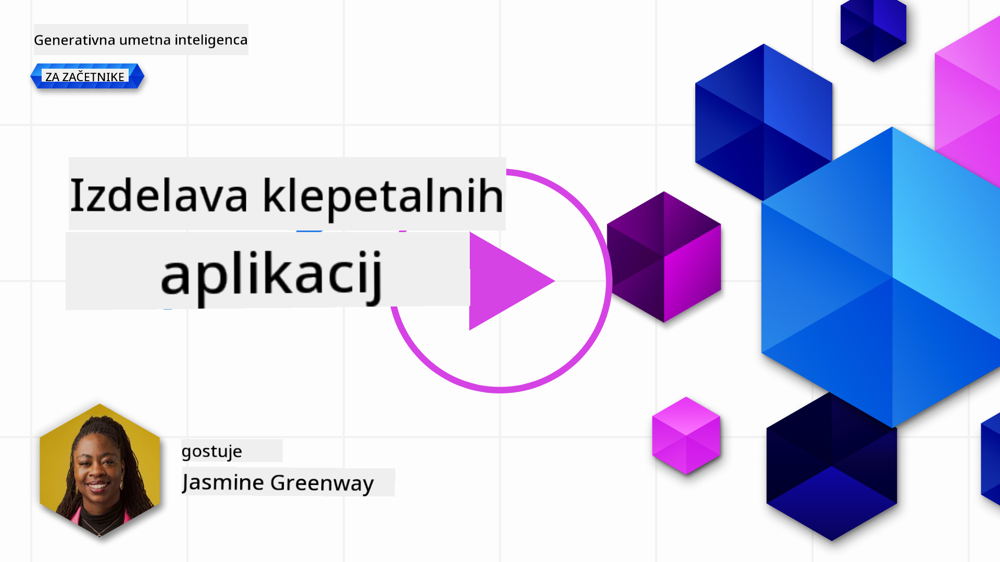
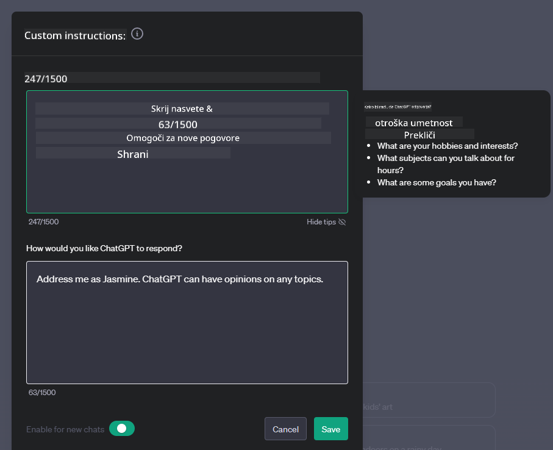
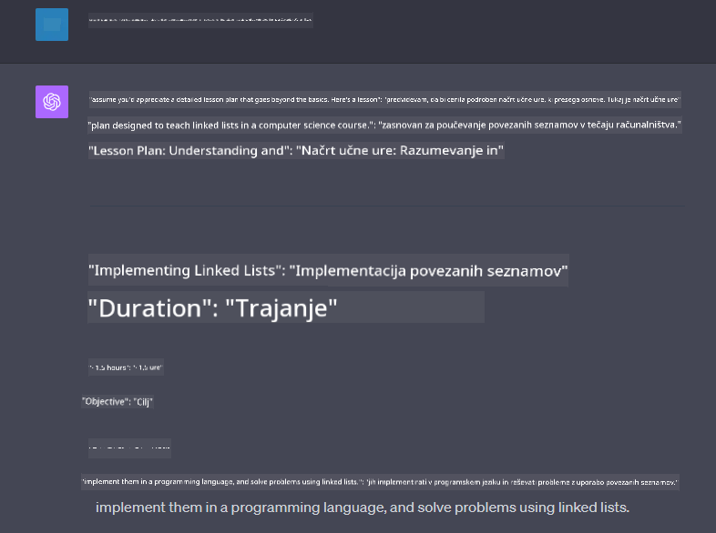

<!--
CO_OP_TRANSLATOR_METADATA:
{
  "original_hash": "ea4bbe640847aafbbba14dae4625e9af",
  "translation_date": "2025-06-25T16:03:30+00:00",
  "source_file": "07-building-chat-applications/README.md",
  "language_code": "sl"
}
-->
# Gradnja klepetalnih aplikacij, ki jih poganja generativna umetna inteligenca

[](https://aka.ms/gen-ai-lessons7-gh?WT.mc_id=academic-105485-koreyst)

> _(Kliknite zgornjo sliko za ogled videa te lekcije)_

Zdaj, ko smo videli, kako lahko gradimo aplikacije za generiranje besedila, poglejmo klepetalne aplikacije.

Klepetalne aplikacije so postale del našega vsakdana in ponujajo več kot le sredstvo za neformalno komunikacijo. So sestavni deli storitev za stranke, tehnične podpore in celo naprednih svetovalnih sistemov. Verjetno ste pred kratkim prejeli pomoč prek klepetalne aplikacije. Z vključevanjem naprednih tehnologij, kot je generativna umetna inteligenca, se povečuje kompleksnost in s tem tudi izzivi.

Nekatera vprašanja, na katera moramo odgovoriti, so:

- **Gradnja aplikacije**. Kako učinkovito zgradimo in brezhibno vključimo te aplikacije, ki jih poganja umetna inteligenca, za specifične primere uporabe?
- **Nadzor**. Ko so aplikacije uvedene, kako lahko spremljamo in zagotovimo, da delujejo na najvišji ravni kakovosti, tako v smislu funkcionalnosti kot spoštovanja [šestih načel odgovorne umetne inteligence](https://www.microsoft.com/ai/responsible-ai?WT.mc_id=academic-105485-koreyst)?

Ko se pomikamo v dobo, ki jo opredeljuje avtomatizacija in brezhibna interakcija med ljudmi in stroji, postaja razumevanje, kako generativna umetna inteligenca preoblikuje obseg, globino in prilagodljivost klepetalnih aplikacij, bistveno. Ta lekcija bo raziskala vidike arhitekture, ki podpirajo te zapletene sisteme, poglobila se bo v metodologije za njihovo prilagajanje specifičnim nalogam in ocenila metrike ter premisleke, pomembne za zagotavljanje odgovornega uvajanja umetne inteligence.

## Uvod

Ta lekcija pokriva:

- Tehnike za učinkovito gradnjo in integracijo klepetalnih aplikacij.
- Kako prilagoditi in fino nastaviti aplikacije.
- Strategije in premisleki za učinkovito spremljanje klepetalnih aplikacij.

## Cilji učenja

Do konca te lekcije boste lahko:

- Opisali premisleke za gradnjo in integracijo klepetalnih aplikacij v obstoječe sisteme.
- Prilagodili klepetalne aplikacije za specifične primere uporabe.
- Prepoznali ključne metrike in premisleke za učinkovito spremljanje in vzdrževanje kakovosti klepetalnih aplikacij, ki jih poganja umetna inteligenca.
- Zagotovili, da klepetalne aplikacije odgovorno izkoriščajo umetno inteligenco.

## Integracija generativne umetne inteligence v klepetalne aplikacije

Povišanje klepetalnih aplikacij z generativno umetno inteligenco ni osredotočeno le na njihovo pametnejše delovanje; gre za optimizacijo njihove arhitekture, zmogljivosti in uporabniškega vmesnika za zagotavljanje kakovostne uporabniške izkušnje. To vključuje raziskovanje arhitekturnih temeljev, integracij API-jev in premislekov o uporabniškem vmesniku. Ta odsek vam želi ponuditi celovit načrt za navigacijo po teh kompleksnih pokrajinah, ne glede na to, ali jih priključujete v obstoječe sisteme ali jih gradite kot samostojne platforme.

Do konca tega odseka boste opremljeni z znanjem, potrebnim za učinkovito gradnjo in vključevanje klepetalnih aplikacij.

### Klepetalni robot ali klepetalna aplikacija?

Preden se poglobimo v gradnjo klepetalnih aplikacij, primerjajmo 'klepetalne robote' z 'aplikacijami za klepet, ki jih poganja umetna inteligenca,' ki služijo različnim vlogam in funkcionalnostim. Glavni namen klepetalnega robota je avtomatizacija specifičnih pogovornih nalog, kot so odgovarjanje na pogosto zastavljena vprašanja ali sledenje paketu. Običajno ga upravljajo pravila ali zapleteni algoritmi umetne inteligence. Nasprotno pa je klepetalna aplikacija, ki jo poganja umetna inteligenca, veliko bolj obsežno okolje, zasnovano za olajšanje različnih oblik digitalne komunikacije, kot so besedilni, glasovni in video klepeti med človeškimi uporabniki. Njena opredeljujoča značilnost je integracija generativnega modela umetne inteligence, ki simulira nianse, človeku podobne pogovore, in ustvarja odgovore na podlagi široke palete vnosov in kontekstualnih namigov. Klepetalna aplikacija, ki jo poganja generativna umetna inteligenca, se lahko vključi v odprte pogovore, prilagodi spreminjajočim se kontekstom pogovorov in celo ustvari ustvarjalne ali zapletene dialoge.

Spodnja tabela prikazuje ključne razlike in podobnosti, ki nam pomagajo razumeti njihove edinstvene vloge v digitalni komunikaciji.

| Klepetalni robot                       | Klepetalna aplikacija, ki jo poganja generativna AI |
| -------------------------------------- | -------------------------------------------------- |
| Osredotočen na naloge in temelji na pravilih | Zavedanje konteksta                                |
| Pogosto integriran v večje sisteme     | Lahko gosti enega ali več klepetalnih robotov      |
| Omejen na programirane funkcije        | Vključuje generativne AI modele                     |
| Specializirane in strukturirane interakcije | Sposoben odprtih pogovorov                        |

### Izkoristek vnaprej pripravljenih funkcionalnosti z SDK-ji in API-ji

Pri gradnji klepetalne aplikacije je dober prvi korak oceniti, kaj že obstaja. Uporaba SDK-jev in API-jev za gradnjo klepetalnih aplikacij je ugodna strategija iz različnih razlogov. Z integracijo dobro dokumentiranih SDK-jev in API-jev strateško postavljate svojo aplikacijo za dolgoročni uspeh, obravnavate vprašanja skalabilnosti in vzdrževanja.

- **Pospeši razvojni proces in zmanjšuje stroške**: Zanašanje na vnaprej pripravljene funkcionalnosti namesto na drag postopek njihove lastne gradnje vam omogoča, da se osredotočite na druge vidike svoje aplikacije, ki jih morda ocenjujete kot pomembnejše, kot je poslovna logika.
- **Boljša zmogljivost**: Ko gradite funkcionalnost od začetka, se boste sčasoma vprašali "Kako se to širi? Ali je ta aplikacija sposobna obvladati nenaden porast uporabnikov?" Dobro vzdrževani SDK-ji in API-ji pogosto vsebujejo vgrajene rešitve za te skrbi.
- **Lažje vzdrževanje**: Posodobitve in izboljšave so lažje za upravljanje, saj večina API-jev in SDK-jev zahteva le posodobitev knjižnice, ko je izdana novejša različica.
- **Dostop do najnovejše tehnologije**: Izkoristek modelov, ki so bili fino nastavljeni in usposobljeni na obsežnih podatkovnih nizih, zagotavlja vaši aplikaciji naravne jezikovne sposobnosti.

Dostop do funkcionalnosti SDK-ja ali API-ja običajno vključuje pridobitev dovoljenja za uporabo ponujenih storitev, kar je pogosto izvedeno z uporabo edinstvenega ključa ali avtentikacijskega žetona. Uporabili bomo knjižnico OpenAI Python, da raziščemo, kako to izgleda. Lahko pa to preizkusite sami v naslednjem [zvezku za OpenAI](../../../07-building-chat-applications/python/oai-assignment.ipynb) ali [zvezku za Azure OpenAI Services](../../../07-building-chat-applications/python/aoai-assignment.ipynb) za to lekcijo.

```python
import os
from openai import OpenAI

API_KEY = os.getenv("OPENAI_API_KEY","")

client = OpenAI(
    api_key=API_KEY
    )

chat_completion = client.chat.completions.create(model="gpt-3.5-turbo", messages=[{"role": "user", "content": "Suggest two titles for an instructional lesson on chat applications for generative AI."}])
```

Zgornji primer uporablja model GPT-3.5 Turbo za dokončanje poziva, vendar opazite, da je ključ API nastavljen pred tem. Prejeli boste napako, če ključa ne nastavite.

## Uporabniška izkušnja (UX)

Splošna načela UX veljajo za klepetalne aplikacije, vendar so tukaj nekateri dodatni premisleki, ki postanejo še posebej pomembni zaradi vključenih komponent strojnega učenja.

- **Mehanizem za obravnavanje nejasnosti**: Generativni AI modeli občasno ustvarjajo dvoumne odgovore. Funkcija, ki uporabnikom omogoča, da zahtevajo pojasnila, je lahko koristna, če naletijo na to težavo.
- **Ohranjanje konteksta**: Napredni generativni AI modeli imajo sposobnost, da si zapomnijo kontekst znotraj pogovora, kar je lahko potrebna prednost za uporabniško izkušnjo. Uporabnikom omogočanje nadzora in upravljanja konteksta izboljšuje uporabniško izkušnjo, vendar uvaja tveganje zadrževanja občutljivih uporabniških informacij. Premisleki o tem, kako dolgo se te informacije shranjujejo, kot je uvedba politike zadrževanja, lahko uravnotežijo potrebo po kontekstu z zasebnostjo.
- **Personalizacija**: S sposobnostjo učenja in prilagajanja AI modeli ponujajo individualizirano izkušnjo za uporabnika. Prilagajanje uporabniške izkušnje z značilnostmi, kot so uporabniški profili, ne samo, da uporabnika naredi razumljenega, ampak tudi pomaga pri iskanju specifičnih odgovorov, kar ustvarja bolj učinkovito in zadovoljivo interakcijo.

Eden takšnih primerov personalizacije je nastavitev "Custom instructions" v OpenAI-jevem ChatGPT. Omogoča vam, da posredujete informacije o sebi, ki so lahko pomemben kontekst za vaše pozive. Tukaj je primer prilagojene instrukcije.



Ta "profil" poziva ChatGPT, da ustvari načrt lekcije o povezanih seznamih. Opazite, da ChatGPT upošteva, da uporabnik morda želi bolj poglobljen načrt lekcije glede na njene izkušnje.



### Microsoftov okvir sistemskih sporočil za velike jezikovne modele

[Microsoft je zagotovil smernice](https://learn.microsoft.com/azure/ai-services/openai/concepts/system-message#define-the-models-output-format?WT.mc_id=academic-105485-koreyst) za pisanje učinkovitih sistemskih sporočil pri generiranju odgovorov iz velikih jezikovnih modelov, razdeljene na 4 področja:

1. Določitev, za koga je model, ter njegove sposobnosti in omejitve.
2. Določitev izhodnega formata modela.
3. Nudenje specifičnih primerov, ki prikazujejo nameravano vedenje modela.
4. Nudenje dodatnih varovalnih ukrepov za vedenje.

### Dostopnost

Ne glede na to, ali ima uporabnik vizualne, slušne, motorične ali kognitivne motnje, bi morala biti dobro zasnovana klepetalna aplikacija uporabna za vse. Naslednji seznam razčlenjuje specifične funkcije, namenjene izboljšanju dostopnosti za različne uporabniške motnje.

- **Funkcije za vizualne motnje**: Teme z visokim kontrastom in prilagodljivo besedilo, združljivost z bralnikom zaslona.
- **Funkcije za slušne motnje**: Funkcije pretvorbe besedila v govor in govora v besedilo, vizualni namigi za zvočna obvestila.
- **Funkcije za motorične motnje**: Podpora za navigacijo s tipkovnico, glasovni ukazi.
- **Funkcije za kognitivne motnje**: Možnosti poenostavljenega jezika.

## Prilagajanje in fino nastavljanje za jezikovne modele specifične za področje

Predstavljajte si klepetalno aplikacijo, ki razume žargon vašega podjetja in predvideva specifične poizvedbe, ki jih ima njegova uporabniška baza. Obstaja nekaj pristopov, ki jih je vredno omeniti:

- **Izkoristek modelov DSL**. DSL pomeni jezik specifičen za področje. Lahko izkoristite tako imenovani model DSL, usposobljen na specifičnem področju, da razume njegove koncepte in scenarije.
- **Uporaba finega nastavljanja**. Fino nastavljanje je postopek nadaljnjega usposabljanja vašega modela s specifičnimi podatki.

## Prilagajanje: Uporaba DSL

Izkoristek jezikovnih modelov specifičnih za področje (DSL modeli) lahko izboljša angažiranost uporabnikov z zagotavljanjem specializiranih, kontekstualno relevantnih interakcij. To je model, ki je usposobljen ali fino nastavljen za razumevanje in generiranje besedila, povezanega z določenim področjem, industrijo ali predmetom. Možnosti za uporabo modela DSL se lahko razlikujejo od usposabljanja enega od začetka do uporabe že obstoječih prek SDK-jev in API-jev. Druga možnost je fino nastavljanje, ki vključuje prilagoditev že obstoječega modela za specifično področje.

## Prilagajanje: Uporaba finega nastavljanja

Fino nastavljanje se pogosto uporablja, ko vnaprej usposobljen model ne zadostuje na specializiranem področju ali za specifično nalogo.

Na primer, medicinske poizvedbe so zapletene in zahtevajo veliko konteksta. Ko medicinski strokovnjak diagnosticira pacienta, temelji na različnih dejavnikih, kot so življenjski slog ali obstoječa stanja, in se lahko celo opira na nedavne medicinske revije, da potrdi svojo diagnozo. V takih niansiranih scenarijih splošno usmerjena AI klepetalna aplikacija ne more biti zanesljiv vir.

### Scenarij: medicinska aplikacija

Razmislite o klepetalni aplikaciji, zasnovani za pomoč medicinskim strokovnjakom z zagotavljanjem hitrih referenc na smernice zdravljenja, interakcije zdravil ali nedavne raziskovalne ugotovitve.

Splošno usmerjen model bi bil morda primeren za odgovarjanje na osnovna medicinska vprašanja ali zagotavljanje splošnih nasvetov, vendar bi lahko imel težave z naslednjim:

- **Zelo specifični ali zapleteni primeri**. Na primer, nevrolog bi lahko vprašal aplikacijo: "Kakšne so trenutne najboljše prakse za obvladovanje epilepsije, odporne na zdravila, pri pediatričnih bolnikih?"
- **Pomanjkanje nedavnih napredkov**. Splošno usmerjen model bi se lahko trudil zagotoviti trenutni odgovor, ki vključuje najnovejše napredke v nevrologiji in farmakologiji.

V primerih, kot so ti, lahko fino nastavljanje modela z specializiranim medicinskim podatkovnim nizom bistveno izboljša njegovo sposobnost obravnave teh zapletenih medicinskih poizvedb bolj natančno in zanesljivo. To zahteva dostop do velikega in ustreznega podatkovnega niza, ki predstavlja izzive in vprašanja specifična za področje, ki jih je treba obravnavati.

## Premisleki za visoko kakovostno izkušnjo z AI-poganjanimi klepeti

Ta odsek opisuje merila za "visoko kakovostne" klepetalne aplikacije, ki vključujejo zajemanje ukrepnih metrik in upoštevanje okvira, ki odgovorno izkorišča tehnologijo umetne inteligence.

### Ključne metrike

Za ohranjanje visoko kakovostne zmogljivosti aplikacije je bistveno, da spremljate ključne metrike in premisleke. Te meritve ne zagotavljajo le funkcionalnosti aplikacije, temveč tudi ocenjujejo kakovost AI modela in uporabniško izkušnjo. Spodaj je seznam, ki pokriva osnovne, AI in uporabniške izkušnje metrike, ki jih je treba upoštevati.

| Metrika                      | Definicija                                                                                                             | Premisleki za razvijalca klepeta                                         |
| ---------------------------- | ---------------------------------------------------------------------------------------------------------------------- | ------------------------------------------------------------------------ |
| **Čas delovanja**            | Meri čas, ko je aplikacija operativna in dostopna uporabnikom.                                                        | Kako boste zmanjšali izpad?                                              |
| **Čas odziva**               | Čas, ki ga aplikacija potrebuje za odgovor na uporabnikovo poizvedbo.                                                  | Kako lahko optimizirate obdelavo poizvedb za izboljšanje časa odziva?    |
|

**Omejitev odgovornosti**:  
Ta dokument je bil preveden z uporabo storitve AI za prevajanje [Co-op Translator](https://github.com/Azure/co-op-translator). Čeprav si prizadevamo za natančnost, vas prosimo, da se zavedate, da lahko avtomatski prevodi vsebujejo napake ali netočnosti. Izvirni dokument v njegovem maternem jeziku je treba obravnavati kot avtoritativni vir. Za ključne informacije se priporoča strokovno človeško prevajanje. Ne prevzemamo odgovornosti za morebitne nesporazume ali napačne razlage, ki izhajajo iz uporabe tega prevoda.