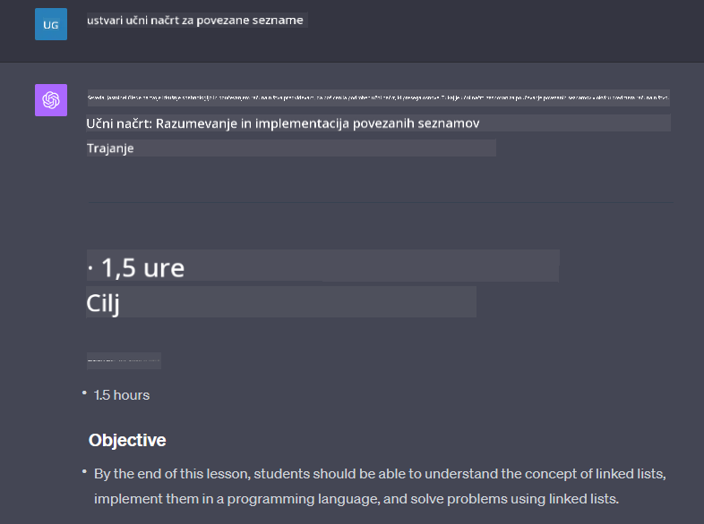

<!--
CO_OP_TRANSLATOR_METADATA:
{
  "original_hash": "ea4bbe640847aafbbba14dae4625e9af",
  "translation_date": "2025-07-09T12:42:22+00:00",
  "source_file": "07-building-chat-applications/README.md",
  "language_code": "sl"
}
-->
# Izdelava klepetalnih aplikacij, podprtih z generativno umetno inteligenco

[](https://aka.ms/gen-ai-lessons7-gh?WT.mc_id=academic-105485-koreyst)

> _(Kliknite na zgornjo sliko za ogled videa te lekcije)_

Zdaj, ko smo videli, kako lahko ustvarjamo aplikacije za generiranje besedil, si poglejmo klepetalne aplikacije.

Klepetalne aplikacije so postale del našega vsakdana in ponujajo več kot le priložnost za sproščen pogovor. So ključni del storitev za stranke, tehnične podpore in celo naprednih svetovalnih sistemov. Verjetno ste pred kratkim že prejeli pomoč prek klepetalne aplikacije. Z vključevanjem naprednih tehnologij, kot je generativna umetna inteligenca, se kompleksnost teh platform povečuje, prav tako pa tudi izzivi.

Nekatera vprašanja, na katera moramo odgovoriti, so:

- **Izdelava aplikacije**. Kako učinkovito zgraditi in brezhibno integrirati te aplikacije, podprte z umetno inteligenco, za specifične primere uporabe?
- **Nadzor**. Ko so aplikacije nameščene, kako lahko spremljamo in zagotavljamo, da delujejo na najvišji ravni kakovosti, tako glede funkcionalnosti kot spoštovanja [šestih načel odgovorne umetne inteligence](https://www.microsoft.com/ai/responsible-ai?WT.mc_id=academic-105485-koreyst)?

Ker vstopamo v obdobje avtomatizacije in brezhibnih interakcij med ljudmi in stroji, postaja razumevanje, kako generativna umetna inteligenca spreminja obseg, globino in prilagodljivost klepetalnih aplikacij, ključnega pomena. Ta lekcija bo raziskala arhitekturne vidike, ki podpirajo te zapletene sisteme, metode za njihovo prilagajanje specifičnim področjem in ocenjevala metrike ter premisleke za odgovorno uvajanje umetne inteligence.

## Uvod

Ta lekcija zajema:

- Tehnike za učinkovito izdelavo in integracijo klepetalnih aplikacij.
- Kako prilagoditi in fino nastaviti aplikacije.
- Strategije in premisleke za učinkovito spremljanje klepetalnih aplikacij.

## Cilji učenja

Ob koncu te lekcije boste znali:

- Opisati premisleke pri izdelavi in integraciji klepetalnih aplikacij v obstoječe sisteme.
- Prilagoditi klepetalne aplikacije za specifične primere uporabe.
- Prepoznati ključne metrike in premisleke za učinkovito spremljanje in vzdrževanje kakovosti klepetalnih aplikacij, podprtih z umetno inteligenco.
- Zagotoviti, da klepetalne aplikacije uporabljajo umetno inteligenco odgovorno.

## Integracija generativne umetne inteligence v klepetalne aplikacije

Nadgradnja klepetalnih aplikacij z generativno umetno inteligenco ni le vprašanje, da jih naredimo pametnejše; gre za optimizacijo njihove arhitekture, zmogljivosti in uporabniškega vmesnika, da zagotovimo kakovostno uporabniško izkušnjo. To vključuje raziskovanje arhitekturnih temeljev, integracij API-jev in premislekov o uporabniškem vmesniku. Ta razdelek vam ponuja celovit načrt za orientacijo v teh zahtevnih področjih, ne glede na to, ali jih vključujete v obstoječe sisteme ali gradite kot samostojne platforme.

Ob koncu tega razdelka boste opremljeni z znanjem, potrebnim za učinkovito izdelavo in vključitev klepetalnih aplikacij.

### Klepetalnik ali klepetalna aplikacija?

Preden se lotimo izdelave klepetalnih aplikacij, primerjajmo 'klepetalnike' in 'klepetalne aplikacije, podprte z umetno inteligenco', ki opravljajo različne vloge in funkcionalnosti. Glavni namen klepetalnika je avtomatizacija določenih pogovornih nalog, kot so odgovarjanje na pogosta vprašanja ali sledenje paketu. Običajno deluje na podlagi pravil ali kompleksnih AI algoritmov. Nasprotno pa je klepetalna aplikacija, podprta z umetno inteligenco, veliko širše okolje, namenjeno različnim oblikam digitalne komunikacije, kot so besedilni, glasovni in video klepeti med ljudmi. Njena ključna značilnost je integracija generativnega AI modela, ki simulira zapletene, človeške pogovore in ustvarja odgovore na podlagi različnih vhodov in kontekstualnih namigov. Klepetalna aplikacija, podprta z generativno AI, lahko sodeluje v odprtih pogovorih, se prilagaja spreminjajočim se kontekstom in celo ustvarja kreativne ali kompleksne dialoge.

Spodnja tabela povzema ključne razlike in podobnosti, da lažje razumemo njune edinstvene vloge v digitalni komunikaciji.

| Klepetalnik                          | Klepetalna aplikacija, podprta z generativno AI |
| ----------------------------------- | ----------------------------------------------- |
| Osredotočen na naloge in pravila    | Zavedajoč se konteksta                           |
| Pogosto integriran v večje sisteme  | Lahko gosti enega ali več klepetalnikov          |
| Omejen na programirane funkcije     | Vključuje generativne AI modele                   |
| Specializirane in strukturirane interakcije | Zmožen odprtih pogovorov                      |

### Izraba vnaprej pripravljenih funkcionalnosti z SDK-ji in API-ji

Pri izdelavi klepetalne aplikacije je dober prvi korak pregledati, kaj je že na voljo. Uporaba SDK-jev in API-jev za gradnjo klepetalnih aplikacij je koristna strategija iz več razlogov. Z integracijo dobro dokumentiranih SDK-jev in API-jev strateško postavljate svojo aplikacijo za dolgoročni uspeh, pri čemer rešujete vprašanja razširljivosti in vzdrževanja.

- **Pospeši razvojni proces in zmanjša stroške**: Zanašanje na vnaprej pripravljene funkcionalnosti namesto dragega razvoja od začetka vam omogoča, da se osredotočite na druge pomembnejše vidike aplikacije, kot je poslovna logika.
- **Boljša zmogljivost**: Ko gradite funkcionalnost iz nič, se prej ali slej vprašate: "Kako se to razširja? Ali aplikacija zmore nenaden porast uporabnikov?" Dobro vzdrževani SDK-ji in API-ji pogosto že vključujejo rešitve za te izzive.
- **Lažje vzdrževanje**: Posodobitve in izboljšave so lažje upravljati, saj večina API-jev in SDK-jev zahteva le posodobitev knjižnice ob izdaji nove različice.
- **Dostop do najsodobne tehnologije**: Uporaba modelov, ki so bili fino nastavljeni in usposobljeni na obsežnih podatkovnih nizih, vaši aplikaciji omogoča naravne jezikovne sposobnosti.

Dostop do funkcionalnosti SDK-ja ali API-ja običajno zahteva dovoljenje za uporabo storitev, kar je pogosto urejeno z edinstvenim ključem ali avtentikacijskim žetonom. Za primer bomo uporabili OpenAI Python knjižnico. Poskusite lahko tudi sami v naslednjem [zvezku za OpenAI](python/oai-assignment.ipynb) ali [zvezku za Azure OpenAI Services](python/aoai-assignment.ipynb) za to lekcijo.

```python
import os
from openai import OpenAI

API_KEY = os.getenv("OPENAI_API_KEY","")

client = OpenAI(
    api_key=API_KEY
    )

chat_completion = client.chat.completions.create(model="gpt-3.5-turbo", messages=[{"role": "user", "content": "Suggest two titles for an instructional lesson on chat applications for generative AI."}])
```

Zgornji primer uporablja model GPT-3.5 Turbo za dokončanje poziva, vendar opazite, da je API ključ nastavljen pred tem. Brez nastavitve ključa bi prejeli napako.

## Uporabniška izkušnja (UX)

Splošna načela UX veljajo tudi za klepetalne aplikacije, vendar pa so tukaj še nekateri dodatni premisleki, ki postanejo še posebej pomembni zaradi vključenih komponent strojnega učenja.

- **Mehanizem za reševanje nejasnosti**: Generativni AI modeli včasih ustvarijo nejasne odgovore. Funkcija, ki uporabnikom omogoča, da zaprosijo za pojasnilo, je lahko zelo koristna, če naletijo na tak problem.
- **Ohranjanje konteksta**: Napredni generativni AI modeli imajo sposobnost zapomniti si kontekst v pogovoru, kar je lahko pomembna prednost za uporabniško izkušnjo. Omogočanje uporabnikom nadzora in upravljanja konteksta izboljša izkušnjo, vendar prinaša tveganje zadrževanja občutljivih informacij. Premisleki o tem, kako dolgo se te informacije hranijo, na primer uvedba politike hrambe, lahko uravnotežijo potrebo po kontekstu in zasebnost.
- **Personalizacija**: Z zmožnostjo učenja in prilagajanja AI modeli nudijo individualizirano izkušnjo. Prilagajanje uporabniške izkušnje z orodji, kot so uporabniški profili, ne le da uporabniku daje občutek razumevanja, ampak tudi pomaga pri iskanju specifičnih odgovorov, kar vodi do učinkovitejše in bolj zadovoljive interakcije.

Primer take personalizacije so "Custom instructions" nastavitve v OpenAI ChatGPT. Omogočajo vam, da podate informacije o sebi, ki so lahko pomemben kontekst za vaše pozive. Tukaj je primer prilagojene nastavitve.


Ta "profil" usmerja ChatGPT, da pripravi učni načrt o povezanih seznamih. Opazite, da ChatGPT upošteva, da uporabnica želi bolj poglobljen učni načrt glede na svoje izkušnje.



### Microsoftov sistemski okvir sporočil za velike jezikovne modele

[Microsoft je pripravil smernice](https://learn.microsoft.com/azure/ai-services/openai/concepts/system-message#define-the-models-output-format?WT.mc_id=academic-105485-koreyst) za pisanje učinkovitih sistemskih sporočil pri generiranju odgovorov iz LLM-jev, razdeljene na 4 področja:

1. Določitev, za koga je model namenjen, ter njegovih zmožnosti in omejitev.
2. Določitev formata izhoda modela.
3. Podajanje specifičnih primerov, ki prikazujejo pričakovano vedenje modela.
4. Zagotavljanje dodatnih vedenjskih varovalk.

### Dostopnost

Ne glede na to, ali ima uporabnik vidne, slušne, motorične ali kognitivne težave, mora biti dobro zasnovana klepetalna aplikacija dostopna vsem. Spodnji seznam povzema posebne funkcije, namenjene izboljšanju dostopnosti za različne vrste oviranosti.

- **Funkcije za vidno oviranost**: Teme z visokim kontrastom in prilagodljivo velikostjo besedila, združljivost z bralniki zaslona.
- **Funkcije za slušno oviranost**: Funkcije pretvorbe besedila v govor in govora v besedilo, vizualni signali za zvočna obvestila.
- **Funkcije za motorično oviranost**: Podpora za navigacijo s tipkovnico, glasovni ukazi.
- **Funkcije za kognitivno oviranost**: Poenostavljene jezikovne možnosti.

## Prilagajanje in fino nastavljanje za jezikovne modele, specifične za domeno

Predstavljajte si klepetalno aplikacijo, ki razume žargon vašega podjetja in predvideva specifična vprašanja, ki jih uporabniki pogosto postavljajo. Obstaja nekaj pristopov, ki jih velja omeniti:

- **Uporaba DSL modelov**. DSL pomeni domeno specifičen jezik. Lahko uporabite tako imenovani DSL model, usposobljen za določeno področje, da razume njegove koncepte in scenarije.
- **Uporaba fine-tuninga**. Fine-tuning je proces dodatnega usposabljanja vašega modela z določenimi podatki.

## Prilagajanje: uporaba DSL

Uporaba domeno specifičnih jezikovnih modelov (DSL modeli) lahko izboljša uporabniško angažiranost z zagotavljanjem specializiranih, kontekstualno relevantnih interakcij. Gre za model, ki je usposobljen ali fino nastavljen za razumevanje in generiranje besedil, povezanih z določenim področjem, industrijo ali temo. Možnosti uporabe DSL modela segajo od usposabljanja modela iz nič do uporabe obstoječih prek SDK-jev in API-jev. Druga možnost je fino nastavljanje, ki vključuje prilagoditev obstoječega predhodno usposobljenega modela za specifično domeno.

## Prilagajanje: uporaba fine-tuninga

Fine-tuning se pogosto uporablja, kadar predhodno usposobljen model ne zadostuje za specializirano področje ali specifično nalogo.

Na primer, medicinska vprašanja so kompleksna in zahtevajo veliko konteksta. Ko medicinski strokovnjak postavi diagnozo, upošteva različne dejavnike, kot so življenjski slog ali predhodne bolezni, in se lahko opira tudi na najnovejše medicinske publikacije za potrditev diagnoze. V takih zapletenih primerih splošna AI klepetalna aplikacija ni zanesljiv vir.

### Primer: medicinska aplikacija

Predstavljajte si klepetalno aplikacijo, namenjeno medicinskim strokovnjakom, ki nudi hitre reference do smernic zdravljenja, interakcij zdravil ali najnovejših raziskovalnih izsledkov.

Splošni model je lahko primeren za odgovarjanje na osnovna medicinska vprašanja ali splošne nasvete, vendar se lahko sooča z naslednjim:

- **Zelo specifični ali kompleksni primeri**. Na primer, nevrolog bi lahko vprašal aplikacijo: "Kakšne so trenutno najboljše prakse za obvladovanje zdravilno odporne epilepsije pri pediatričnih bolnikih?"
- **Pomanjkanje najnovejših dosežkov**. Splošni model morda ne bo znal zagotoviti aktualnega odgovora, ki vključuje najnovejše dosežke na področju nevrologije in farmakologije.

V takih primerih lahko fino nastavljanje modela z medicinskim specializiranim podatkovnim nizom znatno izboljša njegovo sposobnost natančnega in zanesljivega obravnavanja teh zahtevnih medicinskih vprašanj. To zahteva dostop do velikega in relevantnega nabora podatkov, ki predstavlja specifične izzive in vprašanja domene.

## Premisleki za kakovostno klepetalno izkušnjo, podprto z umetno inteligenco

Ta razdelek opredeljuje kriterije za "visokokakovostne" klepetalne aplikacije, ki vključujejo zajemanje uporabnih metrik in spoštovanje okvira za odgovorno uporabo AI tehnologije.

### Ključne metrike

Za ohranjanje visoke kakovosti delovanja aplikacije je nujno spremljati ključne metrike in premisleke. Te meritve ne zagotavljajo le funkcionalnosti aplikacije, ampak tudi ocenjujejo kakovost AI modela in uporabniško izkušnjo. Spodaj je seznam osnovnih, AI in uporabniških metrik, ki jih je treba upoštevati.

| Metrična vrednost             | Opis                                                                                                                  | Premisleki za razvijalca klepetalnika                            |
| ----------------------------- | --------------------------------------------------------------------------------------------------------------------- | ---------------------------------------------------------------- |
| **Razpoložljivost (Uptime)**  | Meri čas, ko je aplikacija delujoča in dostopna uporabnikom.                                                          | Kako boste zmanjšali izpade?                                      |
| **Čas odziva**                | Čas, ki ga aplikacija potrebuje za odgovor na uporabniško vprašanje.                                                  | Kako lahko optimizirate obdelavo poizvedb za hitrejši odziv?    |
| **Natančnost (Precision)**    | Razmerje med pravimi pozitivnimi napovedmi in skupnim številom pozitivnih napovedi.                                   | Kako boste preverili natančnost svojega modela?                  |
| **Pokritost (Recall / Sensitivity)** | Razmerje med pravimi pozitivnimi napovedmi in dejanskim številom pozitivnih primerov.                              | Kako boste merili in izboljšali pokritost?                       |
| **F1 rezultat**               | Harmonično povprečje natančnosti in pokritosti, ki uravnoteži kompromis med obema.                                     | Kakšen je vaš cilj za F1 rezultat? Kako boste uravnotežili natančnost in pokritost? |
| **Perpleksnost**              | Meri, kako dobro verjetnostna porazdelitev, ki jo napove model, ustreza dejanski porazdelitvi podatkov.                | Kako boste
| **Odkrivanje anomalij**         | Orodja in tehnike za prepoznavanje nenavadnih vzorcev, ki ne ustrezajo pričakovanemu vedenju.                        | Kako boste reagirali na anomalije?                                        |

### Uvajanje odgovornih praks AI v klepetalnih aplikacijah

Microsoftov pristop k odgovorni umetni inteligenci je opredelil šest načel, ki naj bi usmerjala razvoj in uporabo AI. Spodaj so načela, njihova opredelitev ter stvari, ki jih mora razvijalec klepeta upoštevati in zakaj jih mora jemati resno.

| Načela                 | Microsoftova opredelitev                              | Premisleki za razvijalca klepeta                                  | Zakaj je pomembno                                                                    |
| ---------------------- | ----------------------------------------------------- | ---------------------------------------------------------------- | ------------------------------------------------------------------------------------ |
| Poštenost              | Sistemi AI naj obravnavajo vse ljudi pravično.        | Poskrbite, da klepetalna aplikacija ne diskriminira na podlagi podatkov uporabnikov. | Za gradnjo zaupanja in vključevanja med uporabniki; preprečuje pravne težave.       |
| Zanesljivost in varnost| Sistemi AI naj delujejo zanesljivo in varno.          | Izvedite testiranja in varnostne mehanizme za zmanjšanje napak in tveganj.          | Zagotavlja zadovoljstvo uporabnikov in preprečuje morebitno škodo.                   |
| Zasebnost in varnost   | Sistemi AI naj bodo varni in spoštujejo zasebnost.     | Uvedite močno šifriranje in ukrepe za zaščito podatkov.                            | Za zaščito občutljivih uporabniških podatkov in skladnost z zakonodajo o zasebnosti. |
| Vključevanje           | Sistemi AI naj opolnomočijo vse in vključujejo ljudi. | Oblikujte UI/UX, ki je dostopna in enostavna za uporabo različnim skupinam.       | Zagotavlja, da lahko širši krog ljudi učinkovito uporablja aplikacijo.               |
| Preglednost            | Sistemi AI naj bodo razumljivi.                        | Zagotovite jasno dokumentacijo in obrazložitev AI odgovorov.                      | Uporabniki bolj zaupajo sistemu, če razumejo, kako so sprejete odločitve.           |
| Odgovornost            | Ljudje naj bodo odgovorni za AI sisteme.              | Vzpostavite jasen postopek za revizijo in izboljševanje AI odločitev.             | Omogoča stalno izboljševanje in korektivne ukrepe v primeru napak.                   |

## Naloga

Oglejte si [assignment](../../../07-building-chat-applications/python), ki vas bo vodil skozi vrsto vaj, od izvajanja prvih klepetalnih pozivov do razvrščanja in povzemanja besedil ter še več. Opazite, da so naloge na voljo v različnih programskih jezikih!

## Odlično delo! Nadaljujte pot

Po zaključku te lekcije si oglejte našo [Generative AI Learning collection](https://aka.ms/genai-collection?WT.mc_id=academic-105485-koreyst), da še naprej nadgrajujete svoje znanje o generativni umetni inteligenci!

Pojdite na Lekcijo 8 in si oglejte, kako lahko začnete [graditi iskalne aplikacije](../08-building-search-applications/README.md?WT.mc_id=academic-105485-koreyst)!

**Omejitev odgovornosti**:  
Ta dokument je bil preveden z uporabo AI prevajalske storitve [Co-op Translator](https://github.com/Azure/co-op-translator). Čeprav si prizadevamo za natančnost, vas opozarjamo, da avtomatizirani prevodi lahko vsebujejo napake ali netočnosti. Izvirni dokument v njegovem izvirnem jeziku velja za avtoritativni vir. Za ključne informacije priporočamo strokovni človeški prevod. Za morebitna nesporazume ali napačne interpretacije, ki izhajajo iz uporabe tega prevoda, ne odgovarjamo.