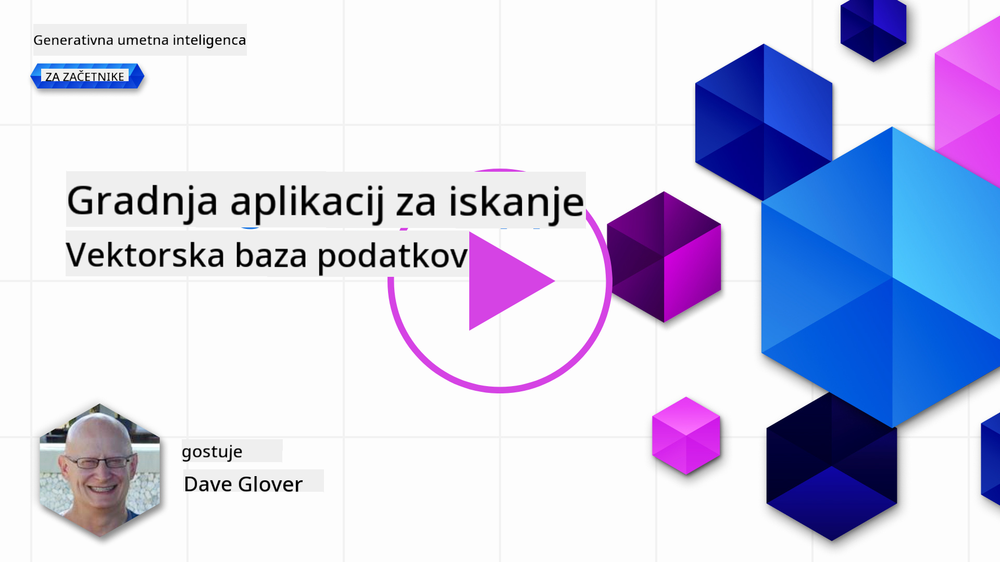
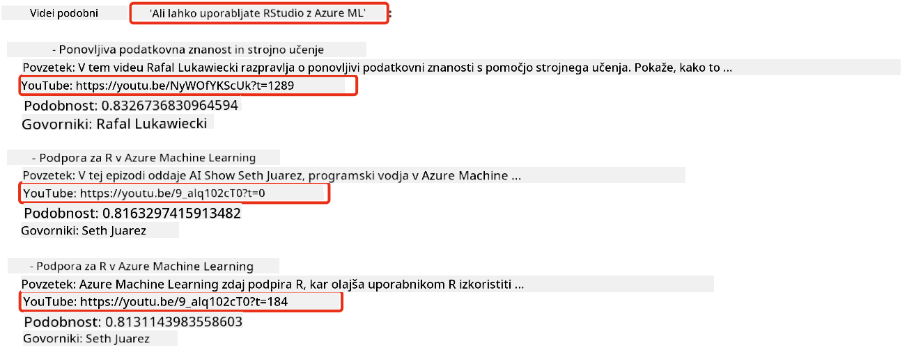
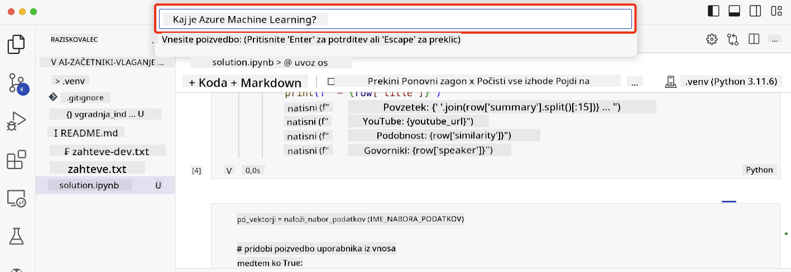

<!--
CO_OP_TRANSLATOR_METADATA:
{
  "original_hash": "d46aad0917a1a342d613e2c13d457da5",
  "translation_date": "2025-05-19T18:45:28+00:00",
  "source_file": "08-building-search-applications/README.md",
  "language_code": "sl"
}
-->
# Izgradnja aplikacij za iskanje

[](https://aka.ms/gen-ai-lesson8-gh?WT.mc_id=academic-105485-koreyst)

> > _Kliknite na zgornjo sliko za ogled videa te lekcije_

LLM-ji so več kot le klepetalniki in generacija besedila. Možno je tudi zgraditi aplikacije za iskanje z uporabo Vdelkov. Vdelki so numerične predstavitve podatkov, znane tudi kot vektorji, in se lahko uporabljajo za semantično iskanje podatkov.

V tej lekciji boste zgradili aplikacijo za iskanje za našo izobraževalno startup podjetje. Naša startup organizacija je neprofitna organizacija, ki zagotavlja brezplačno izobraževanje študentom v državah v razvoju. Naša startup organizacija ima veliko število YouTube videov, ki jih lahko študenti uporabljajo za učenje o AI. Naša startup organizacija želi zgraditi aplikacijo za iskanje, ki omogoča študentom iskanje YouTube videa z vnosom vprašanja.

Na primer, študent lahko vnese 'Kaj so Jupyter zvezki?' ali 'Kaj je Azure ML' in aplikacija za iskanje bo vrnila seznam YouTube videov, ki so relevantni za vprašanje, in še bolje, aplikacija za iskanje bo vrnila povezavo do mesta v videu, kjer se nahaja odgovor na vprašanje.

## Uvod

V tej lekciji bomo obravnavali:

- Semantično vs Ključne besede iskanje.
- Kaj so Vdelki besedila.
- Ustvarjanje indeksa Vdelkov besedila.
- Iskanje indeksa Vdelkov besedila.

## Cilji učenja

Po zaključku te lekcije boste lahko:

- Razlikovali med semantičnim in iskanjem po ključnih besedah.
- Pojasnili, kaj so Vdelki besedila.
- Ustvarili aplikacijo z uporabo Vdelkov za iskanje podatkov.

## Zakaj zgraditi aplikacijo za iskanje?

Ustvarjanje aplikacije za iskanje vam bo pomagalo razumeti, kako uporabljati Vdelke za iskanje podatkov. Prav tako se boste naučili, kako zgraditi aplikacijo za iskanje, ki jo lahko študenti uporabljajo za hitro iskanje informacij.

Lekcija vključuje Indeks Vdelkov YouTube prepisov za Microsoft [AI Show](https://www.youtube.com/playlist?list=PLlrxD0HtieHi0mwteKBOfEeOYf0LJU4O1) YouTube kanal. AI Show je YouTube kanal, ki vas uči o AI in strojnem učenju. Indeks Vdelkov vsebuje Vdelke za vsak prepis YouTube do oktobra 2023. Indeks Vdelkov boste uporabili za gradnjo aplikacije za iskanje za našo startup organizacijo. Aplikacija za iskanje vrne povezavo do mesta v videu, kjer se nahaja odgovor na vprašanje. To je odličen način za študente, da hitro najdejo potrebne informacije.

Sledi primer semantične poizvedbe za vprašanje 'ali lahko uporabite rstudio z azure ml?'. Oglejte si YouTube url, videli boste, da url vsebuje časovno oznako, ki vas popelje do mesta v videu, kjer se nahaja odgovor na vprašanje.



## Kaj je semantično iskanje?

Zdaj se morda sprašujete, kaj je semantično iskanje? Semantično iskanje je tehnika iskanja, ki uporablja semantiko ali pomen besed v poizvedbi za vrnitev relevantnih rezultatov.

Tukaj je primer semantičnega iskanja. Recimo, da iščete avto, morda boste iskali 'moj sanjski avto', semantično iskanje razume, da ne govorite o sanjah o avtu, ampak da iščete svoj sanjski avto. Semantično iskanje razume vaš namen in vrne relevantne rezultate. Alternativa je iskanje po ključnih besedah, ki bi dobesedno iskalo sanje o avtomobilih in pogosto vrne nepomembne rezultate.

## Kaj so Vdelki besedila?

[Vdelki besedila](https://en.wikipedia.org/wiki/Word_embedding?WT.mc_id=academic-105485-koreyst) so tehnika predstavitve besedila, ki se uporablja pri [obdelavi naravnega jezika](https://en.wikipedia.org/wiki/Natural_language_processing?WT.mc_id=academic-105485-koreyst). Vdelki besedila so semantične numerične predstavitve besedila. Vdelki se uporabljajo za predstavitev podatkov na način, ki ga je enostavno razumeti za stroj. Obstaja veliko modelov za gradnjo Vdelkov besedila, v tej lekciji se bomo osredotočili na generiranje Vdelkov z uporabo OpenAI Embedding Model.

Tukaj je primer, si predstavljajte, da je naslednje besedilo v prepisu ene od epizod na YouTube kanalu AI Show:

```text
Today we are going to learn about Azure Machine Learning.
```

Besedilo bi poslali OpenAI Embedding API in vrnil bi naslednji vdelek, ki vsebuje 1536 številk, znan kot vektor. Vsaka številka v vektorju predstavlja različne vidike besedila. Zaradi kratkosti, tukaj so prvih 10 številk v vektorju.

```python
[-0.006655829958617687, 0.0026128944009542465, 0.008792596869170666, -0.02446001023054123, -0.008540431968867779, 0.022071078419685364, -0.010703742504119873, 0.003311325330287218, -0.011632772162556648, -0.02187200076878071, ...]
```

## Kako je ustvarjen indeks Vdelkov?

Indeks Vdelkov za to lekcijo je bil ustvarjen s serijo Python skriptov. Skripte skupaj z navodili boste našli v [README](./scripts/README.md?WT.mc_id=academic-105485-koreyst) v mapi 'scripts' za to lekcijo. Teh skriptov vam ni treba zagnati za dokončanje te lekcije, saj je Indeks Vdelkov zagotovljen za vas.

Skripti izvajajo naslednje operacije:

1. Prepis za vsak YouTube video v [AI Show](https://www.youtube.com/playlist?list=PLlrxD0HtieHi0mwteKBOfEeOYf0LJU4O1) seznamu predvajanja je prenesen.
2. Z uporabo [OpenAI funkcij](https://learn.microsoft.com/azure/ai-services/openai/how-to/function-calling?WT.mc_id=academic-105485-koreyst) se poskuša izluščiti ime govorca iz prvih 3 minut YouTube prepisa. Ime govorca za vsak video je shranjeno v Indeksu Vdelkov z imenom `embedding_index_3m.json`.
3. Besedilo prepisa je nato razdeljeno na **3-minutne tekstovne segmente**. Segment vključuje približno 20 besed, ki se prekrivajo z naslednjim segmentom, da se zagotovi, da Vdelek za segment ni prekinjen in da zagotovi boljši kontekst iskanja.
4. Vsak tekstovni segment se nato posreduje OpenAI Chat API za povzetek besedila v 60 besedah. Povzetek je prav tako shranjen v Indeksu Vdelkov `embedding_index_3m.json`.
5. Končno, besedilo segmenta se posreduje OpenAI Embedding API. Embedding API vrne vektor s 1536 številkami, ki predstavljajo semantični pomen segmenta. Segment skupaj z OpenAI Embedding vektorjem je shranjen v Indeksu Vdelkov `embedding_index_3m.json`.

### Vektorske baze podatkov

Za enostavnost lekcije je Indeks Vdelkov shranjen v JSON datoteki z imenom `embedding_index_3m.json` in naložen v Pandas DataFrame. V produkciji bi bil Indeks Vdelkov shranjen v vektorski bazi podatkov, kot so [Azure Cognitive Search](https://learn.microsoft.com/training/modules/improve-search-results-vector-search?WT.mc_id=academic-105485-koreyst), [Redis](https://cookbook.openai.com/examples/vector_databases/redis/readme?WT.mc_id=academic-105485-koreyst), [Pinecone](https://cookbook.openai.com/examples/vector_databases/pinecone/readme?WT.mc_id=academic-105485-koreyst), [Weaviate](https://cookbook.openai.com/examples/vector_databases/weaviate/readme?WT.mc_id=academic-105485-koreyst), če jih naštejemo le nekaj.

## Razumevanje kosinusne podobnosti

Naučili smo se o Vdelkih besedila, naslednji korak je, da se naučimo, kako uporabljati Vdelke besedila za iskanje podatkov in zlasti kako najti najbolj podobne Vdelke dani poizvedbi z uporabo kosinusne podobnosti.

### Kaj je kosinusna podobnost?

Kosinusna podobnost je merilo podobnosti med dvema vektorjema, pogosto jo imenujemo tudi `nearest neighbor search`. Za izvedbo iskanja po kosinusni podobnosti morate _vektorizirati_ besedilo _poizvedbe_ z uporabo OpenAI Embedding API. Nato izračunajte _kosinusno podobnost_ med vektorjem poizvedbe in vsakim vektorjem v Indeksu Vdelkov. Ne pozabite, Indeks Vdelkov ima vektor za vsak segment besedila YouTube prepisa. Končno, razvrstite rezultate po kosinusni podobnosti, in tekstovni segmenti z najvišjo kosinusno podobnostjo so najbolj podobni poizvedbi.

Z matematičnega vidika kosinusna podobnost meri kosinus kota med dvema vektorjema, projiciranima v večdimenzionalnem prostoru. Ta meritev je koristna, ker če sta dva dokumenta daleč narazen po evklidski razdalji zaradi velikosti, bi lahko še vedno imela manjši kot med njima in s tem višjo kosinusno podobnost. Za več informacij o enačbah kosinusne podobnosti si oglejte [Kosinusna podobnost](https://en.wikipedia.org/wiki/Cosine_similarity?WT.mc_id=academic-105485-koreyst).

## Izgradnja vaše prve aplikacije za iskanje

Nato se bomo naučili, kako zgraditi aplikacijo za iskanje z uporabo Vdelkov. Aplikacija za iskanje bo študentom omogočila iskanje videa z vnosom vprašanja. Aplikacija za iskanje bo vrnila seznam videov, ki so relevantni za vprašanje. Aplikacija za iskanje bo prav tako vrnila povezavo do mesta v videu, kjer se nahaja odgovor na vprašanje.

Ta rešitev je bila zgrajena in testirana na Windows 11, macOS in Ubuntu 22.04 z uporabo Python 3.10 ali novejše. Python lahko prenesete s [python.org](https://www.python.org/downloads/?WT.mc_id=academic-105485-koreyst).

## Naloga - izgradnja aplikacije za iskanje, za omogočanje študentom

Na začetku te lekcije smo predstavili našo startup organizacijo. Zdaj je čas, da omogočimo študentom gradnjo aplikacije za iskanje za njihove ocene.

V tej nalogi boste ustvarili Azure OpenAI storitve, ki bodo uporabljene za gradnjo aplikacije za iskanje. Ustvarili boste naslednje Azure OpenAI storitve. Za dokončanje te naloge boste potrebovali Azure naročnino.

### Zaženite Azure Cloud Shell

1. Prijavite se v [Azure portal](https://portal.azure.com/?WT.mc_id=academic-105485-koreyst).
2. Izberite ikono Cloud Shell v zgornjem desnem kotu Azure portala.
3. Izberite **Bash** za tip okolja.

#### Ustvarite skupino virov

> Za ta navodila uporabljamo skupino virov z imenom "semantic-video-search" v East US.
> Ime skupine virov lahko spremenite, vendar pri spreminjanju lokacije za vire preverite [tabelo razpoložljivosti modelov](https://aka.ms/oai/models?WT.mc_id=academic-105485-koreyst).

```shell
az group create --name semantic-video-search --location eastus
```

#### Ustvarite Azure OpenAI storitev virov

Iz Azure Cloud Shell zaženite naslednji ukaz za ustvarjanje Azure OpenAI storitev virov.

```shell
az cognitiveservices account create --name semantic-video-openai --resource-group semantic-video-search \
    --location eastus --kind OpenAI --sku s0
```

#### Pridobite končno točko in ključe za uporabo v tej aplikaciji

Iz Azure Cloud Shell zaženite naslednje ukaze za pridobitev končne točke in ključev za Azure OpenAI storitev virov.

```shell
az cognitiveservices account show --name semantic-video-openai \
   --resource-group  semantic-video-search | jq -r .properties.endpoint
az cognitiveservices account keys list --name semantic-video-openai \
   --resource-group semantic-video-search | jq -r .key1
```

#### Namestite OpenAI Embedding model

Iz Azure Cloud Shell zaženite naslednji ukaz za namestitev OpenAI Embedding modela.

```shell
az cognitiveservices account deployment create \
    --name semantic-video-openai \
    --resource-group  semantic-video-search \
    --deployment-name text-embedding-ada-002 \
    --model-name text-embedding-ada-002 \
    --model-version "2"  \
    --model-format OpenAI \
    --sku-capacity 100 --sku-name "Standard"
```

## Rešitev

Odprite [rešitveni zvezek](../../../08-building-search-applications/python/aoai-solution.ipynb) v GitHub Codespaces in sledite navodilom v Jupyter zvezku.

Ko zaženete zvezek, boste pozvani, da vnesete poizvedbo. Vnosno polje bo izgledalo tako:



## Odlično delo! Nadaljujte z učenjem

Po zaključku te lekcije si oglejte našo [Generativno AI zbirko učenja](https://aka.ms/genai-collection?WT.mc_id=academic-105485-koreyst), da nadaljujete z nadgradnjo vašega znanja o Generativni AI!

Pojdite na lekcijo 9, kjer bomo pogledali, kako [zgraditi aplikacije za generiranje slik](../09-building-image-applications/README.md?WT.mc_id=academic-105485-koreyst)!

**Omejitev odgovornosti**:  
Ta dokument je bil preveden z uporabo AI prevajalske storitve [Co-op Translator](https://github.com/Azure/co-op-translator). Čeprav se trudimo za natančnost, vas prosimo, da se zavedate, da lahko avtomatizirani prevodi vsebujejo napake ali netočnosti. Izvirni dokument v svojem maternem jeziku naj bo obravnavan kot avtoritativni vir. Za kritične informacije se priporoča strokovni človeški prevod. Ne odgovarjamo za morebitna nesporazumevanja ali napačne razlage, ki izhajajo iz uporabe tega prevoda.