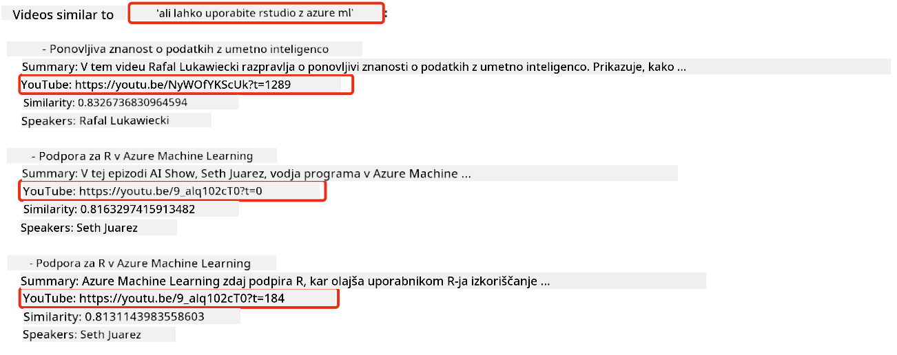
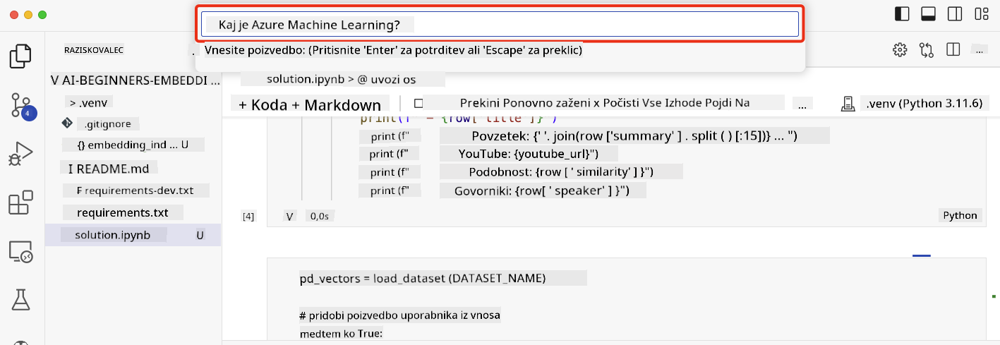

<!--
CO_OP_TRANSLATOR_METADATA:
{
  "original_hash": "d46aad0917a1a342d613e2c13d457da5",
  "translation_date": "2025-07-09T13:03:57+00:00",
  "source_file": "08-building-search-applications/README.md",
  "language_code": "sl"
}
-->
# Gradnja iskalnih aplikacij

[](https://aka.ms/gen-ai-lesson8-gh?WT.mc_id=academic-105485-koreyst)

> > _Kliknite na zgornjo sliko za ogled videa te lekcije_

Veliko več je v LLM-jih kot le klepetalni roboti in generiranje besedil. Prav tako je mogoče zgraditi iskalne aplikacije z uporabo Embeddingov. Embeddingi so numerične predstavitve podatkov, znane tudi kot vektorji, in se uporabljajo za semantično iskanje podatkov.

V tej lekciji boste zgradili iskalno aplikacijo za naš izobraževalni startup. Naš startup je neprofitna organizacija, ki študentom v državah v razvoju nudi brezplačno izobraževanje. Naš startup ima veliko število YouTube videov, ki jih lahko študenti uporabljajo za učenje o AI. Naš startup želi zgraditi iskalno aplikacijo, ki študentom omogoča iskanje YouTube videov z vnosom vprašanja.

Na primer, študent lahko vpiše 'Kaj so Jupyter zvezki?' ali 'Kaj je Azure ML' in iskalna aplikacija bo vrnila seznam YouTube videov, ki so relevantni za vprašanje, še bolje pa je, da bo iskalna aplikacija vrnila povezavo do mesta v videu, kjer se nahaja odgovor na vprašanje.

## Uvod

V tej lekciji bomo obravnavali:

- Semantično iskanje v primerjavi z iskanjem po ključnih besedah.
- Kaj so tekstovni embeddingi.
- Ustvarjanje indeksa tekstovnih embeddingov.
- Iskanje v indeksu tekstovnih embeddingov.

## Cilji učenja

Po zaključku te lekcije boste znali:

- Razločiti med semantičnim in iskanjem po ključnih besedah.
- Pojasniti, kaj so tekstovni embeddingi.
- Ustvariti aplikacijo, ki uporablja embeddinge za iskanje podatkov.

## Zakaj zgraditi iskalno aplikacijo?

Ustvarjanje iskalne aplikacije vam bo pomagalo razumeti, kako uporabljati embeddinge za iskanje podatkov. Prav tako se boste naučili, kako zgraditi iskalno aplikacijo, ki jo lahko študenti uporabljajo za hitro iskanje informacij.

Lekcija vključuje indeks embeddingov za YouTube prepise za Microsoftov [AI Show](https://www.youtube.com/playlist?list=PLlrxD0HtieHi0mwteKBOfEeOYf0LJU4O1) YouTube kanal. AI Show je YouTube kanal, ki vas uči o AI in strojni inteligenci. Indeks embeddingov vsebuje embeddinge za vsak YouTube prepis do oktobra 2023. Indeks embeddingov boste uporabili za gradnjo iskalne aplikacije za naš startup. Iskalna aplikacija vrne povezavo do mesta v videu, kjer se nahaja odgovor na vprašanje. To je odličen način, da študenti hitro najdejo potrebne informacije.

Spodaj je primer semantičnega poizvedovanja za vprašanje 'ali lahko uporabljate rstudio z azure ml?'. Oglejte si YouTube URL, videli boste, da URL vsebuje časovni žig, ki vas popelje do mesta v videu, kjer je odgovor na vprašanje.



## Kaj je semantično iskanje?

Morda se sprašujete, kaj je semantično iskanje? Semantično iskanje je tehnika iskanja, ki uporablja semantiko oziroma pomen besed v poizvedbi, da vrne relevantne rezultate.

Tukaj je primer semantičnega iskanja. Recimo, da iščete avto, lahko bi iskali 'moj sanjski avto', semantično iskanje razume, da ne `sanjarite` o avtu, ampak iščete svoj `idealni` avto. Semantično iskanje razume vašo namero in vrne relevantne rezultate. Alternativa je `iskanje po ključnih besedah`, ki bi dobesedno iskalo sanje o avtomobilih in pogosto vrne nerelevantne rezultate.

## Kaj so tekstovni embeddingi?

[Tekstovni embeddingi](https://en.wikipedia.org/wiki/Word_embedding?WT.mc_id=academic-105485-koreyst) so tehnika predstavitve besedila, uporabljena v [obdelavi naravnega jezika](https://en.wikipedia.org/wiki/Natural_language_processing?WT.mc_id=academic-105485-koreyst). Tekstovni embeddingi so semantične numerične predstavitve besedila. Embeddingi se uporabljajo za predstavitev podatkov na način, ki ga stroj lažje razume. Obstaja veliko modelov za ustvarjanje tekstovnih embeddingov, v tej lekciji se bomo osredotočili na generiranje embeddingov z uporabo OpenAI Embedding Modela.

Tukaj je primer, predstavljajte si, da je naslednje besedilo iz prepisa ene od epizod na AI Show YouTube kanalu:

```text
Today we are going to learn about Azure Machine Learning.
```

Besedilo bi poslali OpenAI Embedding API-ju, ki bi vrnil naslednji embedding, sestavljen iz 1536 števil, znan tudi kot vektor. Vsako število v vektorju predstavlja drugačen vidik besedila. Za jedrnatost so tukaj prvih 10 števil v vektorju.

```python
[-0.006655829958617687, 0.0026128944009542465, 0.008792596869170666, -0.02446001023054123, -0.008540431968867779, 0.022071078419685364, -0.010703742504119873, 0.003311325330287218, -0.011632772162556648, -0.02187200076878071, ...]
```

## Kako je ustvarjen indeks embeddingov?

Indeks embeddingov za to lekcijo je bil ustvarjen z vrsto Python skript. Skripte skupaj z navodili najdete v [README](./scripts/README.md?WT.mc_id=academic-105485-koreyst) v mapi 'scripts' za to lekcijo. Teh skript ne morate zagnati, da dokončate lekcijo, saj je indeks embeddingov že na voljo.

Skripte izvajajo naslednje operacije:

1. Prenesejo prepis za vsak YouTube video v [AI Show](https://www.youtube.com/playlist?list=PLlrxD0HtieHi0mwteKBOfEeOYf0LJU4O1) seznamu predvajanja.
2. Z uporabo [OpenAI Functions](https://learn.microsoft.com/azure/ai-services/openai/how-to/function-calling?WT.mc_id=academic-105485-koreyst) poskušajo iz prve 3 minute YouTube prepisa izvleči ime govornika. Ime govornika za vsak video je shranjeno v indeks embeddingov z imenom `embedding_index_3m.json`.
3. Besedilo prepisa je nato razdeljeno na **3-minutne tekstovne segmente**. Segment vključuje približno 20 besed prekrivanja z naslednjim segmentom, da se zagotovi, da embedding segmenta ni prekinjen in da se zagotovi boljši kontekst iskanja.
4. Vsak tekstovni segment je nato poslan OpenAI Chat API-ju, da povzame besedilo v 60 besedah. Povzetek je prav tako shranjen v indeks embeddingov `embedding_index_3m.json`.
5. Na koncu je tekst segmenta poslan OpenAI Embedding API-ju. Embedding API vrne vektor s 1536 številkami, ki predstavljajo semantični pomen segmenta. Segment skupaj z OpenAI embedding vektorjem je shranjen v indeks embeddingov `embedding_index_3m.json`.

### Vektorske baze podatkov

Za enostavnost lekcije je indeks embeddingov shranjen v JSON datoteki z imenom `embedding_index_3m.json` in naložen v Pandas DataFrame. V produkciji pa bi bil indeks embeddingov shranjen v vektorski bazi podatkov, kot so [Azure Cognitive Search](https://learn.microsoft.com/training/modules/improve-search-results-vector-search?WT.mc_id=academic-105485-koreyst), [Redis](https://cookbook.openai.com/examples/vector_databases/redis/readme?WT.mc_id=academic-105485-koreyst), [Pinecone](https://cookbook.openai.com/examples/vector_databases/pinecone/readme?WT.mc_id=academic-105485-koreyst), [Weaviate](https://cookbook.openai.com/examples/vector_databases/weaviate/readme?WT.mc_id=academic-105485-koreyst), da naštejemo le nekatere.

## Razumevanje kosinusne podobnosti

Naučili smo se o tekstovnih embeddingih, naslednji korak je, da se naučimo, kako uporabiti tekstovne embeddinge za iskanje podatkov in posebej, kako najti najbolj podobne embeddinge za dano poizvedbo z uporabo kosinusne podobnosti.

### Kaj je kosinusna podobnost?

Kosinusna podobnost je mera podobnosti med dvema vektorjema, pogosto jo imenujemo tudi `iskanje najbližjega soseda`. Za izvedbo iskanja po kosinusni podobnosti morate _vektorizirati_ _poizvedbeno_ besedilo z uporabo OpenAI Embedding API-ja. Nato izračunate _kosinusno podobnost_ med vektorjem poizvedbe in vsakim vektorjem v indeksu embeddingov. Zapomnite si, indeks embeddingov ima vektor za vsak tekstovni segment YouTube prepisa. Na koncu rezultate razvrstite po kosinusni podobnosti, tekstovni segmenti z najvišjo kosinusno podobnostjo so najbolj podobni poizvedbi.

Z matematičnega vidika kosinusna podobnost meri kosinus kota med dvema vektorjema, projiciranima v večdimenzionalni prostor. Ta mera je koristna, ker če sta dva dokumenta po evklidski razdalji daleč zaradi velikosti, lahko imata še vedno manjši kot med njima in zato višjo kosinusno podobnost. Za več informacij o enačbah kosinusne podobnosti glejte [Kosinusna podobnost](https://en.wikipedia.org/wiki/Cosine_similarity?WT.mc_id=academic-105485-koreyst).

## Gradnja vaše prve iskalne aplikacije

Nato se bomo naučili, kako zgraditi iskalno aplikacijo z uporabo embeddingov. Iskalna aplikacija bo študentom omogočila iskanje videa z vnosom vprašanja. Iskalna aplikacija bo vrnila seznam videov, ki so relevantni za vprašanje. Prav tako bo vrnila povezavo do mesta v videu, kjer se nahaja odgovor na vprašanje.

Ta rešitev je bila zgrajena in testirana na Windows 11, macOS in Ubuntu 22.04 z uporabo Pythona 3.10 ali novejšega. Python lahko prenesete s [python.org](https://www.python.org/downloads/?WT.mc_id=academic-105485-koreyst).

## Naloga - gradnja iskalne aplikacije za pomoč študentom

Na začetku lekcije smo predstavili naš startup. Zdaj je čas, da omogočite študentom, da zgradijo iskalno aplikacijo za svoje ocenjevanje.

V tej nalogi boste ustvarili Azure OpenAI storitve, ki bodo uporabljene za gradnjo iskalne aplikacije. Ustvarili boste naslednje Azure OpenAI storitve. Za dokončanje naloge potrebujete Azure naročnino.

### Zaženite Azure Cloud Shell

1. Prijavite se v [Azure portal](https://portal.azure.com/?WT.mc_id=academic-105485-koreyst).
2. Izberite ikono Cloud Shell v zgornjem desnem kotu Azure portala.
3. Izberite **Bash** kot tip okolja.

#### Ustvarite skupino virov

> Za ta navodila uporabljamo skupino virov z imenom "semantic-video-search" v regiji East US.
> Ime skupine virov lahko spremenite, vendar pri spreminjanju lokacije virov
> preverite [tabelo razpoložljivosti modelov](https://aka.ms/oai/models?WT.mc_id=academic-105485-koreyst).

```shell
az group create --name semantic-video-search --location eastus
```

#### Ustvarite Azure OpenAI Service vir

V Azure Cloud Shellu zaženite naslednji ukaz za ustvarjanje vira Azure OpenAI Service.

```shell
az cognitiveservices account create --name semantic-video-openai --resource-group semantic-video-search \
    --location eastus --kind OpenAI --sku s0
```

#### Pridobite končno točko in ključe za uporabo v tej aplikaciji

V Azure Cloud Shellu zaženite naslednje ukaze za pridobitev končne točke in ključev za Azure OpenAI Service vir.

```shell
az cognitiveservices account show --name semantic-video-openai \
   --resource-group  semantic-video-search | jq -r .properties.endpoint
az cognitiveservices account keys list --name semantic-video-openai \
   --resource-group semantic-video-search | jq -r .key1
```

#### Namestite OpenAI Embedding model

V Azure Cloud Shellu zaženite naslednji ukaz za namestitev OpenAI Embedding modela.

```shell
az cognitiveservices account deployment create \
    --name semantic-video-openai \
    --resource-group  semantic-video-search \
    --deployment-name text-embedding-ada-002 \
    --model-name text-embedding-ada-002 \
    --model-version "2"  \
    --model-format OpenAI \
    --sku-capacity 100 --sku-name "Standard"
```

## Rešitev

Odprite [rešitveni zvezek](../../../08-building-search-applications/python/aoai-solution.ipynb) v GitHub Codespaces in sledite navodilom v Jupyter zvezku.

Ko zaženete zvezek, boste pozvani, da vnesete poizvedbo. Vnosno polje bo izgledalo takole:



## Odlično delo! Nadaljujte z učenjem

Po zaključku te lekcije si oglejte našo [Generative AI Learning zbirko](https://aka.ms/genai-collection?WT.mc_id=academic-105485-koreyst), da še naprej nadgrajujete svoje znanje o generativni AI!

Pojdite na Lekcijo 9, kjer bomo pogledali, kako [graditi aplikacije za generiranje slik](../09-building-image-applications/README.md?WT.mc_id=academic-105485-koreyst)!

**Omejitev odgovornosti**:  
Ta dokument je bil preveden z uporabo AI prevajalske storitve [Co-op Translator](https://github.com/Azure/co-op-translator). Čeprav si prizadevamo za natančnost, vas opozarjamo, da avtomatizirani prevodi lahko vsebujejo napake ali netočnosti. Izvirni dokument v njegovem izvirnem jeziku velja za avtoritativni vir. Za ključne informacije priporočamo strokovni človeški prevod. Za morebitna nesporazume ali napačne interpretacije, ki izhajajo iz uporabe tega prevoda, ne odgovarjamo.