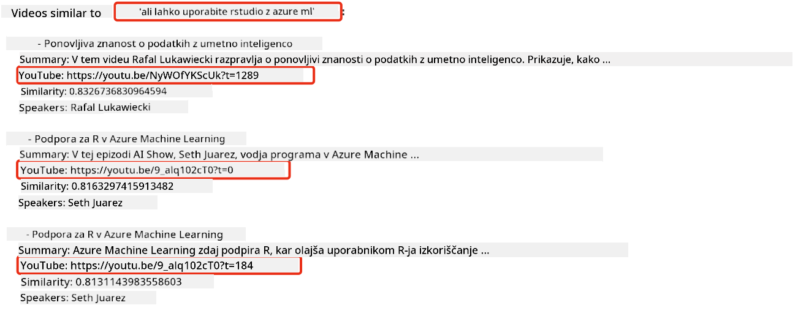
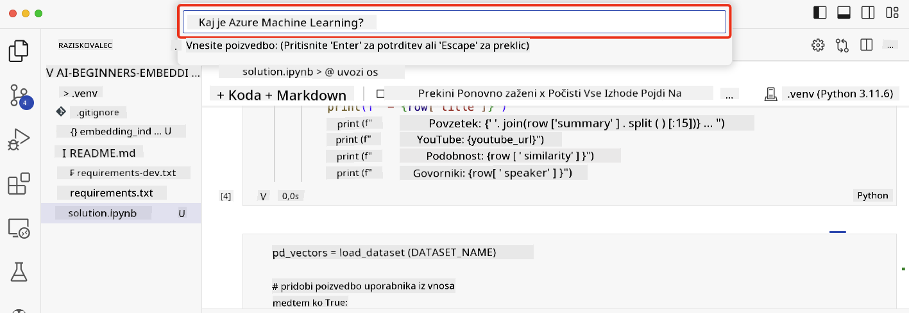

<!--
CO_OP_TRANSLATOR_METADATA:
{
  "original_hash": "d46aad0917a1a342d613e2c13d457da5",
  "translation_date": "2025-06-25T16:45:51+00:00",
  "source_file": "08-building-search-applications/README.md",
  "language_code": "sl"
}
-->
# Gradnja iskalnih aplikacij

[](https://aka.ms/gen-ai-lesson8-gh?WT.mc_id=academic-105485-koreyst)

> > _Kliknite zgornjo sliko za ogled videa te lekcije_

LLM-ji niso le za klepetalnike in generiranje besedil. Možno je tudi graditi iskalne aplikacije z uporabo vgrajenih predstavitev. Vgrajene predstavitve so številčne reprezentacije podatkov, znane tudi kot vektorji, in jih lahko uporabimo za semantično iskanje podatkov.

V tej lekciji boste zgradili iskalno aplikacijo za našo izobraževalno startup organizacijo. Naša organizacija je neprofitna organizacija, ki zagotavlja brezplačno izobraževanje za študente v državah v razvoju. Naša organizacija ima veliko število YouTube videoposnetkov, ki jih študenti lahko uporabijo za učenje o umetni inteligenci. Naša organizacija želi zgraditi iskalno aplikacijo, ki omogoča študentom, da poiščejo YouTube videoposnetek z vnosom vprašanja.

Na primer, študent lahko vnese 'Kaj so Jupyter zvezki?' ali 'Kaj je Azure ML' in iskalna aplikacija bo vrnila seznam YouTube videoposnetkov, ki so relevantni za vprašanje, še bolje, iskalna aplikacija bo vrnila povezavo do mesta v videu, kjer se nahaja odgovor na vprašanje.

## Uvod

V tej lekciji bomo pokrili:

- Semantično iskanje v primerjavi s ključnimi besedami.
- Kaj so besedilne vgrajene predstavitve.
- Ustvarjanje indeksa besedilnih vgrajenih predstavitev.
- Iskanje po indeksu besedilnih vgrajenih predstavitev.

## Cilji učenja

Po zaključku te lekcije boste lahko:

- Razlikovali med semantičnim iskanjem in iskanjem po ključnih besedah.
- Razložili, kaj so besedilne vgrajene predstavitve.
- Ustvarili aplikacijo z uporabo vgrajenih predstavitev za iskanje podatkov.

## Zakaj graditi iskalno aplikacijo?

Ustvarjanje iskalne aplikacije vam bo pomagalo razumeti, kako uporabiti vgrajene predstavitve za iskanje podatkov. Prav tako se boste naučili, kako zgraditi iskalno aplikacijo, ki jo lahko študenti uporabijo za hitro iskanje informacij.

Lekcija vključuje indeks vgrajenih predstavitev prepisov YouTube kanalov za Microsoft [AI Show](https://www.youtube.com/playlist?list=PLlrxD0HtieHi0mwteKBOfEeOYf0LJU4O1). AI Show je YouTube kanal, ki vas uči o umetni inteligenci in strojnem učenju. Indeks vgrajenih predstavitev vsebuje vgrajene predstavitve za vsak prepis YouTube do oktobra 2023. Uporabili boste indeks vgrajenih predstavitev za gradnjo iskalne aplikacije za našo organizacijo. Iskalna aplikacija vrne povezavo do mesta v videu, kjer se nahaja odgovor na vprašanje. To je odličen način, da študenti hitro najdejo potrebne informacije.

Naslednji je primer semantičnega poizvedovanja za vprašanje 'ali lahko uporabite rstudio z azure ml?'. Oglejte si URL YouTube, videli boste, da URL vsebuje časovni žig, ki vas popelje na mesto v videu, kjer se nahaja odgovor na vprašanje.



## Kaj je semantično iskanje?

Zdaj se morda sprašujete, kaj je semantično iskanje? Semantično iskanje je tehnika iskanja, ki uporablja semantiko ali pomen besed v poizvedbi za vrnitev relevantnih rezultatov.

Tukaj je primer semantičnega iskanja. Recimo, da iščete avto, morda boste iskali 'moj sanjski avto', semantično iskanje razume, da ne sanjate o avtu, ampak iščete, da bi kupili svoj sanjski avto. Semantično iskanje razume vaš namen in vrne relevantne rezultate. Alternativa je iskanje po ključnih besedah, ki bi dobesedno iskalo sanje o avtomobilih in pogosto vrne nerelevantne rezultate.

## Kaj so besedilne vgrajene predstavitve?

[Besedilne vgrajene predstavitve](https://en.wikipedia.org/wiki/Word_embedding?WT.mc_id=academic-105485-koreyst) so tehnika predstavitve besedila, ki se uporablja v [obdelavi naravnega jezika](https://en.wikipedia.org/wiki/Natural_language_processing?WT.mc_id=academic-105485-koreyst). Besedilne vgrajene predstavitve so semantične številčne reprezentacije besedila. Vgrajene predstavitve se uporabljajo za predstavitev podatkov na način, ki je enostaven za razumevanje stroja. Obstaja veliko modelov za gradnjo besedilnih vgrajenih predstavitev, v tej lekciji se bomo osredotočili na generiranje vgrajenih predstavitev z uporabo OpenAI Embedding Model.

Tukaj je primer, si predstavljajte, da je naslednje besedilo v prepisu iz ene od epizod na YouTube kanalu AI Show:

```text
Today we are going to learn about Azure Machine Learning.
```

Besedilo bi poslali OpenAI Embedding API in vrnil bi naslednjo vgrajeno predstavitev, ki vsebuje 1536 številk, znanih kot vektor. Vsaka številka v vektorju predstavlja drugačen vidik besedila. Za kratkost, tukaj je prvih 10 številk v vektorju.

```python
[-0.006655829958617687, 0.0026128944009542465, 0.008792596869170666, -0.02446001023054123, -0.008540431968867779, 0.022071078419685364, -0.010703742504119873, 0.003311325330287218, -0.011632772162556648, -0.02187200076878071, ...]
```

## Kako je ustvarjen indeks vgrajenih predstavitev?

Indeks vgrajenih predstavitev za to lekcijo je bil ustvarjen s serijo Python skriptov. Skripte boste našli skupaj z navodili v [README](./scripts/README.md?WT.mc_id=academic-105485-koreyst) v mapi 'scripts' za to lekcijo. Teh skriptov vam ni treba zagnati za dokončanje te lekcije, saj je indeks vgrajenih predstavitev že na voljo.

Skripti izvajajo naslednje operacije:

1. Prepis za vsak YouTube video v [AI Show](https://www.youtube.com/playlist?list=PLlrxD0HtieHi0mwteKBOfEeOYf0LJU4O1) seznamu predvajanja je prenesen.
2. Z uporabo [OpenAI funkcij](https://learn.microsoft.com/azure/ai-services/openai/how-to/function-calling?WT.mc_id=academic-105485-koreyst) se poskuša iz prve 3 minute YouTube prepisa izluščiti ime govorca. Ime govorca za vsak video je shranjeno v indeksu vgrajenih predstavitev z imenom `embedding_index_3m.json`.
3. Prepis besedila je nato razdeljen na **3-minutne segmente besedila**. Segment vključuje približno 20 besed, ki se prekrivajo iz naslednjega segmenta, da se zagotovi, da vgrajena predstavitev za segment ni prekinjena in da zagotovi boljši kontekst iskanja.
4. Vsak segment besedila je nato poslan OpenAI Chat API, da povzame besedilo v 60 besedah. Povzetek je prav tako shranjen v indeksu vgrajenih predstavitev `embedding_index_3m.json`.
5. Na koncu je segment besedila poslan OpenAI Embedding API. Embedding API vrne vektor 1536 številk, ki predstavljajo semantični pomen segmenta. Segment skupaj z OpenAI vgrajenim vektorjem je shranjen v indeksu vgrajenih predstavitev `embedding_index_3m.json`.

### Vektorske baze podatkov

Za enostavnost lekcije je indeks vgrajenih predstavitev shranjen v JSON datoteki z imenom `embedding_index_3m.json` in naložen v Pandas DataFrame. Vendar pa bi bil indeks vgrajenih predstavitev v produkciji shranjen v vektorski bazi podatkov, kot so [Azure Cognitive Search](https://learn.microsoft.com/training/modules/improve-search-results-vector-search?WT.mc_id=academic-105485-koreyst), [Redis](https://cookbook.openai.com/examples/vector_databases/redis/readme?WT.mc_id=academic-105485-koreyst), [Pinecone](https://cookbook.openai.com/examples/vector_databases/pinecone/readme?WT.mc_id=academic-105485-koreyst), [Weaviate](https://cookbook.openai.com/examples/vector_databases/weaviate/readme?WT.mc_id=academic-105485-koreyst), če naštejemo le nekaj.

## Razumevanje kosinusne podobnosti

Naučili smo se o besedilnih vgrajenih predstavitvah, naslednji korak je, da se naučimo, kako uporabiti besedilne vgrajene predstavitve za iskanje podatkov in zlasti za iskanje najbolj podobnih vgrajenih predstavitev za dano poizvedbo z uporabo kosinusne podobnosti.

### Kaj je kosinusna podobnost?

Kosinusna podobnost je mera podobnosti med dvema vektorjema, pogosto boste to slišali tudi kot `nearest neighbor search`. Za izvedbo iskanja po kosinusni podobnosti morate _vektorizirati_ besedilo _poizvedbe_ z uporabo OpenAI Embedding API. Nato izračunajte _kosinusno podobnost_ med vektorjem poizvedbe in vsakim vektorjem v indeksu vgrajenih predstavitev. Ne pozabite, indeks vgrajenih predstavitev ima vektor za vsak segment besedila YouTube prepisa. Na koncu razvrstite rezultate po kosinusni podobnosti in segmenti besedila z najvišjo kosinusno podobnostjo so najbolj podobni poizvedbi.

Z matematičnega vidika kosinusna podobnost meri kosinus kota med dvema vektorjema, projiciranima v večdimenzionalni prostor. Ta meritev je koristna, ker če sta dva dokumenta daleč narazen po Evklidovi razdalji zaradi velikosti, bi lahko še vedno imela manjši kot med njima in zato višjo kosinusno podobnost. Za več informacij o enačbah kosinusne podobnosti glejte [Kosinusna podobnost](https://en.wikipedia.org/wiki/Cosine_similarity?WT.mc_id=academic-105485-koreyst).

## Gradnja vaše prve iskalne aplikacije

Nato se bomo naučili, kako zgraditi iskalno aplikacijo z uporabo vgrajenih predstavitev. Iskalna aplikacija bo študentom omogočila iskanje videoposnetka z vnosom vprašanja. Iskalna aplikacija bo vrnila seznam videoposnetkov, ki so relevantni za vprašanje. Iskalna aplikacija bo prav tako vrnila povezavo do mesta v videu, kjer se nahaja odgovor na vprašanje.

Ta rešitev je bila zgrajena in preizkušena na Windows 11, macOS in Ubuntu 22.04 z uporabo Python 3.10 ali novejšega. Python lahko prenesete s [python.org](https://www.python.org/downloads/?WT.mc_id=academic-105485-koreyst).

## Naloga - gradnja iskalne aplikacije, da omogočite študentom

Na začetku te lekcije smo predstavili našo startup organizacijo. Zdaj je čas, da omogočimo študentom, da zgradijo iskalno aplikacijo za svoje naloge.

V tej nalogi boste ustvarili Azure OpenAI storitve, ki bodo uporabljene za gradnjo iskalne aplikacije. Ustvarili boste naslednje Azure OpenAI storitve. Za dokončanje te naloge boste potrebovali naročnino na Azure.

### Zaženite Azure Cloud Shell

1. Prijavite se v [Azure portal](https://portal.azure.com/?WT.mc_id=academic-105485-koreyst).
2. Izberite ikono Cloud Shell v zgornjem desnem kotu Azure portala.
3. Izberite **Bash** za tip okolja.

#### Ustvarite skupino virov

> Za ta navodila uporabljamo skupino virov z imenom "semantic-video-search" v vzhodnih ZDA.
> Ime skupine virov lahko spremenite, vendar pri spreminjanju lokacije za vire
> preverite [tabelo razpoložljivosti modelov](https://aka.ms/oai/models?WT.mc_id=academic-105485-koreyst).

```shell
az group create --name semantic-video-search --location eastus
```

#### Ustvarite vir Azure OpenAI Service

Iz Azure Cloud Shell zaženite naslednji ukaz za ustvarjanje vira Azure OpenAI Service.

```shell
az cognitiveservices account create --name semantic-video-openai --resource-group semantic-video-search \
    --location eastus --kind OpenAI --sku s0
```

#### Pridobite končno točko in ključe za uporabo v tej aplikaciji

Iz Azure Cloud Shell zaženite naslednje ukaze za pridobitev končne točke in ključev za vir Azure OpenAI Service.

```shell
az cognitiveservices account show --name semantic-video-openai \
   --resource-group  semantic-video-search | jq -r .properties.endpoint
az cognitiveservices account keys list --name semantic-video-openai \
   --resource-group semantic-video-search | jq -r .key1
```

#### Namestite model OpenAI Embedding

Iz Azure Cloud Shell zaženite naslednji ukaz za namestitev modela OpenAI Embedding.

```shell
az cognitiveservices account deployment create \
    --name semantic-video-openai \
    --resource-group  semantic-video-search \
    --deployment-name text-embedding-ada-002 \
    --model-name text-embedding-ada-002 \
    --model-version "2"  \
    --model-format OpenAI \
    --sku-capacity 100 --sku-name "Standard"
```

## Rešitev

Odprite [rešitveni zvezek](../../../08-building-search-applications/python/aoai-solution.ipynb) v GitHub Codespaces in sledite navodilom v Jupyter zvezku.

Ko zaženete zvezek, boste pozvani, da vnesete poizvedbo. Vnosno polje bo izgledalo takole:



## Odlično delo! Nadaljujte z učenjem

Po zaključku te lekcije si oglejte našo [kolekcijo učenja generativne umetne inteligence](https://aka.ms/genai-collection?WT.mc_id=academic-105485-koreyst), da nadaljujete z nadgradnjo svojega znanja o generativni umetni inteligenci!

Pojdite na Lekcijo 9, kjer bomo pogledali, kako [zgraditi aplikacije za generiranje slik](../09-building-image-applications/README.md?WT.mc_id=academic-105485-koreyst)!

**Omejitev odgovornosti**:  
Ta dokument je bil preveden z uporabo storitve AI za prevajanje [Co-op Translator](https://github.com/Azure/co-op-translator). Čeprav se trudimo za natančnost, vas prosimo, da se zavedate, da lahko avtomatizirani prevodi vsebujejo napake ali netočnosti. Izvirni dokument v njegovem maternem jeziku je treba obravnavati kot avtoritativni vir. Za kritične informacije je priporočljiv profesionalni človeški prevod. Ne prevzemamo odgovornosti za morebitna nesporazumevanja ali napačne razlage, ki izhajajo iz uporabe tega prevoda.