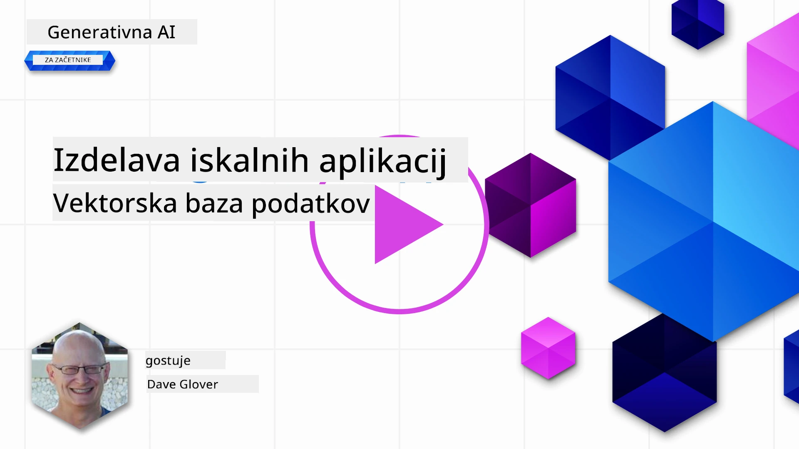
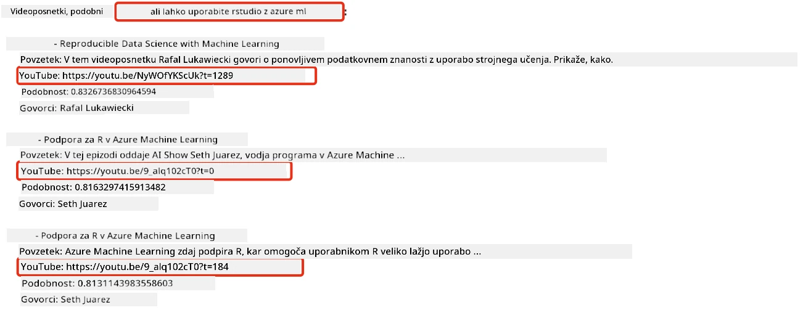
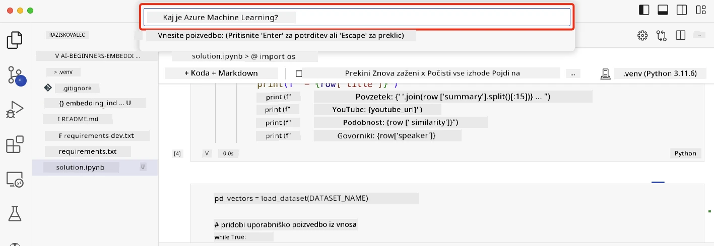

# Izdelava iskalnih aplikacij

[](https://youtu.be/W0-nzXjOjr0?si=GcsqiTTvd7RKbo7V)

> > _Kliknite na zgornjo sliko za ogled videa te lekcije_

LLM-ji niso namenjeni le klepetalnim botom in generiranju besedil. Prav tako je mogoče izdelati iskalne aplikacije s pomočjo vdelav (Embeddings). Vdelave so numerične predstavitve podatkov, znane tudi kot vektorji, in se lahko uporabljajo za semantično iskanje podatkov.

V tej lekciji boste izdelali iskalno aplikacijo za naš ustanovljeni izobraževalni startup. Naš startup je neprofitna organizacija, ki študentom v razvijajočih se državah nudi brezplačno izobraževanje. Startup ima veliko število video posnetkov na YouTubu, ki jih lahko študenti uporabljajo za učenje o UI. Startup želi izdelati iskalno aplikacijo, ki študentom omogoča iskanje YouTube video posnetkov z vnosom vprašanja.

Na primer, študent lahko vpiše 'Kaj so Jupyter Notebooki?' ali 'Kaj je Azure ML' in iskalna aplikacija bo vrnila seznam YouTube video posnetkov, ki so povezani z vprašanjem, še bolje pa bo iskalna aplikacija vrnila povezavo do mesta v videu, kjer je odgovor na vprašanje.

## Uvod

V tej lekciji bomo obravnavali:

- Semantično iskanje v primerjavi z iskanjem po ključnih besedah.
- Kaj so tekstovne vdelave.
- Ustvarjanje indeksa tekstovnih vdelav.
- Iskanje v indeksu tekstovnih vdelav.

## Cilji učenja

Po zaključenem tej lekciji boste znali:

- Razločiti semantično iskanje od iskanja po ključnih besedah.
- Pojasniti, kaj so tekstovne vdelave.
- Izdelati aplikacijo za iskanje podatkov s pomočjo vdelav.

## Zakaj izdelati iskalno aplikacijo?

Izdelava iskalne aplikacije vam bo pomagala razumeti, kako uporabiti vdelave za iskanje podatkov. Prav tako se boste naučili izdelati iskalno aplikacijo, ki jo lahko študenti uporabljajo za hitro iskanje informacij.

Lekcija vključuje indeks vdelav za prepisane vsebine YouTube posnetkov kanala Microsoft [AI Show](https://www.youtube.com/playlist?list=PLlrxD0HtieHi0mwteKBOfEeOYf0LJU4O1). AI Show je YouTube kanal, ki vas uči o UI in strojni učenju. Indeks vdelav vsebuje vdelave vsakega prepisanega besedila YouTube posnetkov do oktobra 2023. Indeks vdelav boste uporabili za izdelavo iskalne aplikacije za naš startup. Iskalna aplikacija bo vrnila povezavo do mesta v videu, kjer je odgovor na vprašanje. To je odličen način, da študenti hitro najdejo potrebne informacije.

Spodaj je primer semantičnega poizvedovanja za vprašanje 'ali lahko uporabljate rstudio z azure ml?'. Oglejte si URL YouTuba, ki vsebuje časovni žig, ki vas popelje na mesto v videu, kjer je odgovor na vprašanje.



## Kaj je semantično iskanje?

Morda se sprašujete, kaj je semantično iskanje? Semantično iskanje je iskalna tehnika, ki uporablja pomen, ali semantiko, besed v poizvedbi, da vrne relevantne rezultate.

Tukaj je primer semantičnega iskanja. Recimo, da želite kupiti avto in iščete 'moj sanjski avto'. Semantično iskanje razume, da ne `sanjarite` o avtomobilu, ampak da iščete svoj `idealni` avto. Semantično iskanje razume vašo namero in vrne ustrezne rezultate. Alternativa je `iskanje po ključnih besedah`, ki bi dobesedno iskalo sanje o avtomobilih in pogosto vrnilo nepovezane rezultate.

## Kaj so tekstovne vdelave?

[Tekstovne vdelave](https://en.wikipedia.org/wiki/Word_embedding?WT.mc_id=academic-105485-koreyst) so tehnika predstavitve besedila, uporabljena v [obdelavi naravnega jezika](https://en.wikipedia.org/wiki/Natural_language_processing?WT.mc_id=academic-105485-koreyst). Tekstovne vdelave so semantične numerične predstavitve besedila. Vdelave se uporabljajo za predstavitev podatkov na način, ki ga stroj lahko enostavno razume. Obstaja veliko modelov za izdelavo tekstovnih vdelav, v tej lekciji se bomo osredotočili na generiranje vdelav z modelom OpenAI Embedding.

Tukaj je primer, predstavljajte si, da je naslednje besedilo del prepisa ene izmed epizod na kanalu AI Show na YouTubu:

```text
Today we are going to learn about Azure Machine Learning.
```

Besedilo bi poslali v API OpenAI Embedding, ki bi vrnil sledečo vdelavo, sestavljeno iz 1536 številk, imenovanih še vektor. Vsako število v vektorju predstavlja drugačen vidik besedila. Za kratkost so tukaj prikazane prve 10 številk v vektorju.

```python
[-0.006655829958617687, 0.0026128944009542465, 0.008792596869170666, -0.02446001023054123, -0.008540431968867779, 0.022071078419685364, -0.010703742504119873, 0.003311325330287218, -0.011632772162556648, -0.02187200076878071, ...]
```

## Kako je ustvarjen indeks vdelav?

Indeks vdelav za to lekcijo je ustvarjen s serijo skript Python. Skripte z navodili boste našli v [README](./scripts/README.md?WT.mc_id=academic-105485-koreyst) v mapi 'scripts' za to lekcijo. Za dokončanje lekcije teh skript ni treba poganjati, saj je indeks vdelav na voljo.

Skripte opravijo naslednje operacije:

1. Prenese se prepis za vsak YouTube video v predvajalnem seznamu [AI Show](https://www.youtube.com/playlist?list=PLlrxD0HtieHi0mwteKBOfEeOYf0LJU4O1).
2. Z uporabo [OpenAI funkcij](https://learn.microsoft.com/azure/ai-foundry/openai/how-to/function-calling?WT.mc_id=academic-105485-koreyst) poskušajo iz prve 3 minute prepisa izvleči ime govornika. Ime govornika za vsak video je shranjeno v indeks vdelav z imenom `embedding_index_3m.json`.
3. Nato se besedilo prepisa razdeli na **3 minutne besedilne segmente**. Segment vključuje približno 20 prekrivajočih se besed iz naslednjega segmenta, da zagotovimo, da vdelava segmenta ni prekinjena in za zagotavljanje boljšega iskalnega konteksta.
4. Vsak besedilni segment se nato pošlje v OpenAI Chat API za povzetek besedila v 60 besedah. Povzetek je prav tako shranjen v indeks vdelav `embedding_index_3m.json`.
5. Na koncu se besedilo segmenta pošlje v OpenAI Embedding API. Embedding API vrne vektor 1536 številk, ki predstavljajo semantični pomen segmenta. Segment skupaj z vektorjem OpenAI Embedding je shranjen v indeks vdelav `embedding_index_3m.json`.

### Vektorske baze podatkov

Zaradi poenostavitve lekcije je indeks vdelav shranjen v JSON datoteki z imenom `embedding_index_3m.json` in naložen v Pandas DataFrame. V produkcijskem okolju pa bi bil indeks vdelav shranjen v vektorski bazi podatkov, kot so [Azure Cognitive Search](https://learn.microsoft.com/training/modules/improve-search-results-vector-search?WT.mc_id=academic-105485-koreyst), [Redis](https://cookbook.openai.com/examples/vector_databases/redis/readme?WT.mc_id=academic-105485-koreyst), [Pinecone](https://cookbook.openai.com/examples/vector_databases/pinecone/readme?WT.mc_id=academic-105485-koreyst), [Weaviate](https://cookbook.openai.com/examples/vector_databases/weaviate/readme?WT.mc_id=academic-105485-koreyst) in še nekaterih drugih.

## Razumevanje kosinusne podobnosti

Naučili smo se o tekstovnih vdelavah, naslednji korak je naučiti se, kako uporabiti tekstovne vdelave za iskanje podatkov in še posebej najti najbolj podobne vdelave glede na dano poizvedbo z uporabo kosinusne podobnosti.

### Kaj je kosinusna podobnost?

Kosinusna podobnost je mera podobnosti med dvema vektorjema, pogosto imenovana tudi `iskanje najbližjega soseda`. Za izvajanje iskanja po kosinusni podobnosti morate _vektorizirati_ besedilo poizvedbe z uporabo OpenAI Embedding API. Nato izračunate _kosinusno podobnost_ med vektorjem poizvedbe in vsakim vektorjem v indeksu vdelav. Zapomnite si, indeks vdelav ima vektor za vsak besedilni segment prepisa YouTube videa. Na koncu rezultate uredite po kosinusni podobnosti, pri čemer so besedilni segmenti z najvišjo kosinusno podobnostjo najbolj podobni poizvedbi.

Iz matematičnega vidika kosinusna podobnost meri kosinus kota med dvema vektorjema, projicirano v večdimenzionalni prostor. Ta mera je koristna, saj lahko imata dve dokumenti velik razmik po evklidski razdalji zaradi velikosti, vendar imata lahko manjši kot in zato večjo kosinusno podobnost. Za več informacij o enačbah kosinusne podobnosti glejte [Kosinusna podobnost](https://en.wikipedia.org/wiki/Cosine_similarity?WT.mc_id=academic-105485-koreyst).

## Izdelava vaše prve iskalne aplikacije

Naslednji korak je naučiti se izdelati iskalno aplikacijo s pomočjo vdelav. Iskalna aplikacija bo študentom omogočila iskanje videoposnetka z vnosom vprašanja. Iskalna aplikacija bo vrnila seznam videoposnetkov, ki so relevantni za vprašanje. Prav tako bo vrnila povezavo do mesta v videu, kjer se nahaja odgovor na vprašanje.

Rešitev je bila razvita in preizkušena na Windows 11, macOS in Ubuntu 22.04 z uporabo Pythona 3.10 ali novejšega. Python lahko prenesete s [python.org](https://www.python.org/downloads/?WT.mc_id=academic-105485-koreyst).

## Naloga - izdelava iskalne aplikacije za študente

Na začetku lekcije smo predstavili naš startup. Zdaj je čas, da študentom omogočite izdelavo iskalne aplikacije za njihove ocene.

V tej nalogi boste ustvarili Azure OpenAI storitve, ki bodo uporabljene za izdelavo iskalne aplikacije. Ustvarili boste naslednje Azure OpenAI storitve. Za dokončanje naloge potrebujete prenosi Azure.

### Začnite Azure Cloud Shell

1. Prijavite se v [Azure portal](https://portal.azure.com/?WT.mc_id=academic-105485-koreyst).
2. Izberite ikono Cloud Shell v zgornjem desnem kotu Azure portala.
3. Izberite **Bash** kot vrsto okolja.

#### Ustvarite skupino virov

> Za ta navodila uporabljamo skupino virov z imenom "semantic-video-search" v vzhodni ZDA.
> Ime skupine virov lahko spremenite, vendar če spreminjate lokacijo virov,
> preverite [tabelo razpoložljivosti modelov](https://aka.ms/oai/models?WT.mc_id=academic-105485-koreyst).

```shell
az group create --name semantic-video-search --location eastus
```

#### Ustvarite Azure OpenAI storitev

V Azure Cloud Shell zaženite naslednji ukaz za ustvarjanje vira Azure OpenAI Service.

```shell
az cognitiveservices account create --name semantic-video-openai --resource-group semantic-video-search \
    --location eastus --kind OpenAI --sku s0
```

#### Pridobite konec točke in ključe za uporabo v tej aplikaciji

V Azure Cloud Shell zaženite naslednje ukaze, da pridobite konec točke in ključe Azure OpenAI storitve.

```shell
az cognitiveservices account show --name semantic-video-openai \
   --resource-group  semantic-video-search | jq -r .properties.endpoint
az cognitiveservices account keys list --name semantic-video-openai \
   --resource-group semantic-video-search | jq -r .key1
```

#### Namestite OpenAI Embedding model

V Azure Cloud Shell zaženite naslednji ukaz za namestitev OpenAI Embedding modela.

```shell
az cognitiveservices account deployment create \
    --name semantic-video-openai \
    --resource-group  semantic-video-search \
    --deployment-name text-embedding-ada-002 \
    --model-name text-embedding-ada-002 \
    --model-version "2"  \
    --model-format OpenAI \
    --sku-capacity 100 --sku-name "Standard"
```

## Rešitev

Odprite [notebook z rešitvijo](./python/aoai-solution.ipynb?WT.mc_id=academic-105485-koreyst) v GitHub Codespaces in sledite navodilom v Jupyter Notebooku.

Ko zaženete notebook, boste pozvani, da vnesete poizvedbo. Vhodno polje bo izgledalo tako:



## Odlično delo! Nadaljujte z učenjem

Po zaključenju te lekcije si oglejte našo [Generativno AI zbirko za učenje](https://aka.ms/genai-collection?WT.mc_id=academic-105485-koreyst) in nadaljujte z nadgradnjo znanja o generativni UI!

Pojdite na lekcijo 9, kjer bomo pogledali, kako [izdelati aplikacije za generiranje slik](../09-building-image-applications/README.md?WT.mc_id=academic-105485-koreyst)!

---

<!-- CO-OP TRANSLATOR DISCLAIMER START -->
**Omejitev odgovornosti**:
Ta dokument je bil preveden z uporabo AI prevajalske storitve [Co-op Translator](https://github.com/Azure/co-op-translator). Čeprav si prizadevamo za natančnost, vas prosimo, da upoštevate, da avtomatizirani prevodi lahko vsebujejo napake ali netočnosti. Izvirni dokument v njegovem izvirnem jeziku je treba obravnavati kot avtoritativni vir. Za kritične informacije je priporočljiv strokovni človeški prevod. Ne odgovarjamo za morebitna nesporazume ali napačne interpretacije, ki izhajajo iz uporabe tega prevoda.
<!-- CO-OP TRANSLATOR DISCLAIMER END -->