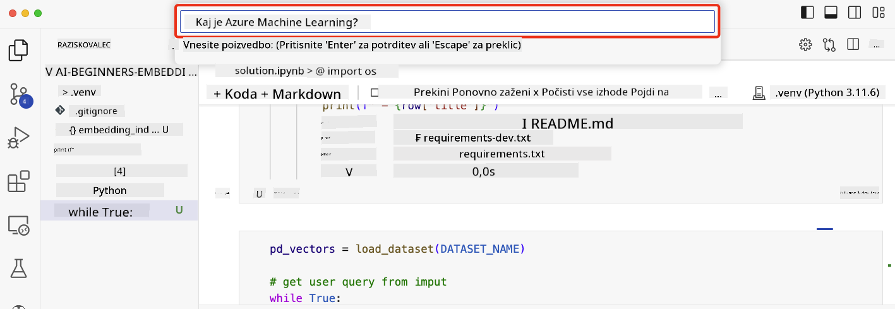

<!--
CO_OP_TRANSLATOR_METADATA:
{
  "original_hash": "58953c08b8ba7073b836d4270ea0fe86",
  "translation_date": "2025-10-18T01:39:16+00:00",
  "source_file": "08-building-search-applications/README.md",
  "language_code": "sl"
}
-->
# Gradnja iskalnih aplikacij

[](https://youtu.be/W0-nzXjOjr0?si=GcsqiTTvd7RKbo7V)

> > _Kliknite zgornjo sliko za ogled videoposnetka te lekcije_

LLM-ji niso namenjeni le klepetalnikom in generiranju besedil. Z uporabo vektorskih predstav (Embeddings) je mogoče zgraditi tudi iskalne aplikacije. Vektorske predstavitve so numerične reprezentacije podatkov, znane tudi kot vektorji, ki jih je mogoče uporabiti za semantično iskanje podatkov.

V tej lekciji boste zgradili iskalno aplikacijo za naš izobraževalni startup. Naš startup je neprofitna organizacija, ki zagotavlja brezplačno izobraževanje študentom v državah v razvoju. Naš startup ima veliko število YouTube videoposnetkov, ki jih študenti lahko uporabijo za učenje o umetni inteligenci. Naš startup želi zgraditi iskalno aplikacijo, ki študentom omogoča iskanje YouTube videoposnetkov z vnosom vprašanja.

Na primer, študent lahko vnese 'Kaj so Jupyter zvezki?' ali 'Kaj je Azure ML' in iskalna aplikacija bo vrnila seznam YouTube videoposnetkov, ki so relevantni za vprašanje, še bolje pa je, da bo iskalna aplikacija vrnila povezavo na mesto v videoposnetku, kjer se nahaja odgovor na vprašanje.

## Uvod

V tej lekciji bomo obravnavali:

- Semantično iskanje v primerjavi s ključnimi besedami.
- Kaj so vektorske predstavitve besedila.
- Ustvarjanje indeksa vektorskih predstavitev besedila.
- Iskanje v indeksu vektorskih predstavitev besedila.

## Cilji učenja

Po zaključku te lekcije boste lahko:

- Razlikovali med semantičnim iskanjem in iskanjem po ključnih besedah.
- Razložili, kaj so vektorske predstavitve besedila.
- Ustvarili aplikacijo z uporabo vektorskih predstavitev za iskanje podatkov.

## Zakaj graditi iskalno aplikacijo?

Ustvarjanje iskalne aplikacije vam bo pomagalo razumeti, kako uporabiti vektorske predstavitve za iskanje podatkov. Prav tako se boste naučili, kako zgraditi iskalno aplikacijo, ki jo lahko študenti uporabijo za hitro iskanje informacij.

Lekcija vključuje indeks vektorskih predstavitev prepisov YouTube videoposnetkov iz Microsoftovega [AI Show](https://www.youtube.com/playlist?list=PLlrxD0HtieHi0mwteKBOfEeOYf0LJU4O1) YouTube kanala. AI Show je YouTube kanal, ki vas uči o umetni inteligenci in strojnem učenju. Indeks vektorskih predstavitev vsebuje vektorske predstavitve za vsak prepis YouTube videoposnetkov do oktobra 2023. Ta indeks boste uporabili za gradnjo iskalne aplikacije za naš startup. Iskalna aplikacija bo vrnila povezavo na mesto v videoposnetku, kjer se nahaja odgovor na vprašanje. To je odličen način, da študenti hitro najdejo potrebne informacije.

Spodaj je primer semantičnega iskanja za vprašanje 'Ali lahko uporabite rstudio z azure ml?'. Oglejte si URL YouTube videoposnetka, videli boste, da URL vsebuje časovno oznako, ki vas popelje na mesto v videoposnetku, kjer se nahaja odgovor na vprašanje.


## Kaj je semantično iskanje?

Morda se sprašujete, kaj je semantično iskanje? Semantično iskanje je tehnika iskanja, ki uporablja semantiko ali pomen besed v poizvedbi za vrnitev relevantnih rezultatov.

Tukaj je primer semantičnega iskanja. Recimo, da želite kupiti avto, morda iščete 'moj sanjski avto', semantično iskanje razume, da ne `sanjarite` o avtu, ampak iščete svoj `idealni` avto. Semantično iskanje razume vaš namen in vrne relevantne rezultate. Alternativa je `iskanje po ključnih besedah`, ki bi dobesedno iskalo sanje o avtomobilih in pogosto vrnilo nerelevantne rezultate.

## Kaj so vektorske predstavitve besedila?

[Vektorske predstavitve besedila](https://en.wikipedia.org/wiki/Word_embedding?WT.mc_id=academic-105485-koreyst) so tehnika reprezentacije besedila, ki se uporablja v [obdelavi naravnega jezika](https://en.wikipedia.org/wiki/Natural_language_processing?WT.mc_id=academic-105485-koreyst). Vektorske predstavitve so semantične numerične reprezentacije besedila. Uporabljajo se za predstavitev podatkov na način, ki ga stroj zlahka razume. Obstaja veliko modelov za ustvarjanje vektorskih predstavitev besedila, v tej lekciji se bomo osredotočili na generiranje vektorskih predstavitev z uporabo OpenAI Embedding Model.

Tukaj je primer, predstavljajte si, da je naslednje besedilo v prepisu ene od epizod na YouTube kanalu AI Show:

```text
Today we are going to learn about Azure Machine Learning.
```

Besedilo bi posredovali OpenAI Embedding API-ju, ki bi vrnil naslednjo vektorsko predstavitev, sestavljeno iz 1536 številk, imenovano vektor. Vsaka številka v vektorju predstavlja drugačen vidik besedila. Zaradi preglednosti so tukaj prikazane prve 10 številke vektorja.

```python
[-0.006655829958617687, 0.0026128944009542465, 0.008792596869170666, -0.02446001023054123, -0.008540431968867779, 0.022071078419685364, -0.010703742504119873, 0.003311325330287218, -0.011632772162556648, -0.02187200076878071, ...]
```

## Kako je ustvarjen indeks vektorskih predstavitev?

Indeks vektorskih predstavitev za to lekcijo je bil ustvarjen s serijo Python skriptov. Skripte skupaj z navodili najdete v [README](./scripts/README.md?WT.mc_id=academic-105485-koreyst) v mapi 'scripts' za to lekcijo. Teh skriptov ni treba zagnati za dokončanje te lekcije, saj je indeks vektorskih predstavitev že na voljo.

Skripti izvajajo naslednje operacije:

1. Prepis za vsak YouTube videoposnetek v [AI Show](https://www.youtube.com/playlist?list=PLlrxD0HtieHi0mwteKBOfEeOYf0LJU4O1) seznamu predvajanja se prenese.
2. Z uporabo [OpenAI funkcij](https://learn.microsoft.com/azure/ai-services/openai/how-to/function-calling?WT.mc_id=academic-105485-koreyst) se poskuša izluščiti ime govorca iz prvih 3 minut prepisov YouTube videoposnetkov. Ime govorca za vsak videoposnetek se shrani v indeks vektorskih predstavitev z imenom `embedding_index_3m.json`.
3. Besedilo prepisa se nato razdeli na **3-minutne tekstovne segmente**. Segment vključuje približno 20 besed, ki se prekrivajo z naslednjim segmentom, da se zagotovi, da vektorska predstavitev segmenta ni prekinjena in da se zagotovi boljši kontekst iskanja.
4. Vsak tekstovni segment se nato posreduje OpenAI Chat API-ju, da povzame besedilo v 60 besed. Povzetek se prav tako shrani v indeks vektorskih predstavitev `embedding_index_3m.json`.
5. Na koncu se besedilo segmenta posreduje OpenAI Embedding API-ju. Embedding API vrne vektor s 1536 številkami, ki predstavljajo semantični pomen segmenta. Segment skupaj z OpenAI vektorsko predstavitvijo se shrani v indeks vektorskih predstavitev `embedding_index_3m.json`.

### Vektorske baze podatkov

Za poenostavitev lekcije je indeks vektorskih predstavitev shranjen v JSON datoteki z imenom `embedding_index_3m.json` in naložen v Pandas DataFrame. V produkciji pa bi bil indeks vektorskih predstavitev shranjen v vektorski bazi podatkov, kot so [Azure Cognitive Search](https://learn.microsoft.com/training/modules/improve-search-results-vector-search?WT.mc_id=academic-105485-koreyst), [Redis](https://cookbook.openai.com/examples/vector_databases/redis/readme?WT.mc_id=academic-105485-koreyst), [Pinecone](https://cookbook.openai.com/examples/vector_databases/pinecone/readme?WT.mc_id=academic-105485-koreyst), [Weaviate](https://cookbook.openai.com/examples/vector_databases/weaviate/readme?WT.mc_id=academic-105485-koreyst), da naštejemo le nekaj.

## Razumevanje kosinusne podobnosti

Spoznali smo vektorske predstavitve besedila, naslednji korak je, da se naučimo, kako uporabiti vektorske predstavitve za iskanje podatkov, zlasti kako najti najbolj podobne vektorske predstavitve za dano poizvedbo z uporabo kosinusne podobnosti.

### Kaj je kosinusna podobnost?

Kosinusna podobnost je merilo podobnosti med dvema vektorjema, pogosto imenovano tudi `iskanje najbližjega soseda`. Za izvedbo iskanja s kosinusno podobnostjo morate _vektorizirati_ besedilo _poizvedbe_ z uporabo OpenAI Embedding API-ja. Nato izračunate _kosinusno podobnost_ med vektorjem poizvedbe in vsakim vektorjem v indeksu vektorskih predstavitev. Ne pozabite, indeks vektorskih predstavitev ima vektor za vsak segment besedila prepisa YouTube videoposnetkov. Na koncu razvrstite rezultate po kosinusni podobnosti, pri čemer so segmenti besedila z najvišjo kosinusno podobnostjo najbolj podobni poizvedbi.

Z matematičnega vidika kosinusna podobnost meri kosinus kota med dvema vektorjema, projiciranima v večdimenzionalni prostor. Ta meritev je koristna, saj če sta dva dokumenta med seboj oddaljena po Evklidski razdalji zaradi velikosti, lahko še vedno imata manjši kot med njima in zato višjo kosinusno podobnost. Za več informacij o enačbah kosinusne podobnosti si oglejte [Kosinusna podobnost](https://en.wikipedia.org/wiki/Cosine_similarity?WT.mc_id=academic-105485-koreyst).

## Gradnja vaše prve iskalne aplikacije

Naslednje, naučili se bomo, kako zgraditi iskalno aplikacijo z uporabo vektorskih predstavitev. Iskalna aplikacija bo študentom omogočila iskanje videoposnetka z vnosom vprašanja. Iskalna aplikacija bo vrnila seznam videoposnetkov, ki so relevantni za vprašanje. Iskalna aplikacija bo prav tako vrnila povezavo na mesto v videoposnetku, kjer se nahaja odgovor na vprašanje.

Ta rešitev je bila zgrajena in testirana na Windows 11, macOS in Ubuntu 22.04 z uporabo Python 3.10 ali novejše različice. Python lahko prenesete s [python.org](https://www.python.org/downloads/?WT.mc_id=academic-105485-koreyst).

## Naloga - gradnja iskalne aplikacije za pomoč študentom

Na začetku te lekcije smo predstavili naš startup. Zdaj je čas, da omogočimo študentom gradnjo iskalne aplikacije za njihove naloge.

V tej nalogi boste ustvarili Azure OpenAI storitve, ki bodo uporabljene za gradnjo iskalne aplikacije. Ustvarili boste naslednje Azure OpenAI storitve. Za dokončanje te naloge boste potrebovali naročnino na Azure.

### Zaženite Azure Cloud Shell

1. Prijavite se v [Azure portal](https://portal.azure.com/?WT.mc_id=academic-105485-koreyst).
2. Izberite ikono Cloud Shell v zgornjem desnem kotu Azure portala.
3. Izberite **Bash** za vrsto okolja.

#### Ustvarite skupino virov

> Za ta navodila uporabljamo skupino virov z imenom "semantic-video-search" v East US.
> Ime skupine virov lahko spremenite, vendar pri spreminjanju lokacije virov preverite [tabelo razpoložljivosti modelov](https://aka.ms/oai/models?WT.mc_id=academic-105485-koreyst).

```shell
az group create --name semantic-video-search --location eastus
```

#### Ustvarite vir Azure OpenAI Service

Iz Azure Cloud Shell zaženite naslednji ukaz za ustvarjanje vira Azure OpenAI Service.

```shell
az cognitiveservices account create --name semantic-video-openai --resource-group semantic-video-search \
    --location eastus --kind OpenAI --sku s0
```

#### Pridobite končno točko in ključe za uporabo v tej aplikaciji

Iz Azure Cloud Shell zaženite naslednje ukaze za pridobitev končne točke in ključev za vir Azure OpenAI Service.

```shell
az cognitiveservices account show --name semantic-video-openai \
   --resource-group  semantic-video-search | jq -r .properties.endpoint
az cognitiveservices account keys list --name semantic-video-openai \
   --resource-group semantic-video-search | jq -r .key1
```

#### Namestite OpenAI Embedding model

Iz Azure Cloud Shell zaženite naslednji ukaz za namestitev OpenAI Embedding modela.

```shell
az cognitiveservices account deployment create \
    --name semantic-video-openai \
    --resource-group  semantic-video-search \
    --deployment-name text-embedding-ada-002 \
    --model-name text-embedding-ada-002 \
    --model-version "2"  \
    --model-format OpenAI \
    --sku-capacity 100 --sku-name "Standard"
```

## Rešitev

Odprite [rešitveni zvezek](./python/aoai-solution.ipynb?WT.mc_id=academic-105485-koreyst) v GitHub Codespaces in sledite navodilom v Jupyter Notebooku.

Ko zaženete zvezek, boste pozvani, da vnesete poizvedbo. Vnosno polje bo videti takole:



## Odlično delo! Nadaljujte z učenjem

Po zaključku te lekcije si oglejte našo [zbirko učenja o generativni umetni inteligenci](https://aka.ms/genai-collection?WT.mc_id=academic-105485-koreyst), da še naprej nadgrajujete svoje znanje o generativni umetni inteligenci!

Pojdite na lekcijo 9, kjer bomo pogledali, kako [zgraditi aplikacije za generiranje slik](../09-building-image-applications/README.md?WT.mc_id=academic-105485-koreyst)!

---

**Omejitev odgovornosti**:  
Ta dokument je bil preveden z uporabo storitve za prevajanje z umetno inteligenco [Co-op Translator](https://github.com/Azure/co-op-translator). Čeprav si prizadevamo za natančnost, vas prosimo, da upoštevate, da lahko avtomatizirani prevodi vsebujejo napake ali netočnosti. Izvirni dokument v njegovem maternem jeziku naj se šteje za avtoritativni vir. Za ključne informacije priporočamo profesionalni človeški prevod. Ne prevzemamo odgovornosti za morebitna nesporazumevanja ali napačne razlage, ki izhajajo iz uporabe tega prevoda.