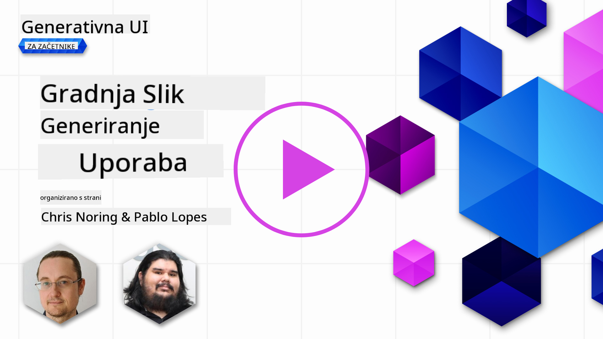

<!--
CO_OP_TRANSLATOR_METADATA:
{
  "original_hash": "1a7fd0f95f9eb673b79da47c0814f4d4",
  "translation_date": "2025-07-09T13:35:30+00:00",
  "source_file": "09-building-image-applications/README.md",
  "language_code": "sl"
}
-->
# Gradnja aplikacij za generiranje slik

[](https://aka.ms/gen-ai-lesson9-gh?WT.mc_id=academic-105485-koreyst)

LLM-ji niso namenjeni le generiranju besedil. Prav tako je mogoče ustvarjati slike na podlagi besedilnih opisov. Slike kot modaliteta so lahko zelo uporabne na številnih področjih, od MedTech, arhitekture, turizma, razvoja iger in še več. V tem poglavju bomo spoznali dva najbolj priljubljena modela za generiranje slik, DALL-E in Midjourney.

## Uvod

V tej lekciji bomo obravnavali:

- Generiranje slik in zakaj je koristno.
- DALL-E in Midjourney, kaj sta in kako delujeta.
- Kako zgraditi aplikacijo za generiranje slik.

## Cilji učenja

Po zaključku te lekcije boste znali:

- Zgraditi aplikacijo za generiranje slik.
- Določiti meje vaše aplikacije z meta pozivi.
- Delati z DALL-E in Midjourney.

## Zakaj zgraditi aplikacijo za generiranje slik?

Aplikacije za generiranje slik so odličen način za raziskovanje zmogljivosti Generativne AI. Uporabljajo se lahko na primer za:

- **Urejanje in sintezo slik**. Lahko ustvarjate slike za različne primere uporabe, kot so urejanje in sinteza slik.

- **Uporaba v različnih panogah**. Prav tako jih lahko uporabite za generiranje slik v različnih panogah, kot so Medtech, turizem, razvoj iger in še več.

## Scenarij: Edu4All

Kot del te lekcije bomo nadaljevali delo z našim startupom Edu4All. Študenti bodo ustvarjali slike za svoje ocene, kakšne slike bodo točno, pa je prepuščeno njim – lahko so ilustracije za njihovo pravljico, ustvarijo nove like za svojo zgodbo ali pa jim pomagajo vizualizirati njihove ideje in koncepte.

Tukaj je primer, kaj bi lahko študenti Edu4All ustvarili, če delajo v razredu o spomenikih:


z uporabo poziva, kot je

> "Pes ob Eifflovem stolpu v zgodnjih jutranjih sončnih žarkih"

## Kaj sta DALL-E in Midjourney?

[DALL-E](https://openai.com/dall-e-2?WT.mc_id=academic-105485-koreyst) in [Midjourney](https://www.midjourney.com/?WT.mc_id=academic-105485-koreyst) sta dva najbolj priljubljena modela za generiranje slik, ki omogočata ustvarjanje slik na podlagi pozivov.

### DALL-E

Začnimo z DALL-E, ki je model Generativne AI, ki ustvarja slike iz besedilnih opisov.

> [DALL-E je kombinacija dveh modelov, CLIP in diffused attention](https://towardsdatascience.com/openais-dall-e-and-clip-101-a-brief-introduction-3a4367280d4e?WT.mc_id=academic-105485-koreyst).

- **CLIP** je model, ki ustvarja vdelave (embeddings), to so numerične predstavitve podatkov, iz slik in besedil.

- **Diffused attention** je model, ki ustvarja slike iz teh vdelav. DALL-E je usposobljen na naboru slik in besedil ter se uporablja za generiranje slik iz besedilnih opisov. Na primer, DALL-E lahko ustvari sliko mačke s klobukom ali psa z mohawkom.

### Midjourney

Midjourney deluje podobno kot DALL-E, ustvarja slike na podlagi besedilnih pozivov. Midjourney lahko prav tako generira slike z uporabo pozivov, kot so “mačka s klobukom” ali “pes z mohawkom”.


_Slika: Wikipedia, slika ustvarjena z Midjourney_

## Kako delujeta DALL-E in Midjourney

Najprej [DALL-E](https://arxiv.org/pdf/2102.12092.pdf?WT.mc_id=academic-105485-koreyst). DALL-E je model Generativne AI, ki temelji na arhitekturi transformatorja z _avtoregresivnim transformatorjem_.

Avtoregresivni transformator določa, kako model ustvarja slike iz besedilnih opisov – generira en piksel naenkrat in nato uporabi ustvarjene piksle za generiranje naslednjega. Prehaja skozi več plasti v nevronski mreži, dokler slika ni dokončana.

S tem postopkom DALL-E nadzoruje atribute, predmete, značilnosti in še več v ustvarjeni sliki. Vendar pa imata DALL-E 2 in 3 večji nadzor nad generirano sliko.

## Gradnja vaše prve aplikacije za generiranje slik

Kaj potrebujete za gradnjo aplikacije za generiranje slik? Potrebujete naslednje knjižnice:

- **python-dotenv**, priporočamo uporabo te knjižnice za shranjevanje skrivnosti v datoteko _.env_, ločeno od kode.
- **openai**, ta knjižnica omogoča interakcijo z OpenAI API.
- **pillow**, za delo s slikami v Pythonu.
- **requests**, za pošiljanje HTTP zahtevkov.

1. Ustvarite datoteko _.env_ z naslednjo vsebino:

   ```text
   AZURE_OPENAI_ENDPOINT=<your endpoint>
   AZURE_OPENAI_API_KEY=<your key>
   ```

   Te podatke poiščite v Azure Portalu za vaš vir v razdelku "Keys and Endpoint".

1. Zberite zgornje knjižnice v datoteko _requirements.txt_ tako:

   ```text
   python-dotenv
   openai
   pillow
   requests
   ```

1. Nato ustvarite virtualno okolje in namestite knjižnice:

   ```bash
   python3 -m venv venv
   source venv/bin/activate
   pip install -r requirements.txt
   ```

   Za Windows uporabite naslednje ukaze za ustvarjanje in aktivacijo virtualnega okolja:

   ```bash
   python3 -m venv venv
   venv\Scripts\activate.bat
   ```

1. Dodajte naslednjo kodo v datoteko _app.py_:

   ```python
   import openai
   import os
   import requests
   from PIL import Image
   import dotenv

   # import dotenv
   dotenv.load_dotenv()

   # Get endpoint and key from environment variables
   openai.api_base = os.environ['AZURE_OPENAI_ENDPOINT']
   openai.api_key = os.environ['AZURE_OPENAI_API_KEY']

   # Assign the API version (DALL-E is currently supported for the 2023-06-01-preview API version only)
   openai.api_version = '2023-06-01-preview'
   openai.api_type = 'azure'


   try:
       # Create an image by using the image generation API
       generation_response = openai.Image.create(
           prompt='Bunny on horse, holding a lollipop, on a foggy meadow where it grows daffodils',    # Enter your prompt text here
           size='1024x1024',
           n=2,
           temperature=0,
       )
       # Set the directory for the stored image
       image_dir = os.path.join(os.curdir, 'images')

       # If the directory doesn't exist, create it
       if not os.path.isdir(image_dir):
           os.mkdir(image_dir)

       # Initialize the image path (note the filetype should be png)
       image_path = os.path.join(image_dir, 'generated-image.png')

       # Retrieve the generated image
       image_url = generation_response["data"][0]["url"]  # extract image URL from response
       generated_image = requests.get(image_url).content  # download the image
       with open(image_path, "wb") as image_file:
           image_file.write(generated_image)

       # Display the image in the default image viewer
       image = Image.open(image_path)
       image.show()

   # catch exceptions
   except openai.InvalidRequestError as err:
       print(err)

   ```

Pojasnimo to kodo:

- Najprej uvozimo potrebne knjižnice, vključno z OpenAI, dotenv, requests in Pillow.

  ```python
  import openai
  import os
  import requests
  from PIL import Image
  import dotenv
  ```

- Nato naložimo okoljske spremenljivke iz datoteke _.env_.

  ```python
  # import dotenv
  dotenv.load_dotenv()
  ```

- Po tem nastavimo endpoint, ključ za OpenAI API, verzijo in tip.

  ```python
  # Get endpoint and key from environment variables
  openai.api_base = os.environ['AZURE_OPENAI_ENDPOINT']
  openai.api_key = os.environ['AZURE_OPENAI_API_KEY']

  # add version and type, Azure specific
  openai.api_version = '2023-06-01-preview'
  openai.api_type = 'azure'
  ```

- Nato generiramo sliko:

  ```python
  # Create an image by using the image generation API
  generation_response = openai.Image.create(
      prompt='Bunny on horse, holding a lollipop, on a foggy meadow where it grows daffodils',    # Enter your prompt text here
      size='1024x1024',
      n=2,
      temperature=0,
  )
  ```

  Zgornja koda vrne JSON objekt, ki vsebuje URL generirane slike. URL lahko uporabimo za prenos slike in shranjevanje v datoteko.

- Na koncu odpremo sliko in jo prikažemo z običajnim pregledovalnikom slik:

  ```python
  image = Image.open(image_path)
  image.show()
  ```

### Več podrobnosti o generiranju slike

Poglejmo kodo, ki generira sliko, podrobneje:

```python
generation_response = openai.Image.create(
        prompt='Bunny on horse, holding a lollipop, on a foggy meadow where it grows daffodils',    # Enter your prompt text here
        size='1024x1024',
        n=2,
        temperature=0,
    )
```

- **prompt** je besedilni poziv, ki se uporablja za generiranje slike. V tem primeru uporabljamo poziv "Zajček na konju, ki drži liziko, na megleni travi, kjer rastejo narcise".
- **size** je velikost generirane slike. V tem primeru ustvarjamo sliko velikosti 1024x1024 pikslov.
- **n** je število generiranih slik. V tem primeru ustvarjamo dve sliki.
- **temperature** je parameter, ki nadzoruje naključnost izhoda modela Generativne AI. Temperatura je vrednost med 0 in 1, kjer 0 pomeni determinističen izhod, 1 pa naključen. Privzeta vrednost je 0,7.

Obstaja še več možnosti za delo s slikami, ki jih bomo obravnavali v naslednjem razdelku.

## Dodatne zmogljivosti generiranja slik

Do zdaj ste videli, kako lahko z nekaj vrsticami kode v Pythonu ustvarimo sliko. Vendar pa lahko s slikami naredite še več.

Lahko tudi:

- **Izvajate urejanja**. Z obstoječo sliko, masko in pozivom lahko spremenite sliko. Na primer, lahko dodate nekaj na določen del slike. Predstavljajte si našo sliko zajčka, lahko mu dodate klobuk. To naredite tako, da zagotovite sliko, masko (ki označuje del slike za spremembo) in besedilni poziv, ki pove, kaj naj se naredi.

  ```python
  response = openai.Image.create_edit(
    image=open("base_image.png", "rb"),
    mask=open("mask.png", "rb"),
    prompt="An image of a rabbit with a hat on its head.",
    n=1,
    size="1024x1024"
  )
  image_url = response['data'][0]['url']
  ```

  Osnovna slika vsebuje samo zajčka, končna pa ima na zajčku klobuk.

- **Ustvarite variacije**. Ideja je, da vzamete obstoječo sliko in zahtevate, da se ustvarijo njene variacije. Za ustvarjanje variacije zagotovite sliko, besedilni poziv in kodo, kot je ta:

  ```python
  response = openai.Image.create_variation(
    image=open("bunny-lollipop.png", "rb"),
    n=1,
    size="1024x1024"
  )
  image_url = response['data'][0]['url']
  ```

  > Opomba: to je podprto samo pri OpenAI

## Temperatura

Temperatura je parameter, ki nadzoruje naključnost izhoda modela Generativne AI. Temperatura je vrednost med 0 in 1, kjer 0 pomeni determinističen izhod, 1 pa naključen. Privzeta vrednost je 0,7.

Poglejmo primer, kako temperatura deluje, tako da ta poziv zaženemo dvakrat:

> Poziv: "Zajček na konju, ki drži liziko, na megleni travi, kjer rastejo narcise"


Zdaj zaženimo isti poziv še enkrat, da vidimo, da ne bosta nastali isti sliki:


Kot vidite, sta sliki podobni, a ne enaki. Poskusimo spremeniti vrednost temperature na 0,1 in poglejmo, kaj se zgodi:

```python
 generation_response = openai.Image.create(
        prompt='Bunny on horse, holding a lollipop, on a foggy meadow where it grows daffodils',    # Enter your prompt text here
        size='1024x1024',
        n=2
    )
```

### Spreminjanje temperature

Poskusimo narediti odgovor bolj determinističen. Iz dveh generiranih slik lahko opazimo, da je na prvi sliki zajček, na drugi pa konj, torej se sliki precej razlikujeta.

Spremenimo torej kodo in nastavimo temperaturo na 0, tako:

```python
generation_response = openai.Image.create(
        prompt='Bunny on horse, holding a lollipop, on a foggy meadow where it grows daffodils',    # Enter your prompt text here
        size='1024x1024',
        n=2,
        temperature=0
    )
```

Ko zaženete to kodo, dobite ti dve sliki:

- 
- 

Tukaj jasno vidite, da si sliki bolj podobni.

## Kako določiti meje vaše aplikacije z metapozivi

Z našim demo že lahko generiramo slike za naše uporabnike. Vendar pa moramo določiti nekatere meje za našo aplikacijo.

Na primer, ne želimo generirati slik, ki niso primerne za delo ali niso primerne za otroke.

To lahko naredimo z _metapozivi_. Metapozivi so besedilni pozivi, ki se uporabljajo za nadzor izhoda modela Generativne AI. Na primer, z metapozivi lahko nadzorujemo izhod in zagotovimo, da so generirane slike primerne za delo ali otroke.

### Kako to deluje?

Kako torej delujejo metapozivi?

Metapozivi so besedilni pozivi, ki se uporabljajo za nadzor izhoda modela Generativne AI, postavljeni so pred glavni besedilni poziv in se uporabljajo za nadzor izhoda modela ter so vključeni v aplikacije za nadzor izhoda modela. Združujejo vhodni poziv in metapoziv v en sam besedilni poziv.

Primer metapoziva bi bil naslednji:

```text
You are an assistant designer that creates images for children.

The image needs to be safe for work and appropriate for children.

The image needs to be in color.

The image needs to be in landscape orientation.

The image needs to be in a 16:9 aspect ratio.

Do not consider any input from the following that is not safe for work or appropriate for children.

(Input)

```

Poglejmo zdaj, kako lahko metapozive uporabimo v našem demo.

```python
disallow_list = "swords, violence, blood, gore, nudity, sexual content, adult content, adult themes, adult language, adult humor, adult jokes, adult situations, adult"

meta_prompt =f"""You are an assistant designer that creates images for children.

The image needs to be safe for work and appropriate for children.

The image needs to be in color.

The image needs to be in landscape orientation.

The image needs to be in a 16:9 aspect ratio.

Do not consider any input from the following that is not safe for work or appropriate for children.
{disallow_list}
"""

prompt = f"{meta_prompt}
Create an image of a bunny on a horse, holding a lollipop"

# TODO add request to generate image
```

Iz zgornjega poziva lahko vidite, da vse ustvarjene slike upoštevajo metapoziv.

## Naloga – omogočimo študentom

Na začetku lekcije smo predstavili Edu4All. Zdaj je čas, da študentom omogočimo generiranje slik za njihove ocene.

Študenti bodo ustvarjali slike z motivi spomenikov, točno kateri spomeniki pa so prepuščeni njim. Študenti naj pri tem uporabijo svojo ustvarjalnost in postavijo spomenike v različne kontekste.

## Rešitev

Tukaj je ena možna rešitev:

```python
import openai
import os
import requests
from PIL import Image
import dotenv

# import dotenv
dotenv.load_dotenv()

# Get endpoint and key from environment variables
openai.api_base = "<replace with endpoint>"
openai.api_key = "<replace with api key>"

# Assign the API version (DALL-E is currently supported for the 2023-06-01-preview API version only)
openai.api_version = '2023-06-01-preview'
openai.api_type = 'azure'

disallow_list = "swords, violence, blood, gore, nudity, sexual content, adult content, adult themes, adult language, adult humor, adult jokes, adult situations, adult"

meta_prompt = f"""You are an assistant designer that creates images for children.

The image needs to be safe for work and appropriate for children.

The image needs to be in color.

The image needs to be in landscape orientation.

The image needs to be in a 16:9 aspect ratio.

Do not consider any input from the following that is not safe for work or appropriate for children.
{disallow_list}"""

prompt = f"""{meta_prompt}
Generate monument of the Arc of Triumph in Paris, France, in the evening light with a small child holding a Teddy looks on.
""""

try:
    # Create an image by using the image generation API
    generation_response = openai.Image.create(
        prompt=prompt,    # Enter your prompt text here
        size='1024x1024',
        n=2,
        temperature=0,
    )
    # Set the directory for the stored image
    image_dir = os.path.join(os.curdir, 'images')

    # If the directory doesn't exist, create it
    if not os.path.isdir(image_dir):
        os.mkdir(image_dir)

    # Initialize the image path (note the filetype should be png)
    image_path = os.path.join(image_dir, 'generated-image.png')

    # Retrieve the generated image
    image_url = generation_response["data"][0]["url"]  # extract image URL from response
    generated_image = requests.get(image_url).content  # download the image
    with open(image_path, "wb") as image_file:
        image_file.write(generated_image)

    # Display the image in the default image viewer
    image = Image.open(image_path)
    image.show()

# catch exceptions
except openai.InvalidRequestError as err:
    print(err)
```

## Odlično delo! Nadaljujte z učenjem

Po zaključku te lekcije si oglejte našo [Generative AI Learning collection](https://aka.ms/genai-collection?WT.mc_id=academic-105485-koreyst) in nadaljujte z nadgrajevanjem znanja o Generativni AI!

Pojdite na Lekcijo 10, kjer bomo pogledali, kako [graditi AI aplikacije z nizko kodo](../10-building-low-code-ai-applications/README.md?WT.mc_id=academic-105485-koreyst)

**Omejitev odgovornosti**:  
Ta dokument je bil preveden z uporabo AI prevajalske storitve [Co-op Translator](https://github.com/Azure/co-op-translator). Čeprav si prizadevamo za natančnost, vas opozarjamo, da avtomatizirani prevodi lahko vsebujejo napake ali netočnosti. Izvirni dokument v njegovem izvirnem jeziku velja za avtoritativni vir. Za ključne informacije priporočamo strokovni človeški prevod. Za morebitna nesporazume ali napačne interpretacije, ki izhajajo iz uporabe tega prevoda, ne odgovarjamo.