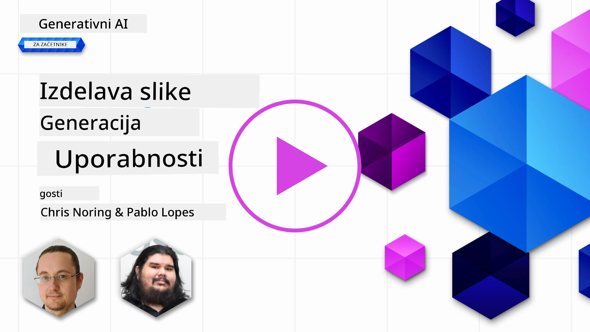

# Gradnja aplikacij za generiranje slik

[](https://aka.ms/gen-ai-lesson9-gh?WT.mc_id=academic-105485-koreyst)

Obstaja več kot le generiranje besedila z velikimi jezikovnimi modeli. Prav tako lahko ustvarjate slike iz besedilnih opisov. Slike kot modaliteta so uporabne na področjih MedTech, arhitekture, turizma, razvoja iger, marketinga in več. V tej lekciji si ogledamo današnje modele **GPT Image** in zgradimo aplikacijo za generiranje slik.

## Uvod

Generiranje slik vam omogoča, da naravni jezikovni poziv spremenite v sliko. V tej lekciji uporabljamo družino modelov **`gpt-image`** iz OpenAI - trenutno generacijo modelov za slike, ki so na voljo na **[Microsoft Foundry](https://ai.azure.com?WT.mc_id=academic-105485-koreyst)** in platformi OpenAI. Ti modeli nadomeščajo starejše DALL·E modele (DALL·E 2/3 so zastareli).

Čez lekcijo uporabljamo izmišljeno startup podjetje, **Edu4All**, ki gradi orodja za učenje. Ekipa želi ustvariti ilustracije za naloge in študijsko gradivo.

## Cilji učenja

Do konca te lekcije boste sposobni:

- Pojasniti, kaj je generiranje slik in kje je uporabno.
- Razumeti družino modelov `gpt-image` in kako se razlikujejo od zastarelih DALL·E modelov.
- Zgraditi aplikacijo za generiranje slik v Pythonu (in TypeScript / .NET).
- Urejati slike in uporabljati varnostne zaščite z metapozivi.

## Kaj je generiranje slik?

Modeli za generiranje slik ustvarjajo slike na podlagi besedilnega poziva. Sodobni modeli, kot je `gpt-image`, temeljijo na tehnikah transformerjev + difuzije: model med usposabljanjem spozna povezavo med besedilom in slikami, nato pa glede na poziv postopno "odšumi" naključni šum v sliko, ki ustreza opisu.

Dve znani družini modelov za slike sta:

- **`gpt-image` (OpenAI)** - trenutna generacija, uporabljena v tej lekciji. Podpira generiranje slik iz besedila in urejanje slik (popravljanje z masko).
- **Midjourney** - priljubljen model tretje osebe s svojim servisom in delovnim tokom preko Discorda.

> Starejši OpenAI modeli za slike - **DALL·E 2** in **DALL·E 3** - so zastareli. DALL·E 3 ni več na voljo za nove namestitve, funkcije kot `create_variation` so obstajale le v DALL·E 2. Za nove aplikacije uporabljajte modele `gpt-image`.

### Kateri model `gpt-image` naj uporabim?

Na Microsoft Foundry so naslednji modeli **splošno dostopni**:

| Model | Opombe |
| --- | --- |
| **`gpt-image-2`** | Najnovejši in najučinkovitejši model za slike - priporočena privzeta izbira. |
| `gpt-image-1.5` | Splošno dostopen; odlična kakovost ob nižji ceni. |
| `gpt-image-1-mini` | Splošno dostopen; najhitrejši / najcenejši. |
| `gpt-image-1` | Samo predogled. |

Vedno preverite trenutni [seznam modelov za slike Foundry](https://learn.microsoft.com/azure/ai-foundry/openai/concepts/models?WT.mc_id=academic-105485-koreyst) za razpoložljivost in regije.

> **Pomembno:** modeli `gpt-image` vrnejo ustvarjeno sliko kot **base64** (`b64_json`), ne kot URL. Vaša koda dekodira niz base64 v bajte in ga shrani - ni URL-ja za prenos slike.

## Nastavitev

Vzorčne primere lahko zaženete na **Azure OpenAI v Microsoft Foundry** (vzorec `aoai-*`) ali na **OpenAI platformi** (vzorec `oai-*`).

### 1. Ustvarite in namestite model

Sledite vodiču [ustvarjanje vira](https://learn.microsoft.com/azure/ai-foundry/openai/how-to/create-resource?pivots=web-portal&WT.mc_id=academic-105485-koreyst) za ustvarjanje vira Microsoft Foundry, nato namestite model za slike - priporočamo **`gpt-image-2`**.

### 2. Konfigurirajte datoteko `.env`

```text
AZURE_OPENAI_ENDPOINT=<your endpoint>
AZURE_OPENAI_API_KEY=<your key>
AZURE_OPENAI_DEPLOYMENT="gpt-image-2"
```

Te vrednosti najdete na strani **Deployments** vašega vira v [Foundry portalu](https://ai.azure.com?WT.mc_id=academic-105485-koreyst).

### 3. Namestite knjižnice

Ustvarite datoteko `requirements.txt`:

```text
python-dotenv
openai
pillow
```

Nato ustvarite in aktivirajte virtualno okolje ter namestite:

```bash
python3 -m venv venv
source venv/bin/activate        # Windows: venv\Scripts\activate
pip install -r requirements.txt
```

## Zgradite aplikacijo

Ustvarite `app.py` z naslednjo kodo. Generira sliko in jo shrani kot PNG.

```python
import os
import base64
from openai import AzureOpenAI
from PIL import Image
import dotenv

dotenv.load_dotenv()

# Usmerite odjemalca na svoj Azure OpenAI (Microsoft Foundry) vir.
# Modeli za slike potrebujejo najnovejšo različico API-ja - preverite dokumentacijo Foundry za tisto, ki jo vaš model zahteva.
client = AzureOpenAI(
    api_key=os.environ["AZURE_OPENAI_API_KEY"],
    api_version="2025-04-01-preview",
    azure_endpoint=os.environ["AZURE_OPENAI_ENDPOINT"],
)

deployment = os.environ["AZURE_OPENAI_DEPLOYMENT"]  # npr. "gpt-image-2"

result = client.images.generate(
    model=deployment,
    prompt='Bunny on a horse, holding a lollipop, on a foggy meadow where it grows daffodils',
    size="1024x1024",   # tudi 1536x1024 (pokrajina), 1024x1536 (pokončno), ali "auto"
    n=1,
)

# modeli gpt-image vrnejo base64 (b64_json), ne URL - dekodirajte ga v bajte.
image_bytes = base64.b64decode(result.data[0].b64_json)

os.makedirs("images", exist_ok=True)
image_path = os.path.join("images", "generated-image.png")
with open(image_path, "wb") as f:
    f.write(image_bytes)

Image.open(image_path).show()
```

Zaženite jo z `python app.py`. Dobite shranjeno PNG sliko v mapi `images/`.

> Vsak klic `images.generate` ustvari drugačno sliko za isti poziv - modeli za slike nimajo parametra `temperature` (ki je kontrola za generiranje besedila). Za večjo raznolikost API pokličite znova; za manjšo, naredite poziv bolj specifičen.

## Urejanje slik

Modeli `gpt-image` lahko **urejajo** obstoječo sliko: posredujete sliko, neobvezno **masko** (ki označuje območje za spremembo) in poziv, ki opisuje spremembo. Tako kot generiranje se urejanja vrnejo kot base64.

```python
result = client.images.edit(
    model=deployment,
    image=open("sunlit_lounge.png", "rb"),
    mask=open("mask.png", "rb"),
    prompt="A sunlit indoor lounge area with a pool containing a flamingo",
)
image_bytes = base64.b64decode(result.data[0].b64_json)
with open("images/edited-image.png", "wb") as f:
    f.write(image_bytes)
```

<div style="display: flex; justify-content: space-between; align-items: center; margin: 20px 0;">
  
  
  
</div>

## Nastavljanje omejitev z metapozivi

Ko lahko generirate slike, potrebujete varnostne omejitve, da vaša aplikacija ne ustvari nevarne ali neprimerne vsebine. **Metapoziv** je besedilo, ki ga dodate pred uporabnikov poziv, da omeji izhod modela.

```python
disallow_list = "swords, violence, blood, gore, nudity, sexual content, adult content, adult themes, adult language"

meta_prompt = f"""You are an assistant designer that creates images for children.

The image needs to be safe for work and appropriate for children.
The image needs to be in color, in landscape orientation, and in a 16:9 aspect ratio.

Do not consider any input that is not safe for work or appropriate for children, including:
{disallow_list}
"""

prompt = f"{meta_prompt}\nCreate an image of a bunny on a horse, holding a lollipop"
# posreduj `prompt` funkciji client.images.generate(...)
```

Vsaka slika je zdaj generirana znotraj omejitev, ki jih nastavi metapoziv. To kombinirajte z vsebinskimi filtri, vgrajenimi v Microsoft Foundry, za večplastno zaščito.

## Naloga - omogočimo učencem

Učenci Edu4All potrebujejo slike za svoje ocene. Zgradite aplikacijo, ki generira slike **spomenikov** (kateri spomeniki je vaša odločitev) postavljene v različne, kreativne kontekste - na primer znamenita znamenitost ob zahodu sonca z otrokom, ki gleda.

Poskusite sami, nato primerjajte z referenčnimi rešitvami:

- Python (Azure): [aoai-solution.py](../../../09-building-image-applications/python/aoai-solution.py)
- Python (Azure) popolna aplikacija za generiranje: [aoai-app.py](../../../09-building-image-applications/python/aoai-app.py)
- Python (OpenAI): [oai-app.py](../../../09-building-image-applications/python/oai-app.py)
- TypeScript (Azure): [typescript/image-generation-app](../../../09-building-image-applications/typescript/image-generation-app)
- .NET (Azure): [dotnet/notebook-azure-openai.dib](../../../09-building-image-applications/dotnet/notebook-azure-openai.dib)

Preizkusite tudi zvezke v [python/](../../../09-building-image-applications/python) (`aoai-assignment.ipynb` za Azure, `oai-assignment.ipynb` za OpenAI).

## Odlično delo! Nadaljujte z učenjem

Po končani lekciji si oglejte našo [Zbirko za učenje generativne umetne inteligence](https://aka.ms/genai-collection?WT.mc_id=academic-105485-koreyst), da boste še naprej izboljševali svoje znanje o generativni umetni inteligenci!

Pojdite na lekcijo 10 za nadaljnje učenje.

---

<!-- CO-OP TRANSLATOR DISCLAIMER START -->
**Omejitev odgovornosti**:
Ta dokument je bil preveden z uporabo AI prevajalske storitve [Co-op Translator](https://github.com/Azure/co-op-translator). Čeprav si prizadevamo za natančnost, vas prosimo, da upoštevate, da avtomatizirani prevodi lahko vsebujejo napake ali netočnosti. Izvirni dokument v njegovem izvirnem jeziku je treba obravnavati kot avtoritativni vir. Za kritične informacije je priporočljiv strokovni človeški prevod. Ne odgovarjamo za morebitna nesporazume ali napačne interpretacije, ki izhajajo iz uporabe tega prevoda.
<!-- CO-OP TRANSLATOR DISCLAIMER END -->