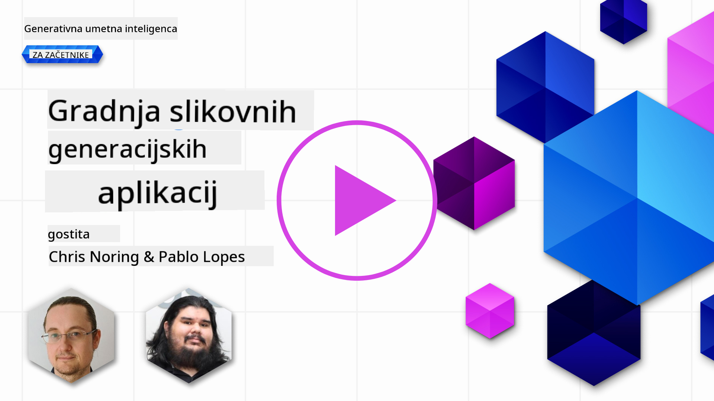

<!--
CO_OP_TRANSLATOR_METADATA:
{
  "original_hash": "ef74ad58fc01f7ad80788f79505f9816",
  "translation_date": "2025-08-26T19:52:46+00:00",
  "source_file": "09-building-image-applications/README.md",
  "language_code": "sl"
}
-->
# Gradnja aplikacij za generiranje slik

[](https://aka.ms/gen-ai-lesson9-gh?WT.mc_id=academic-105485-koreyst)

LLM-ji niso uporabni le za generiranje besedil. Iz besedilnih opisov je mogoče ustvariti tudi slike. Slike kot modaliteta so lahko izjemno uporabne na številnih področjih, kot so medicinska tehnologija, arhitektura, turizem, razvoj iger in še več. V tem poglavju si bomo ogledali dva najbolj priljubljena modela za generiranje slik: DALL-E in Midjourney.

## Uvod

V tej lekciji bomo obravnavali:

- Generiranje slik in zakaj je to uporabno.
- DALL-E in Midjourney, kaj sta in kako delujeta.
- Kako zgraditi aplikacijo za generiranje slik.

## Cilji učenja

Po zaključku te lekcije boste znali:

- Zgraditi aplikacijo za generiranje slik.
- Določiti meje za svojo aplikacijo z meta pozivi.
- Delati z DALL-E in Midjourney.

## Zakaj graditi aplikacijo za generiranje slik?

Aplikacije za generiranje slik so odličen način za raziskovanje zmogljivosti generativne umetne inteligence. Uporabljajo se lahko na primer za:

- **Urejanje in sintezo slik**. Lahko ustvarjate slike za različne primere uporabe, kot so urejanje ali sinteza slik.

- **Uporaba v različnih panogah**. Uporabljajo se lahko za ustvarjanje slik za različne industrije, kot so medicinska tehnologija, turizem, razvoj iger in še več.

## Scenarij: Edu4All

V tej lekciji bomo nadaljevali delo z našim zagonskim podjetjem Edu4All. Učenci bodo ustvarjali slike za svoje naloge – katere slike bodo izbrali, je prepuščeno njim. Lahko so ilustracije za njihovo pravljico, nov lik za njihovo zgodbo ali pomoč pri vizualizaciji njihovih idej in konceptov.

Tako bi lahko na primer učenci Edu4All ustvarili naslednjo sliko, če pri pouku obravnavajo spomenike:


z uporabo poziva, kot je

> "Pes poleg Eifflovega stolpa v zgodnjem jutranjem soncu"

## Kaj sta DALL-E in Midjourney?

[DALL-E](https://openai.com/dall-e-2?WT.mc_id=academic-105485-koreyst) in [Midjourney](https://www.midjourney.com/?WT.mc_id=academic-105485-koreyst) sta dva izmed najbolj priljubljenih modelov za generiranje slik, ki omogočata ustvarjanje slik na podlagi pozivov.

### DALL-E

Začnimo z DALL-E, ki je generativni AI model za ustvarjanje slik iz besedilnih opisov.

> [DALL-E je kombinacija dveh modelov, CLIP in difuzne pozornosti](https://towardsdatascience.com/openais-dall-e-and-clip-101-a-brief-introduction-3a4367280d4e?WT.mc_id=academic-105485-koreyst).

- **CLIP** je model, ki iz slik in besedil ustvarja vdelave, torej numerične predstavitve podatkov.

- **Difuzna pozornost** je model, ki iz vdelav generira slike. DALL-E je izurjen na zbirki slik in besedil ter omogoča ustvarjanje slik iz besedilnih opisov. Na primer, DALL-E lahko ustvari sliko mačke s klobukom ali psa z irokezo.

### Midjourney

Midjourney deluje podobno kot DALL-E – slike ustvarja na podlagi besedilnih pozivov. Midjourney lahko uporabite za generiranje slik s pozivi, kot so “mačka s klobukom” ali “pes z irokezo”.


_Slika: Wikipedia, ustvarjena z Midjourney_

## Kako delujeta DALL-E in Midjourney

Najprej [DALL-E](https://arxiv.org/pdf/2102.12092.pdf?WT.mc_id=academic-105485-koreyst). DALL-E je generativni AI model, ki temelji na arhitekturi transformerjev z _avtoregresivnim transformerjem_.

_Avtoregresivni transformer_ določa, kako model iz besedilnih opisov generira slike – ustvarja jih piksel za pikslom in pri tem uporablja že ustvarjene piksle za generiranje naslednjega. Slika nastaja skozi več plasti nevronske mreže, dokler ni dokončana.

S tem postopkom DALL-E nadzoruje atribute, predmete, značilnosti in še več v ustvarjeni sliki. DALL-E 2 in 3 pa omogočata še več nadzora nad končno sliko.

## Gradnja prve aplikacije za generiranje slik

Kaj potrebujete za izdelavo aplikacije za generiranje slik? Potrebovali boste naslednje knjižnice:

- **python-dotenv** – priporočamo uporabo te knjižnice za shranjevanje skrivnosti v datoteko _.env_ ločeno od kode.
- **openai** – s to knjižnico boste komunicirali z OpenAI API.
- **pillow** – za delo s slikami v Pythonu.
- **requests** – za izvajanje HTTP zahtevkov.

## Ustvarite in namestite Azure OpenAI model

Če tega še niste storili, sledite navodilom na strani [Microsoft Learn](https://learn.microsoft.com/azure/ai-foundry/openai/how-to/create-resource?pivots=web-portal)
za ustvarjanje Azure OpenAI vira in modela. Izberite model DALL-E 3.  

## Ustvarite aplikacijo

1. Ustvarite datoteko _.env_ z naslednjo vsebino:

   ```text
   AZURE_OPENAI_ENDPOINT=<your endpoint>
   AZURE_OPENAI_API_KEY=<your key>
   AZURE_OPENAI_DEPLOYMENT="dall-e-3"
   ```

   Te podatke najdete v Azure OpenAI Foundry Portalu za vaš vir v razdelku "Deployments".

1. Zberite zgoraj omenjene knjižnice v datoteko _requirements.txt_ takole:

   ```text
   python-dotenv
   openai
   pillow
   requests
   ```

1. Nato ustvarite virtualno okolje in namestite knjižnice:

   ```bash
   python3 -m venv venv
   source venv/bin/activate
   pip install -r requirements.txt
   ```

   Za Windows uporabite naslednje ukaze za ustvarjanje in aktivacijo virtualnega okolja:

   ```bash
   python3 -m venv venv
   venv\Scripts\activate.bat
   ```

1. Dodajte naslednjo kodo v datoteko _app.py_:

    ```python
    import openai
    import os
    import requests
    from PIL import Image
    import dotenv
    from openai import OpenAI, AzureOpenAI
    
    # import dotenv
    dotenv.load_dotenv()
    
    # configure Azure OpenAI service client 
    client = AzureOpenAI(
      azure_endpoint = os.environ["AZURE_OPENAI_ENDPOINT"],
      api_key=os.environ['AZURE_OPENAI_API_KEY'],
      api_version = "2024-02-01"
      )
    try:
        # Create an image by using the image generation API
        generation_response = client.images.generate(
                                prompt='Bunny on horse, holding a lollipop, on a foggy meadow where it grows daffodils',
                                size='1024x1024', n=1,
                                model=os.environ['AZURE_OPENAI_DEPLOYMENT']
                              )

        # Set the directory for the stored image
        image_dir = os.path.join(os.curdir, 'images')

        # If the directory doesn't exist, create it
        if not os.path.isdir(image_dir):
            os.mkdir(image_dir)

        # Initialize the image path (note the filetype should be png)
        image_path = os.path.join(image_dir, 'generated-image.png')

        # Retrieve the generated image
        image_url = generation_response.data[0].url  # extract image URL from response
        generated_image = requests.get(image_url).content  # download the image
        with open(image_path, "wb") as image_file:
            image_file.write(generated_image)

        # Display the image in the default image viewer
        image = Image.open(image_path)
        image.show()

    # catch exceptions
    except openai.InvalidRequestError as err:
        print(err)
   ```

Pojasnimo to kodo:

- Najprej uvozimo potrebne knjižnice, vključno z OpenAI, dotenv, requests in Pillow.

  ```python
  import openai
  import os
  import requests
  from PIL import Image
  import dotenv
  ```

- Nato naložimo okoljske spremenljivke iz datoteke _.env_.

  ```python
  # import dotenv
  dotenv.load_dotenv()
  ```

- Nato konfiguriramo odjemalca Azure OpenAI storitve

  ```python
  # Get endpoint and key from environment variables
  client = AzureOpenAI(
      azure_endpoint = os.environ["AZURE_OPENAI_ENDPOINT"],
      api_key=os.environ['AZURE_OPENAI_API_KEY'],
      api_version = "2024-02-01"
      )
  ```

- Nato generiramo sliko:

  ```python
  # Create an image by using the image generation API
  generation_response = client.images.generate(
                        prompt='Bunny on horse, holding a lollipop, on a foggy meadow where it grows daffodils',
                        size='1024x1024', n=1,
                        model=os.environ['AZURE_OPENAI_DEPLOYMENT']
                      )
  ```

  Zgornja koda vrne JSON objekt, ki vsebuje URL ustvarjene slike. Ta URL lahko uporabimo za prenos slike in shranjevanje v datoteko.

- Na koncu odpremo sliko in jo prikažemo s privzetim pregledovalnikom slik:

  ```python
  image = Image.open(image_path)
  image.show()
  ```

### Več podrobnosti o generiranju slike

Podrobneje si oglejmo kodo, ki generira sliko:

    ```python
      generation_response = client.images.generate(
                                prompt='Bunny on horse, holding a lollipop, on a foggy meadow where it grows daffodils',
                                size='1024x1024', n=1,
                                model=os.environ['AZURE_OPENAI_DEPLOYMENT']
                            )
    ```

- **prompt** je besedilni poziv, ki se uporabi za generiranje slike. V tem primeru uporabimo poziv "Zajček na konju, drži liziko, na megleni jasi, kjer rastejo narcise".
- **size** je velikost ustvarjene slike. V tem primeru ustvarimo sliko velikosti 1024x1024 pikslov.
- **n** je število ustvarjenih slik. V tem primeru ustvarimo dve sliki.
- **temperature** je parameter, ki določa naključnost izhoda generativnega AI modela. Temperatura je vrednost med 0 in 1, kjer 0 pomeni determinističen izhod, 1 pa popolnoma naključen. Privzeta vrednost je 0,7.

V naslednjem razdelku bomo obravnavali še več možnosti dela s slikami.

## Dodatne zmožnosti generiranja slik

Videli ste, kako lahko s par vrsticami v Pythonu ustvarite sliko. Vendar pa lahko s slikami naredite še več.

Lahko tudi:

- **Urejate slike**. Če zagotovite obstoječo sliko, masko in poziv, lahko sliko spremenite. Na primer, lahko dodate nekaj na določen del slike. Predstavljajte si našo sliko zajčka – lahko mu dodate klobuk. To storite tako, da zagotovite sliko, masko (ki določa del slike za spremembo) in besedilni poziv, ki opiše želeno spremembo.
> Opomba: to ni podprto v DALL-E 3.
 
Tukaj je primer z uporabo GPT Image:

    ```python
    response = client.images.edit(
        model="gpt-image-1",
        image=open("sunlit_lounge.png", "rb"),
        mask=open("mask.png", "rb"),
        prompt="A sunlit indoor lounge area with a pool containing a flamingo"
    )
    image_url = response.data[0].url
    ```

  Osnovna slika prikazuje le salon z bazenom, končna slika pa ima dodanega flaminga:

<div style="display: flex; justify-content: space-between; align-items: center; margin: 20px 0;">
  
  
  
</div>


- **Ustvarjate variacije**. Ideja je, da vzamete obstoječo sliko in ustvarite njene različice. Za to zagotovite sliko, besedilni poziv in kodo, kot je:

  ```python
  response = openai.Image.create_variation(
    image=open("bunny-lollipop.png", "rb"),
    n=1,
    size="1024x1024"
  )
  image_url = response['data'][0]['url']
  ```

  > Opomba: to je podprto le v OpenAI

## Temperatura

Temperatura je parameter, ki določa naključnost izhoda generativnega AI modela. Temperatura je vrednost med 0 in 1, kjer 0 pomeni determinističen izhod, 1 pa popolnoma naključen. Privzeta vrednost je 0,7.

Poglejmo primer, kako deluje temperatura, tako da dvakrat zaženemo ta poziv:

> Poziv: "Zajček na konju, drži liziko, na megleni jasi, kjer rastejo narcise"


Zdaj zaženimo isti poziv še enkrat in opazujmo, da ne dobimo dvakrat enake slike:


Kot vidite, sta si sliki podobni, a nista enaki. Poskusimo spremeniti vrednost temperature na 0,1 in poglejmo, kaj se zgodi:

```python
 generation_response = client.images.create(
        prompt='Bunny on horse, holding a lollipop, on a foggy meadow where it grows daffodils',    # Enter your prompt text here
        size='1024x1024',
        n=2
    )
```

### Spreminjanje temperature

Poskusimo narediti izhod bolj determinističen. Pri prvih dveh slikah smo opazili, da je na prvi sliki zajček, na drugi pa konj, torej se slike precej razlikujejo.

Zato spremenimo kodo in nastavimo temperaturo na 0, takole:

```python
generation_response = client.images.create(
        prompt='Bunny on horse, holding a lollipop, on a foggy meadow where it grows daffodils',    # Enter your prompt text here
        size='1024x1024',
        n=2,
        temperature=0
    )
```

Ko zaženete to kodo, dobite ti dve sliki:

- 
- 

Tukaj jasno vidite, da sta si sliki veliko bolj podobni.

## Kako določiti meje za svojo aplikacijo z metapozivi

Z našo demo aplikacijo lahko že ustvarjamo slike za stranke. Vendar moramo določiti nekatere meje za našo aplikacijo.

Na primer, nočemo ustvarjati slik, ki niso primerne za delo ali otroke.

To lahko dosežemo z _metapozivi_. Metapozivi so besedilni pozivi, ki jih uporabimo za nadzor izhoda generativnega AI modela. Z njimi lahko na primer zagotovimo, da so ustvarjene slike primerne za delo ali otroke.

### Kako delujejo?

Kako torej delujejo metapozivi?

Metapozivi so besedilni pozivi, ki jih uporabimo za nadzor izhoda generativnega AI modela. Postavimo jih pred glavni besedilni poziv in z njimi nadzorujemo izhod modela. V aplikacijah jih vgradimo tako, da združimo uporabniški poziv in metapoziv v en sam besedilni poziv.

Primer metapoziva bi bil:

```text
You are an assistant designer that creates images for children.

The image needs to be safe for work and appropriate for children.

The image needs to be in color.

The image needs to be in landscape orientation.

The image needs to be in a 16:9 aspect ratio.

Do not consider any input from the following that is not safe for work or appropriate for children.

(Input)

```

Poglejmo, kako lahko uporabimo metapozive v naši demo aplikaciji.

```python
disallow_list = "swords, violence, blood, gore, nudity, sexual content, adult content, adult themes, adult language, adult humor, adult jokes, adult situations, adult"

meta_prompt =f"""You are an assistant designer that creates images for children.

The image needs to be safe for work and appropriate for children.

The image needs to be in color.

The image needs to be in landscape orientation.

The image needs to be in a 16:9 aspect ratio.

Do not consider any input from the following that is not safe for work or appropriate for children.
{disallow_list}
"""

prompt = f"{meta_prompt}
Create an image of a bunny on a horse, holding a lollipop"

# TODO add request to generate image
```

Iz zgornjega poziva je razvidno, da vse ustvarjene slike upoštevajo metapoziv.

## Naloga – omogočimo učencem ustvarjanje

Na začetku lekcije smo predstavili Edu4All. Zdaj je čas, da učencem omogočimo ustvarjanje slik za njihove naloge.

Učenci bodo ustvarili slike za svoje naloge, ki vsebujejo spomenike – katere spomenike bodo izbrali, je prepuščeno njim. Učenci naj uporabijo svojo ustvarjalnost in postavijo te spomenike v različna okolja.

## Rešitev

Tukaj je ena izmed možnih rešitev:

```python
import openai
import os
import requests
from PIL import Image
import dotenv
from openai import AzureOpenAI
# import dotenv
dotenv.load_dotenv()

# Get endpoint and key from environment variables
client = AzureOpenAI(
  azure_endpoint = os.environ["AZURE_OPENAI_ENDPOINT"],
  api_key=os.environ['AZURE_OPENAI_API_KEY'],
  api_version = "2024-02-01"
  )


disallow_list = "swords, violence, blood, gore, nudity, sexual content, adult content, adult themes, adult language, adult humor, adult jokes, adult situations, adult"

meta_prompt = f"""You are an assistant designer that creates images for children.

The image needs to be safe for work and appropriate for children.

The image needs to be in color.

The image needs to be in landscape orientation.

The image needs to be in a 16:9 aspect ratio.

Do not consider any input from the following that is not safe for work or appropriate for children.
{disallow_list}
"""

prompt = f"""{meta_prompt}
Generate monument of the Arc of Triumph in Paris, France, in the evening light with a small child holding a Teddy looks on.
""""

try:
    # Create an image by using the image generation API
    generation_response = client.images.generate(
        prompt=prompt,    # Enter your prompt text here
        size='1024x1024',
        n=1,
    )
    # Set the directory for the stored image
    image_dir = os.path.join(os.curdir, 'images')

    # If the directory doesn't exist, create it
    if not os.path.isdir(image_dir):
        os.mkdir(image_dir)

    # Initialize the image path (note the filetype should be png)
    image_path = os.path.join(image_dir, 'generated-image.png')

    # Retrieve the generated image
    image_url = generation_response.data[0].url  # extract image URL from response
    generated_image = requests.get(image_url).content  # download the image
    with open(image_path, "wb") as image_file:
        image_file.write(generated_image)

    # Display the image in the default image viewer
    image = Image.open(image_path)
    image.show()

# catch exceptions
except openai.BadRequestError as err:
    print(err)
```

## Odlično opravljeno! Nadaljujte z učenjem
Ko končate s to lekcijo, si oglejte našo [zbirko za učenje generativne umetne inteligence](https://aka.ms/genai-collection?WT.mc_id=academic-105485-koreyst) in še naprej nadgrajujte svoje znanje o generativni umetni inteligenci!

Nadaljujte na 10. lekcijo, kjer si bomo ogledali, kako [graditi AI aplikacije z malo kode](../10-building-low-code-ai-applications/README.md?WT.mc_id=academic-105485-koreyst)

---

**Izjava o omejitvi odgovornosti**:
Ta dokument je bil preveden s pomočjo storitve AI prevajanja [Co-op Translator](https://github.com/Azure/co-op-translator). Čeprav si prizadevamo za natančnost, vas prosimo, da se zavedate, da lahko avtomatski prevodi vsebujejo napake ali netočnosti. Izvirni dokument v svojem maternem jeziku naj velja za avtoritativni vir. Za kritične informacije priporočamo strokovni človeški prevod. Ne prevzemamo odgovornosti za morebitne nesporazume ali napačne razlage, ki bi izhajale iz uporabe tega prevoda.