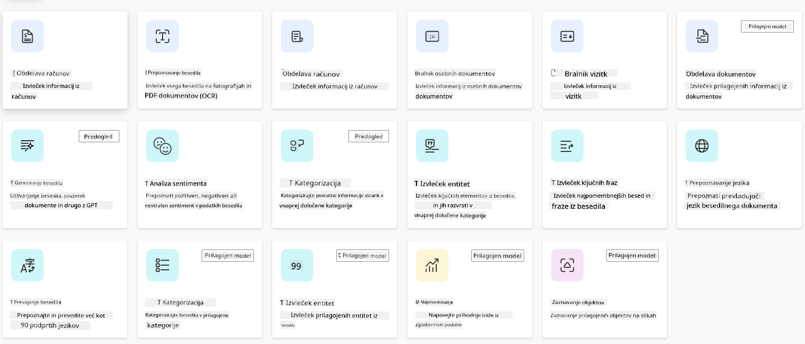
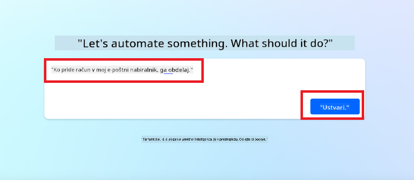
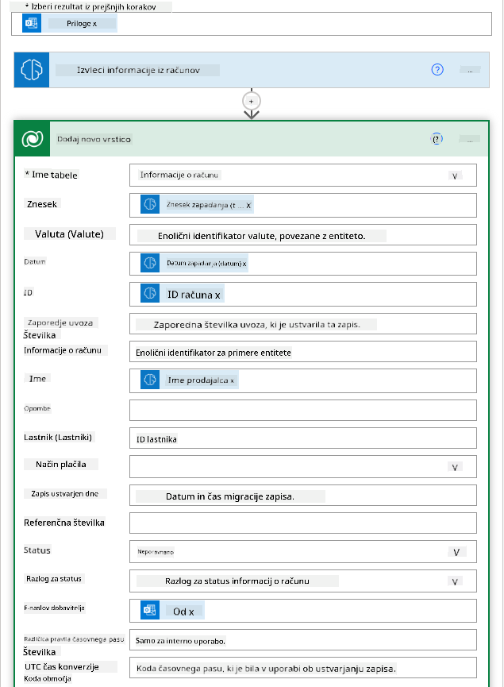
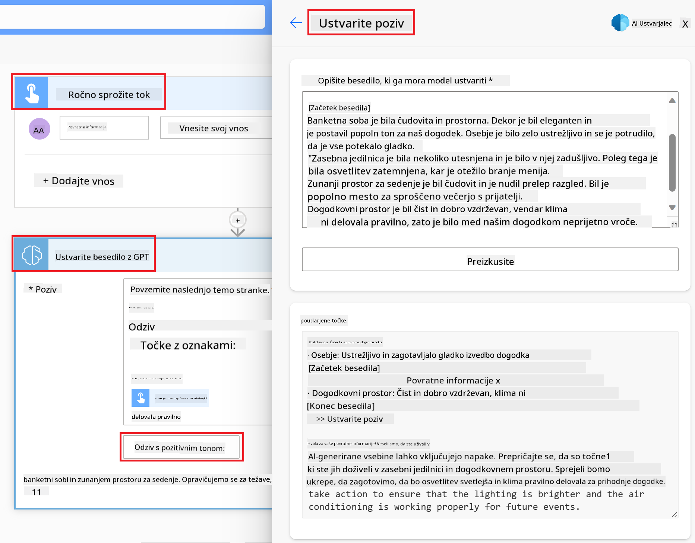

<!--
CO_OP_TRANSLATOR_METADATA:
{
  "original_hash": "f5ff3b6204a695a117d6f452403c95f7",
  "translation_date": "2025-05-19T21:16:15+00:00",
  "source_file": "10-building-low-code-ai-applications/README.md",
  "language_code": "sl"
}
-->
# Izgradnja aplikacij AI z malo kode

## Uvod

Sedaj, ko smo se naučili, kako graditi aplikacije za generiranje slik, se pogovorimo o malo kode. Generativni AI se lahko uporablja na različnih področjih, vključno z malo kode, toda kaj je malo kode in kako lahko dodamo AI?

Izgradnja aplikacij in rešitev je postala lažja za tradicionalne razvijalce in ne-razvijalce s pomočjo platform za razvoj z malo kode. Platforme za razvoj z malo kode omogočajo gradnjo aplikacij in rešitev z malo ali brez kode. To se doseže z zagotavljanjem vizualnega razvojnega okolja, ki omogoča povleci in spusti komponente za gradnjo aplikacij in rešitev. To omogoča hitrejšo gradnjo aplikacij in rešitev z manj viri. V tej lekciji se poglobimo v uporabo malo kode in kako izboljšati razvoj z malo kode z AI z uporabo Power Platforme.

Power Platform organizacijam omogoča, da svojim ekipam omogočijo gradnjo lastnih rešitev prek intuitivnega okolja z malo kode ali brez kode. To okolje pomaga poenostaviti proces gradnje rešitev. Z Power Platform lahko rešitve zgradimo v dneh ali tednih namesto mesecev ali let. Power Platform sestavlja pet ključnih produktov: Power Apps, Power Automate, Power BI, Power Pages in Copilot Studio.

Ta lekcija pokriva:

- Uvod v Generativni AI v Power Platform
- Uvod v Copilot in kako ga uporabljati
- Uporaba Generativnega AI za gradnjo aplikacij in tokov v Power Platform
- Razumevanje AI modelov v Power Platform z AI Builder

## Cilji učenja

Do konca te lekcije boste lahko:

- Razumeli, kako Copilot deluje v Power Platform.

- Zgradili aplikacijo za sledenje nalog študentov za naš izobraževalni startup.

- Zgradili tok za obdelavo računov, ki uporablja AI za ekstrakcijo informacij iz računov.

- Uporabili najboljše prakse pri uporabi modela AI za ustvarjanje besedila z GPT.

Orodja in tehnologije, ki jih boste uporabili v tej lekciji so:

- **Power Apps**, za aplikacijo za sledenje nalog študentov, ki zagotavlja okolje za razvoj z malo kode za gradnjo aplikacij za sledenje, upravljanje in interakcijo z podatki.

- **Dataverse**, za shranjevanje podatkov za aplikacijo za sledenje nalog študentov, kjer Dataverse zagotavlja platformo za podatke z malo kode za shranjevanje podatkov aplikacije.

- **Power Automate**, za tok obdelave računov, kjer boste imeli okolje za razvoj z malo kode za gradnjo tokov za avtomatizacijo procesa obdelave računov.

- **AI Builder**, za model AI za obdelavo računov, kjer boste uporabili predgrajene modele AI za obdelavo računov za naš startup.

## Generativni AI v Power Platform

Izboljšanje razvoja z malo kode in aplikacij z generativnim AI je ključno področje osredotočenosti za Power Platform. Cilj je omogočiti vsem, da gradijo aplikacije, spletne strani, nadzorne plošče in avtomatizirajo procese z AI, _brez zahtevanega znanja o podatkovni znanosti_. Ta cilj se doseže z integracijo generativnega AI v izkušnjo razvoja z malo kode v Power Platform v obliki Copilot in AI Builder.

### Kako to deluje?

Copilot je AI asistent, ki vam omogoča gradnjo rešitev Power Platform z opisovanjem vaših zahtev v seriji pogovornih korakov z uporabo naravnega jezika. Na primer, lahko naročite svojemu AI asistentu, da navede, katera polja bo vaša aplikacija uporabljala, in bo ustvarila tako aplikacijo kot tudi podlagi podatkovni model ali pa lahko določite, kako nastaviti tok v Power Automate.

Funkcionalnosti, ki jih poganja Copilot, lahko uporabite kot funkcijo v zaslonih vaše aplikacije, da omogočite uporabnikom odkrivanje vpogledov prek pogovornih interakcij.

AI Builder je zmožnost AI z malo kode, ki je na voljo v Power Platform, ki vam omogoča uporabo AI modelov, da vam pomagajo avtomatizirati procese in napovedati rezultate. Z AI Builder lahko prinesete AI v vaše aplikacije in tokove, ki se povezujejo z vašimi podatki v Dataverse ali v različnih virih podatkov v oblaku, kot so SharePoint, OneDrive ali Azure.

Copilot je na voljo v vseh produktih Power Platform: Power Apps, Power Automate, Power BI, Power Pages in Power Virtual Agents. AI Builder je na voljo v Power Apps in Power Automate. V tej lekciji se bomo osredotočili na uporabo Copilot in AI Builder v Power Apps in Power Automate za gradnjo rešitve za naš izobraževalni startup.

### Copilot v Power Apps

Kot del Power Platform, Power Apps zagotavlja okolje za razvoj z malo kode za gradnjo aplikacij za sledenje, upravljanje in interakcijo z podatki. To je zbirka storitev za razvoj aplikacij z razširljivo platformo podatkov in zmožnostjo povezovanja z storitvami v oblaku in lokalnimi podatki. Power Apps omogoča gradnjo aplikacij, ki tečejo v brskalnikih, tablicah in telefonih ter jih je mogoče deliti s sodelavci. Power Apps uporabnikom olajša vstop v razvoj aplikacij s preprostim vmesnikom, tako da lahko vsak poslovni uporabnik ali profesionalni razvijalec gradi prilagojene aplikacije. Izkušnja razvoja aplikacij je tudi izboljšana z Generativnim AI prek Copilot.

Funkcija AI asistenta Copilot v Power Apps vam omogoča opisovanje, kakšno vrsto aplikacije potrebujete in katere informacije želite, da vaša aplikacija sledi, zbira ali prikazuje. Copilot nato generira odzivno Canvas aplikacijo na podlagi vašega opisa. Nato lahko aplikacijo prilagodite svojim potrebam. AI Copilot tudi generira in predlaga Dataverse tabelo s polji, ki jih potrebujete za shranjevanje podatkov, ki jih želite slediti, ter nekaj vzorčnih podatkov. Kasneje v tej lekciji bomo pogledali, kaj je Dataverse in kako ga lahko uporabite v Power Apps. Nato lahko tabelo prilagodite svojim potrebam z uporabo funkcije AI Copilot asistenta prek pogovornih korakov. Ta funkcija je na voljo na domačem zaslonu Power Apps.

### Copilot v Power Automate

Kot del Power Platform, Power Automate omogoča uporabnikom ustvarjanje avtomatiziranih tokov med aplikacijami in storitvami. Pomaga avtomatizirati ponavljajoče se poslovne procese, kot so komunikacija, zbiranje podatkov in odobritve odločitev. Njegov preprost vmesnik omogoča uporabnikom z vsakim tehničnim znanjem (od začetnikov do izkušenih razvijalcev) avtomatizacijo delovnih nalog. Izkušnja razvoja tokov je tudi izboljšana z Generativnim AI prek Copilot.

Funkcija AI asistenta Copilot v Power Automate vam omogoča opisovanje, kakšno vrsto toka potrebujete in katere akcije želite, da vaš tok izvede. Copilot nato generira tok na podlagi vašega opisa. Nato lahko tok prilagodite svojim potrebam. AI Copilot tudi generira in predlaga akcije, ki jih potrebujete za izvedbo naloge, ki jo želite avtomatizirati. Kasneje v tej lekciji bomo pogledali, kaj so tokovi in kako jih lahko uporabite v Power Automate. Nato lahko akcije prilagodite svojim potrebam z uporabo funkcije AI Copilot asistenta prek pogovornih korakov. Ta funkcija je na voljo na domačem zaslonu Power Automate.

## Naloga: Upravljanje študentskih nalog in računov za naš startup z uporabo Copilot

Naš startup ponuja spletne tečaje študentom. Startup je hitro rasel in sedaj se trudi slediti povpraševanju po svojih tečajih. Startup vas je zaposlil kot razvijalca Power Platform, da jim pomagate zgraditi rešitev z malo kode, ki jim bo pomagala upravljati študentske naloge in račune. Njihova rešitev bi morala omogočiti sledenje in upravljanje študentskih nalog prek aplikacije ter avtomatizirati proces obdelave računov prek toka. Od vas je bilo zahtevano, da uporabite Generativni AI za razvoj rešitve.

Ko začnete uporabljati Copilot, lahko uporabite [Knjižnico pozivov Copilot Power Platform](https://github.com/pnp/powerplatform-prompts?WT.mc_id=academic-109639-somelezediko) za začetek s pozivi. Ta knjižnica vsebuje seznam pozivov, ki jih lahko uporabite za gradnjo aplikacij in tokov s Copilot. Pozive v knjižnici lahko uporabite tudi za pridobitev ideje, kako opisati vaše zahteve Copilot.

### Zgradite aplikacijo za sledenje študentskih nalog za naš startup

Izobraževalci v našem startupu se trudijo slediti študentskim nalogam. Uporabljali so preglednico za sledenje nalogam, vendar je to postalo težko obvladljivo, saj se je število študentov povečalo. Prosili so vas, da zgradite aplikacijo, ki jim bo pomagala slediti in upravljati študentske naloge. Aplikacija bi morala omogočati dodajanje novih nalog, ogled nalog, posodabljanje nalog in brisanje nalog. Aplikacija bi morala tudi omogočati izobraževalcem in študentom ogled nalog, ki so bile ocenjene in tistih, ki niso bile ocenjene.

Aplikacijo boste zgradili z uporabo Copilot v Power Apps po naslednjih korakih:

1. Pojdite na domači zaslon [Power Apps](https://make.powerapps.com?WT.mc_id=academic-105485-koreyst).

1. Uporabite besedilno polje na domačem zaslonu za opis aplikacije, ki jo želite zgraditi. Na primer, **_Želim zgraditi aplikacijo za sledenje in upravljanje študentskih nalog_**. Kliknite na gumb **Pošlji**, da pošljete poziv AI Copilot.

1. AI Copilot bo predlagal Dataverse tabelo s polji, ki jih potrebujete za shranjevanje podatkov, ki jih želite slediti, ter nekaj vzorčnih podatkov. Nato lahko tabelo prilagodite svojim potrebam z uporabo funkcije AI Copilot asistenta prek pogovornih korakov.

1. Izobraževalci želijo pošiljati e-pošto študentom, ki so oddali svoje naloge, da jih obveščajo o napredku njihovih nalog. Copilot lahko uporabite za dodajanje novega polja v tabelo za shranjevanje e-pošte študentov. Na primer, lahko uporabite naslednji poziv za dodajanje novega polja v tabelo: **_Želim dodati stolpec za shranjevanje e-pošte študentov_**. Kliknite na gumb **Pošlji**, da pošljete poziv AI Copilot.

1. AI Copilot bo generiral novo polje in nato lahko polje prilagodite svojim potrebam.

1. Ko končate s tabelo, kliknite na gumb **Ustvari aplikacijo**, da ustvarite aplikacijo.

1. AI Copilot bo generiral odzivno Canvas aplikacijo na podlagi vašega opisa. Nato lahko aplikacijo prilagodite svojim potrebam.

1. Da izobraževalci pošiljajo e-pošto študentom, lahko uporabite Copilot za dodajanje novega zaslona v aplikacijo. Na primer, lahko uporabite naslednji poziv za dodajanje novega zaslona v aplikacijo: **_Želim dodati zaslon za pošiljanje e-pošte študentom_**. Kliknite na gumb **Pošlji**, da pošljete poziv AI Copilot.

1. AI Copilot bo generiral nov zaslon in nato lahko zaslon prilagodite svojim potrebam.

1. Ko končate z aplikacijo, kliknite na gumb **Shrani**, da shranite aplikacijo.

1. Da delite aplikacijo z izobraževalci, kliknite na gumb **Deli** in nato ponovno kliknite na gumb **Deli**. Nato lahko delite aplikacijo z izobraževalci tako, da vnesete njihove e-poštne naslove.

> **Vaša domača naloga**: Aplikacija, ki ste jo pravkar zgradili, je dober začetek, vendar jo je mogoče izboljšati. Z funkcijo e-pošte lahko izobraževalci pošiljajo e-pošto študentom le ročno, tako da morajo vnesti njihove e-poštne naslove. Ali lahko uporabite Copilot za gradnjo avtomatizacije, ki bo izobraževalcem omogočila samodejno pošiljanje e-pošte študentom, ko oddajo svoje naloge? Vaša namig je, da z ustreznim pozivom lahko uporabite Copilot v Power Automate za to.

### Zgradite tabelo informacij o računih za naš startup

Finančna ekipa našega startupa se trudi slediti računom. Uporabljali so preglednico za sledenje računom, vendar je to postalo težko obvladljivo, saj se je število računov povečalo. Prosili so vas, da zgradite tabelo, ki jim bo pomagala shraniti, slediti in upravljati informacije o prejetih računih. Tabela bi morala biti uporabljena za gradnjo avtomatizacije, ki bo izvlekla vse informacije o računih in jih shranila v tabelo. Tabela bi morala tudi omogočati finančni ekipi ogled računov, ki so bili plačani in tistih, ki niso bili plačani.

Power Platform ima podlagi podatkovno platformo, imenovano Dataverse, ki vam omogoča shranjevanje podatkov za vaše aplikacije in rešitve. Dataverse zagotavlja platformo za podatke z malo kode za shranjevanje podatkov aplikacije. To je popolnoma upravljana storitev, ki varno shranjuje podatke v Microsoft Cloud in je zagotovljena znotraj vašega okolja Power Platform. Vključuje vgrajene zmožnosti upravljanja podatkov, kot so klasifikacija podatkov, izvor podatkov, natančno nadzorovan dostop in več. Več o [Dataverse lahko izveste tukaj](https://docs.microsoft.com/powerapps/maker/data-platform/data-platform-intro?WT.mc_id=academic-109639-somelezediko).

Zakaj bi morali uporabiti Dataverse za naš startup? Standardne in prilagojene tabele znotraj Dataverse zagotavljajo varno in na oblaku temelječo možnost shranjevanja za vaše podatke. Tabele vam omogočajo shranjevanje različnih vrst podatkov, podobno kot bi uporabili več delovnih listov v enem Excelovem delovnem zvezku. Tabele lahko uporabite za shranjevanje podatkov, ki so specifični za vaše organizacijske ali poslovne potrebe. Nekatere koristi, ki jih bo naš startup dobil z uporabo Dataverse, vključujejo, vendar niso omejene na:

- **Enostavno upravljanje**: Tako metapodatki kot podatki so shranjeni v oblaku, zato vam ni treba skrbeti za podrobnosti o tem, kako so shranjeni ali upravljani. Lahko se osredotočite na gradnjo svojih aplikacij in rešitev.

- **Varno**: Dataverse zagotavlja varno in na oblaku temelječo možnost shranjevanja za vaše podatke. Lahko nadzorujete, kdo ima dostop do podatkov v vaših tabelah in kako jih lahko dostopajo z uporabo varnosti na podlagi vlog.

- **Bogati metapodatki**: Tipi podatkov in odnosi se uporabljajo neposredno znotraj Power Apps.

- **Logika in validacija**: Lahko uporabite poslovna pravila, izračunana polja in validacijska pravila za uveljavljanje poslovne logike in ohranjanje natančnosti podatkov.

Sedaj, ko veste, kaj je Dataverse in zakaj bi ga morali uporabiti, si poglejmo, kako lahko uporabite Copilot za ustvarjanje tabele v Dataverse, da izpolnite zahteve naše finančne ekipe.

> **Opomba**: To tabelo boste uporabili v naslednjem razdelku za gradnjo avtomatizacije, ki bo izvlekla vse informacije o računih in jih shranila v tabelo. Da ustvarite tabelo v Dataverse z uporabo Copilot, sledite spodnjim korakom: 1. Pojdite na domači zaslon [Power Apps](https://make.powerapps.com?WT.mc_id=academic-105485-koreyst). 2. Na levi navigacijski vrstici izberite **Tabele** in nato kliknite na **Opis nove tabele**. 1. Na zaslonu **Opis nove tabele** uporabite besedilno polje za opis tabele, ki jo želite ustvariti. Na primer, **_Želim ustvariti tabelo za shranjevanje informacij o računih_**. Kliknite na gumb **Pošlji**, da pošljete poziv AI Copilot. 1. AI Copilot bo predlagal Dataverse tabelo s polji, ki jih potrebujete za shranjevanje podatkov, ki jih želite slediti, ter nekaj vzorčnih podatkov. Nato lahko tabelo prilagodite svojim potrebam z uporabo funkcije AI Copilot asistenta prek pogovornih korakov. 1. Finančna ekipa želi poslati e-pošto dobavitelju, da ga obvesti o trenutnem stanju njegovega računa. Copilot lahko uporabite za dodajanje novega polja v tabelo za shran
a besedilo. - **Analiza sentimenta**: Ta model zazna pozitivne, negativne, nevtralne ali mešane občutke v besedilu. - **Branje poslovnih vizitk**: Ta model izloči informacije iz poslovnih vizitk. - **Prepoznavanje besedila**: Ta model izloči besedilo iz slik. - **Prepoznavanje objektov**: Ta model zazna in izloči objekte iz slik. - **Obdelava dokumentov**: Ta model izloči informacije iz obrazcev. - **Obdelava računov**: Ta model izloči informacije iz računov. S prilagojenimi modeli AI lahko svoj model vključite v AI Builder, da deluje kot katerikoli prilagojen model AI Builder, kar vam omogoča, da model trenirate z lastnimi podatki. Te modele lahko uporabite za avtomatizacijo procesov in napovedovanje rezultatov v Power Apps in Power Automate. Pri uporabi lastnega modela obstajajo omejitve. Več o teh [omejitvah](https://learn.microsoft.com/ai-builder/byo-model#limitations?WT.mc_id=academic-105485-koreyst) si lahko preberete. 

## Naloga #2 - Zgradite tok obdelave računov za naš startup

Finančna ekipa ima težave pri obdelavi računov. Uporabljali so preglednico za spremljanje računov, vendar je to postalo težko obvladljivo, saj se je število računov povečalo. Prosili so vas, da zgradite delovni tok, ki jim bo pomagal pri obdelavi računov z uporabo AI. Delovni tok naj jim omogoči, da izločijo informacije iz računov in jih shranijo v tabelo Dataverse. Delovni tok naj jim tudi omogoči, da pošljejo e-pošto finančni ekipi z izločenimi informacijami.

Sedaj, ko veste, kaj je AI Builder in zakaj ga morate uporabljati, poglejmo, kako lahko uporabite AI Model za obdelavo računov v AI Builderju, ki smo ga obravnavali prej, za izgradnjo delovnega toka, ki bo pomagal finančni ekipi obdelati račune.

Da zgradite delovni tok, ki bo finančni ekipi pomagal obdelati račune z uporabo AI Modela za obdelavo računov v AI Builderju, sledite spodnjim korakom:

1. Pojdite na domači zaslon [Power Automate](https://make.powerautomate.com?WT.mc_id=academic-105485-koreyst).
2. Uporabite besedilno polje na domačem zaslonu za opis delovnega toka, ki ga želite zgraditi. Na primer, **_Obdelaj račun, ko prispe v moj poštni predal_**. Kliknite gumb **Pošlji**, da pošljete zahtevo AI Copilotu. 
3. AI Copilot bo predlagal dejanja, ki jih morate opraviti za nalogo, ki jo želite avtomatizirati. Kliknite na gumb **Naprej**, da nadaljujete z naslednjimi koraki.
4. V naslednjem koraku vas bo Power Automate pozval, da nastavite povezave, potrebne za tok. Ko končate, kliknite na gumb **Ustvari tok**, da ustvarite tok.
5. AI Copilot bo ustvaril tok, ki ga lahko nato prilagodite svojim potrebam.
6. Posodobite sprožilec toka in nastavite **Mapo** na mapo, kjer bodo shranjeni računi. Na primer, lahko nastavite mapo na **Prejeto**. Kliknite na **Prikaži napredne možnosti** in nastavite **Samo s priponkami** na **Da**. To bo zagotovilo, da se tok zažene samo, ko v mapo prispe e-pošta s priponko.
7. Odstranite naslednja dejanja iz toka: **HTML v besedilo**, **Sestavi**, **Sestavi 2**, **Sestavi 3** in **Sestavi 4**, ker jih ne boste uporabljali.
8. Odstranite dejanje **Pogoj** iz toka, ker ga ne boste uporabljali. Videti bi moralo kot na naslednjem posnetku zaslona: 
9. Kliknite na gumb **Dodaj dejanje** in poiščite **Dataverse**. Izberite dejanje **Dodaj novo vrstico**.
10. Pri dejanju **Izloči informacije iz računov** posodobite **Datoteko računa**, da kaže na **Vsebino priponke** iz e-pošte. To bo zagotovilo, da tok izloči informacije iz priponke računa.
11. Izberite **Tabela**, ki ste jo ustvarili prej. Na primer, lahko izberete tabelo **Informacije o računu**. Izberite dinamično vsebino iz prejšnjega dejanja, da zapolnite naslednja polja:
    - ID
    - Znesek
    - Datum
    - Ime
    - Status
    - Nastavite **Status** na **V obdelavi**.
    - E-pošta dobavitelja
    - Uporabite **Od** dinamično vsebino iz sprožilca **Ko prispe nova e-pošta**. 
12. Ko končate s tokom, kliknite na gumb **Shrani**, da shranite tok. Nato lahko preizkusite tok tako, da pošljete e-pošto z računom v mapo, ki ste jo določili v sprožilcu.

> **Vaša domača naloga**: Tok, ki ste ga pravkar zgradili, je dober začetek, zdaj morate razmisliti, kako lahko zgradite avtomatizacijo, ki bo omogočila naši finančni ekipi, da pošlje e-pošto dobavitelju, da ga obvesti o trenutnem statusu njihovega računa. Vaš namig: tok mora teči, ko se status računa spremeni.

## Uporaba modela AI za generiranje besedila v Power Automate

Model Ustvari besedilo z GPT v AI Builderju vam omogoča generiranje besedila na podlagi zahteve in ga poganja Microsoft Azure OpenAI storitev. S to zmogljivostjo lahko vključite GPT (Generative Pre-Trained Transformer) tehnologijo v svoje aplikacije in tokove, da zgradite različne avtomatizirane tokove in vpogledne aplikacije.

GPT modeli se obsežno trenirajo na ogromnih količinah podatkov, kar jim omogoča, da proizvajajo besedilo, ki tesno posnema človeški jezik, ko jim je podana zahteva. Ko so integrirani z avtomatizacijo delovnih tokov, se modeli AI, kot je GPT, lahko izkoristijo za poenostavitev in avtomatizacijo širokega spektra nalog.

Na primer, lahko zgradite tokove za samodejno generiranje besedila za različne primere uporabe, kot so: osnutki e-poštnih sporočil, opisi izdelkov in še več. Model lahko uporabite tudi za generiranje besedila za različne aplikacije, kot so klepetalni roboti in aplikacije za podporo strankam, ki omogočajo agentom za podporo strankam, da se učinkovito in učinkovito odzovejo na poizvedbe strank.

Da se naučite, kako uporabiti ta AI model v Power Automate, preberite modul [Dodajte inteligenco z AI Builderjem in GPT](https://learn.microsoft.com/training/modules/ai-builder-text-generation/?WT.mc_id=academic-109639-somelezediko).

## Odlično delo! Nadaljujte z učenjem

Po zaključku te lekcije si oglejte našo [Zbirko učenja generativne AI](https://aka.ms/genai-collection?WT.mc_id=academic-105485-koreyst), da nadaljujete z nadgrajevanjem svojega znanja o generativni AI!

Pojdite na Lekcijo 11, kjer bomo pogledali, kako [integrirati generativno AI s klicem funkcij](../11-integrating-with-function-calling/README.md?WT.mc_id=academic-105485-koreyst)!

**Omejitev odgovornosti**: 
Ta dokument je bil preveden s pomočjo storitve za prevajanje z umetno inteligenco [Co-op Translator](https://github.com/Azure/co-op-translator). Čeprav si prizadevamo za natančnost, vas prosimo, da upoštevate, da lahko avtomatizirani prevodi vsebujejo napake ali netočnosti. Izvirni dokument v njegovem maternem jeziku je treba obravnavati kot avtoritativni vir. Za ključne informacije priporočamo strokovni prevod s strani človeka. Ne odgovarjamo za morebitne nesporazume ali napačne razlage, ki bi nastale zaradi uporabe tega prevoda.