# Izdelava AI aplikacij z nizko kodo

[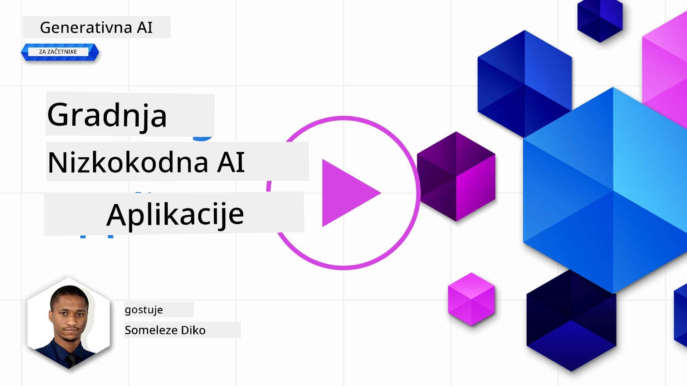](https://youtu.be/1vzq3Nd8GBA?si=h6LHWJXdmqf6mhDg)

> _(Kliknite zgornjo sliko, da si ogledate video te lekcije)_

## Uvod

Zdaj, ko smo se naučili, kako ustvarjati aplikacije za generiranje slik, pa se pogovorimo o nizki kodi. Generativna AI se lahko uporablja na različnih področjih, vključno z nizko kodo, ampak kaj pravzaprav je nizka koda in kako lahko vanjo vključimo AI?

Izdelava aplikacij in rešitev je postala lažja tako za tradicionalne razvijalce kot tudi za nerazvijalce, zahvaljujoč platformam za razvoj z nizko kodo. Platforme za razvoj z nizko kodo omogočajo izdelavo aplikacij in rešitev z malo ali nič kode. To se doseže z zagotovitvijo vizualnega razvojnega okolja, ki omogoča povleci in spusti komponente za izdelavo aplikacij in rešitev. Tako lahko aplikacije in rešitve izdelate hitreje in z manjšimi viri. V tej lekciji bomo poglobili, kako uporabljati nizko kodo in kako jo izboljšati z AI z uporabo Power Platform.

Power Platform organizacijam ponuja priložnost, da opolnomočijo svoje ekipe za izdelavo lastnih rešitev v intuitivnem okolju z nizko ali brez kode. To okolje poenostavi proces izdelave rešitev. Z Power Platform lahko rešitve izdelamo v nekaj dneh ali tednih namesto v mesecih ali letih. Power Platform sestavlja pet ključnih izdelkov: Power Apps, Power Automate, Power BI, Power Pages in Copilot Studio.

Ta lekcija zajema:

- Uvod v generativno AI v Power Platform
- Uvod v Copilot in kako ga uporabljati
- Uporabo generativne AI za izdelavo aplikacij in tokov v Power Platform
- Razumevanje AI modelov v Power Platform z AI Builder
- Izdelavo inteligentnih agentov z Microsoft Copilot Studio

## Cilji učenja

Do konca te lekcije boste lahko:

- Razumeli, kako Copilot deluje v Power Platform.

- Izdelali aplikacijo za spremljanje študijskih nalog za naš startup v izobraževanju.

- Izdelali tok za obdelavo računov, ki uporablja AI za izvleček informacij iz računov.

- Uporabili najboljše prakse pri uporabi AI modela Create Text z GPT.

- Razumeli, kaj je Microsoft Copilot Studio in kako z njim izdelati inteligentne agente.

Orodja in tehnologije, ki jih boste uporabljali v tej lekciji, so:

- **Power Apps**, za aplikacijo za spremljanje študijskih nalog, ki zagotavlja razvojno okolje z nizko kodo za izdelavo aplikacij za sledenje, upravljanje in interakcijo s podatki.

- **Dataverse**, za shranjevanje podatkov aplikacije za spremljanje študijskih nalog, kjer Dataverse nudi podatkovno platformo z nizko kodo za shranjevanje podatkov aplikacije.

- **Power Automate**, za tok obdelave računov, kjer boste imeli razvojno okolje z nizko kodo za izdelavo potekov dela za avtomatizacijo procesa obdelave računov.

- **AI Builder**, za AI model obdelave računov, kjer boste uporabljali vnaprej izdelane AI modele za obdelavo računov za naš startup.

## Generativna AI v Power Platform

Izboljšanje razvoja z nizko kodo in aplikacij z generativno AI je ključno področje fokusa za Power Platform. Cilj je omogočiti vsakomur izdelavo aplikacij, spletnih strani, nadzornih plošč in avtomatizacijo procesov z AI, _brez potrebnega strokovnega znanja iz podatkovne znanosti_. Ta cilj se doseže z integracijo generativne AI v razvojno izkušnjo z nizko kodo v Power Platform v obliki Copilota in AI Builder.

### Kako to deluje?

Copilot je AI pomočnik, ki omogoča izdelavo rešitev v Power Platformu z opisovanjem vaših zahtev v seriji pogovornih korakov z naravnim jezikom. Na primer, lahko vašemu AI pomočniku naročite, katere polja bo vaša aplikacija uporabljala in ustvari tako aplikacijo kot tudi osnovni podatkovni model, ali pa specifično določite, kako nastaviti tok v Power Automate.

Copilot lahko uporabite kot funkcijo na zaslonih aplikacije, da omogočite uporabnikom odkrivanje vpogledov preko pogovornih interakcij.

AI Builder je zmogljivost AI z nizko kodo, ki je na voljo v Power Platform in omogoča uporabo AI modelov za pomoč pri avtomatizaciji procesov in napovedovanju rezultatov. Z AI Builderjem lahko AI vnesete v svoje aplikacije in tokove, ki se povezujejo s podatki v Dataverse ali različnih oblačnih podatkovnih virih, kot so SharePoint, OneDrive ali Azure.

Copilot je na voljo v vseh izdelkih Power Platform: Power Apps, Power Automate, Power BI, Power Pages in Copilot Studio (prej Power Virtual Agents). AI Builder je na voljo v Power Apps in Power Automate. V tej lekciji se bomo osredotočili na uporabo Copilota in AI Builderja v Power Apps in Power Automate za izdelavo rešitve za naš startup v izobraževanju.

### Copilot v Power Apps

Kot del Power Platform, Power Apps zagotavlja razvojno okolje z nizko kodo za izdelavo aplikacij za sledenje, upravljanje in interakcijo s podatki. Gre za nabor storitev za razvoj aplikacij z razširljivo podatkovno platformo in možnostjo povezovanja z oblačnimi storitvami in lokalnimi podatki. Power Apps omogoča izdelavo aplikacij, ki delujejo na brskalnikih, tablicah in telefonih ter jih je možno deliti s sodelavci. Power Apps uporabnikom olajša razvoj aplikacij z enostavnim vmesnikom, tako da lahko vsak poslovni uporabnik ali izkušen razvijalec izdeluje prilagojene aplikacije. Razvojna izkušnja aplikacij je dodatno izboljšana z generativno AI preko Copilota.

Funkcija AI pomočnika Copilota v Power Apps vam omogoča opis, kakšno aplikacijo potrebujete in katere informacije naj aplikacija spremlja, zbira ali prikazuje. Copilot nato generira odzivno aplikacijo Canvas na podlagi vašega opisa. Nato lahko aplikacijo prilagodite svojim potrebam. AI Copilot prav tako ustvari in predlaga tabelo Dataverse s polji, ki jih potrebujete za shranjevanje podatkov, ki jih želite slediti, skupaj z nekaj vzorčnimi podatki. Kasneje v tej lekciji si bomo ogledali, kaj je Dataverse in kako ga lahko uporabite v Power Apps. Nato lahko tabelo prilagodite svojim potrebam z uporabo funkcije asistenta AI Copilot skozi pogovorne korake. Ta funkcija je takoj na voljo z domačega zaslona Power Apps.

### Copilot v Power Automate

Kot del Power Platform, Power Automate omogoča uporabnikom ustvarjanje avtomatiziranih potekov dela med aplikacijami in storitvami. Pomaga avtomatizirati ponavljajoče se poslovne procese, kot so komunikacija, zbiranje podatkov in odobritve odločitev. Njegov preprost vmesnik omogoča uporabnikom vseh tehničnih nivojev (od začetnikov do izkušenih razvijalcev) avtomatizacijo delovnih nalog. Izkušnja razvoja potekov dela je prav tako izboljšana z generativno AI preko Copilota.

Funkcija AI pomočnika Copilota v Power Automate vam omogoča opis, kakšen tok potrebujete in katere akcije naj vaš tok izvede. Copilot nato generira potek na podlagi vašega opisa. Nato lahko potek prilagodite svojim potrebam. AI Copilot prav tako ustvari in predlaga akcije, ki jih potrebujete za izvedbo naloge, ki jo želite avtomatizirati. Kasneje v tej lekciji si bomo ogledali, kaj so tokovi in kako jih lahko uporabljate v Power Automate. Nato lahko prilagodite akcije svojim potrebam z uporabo funkcije asistenta AI Copilot skozi pogovorne korake. Ta funkcija je takoj na voljo z domačega zaslona Power Automate.

## Izdelava inteligentnih agentov z Microsoft Copilot Studio

[Microsoft Copilot Studio](https://learn.microsoft.com/microsoft-copilot-studio/fundamentals-what-is-copilot-studio?WT.mc_id=academic-105485-koreyst) (prej Power Virtual Agents) je član Power Platform z nizko kodo za izdelavo **AI agentov** — pogovornih copilotov, ki lahko odgovarjajo na vprašanja, izvajajo akcije in avtomatizirajo naloge v imenu vaših uporabnikov. Tako kot ostali del Power Platform, te agente ustvarjate v vizualnem okolju, usmerjenem v naravni jezik: opisujete, kaj želite, da agent počne, Copilot Studio pa pomaga sestaviti njegove navodila, znanje in akcije.

Za naš startup v izobraževanju lahko izdelate agenta, ki odgovarja na študentska vprašanja o tečajih, preverja roke oddaje nalog in celo pošilja e-pošto inštruktorju — vse brez pisanja kode.

Tukaj je nekaj najnovejših zmožnosti, ki naredijo Copilot Studio močan:

- **Generativni odgovori iz vašega znanja**. Namesto da ročno izdelujete vsak pogovor, lahko povežete **viri znanja** — javne spletne strani, SharePoint, OneDrive, Dataverse, naložene datoteke ali podatke podjetja prek konektorjev — agent pa generira utemeljene odgovore iz njih.

- **Generativna orkestracija**. Namesto da se zanaša na strogo določene sprožilne fraze, agent uporablja AI za razumevanje zahteve in dinamično določa, katero znanje, teme in akcije združiti za izpolnitev te zahteve, vključno z združevanjem več korakov skupaj.

- **Akcije in konektorji**. Agenti lahko *nastopajo*, ne samo klepetajo. Agentu lahko daste akcije, podprte z več kot 1.500 vnaprej izdelanimi konektorji Power Platform, Power Automate tokovi, prilagojenimi REST API-ji, povpraševanji ali strežniki **Model Context Protocol (MCP)**.

- **Avtonomni agenti**. Agenti niso omejeni na odzivanje v oknu klepeta. Lahko izdelate **avtonomne agente**, ki jih sprožijo dogodki — kot je nov e-mail, nov zapis v Dataverse ali naložena datoteka — in nato delujejo v ozadju za dokončanje naloge.

- **Orkestracija več agentov**. Agenti lahko kličejo druge agente. Agent Copilot Studio lahko prenese delo drugim agentom ali jih razširi, tudi agente, objavljene v Microsoft 365 Copilot ter agente, zgrajene v Microsoft Foundry.

- **Izbira modela**. Poleg vgrajenih modelov lahko pripeljete modele iz kataloga modelov Microsoft Foundry, da prilagodite, kako vaš agent razmišlja in odgovarja.

- **Objava kjerkoli**. Ko je agent izdelan, ga lahko objavite na več kanalih — Microsoft Teams, Microsoft 365 Copilot, spletno stran ali prilagojeno aplikacijo in še več — z upravljanjem varnosti, avtentikacije in analitike prek upravljalske izkušnje Power Platform.

Začeti lahko izdelovati svojega prvega agenta na [copilotstudio.microsoft.com](https://copilotstudio.microsoft.com?WT.mc_id=academic-105485-koreyst) in se naučite več v [Microsoft Copilot Studio dokumentaciji](https://learn.microsoft.com/microsoft-copilot-studio/?WT.mc_id=academic-105485-koreyst).

## Naloga: Upravljanje študentskih nalog in računov za naš startup z uporabo Copilota

Naš startup ponuja spletne tečaje študentom. Startup hitro raste in zdaj težko dohaja povpraševanje po svojih tečajih. Najeli so vas kot razvijalca Power Platform, da jim pomagate izdelati rešitev z nizko kodo za upravljanje študentskih nalog in računov. Njihova rešitev naj omogoča sledenje in upravljanje študentskih nalog preko aplikacije ter avtomatizacijo procesa obdelave računov preko toka dela. Prosili so vas, da za razvoj rešitve uporabite generativno AI.

Ko začnete z uporabo Copilota, lahko uporabite [Power Platform Copilot Prompt Library](https://github.com/pnp/powerplatform-prompts?WT.mc_id=academic-109639-somelezediko) za začetek z okviri za pozive. Ta knjižnica vsebuje seznam pozivov, ki jih lahko uporabite za izdelavo aplikacij in tokov s Copilotom. Knjižnica vam lahko tudi pomaga dobiti idejo, kako opisati zahteve Copilotu.

### Izdelajte aplikacijo za spremljanje študijskih nalog za naš startup

Izobraževalci v našem startupu so imeli težave s sledenjem študentskih nalog. Za sledenje so uporabljali preglednico, vendar je bilo to z naraščajočim številom študentov težko obvladovati. Prosili so vas, da izdelate aplikacijo, ki jim bo pomagala slediti in upravljati študentske naloge. Aplikacija mora omogočati dodajanje novih nalog, ogled nalog, posodabljanje nalog in brisanje nalog. Prav tako mora omogočati izobraževalcem in študentom ogled nalog, ki so bile ocenjene, in tistih, ki še niso bile ocenjene.

Aplikacijo boste izdelali z uporabo Copilota v Power Apps z naslednjimi koraki:

1. Pomaknite se na domači zaslon [Power Apps](https://make.powerapps.com?WT.mc_id=academic-105485-koreyst).

1. Na domačem zaslonu uporabite besedilno polje za opis aplikacije, ki jo želite izdelati. Na primer, **_Želim izdelati aplikacijo za sledenje in upravljanje študentskih nalog_**. Kliknite gumb **Pošlji**, da pošljete poziv AI Copilotu.

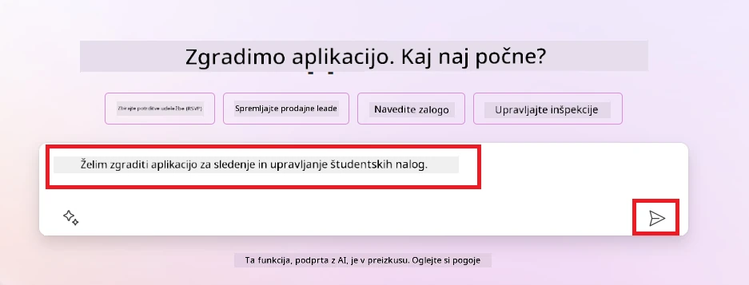

1. AI Copilot bo predlagal tabelo Dataverse s polji, ki jih potrebujete za shranjevanje podatkov, ki jih želite slediti, in nekaj vzorčnih podatkov. Nato lahko tabelo prilagodite svojim potrebam z uporabo funkcije asistenta AI Copilot prek pogovornih korakov.

   > **Pomembno**: Dataverse je osnovna podatkovna platforma za Power Platform. Gre za podatkovno platformo z nizko kodo za shranjevanje podatkov aplikacije. Gre za popolnoma upravljano storitev, ki varno shranjuje podatke v Microsoftu v oblaku in je dodeljena znotraj vašega Power Platform okolja. Vsebuje vgrajene zmogljivosti upravljanja podatkov, kot so klasifikacija podatkov, izvor podatkov, finozrnati nadzor dostopa in več. Več o Dataverse si lahko preberete [tukaj](https://learn.microsoft.com/power-apps/maker/data-platform/data-platform-intro?WT.mc_id=academic-109639-somelezediko).

   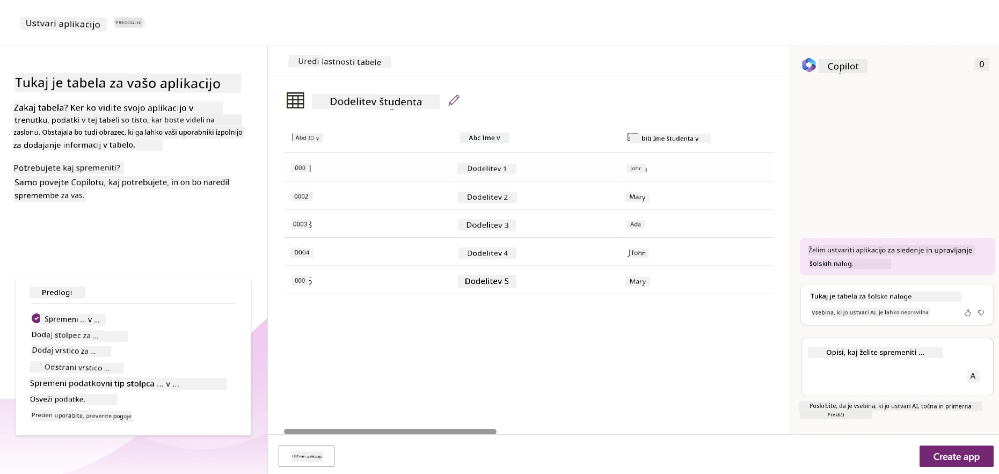

1. Izobraževalci želijo pošiljati e-pošto študentom, ki so oddali svoje naloge, da jih obveščajo o napredku. Copilota lahko uporabite za dodajanje novega polja v tabelo za shranjevanje e-pošte študenta. Na primer, lahko uporabite naslednji poziv za dodajanje novega polja v tabelo: **_Želim dodati stolpec za shranjevanje e-pošte študenta_**. Kliknite gumb **Pošlji**, da pošljete poziv AI Copilotu.

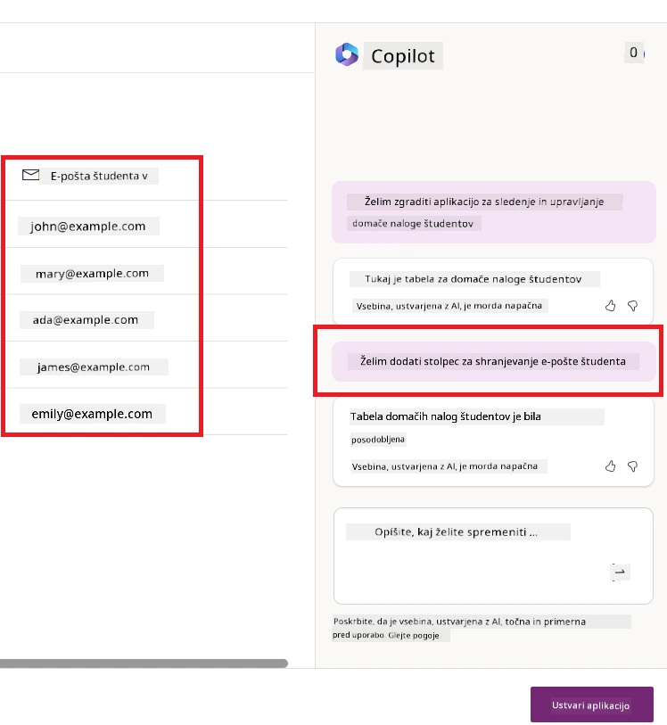

1. AI Copilot bo ustvaril novo polje in nato lahko polje prilagodite svojim potrebam.

1. Ko končate s tabelo, kliknite na gumb **Create app**, da ustvarite aplikacijo.

1. AI Copilot bo ustvaril odzivno Canvas aplikacijo na podlagi vašega opisa. Nato lahko prilagodite aplikacijo svojim potrebam.

1. Za izobraževalce, da lahko pošiljajo e-pošto študentom, lahko uporabite Copilot za dodajanje novega zaslona v aplikacijo. Na primer, lahko uporabite naslednji poziv za dodajanje novega zaslona v aplikacijo: **_Želim dodati zaslon za pošiljanje e-pošte študentom_**. Kliknite gumb **Send**, da pošljete poziv AI Copilotu.

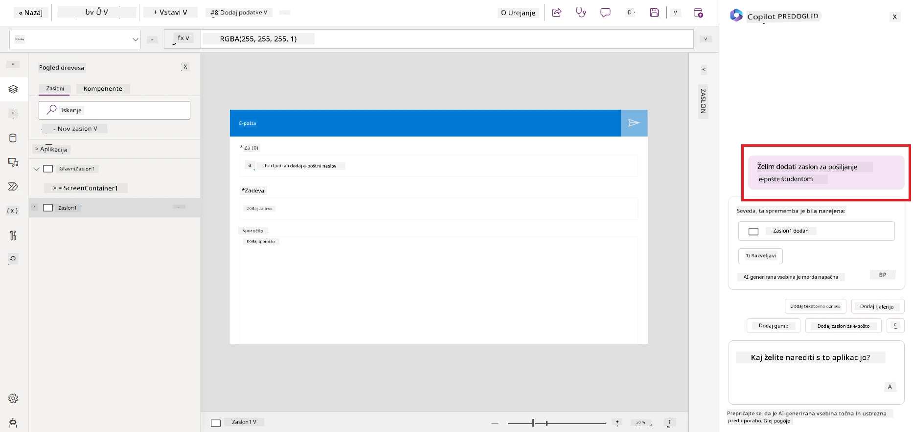

1. AI Copilot bo ustvaril nov zaslon, ki ga lahko nato prilagodite svojim potrebam.

1. Ko končate z aplikacijo, kliknite na gumb **Save**, da shranite aplikacijo.

1. Če želite aplikacijo deliti z izobraževalci, kliknite na gumb **Share** in nato še enkrat na gumb **Share**. Nato lahko aplikacijo delite z izobraževalci tako, da vnesete njihove e-poštne naslove.

> **Vaša domača naloga**: Aplikacija, ki ste jo pravkar ustvarili, je dober začetek, vendar jo je mogoče izboljšati. Z e-poštnim funkcionalnostjo lahko izobraževalci ročno pošiljajo e-pošto študentom, tako da morajo vnesti njihove e-poštne naslove. Ali lahko uporabite Copilot za izdelavo avtomatizacije, ki bo omogočila izobraževalcem samodejno pošiljanje e-pošte študentom, ko oddajo svoje naloge? Namig: z pravim pozivom lahko uporabite Copilot v Power Automate za to.

### Ustvarite tabelo informacij o računih za naš startup

Finančna ekipa našega startupa se je trudila slediti računom. Uporabljali so preglednico za sledenje računov, vendar je to postalo težko upravljati, ker se je število računov povečalo. Prosili so vas, da ustvarite tabelo, ki jim bo pomagala shranjevati, slediti in upravljati informacije o prejetih računih. Tabela naj se uporablja za izdelavo avtomatizacije, ki bo izvlekla vse informacije o računih in jih shranila v tabelo. Tabela naj omogoča tudi finančni ekipi, da si ogleda račune, ki so bili plačani, in tiste, ki niso bili plačani.

Power Platform ima osnovno podatkovno platformo, imenovano Dataverse, ki omogoča shranjevanje podatkov za vaše aplikacije in rešitve. Dataverse zagotavlja podatkovno platformo z malo kode za shranjevanje podatkov aplikacije. To je popolnoma upravljana storitev, ki varno shranjuje podatke v Microsoft Cloud in je nameščena znotraj vašega okolja Power Platform. Ponuja vgrajene zmožnosti upravljanja podatkov, kot so klasifikacija podatkov, sledljivost podatkov, natančen nadzor dostopa in več. Več lahko izveste [o Dataverse tukaj](https://learn.microsoft.com/power-apps/maker/data-platform/data-platform-intro?WT.mc_id=academic-109639-somelezediko).

Zakaj bi za naš startup uporabljali Dataverse? Standardne in prilagojene tabele znotraj Dataverse zagotavljajo varno in oblačno shranjevanje podatkov. Tabele omogočajo shranjevanje različnih vrst podatkov, podobno kot lahko uporabite več delovnih listov v eni Excelovi delovni knjigi. Tabele lahko uporabite za shranjevanje podatkov, ki so specifični za vašo organizacijo ali poslovne potrebe. Nekatere prednosti, ki jih bo naš startup dobil z uporabo Dataverse, vključujejo, vendar niso omejene na:

- **Enostavno za upravljanje**: Tako metapodatki kot podatki so shranjeni v oblaku, zato vam ni treba skrbeti za podrobnosti, kako so shranjeni ali upravljani. Lahko se osredotočite na izdelavo svojih aplikacij in rešitev.

- **Varnostno zavarovano**: Dataverse zagotavlja varno in oblačno shranjevanje vaših podatkov. Nadzorujete lahko, kdo ima dostop do podatkov v vaših tabelah in kako do njih dostopa z uporabo varnosti na osnovi vlog.

- **Bogati metapodatki**: Vrste podatkov in odnosi se uporabljajo neposredno znotraj Power Apps

- **Logika in preverjanje**: Lahko uporabite poslovna pravila, izračunane polja in pravila validacije za izvajanje poslovne logike in ohranjanje natančnosti podatkov.

Zdaj, ko veste, kaj je Dataverse in zakaj ga uporabiti, si poglejmo, kako lahko z uporabo Copilota ustvarite tabelo v Dataverse, ki bo izpolnjevala zahteve naše finančne ekipe.

> **Opomba** : To tabelo boste uporabili v naslednjem razdelku za izdelavo avtomatizacije, ki bo izvlekla vse informacije o računih in jih shranila v tabelo.

Za ustvarjanje tabele v Dataverse z uporabo Copilota sledite spodnjim korakom:

1. Pojdite na začetni zaslon [Power Apps](https://make.powerapps.com?WT.mc_id=academic-105485-koreyst).

2. V levem meniju izberite **Tables** in nato kliknite na **Describe the new Table**.

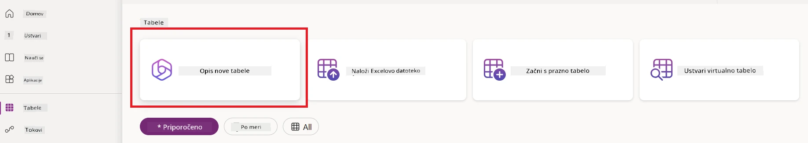

1. Na zaslonu **Describe the new Table** uporabite besedilno polje za opis tabele, ki jo želite ustvariti. Na primer, **_Želim ustvariti tabelo za shranjevanje informacij o računih_**. Kliknite gumb **Send**, da pošljete poziv AI Copilotu.

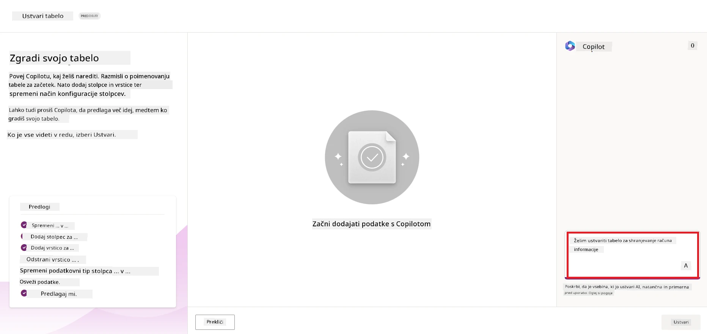

1. AI Copilot bo predlagal Dataverse tabelo s polji, ki jih potrebujete za shranjevanje podatkov, ki jih želite spremljati, in nekaj vzorčnih podatkov. Nato lahko prilagodite tabelo po svojih potrebah s pomočjo asistenta AI Copilota skozi konverzacijske korake.

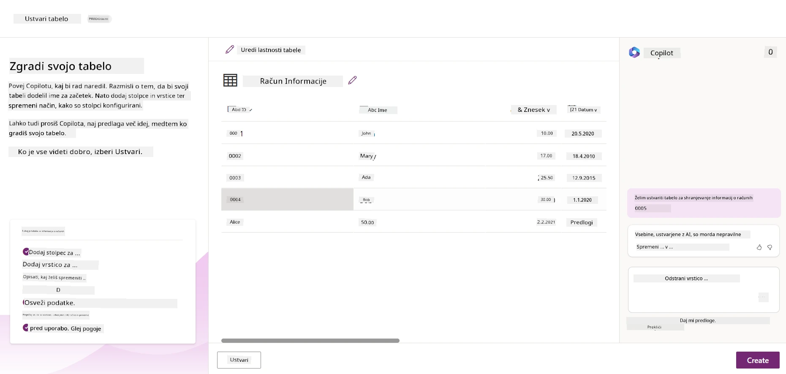

1. Finančna ekipa želi poslati e-pošto dobavitelju, da ga obvesti o trenutnem stanju njihovega računa. Lahko uporabite Copilot za dodajanje novega polja v tabelo za shranjevanje e-poštnega naslova dobavitelja. Na primer, lahko uporabite naslednji poziv za dodajanje novega polja: **_Želim dodati stolpec za shranjevanje e-pošte dobavitelja_**. Kliknite na gumb **Send**, da pošljete poziv AI Copilotu.

1. AI Copilot bo ustvaril novo polje, ki ga lahko nato prilagodite svojim potrebam.

1. Ko končate s tabelo, kliknite gumb **Create**, da ustvarite tabelo.

## AI modeli v Power Platform z AI Builder

AI Builder je zmogljivost z malo kode, ki omogoča uporabo AI modelov za pomoč pri avtomatizaciji procesov in napovedovanju rezultatov. Z AI Builder lahko v svoje aplikacije in tokove vključite AI, ki se poveže na vaše podatke v Dataverse ali v različnih oblačnih vira podatkov, kot so SharePoint, OneDrive ali Azure.

## Vnaprej izdelani AI modeli proti prilagojenim AI modelom

AI Builder ponuja dve vrsti AI modelov: vnaprej izdelane in prilagojene AI modele. Vnaprej izdelani modeli so pripravljeni za uporabo, usposobljeni s strani Microsofta in na voljo v Power Platform. Pomagajo vam dodati inteligenco v vaše aplikacije in tokove brez potrebe po zbiranju podatkov ter gradnji, usposabljanju in objavi lastnih modelov. Te modele lahko uporabite za avtomatizacijo procesov in napovedovanje rezultatov.

Nekateri izmed vnaprej izdelanih AI modelov, ki so na voljo v Power Platform, vključujejo:

- **Izvleček ključnih fraz**: Ta model izvleče ključne fraze iz besedila.
- **Prepoznavanje jezika**: Ta model zazna jezik besedila.
- **Analiza sentimenta**: Ta model zazna pozitiven, negativen, nevtralen ali mešan sentiment v besedilu.
- **Branje vizitk**: Ta model izvleče informacije z vizitk.
- **Prepoznavanje besedila**: Ta model izvleče besedilo iz slik.
- **Zaznavanje predmetov**: Ta model zaznava in izvleče predmete iz slik.
- **Obdelava dokumentov**: Ta model izvlači informacije iz obrazcev.
- **Obdelava računov**: Ta model izvleče informacije iz računov.

Pri prilagojenih AI modelih lahko v AI Builder prinesete svoj model, da deluje kot kateri koli prilagojeni AI model AI Builder, kar vam omogoča treniranje modela z lastnimi podatki. Te modele lahko uporabite za avtomatizacijo procesov in napovedovanje rezultatov tako v Power Apps kot v Power Automate. Pri uporabi lastnega modela veljajo določene omejitve. Preberite več o teh [omejitvah](https://learn.microsoft.com/ai-builder/byo-model#limitations?WT.mc_id=academic-105485-koreyst).

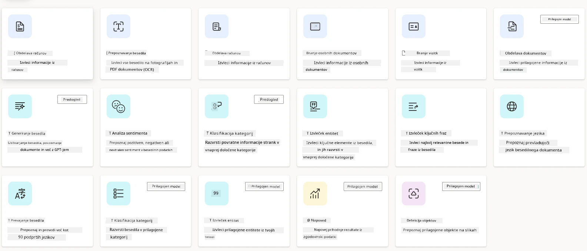

## Naloga #2 - Ustvarite tok za obdelavo računov za naš startup

Finančna ekipa se je trudila procesirati račune. Uporabljali so preglednico za sledenje računov, vendar je to postalo težko upravljati zaradi povečanega števila računov. Prosili so vas, da ustvarite potek dela, ki jim bo pomagal pri obdelavi računov z uporabo AI. Potek dela naj omogoča izvlek informacij iz računov in shranjevanje podatkov v Dataverse tabelo. Prav tako naj jim omogoča pošiljanje e-pošte finančni ekipi z izvlečenimi informacijami.

Zdaj, ko veste, kaj je AI Builder in zakaj ga uporabljati, si poglejmo, kako lahko uporabite AI model za obdelavo računov v AI Builder, ki smo ga prej omenili, za izdelavo poteka dela, ki bo pomagal finančni ekipi pri obdelavi računov.

Za ustvarjanje poteka dela, ki bo finančni ekipi pomagal procesirati račune z AI modelom za obdelavo računov v AI Builder, sledite spodnjim korakom:

1. Pojdite na začetni zaslon [Power Automate](https://make.powerautomate.com?WT.mc_id=academic-105485-koreyst).

2. Uporabite besedilno polje na začetnem zaslonu za opis poteka dela, ki ga želite ustvariti. Na primer, **_Obdelaj račun, ko prispe v moj poštni predal_**. Kliknite gumb **Send**, da pošljete poziv AI Copilotu.

   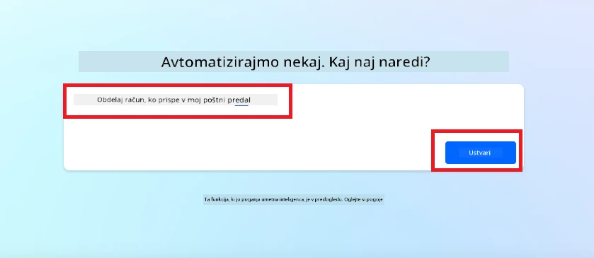

3. AI Copilot bo predlagal dejanja, ki jih morate izvesti za avtomatizacijo naloge. Kliknite gumb **Next**, da nadaljujete skozi naslednje korake.

4. V naslednjem koraku vas bo Power Automate pozval, da nastavite povezave, potrebne za potek. Ko končate, kliknite na gumb **Create flow**, da ustvarite potek.

5. AI Copilot bo ustvaril potek, ki ga lahko nato prilagodite svojim potrebam.

6. Posodobite sprožilec poteka in nastavite **Folder** na mapo, kjer bodo shranjeni računi. Na primer, nastavite mapo na **Inbox**. Kliknite na **Show advanced options** in nastavite **Only with Attachments** na **Yes**. To bo zagotovilo, da bo potek tekel samo, ko bo v mapo prispelo e-sporočilo z priponko.

7. Odstranite naslednja dejanja iz poteka: **HTML to text**, **Compose**, **Compose 2**, **Compose 3** in **Compose 4**, saj jih ne boste uporabljali.

8. Odstranite dejanje **Condition** iz poteka, ker ga ne boste uporabljali. Moralo bi izgledati tako kot na spodnji sliki:

   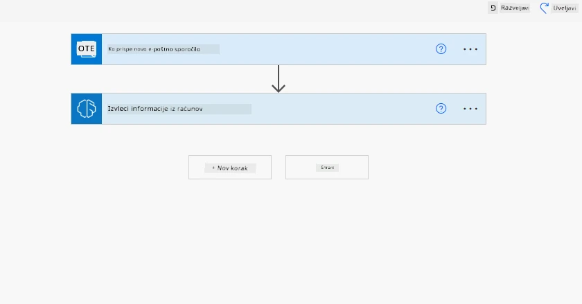

9. Kliknite na gumb **Add an action** in poiščite **Dataverse**. Izberite dejanje **Add a new row**.

10. Pri dejanju **Extract Information from invoices** posodobite polje **Invoice File**, da kaže na **Attachment Content** iz e-pošte. To bo zagotovilo, da potek izvleče informacije iz priponke računa.

11. Izberite **Table**, ki ste jo ustvarili prej. Na primer, lahko izberete tabelo **Invoice Information**. Izberite dinamične vsebine iz prejšnjega dejanja za polnjenje naslednjih polj:

    - ID
    - Znesek
    - Datum
    - Ime
    - Status - Nastavite **Status** na **Pending**.
    - E-pošta dobavitelja - Uporabite dinamično vsebino **From** iz sprožilca **When a new email arrives**.

    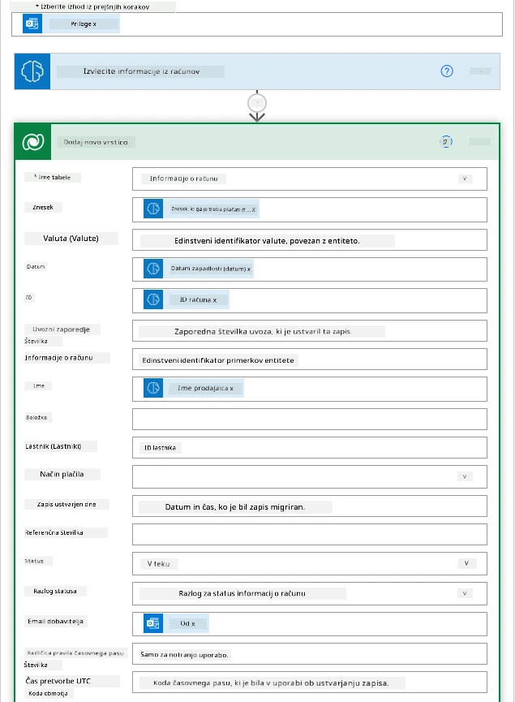

12. Ko končate s tokom, kliknite gumb **Save**, da shranite tok. Nato lahko preizkusite tok tako, da pošljete e-pošto z računom v mapo, ki ste jo določili v sprožilcu.

> **Vaša domača naloga**: Tok, ki ste ga pravkar ustvarili, je dober začetek, zdaj morate razmisliti, kako ustvariti avtomatizacijo, ki bo naši finančni ekipi omogočila pošiljanje e-pošte dobavitelju z obvestilom o trenutnem stanju njihovega računa. Namig: tok mora teči, ko se status računa spremeni.

## Uporaba AI modela za generiranje besedila v Power Automate

AI model Create Text with GPT v AI Builder omogoča generiranje besedila na podlagi poziva in je podprt z Microsoft Azure OpenAI storitvijo. S to zmogljivostjo lahko vključite GPT (Generative Pre-Trained Transformer) tehnologijo v svoje aplikacije in tokove za gradnjo različnih avtomatiziranih tokov in informativnih aplikacij.

GPT modeli so podvrženi obširnemu usposabljanju na velikih količinah podatkov, kar jim omogoča izdelavo besedila, ki je zelo podobno človeškemu jeziku, ko dobijo poziv. Ko so integrirani z avtomatizacijo delovnih tokov, lahko AI modeli, kot je GPT, poenostavijo in avtomatizirajo širok nabor nalog.

Na primer, lahko ustvarite tokove, ki samodejno generirajo besedila za različne primere uporabe, kot so osnutki e-poštnih sporočil, opisi izdelkov in drugo. Prav tako lahko model uporabite za generiranje besedil v različnih aplikacijah, kot so klepetalniki in aplikacije za podporo strankam, ki omogočajo agentom za podporo učinkovito in pravočasno odgovarjanje na povpraševanja strank.

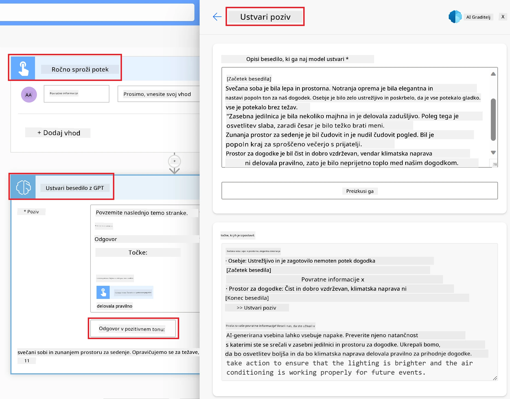

Če se želite naučiti, kako uporabljati ta AI model v Power Automate, preglejte modul [Dodajte inteligenco z AI Builder in GPT](https://learn.microsoft.com/training/modules/ai-builder-text-generation/?WT.mc_id=academic-109639-somelezediko).

## Odlično delo! Nadaljujte s svojim učenjem

Po končanem temeljitem pregledu si oglejte našo [Zbirko učnih gradiv o Generativni AI](https://aka.ms/genai-collection?WT.mc_id=academic-105485-koreyst), da nadaljujete z nadgradnjo svojega znanja o Generativni AI!

Želite prilagoditi in izvleči več iz Copilota? Raziščite [Awesome Copilot](https://github.com/github/awesome-copilot?WT.mc_id=academic-105485-koreyst) — zbirko navodil, agentov, veščin in konfiguracij, ki jih prispeva skupnost, da vam pomaga kar najbolje izkoristiti GitHub Copilot.

Pojdite na Lekcijo 11, kjer bomo pogledali, kako [integrirati Generativno AI s Klicem funkcij](../11-integrating-with-function-calling/README.md?WT.mc_id=academic-105485-koreyst)!

---

<!-- CO-OP TRANSLATOR DISCLAIMER START -->
**Omejitev odgovornosti**:
Ta dokument je bil preveden z uporabo AI prevajalske storitve [Co-op Translator](https://github.com/Azure/co-op-translator). Čeprav si prizadevamo za natančnost, vas prosimo, da upoštevate, da avtomatizirani prevodi lahko vsebujejo napake ali netočnosti. Izvirni dokument v njegovem izvirnem jeziku je treba obravnavati kot avtoritativni vir. Za kritične informacije je priporočljiv strokovni človeški prevod. Ne odgovarjamo za morebitna nesporazume ali napačne interpretacije, ki izhajajo iz uporabe tega prevoda.
<!-- CO-OP TRANSLATOR DISCLAIMER END -->