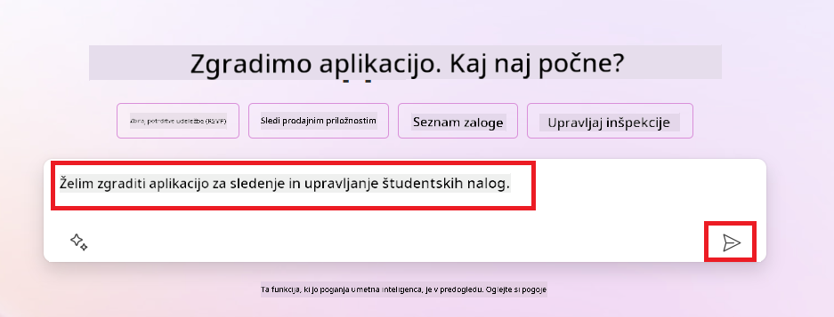
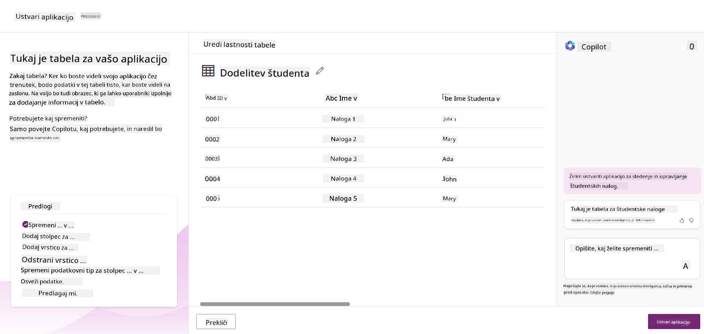
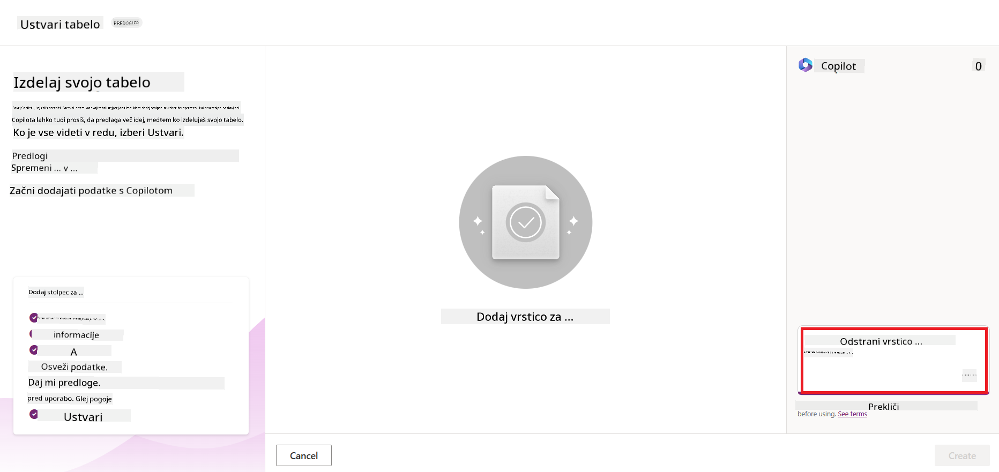
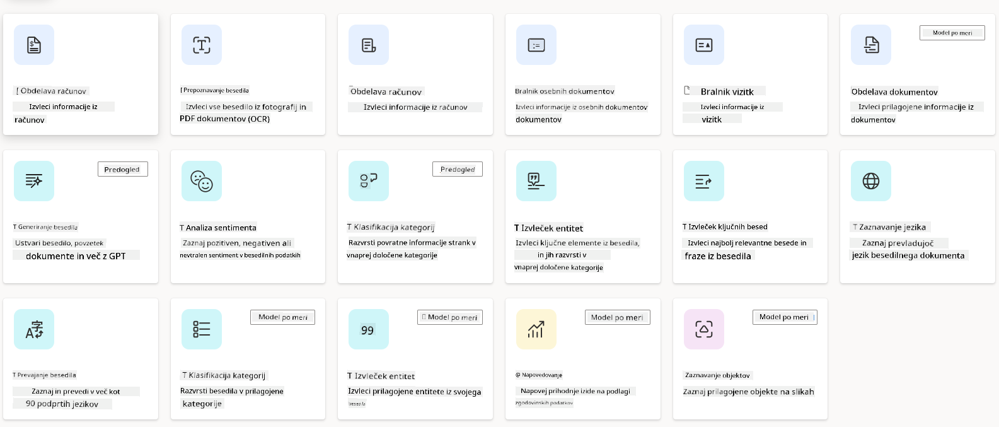
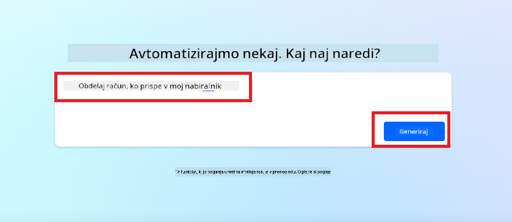
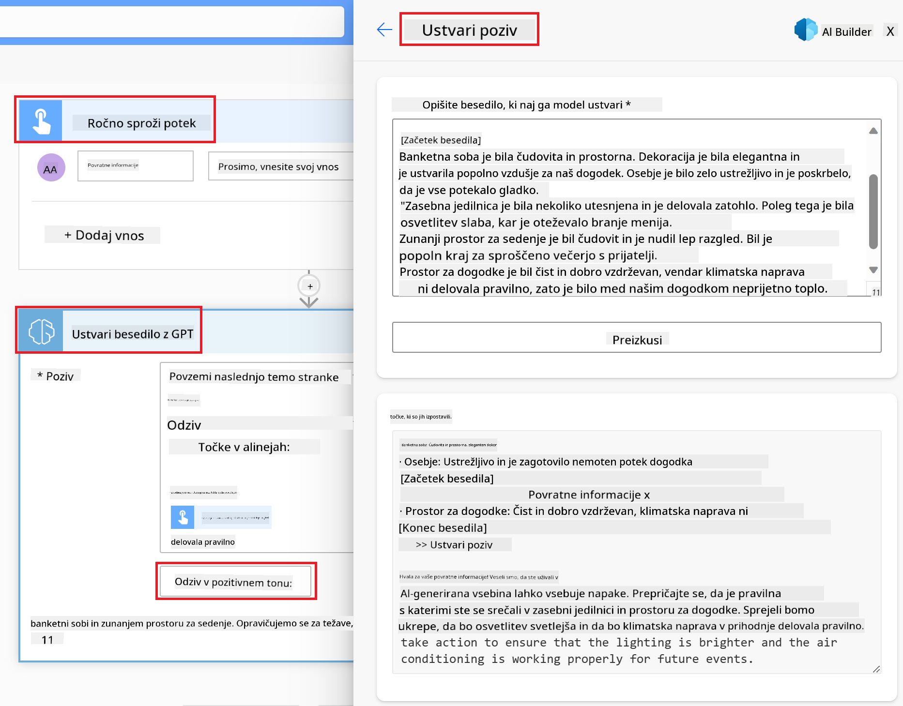

<!--
CO_OP_TRANSLATOR_METADATA:
{
  "original_hash": "846ac8e3b7dcfb697d3309fec05f0fea",
  "translation_date": "2025-10-18T01:42:48+00:00",
  "source_file": "10-building-low-code-ai-applications/README.md",
  "language_code": "sl"
}
-->
# Gradnja aplikacij AI z nizko kodo

> _(Kliknite zgornjo sliko za ogled videa te lekcije)_

## Uvod

Zdaj, ko smo se naučili, kako zgraditi aplikacije za generiranje slik, se pogovorimo o nizki kodi. Generativna umetna inteligenca se lahko uporablja na različnih področjih, vključno z nizko kodo, toda kaj je nizka koda in kako lahko dodamo umetno inteligenco?

Gradnja aplikacij in rešitev je postala lažja za tradicionalne razvijalce in ne-razvijalce z uporabo platform za razvoj z nizko kodo. Te platforme omogočajo gradnjo aplikacij in rešitev z malo ali brez kode. To se doseže z zagotavljanjem vizualnega razvojnega okolja, ki omogoča vlečenje in spuščanje komponent za gradnjo aplikacij in rešitev. Tako lahko aplikacije in rešitve gradite hitreje in z manj sredstvi. V tej lekciji se bomo poglobili v uporabo nizke kode in kako izboljšati razvoj z nizko kodo z umetno inteligenco z uporabo Power Platform.

Power Platform organizacijam omogoča, da svojim ekipam omogočijo gradnjo lastnih rešitev prek intuitivnega okolja z nizko kodo ali brez kode. To okolje poenostavi proces gradnje rešitev. Z Power Platform je mogoče rešitve zgraditi v nekaj dneh ali tednih namesto v mesecih ali letih. Power Platform sestavlja pet ključnih izdelkov: Power Apps, Power Automate, Power BI, Power Pages in Copilot Studio.

Ta lekcija zajema:

- Uvod v generativno umetno inteligenco v Power Platform
- Uvod v Copilot in kako ga uporabljati
- Uporaba generativne umetne inteligence za gradnjo aplikacij in tokov v Power Platform
- Razumevanje AI modelov v Power Platform z AI Builder

## Cilji učenja

Do konca te lekcije boste lahko:

- Razumeli, kako Copilot deluje v Power Platform.

- Zgradili aplikacijo za sledenje študentskim nalogam za naš izobraževalni startup.

- Zgradili tok za obdelavo računov, ki uporablja umetno inteligenco za ekstrakcijo informacij iz računov.

- Uporabili najboljše prakse pri uporabi modela Create Text z GPT AI.

Orodja in tehnologije, ki jih boste uporabili v tej lekciji, so:

- **Power Apps**, za aplikacijo za sledenje študentskim nalogam, ki zagotavlja razvojno okolje z nizko kodo za gradnjo aplikacij za sledenje, upravljanje in interakcijo s podatki.

- **Dataverse**, za shranjevanje podatkov za aplikacijo za sledenje študentskim nalogam, kjer Dataverse zagotavlja platformo za podatke z nizko kodo za shranjevanje podatkov aplikacije.

- **Power Automate**, za tok obdelave računov, kjer boste imeli razvojno okolje z nizko kodo za gradnjo delovnih tokov za avtomatizacijo procesa obdelave računov.

- **AI Builder**, za model umetne inteligence za obdelavo računov, kjer boste uporabili vnaprej pripravljene modele umetne inteligence za obdelavo računov za naš startup.

## Generativna umetna inteligenca v Power Platform

Izboljšanje razvoja z nizko kodo in aplikacij z generativno umetno inteligenco je ključna usmeritev za Power Platform. Cilj je omogočiti vsem, da gradijo aplikacije, spletna mesta, nadzorne plošče in avtomatizirajo procese z umetno inteligenco, _brez potrebe po strokovnem znanju o podatkovni znanosti_. Ta cilj se doseže z integracijo generativne umetne inteligence v izkušnjo razvoja z nizko kodo v Power Platform v obliki Copilot in AI Builder.

### Kako to deluje?

Copilot je asistent umetne inteligence, ki vam omogoča gradnjo rešitev v Power Platform z opisovanjem vaših zahtev v seriji pogovornih korakov z uporabo naravnega jezika. Na primer, svojemu asistentu umetne inteligence lahko naročite, katere polja bo vaša aplikacija uporabljala, in ta bo ustvaril tako aplikacijo kot tudi osnovni podatkovni model, ali pa lahko določite, kako nastaviti tok v Power Automate.

Funkcionalnosti, ki jih poganja Copilot, lahko uporabite kot funkcijo na zaslonih vaše aplikacije, da omogočite uporabnikom odkrivanje vpogledov prek pogovornih interakcij.

AI Builder je zmogljivost umetne inteligence z nizko kodo, ki je na voljo v Power Platform in vam omogoča uporabo modelov umetne inteligence za pomoč pri avtomatizaciji procesov in napovedovanju rezultatov. Z AI Builder lahko umetno inteligenco vključite v svoje aplikacije in tokove, ki se povezujejo z vašimi podatki v Dataverse ali v različnih oblačnih podatkovnih virih, kot so SharePoint, OneDrive ali Azure.

Copilot je na voljo v vseh izdelkih Power Platform: Power Apps, Power Automate, Power BI, Power Pages in Power Virtual Agents. AI Builder je na voljo v Power Apps in Power Automate. V tej lekciji se bomo osredotočili na uporabo Copilot in AI Builder v Power Apps in Power Automate za gradnjo rešitve za naš izobraževalni startup.

### Copilot v Power Apps

Kot del Power Platform, Power Apps zagotavlja razvojno okolje z nizko kodo za gradnjo aplikacij za sledenje, upravljanje in interakcijo s podatki. Gre za nabor storitev za razvoj aplikacij z razširljivo podatkovno platformo in možnostjo povezovanja z oblačnimi storitvami ter podatki na lokaciji. Power Apps omogoča gradnjo aplikacij, ki delujejo v brskalnikih, na tablicah in telefonih ter jih je mogoče deliti s sodelavci. Power Apps uporabnike uvaja v razvoj aplikacij s preprostim vmesnikom, tako da lahko vsak poslovni uporabnik ali profesionalni razvijalec gradi prilagojene aplikacije. Izkušnja razvoja aplikacij je izboljšana tudi z generativno umetno inteligenco prek Copilot.

Funkcija AI asistenta Copilot v Power Apps omogoča opisovanje vrste aplikacije, ki jo potrebujete, in informacij, ki jih želite, da vaša aplikacija sledi, zbira ali prikazuje. Copilot nato na podlagi vašega opisa ustvari odzivno Canvas aplikacijo. Nato lahko aplikacijo prilagodite svojim potrebam. AI Copilot prav tako ustvari in predlaga Dataverse tabelo s polji, ki jih potrebujete za shranjevanje podatkov, ki jih želite slediti, ter nekaj vzorčnih podatkov. Kasneje v tej lekciji bomo pogledali, kaj je Dataverse in kako ga lahko uporabite v Power Apps. Nato lahko tabelo prilagodite svojim potrebam z uporabo funkcije AI Copilot asistenta prek pogovornih korakov. Ta funkcija je na voljo neposredno z domačega zaslona Power Apps.

### Copilot v Power Automate

Kot del Power Platform, Power Automate uporabnikom omogoča ustvarjanje avtomatiziranih delovnih tokov med aplikacijami in storitvami. Pomaga avtomatizirati ponavljajoče se poslovne procese, kot so komunikacija, zbiranje podatkov in odobritve odločitev. Njegov preprost vmesnik omogoča uporabnikom z različnimi tehničnimi kompetencami (od začetnikov do izkušenih razvijalcev), da avtomatizirajo delovne naloge. Izkušnja razvoja delovnih tokov je prav tako izboljšana z generativno umetno inteligenco prek Copilot.

Funkcija AI asistenta Copilot v Power Automate omogoča opisovanje vrste toka, ki ga potrebujete, in dejanj, ki jih želite, da vaš tok izvede. Copilot nato ustvari tok na podlagi vašega opisa. Nato lahko tok prilagodite svojim potrebam. AI Copilot prav tako ustvari in predlaga dejanja, ki jih potrebujete za izvedbo naloge, ki jo želite avtomatizirati. Kasneje v tej lekciji bomo pogledali, kaj so tokovi in kako jih lahko uporabite v Power Automate. Nato lahko dejanja prilagodite svojim potrebam z uporabo funkcije AI Copilot asistenta prek pogovornih korakov. Ta funkcija je na voljo neposredno z domačega zaslona Power Automate.

## Naloga: Upravljanje študentskih nalog in računov za naš startup z uporabo Copilot

Naš startup ponuja spletne tečaje za študente. Startup je hitro rasel in se zdaj sooča s težavami pri obvladovanju povpraševanja po svojih tečajih. Startup vas je zaposlil kot razvijalca Power Platform, da jim pomagate zgraditi rešitev z nizko kodo za upravljanje študentskih nalog in računov. Rešitev naj bi jim pomagala slediti in upravljati študentske naloge prek aplikacije ter avtomatizirati proces obdelave računov prek delovnega toka. Prosili so vas, da za razvoj rešitve uporabite generativno umetno inteligenco.

Ko začnete uporabljati Copilot, lahko uporabite [Power Platform Copilot Prompt Library](https://github.com/pnp/powerplatform-prompts?WT.mc_id=academic-109639-somelezediko), da začnete z ukazi. Ta knjižnica vsebuje seznam ukazov, ki jih lahko uporabite za gradnjo aplikacij in tokov s Copilot. Ukaze v knjižnici lahko uporabite tudi za pridobitev idej, kako opisati svoje zahteve Copilot.

### Zgradite aplikacijo za sledenje študentskim nalogam za naš startup

Izobraževalci v našem startupu imajo težave pri sledenju študentskim nalogam. Za sledenje nalogam so uporabljali preglednico, vendar je to postalo težko obvladljivo, saj se je število študentov povečalo. Prosili so vas, da zgradite aplikacijo, ki jim bo pomagala slediti in upravljati študentske naloge. Aplikacija naj omogoča dodajanje novih nalog, ogled nalog, posodabljanje nalog in brisanje nalog. Aplikacija naj prav tako omogoča izobraževalcem in študentom ogled nalog, ki so bile ocenjene, in tistih, ki še niso bile ocenjene.

Aplikacijo boste zgradili z uporabo Copilot v Power Apps po naslednjih korakih:

1. Pojdite na domači zaslon [Power Apps](https://make.powerapps.com?WT.mc_id=academic-105485-koreyst).

1. Uporabite besedilno polje na domačem zaslonu, da opišete aplikacijo, ki jo želite zgraditi. Na primer, **_Želim zgraditi aplikacijo za sledenje in upravljanje študentskih nalog_**. Kliknite gumb **Pošlji**, da pošljete ukaz AI Copilot.

1. AI Copilot bo predlagal Dataverse tabelo s polji, ki jih potrebujete za shranjevanje podatkov, ki jih želite slediti, ter nekaj vzorčnih podatkov. Nato lahko tabelo prilagodite svojim potrebam z uporabo funkcije AI Copilot asistenta prek pogovornih korakov.

   > **Pomembno**: Dataverse je osnovna podatkovna platforma za Power Platform. Gre za platformo za podatke z nizko kodo za shranjevanje podatkov aplikacije. Je popolnoma upravljana storitev, ki varno shranjuje podatke v Microsoft Cloud in je na voljo v vašem okolju Power Platform. Ima vgrajene zmogljivosti upravljanja podatkov, kot so klasifikacija podatkov, izvor podatkov, natančen nadzor dostopa in več. Več o Dataverse lahko izveste [tukaj](https://docs.microsoft.com/powerapps/maker/data-platform/data-platform-intro?WT.mc_id=academic-109639-somelezediko).

   

1. Izobraževalci želijo pošiljati e-pošto študentom, ki so oddali svoje naloge, da jih obveščajo o napredku njihovih nalog. Copilot lahko uporabite za dodajanje novega polja v tabelo za shranjevanje e-pošte študentov. Na primer, lahko uporabite naslednji ukaz za dodajanje novega polja v tabelo: **_Želim dodati stolpec za shranjevanje e-pošte študentov_**. Kliknite gumb **Pošlji**, da pošljete ukaz AI Copilot.

1. AI Copilot bo ustvaril novo polje, nato pa ga lahko prilagodite svojim potrebam.

1. Ko končate s tabelo, kliknite gumb **Ustvari aplikacijo**, da ustvarite aplikacijo.

1. AI Copilot bo na podlagi vašega opisa ustvaril odzivno Canvas aplikacijo. Nato lahko aplikacijo prilagodite svojim potrebam.

1. Da izobraževalci pošiljajo e-pošto študentom, lahko uporabite Copilot za dodajanje novega zaslona v aplikacijo. Na primer, lahko uporabite naslednji ukaz za dodajanje novega zaslona v aplikacijo: **_Želim dodati zaslon za pošiljanje e-pošte študentom_**. Kliknite gumb **Pošlji**, da pošljete ukaz AI Copilot.

1. AI Copilot bo ustvaril nov zaslon, nato pa ga lahko prilagodite svojim potrebam.

1. Ko končate z aplikacijo, kliknite gumb **Shrani**, da shranite aplikacijo.

1. Da aplikacijo delite z izobraževalci, kliknite gumb **Deli**, nato pa ponovno kliknite gumb **Deli**. Nato lahko aplikacijo delite z izobraževalci tako, da vnesete njihove e-poštne naslove.

> **Vaša domača naloga**: Aplikacija, ki ste jo pravkar zgradili, je dober začetek, vendar jo je mogoče izboljšati. Z funkcijo e-pošte lahko izobraževalci pošiljajo e-pošto študentom le ročno, tako da morajo vnašati njihove e-poštne naslove. Ali lahko uporabite Copilot za gradnjo avtomatizacije, ki bo omogočila izobraževalcem, da samodejno pošiljajo e-pošto študentom, ko oddajo svoje naloge? Vaš namig je, da lahko z ustreznim ukazom uporabite Copilot v Power Automate za gradnjo tega.

### Zgradite tabelo informacij o računih za naš startup

Finančna ekipa našega startupa ima težave pri sledenju računom. Za sledenje računom so uporabljali preglednico, vendar je to postalo težko obvladljivo, saj se je število računov povečalo. Prosili so vas, da zgradite tabelo, ki jim bo pomagala shranjevati, slediti in upravljati informacije o prejetih računih. Tabela naj bo uporabljena za gradnjo avtomatizacije, ki bo izločila vse informacije o računih in jih shranila v tabelo. Tabela naj prav tako omogoča finančni ekipi ogled računov, ki so bili plačani, in tistih, ki še niso bili plačani.

Power Platform ima osnovno podatkovno platformo, imenovano Dataverse, ki vam omogoča shranjevanje podatkov za vaše aplikacije in rešitve. Dataverse zagotavlja platformo za podatke z nizko kodo za shranjevanje podatkov aplikacije. Je popolnoma upravljana storitev, ki varno shranjuje podatke v Microsoft Cloud in je na voljo v vašem okolju Power Platform. Ima vgrajene zmogljivosti upravljanja podatkov, kot so klasifikacija podatkov, izvor podatkov, natančen nadzor dostopa in več. Več o Dataverse lahko izveste [tukaj](https://docs.microsoft.com/powerapps/maker/data-platform/data-platform-intro?WT.mc_id=academic-109639-somelezediko).
Zakaj bi morali uporabiti Dataverse za naš startup? Standardne in prilagojene tabele v Dataverse zagotavljajo varno in na oblaku temelječo možnost shranjevanja vaših podatkov. Tabele vam omogočajo shranjevanje različnih vrst podatkov, podobno kot bi uporabili več delovnih listov v enem Excelovem delovnem zvezku. Tabele lahko uporabite za shranjevanje podatkov, ki so specifični za potrebe vaše organizacije ali podjetja. Nekatere prednosti, ki jih bo naš startup pridobil z uporabo Dataverse, vključujejo, vendar niso omejene na:

- **Enostavno upravljanje**: Tako metapodatki kot podatki so shranjeni v oblaku, zato vam ni treba skrbeti za podrobnosti o tem, kako so shranjeni ali upravljani. Osredotočite se lahko na gradnjo svojih aplikacij in rešitev.

- **Varnost**: Dataverse zagotavlja varno in na oblaku temelječo možnost shranjevanja vaših podatkov. S pomočjo varnosti na podlagi vlog lahko nadzorujete, kdo ima dostop do podatkov v vaših tabelah in kako jih lahko dostopa.

- **Bogati metapodatki**: Vrste podatkov in odnosi se uporabljajo neposredno v Power Apps.

- **Logika in validacija**: Poslovna pravila, izračunana polja in pravila validacije lahko uporabite za uveljavljanje poslovne logike in ohranjanje natančnosti podatkov.

Zdaj, ko veste, kaj je Dataverse in zakaj bi ga morali uporabljati, si poglejmo, kako lahko uporabite Copilot za ustvarjanje tabele v Dataverse, ki bo ustrezala zahtevam naše finančne ekipe.

> **Note**: To tabelo boste uporabili v naslednjem razdelku za izdelavo avtomatizacije, ki bo izluščila vse informacije o računih in jih shranila v tabelo.

Za ustvarjanje tabele v Dataverse z uporabo Copilot sledite spodnjim korakom:

1. Pojdite na domačo stran [Power Apps](https://make.powerapps.com?WT.mc_id=academic-105485-koreyst).

2. Na levi navigacijski vrstici izberite **Tables** in nato kliknite **Describe the new Table**.

3. Na zaslonu **Describe the new Table** uporabite besedilno polje za opis tabele, ki jo želite ustvariti. Na primer, **_Želim ustvariti tabelo za shranjevanje informacij o računih_**. Kliknite gumb **Send**, da pošljete zahtevo AI Copilotu.

4. AI Copilot bo predlagal tabelo Dataverse s polji, ki jih potrebujete za shranjevanje podatkov, ki jih želite spremljati, in nekaj vzorčnih podatkov. Nato lahko tabelo prilagodite svojim potrebam z uporabo funkcije AI Copilot prek pogovornih korakov.

5. Finančna ekipa želi poslati e-pošto dobavitelju, da ga obvesti o trenutnem stanju njegovega računa. Copilot lahko uporabite za dodajanje novega polja v tabelo za shranjevanje e-pošte dobavitelja. Na primer, lahko uporabite naslednjo zahtevo za dodajanje novega polja v tabelo: **_Želim dodati stolpec za shranjevanje e-pošte dobavitelja_**. Kliknite gumb **Send**, da pošljete zahtevo AI Copilotu.

6. AI Copilot bo ustvaril novo polje, nato pa ga lahko prilagodite svojim potrebam.

7. Ko končate s tabelo, kliknite gumb **Create**, da ustvarite tabelo.

## AI modeli v Power Platform z AI Builder

AI Builder je zmogljivost umetne inteligence z nizko kodo, ki je na voljo v Power Platform in vam omogoča uporabo AI modelov za avtomatizacijo procesov in napovedovanje rezultatov. Z AI Builder lahko umetno inteligenco vključite v svoje aplikacije in tokove, ki se povezujejo z vašimi podatki v Dataverse ali v različnih oblačnih virih podatkov, kot so SharePoint, OneDrive ali Azure.

## Vnaprej pripravljeni AI modeli proti prilagojenim AI modelom

AI Builder ponuja dva tipa AI modelov: vnaprej pripravljene AI modele in prilagojene AI modele. Vnaprej pripravljeni AI modeli so že pripravljeni za uporabo, usposobljeni s strani Microsofta in na voljo v Power Platform. Ti vam pomagajo dodati inteligenco vašim aplikacijam in tokovom, ne da bi morali zbirati podatke ter nato graditi, usposabljati in objavljati svoje modele. Te modele lahko uporabite za avtomatizacijo procesov in napovedovanje rezultatov.

Nekateri vnaprej pripravljeni AI modeli, ki so na voljo v Power Platform, vključujejo:

- **Izvleček ključnih fraz**: Ta model izlušči ključne fraze iz besedila.
- **Prepoznavanje jezika**: Ta model prepozna jezik besedila.
- **Analiza sentimenta**: Ta model zazna pozitiven, negativen, nevtralen ali mešan sentiment v besedilu.
- **Branje vizitk**: Ta model izlušči informacije iz vizitk.
- **Prepoznavanje besedila**: Ta model izlušči besedilo iz slik.
- **Prepoznavanje objektov**: Ta model zazna in izlušči objekte iz slik.
- **Obdelava dokumentov**: Ta model izlušči informacije iz obrazcev.
- **Obdelava računov**: Ta model izlušči informacije iz računov.

S prilagojenimi AI modeli lahko v AI Builder vključite svoj model, da deluje kot kateri koli prilagojen model AI Builder, kar vam omogoča, da model usposobite z lastnimi podatki. Te modele lahko uporabite za avtomatizacijo procesov in napovedovanje rezultatov tako v Power Apps kot v Power Automate. Pri uporabi lastnega modela veljajo določene omejitve. Več o teh omejitvah preberite [tukaj](https://learn.microsoft.com/ai-builder/byo-model#limitations?WT.mc_id=academic-105485-koreyst).

## Naloga #2 - Izdelajte tok za obdelavo računov za naš startup

Finančna ekipa se sooča s težavami pri obdelavi računov. Za sledenje računom so uporabljali preglednico, vendar je to postalo težko obvladljivo, saj se je število računov povečalo. Prosili so vas, da izdelate delovni tok, ki jim bo pomagal obdelati račune z uporabo AI. Tok naj omogoči izluščenje informacij iz računov in shranjevanje teh informacij v tabelo Dataverse. Prav tako naj omogoči pošiljanje e-pošte finančni ekipi z izluščenimi informacijami.

Zdaj, ko veste, kaj je AI Builder in zakaj bi ga morali uporabljati, si poglejmo, kako lahko uporabite AI model za obdelavo računov v AI Builder, ki smo ga obravnavali prej, za izdelavo delovnega toka, ki bo pomagal finančni ekipi obdelati račune.

Za izdelavo delovnega toka, ki bo finančni ekipi pomagal obdelati račune z uporabo AI modela za obdelavo računov v AI Builder, sledite spodnjim korakom:

1. Pojdite na domačo stran [Power Automate](https://make.powerautomate.com?WT.mc_id=academic-105485-koreyst).

2. Uporabite besedilno polje na domači strani za opis delovnega toka, ki ga želite izdelati. Na primer, **_Obdelaj račun, ko prispe v mojo poštno mapo_**. Kliknite gumb **Send**, da pošljete zahtevo AI Copilotu.

   

3. AI Copilot bo predlagal dejanja, ki jih potrebujete za izvedbo naloge, ki jo želite avtomatizirati. Kliknite gumb **Next**, da nadaljujete na naslednje korake.

4. V naslednjem koraku vas bo Power Automate pozval, da nastavite povezave, potrebne za tok. Ko končate, kliknite gumb **Create flow**, da ustvarite tok.

5. AI Copilot bo ustvaril tok, nato pa ga lahko prilagodite svojim potrebam.

6. Posodobite sprožilec toka in nastavite **Folder** na mapo, kjer bodo shranjeni računi. Na primer, mapo lahko nastavite na **Inbox**. Kliknite **Show advanced options** in nastavite **Only with Attachments** na **Yes**. To bo zagotovilo, da se tok zažene le, ko v mapo prispe e-pošta s priponko.

7. Iz delovnega toka odstranite naslednja dejanja: **HTML to text**, **Compose**, **Compose 2**, **Compose 3** in **Compose 4**, ker jih ne boste uporabljali.

8. Iz delovnega toka odstranite dejanje **Condition**, ker ga ne boste uporabljali. Videti bi moralo takole:

   

9. Kliknite gumb **Add an action** in poiščite **Dataverse**. Izberite dejanje **Add a new row**.

10. Na dejanju **Extract Information from invoices** posodobite **Invoice File**, da kaže na **Attachment Content** iz e-pošte. To bo zagotovilo, da tok izlušči informacije iz priponke računa.

11. Izberite **Table**, ki ste jo ustvarili prej. Na primer, lahko izberete tabelo **Invoice Information**. Izberite dinamično vsebino iz prejšnjega dejanja, da zapolnite naslednja polja:

    - ID
    - Znesek
    - Datum
    - Ime
    - Status - Nastavite **Status** na **Pending**.
    - E-pošta dobavitelja - Uporabite dinamično vsebino **From** iz sprožilca **When a new email arrives**.

    

12. Ko končate s tokom, kliknite gumb **Save**, da shranite tok. Nato lahko tok preizkusite tako, da pošljete e-pošto z računom v mapo, ki ste jo določili v sprožilcu.

> **Vaša domača naloga**: Tok, ki ste ga pravkar izdelali, je dober začetek, zdaj pa morate razmisliti, kako lahko izdelate avtomatizacijo, ki bo omogočila naši finančni ekipi, da pošlje e-pošto dobavitelju in ga obvesti o trenutnem stanju njegovega računa. Namig: tok se mora zagnati, ko se spremeni stanje računa.

## Uporaba AI modela za generiranje besedila v Power Automate

Model Create Text with GPT v AI Builder omogoča generiranje besedila na podlagi zahteve in temelji na storitvi Microsoft Azure OpenAI. S to zmogljivostjo lahko v svoje aplikacije in tokove vključite tehnologijo GPT (Generative Pre-Trained Transformer) za izdelavo različnih avtomatiziranih tokov in vpoglednih aplikacij.

GPT modeli so obsežno usposobljeni na velikih količinah podatkov, kar jim omogoča ustvarjanje besedila, ki je zelo podobno človeškemu jeziku, ko jim je podana zahteva. Ko so integrirani z avtomatizacijo delovnih tokov, se lahko AI modeli, kot je GPT, uporabijo za poenostavitev in avtomatizacijo širokega spektra nalog.

Na primer, lahko izdelate tokove za samodejno generiranje besedila za različne primere uporabe, kot so: osnutki e-poštnih sporočil, opisi izdelkov in drugo. Model lahko uporabite tudi za generiranje besedila za različne aplikacije, kot so klepetalni roboti in aplikacije za podporo strankam, ki omogočajo agentom za podporo strankam učinkovito in uspešno odgovarjanje na vprašanja strank.

Če želite izvedeti, kako uporabljati ta AI model v Power Automate, pojdite skozi modul [Dodajanje inteligence z AI Builder in GPT](https://learn.microsoft.com/training/modules/ai-builder-text-generation/?WT.mc_id=academic-109639-somelezediko).

## Odlično delo! Nadaljujte z učenjem

Po zaključku te lekcije si oglejte našo [Generative AI Learning collection](https://aka.ms/genai-collection?WT.mc_id=academic-105485-koreyst), da nadaljujete z nadgradnjo svojega znanja o generativni umetni inteligenci!

Pojdite na lekcijo 11, kjer bomo pogledali, kako [integrirati generativno umetno inteligenco z uporabo funkcijskega klicanja](../11-integrating-with-function-calling/README.md?WT.mc_id=academic-105485-koreyst)!

---

**Omejitev odgovornosti**:  
Ta dokument je bil preveden z uporabo storitve za prevajanje AI [Co-op Translator](https://github.com/Azure/co-op-translator). Čeprav si prizadevamo za natančnost, vas prosimo, da upoštevate, da lahko avtomatizirani prevodi vsebujejo napake ali netočnosti. Izvirni dokument v njegovem maternem jeziku je treba obravnavati kot avtoritativni vir. Za ključne informacije je priporočljivo profesionalno človeško prevajanje. Ne prevzemamo odgovornosti za morebitne nesporazume ali napačne razlage, ki izhajajo iz uporabe tega prevoda.