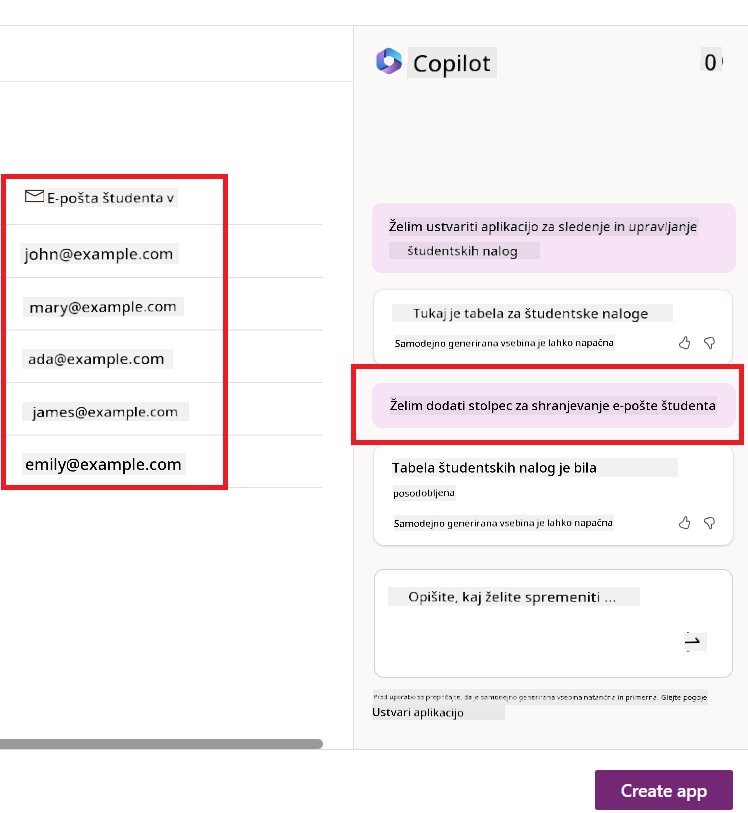
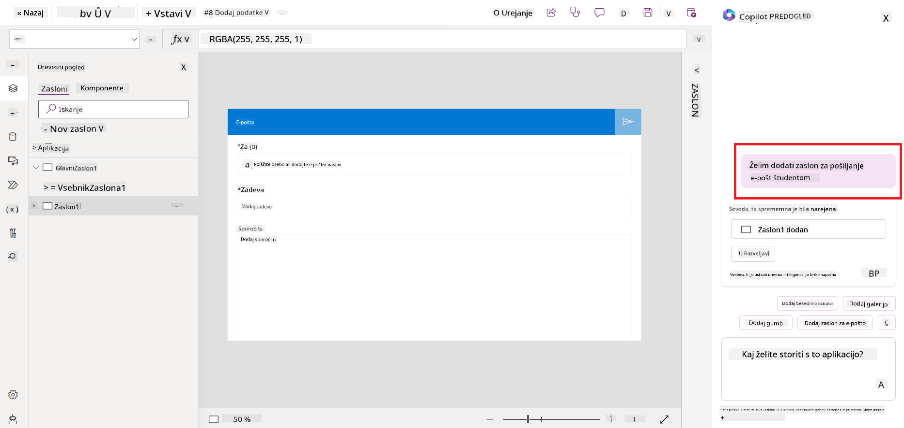

<!--
CO_OP_TRANSLATOR_METADATA:
{
  "original_hash": "f5ff3b6204a695a117d6f452403c95f7",
  "translation_date": "2025-07-09T14:17:05+00:00",
  "source_file": "10-building-low-code-ai-applications/README.md",
  "language_code": "sl"
}
-->
# Gradnja nizkokodnih AI aplikacij

> _(Kliknite na zgornjo sliko za ogled videa te lekcije)_

## Uvod

Zdaj, ko smo se naučili, kako graditi aplikacije za generiranje slik, pa se posvetimo nizkemu kodiranju. Generativna AI se lahko uporablja na različnih področjih, tudi pri nizkemu kodiranju, a kaj pravzaprav pomeni nizko kodiranje in kako lahko vanj vključimo AI?

Gradnja aplikacij in rešitev je postala lažja tako za tradicionalne razvijalce kot tudi za tiste brez programerskega znanja, zahvaljujoč platformam za nizkokodno razvojno okolje. Te platforme omogočajo gradnjo aplikacij in rešitev z malo ali brez programiranja. To dosežejo z vizualnim razvojnim okoljem, kjer lahko komponente preprosto povlečete in spustite za izdelavo aplikacij in rešitev. Tako lahko aplikacije in rešitve ustvarite hitreje in z manj sredstvi. V tej lekciji bomo podrobno raziskali, kako uporabljati nizko kodiranje in kako ga izboljšati z AI z uporabo Power Platform.

Power Platform organizacijam omogoča, da opolnomočijo svoje ekipe za izdelavo lastnih rešitev v intuitivnem nizkokodnem ali brezkodnem okolju. To okolje poenostavi proces gradnje rešitev. S Power Platform lahko rešitve zgradite v dneh ali tednih, namesto v mesecih ali letih. Power Platform sestavlja pet ključnih produktov: Power Apps, Power Automate, Power BI, Power Pages in Copilot Studio.

Ta lekcija zajema:

- Uvod v generativno AI v Power Platform
- Uvod v Copilot in kako ga uporabljati
- Uporaba generativne AI za gradnjo aplikacij in potekov v Power Platform
- Razumevanje AI modelov v Power Platform z AI Builder

## Cilji učenja

Ob koncu te lekcije boste znali:

- Razumeti, kako Copilot deluje v Power Platform.

- Zgraditi aplikacijo za sledenje študentskih nalog za naš izobraževalni startup.

- Zgraditi potek za obdelavo računov, ki uporablja AI za izvleček informacij iz računov.

- Uporabiti najboljše prakse pri uporabi Create Text z GPT AI modelom.

Orodja in tehnologije, ki jih boste uporabili v tej lekciji, so:

- **Power Apps**, za aplikacijo za sledenje študentskih nalog, ki nudi nizkokodno razvojno okolje za gradnjo aplikacij za sledenje, upravljanje in interakcijo s podatki.

- **Dataverse**, za shranjevanje podatkov aplikacije za sledenje študentskih nalog, kjer Dataverse zagotavlja nizkokodno podatkovno platformo za shranjevanje podatkov aplikacije.

- **Power Automate**, za potek obdelave računov, kjer boste imeli nizkokodno razvojno okolje za gradnjo potekov za avtomatizacijo procesa obdelave računov.

- **AI Builder**, za AI model obdelave računov, kjer boste uporabili vnaprej izdelane AI modele za obdelavo računov za naš startup.

## Generativna AI v Power Platform

Izboljševanje nizkokodnega razvoja in aplikacij z generativno AI je ključno področje za Power Platform. Cilj je omogočiti vsakomur, da gradi aplikacije, spletne strani, nadzorne plošče in avtomatizira procese z AI, _brez potrebe po strokovnem znanju s področja podatkovne znanosti_. Ta cilj se doseže z integracijo generativne AI v nizkokodno razvojno izkušnjo v Power Platform v obliki Copilota in AI Builderja.

### Kako to deluje?

Copilot je AI pomočnik, ki vam omogoča gradnjo rešitev v Power Platform tako, da opisujete svoje zahteve v seriji pogovornih korakov z uporabo naravnega jezika. Na primer, lahko poveste svojemu AI pomočniku, katere podatkovne polja bo vaša aplikacija uporabljala, in ta bo ustvaril tako aplikacijo kot tudi osnovni podatkovni model, ali pa lahko določite, kako naj se nastavi potek v Power Automate.

Funkcionalnosti, ki jih poganja Copilot, lahko uporabite kot funkcijo na zaslonih vaše aplikacije, da uporabnikom omogočite odkrivanje vpogledov preko pogovornih interakcij.

AI Builder je nizkokodna AI zmogljivost, ki je na voljo v Power Platform in vam omogoča uporabo AI modelov za avtomatizacijo procesov in napovedovanje rezultatov. Z AI Builderjem lahko AI vključite v svoje aplikacije in poteke, ki se povezujejo z vašimi podatki v Dataverse ali v različnih oblačnih podatkovnih virih, kot so SharePoint, OneDrive ali Azure.

Copilot je na voljo v vseh produktih Power Platform: Power Apps, Power Automate, Power BI, Power Pages in Power Virtual Agents. AI Builder je na voljo v Power Apps in Power Automate. V tej lekciji se bomo osredotočili na uporabo Copilota in AI Builderja v Power Apps in Power Automate za izdelavo rešitve za naš izobraževalni startup.

### Copilot v Power Apps

Kot del Power Platform, Power Apps nudi nizkokodno razvojno okolje za gradnjo aplikacij za sledenje, upravljanje in interakcijo s podatki. Gre za paket storitev za razvoj aplikacij z razširljivo podatkovno platformo in možnostjo povezovanja z oblačnimi storitvami ter lokalnimi podatkovnimi viri. Power Apps omogoča gradnjo aplikacij, ki delujejo v brskalnikih, na tablicah in telefonih ter jih je mogoče deliti s sodelavci. Power Apps uporabnikom olajša razvoj aplikacij z enostavnim vmesnikom, tako da lahko vsak poslovni uporabnik ali izkušen razvijalec ustvari prilagojene aplikacije. Izkušnja razvoja aplikacij je dodatno izboljšana z generativno AI preko Copilota.

Funkcija AI pomočnika Copilot v Power Apps vam omogoča, da opišete, kakšno aplikacijo potrebujete in katere informacije naj vaša aplikacija sledi, zbira ali prikazuje. Copilot nato ustvari odzivno Canvas aplikacijo na podlagi vašega opisa. Aplikacijo lahko nato prilagodite svojim potrebam. AI Copilot prav tako ustvari in predlaga Dataverse tabelo s polji, ki jih potrebujete za shranjevanje podatkov, ki jih želite slediti, skupaj z nekaj vzorčnimi podatki. Kasneje v tej lekciji si bomo ogledali, kaj je Dataverse in kako ga lahko uporabite v Power Apps. Tabelo lahko nato prilagodite svojim potrebam z uporabo funkcije AI Copilot preko pogovornih korakov. Ta funkcija je na voljo neposredno z domačega zaslona Power Apps.

### Copilot v Power Automate

Kot del Power Platform, Power Automate omogoča uporabnikom ustvarjanje avtomatiziranih potekov med aplikacijami in storitvami. Pomaga avtomatizirati ponavljajoče se poslovne procese, kot so komunikacija, zbiranje podatkov in odobritve odločitev. Njegov preprost vmesnik omogoča uporabnikom vseh tehničnih znanj (od začetnikov do izkušenih razvijalcev) avtomatizacijo delovnih nalog. Izkušnja razvoja potekov je prav tako izboljšana z generativno AI preko Copilota.

Funkcija AI pomočnika Copilot v Power Automate vam omogoča, da opišete, kakšen potek potrebujete in katere akcije naj vaš potek izvaja. Copilot nato ustvari potek na podlagi vašega opisa. Potek lahko nato prilagodite svojim potrebam. AI Copilot prav tako ustvari in predlaga akcije, ki jih potrebujete za izvedbo naloge, ki jo želite avtomatizirati. Kasneje v tej lekciji si bomo ogledali, kaj so poteki in kako jih lahko uporabljate v Power Automate. Akcije lahko nato prilagodite svojim potrebam z uporabo funkcije AI Copilot preko pogovornih korakov. Ta funkcija je na voljo neposredno z domačega zaslona Power Automate.

## Naloga: Upravljanje študentskih nalog in računov za naš startup z uporabo Copilota

Naš startup ponuja spletne tečaje študentom. Startup je hitro rastel in zdaj težko dohaja povpraševanje po svojih tečajih. Najeli so vas kot razvijalca Power Platform, da jim pomagate zgraditi nizkokodno rešitev za upravljanje študentskih nalog in računov. Njihova rešitev naj omogoča sledenje in upravljanje študentskih nalog preko aplikacije ter avtomatizacijo procesa obdelave računov preko poteka. Prosili so vas, da uporabite generativno AI za razvoj rešitve.

Ko začnete uporabljati Copilot, lahko uporabite [Power Platform Copilot Prompt Library](https://github.com/pnp/powerplatform-prompts?WT.mc_id=academic-109639-somelezediko) za začetek z ukazi. Ta knjižnica vsebuje seznam ukazov, ki jih lahko uporabite za gradnjo aplikacij in potekov s Copilotom. Ukaze v knjižnici lahko uporabite tudi za ideje, kako opisati svoje zahteve Copilotu.

### Zgradite aplikacijo za sledenje študentskih nalog za naš startup

Izobraževalci v našem startupu so imeli težave s sledenjem študentskih nalog. Uporabljali so preglednico za sledenje nalog, a je to postalo težko upravljati, saj se je število študentov povečalo. Prosili so vas, da zgradite aplikacijo, ki jim bo pomagala slediti in upravljati študentske naloge. Aplikacija naj omogoča dodajanje novih nalog, ogled nalog, posodabljanje nalog in brisanje nalog. Prav tako naj omogoča izobraževalcem in študentom ogled nalog, ki so bile ocenjene, in tistih, ki še niso bile ocenjene.

Aplikacijo boste zgradili z uporabo Copilota v Power Apps po spodnjih korakih:

1. Odprite domači zaslon [Power Apps](https://make.powerapps.com?WT.mc_id=academic-105485-koreyst).

1. Uporabite besedilno polje na domačem zaslonu, da opišete aplikacijo, ki jo želite zgraditi. Na primer, **_Želim zgraditi aplikacijo za sledenje in upravljanje študentskih nalog_**. Kliknite gumb **Send**, da pošljete ukaz AI Copilotu.

1. AI Copilot bo predlagal Dataverse tabelo s polji, ki jih potrebujete za shranjevanje podatkov, ki jih želite slediti, skupaj z nekaj vzorčnimi podatki. Tabelo lahko nato prilagodite svojim potrebam z uporabo funkcije AI Copilot preko pogovornih korakov.

   > **Pomembno**: Dataverse je osnovna podatkovna platforma za Power Platform. Gre za nizkokodno podatkovno platformo za shranjevanje podatkov aplikacije. Je popolnoma upravljana storitev, ki varno shranjuje podatke v Microsoftovem oblaku in je zagotovljena znotraj vašega Power Platform okolja. Vsebuje vgrajene zmogljivosti upravljanja podatkov, kot so klasifikacija podatkov, sledljivost podatkov, natančen nadzor dostopa in še več. Več o Dataverse lahko izveste [tukaj](https://docs.microsoft.com/powerapps/maker/data-platform/data-platform-intro?WT.mc_id=academic-109639-somelezediko).

   

1. Izobraževalci želijo pošiljati e-pošto študentom, ki so oddali svoje naloge, da jih obveščajo o napredku nalog. Z Copilotom lahko dodate novo polje v tabelo za shranjevanje e-poštnih naslovov študentov. Na primer, lahko uporabite naslednji ukaz za dodajanje novega polja v tabelo: **_Želim dodati stolpec za shranjevanje e-pošte študenta_**. Kliknite gumb **Send**, da pošljete ukaz AI Copilotu.

1. AI Copilot bo ustvaril novo polje, ki ga lahko nato prilagodite svojim potrebam.

1. Ko končate s tabelo, kliknite gumb **Create app**, da ustvarite aplikacijo.

1. AI Copilot bo ustvaril odzivno Canvas aplikacijo na podlagi vašega opisa. Aplikacijo lahko nato prilagodite svojim potrebam.

1. Da bi izobraževalci lahko pošiljali e-pošto študentom, lahko z Copilotom dodate nov zaslon v aplikacijo. Na primer, lahko uporabite naslednji ukaz za dodajanje novega zaslona: **_Želim dodati zaslon za pošiljanje e-pošte študentom_**. Kliknite gumb **Send**, da pošljete ukaz AI Copilotu.

1. AI Copilot bo ustvaril nov zaslon, ki ga lahko nato prilagodite svojim potrebam.

1. Ko končate z aplikacijo, kliknite gumb **Save**, da shranite aplikacijo.

1. Za deljenje aplikacije z izobraževalci kliknite gumb **Share** in nato ponovno kliknite **Share**. Aplikacijo lahko nato delite z izobraževalci tako, da vnesete njihove e-poštne naslove.

> **Vaša domača naloga**: Aplikacija, ki ste jo pravkar zgradili, je dober začetek, a jo je mogoče izboljšati. Z e-poštnim vmesnikom lahko izobraževalci pošiljajo e-pošto študentom le ročno, tako da vnašajo njihove naslove. Ali lahko z uporabo Copilota zgradite avtomatizacijo, ki bo izobraževalcem omogočila samodejno pošiljanje e-pošte študentom, ko ti oddajo naloge? Namig: z ustreznim ukazom lahko uporabite Copilot v Power Automate za izdelavo tega.

### Zgradite tabelo informacij o računih za naš startup

Finančna ekipa našega startupa ima težave s sledenjem računov. Uporabljali so preglednico za sledenje računov, a je to postalo težko upravljati, saj se je število računov povečalo. Prosili so vas, da zgradite tabelo, ki jim bo pomagala shranjevati, slediti in upravljati informacije o prejetih računih. Tabela naj se uporablja za izdelavo avtomatizacije, ki bo izvlekla vse informacije iz računov in jih shranila v tabelo. Tabela naj omogoča tudi finančni ekipi ogled računov, ki so bili plačani, in tistih, ki še niso bili plačani.

Power Platform ima osnovno podatkovno platformo, imenovano Dataverse, ki omogoča shranjevanje podatkov za vaše aplikacije in rešitve. Dataverse zagotavlja nizkokodno podatkovno platformo za shranjevanje podatkov aplikacije. Je popolnoma upravljana storitev, ki varno shranjuje podatke v Microsoftovem oblaku in je zagotovljena znotraj vašega Power Platform okolja. Vsebuje vgrajene zmogljivosti upravljanja podatkov, kot so klasifikacija podatkov, sledljivost podatkov, natančen nadzor dostopa in še več. Več o Dataverse lahko izveste [tukaj](https://docs.microsoft.com/powerapps/maker/data-platform/data-platform-intro?WT.mc_id=academic-109639-somelezediko).

Zakaj naj za naš startup uporabljamo Dataverse? Standardne in prilagojene tabele v Dataverse nudijo varno in oblačno shranjevanje vaših podatkov. Tabele vam omogočajo shranjevanje različnih vrst podatkov, podobno kot bi uporabili več delovnih listov v eni Excelovi preglednici. Tabele lahko uporabite za shranjevanje podatkov, ki so specifični za vašo organizacijo ali poslovne potrebe. Nekatere prednosti, ki jih bo naš startup pridobil z uporabo Dataverse, vključujejo, a niso omejene na:
- **Enostavno za upravljanje**: Tako metapodatki kot podatki so shranjeni v oblaku, zato vam ni treba skrbeti za podrobnosti, kako so shranjeni ali upravljani. Lahko se osredotočite na razvoj svojih aplikacij in rešitev.

- **Varnostno zavarovano**: Dataverse ponuja varno in oblačno shranjevanje vaših podatkov. Nadzorujete lahko, kdo ima dostop do podatkov v vaših tabelah in kako do njih dostopa, z uporabo varnosti na osnovi vlog.

- **Bogati metapodatki**: Podatkovni tipi in relacije se uporabljajo neposredno v Power Apps.

- **Logika in preverjanje**: Uporabite lahko poslovna pravila, izračunana polja in pravila preverjanja za uveljavljanje poslovne logike in ohranjanje natančnosti podatkov.

Zdaj, ko veste, kaj je Dataverse in zakaj ga uporabljati, si poglejmo, kako lahko uporabite Copilot za ustvarjanje tabele v Dataverse, ki bo ustrezala zahtevam naše finančne ekipe.

> **Note** : To tabelo boste uporabili v naslednjem razdelku za izdelavo avtomatizacije, ki bo izvlekla vse informacije o računih in jih shranila v tabelo.

Za ustvarjanje tabele v Dataverse z uporabo Copilot sledite spodnjim korakom:

1. Pojdite na domačo stran [Power Apps](https://make.powerapps.com?WT.mc_id=academic-105485-koreyst).

2. Na levi navigacijski vrstici izberite **Tables** in nato kliknite na **Describe the new Table**.

3. Na zaslonu **Describe the new Table** uporabite besedilno polje za opis tabele, ki jo želite ustvariti. Na primer, **_Želim ustvariti tabelo za shranjevanje informacij o računih_**. Kliknite na gumb **Send**, da pošljete poziv AI Copilotu.

4. AI Copilot bo predlagal Dataverse tabelo s polji, ki jih potrebujete za shranjevanje podatkov, ki jih želite spremljati, in nekaj vzorčnih podatkov. Nato lahko prilagodite tabelo svojim potrebam z uporabo funkcije asistenta AI Copilot skozi pogovorne korake.

5. Finančna ekipa želi poslati e-pošto dobavitelju, da ga obvesti o trenutnem statusu njihovega računa. Uporabite lahko Copilot za dodajanje novega polja v tabelo za shranjevanje e-pošte dobavitelja. Na primer, lahko uporabite naslednji poziv za dodajanje novega polja v tabelo: **_Želim dodati stolpec za shranjevanje e-pošte dobavitelja_**. Kliknite na gumb **Send**, da pošljete poziv AI Copilotu.

6. AI Copilot bo ustvaril novo polje, ki ga lahko nato prilagodite svojim potrebam.

7. Ko končate s tabelo, kliknite na gumb **Create**, da ustvarite tabelo.

## AI modeli v Power Platform z AI Builder

AI Builder je nizkokodni AI pripomoček, ki je na voljo v Power Platform in omogoča uporabo AI modelov za avtomatizacijo procesov in napovedovanje rezultatov. Z AI Builderjem lahko v svoje aplikacije in tokove povežete AI, ki dostopa do podatkov v Dataverse ali različnih oblačnih podatkovnih virih, kot so SharePoint, OneDrive ali Azure.

## Vnaprej pripravljeni AI modeli proti lastnim AI modelom

AI Builder ponuja dve vrsti AI modelov: vnaprej pripravljene AI modele in lastne AI modele. Vnaprej pripravljeni AI modeli so modeli, ki jih je usposobil Microsoft in so na voljo v Power Platform. Ti vam pomagajo dodati inteligenco v vaše aplikacije in tokove brez potrebe po zbiranju podatkov ter gradnji, usposabljanju in objavi lastnih modelov. Te modele lahko uporabite za avtomatizacijo procesov in napovedovanje rezultatov.

Nekateri vnaprej pripravljeni AI modeli, ki so na voljo v Power Platform, vključujejo:

- **Key Phrase Extraction**: Ta model izvleče ključne fraze iz besedila.
- **Language Detection**: Ta model zazna jezik besedila.
- **Sentiment Analysis**: Ta model zazna pozitiven, negativen, nevtralen ali mešan čustveni ton v besedilu.
- **Business Card Reader**: Ta model izvleče informacije s poslovnih vizitk.
- **Text Recognition**: Ta model izvleče besedilo iz slik.
- **Object Detection**: Ta model zazna in izvleče predmete iz slik.
- **Document processing**: Ta model izvleče informacije iz obrazcev.
- **Invoice Processing**: Ta model izvleče informacije iz računov.

Z lastnimi AI modeli lahko v AI Builder uvozite svoj model, ki deluje kot kateri koli drug AI Builderjev model, kar vam omogoča usposabljanje modela z vašimi podatki. Te modele lahko uporabite za avtomatizacijo procesov in napovedovanje rezultatov tako v Power Apps kot Power Automate. Pri uporabi lastnih modelov veljajo določene omejitve. Več o teh [omejitvah](https://learn.microsoft.com/ai-builder/byo-model#limitations?WT.mc_id=academic-105485-koreyst) preberite tukaj.

## Naloga #2 - Izdelava toka za obdelavo računov za naš startup

Finančna ekipa ima težave z obdelavo računov. Uporabljali so preglednico za sledenje računom, vendar je to postalo težko upravljati, saj se je število računov povečalo. Prosili so vas, da izdelate delovni tok, ki jim bo pomagal pri obdelavi računov z uporabo AI. Delovni tok naj omogoča izvlečenje informacij iz računov in shranjevanje teh informacij v Dataverse tabelo. Prav tako naj omogoča pošiljanje e-pošte finančni ekipi z izvlečenimi informacijami.

Zdaj, ko veste, kaj je AI Builder in zakaj ga uporabljati, si poglejmo, kako lahko uporabite Invoice Processing AI Model v AI Builder, ki smo ga omenili prej, za izdelavo delovnega toka, ki bo finančni ekipi pomagal pri obdelavi računov.

Za izdelavo delovnega toka, ki bo finančni ekipi pomagal pri obdelavi računov z uporabo Invoice Processing AI Model v AI Builder, sledite spodnjim korakom:

1. Pojdite na domačo stran [Power Automate](https://make.powerautomate.com?WT.mc_id=academic-105485-koreyst).

2. Uporabite besedilno polje na domači strani za opis delovnega toka, ki ga želite ustvariti. Na primer, **_Obdelaj račun, ko prispe v moj poštni predal_**. Kliknite na gumb **Send**, da pošljete poziv AI Copilotu.

   

3. AI Copilot bo predlagal dejanja, ki jih morate izvesti za avtomatizacijo želene naloge. Kliknite na gumb **Next**, da nadaljujete z naslednjimi koraki.

4. V naslednjem koraku vas bo Power Automate pozval, da nastavite povezave, potrebne za tok. Ko končate, kliknite na gumb **Create flow**, da ustvarite tok.

5. AI Copilot bo ustvaril tok, ki ga lahko nato prilagodite svojim potrebam.

6. Posodobite sprožilec toka in nastavite **Folder** na mapo, kjer bodo shranjeni računi. Na primer, nastavite mapo na **Inbox**. Kliknite na **Show advanced options** in nastavite **Only with Attachments** na **Yes**. Tako bo tok tekel samo, ko bo v mapo prispelo sporočilo z priponko.

7. Odstranite naslednja dejanja iz toka: **HTML to text**, **Compose**, **Compose 2**, **Compose 3** in **Compose 4**, saj jih ne boste uporabljali.

8. Odstranite dejanje **Condition** iz toka, ker ga ne boste uporabljali. Izgledati mora kot na spodnji sliki:

   

9. Kliknite na gumb **Add an action** in poiščite **Dataverse**. Izberite dejanje **Add a new row**.

10. Pri dejanju **Extract Information from invoices** posodobite **Invoice File**, da kaže na **Attachment Content** iz e-pošte. Tako bo tok izvlekel informacije iz priponke računa.

11. Izberite tabelo, ki ste jo ustvarili prej. Na primer, izberite tabelo **Invoice Information**. Izberite dinamično vsebino iz prejšnjega dejanja za polnjenje naslednjih polj:

    - ID
    - Amount
    - Date
    - Name
    - Status - Nastavite **Status** na **Pending**.
    - Supplier Email - Uporabite dinamično vsebino **From** iz sprožilca **When a new email arrives**.

    

12. Ko končate z delovnim tokom, kliknite na gumb **Save**, da shranite tok. Nato lahko tok preizkusite tako, da pošljete e-pošto z računom v mapo, ki ste jo določili v sprožilcu.

> **Vaša domača naloga**: Tok, ki ste ga pravkar ustvarili, je dober začetek. Zdaj razmislite, kako lahko izdelate avtomatizacijo, ki bo naši finančni ekipi omogočila pošiljanje e-pošte dobavitelju z obvestilom o trenutnem statusu njihovega računa. Namig: tok mora teči, ko se status računa spremeni.

## Uporaba AI modela za generiranje besedila v Power Automate

Create Text with GPT AI Model v AI Builder omogoča generiranje besedila na podlagi poziva in temelji na Microsoft Azure OpenAI storitvi. S to zmogljivostjo lahko v svoje aplikacije in tokove vključite tehnologijo GPT (Generative Pre-Trained Transformer) za izdelavo različnih avtomatiziranih tokov in uporabnih aplikacij.

GPT modeli so obsežno usposobljeni na velikih količinah podatkov, kar jim omogoča ustvarjanje besedila, ki je zelo podobno človeškemu jeziku, ko prejmejo poziv. Ko so integrirani z avtomatizacijo delovnih tokov, lahko AI modeli, kot je GPT, poenostavijo in avtomatizirajo širok spekter nalog.

Na primer, lahko ustvarite tokove, ki samodejno generirajo besedilo za različne primere uporabe, kot so osnutki e-poštnih sporočil, opisi izdelkov in še več. Model lahko uporabite tudi za generiranje besedila za različne aplikacije, kot so klepetalni roboti in aplikacije za podporo strankam, ki omogočajo agentom za podporo učinkovito in hitro odzivanje na poizvedbe strank.

Za učenje uporabe tega AI modela v Power Automate preglejte modul [Add intelligence with AI Builder and GPT](https://learn.microsoft.com/training/modules/ai-builder-text-generation/?WT.mc_id=academic-109639-somelezediko).

## Odlično delo! Nadaljujte z učenjem

Po zaključku te lekcije si oglejte našo [Generative AI Learning collection](https://aka.ms/genai-collection?WT.mc_id=academic-105485-koreyst), da še naprej nadgrajujete svoje znanje o generativni umetni inteligenci!

Pojdite na Lekcijo 11, kjer bomo pogledali, kako [integrirati Generative AI s Function Calling](../11-integrating-with-function-calling/README.md?WT.mc_id=academic-105485-koreyst)!

**Omejitev odgovornosti**:  
Ta dokument je bil preveden z uporabo AI prevajalske storitve [Co-op Translator](https://github.com/Azure/co-op-translator). Čeprav si prizadevamo za natančnost, vas opozarjamo, da avtomatizirani prevodi lahko vsebujejo napake ali netočnosti. Izvirni dokument v njegovem izvirnem jeziku velja za avtoritativni vir. Za ključne informacije priporočamo strokovni človeški prevod. Nismo odgovorni za morebitna nesporazume ali napačne interpretacije, ki izhajajo iz uporabe tega prevoda.