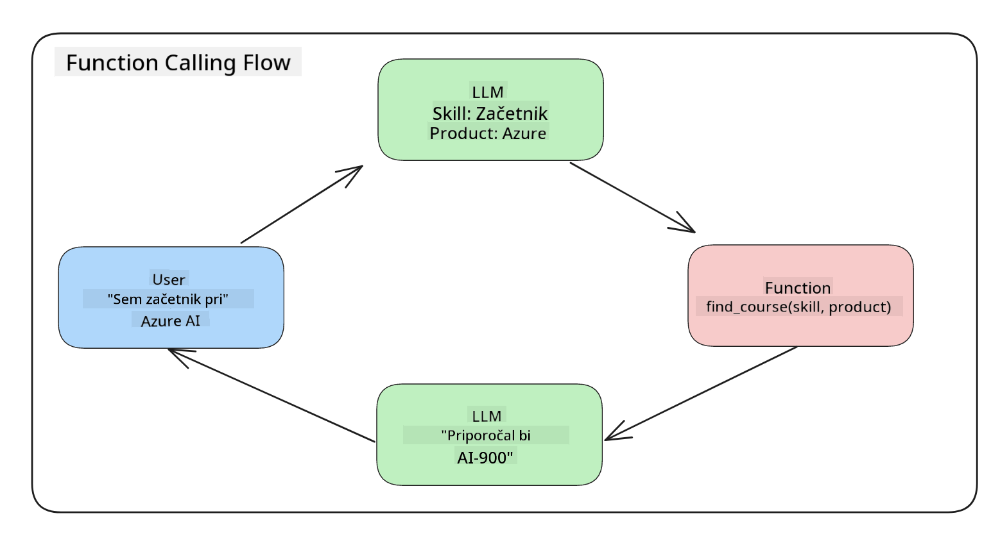
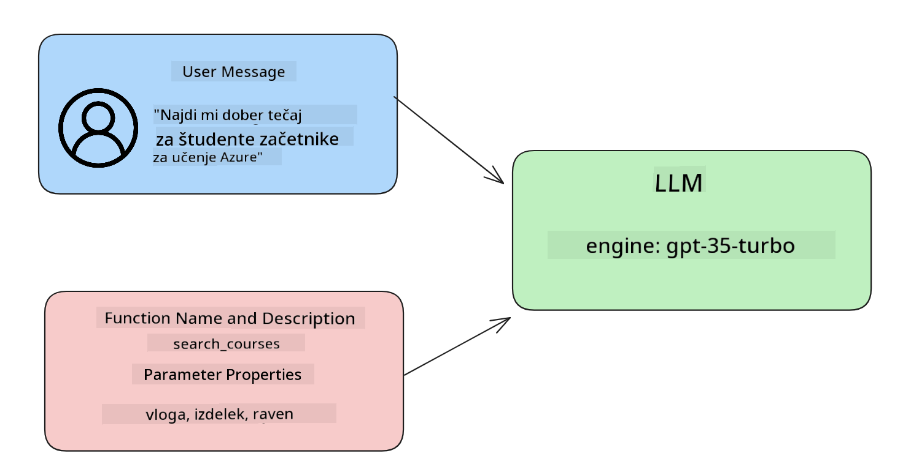

<!--
CO_OP_TRANSLATOR_METADATA:
{
  "original_hash": "77a48a201447be19aa7560706d6f93a0",
  "translation_date": "2025-06-25T20:05:17+00:00",
  "source_file": "11-integrating-with-function-calling/README.md",
  "language_code": "sl"
}
-->
# Integracija s klicem funkcij

Naučili ste se že kar nekaj stvari v prejšnjih lekcijah. Vendar pa lahko še izboljšamo. Nekatere stvari, ki jih lahko obravnavamo, so, kako lahko dobimo bolj dosleden format odgovora, da bo lažje delati z odgovorom v nadaljevanju. Prav tako bi morda želeli dodati podatke iz drugih virov, da bi še bolj obogatili našo aplikacijo.

Zgoraj omenjene težave so tiste, ki jih želi ta poglavje obravnavati.

## Uvod

Ta lekcija bo pokrivala:

- Razložiti, kaj je klic funkcij in njegove primere uporabe.
- Ustvarjanje klica funkcije z uporabo Azure OpenAI.
- Kako integrirati klic funkcije v aplikacijo.

## Cilji učenja

Do konca te lekcije boste lahko:

- Razložiti namen uporabe klica funkcij.
- Nastaviti klic funkcije z uporabo Azure OpenAI Service.
- Oblikovati učinkovite klice funkcij za primer uporabe vaše aplikacije.

## Scenarij: Izboljšanje našega klepetalnega robota s funkcijami

Za to lekcijo želimo zgraditi funkcijo za naš startup v izobraževanju, ki omogoča uporabnikom uporabo klepetalnega robota za iskanje tehničnih tečajev. Priporočili bomo tečaje, ki ustrezajo njihovi ravni znanja, trenutni vlogi in tehnologiji, ki jih zanima.

Za dokončanje tega scenarija bomo uporabili kombinacijo:

- `Azure OpenAI` za ustvarjanje klepetalne izkušnje za uporabnika.
- `Microsoft Learn Catalog API` za pomoč uporabnikom pri iskanju tečajev na podlagi zahtev uporabnika.
- `Function Calling` za prevzem uporabnikove poizvedbe in pošiljanje funkciji za izvedbo API zahteve.

Za začetek si poglejmo, zakaj bi sploh želeli uporabiti klic funkcij:

## Zakaj klic funkcij

Pred klicem funkcij so bili odgovori iz LLM neurejeni in nedosledni. Razvijalci so morali pisati kompleksno kodo za preverjanje, da bi lahko obvladali vsako variacijo odgovora. Uporabniki niso mogli dobiti odgovorov, kot je "Kakšno je trenutno vreme v Stockholmu?". To je zato, ker so bili modeli omejeni na čas, ko so bili podatki usposobljeni.

Klic funkcij je funkcija storitve Azure OpenAI, ki premaguje naslednje omejitve:

- **Dosleden format odgovora**. Če lahko bolje nadzorujemo format odgovora, lahko lažje integriramo odgovor v druge sisteme.
- **Zunanji podatki**. Sposobnost uporabe podatkov iz drugih virov aplikacije v kontekstu klepeta.

## Ilustracija problema skozi scenarij

> Priporočamo, da uporabite [vključen zvezek](../../../11-integrating-with-function-calling/python/aoai-assignment.ipynb), če želite zagnati spodnji scenarij. Lahko pa tudi samo berete naprej, saj poskušamo ilustrirati problem, kjer lahko funkcije pomagajo pri reševanju problema.

Poglejmo si primer, ki ponazarja problem formata odgovora:

Recimo, da želimo ustvariti bazo podatkov o študentih, da jim lahko predlagamo pravi tečaj. Spodaj imamo dva opisa študentov, ki sta si zelo podobna v podatkih, ki jih vsebujeta.

1. Ustvarite povezavo z našim virom Azure OpenAI:

   ```python
   import os
   import json
   from openai import AzureOpenAI
   from dotenv import load_dotenv
   load_dotenv()

   client = AzureOpenAI(
   api_key=os.environ['AZURE_OPENAI_API_KEY'],  # this is also the default, it can be omitted
   api_version = "2023-07-01-preview"
   )

   deployment=os.environ['AZURE_OPENAI_DEPLOYMENT']
   ```

   Spodaj je nekaj Python kode za konfiguracijo naše povezave z Azure OpenAI, kjer nastavimo `api_type`, `api_base`, `api_version` and `api_key`.

1. Creating two student descriptions using variables `student_1_description` and `student_2_description`.

   ```python
   student_1_description="Emily Johnson is a sophomore majoring in computer science at Duke University. She has a 3.7 GPA. Emily is an active member of the university's Chess Club and Debate Team. She hopes to pursue a career in software engineering after graduating."

   student_2_description = "Michael Lee is a sophomore majoring in computer science at Stanford University. He has a 3.8 GPA. Michael is known for his programming skills and is an active member of the university's Robotics Club. He hopes to pursue a career in artificial intelligence after finishing his studies."
   ```

   Želimo poslati zgornje opise študentov LLM, da razčleni podatke. Ti podatki se lahko kasneje uporabijo v naši aplikaciji in pošljejo API-ju ali shranijo v bazo podatkov.

1. Ustvarimo dva enaka poziva, v katerih LLM-ju povemo, katere informacije nas zanimajo:

   ```python
   prompt1 = f'''
   Please extract the following information from the given text and return it as a JSON object:

   name
   major
   school
   grades
   club

   This is the body of text to extract the information from:
   {student_1_description}
   '''

   prompt2 = f'''
   Please extract the following information from the given text and return it as a JSON object:

   name
   major
   school
   grades
   club

   This is the body of text to extract the information from:
   {student_2_description}
   '''
   ```

   Zgornji pozivi LLM-ju naročajo, naj izlušči informacije in vrne odgovor v JSON formatu.

1. Po nastavitvi pozivov in povezave z Azure OpenAI bomo zdaj poslali pozive LLM z uporabo `openai.ChatCompletion`. We store the prompt in the `messages` variable and assign the role to `user`. To je za posnemanje sporočila, ki ga uporabnik piše klepetalnemu robotu.

   ```python
   # response from prompt one
   openai_response1 = client.chat.completions.create(
   model=deployment,
   messages = [{'role': 'user', 'content': prompt1}]
   )
   openai_response1.choices[0].message.content

   # response from prompt two
   openai_response2 = client.chat.completions.create(
   model=deployment,
   messages = [{'role': 'user', 'content': prompt2}]
   )
   openai_response2.choices[0].message.content
   ```

Zdaj lahko pošljemo obe zahtevi LLM in preučimo prejeti odgovor tako, da ga najdemo na naslednji način `openai_response1['choices'][0]['message']['content']`.

1. Lastly, we can convert the response to JSON format by calling `json.loads`:

   ```python
   # Loading the response as a JSON object
   json_response1 = json.loads(openai_response1.choices[0].message.content)
   json_response1
   ```

   Odgovor 1:

   ```json
   {
     "name": "Emily Johnson",
     "major": "computer science",
     "school": "Duke University",
     "grades": "3.7",
     "club": "Chess Club"
   }
   ```

   Odgovor 2:

   ```json
   {
     "name": "Michael Lee",
     "major": "computer science",
     "school": "Stanford University",
     "grades": "3.8 GPA",
     "club": "Robotics Club"
   }
   ```

   Čeprav so pozivi enaki in so opisi podobni, vidimo vrednosti `Grades` property formatted differently, as we can sometimes get the format `3.7` or `3.7 GPA` for example.

   This result is because the LLM takes unstructured data in the form of the written prompt and returns also unstructured data. We need to have a structured format so that we know what to expect when storing or using this data

So how do we solve the formatting problem then? By using functional calling, we can make sure that we receive structured data back. When using function calling, the LLM does not actually call or run any functions. Instead, we create a structure for the LLM to follow for its responses. We then use those structured responses to know what function to run in our applications.



We can then take what is returned from the function and send this back to the LLM. The LLM will then respond using natural language to answer the user's query.

## Use Cases for using function calls

There are many different use cases where function calls can improve your app like:

- **Calling External Tools**. Chatbots are great at providing answers to questions from users. By using function calling, the chatbots can use messages from users to complete certain tasks. For example, a student can ask the chatbot to "Send an email to my instructor saying I need more assistance with this subject". This can make a function call to `send_email(to: string, body: string)`

- **Create API or Database Queries**. Users can find information using natural language that gets converted into a formatted query or API request. An example of this could be a teacher who requests "Who are the students that completed the last assignment" which could call a function named `get_completed(student_name: string, assignment: int, current_status: string)`

- **Creating Structured Data**. Users can take a block of text or CSV and use the LLM to extract important information from it. For example, a student can convert a Wikipedia article about peace agreements to create AI flashcards. This can be done by using a function called `get_important_facts(agreement_name: string, date_signed: string, parties_involved: list)`

## Creating Your First Function Call

The process of creating a function call includes 3 main steps:

1. **Calling** the Chat Completions API with a list of your functions and a user message.
2. **Reading** the model's response to perform an action i.e. execute a function or API Call.
3. **Making** another call to Chat Completions API with the response from your function to use that information to create a response to the user.



### Step 1 - creating messages

The first step is to create a user message. This can be dynamically assigned by taking the value of a text input or you can assign a value here. If this is your first time working with the Chat Completions API, we need to define the `role` and the `content` of the message.

The `role` can be either `system` (creating rules), `assistant` (the model) or `user` (the end-user). For function calling, we will assign this as `user` in primer vprašanja.

```python
messages= [ {"role": "user", "content": "Find me a good course for a beginner student to learn Azure."} ]
```

Z dodelitvijo različnih vlog je LLM-ju jasno, ali sistem nekaj pravi ali uporabnik, kar pomaga graditi zgodovino pogovora, na kateri lahko LLM gradi.

### Korak 2 - ustvarjanje funkcij

Nato bomo definirali funkcijo in parametre te funkcije. Tukaj bomo uporabili samo eno funkcijo, imenovano `search_courses` but you can create multiple functions.

> **Important** : Functions are included in the system message to the LLM and will be included in the amount of available tokens you have available.

Below, we create the functions as an array of items. Each item is a function and has properties `name`, `description` and `parameters`:

```python
functions = [
   {
      "name":"search_courses",
      "description":"Retrieves courses from the search index based on the parameters provided",
      "parameters":{
         "type":"object",
         "properties":{
            "role":{
               "type":"string",
               "description":"The role of the learner (i.e. developer, data scientist, student, etc.)"
            },
            "product":{
               "type":"string",
               "description":"The product that the lesson is covering (i.e. Azure, Power BI, etc.)"
            },
            "level":{
               "type":"string",
               "description":"The level of experience the learner has prior to taking the course (i.e. beginner, intermediate, advanced)"
            }
         },
         "required":[
            "role"
         ]
      }
   }
]
```

Poglejmo si podrobneje vsako instanco funkcije:

- `name` - The name of the function that we want to have called.
- `description` - This is the description of how the function works. Here it's important to be specific and clear.
- `parameters` - A list of values and format that you want the model to produce in its response. The parameters array consists of items where the items have the following properties:
  1.  `type` - The data type of the properties will be stored in.
  1.  `properties` - List of the specific values that the model will use for its response
      1. `name` - The key is the name of the property that the model will use in its formatted response, for example, `product`.
      1. `type` - The data type of this property, for example, `string`.
      1. `description` - Description of the specific property.

There's also an optional property `required` - required property for the function call to be completed.

### Step 3 - Making the function call

After defining a function, we now need to include it in the call to the Chat Completion API. We do this by adding `functions` to the request. In this case `functions=functions`.

There is also an option to set `function_call` to `auto`. This means we will let the LLM decide which function should be called based on the user message rather than assigning it ourselves.

Here's some code below where we call `ChatCompletion.create`, note how we set `functions=functions` and `function_call="auto"` in s tem LLM-ju dajemo možnost, kdaj naj pokliče funkcije, ki jih zagotavljamo:

```python
response = client.chat.completions.create(model=deployment,
                                        messages=messages,
                                        functions=functions,
                                        function_call="auto")

print(response.choices[0].message)
```

Odgovor, ki se zdaj vrača, izgleda tako:

```json
{
  "role": "assistant",
  "function_call": {
    "name": "search_courses",
    "arguments": "{\n  \"role\": \"student\",\n  \"product\": \"Azure\",\n  \"level\": \"beginner\"\n}"
  }
}
```

Tukaj lahko vidimo, kako funkcija `search_courses` was called and with what arguments, as listed in the `arguments` property in the JSON response.

The conclusion the LLM was able to find the data to fit the arguments of the function as it was extracting it from the value provided to the `messages` parameter in the chat completion call. Below is a reminder of the `messages` vrednost:

```python
messages= [ {"role": "user", "content": "Find me a good course for a beginner student to learn Azure."} ]
```

Kot lahko vidite, `student`, `Azure` and `beginner` was extracted from `messages` and set as input to the function. Using functions this way is a great way to extract information from a prompt but also to provide structure to the LLM and have reusable functionality.

Next, we need to see how we can use this in our app.

## Integrating Function Calls into an Application

After we have tested the formatted response from the LLM, we can now integrate this into an application.

### Managing the flow

To integrate this into our application, let's take the following steps:

1. First, let's make the call to the OpenAI services and store the message in a variable called `response_message`.

   ```python
   response_message = response.choices[0].message
   ```

1. Zdaj bomo definirali funkcijo, ki bo klicala Microsoft Learn API za pridobitev seznama tečajev:

   ```python
   import requests

   def search_courses(role, product, level):
     url = "https://learn.microsoft.com/api/catalog/"
     params = {
        "role": role,
        "product": product,
        "level": level
     }
     response = requests.get(url, params=params)
     modules = response.json()["modules"]
     results = []
     for module in modules[:5]:
        title = module["title"]
        url = module["url"]
        results.append({"title": title, "url": url})
     return str(results)
   ```

   Opazite, kako zdaj ustvarimo dejansko Python funkcijo, ki se ujema z imeni funkcij, predstavljenimi v `functions` variable. We're also making real external API calls to fetch the data we need. In this case, we go against the Microsoft Learn API to search for training modules.

Ok, so we created `functions` variables and a corresponding Python function, how do we tell the LLM how to map these two together so our Python function is called?

1. To see if we need to call a Python function, we need to look into the LLM response and see if `function_call` je del tega in pokličemo izpostavljeno funkcijo. Tukaj je, kako lahko naredite omenjeni pregled spodaj:

   ```python
   # Check if the model wants to call a function
   if response_message.function_call.name:
    print("Recommended Function call:")
    print(response_message.function_call.name)
    print()

    # Call the function.
    function_name = response_message.function_call.name

    available_functions = {
            "search_courses": search_courses,
    }
    function_to_call = available_functions[function_name]

    function_args = json.loads(response_message.function_call.arguments)
    function_response = function_to_call(**function_args)

    print("Output of function call:")
    print(function_response)
    print(type(function_response))


    # Add the assistant response and function response to the messages
    messages.append( # adding assistant response to messages
        {
            "role": response_message.role,
            "function_call": {
                "name": function_name,
                "arguments": response_message.function_call.arguments,
            },
            "content": None
        }
    )
    messages.append( # adding function response to messages
        {
            "role": "function",
            "name": function_name,
            "content":function_response,
        }
    )
   ```

   Ti trije vrstice zagotavljajo, da izluščimo ime funkcije, argumente in izvedemo klic:

   ```python
   function_to_call = available_functions[function_name]

   function_args = json.loads(response_message.function_call.arguments)
   function_response = function_to_call(**function_args)
   ```

   Spodaj je izpis našega kode:

   **Izhod**

   ```Recommended Function call:
   {
     "name": "search_courses",
     "arguments": "{\n  \"role\": \"student\",\n  \"product\": \"Azure\",\n  \"level\": \"beginner\"\n}"
   }

   Output of function call:
   [{'title': 'Describe concepts of cryptography', 'url': 'https://learn.microsoft.com/training/modules/describe-concepts-of-cryptography/?
   WT.mc_id=api_CatalogApi'}, {'title': 'Introduction to audio classification with TensorFlow', 'url': 'https://learn.microsoft.com/en-
   us/training/modules/intro-audio-classification-tensorflow/?WT.mc_id=api_CatalogApi'}, {'title': 'Design a Performant Data Model in Azure SQL
   Database with Azure Data Studio', 'url': 'https://learn.microsoft.com/training/modules/design-a-data-model-with-ads/?
   WT.mc_id=api_CatalogApi'}, {'title': 'Getting started with the Microsoft Cloud Adoption Framework for Azure', 'url':
   'https://learn.microsoft.com/training/modules/cloud-adoption-framework-getting-started/?WT.mc_id=api_CatalogApi'}, {'title': 'Set up the
   Rust development environment', 'url': 'https://learn.microsoft.com/training/modules/rust-set-up-environment/?WT.mc_id=api_CatalogApi'}]
   <class 'str'>
   ```

1. Zdaj bomo poslali posodobljeno sporočilo, `messages`, LLM-ju, da bomo prejeli odgovor v naravnem jeziku namesto API JSON formatiranega odgovora.

   ```python
   print("Messages in next request:")
   print(messages)
   print()

   second_response = client.chat.completions.create(
      messages=messages,
      model=deployment,
      function_call="auto",
      functions=functions,
      temperature=0
         )  # get a new response from GPT where it can see the function response


   print(second_response.choices[0].message)
   ```

   **Izhod**

   ```python
   {
     "role": "assistant",
     "content": "I found some good courses for beginner students to learn Azure:\n\n1. [Describe concepts of cryptography] (https://learn.microsoft.com/training/modules/describe-concepts-of-cryptography/?WT.mc_id=api_CatalogApi)\n2. [Introduction to audio classification with TensorFlow](https://learn.microsoft.com/training/modules/intro-audio-classification-tensorflow/?WT.mc_id=api_CatalogApi)\n3. [Design a Performant Data Model in Azure SQL Database with Azure Data Studio](https://learn.microsoft.com/training/modules/design-a-data-model-with-ads/?WT.mc_id=api_CatalogApi)\n4. [Getting started with the Microsoft Cloud Adoption Framework for Azure](https://learn.microsoft.com/training/modules/cloud-adoption-framework-getting-started/?WT.mc_id=api_CatalogApi)\n5. [Set up the Rust development environment](https://learn.microsoft.com/training/modules/rust-set-up-environment/?WT.mc_id=api_CatalogApi)\n\nYou can click on the links to access the courses."
   }

   ```

## Naloga

Za nadaljevanje vašega učenja Azure OpenAI Function Calling lahko zgradite:

- Več parametrov funkcije, ki bi lahko pomagali učencem najti več tečajev.
- Ustvarite še en klic funkcije, ki vzame več informacij od učenca, kot je njihov materni jezik.
- Ustvarite ravnanje z napakami, ko klic funkcije in/ali API klic ne vrne nobenih primernih tečajev.

Namig: Sledite strani [Learn API referenčna dokumentacija](https://learn.microsoft.com/training/support/catalog-api-developer-reference?WT.mc_id=academic-105485-koreyst), da vidite, kako in kje so ti podatki na voljo.

## Odlično delo! Nadaljujte z učenjem

Po zaključku te lekcije si oglejte našo [Generativno AI zbirko učenja](https://aka.ms/genai-collection?WT.mc_id=academic-105485-koreyst), da nadaljujete z nadgrajevanjem vašega znanja o generativni umetni inteligenci!

Pojdite na Lekcijo 12, kjer bomo pogledali, kako [oblikovati UX za AI aplikacije](../12-designing-ux-for-ai-applications/README.md?WT.mc_id=academic-105485-koreyst)!

**Omejitev odgovornosti**:  
Ta dokument je bil preveden z uporabo storitve AI prevajanja [Co-op Translator](https://github.com/Azure/co-op-translator). Čeprav si prizadevamo za natančnost, prosimo, upoštevajte, da lahko avtomatizirani prevodi vsebujejo napake ali netočnosti. Izvirni dokument v njegovem maternem jeziku je treba obravnavati kot avtoritativni vir. Za ključne informacije je priporočljivo profesionalno človeško prevajanje. Ne odgovarjamo za morebitna nesporazumevanja ali napačne razlage, ki bi nastale zaradi uporabe tega prevoda.