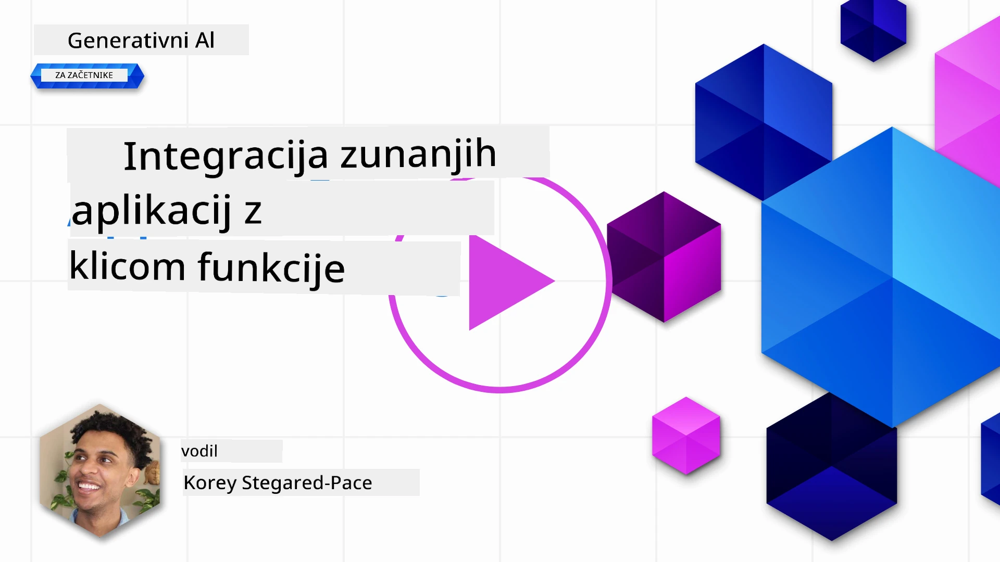
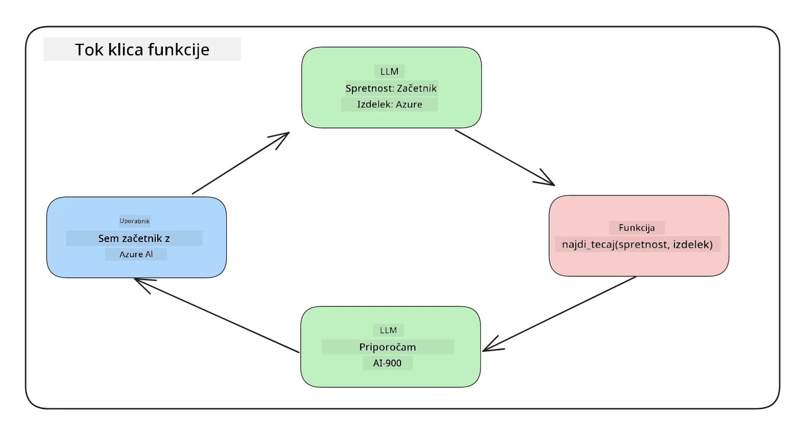
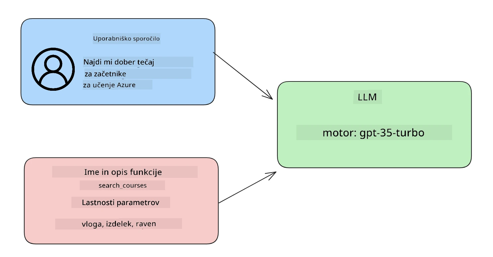

# Integracija z klicem funkcij

[](https://youtu.be/DgUdCLX8qYQ?si=f1ouQU5HQx6F8Gl2)

Do zdaj ste se v prejšnjih lekcijah veliko naučili. Vendar se lahko še dodatno izboljšamo. Nekaj stvari, ki jih lahko obravnavamo, je, kako pridobiti bolj konsistenten format odziva, da bo lažje delati z odzivom v nadaljnjih korakih. Prav tako bomo morda želeli dodati podatke iz drugih virov za nadaljnje obogatitev naše aplikacije.

Zgoraj omenjene težave so tisto, čemur se ta poglavje posveča.

## Uvod

Ta lekcija bo zajemala:

- Razlago, kaj je klic funkcije in njegovi primeri uporabe.
- Ustvarjanje klica funkcije z uporabo Azure OpenAI.
- Kako integrirati klic funkcije v aplikacijo.

## Cilji učenja

Do konca te lekcije boste lahko:

- Razložiti namen uporabe klica funkcij.
- Nastaviti klic funkcije z uporabo Azure OpenAI Service.
- Oblikovati učinkovite klice funkcij za primer uporabe vaše aplikacije.

## Scenarij: Izboljšanje našega klepetalnega robota s funkcijami

Za to lekcijo želimo zgraditi funkcijo za naš izobraževalni startup, ki uporabnikom omogoča uporabo klepetalnega robota za iskanje tehničnih tečajev. Priporočali bomo tečaje, ki ustrezajo njihovi ravni znanja, trenutni vlogi in zanimanju za tehnologijo.

Za dokončanje tega scenarija bomo uporabili kombinacijo:

- `Azure OpenAI` za ustvarjanje klepetalnega doživetja za uporabnika.
- `Microsoft Learn Catalog API` za pomoč uporabnikom pri iskanju tečajev glede na uporabniško zahtevo.
- `Function Calling` za prevzem uporabniških poizvedb in pošiljanje funkciji za izvedbo API zahteve.

Za začetek si oglejmo, zakaj bi želeli uporabljati klic funkcij:

## Zakaj klic funkcij

Pred klicem funkcij so odgovori iz LLM bili nestrukturirani in nekonsistentni. Razvijalci so morali pisati kompleksno kodo za validacijo, da so lahko obdelali vsako različico odgovora. Uporabniki niso mogli dobiti odgovorov na vprašanja, kot je "Kakšno je trenutno vreme v Stockholmu?". To je zato, ker so bili modeli omejeni na čas, ko so bili podatki naučeni.

Klic funkcij je funkcija storitve Azure OpenAI, ki odpravlja naslednje omejitve:

- **Konsistenten format odgovora**. Če lahko bolje nadzorujemo format odgovora, lahko lažje integriramo odgovor v druge sisteme.
- **Zunanji podatki**. Možnost uporabe podatkov iz drugih virov aplikacije v kontekstu klepeta.

## Ponazoritev problema s scenarijem

> Priporočamo uporabo [priloženega zvezka](./python/aoai-assignment.ipynb?WT.mc_id=academic-105485-koreyst), če želite zagnati spodnji scenarij. Lahko pa preprosto berete naprej, saj poskušamo prikazati problem, ki ga lahko funkcije pomagajo rešiti.

Poglejmo primer, ki prikazuje težavo formata odgovora:

Recimo, da želimo ustvariti podatkovno bazo podatkov študentov, da jim lahko predlagamo pravi tečaj. Spodaj imamo dva opisa študentov, ki sta zelo podobna glede podatkov, ki jih vsebujeta.

1. Ustvarite povezavo do našega vira Azure OpenAI:

   ```python
   import os
   import json
   from openai import OpenAI
   from dotenv import load_dotenv
   load_dotenv()

   # API za Odzive je na voljo preko Azure OpenAI (Microsoft Foundry) v1
   # končne točke, zato OpenAI odjemalca usmerimo na <your-endpoint>/openai/v1/.
   endpoint = os.environ['AZURE_OPENAI_ENDPOINT']
   client = OpenAI(
   api_key=os.environ['AZURE_OPENAI_API_KEY'],
   base_url=f"{endpoint.rstrip('/')}/openai/v1/",
   )

   deployment=os.environ['AZURE_OPENAI_DEPLOYMENT']
   ```

   Spodaj je nekaj Pythonske kode za konfiguracijo naše povezave do Azure OpenAI. Ker uporabljamo v1 endpoint, moramo nastaviti samo `api_key` in `base_url` (ni potrebna verzija `api_version`).

1. Ustvarjanje dveh opisov študentov z uporabo spremenljivk `student_1_description` in `student_2_description`.

   ```python
   student_1_description="Emily Johnson is a sophomore majoring in computer science at Duke University. She has a 3.7 GPA. Emily is an active member of the university's Chess Club and Debate Team. She hopes to pursue a career in software engineering after graduating."

   student_2_description = "Michael Lee is a sophomore majoring in computer science at Stanford University. He has a 3.8 GPA. Michael is known for his programming skills and is an active member of the university's Robotics Club. He hopes to pursue a career in artificial intelligence after finishing his studies."
   ```

   Želimo poslati zgoraj navedene opise študentov LLM, da razčleni podatke. Te podatke bomo pozneje uporabili v naši aplikaciji in jih poslali v API ali shranili v bazo podatkov.

1. Ustvarimo dva enaka poziva, v katerih navodimo LLM, katere informacije nas zanimajo:

   ```python
   prompt1 = f'''
   Please extract the following information from the given text and return it as a JSON object:

   name
   major
   school
   grades
   club

   This is the body of text to extract the information from:
   {student_1_description}
   '''

   prompt2 = f'''
   Please extract the following information from the given text and return it as a JSON object:

   name
   major
   school
   grades
   club

   This is the body of text to extract the information from:
   {student_2_description}
   '''
   ```

   Zgornji pozivi navodijo LLM, naj izlušči informacije in vrne odgovor v formatu JSON.

1. Po nastavitvi pozivov in povezave do Azure OpenAI bomo zdaj poslali pozive LLM z uporabo `client.responses.create`. Shranimo poziv v spremenljivko `input` in nastavimo vlogo na `user`. To je za simulacijo sporočila uporabnika, ki je poslano klepetalnemu robotu.

   ```python
   # odgovor iz prvega poziva
   openai_response1 = client.responses.create(
   model=deployment,
   input = [{'role': 'user', 'content': prompt1}],
   store=False,
   )
   openai_response1.output_text

   # odgovor iz drugega poziva
   openai_response2 = client.responses.create(
   model=deployment,
   input = [{'role': 'user', 'content': prompt2}],
   store=False,
   )
   openai_response2.output_text
   ```

Zdaj lahko pošljemo obe zahtevi LLM in preučimo prejeti odgovor z iskanjem npr. `openai_response1.output_text`.

1. Nazadnje lahko odgovor pretvorimo v format JSON z uporabo `json.loads`:

   ```python
   # Nalaganje odgovora kot JSON objekt
   json_response1 = json.loads(openai_response1.output_text)
   json_response1
   ```

   Odgovor 1:

   ```json
   {
     "name": "Emily Johnson",
     "major": "computer science",
     "school": "Duke University",
     "grades": "3.7",
     "club": "Chess Club"
   }
   ```

   Odgovor 2:

   ```json
   {
     "name": "Michael Lee",
     "major": "computer science",
     "school": "Stanford University",
     "grades": "3.8 GPA",
     "club": "Robotics Club"
   }
   ```

   Čeprav so pozivi enaki in so opisi podobni, vidimo, da so vrednosti lastnosti `Grades` formatirane različno, saj lahko včasih dobimo format `3.7` ali pa denimo `3.7 GPA`.

   Ta rezultat je posledica tega, da LLM vzame nestrukturirane podatke v obliki napisanega poziva in vrne prav tako nestrukturirane podatke. Potrebujemo strukturiran format, da vemo, kaj pričakovati pri shranjevanju ali uporabi teh podatkov.

Kako torej rešiti težavo oblikovanja? Z uporabo klica funkcij lahko zagotovimo, da prejmemo nazaj strukturirane podatke. Pri uporabi klica funkcij LLM dejansko ne kliče ali izvaja nobenih funkcij. Namesto tega ustvarimo strukturo, ki jo LLM sledi za svoje odgovore. Nato te strukturirane odgovore uporabimo za določanje, katero funkcijo naj izvede naša aplikacija.



Nato lahko vzamemo, kar funkcija vrne, in to pošljemo nazaj LLM. LLM bo nato odgovoril v naravnem jeziku in odgovoril na uporabnikovo poizvedbo.

## Primeri uporabe klicev funkcij

Obstaja veliko različnih primerov uporabe, kjer lahko klici funkcij izboljšajo vašo aplikacijo, na primer:

- **Klicanje zunanjih orodij**. Klepetalni roboti so odlični pri zagotavljanju odgovorov na vprašanja uporabnikov. Z uporabo klica funkcij lahko klepetalni roboti uporabijo sporočila uporabnikov za izvedbo določenih nalog. Na primer, študent lahko vpraša klepetalnega robota, naj "Pošlje e-pošto mojemu inštruktorju in pove, da potrebujem več pomoči pri tem predmetu". To lahko sproži klic funkcije `send_email(to: string, body: string)`.

- **Ustvarjanje API ali poizvedb v bazi podatkov**. Uporabniki lahko najdejo informacije z uporabo naravnega jezika, ki se nato pretvori v formatirano poizvedbo ali API zahtevo. Primer tega je učitelj, ki vpraša "Kdo so študentje, ki so opravili zadnjo domačo nalogo", kar lahko kliče funkcijo `get_completed(student_name: string, assignment: int, current_status: string)`.

- **Ustvarjanje strukturiranih podatkov**. Uporabniki lahko vzamejo besedilni blok ali CSV in uporabijo LLM za izluščitev pomembnih informacij. Na primer, študent lahko pretvori Wikipedijin članek o mirovnih sporazumih v AI flash kartice. To lahko stori z uporabo funkcije z imenom `get_important_facts(agreement_name: string, date_signed: string, parties_involved: list)`.

## Ustvarjanje prvega klica funkcije

Postopek ustvarjanja klica funkcije vključuje 3 glavne korake:

1. **Klicanje** Responses API z seznamom vaših funkcij (orodij) in sporočilom uporabnika.
2. **Branje** odgovora modela za izvedbo dejanja, npr. izvršitev funkcije ali API klica.
3. **Izvedba** dodatnega klica na Responses API z odgovorom vaše funkcije, da uporabite informacije za ustvarjanje odgovora uporabniku.



### Korak 1 - ustvarjanje sporočil

Prvi korak je ustvariti sporočilo uporabnika. To je mogoče dinamično dodeliti s prejemom vrednosti vnosnega polja ali pa tukaj določite vrednost. Če to počnete prvič z Responses API, moramo definirati `role` in `content` sporočila.

`role` je lahko `system` (določa pravila), `assistant` (model) ali `user` (končni uporabnik). Za klic funkcije bomo dodelili `user` in primer vprašanja.

```python
messages= [ {"role": "user", "content": "Find me a good course for a beginner student to learn Azure."} ]
```

Z dodeljevanjem različnih vlog LLM jasno sporočimo, ali nekaj govori sistem ali uporabnik, kar pomaga ustvariti zgodovino pogovora, na katero se lahko LLM sklicuje.

### Korak 2 - ustvarjanje funkcij

Nato bomo definirali funkcijo in njene parametre. Tukaj bomo uporabili le eno funkcijo imenovano `search_courses`, lahko pa ustvarite več funkcij.

> **Pomembno** : Funkcije so vključene v sistemsko sporočilo za LLM in se štejejo v razpoložljive tokene.

Spodaj ustvarjamo funkcije kot niz elementov. Vsak element je orodje v ploskem Responses API formatu, z lastnostmi `type`, `name`, `description` in `parameters`:

```python
functions = [
   {
      "type":"function",
      "name":"search_courses",
      "description":"Retrieves courses from the search index based on the parameters provided",
      "parameters":{
         "type":"object",
         "properties":{
            "role":{
               "type":"string",
               "description":"The role of the learner (i.e. developer, data scientist, student, etc.)"
            },
            "product":{
               "type":"string",
               "description":"The product that the lesson is covering (i.e. Azure, Power BI, etc.)"
            },
            "level":{
               "type":"string",
               "description":"The level of experience the learner has prior to taking the course (i.e. beginner, intermediate, advanced)"
            }
         },
         "required":[
            "role"
         ]
      }
   }
]
```

Podrobneje opišimo posamezne funkcije:

- `name` - Ime funkcije, ki jo želimo klicati.
- `description` - Opis delovanja funkcije. Tu je pomembno biti specifičen in jasen.
- `parameters` - Seznam vrednosti in formata, ki jih želi model vrniti v svojem odgovoru. Polje parametrov vsebuje elemente z naslednjimi lastnostmi:
  1. `type` - Podatkovni tip lastnosti, ki jo bo shranjeno.
  1. `properties` - Seznam specifičnih vrednosti, ki jih bo model uporabil v oblikovanem odgovoru.
      1. `name` - Ključ je ime lastnosti, ki jo bo model uporabil v svojem formatiranem odgovoru, npr. `product`.
      1. `type` - Podatkovni tip te lastnosti, npr. `string`.
      1. `description` - Opis specifične lastnosti.

Obstaja tudi neobvezna lastnost `required` - obvezna lastnost za dokončanje klica funkcije.

### Korak 3 - izvedba klica funkcije

Po definiranju funkcije jo moramo vključiti v klic na Responses API. To naredimo tako, da dodamo parameter `tools` zahtevku. V tem primeru `tools=functions`.

Na voljo je tudi možnost nastavitve `tool_choice` na `auto`. To pomeni, da bomo dovolili LLM, da odloči, katero funkcijo mora poklicati na podlagi sporočila uporabnika, namesto da bi jo sami določili.

Spodaj je koda, kjer kliče `client.responses.create`, opazujte, kako nastavimo `tools=functions` in `tool_choice="auto"`, kar LLM omogoči, da se odloči, kdaj poklicati funkcije, ki jih nudimo:

```python
response = client.responses.create(model=deployment,
                                        input=messages,
                                        tools=functions,
                                        tool_choice="auto",
                                        store=False)

print(response.output)
```

V povratnem odgovoru zdaj prejmete element `function_call` v `response.output`, ki izgleda takole:

```json
{
  "type": "function_call",
  "name": "search_courses",
  "call_id": "call_abc123",
  "arguments": "{\n  \"role\": \"student\",\n  \"product\": \"Azure\",\n  \"level\": \"beginner\"\n}"
}
```

Tukaj vidimo, kako je bila funkcija `search_courses` klicana in s kakšnimi argumenti, kot je navedeno v lastnosti `arguments` v JSON odgovoru.

Zaključek je, da je LLM lahko našel podatke, ki ustrezajo argumentom funkcije, saj jih je izvlekel iz vrednosti podane v parametru `input` v klicu Responses API. Spodaj je opomnik vrednosti `messages`:

```python
messages= [ {"role": "user", "content": "Find me a good course for a beginner student to learn Azure."} ]
```

Kot vidite, sta `student`, `Azure` in `beginner` bila izvlečena iz `messages` in uporabljena kot vhod za funkcijo. Uporaba funkcij na tak način je odličen način za izvleček informacij iz poziva, pa tudi za strukturiranje LLM in ponovno uporabno funkcionalnost.

Naslednji korak je, da vidimo, kako to uporabiti v naši aplikaciji.

## Integracija klicev funkcij v aplikacijo

Ko smo preizkusili oblikovan odgovor iz LLM, ga lahko integriramo v aplikacijo.

### Upravljanje poteka

Za integracijo v aplikacijo sledimo naslednjim korakom:

1. Najprej izvedemo klic na OpenAI storitve in iz odziva `output` izvlečemo elemente klica funkcije.

   ```python
   response_items = response.output
   tool_calls = [item for item in response_items if item.type == "function_call"]
   ```

1. Nato definiramo funkcijo, ki bo klicala Microsoft Learn API za pridobitev seznama tečajev:

   ```python
   import requests

   def search_courses(role, product, level):
     url = "https://learn.microsoft.com/api/catalog/"
     params = {
        "role": role,
        "product": product,
        "level": level
     }
     response = requests.get(url, params=params)
     modules = response.json()["modules"]
     results = []
     for module in modules[:5]:
        title = module["title"]
        url = module["url"]
        results.append({"title": title, "url": url})
     return str(results)
   ```

   Opazujte, kako ustvarjamo dejansko Python funkcijo, ki je povezana z imeni funkcij v spremenljivki `functions`. Prav tako izvajamo zunanje API klice za pridobitev potrebnih podatkov. V tem primeru kličemo Microsoft Learn API za iskanje učnih modulov.

V redu, ustvarili smo spremenljivko `functions` in ustrezno Python funkcijo, kako pa povemo LLM, kako ju povežemo, da se pokliče naša Python funkcija?

1. Da vidimo, ali moramo klicati Python funkcijo, pregledamo odgovor LLM in preverimo, če je del odgovora `function_call`, ter kličemo označeno funkcijo. Tukaj je, kako to preverjanje izvedemo spodaj:

   ```python
   # Preveri, ali model želi poklicati funkcijo
   if tool_calls:
    for tool_call in tool_calls:
     print("Recommended Function call:")
     print(tool_call.name)
     print()

     # Pokliči funkcijo.
     function_name = tool_call.name

     available_functions = {
             "search_courses": search_courses,
     }
     function_to_call = available_functions[function_name]

     function_args = json.loads(tool_call.arguments)
     function_response = function_to_call(**function_args)

     print("Output of function call:")
     print(function_response)
     print(type(function_response))

     # Dodaj klic funkcije in njen rezultat nazaj v pogovor.
     # Element function_call modela je treba dodati pred njegov izhod.
     messages.append(tool_call)  # element function_call pomočnika
     messages.append( # rezultat funkcije
         {
             "type": "function_call_output",
             "call_id": tool_call.call_id,
             "output": function_response,
         }
     )
   ```

   Ti trije stavki zagotovijo, da izvlečemo ime funkcije, argumente in izvedemo klic:

   ```python
   function_to_call = available_functions[function_name]

   function_args = json.loads(tool_call.arguments)
   function_response = function_to_call(**function_args)
   ```

   Spodaj je izhod pri zagonu naše kode:

   **Izhod**

   ```Recommended Function call:
   {
     "name": "search_courses",
     "arguments": "{\n  \"role\": \"student\",\n  \"product\": \"Azure\",\n  \"level\": \"beginner\"\n}"
   }

   Output of function call:
   [{'title': 'Describe concepts of cryptography', 'url': 'https://learn.microsoft.com/training/modules/describe-concepts-of-cryptography/?
   WT.mc_id=api_CatalogApi'}, {'title': 'Introduction to audio classification with TensorFlow', 'url': 'https://learn.microsoft.com/en-
   us/training/modules/intro-audio-classification-tensorflow/?WT.mc_id=api_CatalogApi'}, {'title': 'Design a Performant Data Model in Azure SQL
   Database with Azure Data Studio', 'url': 'https://learn.microsoft.com/training/modules/design-a-data-model-with-ads/?
   WT.mc_id=api_CatalogApi'}, {'title': 'Getting started with the Microsoft Cloud Adoption Framework for Azure', 'url':
   'https://learn.microsoft.com/training/modules/cloud-adoption-framework-getting-started/?WT.mc_id=api_CatalogApi'}, {'title': 'Set up the
   Rust development environment', 'url': 'https://learn.microsoft.com/training/modules/rust-set-up-environment/?WT.mc_id=api_CatalogApi'}]
   <class 'str'>
   ```

1. Sedaj pošljemo posodobljeno sporočilo `messages` nazaj LLM, da dobimo naravnlazni odgovor namesto JSON formatiranega odgovora API.

   ```python
   print("Messages in next request:")
   print(messages)
   print()

   second_response = client.responses.create(
      input=messages,
      model=deployment,
      tool_choice="auto",
      tools=functions,
      temperature=0,
      store=False,
         )  # pridobite nov odziv iz modela, kjer lahko vidi odziv funkcije


   print(second_response.output_text)
   ```

   **Izhod**

   ```text
   I found some good courses for beginner students to learn Azure:

   1. [Describe concepts of cryptography](https://learn.microsoft.com/training/modules/describe-concepts-of-cryptography/?WT.mc_id=api_CatalogApi)
   2. [Introduction to audio classification with TensorFlow](https://learn.microsoft.com/training/modules/intro-audio-classification-tensorflow/?WT.mc_id=api_CatalogApi)
   3. [Design a Performant Data Model in Azure SQL Database with Azure Data Studio](https://learn.microsoft.com/training/modules/design-a-data-model-with-ads/?WT.mc_id=api_CatalogApi)
   4. [Getting started with the Microsoft Cloud Adoption Framework for Azure](https://learn.microsoft.com/training/modules/cloud-adoption-framework-getting-started/?WT.mc_id=api_CatalogApi)
   5. [Set up the Rust development environment](https://learn.microsoft.com/training/modules/rust-set-up-environment/?WT.mc_id=api_CatalogApi)

   You can click on the links to access the courses.
   ```

## Naloga

Za nadaljevanje učenja Azure OpenAI Function Calling lahko ustvarite:

- Več parametrov funkcije, ki lahko pomagajo učečim najti več tečajev.

- Ustvarite še en klic funkcije, ki od uporabnika zahteva več informacij, kot je njihov materni jezik
- Ustvarite obdelavo napak, ko klic funkcije in/ali klic API-ja ne vrneta primernih tečajev

Namig: Sledite strani [Learn API reference documentation](https://learn.microsoft.com/training/support/catalog-api-developer-reference?WT.mc_id=academic-105485-koreyst), da vidite, kako in kje so ti podatki na voljo.

## Odlično delo! Nadaljujte potovanje

Po končani tej lekciji si oglejte našo [zbirko za učenje generativne umetne inteligence](https://aka.ms/genai-collection?WT.mc_id=academic-105485-koreyst), da nadaljujete z nadgrajevanjem svojega znanja generativne umetne inteligence!

Pojdite na Lekcijo 12, kjer si bomo ogledali, kako [načrtovati UX za AI aplikacije](../12-designing-ux-for-ai-applications/README.md?WT.mc_id=academic-105485-koreyst)!

---

<!-- CO-OP TRANSLATOR DISCLAIMER START -->
**Omejitev odgovornosti**:
Ta dokument je bil preveden z uporabo AI prevajalske storitve [Co-op Translator](https://github.com/Azure/co-op-translator). Čeprav si prizadevamo za natančnost, vas prosimo, da upoštevate, da avtomatizirani prevodi lahko vsebujejo napake ali netočnosti. Izvirni dokument v njegovem izvirnem jeziku je treba obravnavati kot avtoritativni vir. Za kritične informacije je priporočljiv strokovni človeški prevod. Ne odgovarjamo za morebitna nesporazume ali napačne interpretacije, ki izhajajo iz uporabe tega prevoda.
<!-- CO-OP TRANSLATOR DISCLAIMER END -->