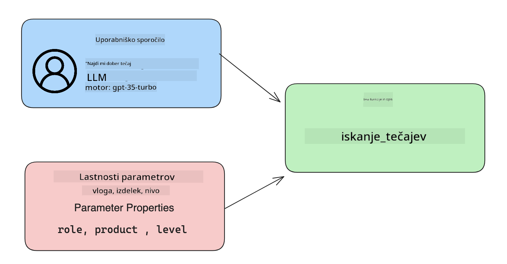

<!--
CO_OP_TRANSLATOR_METADATA:
{
  "original_hash": "f6f84f9ef2d066cd25850cab93580a50",
  "translation_date": "2025-10-18T01:39:41+00:00",
  "source_file": "11-integrating-with-function-calling/README.md",
  "language_code": "sl"
}
-->
# Integracija z uporabo klicev funkcij

[](https://youtu.be/DgUdCLX8qYQ?si=f1ouQU5HQx6F8Gl2)

V prejšnjih lekcijah ste se že veliko naučili. Vendar pa lahko še izboljšamo stvari. Nekatere težave, ki jih lahko naslovimo, vključujejo, kako pridobiti bolj dosleden format odgovorov, da bi olajšali nadaljnjo obdelavo odgovorov. Prav tako bi morda želeli dodati podatke iz drugih virov, da bi še bolj obogatili našo aplikacijo.

Te težave bomo obravnavali v tem poglavju.

## Uvod

Ta lekcija bo zajemala:

- Razlago, kaj je klic funkcij in kakšni so njegovi primeri uporabe.
- Ustvarjanje klica funkcije z uporabo Azure OpenAI.
- Kako integrirati klic funkcije v aplikacijo.

## Cilji učenja

Na koncu te lekcije boste lahko:

- Razložili namen uporabe klicev funkcij.
- Nastavili klic funkcije z uporabo storitve Azure OpenAI.
- Oblikovali učinkovite klice funkcij za potrebe vaše aplikacije.

## Scenarij: Izboljšanje našega klepetalnika s funkcijami

V tej lekciji želimo zgraditi funkcijo za naš startup na področju izobraževanja, ki uporabnikom omogoča uporabo klepetalnika za iskanje tehničnih tečajev. Priporočili bomo tečaje, ki ustrezajo njihovi ravni znanja, trenutni vlogi in zanimanju za tehnologijo.

Za dokončanje tega scenarija bomo uporabili kombinacijo:

- `Azure OpenAI` za ustvarjanje klepetalne izkušnje za uporabnika.
- `Microsoft Learn Catalog API` za pomoč uporabnikom pri iskanju tečajev na podlagi njihovih zahtev.
- `Klic funkcij` za obdelavo uporabniških poizvedb in pošiljanje teh funkcijam za izvedbo API zahtev.

Za začetek si poglejmo, zakaj bi sploh želeli uporabiti klic funkcij:

## Zakaj klic funkcij

Pred klicem funkcij so bili odgovori iz LLM (velikih jezikovnih modelov) nestrukturirani in nedosledni. Razvijalci so morali pisati zapletene kode za validacijo, da so lahko obdelali vsako različico odgovora. Uporabniki niso mogli dobiti odgovorov, kot je "Kakšno je trenutno vreme v Stockholmu?". To je zato, ker so bili modeli omejeni na čas, ko so bili podatki usposobljeni.

Klic funkcij je funkcionalnost storitve Azure OpenAI, ki premaga naslednje omejitve:

- **Dosleden format odgovorov**. Če lahko bolje nadzorujemo format odgovorov, jih lahko lažje integriramo v druge sisteme.
- **Zunanji podatki**. Možnost uporabe podatkov iz drugih virov aplikacije v kontekstu klepeta.

## Prikaz problema skozi scenarij

> Priporočamo, da uporabite [priloženo beležnico](./python/aoai-assignment.ipynb?WT.mc_id=academic-105485-koreyst), če želite izvesti spodnji scenarij. Lahko pa tudi samo preberete, saj želimo prikazati problem, ki ga lahko funkcije pomagajo rešiti.

Poglejmo primer, ki ponazarja problem formata odgovorov:

Recimo, da želimo ustvariti bazo podatkov o študentih, da bi jim lahko predlagali ustrezne tečaje. Spodaj imamo dva opisa študentov, ki sta si zelo podobna glede na podatke, ki jih vsebujeta.

1. Ustvarimo povezavo z našim virom Azure OpenAI:

   ```python
   import os
   import json
   from openai import AzureOpenAI
   from dotenv import load_dotenv
   load_dotenv()

   client = AzureOpenAI(
   api_key=os.environ['AZURE_OPENAI_API_KEY'],  # this is also the default, it can be omitted
   api_version = "2023-07-01-preview"
   )

   deployment=os.environ['AZURE_OPENAI_DEPLOYMENT']
   ```

   Spodaj je nekaj Python kode za konfiguracijo naše povezave z Azure OpenAI, kjer nastavimo `api_type`, `api_base`, `api_version` in `api_key`.

1. Ustvarimo dva opisa študentov z uporabo spremenljivk `student_1_description` in `student_2_description`.

   ```python
   student_1_description="Emily Johnson is a sophomore majoring in computer science at Duke University. She has a 3.7 GPA. Emily is an active member of the university's Chess Club and Debate Team. She hopes to pursue a career in software engineering after graduating."

   student_2_description = "Michael Lee is a sophomore majoring in computer science at Stanford University. He has a 3.8 GPA. Michael is known for his programming skills and is an active member of the university's Robotics Club. He hopes to pursue a career in artificial intelligence after finishing his studies."
   ```

   Zgornje opise študentov želimo poslati LLM, da bi analizirali podatke. Te podatke lahko kasneje uporabimo v naši aplikaciji in jih pošljemo API-ju ali shranimo v bazo podatkov.

1. Ustvarimo dve identični pozivi, v katerih LLM-ju povemo, katere informacije nas zanimajo:

   ```python
   prompt1 = f'''
   Please extract the following information from the given text and return it as a JSON object:

   name
   major
   school
   grades
   club

   This is the body of text to extract the information from:
   {student_1_description}
   '''

   prompt2 = f'''
   Please extract the following information from the given text and return it as a JSON object:

   name
   major
   school
   grades
   club

   This is the body of text to extract the information from:
   {student_2_description}
   '''
   ```

   Zgornji pozivi LLM-ju naročajo, naj izlušči informacije in vrne odgovor v formatu JSON.

1. Po nastavitvi pozivov in povezave z Azure OpenAI bomo zdaj poslali pozive LLM z uporabo `openai.ChatCompletion`. Poziv shranimo v spremenljivko `messages` in dodelimo vlogo `user`. To simulira sporočilo, ki ga uporabnik napiše klepetalniku.

   ```python
   # response from prompt one
   openai_response1 = client.chat.completions.create(
   model=deployment,
   messages = [{'role': 'user', 'content': prompt1}]
   )
   openai_response1.choices[0].message.content

   # response from prompt two
   openai_response2 = client.chat.completions.create(
   model=deployment,
   messages = [{'role': 'user', 'content': prompt2}]
   )
   openai_response2.choices[0].message.content
   ```

Zdaj lahko pošljemo obe zahtevi LLM in preučimo odgovor, ki ga prejmemo, tako da ga najdemo, na primer, kot `openai_response1['choices'][0]['message']['content']`.

1. Na koncu lahko odgovor pretvorimo v format JSON z uporabo `json.loads`:

   ```python
   # Loading the response as a JSON object
   json_response1 = json.loads(openai_response1.choices[0].message.content)
   json_response1
   ```

   Odgovor 1:

   ```json
   {
     "name": "Emily Johnson",
     "major": "computer science",
     "school": "Duke University",
     "grades": "3.7",
     "club": "Chess Club"
   }
   ```

   Odgovor 2:

   ```json
   {
     "name": "Michael Lee",
     "major": "computer science",
     "school": "Stanford University",
     "grades": "3.8 GPA",
     "club": "Robotics Club"
   }
   ```

   Čeprav so pozivi enaki in so opisi podobni, vidimo, da so vrednosti lastnosti `Grades` formatirane različno, saj včasih dobimo format `3.7` ali `3.7 GPA`.

   Ta rezultat je posledica dejstva, da LLM obdeluje nestrukturirane podatke v obliki napisanega poziva in prav tako vrne nestrukturirane podatke. Potrebujemo strukturiran format, da vemo, kaj pričakovati pri shranjevanju ali uporabi teh podatkov.

Kako torej rešimo problem formatiranja? Z uporabo klicev funkcij lahko zagotovimo, da prejmemo strukturirane podatke. Pri uporabi klicev funkcij LLM dejansko ne kliče ali izvaja nobenih funkcij. Namesto tega ustvarimo strukturo, ki ji LLM sledi pri svojih odgovorih. Nato te strukturirane odgovore uporabimo za določitev, katero funkcijo bomo zagnali v naših aplikacijah.


Nato lahko vzamemo, kar funkcija vrne, in to pošljemo nazaj LLM. LLM bo nato odgovoril z naravnim jezikom, da odgovori na uporabnikovo poizvedbo.

## Primeri uporabe klicev funkcij

Obstaja veliko različnih primerov uporabe, kjer lahko klici funkcij izboljšajo vašo aplikacijo, na primer:

- **Klicanje zunanjih orodij**. Klepetalniki so odlični za odgovarjanje na vprašanja uporabnikov. Z uporabo klicev funkcij lahko klepetalniki uporabijo sporočila uporabnikov za izvedbo določenih nalog. Na primer, študent lahko klepetalniku reče: "Pošlji e-pošto mojemu inštruktorju, da potrebujem več pomoči pri tej temi." To lahko sproži klic funkcije `send_email(to: string, body: string)`.

- **Ustvarjanje API ali poizvedb v bazi podatkov**. Uporabniki lahko najdejo informacije z uporabo naravnega jezika, ki se pretvori v formatirano poizvedbo ali API zahtevo. Na primer, učitelj lahko vpraša: "Kateri študenti so zaključili zadnjo nalogo," kar lahko sproži funkcijo `get_completed(student_name: string, assignment: int, current_status: string)`.

- **Ustvarjanje strukturiranih podatkov**. Uporabniki lahko vzamejo blok besedila ali CSV in uporabijo LLM za izluščenje pomembnih informacij. Na primer, študent lahko pretvori članek iz Wikipedije o mirovnih sporazumih v AI kartice za učenje. To lahko stori z uporabo funkcije `get_important_facts(agreement_name: string, date_signed: string, parties_involved: list)`.

## Ustvarjanje vašega prvega klica funkcije

Postopek ustvarjanja klica funkcije vključuje 3 glavne korake:

1. **Klicanje** API-ja za klepet s seznamom vaših funkcij in uporabniškim sporočilom.
2. **Branje** odgovora modela za izvedbo dejanja, tj. izvedbo funkcije ali API klica.
3. **Izvedba** še enega klica API-ju za klepet z odgovorom vaše funkcije, da uporabniku posredujete odgovor.



### Korak 1 - ustvarjanje sporočil

Prvi korak je ustvariti uporabniško sporočilo. To lahko dinamično dodelite z vrednostjo vnosa besedila ali pa vrednost dodelite tukaj. Če prvič delate z API-jem za klepet, moramo definirati `role` in `content` sporočila.

Vloga `role` je lahko `system` (ustvarjanje pravil), `assistant` (model) ali `user` (končni uporabnik). Za klic funkcij bomo to nastavili kot `user` in dodali primer vprašanja.

```python
messages= [ {"role": "user", "content": "Find me a good course for a beginner student to learn Azure."} ]
```

Z dodelitvijo različnih vlog je LLM-ju jasno, ali nekaj govori sistem ali uporabnik, kar pomaga pri gradnji zgodovine pogovora, na kateri lahko LLM temelji.

### Korak 2 - ustvarjanje funkcij

Nato bomo definirali funkcijo in parametre te funkcije. Tukaj bomo uporabili samo eno funkcijo, imenovano `search_courses`, vendar lahko ustvarite več funkcij.

> **Pomembno**: Funkcije so vključene v sistemsko sporočilo za LLM in bodo vključene v število razpoložljivih žetonov, ki jih imate na voljo.

Spodaj ustvarimo funkcije kot niz elementov. Vsak element je funkcija in ima lastnosti `name`, `description` in `parameters`:

```python
functions = [
   {
      "name":"search_courses",
      "description":"Retrieves courses from the search index based on the parameters provided",
      "parameters":{
         "type":"object",
         "properties":{
            "role":{
               "type":"string",
               "description":"The role of the learner (i.e. developer, data scientist, student, etc.)"
            },
            "product":{
               "type":"string",
               "description":"The product that the lesson is covering (i.e. Azure, Power BI, etc.)"
            },
            "level":{
               "type":"string",
               "description":"The level of experience the learner has prior to taking the course (i.e. beginner, intermediate, advanced)"
            }
         },
         "required":[
            "role"
         ]
      }
   }
]
```

Podrobneje opišimo vsako instanco funkcije spodaj:

- `name` - Ime funkcije, ki jo želimo poklicati.
- `description` - Opis, kako funkcija deluje. Tukaj je pomembno biti specifičen in jasen.
- `parameters` - Seznam vrednosti in format, ki ga želimo, da model ustvari v svojem odgovoru. Seznam parametrov je sestavljen iz elementov, kjer imajo elementi naslednje lastnosti:
  1.  `type` - Tip podatkov, v katerem bodo shranjene lastnosti.
  1.  `properties` - Seznam specifičnih vrednosti, ki jih bo model uporabil za svoj odgovor.
      1. `name` - Ključ je ime lastnosti, ki jo bo model uporabil v svojem formatiranem odgovoru, na primer `product`.
      1. `type` - Tip podatkov te lastnosti, na primer `string`.
      1. `description` - Opis specifične lastnosti.

Obstaja tudi neobvezna lastnost `required` - zahtevana lastnost za dokončanje klica funkcije.

### Korak 3 - Izvedba klica funkcije

Po definiranju funkcije jo moramo zdaj vključiti v klic API-ja za klepet. To storimo z dodajanjem `functions` v zahtevo. V tem primeru `functions=functions`.

Obstaja tudi možnost nastavitve `function_call` na `auto`. To pomeni, da bomo LLM-ju prepustili odločitev, katero funkcijo naj pokliče na podlagi uporabniškega sporočila, namesto da bi jo sami določili.

Spodaj je nekaj kode, kjer kličemo `ChatCompletion.create`. Opazite, kako nastavimo `functions=functions` in `function_call="auto"`, s čimer LLM-ju omogočimo izbiro, kdaj naj pokliče ponujene funkcije:

```python
response = client.chat.completions.create(model=deployment,
                                        messages=messages,
                                        functions=functions,
                                        function_call="auto")

print(response.choices[0].message)
```

Odgovor, ki ga zdaj prejmemo, izgleda takole:

```json
{
  "role": "assistant",
  "function_call": {
    "name": "search_courses",
    "arguments": "{\n  \"role\": \"student\",\n  \"product\": \"Azure\",\n  \"level\": \"beginner\"\n}"
  }
}
```

Tukaj lahko vidimo, kako je bila funkcija `search_courses` poklicana in s katerimi argumenti, kot je navedeno v lastnosti `arguments` v JSON odgovoru.

Zaključek je, da je LLM lahko našel podatke, ki ustrezajo argumentom funkcije, saj jih je izluščil iz vrednosti, ki je bila podana parametru `messages` v klicu API-ja za klepet. Spodaj je opomnik vrednosti `messages`:

```python
messages= [ {"role": "user", "content": "Find me a good course for a beginner student to learn Azure."} ]
```

Kot lahko vidite, so bili `student`, `Azure` in `beginner` izluščeni iz `messages` in nastavljeni kot vhodni podatki za funkcijo. Uporaba funkcij na ta način je odličen način za izluščenje informacij iz poziva, hkrati pa zagotavlja strukturo LLM-ju in omogoča ponovno uporabo funkcionalnosti.

Naslednji korak je, kako to uporabiti v naši aplikaciji.

## Integracija klicev funkcij v aplikacijo

Ko smo preizkusili formatiran odgovor LLM, ga lahko zdaj integriramo v našo aplikacijo.

### Upravljanje poteka

Za integracijo v našo aplikacijo sledimo naslednjim korakom:

1. Najprej izvedimo klic storitvam OpenAI in shranimo sporočilo v spremenljivko `response_message`.

   ```python
   response_message = response.choices[0].message
   ```

1. Zdaj bomo definirali funkcijo, ki bo klicala Microsoft Learn API za pridobitev seznama tečajev:

   ```python
   import requests

   def search_courses(role, product, level):
     url = "https://learn.microsoft.com/api/catalog/"
     params = {
        "role": role,
        "product": product,
        "level": level
     }
     response = requests.get(url, params=params)
     modules = response.json()["modules"]
     results = []
     for module in modules[:5]:
        title = module["title"]
        url = module["url"]
        results.append({"title": title, "url": url})
     return str(results)
   ```

   Opazite, kako zdaj ustvarimo dejansko Python funkcijo, ki se ujema z imeni funkcij, predstavljenimi v spremenljivki `functions`. Prav tako izvajamo resnične zunanje API klice za pridobitev potrebnih podatkov. V tem primeru uporabljamo Microsoft Learn API za iskanje učnih modulov.

Ok, ustvarili smo spremenljivke `functions` in ustrezno Python funkcijo, kako pa povemo LLM-ju, kako te dve povezati, da se naša Python funkcija pokliče?

1. Da preverimo, ali moramo poklicati Python funkcijo, moramo pogledati v odgovor LLM in preveriti, ali je `function_call` del odgovora, ter poklicati določeno funkcijo. Tukaj je, kako lahko izvedete omenjeno preverjanje spodaj:

   ```python
   # Check if the model wants to call a function
   if response_message.function_call.name:
    print("Recommended Function call:")
    print(response_message.function_call.name)
    print()

    # Call the function.
    function_name = response_message.function_call.name

    available_functions = {
            "search_courses": search_courses,
    }
    function_to_call = available_functions[function_name]

    function_args = json.loads(response_message.function_call.arguments)
    function_response = function_to_call(**function_args)

    print("Output of function call:")
    print(function_response)
    print(type(function_response))


    # Add the assistant response and function response to the messages
    messages.append( # adding assistant response to messages
        {
            "role": response_message.role,
            "function_call": {
                "name": function_name,
                "arguments": response_message.function_call.arguments,
            },
            "content": None
        }
    )
    messages.append( # adding function response to messages
        {
            "role": "function",
            "name": function_name,
            "content":function_response,
        }
    )
   ```

   Te tri vrstice zagotavljajo, da izluščimo ime funkcije, argumente in izvedemo klic:

   ```python
   function_to_call = available_functions[function_name]

   function_args = json.loads(response_message.function_call.arguments)
   function_response = function_to_call(**function_args)
   ```

   Spodaj je izpis našega kode:

   **Izpis**

   ```Recommended Function call:
   {
     "name": "search_courses",
     "arguments": "{\n  \"role\": \"student\",\n  \"product\": \"Azure\",\n  \"level\": \"beginner\"\n}"
   }

   Output of function call:
   [{'title': 'Describe concepts of cryptography', 'url': 'https://learn.microsoft.com/training/modules/describe-concepts-of-cryptography/?
   WT.mc_id=api_CatalogApi'}, {'title': 'Introduction to audio classification with TensorFlow', 'url': 'https://learn.microsoft.com/en-
   us/training/modules/intro-audio-classification-tensorflow/?WT.mc_id=api_CatalogApi'}, {'title': 'Design a Performant Data Model in Azure SQL
   Database with Azure Data Studio', 'url': 'https://learn.microsoft.com/training/modules/design-a-data-model-with-ads/?
   WT.mc_id=api_CatalogApi'}, {'title': 'Getting started with the Microsoft Cloud Adoption Framework for Azure', 'url':
   'https://learn.microsoft.com/training/modules/cloud-adoption-framework-getting-started/?WT.mc_id=api_CatalogApi'}, {'title': 'Set up the
   Rust development environment', 'url': 'https://learn.microsoft.com/training/modules/rust-set-up-environment/?WT.mc_id=api_CatalogApi'}]
   <class 'str'>
   ```

1. Zdaj bomo posodobili sporočilo `messages` in ga poslali LLM, da prejmemo odgovor v naravnem jeziku namesto API JSON formatiranega odgovora.

   ```python
   print("Messages in next request:")
   print(messages)
   print()

   second_response = client.chat.completions.create(
      messages=messages,
      model=deployment,
      function_call="auto",
      functions=functions,
      temperature=0
         )  # get a new response from GPT where it can see the function response


   print(second_response.choices[0].message)
   ```

   **Izpis**

   ```python
   {
     "role": "assistant",
     "content": "I found some good courses for beginner students to learn Azure:\n\n1. [Describe concepts of cryptography] (https://learn.microsoft.com/training/modules/describe-concepts-of-cryptography/?WT.mc_id=api_CatalogApi)\n2. [Introduction to audio classification with TensorFlow](https://learn.microsoft.com/training/modules/intro-audio-classification-tensorflow/?WT.mc_id=api_CatalogApi)\n3. [Design a Performant Data Model in Azure SQL Database with Azure Data Studio](https://learn.microsoft.com/training/modules/design-a-data-model-with-ads/?WT.mc_id=api_CatalogApi)\n4. [Getting started with the Microsoft Cloud Adoption Framework for Azure](https://learn.microsoft.com/training/modules/cloud-adoption-framework-getting-started/?WT.mc_id=api_CatalogApi)\n5. [Set up the Rust development environment](https://learn.microsoft.com/training/modules/rust-set-up-environment/?WT.mc_id=api_CatalogApi)\n\nYou can click on the links to access the courses."
   }

   ```

## Naloga

Za nadaljevanje učenja o Azure OpenAI klicih funkcij lahko ustvarite:

- Več parametrov funkcije, ki bi lahko pomagali učencem najti več tečajev.
- Ustvarite še en klic funkcije, ki upošteva več informacij o učencu, na primer njegov materni jezik.
- Ustvarite obravnavo napak, ko klic funkcije in/ali klic API-ja ne vrne nobenih ustreznih tečajev

Namig: Sledite strani [Learn API referenčna dokumentacija](https://learn.microsoft.com/training/support/catalog-api-developer-reference?WT.mc_id=academic-105485-koreyst), da vidite, kako in kje so ti podatki na voljo.

## Odlično delo! Nadaljujte potovanje

Po zaključku te lekcije si oglejte našo [Zbirko učenja o generativni umetni inteligenci](https://aka.ms/genai-collection?WT.mc_id=academic-105485-koreyst), da še naprej nadgrajujete svoje znanje o generativni umetni inteligenci!

Pojdite na Lekcijo 12, kjer bomo pogledali, kako [oblikovati UX za aplikacije z umetno inteligenco](../12-designing-ux-for-ai-applications/README.md?WT.mc_id=academic-105485-koreyst)!

---

**Omejitev odgovornosti**:  
Ta dokument je bil preveden z uporabo storitve za prevajanje AI [Co-op Translator](https://github.com/Azure/co-op-translator). Čeprav si prizadevamo za natančnost, vas prosimo, da upoštevate, da lahko avtomatizirani prevodi vsebujejo napake ali netočnosti. Izvirni dokument v njegovem maternem jeziku naj se šteje za avtoritativni vir. Za ključne informacije priporočamo profesionalni človeški prevod. Ne odgovarjamo za morebitna nesporazumevanja ali napačne razlage, ki izhajajo iz uporabe tega prevoda.