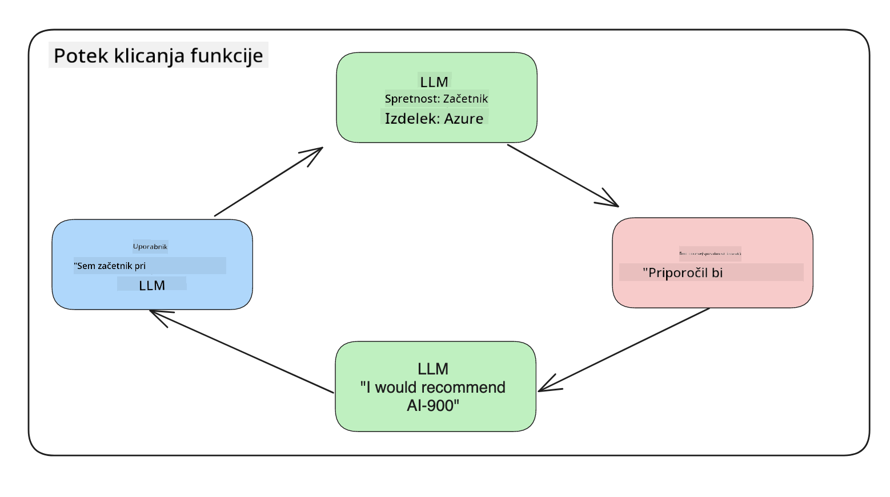

<!--
CO_OP_TRANSLATOR_METADATA:
{
  "original_hash": "77a48a201447be19aa7560706d6f93a0",
  "translation_date": "2025-07-09T14:45:22+00:00",
  "source_file": "11-integrating-with-function-calling/README.md",
  "language_code": "sl"
}
-->
# Integracija s klicem funkcij

[](https://aka.ms/gen-ai-lesson11-gh?WT.mc_id=academic-105485-koreyst)

Do zdaj ste se v prejšnjih lekcijah naučili že kar nekaj. Vendar pa lahko še izboljšamo. Nekaj stvari, ki jih lahko naslovimo, je, kako lahko dobimo bolj dosleden format odgovora, da bo lažje delati z njim v nadaljnjih korakih. Prav tako bi morda želeli dodati podatke iz drugih virov, da še dodatno obogatimo našo aplikacijo.

Zgoraj omenjene težave so tiste, ki jih ta poglavje želi rešiti.

## Uvod

V tej lekciji bomo obravnavali:

- Pojasnili, kaj je klic funkcije in kje ga uporabljamo.
- Ustvarjanje klica funkcije z uporabo Azure OpenAI.
- Kako integrirati klic funkcije v aplikacijo.

## Cilji učenja

Do konca te lekcije boste znali:

- Pojasniti namen uporabe klica funkcije.
- Nastaviti Function Call z uporabo Azure OpenAI storitve.
- Oblikovati učinkovite klice funkcij za vaš primer uporabe aplikacije.

## Scenarij: Izboljšanje našega klepetalnega bota s funkcijami

Za to lekcijo želimo zgraditi funkcijo za naš izobraževalni startup, ki uporabnikom omogoča, da s klepetalnim botom poiščejo tehnične tečaje. Priporočali bomo tečaje, ki ustrezajo njihovi ravni znanja, trenutni vlogi in tehnologiji, ki jih zanima.

Za izvedbo tega scenarija bomo uporabili kombinacijo:

- `Azure OpenAI` za ustvarjanje klepetalnega doživetja za uporabnika.
- `Microsoft Learn Catalog API` za pomoč uporabnikom pri iskanju tečajev glede na njihove zahteve.
- `Function Calling` za prevzem uporabnikovega poizvedbe in pošiljanje funkciji, ki izvede API zahtevo.

Za začetek si poglejmo, zakaj bi sploh želeli uporabljati klic funkcij:

## Zakaj klic funkcij

Pred uvedbo klica funkcij so bili odgovori iz LLM neurejeni in nedosledni. Razvijalci so morali pisati zapleteno kodo za preverjanje, da so lahko obvladali vse različice odgovorov. Uporabniki niso mogli dobiti odgovorov na vprašanja, kot je "Kakšno je trenutno vreme v Stockholmu?". To je zato, ker so bili modeli omejeni na podatke, na katerih so bili usposobljeni.

Klic funkcij je funkcija Azure OpenAI storitve, ki premaga naslednje omejitve:

- **Dosleden format odgovora**. Če lahko bolje nadzorujemo format odgovora, lahko lažje integriramo odgovor v druge sisteme.
- **Zunanji podatki**. Možnost uporabe podatkov iz drugih virov aplikacije v klepetalnem kontekstu.

## Prikaz problema skozi scenarij

> Priporočamo uporabo [priloženega zvezka](../../../11-integrating-with-function-calling/python/aoai-assignment.ipynb), če želite preizkusiti spodnji scenarij. Lahko pa tudi samo berete, saj želimo prikazati problem, kjer lahko funkcije pomagajo rešiti težavo.

Poglejmo primer, ki prikazuje problem formata odgovora:

Recimo, da želimo ustvariti bazo podatkov o študentih, da jim lahko predlagamo pravi tečaj. Spodaj imamo dva opisa študentov, ki sta si zelo podobna glede podatkov, ki jih vsebujeta.

1. Ustvarite povezavo do našega Azure OpenAI vira:

   ```python
   import os
   import json
   from openai import AzureOpenAI
   from dotenv import load_dotenv
   load_dotenv()

   client = AzureOpenAI(
   api_key=os.environ['AZURE_OPENAI_API_KEY'],  # this is also the default, it can be omitted
   api_version = "2023-07-01-preview"
   )

   deployment=os.environ['AZURE_OPENAI_DEPLOYMENT']
   ```

   Spodaj je nekaj Python kode za konfiguracijo povezave do Azure OpenAI, kjer nastavimo `api_type`, `api_base`, `api_version` in `api_key`.

1. Ustvarjanje dveh opisov študentov z uporabo spremenljivk `student_1_description` in `student_2_description`.

   ```python
   student_1_description="Emily Johnson is a sophomore majoring in computer science at Duke University. She has a 3.7 GPA. Emily is an active member of the university's Chess Club and Debate Team. She hopes to pursue a career in software engineering after graduating."

   student_2_description = "Michael Lee is a sophomore majoring in computer science at Stanford University. He has a 3.8 GPA. Michael is known for his programming skills and is an active member of the university's Robotics Club. He hopes to pursue a career in artificial intelligence after finishing his studies."
   ```

   Želimo poslati zgornje opise študentov LLM-ju, da razčleni podatke. Ti podatki se lahko kasneje uporabijo v naši aplikaciji in pošljejo v API ali shranijo v bazo podatkov.

1. Ustvarimo dva enaka poziva, v katerih LLM navodimo, katere informacije nas zanimajo:

   ```python
   prompt1 = f'''
   Please extract the following information from the given text and return it as a JSON object:

   name
   major
   school
   grades
   club

   This is the body of text to extract the information from:
   {student_1_description}
   '''

   prompt2 = f'''
   Please extract the following information from the given text and return it as a JSON object:

   name
   major
   school
   grades
   club

   This is the body of text to extract the information from:
   {student_2_description}
   '''
   ```

   Zgornji pozivi navodijo LLM, naj izlušči informacije in vrne odgovor v JSON formatu.

1. Po nastavitvi pozivov in povezave do Azure OpenAI bomo zdaj poslali pozive LLM-ju z uporabo `openai.ChatCompletion`. Poziv shranimo v spremenljivko `messages` in dodelimo vlogo `user`. To posnema sporočilo uporabnika, ki ga napiše klepetalnemu botu.

   ```python
   # response from prompt one
   openai_response1 = client.chat.completions.create(
   model=deployment,
   messages = [{'role': 'user', 'content': prompt1}]
   )
   openai_response1.choices[0].message.content

   # response from prompt two
   openai_response2 = client.chat.completions.create(
   model=deployment,
   messages = [{'role': 'user', 'content': prompt2}]
   )
   openai_response2.choices[0].message.content
   ```

Zdaj lahko pošljemo oba zahtevka LLM-ju in pregledamo prejeti odgovor tako, da ga poiščemo kot `openai_response1['choices'][0]['message']['content']`.

1. Nazadnje lahko odgovor pretvorimo v JSON format z uporabo `json.loads`:

   ```python
   # Loading the response as a JSON object
   json_response1 = json.loads(openai_response1.choices[0].message.content)
   json_response1
   ```

   Odgovor 1:

   ```json
   {
     "name": "Emily Johnson",
     "major": "computer science",
     "school": "Duke University",
     "grades": "3.7",
     "club": "Chess Club"
   }
   ```

   Odgovor 2:

   ```json
   {
     "name": "Michael Lee",
     "major": "computer science",
     "school": "Stanford University",
     "grades": "3.8 GPA",
     "club": "Robotics Club"
   }
   ```

   Čeprav so pozivi enaki in so opisi podobni, vidimo, da so vrednosti lastnosti `Grades` formatirane različno, saj včasih dobimo format `3.7` ali na primer `3.7 GPA`.

   Ta rezultat je posledica tega, da LLM vzame nestrukturirane podatke v obliki napisanega poziva in prav tako vrne nestrukturirane podatke. Potrebujemo strukturiran format, da vemo, kaj pričakovati pri shranjevanju ali uporabi teh podatkov.

Kako torej rešimo problem formata? Z uporabo klica funkcij lahko zagotovimo, da dobimo nazaj strukturirane podatke. Pri uporabi klica funkcij LLM dejansko ne kliče ali izvaja nobenih funkcij. Namesto tega ustvarimo strukturo, ki jo LLM sledi pri svojih odgovorih. Nato uporabimo te strukturirane odgovore, da vemo, katero funkcijo naj zaženemo v naših aplikacijah.



Nato lahko vzamemo, kar funkcija vrne, in to pošljemo nazaj LLM-ju. LLM bo nato odgovoril v naravnem jeziku, da odgovori na uporabnikovo poizvedbo.

## Primeri uporabe klicev funkcij

Obstaja veliko različnih primerov, kjer lahko klici funkcij izboljšajo vašo aplikacijo, na primer:

- **Klicanje zunanjih orodij**. Klepetalni boti so odlični pri odgovarjanju na vprašanja uporabnikov. Z uporabo klica funkcij lahko klepetalni boti uporabijo sporočila uporabnikov za izvedbo določenih nalog. Na primer, študent lahko vpraša klepetalnega bota: "Pošlji e-pošto mojemu inštruktorju, da potrebujem več pomoči pri tem predmetu." To lahko sproži klic funkcije `send_email(to: string, body: string)`.

- **Ustvarjanje API ali poizvedb v bazi podatkov**. Uporabniki lahko najdejo informacije z uporabo naravnega jezika, ki se pretvori v formatirano poizvedbo ali API zahtevo. Primer tega je učitelj, ki vpraša: "Kdo so študenti, ki so opravili zadnjo nalogo", kar lahko sproži klic funkcije `get_completed(student_name: string, assignment: int, current_status: string)`.

- **Ustvarjanje strukturiranih podatkov**. Uporabniki lahko vzamejo blok besedila ali CSV in uporabijo LLM za izluščitev pomembnih informacij. Na primer, študent lahko pretvori Wikipedijin članek o mirovnih sporazumih v AI flash kartice. To lahko naredi z uporabo funkcije `get_important_facts(agreement_name: string, date_signed: string, parties_involved: list)`.

## Ustvarjanje prvega klica funkcije

Postopek ustvarjanja klica funkcije vključuje 3 glavne korake:

1. **Klic** API-ja Chat Completions z seznamom vaših funkcij in sporočilom uporabnika.
2. **Branje** odgovora modela za izvedbo dejanja, npr. izvedbo funkcije ali API klica.
3. **Izvedba** še enega klica na Chat Completions API z odgovorom vaše funkcije, da uporabimo te informacije za ustvarjanje odgovora uporabniku.


### Korak 1 - ustvarjanje sporočil

Prvi korak je ustvariti sporočilo uporabnika. To lahko dinamično dodelite z vrednostjo iz besedilnega vnosa ali pa tukaj določite vrednost. Če je to vaš prvič delo z API-jem Chat Completions, moramo definirati `role` in `content` sporočila.

`role` je lahko `system` (ustvarjanje pravil), `assistant` (model) ali `user` (končni uporabnik). Za klic funkcij bomo dodelili `user` in primer vprašanja.

```python
messages= [ {"role": "user", "content": "Find me a good course for a beginner student to learn Azure."} ]
```

Z dodeljevanjem različnih vlog je LLM-ju jasno, ali nekaj pravi sistem ali uporabnik, kar pomaga graditi zgodovino pogovora, na katero se LLM lahko nasloni.

### Korak 2 - ustvarjanje funkcij

Nato bomo definirali funkcijo in parametre te funkcije. Tukaj bomo uporabili samo eno funkcijo z imenom `search_courses`, lahko pa ustvarite več funkcij.

> **Pomembno** : Funkcije so vključene v sistemsko sporočilo LLM-ju in so vključene v število razpoložljivih tokenov.

Spodaj ustvarimo funkcije kot polje elementov. Vsak element je funkcija in ima lastnosti `name`, `description` in `parameters`:

```python
functions = [
   {
      "name":"search_courses",
      "description":"Retrieves courses from the search index based on the parameters provided",
      "parameters":{
         "type":"object",
         "properties":{
            "role":{
               "type":"string",
               "description":"The role of the learner (i.e. developer, data scientist, student, etc.)"
            },
            "product":{
               "type":"string",
               "description":"The product that the lesson is covering (i.e. Azure, Power BI, etc.)"
            },
            "level":{
               "type":"string",
               "description":"The level of experience the learner has prior to taking the course (i.e. beginner, intermediate, advanced)"
            }
         },
         "required":[
            "role"
         ]
      }
   }
]
```

Podrobneje opišimo posamezne primere funkcij:

- `name` - Ime funkcije, ki jo želimo poklicati.
- `description` - Opis, kako funkcija deluje. Pomembno je, da je ta opis jasen in natančen.
- `parameters` - Seznam vrednosti in format, ki ga želite, da model ustvari v svojem odgovoru. Polje `parameters` vsebuje elemente z naslednjimi lastnostmi:
  1.  `type` - Podatkovni tip lastnosti, v kateri bodo shranjeni podatki.
  1.  `properties` - Seznam specifičnih vrednosti, ki jih bo model uporabil v odgovoru.
      1. `name` - Ključ je ime lastnosti, ki jo bo model uporabil v svojem formatiranem odgovoru, na primer `product`.
      1. `type` - Podatkovni tip te lastnosti, na primer `string`.
      1. `description` - Opis specifične lastnosti.

Obstaja tudi neobvezna lastnost `required` - zahtevana lastnost za uspešen klic funkcije.

### Korak 3 - izvedba klica funkcije

Po definiranju funkcije jo moramo vključiti v klic na Chat Completion API. To naredimo tako, da v zahtevo dodamo `functions`. V tem primeru `functions=functions`.

Obstaja tudi možnost nastavitve `function_call` na `auto`. To pomeni, da pustimo LLM-ju, da sam odloči, katero funkcijo naj pokliče glede na sporočilo uporabnika, namesto da bi jo določili sami.

Spodaj je koda, kjer kličemo `ChatCompletion.create`, opazite, da nastavimo `functions=functions` in `function_call="auto"`, s čimer damo LLM-ju možnost, kdaj naj kliče funkcije, ki jih zagotovimo:

```python
response = client.chat.completions.create(model=deployment,
                                        messages=messages,
                                        functions=functions,
                                        function_call="auto")

print(response.choices[0].message)
```

Odgovor, ki ga prejmemo, izgleda takole:

```json
{
  "role": "assistant",
  "function_call": {
    "name": "search_courses",
    "arguments": "{\n  \"role\": \"student\",\n  \"product\": \"Azure\",\n  \"level\": \"beginner\"\n}"
  }
}
```

Tukaj vidimo, kako je bila funkcija `search_courses` poklicana in s katerimi argumenti, kot je navedeno v lastnosti `arguments` v JSON odgovoru.

Zaključek je, da je LLM uspel najti podatke, ki ustrezajo argumentom funkcije, saj jih je izluščil iz vrednosti, podane parametru `messages` v klicu chat completion. Spodaj je opomnik vrednosti `messages`:

```python
messages= [ {"role": "user", "content": "Find me a good course for a beginner student to learn Azure."} ]
```

Kot vidite, so bili `student`, `Azure` in `beginner` izluščeni iz `messages` in nastavljeni kot vhod v funkcijo. Uporaba funkcij na ta način je odličen način za izluščitev informacij iz poziva, pa tudi za zagotavljanje strukture LLM-ju in omogočanje ponovne uporabe funkcionalnosti.

Nato moramo videti, kako to uporabiti v naši aplikaciji.

## Integracija klicev funkcij v aplikacijo

Ko smo preizkusili formatiran odgovor LLM, ga lahko zdaj integriramo v aplikacijo.

### Upravljanje poteka

Za integracijo v aplikacijo naredimo naslednje korake:

1. Najprej izvedemo klic na OpenAI storitve in shranimo sporočilo v spremenljivko `response_message`.

   ```python
   response_message = response.choices[0].message
   ```

1. Zdaj definiramo funkcijo, ki bo klicala Microsoft Learn API za pridobitev seznama tečajev:

   ```python
   import requests

   def search_courses(role, product, level):
     url = "https://learn.microsoft.com/api/catalog/"
     params = {
        "role": role,
        "product": product,
        "level": level
     }
     response = requests.get(url, params=params)
     modules = response.json()["modules"]
     results = []
     for module in modules[:5]:
        title = module["title"]
        url = module["url"]
        results.append({"title": title, "url": url})
     return str(results)
   ```

   Opazite, da zdaj ustvarjamo dejansko Python funkcijo, ki se preslika na imena funkcij, uvedena v spremenljivki `functions`. Prav tako izvajamo prave zunanje API klice za pridobitev potrebnih podatkov. V tem primeru kličemo Microsoft Learn API za iskanje učnih modulov.

V redu, ustvarili smo spremenljivko `functions` in ustrezno Python funkcijo, kako pa LLM-ju povemo, kako povezati ti dve, da se pokliče naša Python funkcija?

1. Da preverimo, ali moramo poklicati Python funkcijo, moramo pogledati odgovor LLM in preveriti, ali je del odgovora `function_call`, ter poklicati navedeno funkcijo. Spodaj je, kako lahko izvedete ta preverjanje:

   ```python
   # Check if the model wants to call a function
   if response_message.function_call.name:
    print("Recommended Function call:")
    print(response_message.function_call.name)
    print()

    # Call the function.
    function_name = response_message.function_call.name

    available_functions = {
            "search_courses": search_courses,
    }
    function_to_call = available_functions[function_name]

    function_args = json.loads(response_message.function_call.arguments)
    function_response = function_to_call(**function_args)

    print("Output of function call:")
    print(function_response)
    print(type(function_response))


    # Add the assistant response and function response to the messages
    messages.append( # adding assistant response to messages
        {
            "role": response_message.role,
            "function_call": {
                "name": function_name,
                "arguments": response_message.function_call.arguments,
            },
            "content": None
        }
    )
    messages.append( # adding function response to messages
        {
            "role": "function",
            "name": function_name,
            "content":function_response,
        }
    )
   ```

   Te tri vrstice zagotovijo, da izluščimo ime funkcije, argumente in izvedemo klic:

   ```python
   function_to_call = available_functions[function_name]

   function_args = json.loads(response_message.function_call.arguments)
   function_response = function_to_call(**function_args)
   ```

   Spodaj je izpis ob zagonu naše kode:

   **Izpis**

   ```Recommended Function call:
   {
     "name": "search_courses",
     "arguments": "{\n  \"role\": \"student\",\n  \"product\": \"Azure\",\n  \"level\": \"beginner\"\n}"
   }

   Output of function call:
   [{'title': 'Describe concepts of cryptography', 'url': 'https://learn.microsoft.com/training/modules/describe-concepts-of-cryptography/?
   WT.mc_id=api_CatalogApi'}, {'title': 'Introduction to audio classification with TensorFlow', 'url': 'https://learn.microsoft.com/en-
   us/training/modules/intro-audio-classification-tensorflow/?WT.mc_id=api_CatalogApi'}, {'title': 'Design a Performant Data Model in Azure SQL
   Database with Azure Data Studio', 'url': 'https://learn.microsoft.com/training/modules/design-a-data-model-with-ads/?
   WT.mc_id=api_CatalogApi'}, {'title': 'Getting started with the Microsoft Cloud Adoption Framework for Azure', 'url':
   'https://learn.microsoft.com/training/modules/cloud-adoption-framework-getting-started/?WT.mc_id=api_CatalogApi'}, {'title': 'Set up the
   Rust development environment', 'url': 'https://learn.microsoft.com/training/modules/rust-set-up-environment/?WT.mc_id=api_CatalogApi'}]
   <class 'str'>
   ```

1. Zdaj bomo poslali posodobljeno sporočilo `messages` LLM-ju, da prejmemo odgovor v naravnem jeziku namesto API JSON formatiranega odgovora.

   ```python
   print("Messages in next request:")
   print(messages)
   print()

   second_response = client.chat.completions.create(
      messages=messages,
      model=deployment,
      function_call="auto",
      functions=functions,
      temperature=0
         )  # get a new response from GPT where it can see the function response


   print(second_response.choices[0].message)
   ```

   **Izpis**

   ```python
   {
     "role": "assistant",
     "content": "I found some good courses for beginner students to learn Azure:\n\n1. [Describe concepts of cryptography] (https://learn.microsoft.com/training/modules/describe-concepts-of-cryptography/?WT.mc_id=api_CatalogApi)\n2. [Introduction to audio classification with TensorFlow](https://learn.microsoft.com/training/modules/intro-audio-classification-tensorflow/?WT.mc_id=api_CatalogApi)\n3. [Design a Performant Data Model in Azure SQL Database with Azure Data Studio](https://learn.microsoft.com/training/modules/design-a-data-model-with-ads/?WT.mc_id=api_CatalogApi)\n4. [Getting started with the Microsoft Cloud Adoption Framework for Azure](https://learn.microsoft.com/training/modules/cloud-adoption-framework-getting-started/?WT.mc_id=api_CatalogApi)\n5. [Set up the Rust development environment](https://learn.microsoft.com/training/modules/rust-set-up-environment/?WT.mc_id=api_CatalogApi)\n\nYou can click on the links to access the courses."
   }

   ```

## Naloga

Za nadaljevanje učenja o Azure OpenAI Function Calling lahko naredite:

- Dodate več parametrov funkciji, ki bi lahko pomagali učencem najti več tečajev.
- Ustvarite še en klic funkcije, ki zajema več informacij o učencu, na primer njihov materni jezik.
- Ustvarite obravnavo napak, ko klic funkcije in/ali API ne vrne ustreznih tečajev.
Namig: Sledite strani [Learn API reference documentation](https://learn.microsoft.com/training/support/catalog-api-developer-reference?WT.mc_id=academic-105485-koreyst), da vidite, kako in kje so ti podatki na voljo.

## Odlično delo! Nadaljujte pot

Po zaključku te lekcije si oglejte našo [Generative AI Learning collection](https://aka.ms/genai-collection?WT.mc_id=academic-105485-koreyst), da še naprej nadgrajujete svoje znanje o generativni umetni inteligenci!

Pojdite na Lekcijo 12, kjer bomo pogledali, kako [načrtovati UX za AI aplikacije](../12-designing-ux-for-ai-applications/README.md?WT.mc_id=academic-105485-koreyst)!

**Omejitev odgovornosti**:  
Ta dokument je bil preveden z uporabo AI prevajalske storitve [Co-op Translator](https://github.com/Azure/co-op-translator). Čeprav si prizadevamo za natančnost, vas opozarjamo, da avtomatizirani prevodi lahko vsebujejo napake ali netočnosti. Izvirni dokument v njegovem izvirnem jeziku velja za avtoritativni vir. Za pomembne informacije priporočamo strokovni človeški prevod. Za morebitna nesporazume ali napačne interpretacije, ki izhajajo iz uporabe tega prevoda, ne odgovarjamo.