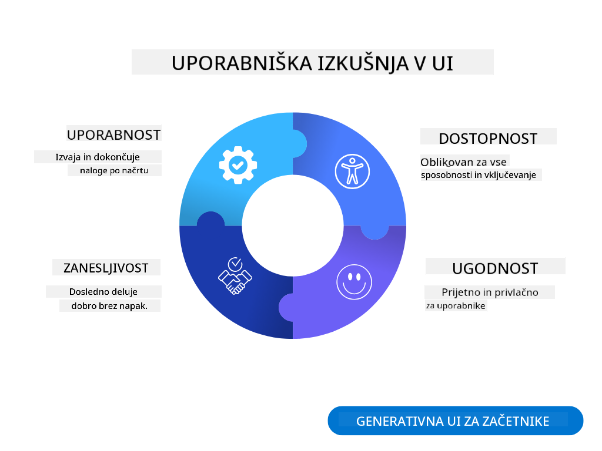
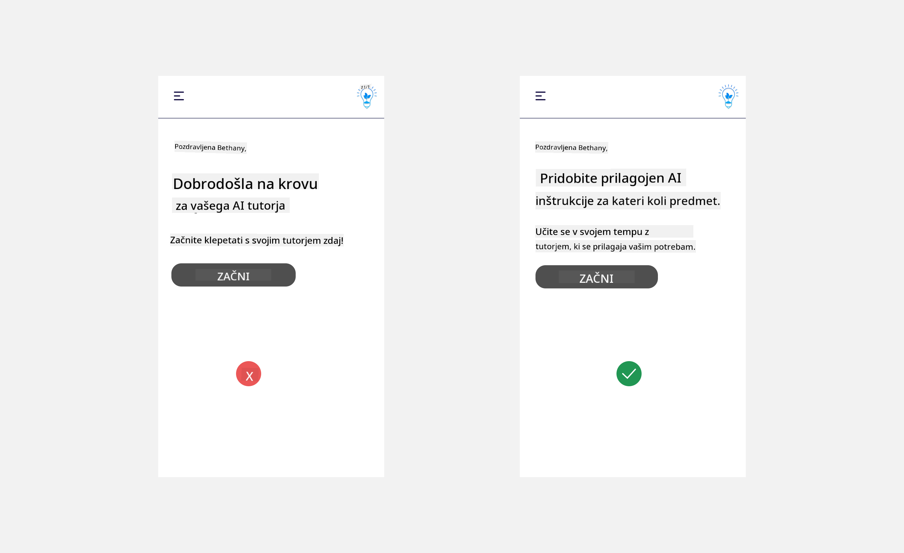
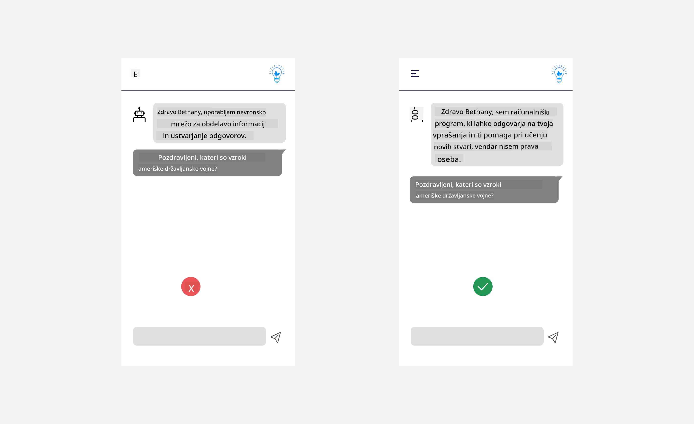
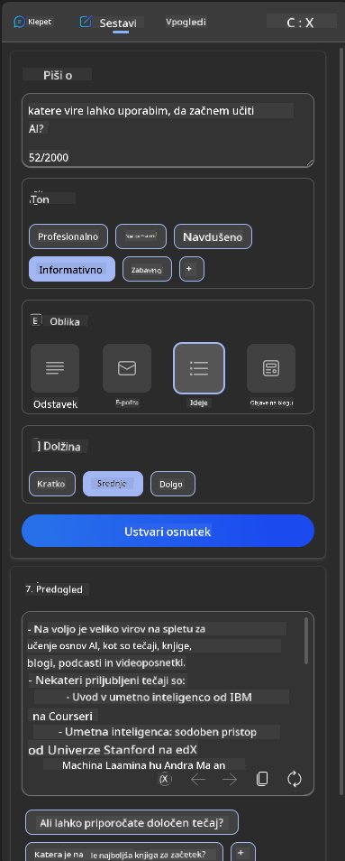
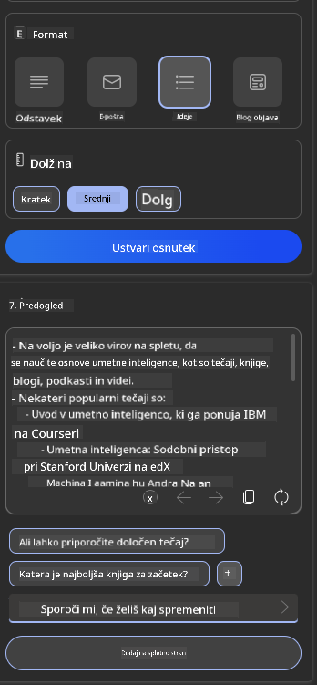

<!--
CO_OP_TRANSLATOR_METADATA:
{
  "original_hash": "ec385b41ee50579025d50cc03bfb3a25",
  "translation_date": "2025-05-19T22:08:14+00:00",
  "source_file": "12-designing-ux-for-ai-applications/README.md",
  "language_code": "sl"
}
-->
# Oblikovanje uporabniške izkušnje za aplikacije AI

> _(Kliknite zgornjo sliko za ogled videa te lekcije)_

Uporabniška izkušnja je zelo pomemben vidik pri gradnji aplikacij. Uporabniki morajo biti sposobni učinkovito uporabljati vašo aplikacijo za izvajanje nalog. Biti učinkovit je ena stvar, vendar morate aplikacije oblikovati tudi tako, da jih lahko uporablja vsakdo, da postanejo _dostopne_. Ta poglavje se bo osredotočilo na to področje, da boste na koncu oblikovali aplikacijo, ki jo ljudje lahko in želijo uporabljati.

## Uvod

Uporabniška izkušnja je način, kako uporabnik uporablja in komunicira s specifičnim izdelkom ali storitvijo, naj bo to sistem, orodje ali dizajn. Pri razvoju aplikacij AI se razvijalci ne osredotočajo le na zagotavljanje učinkovite uporabniške izkušnje, temveč tudi na etičnost. V tej lekciji bomo pokrili, kako zgraditi aplikacije umetne inteligence (AI), ki naslavljajo potrebe uporabnikov.

Lekcija bo pokrivala naslednja področja:

- Uvod v uporabniško izkušnjo in razumevanje potreb uporabnikov
- Oblikovanje aplikacij AI za zaupanje in preglednost
- Oblikovanje aplikacij AI za sodelovanje in povratne informacije

## Cilji učenja

Po tej lekciji boste lahko:

- Razumeli, kako zgraditi aplikacije AI, ki ustrezajo potrebam uporabnikov.
- Oblikovali aplikacije AI, ki spodbujajo zaupanje in sodelovanje.

### Predpogoj

Vzemite si čas in preberite več o [uporabniški izkušnji in dizajnerskem razmišljanju.](https://learn.microsoft.com/training/modules/ux-design?WT.mc_id=academic-105485-koreyst)

## Uvod v uporabniško izkušnjo in razumevanje potreb uporabnikov

V našem izmišljenem izobraževalnem startupu imamo dva primarna uporabnika, učitelje in učence. Vsak od teh uporabnikov ima edinstvene potrebe. Oblikovanje, usmerjeno na uporabnika, daje prednost uporabniku, kar zagotavlja, da so izdelki relevantni in koristni za tiste, za katere so namenjeni.

Aplikacija mora biti **uporabna, zanesljiva, dostopna in prijetna**, da zagotovi dobro uporabniško izkušnjo.

### Uporabnost

Biti uporaben pomeni, da ima aplikacija funkcionalnost, ki ustreza njenemu namenu, kot je avtomatizacija procesa ocenjevanja ali generiranje učnih kartic za ponavljanje. Aplikacija, ki avtomatizira proces ocenjevanja, mora biti sposobna natančno in učinkovito dodeliti ocene študentovemu delu na podlagi vnaprej določenih kriterijev. Podobno mora aplikacija, ki generira učne kartice za ponavljanje, biti sposobna ustvariti relevantna in raznolika vprašanja na podlagi svojih podatkov.

### Zanesljivost

Biti zanesljiv pomeni, da aplikacija lahko dosledno in brez napak izvaja svojo nalogo. Vendar pa AI, tako kot ljudje, ni popoln in je lahko dovzeten za napake. Aplikacije se lahko srečajo z napakami ali nepričakovanimi situacijami, ki zahtevajo človeško posredovanje ali korekcijo. Kako se spopadate z napakami? V zadnjem delu te lekcije bomo pokrili, kako so sistemi AI in aplikacije oblikovani za sodelovanje in povratne informacije.

### Dostopnost

Biti dostopen pomeni razširiti uporabniško izkušnjo na uporabnike z različnimi sposobnostmi, vključno s tistimi z invalidnostmi, kar zagotavlja, da nihče ni izključen. Z upoštevanjem smernic in principov dostopnosti postanejo AI rešitve bolj vključujoče, uporabne in koristne za vse uporabnike.

### Prijetnost

Biti prijeten pomeni, da je aplikacija užitek za uporabo. Privlačna uporabniška izkušnja lahko pozitivno vpliva na uporabnika, ga spodbuja, da se vrne k aplikaciji, in poveča poslovne prihodke.

Vsak izziv ni mogoče rešiti z AI. AI prihaja, da dopolni vašo uporabniško izkušnjo, naj bo to avtomatizacija ročnih nalog ali personalizacija uporabniških izkušenj.

## Oblikovanje aplikacij AI za zaupanje in preglednost

Gradnja zaupanja je ključna pri oblikovanju aplikacij AI. Zaupanje zagotavlja, da je uporabnik prepričan, da bo aplikacija opravila delo, dosledno dostavila rezultate in da so rezultati tisto, kar uporabnik potrebuje. Tveganje na tem področju je nezaupanje in pretirano zaupanje. Nezaupanje se pojavi, ko uporabnik nima ali ima malo zaupanja v AI sistem, kar vodi do zavrnitve vaše aplikacije. Pretirano zaupanje se pojavi, ko uporabnik preceni sposobnosti AI sistema, kar vodi do tega, da uporabniki preveč zaupajo AI sistemu. Na primer, avtomatiziran sistem ocenjevanja v primeru pretiranega zaupanja lahko vodi do tega, da učitelj ne preveri nekaterih nalog, da se prepriča, da sistem ocenjevanja deluje dobro. To bi lahko povzročilo nepravične ali netočne ocene za učence ali zamujene priložnosti za povratne informacije in izboljšanje.

Dva načina za zagotovitev, da je zaupanje postavljeno v središče oblikovanja, sta razložljivost in nadzor.

### Razložljivost

Ko AI pomaga pri odločanju, kot je prenašanje znanja na prihodnje generacije, je ključnega pomena, da učitelji in starši razumejo, kako so odločitve AI sprejete. To je razložljivost - razumevanje, kako aplikacije AI sprejemajo odločitve. Oblikovanje za razložljivost vključuje dodajanje podrobnosti o primerih, kaj lahko aplikacija AI naredi. Na primer, namesto "Začni z AI učiteljem", lahko sistem uporabi: "Povzemite svoje zapiske za lažje ponavljanje z uporabo AI."

Drug primer je, kako AI uporablja uporabniške in osebne podatke. Na primer, uporabnik s persono študent ima lahko omejitve na podlagi svoje persone. AI morda ne bo mogel razkriti odgovorov na vprašanja, ampak lahko pomaga voditi uporabnika k razmišljanju o tem, kako lahko reši problem.

Zadnji ključni del razložljivosti je poenostavitev razlag. Študenti in učitelji morda niso strokovnjaki za AI, zato morajo biti razlage, kaj aplikacija lahko ali ne more narediti, poenostavljene in enostavne za razumevanje.

### Nadzor

Generativna AI ustvarja sodelovanje med AI in uporabnikom, kjer lahko na primer uporabnik spremeni pozive za različne rezultate. Poleg tega, ko je izhod ustvarjen, morajo uporabniki imeti možnost spreminjati rezultate, kar jim daje občutek nadzora. Na primer, pri uporabi Bing-a, lahko prilagodite svoj poziv glede na format, ton in dolžino. Poleg tega lahko dodate spremembe svojemu izhodu in ga spremenite, kot je prikazano spodaj:

Druga funkcija v Bing-u, ki omogoča uporabniku nadzor nad aplikacijo, je možnost vklopa in izklopa podatkov, ki jih AI uporablja. Za šolsko aplikacijo bi študent morda želel uporabiti svoje zapiske ter učiteljeve vire kot gradivo za ponavljanje.

> Pri oblikovanju aplikacij AI je ključna namernost pri zagotavljanju, da uporabniki ne pretirano zaupajo, kar vodi do nerealnih pričakovanj o njihovih sposobnostih. Eden od načinov za to je ustvarjanje trenja med pozivi in rezultati. Opominjanje uporabnika, da je to AI in ne kolega človek.

## Oblikovanje aplikacij AI za sodelovanje in povratne informacije

Kot je bilo že omenjeno, generativna AI ustvarja sodelovanje med uporabnikom in AI. Večina interakcij je z uporabnikom, ki vnaša poziv, in AI, ki generira izhod. Kaj pa, če je izhod napačen? Kako aplikacija obravnava napake, če se pojavijo? Ali AI krivi uporabnika ali si vzame čas, da razloži napako?

Aplikacije AI bi morale biti zgrajene za prejemanje in dajanje povratnih informacij. To ne le pomaga AI sistemu izboljšati, ampak tudi gradi zaupanje pri uporabnikih. V oblikovanju bi morala biti vključena povratna zanka, primer je lahko preprost thumbs up ali thumbs down na izhodu.

Drug način za obravnavanje tega je jasno komuniciranje sposobnosti in omejitev sistema. Ko uporabnik naredi napako in zahteva nekaj, kar presega sposobnosti AI, bi morala biti tudi možnost za obravnavo tega, kot je prikazano spodaj.

Sistemske napake so pogoste pri aplikacijah, kjer uporabnik morda potrebuje pomoč z informacijami izven obsega AI ali aplikacija lahko ima omejitev glede tega, koliko vprašanj/predmetov lahko uporabnik generira povzetke. Na primer, AI aplikacija, usposobljena z podatki o omejenih predmetih, na primer Zgodovina in Matematika, morda ne bo mogla obravnavati vprašanj o Geografiji. Da bi to omilili, lahko AI sistem poda odgovor, kot je: "Oprostite, naš izdelek je bil usposobljen s podatki v naslednjih predmetih....., ne morem odgovoriti na vprašanje, ki ste ga postavili."

Aplikacije AI niso popolne, zato so nagnjene k napakam. Pri oblikovanju vaših aplikacij morate zagotoviti, da ustvarite prostor za povratne informacije uporabnikov in obravnavo napak na način, ki je preprost in enostavno razložljiv.

## Naloga

Vzemite katero koli aplikacijo AI, ki ste jo doslej zgradili, razmislite o implementaciji spodnjih korakov v svoji aplikaciji:

- **Prijetnost:** Razmislite, kako lahko naredite svojo aplikacijo bolj prijetno. Ali povsod dodajate razlage? Ali spodbujate uporabnika k raziskovanju? Kako oblikujete svoja sporočila o napakah?

- **Uporabnost:** Gradnja spletne aplikacije. Prepričajte se, da je vaša aplikacija navigabilna tako z miško kot s tipkovnico.

- **Zaupanje in preglednost:** Ne zaupajte AI popolnoma in njenemu izhodu, razmislite, kako bi dodali človeka v proces za preverjanje izhoda. Prav tako razmislite in implementirajte druge načine za doseganje zaupanja in preglednosti.

- **Nadzor:** Dajte uporabniku nadzor nad podatki, ki jih posreduje aplikaciji. Implementirajte način, kako se uporabnik lahko vključi ali izključi iz zbiranja podatkov v AI aplikaciji.

## Nadaljujte z učenjem!

Po zaključku te lekcije si oglejte našo [Zbirko učenja generativne AI](https://aka.ms/genai-collection?WT.mc_id=academic-105485-koreyst) za nadaljevanje pridobivanja znanja o generativni AI!

Pojdite na lekcijo 13, kjer bomo pogledali, kako [zavarovati AI aplikacije](../13-securing-ai-applications/README.md?WT.mc_id=academic-105485-koreyst)!

**Izjava o omejitvi odgovornosti**:  
Ta dokument je bil preveden s pomočjo storitve za prevajanje z umetno inteligenco [Co-op Translator](https://github.com/Azure/co-op-translator). Čeprav si prizadevamo za natančnost, vas opozarjamo, da lahko samodejni prevodi vsebujejo napake ali netočnosti. Izvirni dokument v njegovem maternem jeziku je treba obravnavati kot avtoritativni vir. Za kritične informacije je priporočljiv profesionalni prevod s strani človeka. Ne odgovarjamo za morebitna nesporazumevanja ali napačne interpretacije, ki izhajajo iz uporabe tega prevoda.