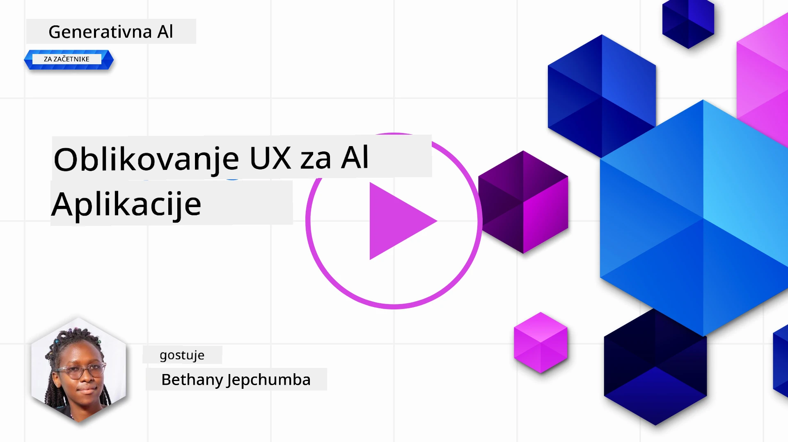
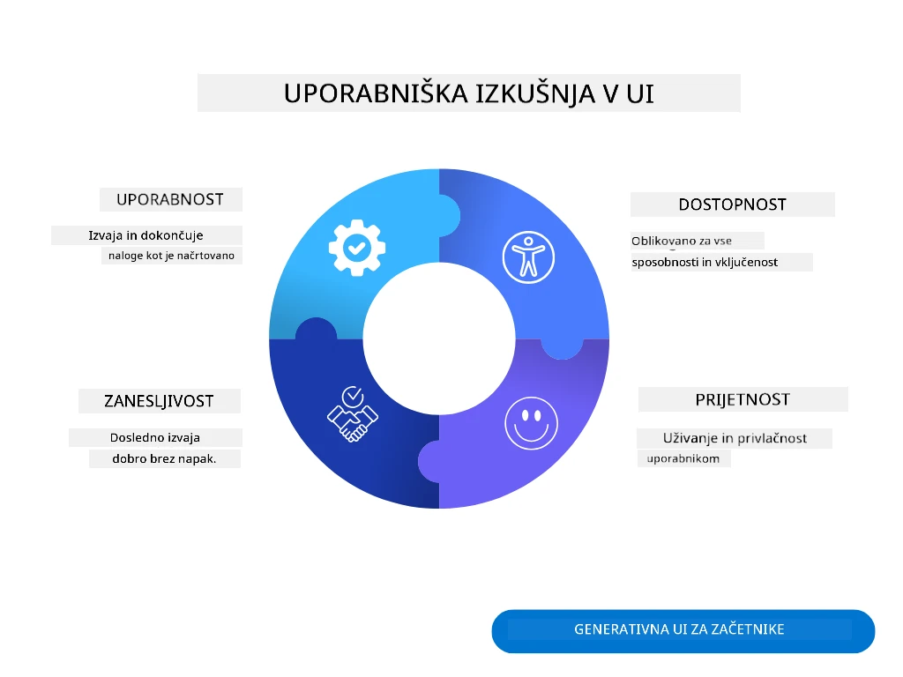
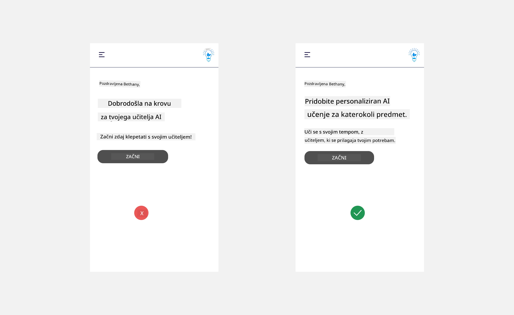
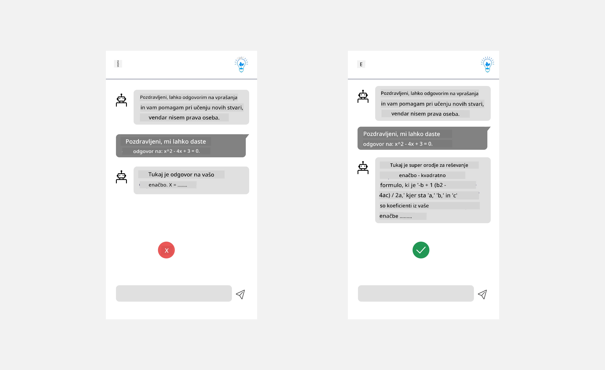
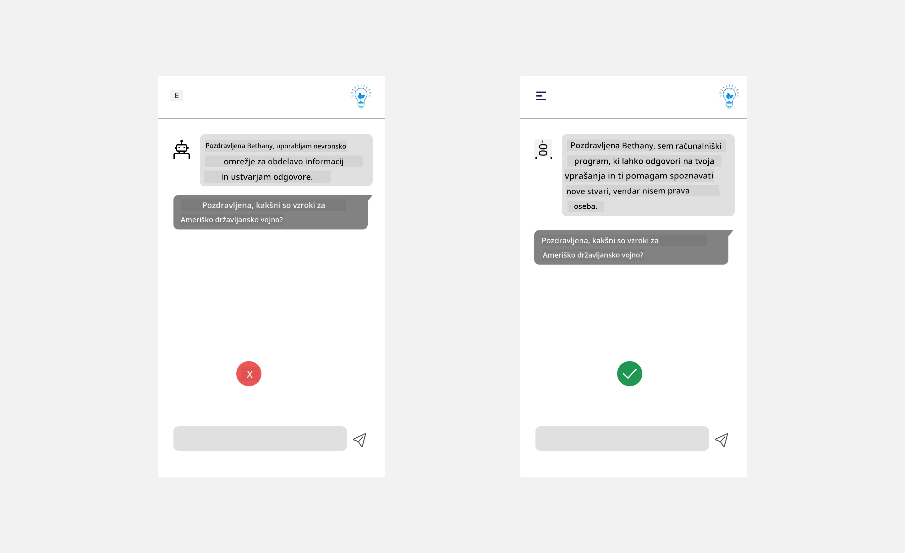
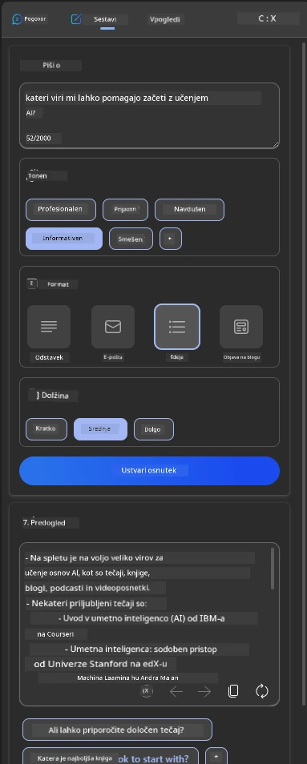
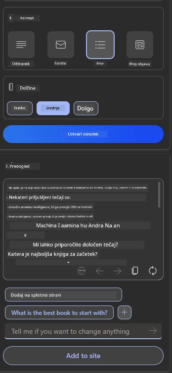
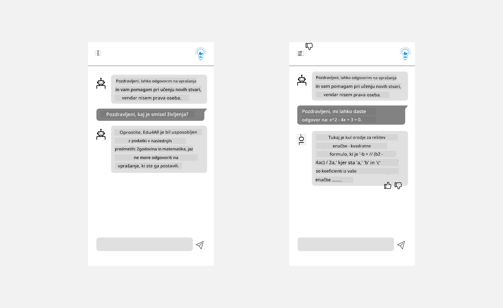

# Oblikovanje UX za AI aplikacije

> _(Kliknite na zgornjo sliko za ogled videa te lekcije)_

Uporabniška izkušnja je zelo pomemben vidik pri izdelavi aplikacij. Uporabniki morajo lahko vašo aplikacijo uporabljati učinkovito za izvajanje nalog. Učinkovitost je ena stvar, vendar morate tudi oblikovati aplikacije tako, da jih lahko uporabljajo vsi, da so _dostopne_. Ta poglavje se bo osredotočilo na to področje, da boste upajmo končali z oblikovanjem aplikacije, ki jo ljudje lahko in hočejo uporabljati.

## Uvod

Uporabniška izkušnja je način, kako uporabnik komunicira in uporablja določen izdelek ali storitev, naj bo to sistem, orodje ali oblikovanje. Pri razvoju AI aplikacij se razvijalci ne osredotočajo samo na učinkovito uporabniško izkušnjo, ampak tudi na etično. V tej lekciji bomo obravnavali, kako zgraditi aplikacije umetne inteligence (AI), ki zadovoljujejo potrebe uporabnikov.

Lekcija bo zajemala naslednja področja:

- Uvod v uporabniško izkušnjo in razumevanje potreb uporabnikov
- Oblikovanje AI aplikacij za zaupanje in preglednost
- Oblikovanje AI aplikacij za sodelovanje in povratne informacije

## Cilji učenja

Po opravljenem tečaju boste lahko:

- Razumeli, kako zgraditi AI aplikacije, ki izpolnjujejo potrebe uporabnikov.
- Oblikovali AI aplikacije, ki spodbujajo zaupanje in sodelovanje.

### Predpogoj

Vzemite si čas in preberite več o [uporabniški izkušnji in oblikovalskem razmišljanju.](https://learn.microsoft.com/training/modules/ux-design?WT.mc_id=academic-105485-koreyst)

## Uvod v uporabniško izkušnjo in razumevanje potreb uporabnikov

V našem izmišljenem izobraževalnem start-upu imamo dva glavna uporabnika, učitelje in študente. Vsak od teh uporabnikov ima edinstvene potrebe. Dizajn, osredotočen na uporabnika, daje prednost uporabniku in zagotavlja, da so izdelki relevantni in koristni za tiste, za katere so namenjeni.

Aplikacija mora biti **uporabna, zanesljiva, dostopna in prijetna**, da zagotovi dobro uporabniško izkušnjo.

### Uporabnost

Biti uporaben pomeni, da ima aplikacija funkcionalnost, ki ustreza njenemu namenu, na primer avtomatizacijo postopka ocenjevanja ali generiranje kartic za ponavljanje. Aplikacija, ki avtomatizira proces ocenjevanja, mora biti zmožna natančno in učinkovito dodeljevati ocene študentskim delom na podlagi vnaprej določenih kriterijev. Podobno mora aplikacija, ki generira kartice za ponavljanje, ustvariti ustrezna in raznolika vprašanja na podlagi svojih podatkov.

### Zanesljivost

Biti zanesljiv pomeni, da aplikacija nalogo izvaja dosledno in brez napak. Vendar pa AI, tako kot ljudje, ni popolna in je dovzetna za napake. Aplikacije lahko naletijo na napake ali nepričakovane situacije, ki zahtevajo človeško posredovanje ali popravek. Kako ravnate z napakami? V zadnjem delu te lekcije bomo obravnavali, kako so AI sistemi in aplikacije zasnovani za sodelovanje in povratne informacije.

### Dostopnost

Biti dostopen pomeni razširiti uporabniško izkušnjo tudi na uporabnike z raznolikimi zmožnostmi, vključno z invalidnostmi, in zagotoviti, da nihče ni izključen. Sledenje smernicam in principom dostopnosti naredi AI rešitve bolj vključujoče, uporabne in koristne za vse uporabnike.

### Prijetnost

Biti prijeten pomeni, da je uporaba aplikacije prijetna. Privlačna uporabniška izkušnja ima lahko pozitiven vpliv na uporabnika, ga spodbuja, da se vrne k aplikaciji, in povečuje poslovni prihodek.

Ne vsakega izziva ni mogoče rešiti z AI. AI pride v poštev za dopolnitev vaše uporabniške izkušnje, naj bo to avtomatizacija ročnih opravil ali personalizacija uporabniških izkušenj.

## Oblikovanje AI aplikacij za zaupanje in preglednost

Gradnja zaupanja je ključna pri oblikovanju AI aplikacij. Zaupanje zagotavlja, da uporabnik zaupa, da bo aplikacija opravila delo, dosledno dostavila rezultate in da rezultati ustrezajo potrebam uporabnika. Tveganje v tem področju predstavljata nezaupanje in preveliko zaupanje. Nezaupanje nastane, ko uporabnik zaupa malo ali nič v AI sistem, kar vodi do zavrnitve aplikacije. Preveliko zaupanje nastane, ko uporabnik preceni zmogljivost AI sistema, zaradi česar uporabniki preveč zaupajo AI sistemu. Na primer, avtomatiziran sistem ocenjevanja pri prevelikem zaupanju lahko privede do tega, da učitelj ne pregleda nekaterih nalog, da preveri, ali sistem ocenjevanja deluje dobro. To lahko povzroči nepravične ali netočne ocene za študente ali zamujene priložnosti za povratne informacije in izboljšave.

Dva načina za zagotovitev, da je zaupanje postavljeno v središče oblikovanja, sta razložljivost in nadzor.

### Razložljivost

Ko AI pomaga pri informiranju odločitev, na primer pri posredovanju znanja prihodnjim generacijam, je ključno, da učitelji in starši razumejo, kako so sprejete odločitve AI. To je razložljivost - razumevanje, kako AI aplikacije sprejemajo odločitve. Oblikovanje za razložljivost vključuje dodajanje podrobnosti, ki poudarjajo, kako je AI prišel do izida. Publika mora vedeti, da je izhod ustvaril AI in ne človek. Na primer, namesto «Začni zdaj klepetati s svojim tutorjem» recite «Uporabljaj AI tutorja, ki se prilagaja tvojim potrebam in ti pomaga učiti se s tvojim tempom.»

Drug primer je, kako AI uporablja uporabniške in osebne podatke. Na primer, uporabnik s persono študenta lahko ima omejitve glede na svojo persono. AI morda ne more razkriti odgovorov na vprašanja, lahko pa pomaga uporabnika usmeriti, kako lahko reši problem.

Zadnji ključen del razložljivosti je poenostavitev razlag. Študenti in učitelji morda niso AI strokovnjaki, zato morajo biti pojasnila o tem, kaj aplikacija lahko ali ne more narediti, poenostavljena in enostavna za razumevanje.

### Nadzor

Generativna AI ustvarja sodelovanje med AI in uporabnikom, kjer lahko na primer uporabnik spreminja pozive za različne rezultate. Poleg tega, ko je izhod ustvarjen, bi morali uporabniki lahko spreminjali rezultate in tako pridobili občutek nadzora. Na primer, pri uporabi Microsoft Copilot (prej Bing Chat) lahko prilagodite svoj poziv glede na obliko, ton in dolžino. Poleg tega lahko dodate spremembe svojemu izhodu in ga spreminjate, kot je prikazano spodaj:

Druga funkcija v Microsoft Copilot, ki uporabniku omogoča nadzor nad aplikacijo, je možnost vključitve in izključitve uporabe podatkov AI. Za šolsko aplikacijo bi študent morda želel uporabljati svoje zapiske ter tudi učiteljeve vire kot gradivo za ponavljanje.

> Pri oblikovanju AI aplikacij je nameren pristop ključnega pomena, da uporabniki ne zaupajo preveč in ne postavijo nerealnih pričakovanj glede zmogljivosti. En način je ustvariti trenje med pozivi in rezultati. Spomniti uporabnika, da gre za AI in ne za sogovornika človeka.

## Oblikovanje AI aplikacij za sodelovanje in povratne informacije

Kot je bilo že omenjeno, generativna AI ustvarja sodelovanje med uporabnikom in AI. Največ interakcij je, ko uporabnik vnese poziv, AI pa generira izhod. Kaj pa, če je izhod napačen? Kako aplikacija ravna z napakami, če se pojavijo? Ali AI krivi uporabnika ali si vzame čas, da pojasni napako?

AI aplikacije bi morale biti zasnovane tako, da prejmejo in dajo povratne informacije. To ne pomaga le izboljšati AI sistem, ampak tudi gradi zaupanje z uporabniki. V oblikovanje je treba vključiti povratno zanko, kot je enostavna palec gor ali dol ocena za izhod.

Drugi način za reševanje tega je jasno komuniciranje zmogljivosti in omejitev sistema. Ko uporabnik naredi napako z zahtevkom, ki presega zmogljivosti AI, mora biti tudi način za spopadanje s tem, kot je prikazano spodaj.

Sistemske napake so pogoste pri aplikacijah, kjer uporabnik potrebuje pomoč z informacijami izven obsega AI ali pa aplikacija omejuje, koliko vprašanj/predmetov lahko uporabnik generira povzetke za. Na primer, AI aplikacija, usposobljena z podatki o omejenih predmetih, na primer zgodovini in matematiki, morda ne zmore odgovoriti na vprašanja iz geografije. Za omilitev tega lahko AI sistem odgovori: "Oprostite, naš izdelek je bil usposobljen z podatki za naslednje predmete....., ne morem odgovoriti na vaše vprašanje."

AI aplikacije niso popolne, zato bodo zagotovo naredile napake. Pri oblikovanju svojih aplikacij morate zagotoviti prostor za povratne informacije uporabnikov in načine ravnanja z napakami na preprost in razumljiv način.

## Naloga

Vzemite katero koli AI aplikacijo, ki ste jo do zdaj zgradili, in razmislite o uvedbi spodnjih korakov v vaši aplikaciji:

- **Prijetnost:** Razmislite, kako lahko naredite svojo aplikacijo bolj prijetno. Ali dodajate povsod razlage? Ali spodbujate uporabnika k raziskovanju? Kako oblikujete sporočila o napakah?

- **Uporabnost:** Gradite spletno aplikacijo. Poskrbite, da bo vašo aplikacijo mogoče upravljati tako z miško kot tipkovnico.

- **Zaupanje in preglednost:** Ne zaupajte AI popolnoma in njegovim rezultatom, razmislite, kako dodati človeka v proces za preverjanje rezultatov. Tudi razmislite in izvedite druge načine za dosego zaupanja in preglednosti.

- **Nadzor:** Dajte uporabniku nadzor nad podatki, ki jih daje aplikaciji. Vzpostavite način, da se uporabnik lahko odloči za vklop ali izklop zbiranja podatkov v AI aplikaciji.

<!-- ## [Post-predavanje kviz](../../../12-designing-ux-for-ai-applications/quiz-url) -->

## Nadaljujte z učenjem!

Po končani tej lekciji si oglejte našo [Generativno AI zbirko učenja](https://aka.ms/genai-collection?WT.mc_id=academic-105485-koreyst), da nadaljujete z nadgradnjo svojega znanja o generativni AI!

Pojdite na Lekcijo 13, kjer bomo pogledali, kako [zagotoviti varnost AI aplikacij](../13-securing-ai-applications/README.md?WT.mc_id=academic-105485-koreyst)!

---

<!-- CO-OP TRANSLATOR DISCLAIMER START -->
**Omejitev odgovornosti**:
Ta dokument je bil preveden z uporabo AI prevajalske storitve [Co-op Translator](https://github.com/Azure/co-op-translator). Čeprav si prizadevamo za natančnost, vas prosimo, da upoštevate, da avtomatizirani prevodi lahko vsebujejo napake ali netočnosti. Izvirni dokument v njegovem izvirnem jeziku je treba obravnavati kot avtoritativni vir. Za kritične informacije je priporočljiv strokovni človeški prevod. Ne odgovarjamo za morebitna nesporazume ali napačne interpretacije, ki izhajajo iz uporabe tega prevoda.
<!-- CO-OP TRANSLATOR DISCLAIMER END -->