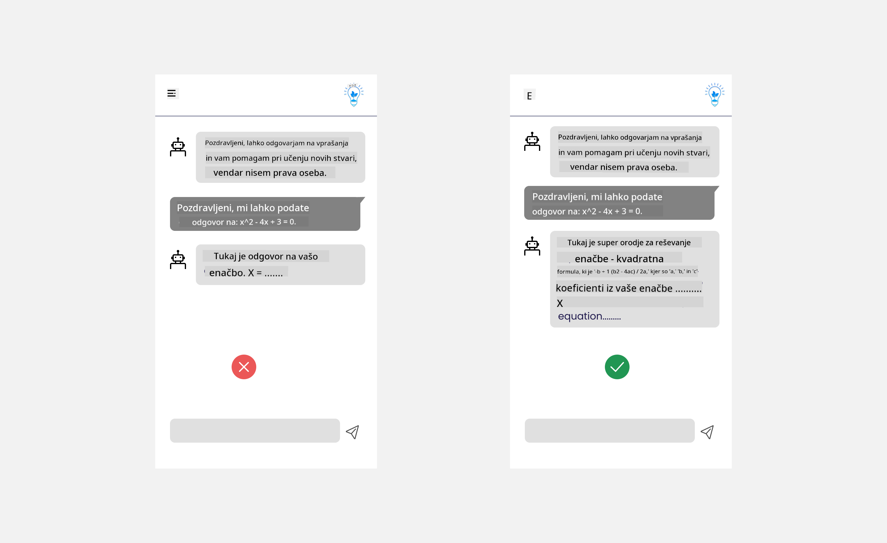

<!--
CO_OP_TRANSLATOR_METADATA:
{
  "original_hash": "ec385b41ee50579025d50cc03bfb3a25",
  "translation_date": "2025-07-09T15:06:32+00:00",
  "source_file": "12-designing-ux-for-ai-applications/README.md",
  "language_code": "sl"
}
-->
# Oblikovanje UX za AI aplikacije

> _(Kliknite na zgornjo sliko za ogled videa te lekcije)_

Uporabniška izkušnja je zelo pomemben vidik pri razvoju aplikacij. Uporabniki morajo lahko vašo aplikacijo uporabljati učinkovito za opravljanje nalog. Učinkovitost je ena stvar, vendar morate aplikacije oblikovati tudi tako, da jih lahko uporablja vsakdo, torej da so _dostopne_. Ta poglavje se bo osredotočilo na to področje, da boste na koncu oblikovali aplikacijo, ki jo ljudje lahko in želijo uporabljati.

## Uvod

Uporabniška izkušnja opisuje, kako uporabnik sodeluje in uporablja določen izdelek ali storitev, naj bo to sistem, orodje ali oblikovanje. Pri razvoju AI aplikacij razvijalci ne skrbijo le za učinkovito uporabniško izkušnjo, ampak tudi za etičnost. V tej lekciji bomo obravnavali, kako zgraditi aplikacije umetne inteligence (AI), ki zadovoljujejo potrebe uporabnikov.

Lekcija bo zajemala naslednja področja:

- Uvod v uporabniško izkušnjo in razumevanje potreb uporabnikov
- Oblikovanje AI aplikacij za zaupanje in preglednost
- Oblikovanje AI aplikacij za sodelovanje in povratne informacije

## Cilji učenja

Po opravljeni lekciji boste znali:

- Razumeti, kako zgraditi AI aplikacije, ki zadovoljujejo potrebe uporabnikov.
- Oblikovati AI aplikacije, ki spodbujajo zaupanje in sodelovanje.

### Predpogoji

Vzemite si čas in preberite več o [uporabniški izkušnji in oblikovalskem razmišljanju.](https://learn.microsoft.com/training/modules/ux-design?WT.mc_id=academic-105485-koreyst)

## Uvod v uporabniško izkušnjo in razumevanje potreb uporabnikov

V našem izmišljenem izobraževalnem startupu imamo dva glavna uporabnika, učitelje in učence. Vsak od njiju ima svoje edinstvene potrebe. Oblikovanje, osredotočeno na uporabnika, postavlja uporabnika v ospredje in zagotavlja, da so izdelki relevantni in koristni za tiste, za katere so namenjeni.

Aplikacija mora biti **uporabna, zanesljiva, dostopna in prijetna**, da zagotovi dobro uporabniško izkušnjo.

### Uporabnost

Biti uporaben pomeni, da ima aplikacija funkcionalnosti, ki ustrezajo njenemu namenu, na primer avtomatizacijo ocenjevanja ali ustvarjanje kartic za ponavljanje. Aplikacija, ki avtomatizira ocenjevanje, mora natančno in učinkovito dodeljevati ocene na podlagi vnaprej določenih kriterijev. Podobno mora aplikacija, ki ustvarja kartice za ponavljanje, ustvarjati relevantna in raznolika vprašanja na podlagi svojih podatkov.

### Zanesljivost

Biti zanesljiv pomeni, da aplikacija dosledno in brez napak opravlja svoje naloge. Vendar pa AI, tako kot ljudje, ni popolna in je lahko dovzetna za napake. Aplikacije se lahko srečajo z napakami ali nepričakovanimi situacijami, ki zahtevajo človeško posredovanje ali popravke. Kako ravnate z napakami? V zadnjem delu te lekcije bomo obravnavali, kako so AI sistemi in aplikacije oblikovani za sodelovanje in povratne informacije.

### Dostopnost

Biti dostopen pomeni razširiti uporabniško izkušnjo na uporabnike z različnimi zmožnostmi, vključno z osebami z invalidnostmi, da nihče ni izključen. Sledenje smernicam in načelom dostopnosti naredi AI rešitve bolj vključujoče, uporabne in koristne za vse uporabnike.

### Prijetnost

Biti prijeten pomeni, da je uporaba aplikacije prijetna. Privlačna uporabniška izkušnja lahko pozitivno vpliva na uporabnika, ga spodbuja k ponovni uporabi aplikacije in povečuje poslovni prihodek.

Ne moremo rešiti vseh izzivov z AI. AI pride v poštev kot dopolnilo uporabniški izkušnji, naj bo to avtomatizacija ročnih opravil ali personalizacija uporabniških izkušenj.

## Oblikovanje AI aplikacij za zaupanje in preglednost

Gradnja zaupanja je ključna pri oblikovanju AI aplikacij. Zaupanje zagotavlja, da je uporabnik prepričan, da bo aplikacija opravila delo, dosledno dostavila rezultate in da so ti rezultati tisto, kar uporabnik potrebuje. Tveganje na tem področju sta nezaupanje in preveliko zaupanje. Nezaupanje nastane, ko uporabnik nima ali ima zelo malo zaupanja v AI sistem, kar vodi do zavrnitve aplikacije. Preveliko zaupanje pa nastane, ko uporabnik preceni zmogljivosti AI sistema, kar vodi do prevelikega zaupanja. Na primer, avtomatiziran sistem ocenjevanja lahko pri prevelikem zaupanju privede do tega, da učitelj ne pregleda nekaterih nalog, da preveri pravilnost ocenjevanja. To lahko povzroči nepravične ali netočne ocene za učence ali zamujene priložnosti za povratne informacije in izboljšave.

Dva načina, da zaupanje postavimo v središče oblikovanja, sta razložljivost in nadzor.

### Razložljivost

Ko AI pomaga pri odločanju, na primer pri prenašanju znanja na prihodnje generacije, je ključno, da učitelji in starši razumejo, kako AI sprejema odločitve. To je razložljivost – razumevanje, kako AI aplikacije sprejemajo odločitve. Oblikovanje za razložljivost vključuje dodajanje primerov, kaj AI aplikacija zmore. Na primer, namesto "Začni z AI učiteljem" lahko sistem uporabi: "Povzemite svoje zapiske za lažje ponavljanje z AI."

Drug primer je, kako AI uporablja uporabniške in osebne podatke. Na primer, uporabnik s persono učenca ima lahko omejitve glede na svojo persono. AI morda ne bo mogel razkriti odgovorov na vprašanja, lahko pa pomaga uporabnika usmeriti, kako razmisliti o rešitvi problema.

Zadnji ključni del razložljivosti je poenostavitev razlag. Učenci in učitelji morda niso strokovnjaki za AI, zato morajo biti razlage o tem, kaj aplikacija lahko ali ne more narediti, preproste in lahko razumljive.

### Nadzor

Generativna AI ustvarja sodelovanje med AI in uporabnikom, kjer lahko uporabnik na primer spreminja pozive za različne rezultate. Poleg tega naj bi uporabniki lahko po generiranju izhoda tudi spreminjali rezultate, kar jim daje občutek nadzora. Na primer, pri uporabi Binga lahko prilagodite poziv glede na format, ton in dolžino. Prav tako lahko dodate spremembe in prilagodite izhod, kot je prikazano spodaj:

Druga funkcija v Bingu, ki uporabniku omogoča nadzor nad aplikacijo, je možnost, da se odloči za vključitev ali izključitev podatkov, ki jih AI uporablja. Za šolsko aplikacijo bi učenec morda želel uporabiti svoje zapiske in tudi učiteljeve vire kot gradivo za ponavljanje.

> Pri oblikovanju AI aplikacij je ključna namernost, da uporabniki ne zaupajo preveč in ne postavijo nerealnih pričakovanj glede zmogljivosti. Eden od načinov za to je ustvarjanje trenja med pozivi in rezultati. Spomniti uporabnika, da gre za AI in ne za drugega človeka.

## Oblikovanje AI aplikacij za sodelovanje in povratne informacije

Kot smo že omenili, generativna AI ustvarja sodelovanje med uporabnikom in AI. Večina interakcij poteka tako, da uporabnik vnese poziv, AI pa ustvari izhod. Kaj pa, če je izhod napačen? Kako aplikacija ravna z napakami, če se pojavijo? Ali AI krivi uporabnika ali si vzame čas za razlago napake?

AI aplikacije bi morale biti zasnovane tako, da sprejemajo in dajejo povratne informacije. To ne le pomaga izboljšati AI sistem, ampak tudi gradi zaupanje med uporabniki. V oblikovanje je treba vključiti povratno zanko, na primer preprost palec gor ali dol za izhod.

Drug način za ravnanje s tem je jasno sporočanje zmogljivosti in omejitev sistema. Ko uporabnik naredi napako in zahteva nekaj, kar presega zmogljivosti AI, mora obstajati tudi način za obravnavo tega, kot je prikazano spodaj.

Sistemske napake so pogoste pri aplikacijah, kjer uporabnik morda potrebuje pomoč z informacijami zunaj obsega AI ali pa ima aplikacija omejitev glede števila vprašanj/predmetov, za katere lahko uporabnik ustvari povzetke. Na primer, AI aplikacija, usposobljena z omejenimi podatki o predmetih, kot sta zgodovina in matematika, morda ne bo zmogla obravnavati vprašanj iz geografije. Da bi to omilili, lahko AI sistem odgovori z: "Oprostite, naš izdelek je bil usposobljen z podatki za naslednje predmete..., ne morem odgovoriti na vaše vprašanje."

AI aplikacije niso popolne, zato bodo zagotovo delale napake. Pri oblikovanju aplikacij morate zagotoviti prostor za povratne informacije uporabnikov in ravnanje z napakami na preprost in lahko razumljiv način.

## Naloga

Vzemite katero koli AI aplikacijo, ki ste jo doslej razvili, in razmislite o uvedbi spodnjih korakov v vaši aplikaciji:

- **Prijetnost:** Razmislite, kako lahko vašo aplikacijo naredite bolj prijetno. Ali dodajate razlage povsod? Ali spodbujate uporabnika k raziskovanju? Kako oblikujete sporočila o napakah?

- **Uporabnost:** Gradite spletno aplikacijo. Poskrbite, da bo vaša aplikacija dostopna tako z miško kot s tipkovnico.

- **Zaupanje in preglednost:** Ne zaupajte AI in njenim izhodom povsem. Razmislite, kako bi vključili človeka v proces za preverjanje izhoda. Prav tako razmislite in izvedite druge načine za dosego zaupanja in preglednosti.

- **Nadzor:** Dajte uporabniku nadzor nad podatki, ki jih posreduje aplikaciji. Uvedite možnost, da se uporabnik lahko odloči za vključitev ali izključitev zbiranja podatkov v AI aplikaciji.

## Nadaljujte z učenjem!

Po zaključku te lekcije si oglejte našo [Generative AI Learning collection](https://aka.ms/genai-collection?WT.mc_id=academic-105485-koreyst) in nadgradite svoje znanje o generativni AI!

Pojdite na Lekcijo 13, kjer bomo pogledali, kako [zagotoviti varnost AI aplikacij](../13-securing-ai-applications/README.md?WT.mc_id=academic-105485-koreyst)!

**Omejitev odgovornosti**:  
Ta dokument je bil preveden z uporabo storitve za avtomatski prevod AI [Co-op Translator](https://github.com/Azure/co-op-translator). Čeprav si prizadevamo za natančnost, vas opozarjamo, da lahko avtomatizirani prevodi vsebujejo napake ali netočnosti. Izvirni dokument v njegovem izvirnem jeziku velja za avtoritativni vir. Za ključne informacije priporočamo strokovni človeški prevod. Za morebitne nesporazume ali napačne interpretacije, ki izhajajo iz uporabe tega prevoda, ne odgovarjamo.